# API Reference

<cite>
**Referenced Files in This Document**
- [supabase/functions/_shared/http.ts](file://supabase/functions/_shared/http.ts)
- [supabase/functions/_shared/entitlement.ts](file://supabase/functions/_shared/entitlement.ts)
- [supabase/functions/_shared/paypal.ts](file://supabase/functions/_shared/paypal.ts)
- [supabase/functions/_shared/paypal-runtime.ts](file://supabase/functions/_shared/paypal-runtime.ts)
- [supabase/functions/create-checkout/index.ts](file://supabase/functions/create-checkout/index.ts)
- [supabase/functions/cancel-subscription/index.ts](file://supabase/functions/cancel-subscription/index.ts)
- [supabase/functions/capture-paypal-order/index.ts](file://supabase/functions/capture-paypal-order/index.ts)
- [supabase/functions/create-paypal-order/index.ts](file://supabase/functions/create-paypal-order/index.ts)
- [supabase/functions/paymongo-webhook/index.ts](file://supabase/functions/paymongo-webhook/index.ts)
- [supabase/functions/paypal-webhook/index.ts](file://supabase/functions/paypal-webhook/index.ts)
- [supabase/functions/ai-proxy/index.ts](file://supabase/functions/ai-proxy/index.ts)
- [supabase/functions/download-message-pack/index.ts](file://supabase/functions/download-message-pack/index.ts)
- [supabase/migrations/001_schema.sql](file://supabase/migrations/001_schema.sql)
- [supabase/migrations/002_paypal_fulfillment.sql](file://supabase/migrations/002_paypal_fulfillment.sql)
- [src/lib/supabase.js](file://src/lib/supabase.js)
- [src/lib/billing.js](file://src/lib/billing.js)
- [src/lib/entitlement.js](file://src/lib/entitlement.js)
- [src/lib/cloud.js](file://src/lib/cloud.js)
- [src/auth.jsx](file://src/auth.jsx)
</cite>

## Table of Contents
1. Introduction
2. Project Structure
3. Core Components
4. Architecture Overview
5. Detailed Component Analysis
6. Dependency Analysis
7. Performance Considerations
8. Troubleshooting Guide
9. Conclusion

## Introduction
This document provides a comprehensive API reference for ApplyGuard PH’s backend services hosted on Supabase Edge Functions. It covers:
- HTTP endpoints for billing, subscriptions, and AI proxying
- Webhook interfaces for payment processors (PayMongo and PayPal)
- Authentication requirements and shared utilities
- Security headers, rate limiting considerations, and versioning strategies
- Client integration patterns using the frontend SDKs and libraries
- Error handling and troubleshooting guidance

The goal is to enable developers to integrate securely and reliably with the backend services.

## Project Structure
The backend is implemented as Supabase Edge Functions under supabase/functions. Shared logic resides in supabase/functions/_shared. Database schema and migrations are under supabase/migrations. The frontend client code integrates via src/lib modules and auth flows.

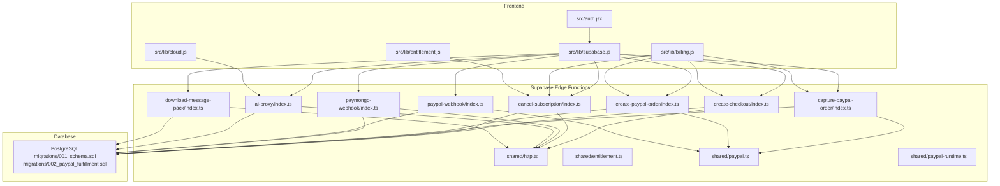

**Diagram sources**
- [supabase/functions/create-checkout/index.ts](file://supabase/functions/create-checkout/index.ts)
- [supabase/functions/cancel-subscription/index.ts](file://supabase/functions/cancel-subscription/index.ts)
- [supabase/functions/capture-paypal-order/index.ts](file://supabase/functions/capture-paypal-order/index.ts)
- [supabase/functions/create-paypal-order/index.ts](file://supabase/functions/create-paypal-order/index.ts)
- [supabase/functions/paymongo-webhook/index.ts](file://supabase/functions/paymongo-webhook/index.ts)
- [supabase/functions/paypal-webhook/index.ts](file://supabase/functions/paypal-webhook/index.ts)
- [supabase/functions/ai-proxy/index.ts](file://supabase/functions/ai-proxy/index.ts)
- [supabase/functions/download-message-pack/index.ts](file://supabase/functions/download-message-pack/index.ts)
- [supabase/functions/_shared/http.ts](file://supabase/functions/_shared/http.ts)
- [supabase/functions/_shared/entitlement.ts](file://supabase/functions/_shared/entitlement.ts)
- [supabase/functions/_shared/paypal.ts](file://supabase/functions/_shared/paypal.ts)
- [supabase/functions/_shared/paypal-runtime.ts](file://supabase/functions/_shared/paypal-runtime.ts)
- [supabase/migrations/001_schema.sql](file://supabase/migrations/001_schema.sql)
- [supabase/migrations/002_paypal_fulfillment.sql](file://supabase/migrations/002_paypal_fulfillment.sql)
- [src/lib/supabase.js](file://src/lib/supabase.js)
- [src/lib/billing.js](file://src/lib/billing.js)
- [src/lib/entitlement.js](file://src/lib/entitlement.js)
- [src/lib/cloud.js](file://src/lib/cloud.js)
- [src/auth.jsx](file://src/auth.jsx)

**Section sources**
- [supabase/functions/_shared/http.ts](file://supabase/functions/_shared/http.ts)
- [supabase/functions/_shared/entitlement.ts](file://supabase/functions/_shared/entitlement.ts)
- [supabase/functions/_shared/paypal.ts](file://supabase/functions/_shared/paypal.ts)
- [supabase/functions/_shared/paypal-runtime.ts](file://supabase/functions/_shared/paypal-runtime.ts)
- [supabase/functions/create-checkout/index.ts](file://supabase/functions/create-checkout/index.ts)
- [supabase/functions/cancel-subscription/index.ts](file://supabase/functions/cancel-subscription/index.ts)
- [supabase/functions/capture-paypal-order/index.ts](file://supabase/functions/capture-paypal-order/index.ts)
- [supabase/functions/create-paypal-order/index.ts](file://supabase/functions/create-paypal-order/index.ts)
- [supabase/functions/paymongo-webhook/index.ts](file://supabase/functions/paymongo-webhook/index.ts)
- [supabase/functions/paypal-webhook/index.ts](file://supabase/functions/paypal-webhook/index.ts)
- [supabase/functions/ai-proxy/index.ts](file://supabase/functions/ai-proxy/index.ts)
- [supabase/functions/download-message-pack/index.ts](file://supabase/functions/download-message-pack/index.ts)
- [supabase/migrations/001_schema.sql](file://supabase/migrations/001_schema.sql)
- [supabase/migrations/002_paypal_fulfillment.sql](file://supabase/migrations/002_paypal_fulfillment.sql)
- [src/lib/supabase.js](file://src/lib/supabase.js)
- [src/lib/billing.js](file://src/lib/billing.js)
- [src/lib/entitlement.js](file://src/lib/entitlement.js)
- [src/lib/cloud.js](file://src/lib/cloud.js)
- [src/auth.jsx](file://src/auth.jsx)

## Core Components
- Shared HTTP utilities: Centralized request/response helpers used by all Edge Functions for consistent error handling, CORS, and JSON responses.
- Entitlement service: Encapsulates entitlement checks and updates across functions.
- PayPal integration: Utilities for creating orders, capturing payments, and verifying webhook signatures.
- Billing endpoints: Create checkout sessions, cancel subscriptions, create PayPal orders, capture PayPal orders.
- Payment webhooks: PayMongo and PayPal webhook handlers for order lifecycle events.
- AI proxy: Securely proxies AI requests from the client to external providers.
- Message pack download: Generates downloadable message packs for users.

Key responsibilities and interactions are detailed in the following sections.

**Section sources**
- [supabase/functions/_shared/http.ts](file://supabase/functions/_shared/http.ts)
- [supabase/functions/_shared/entitlement.ts](file://supabase/functions/_shared/entitlement.ts)
- [supabase/functions/_shared/paypal.ts](file://supabase/functions/_shared/paypal.ts)
- [supabase/functions/_shared/paypal-runtime.ts](file://supabase/functions/_shared/paypal-runtime.ts)

## Architecture Overview
The system exposes REST APIs via Supabase Edge Functions. Clients authenticate through Supabase Auth and call function endpoints for billing, entitlements, and AI proxying. Payment processors send webhooks to dedicated endpoints that update database state.

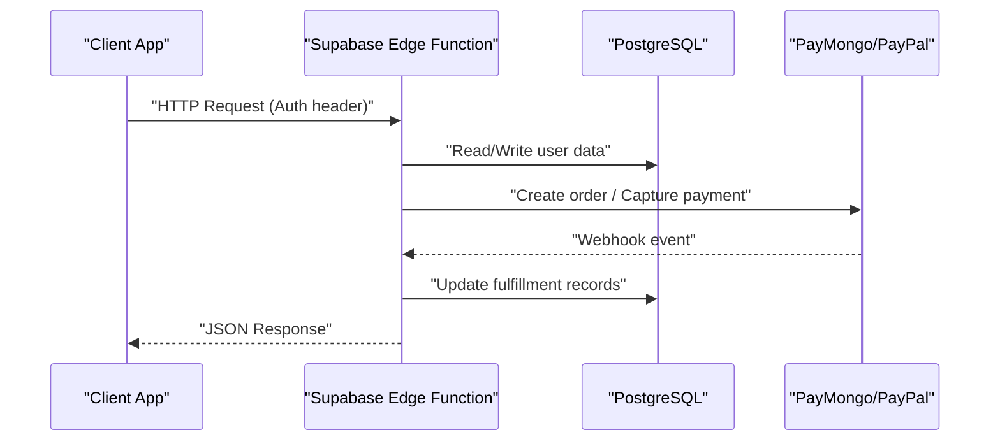

**Diagram sources**
- [supabase/functions/create-checkout/index.ts](file://supabase/functions/create-checkout/index.ts)
- [supabase/functions/capture-paypal-order/index.ts](file://supabase/functions/capture-paypal-order/index.ts)
- [supabase/functions/paymongo-webhook/index.ts](file://supabase/functions/paymongo-webhook/index.ts)
- [supabase/functions/paypal-webhook/index.ts](file://supabase/functions/paypal-webhook/index.ts)
- [supabase/migrations/001_schema.sql](file://supabase/migrations/001_schema.sql)
- [supabase/migrations/002_paypal_fulfillment.sql](file://supabase/migrations/002_paypal_fulfillment.sql)

## Detailed Component Analysis

### Authentication and Authorization
- All protected endpoints require a valid Supabase session token passed in the Authorization header.
- Shared utilities validate tokens and enforce row-level security policies defined in the database schema.
- Entitlement checks are performed before granting access to premium features.

Security considerations:
- Always include Authorization: Bearer <token>.
- Ensure RLS policies restrict access to user-owned rows.
- Validate inputs server-side; do not trust client-provided claims.

**Section sources**
- [supabase/functions/_shared/http.ts](file://supabase/functions/_shared/http.ts)
- [supabase/functions/_shared/entitlement.ts](file://supabase/functions/_shared/entitlement.ts)
- [supabase/migrations/001_schema.sql](file://supabase/migrations/001_schema.sql)

### HTTP Utilities and Common Patterns
- Centralized response builder standardizes status codes, headers, and JSON payloads.
- Consistent error mapping returns structured errors with codes and messages.
- CORS configuration allows browser-based clients to call functions securely.

Usage patterns:
- Use the shared helper to return success or error responses.
- Wrap database calls with try/catch and map exceptions to standardized error objects.

**Section sources**
- [supabase/functions/_shared/http.ts](file://supabase/functions/_shared/http.ts)

### Billing Endpoints

#### Create Checkout Session
- Purpose: Initiate a checkout flow for subscription or one-time purchase.
- Method: POST
- Path: /functions/v1/create-checkout
- Authentication: Required (Bearer token)
- Request body:
  - plan_id: string
  - quantity: number (optional)
  - metadata: object (optional)
- Response:
  - checkout_url: string
  - session_id: string
  - expires_at: timestamp
- Errors:
  - 400 Bad Request: Invalid parameters
  - 401 Unauthorized: Missing or invalid token
  - 500 Internal Server Error: Provider or DB failure

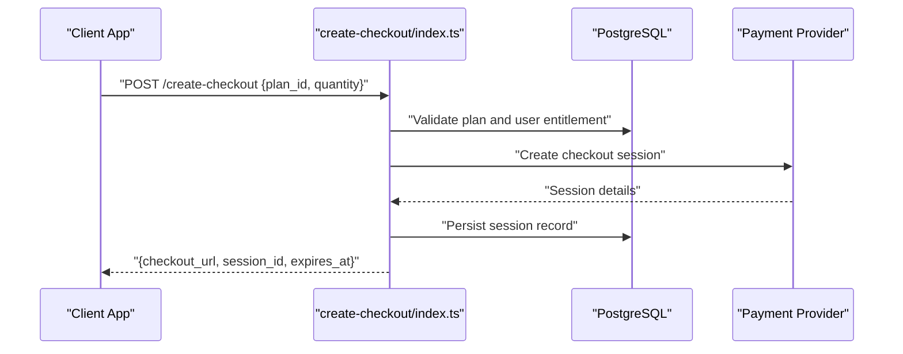

**Diagram sources**
- [supabase/functions/create-checkout/index.ts](file://supabase/functions/create-checkout/index.ts)
- [supabase/migrations/001_schema.sql](file://supabase/migrations/001_schema.sql)

**Section sources**
- [supabase/functions/create-checkout/index.ts](file://supabase/functions/create-checkout/index.ts)
- [supabase/migrations/001_schema.sql](file://supabase/migrations/001_schema.sql)

#### Cancel Subscription
- Purpose: Cancel an active subscription for the authenticated user.
- Method: POST
- Path: /functions/v1/cancel-subscription
- Authentication: Required (Bearer token)
- Request body:
  - subscription_id: string
- Response:
  - cancelled: boolean
  - cancellation_date: timestamp
- Errors:
  - 400 Bad Request: Missing subscription_id
  - 401 Unauthorized: Missing or invalid token
  - 404 Not Found: Subscription not found
  - 500 Internal Server Error: Provider or DB failure

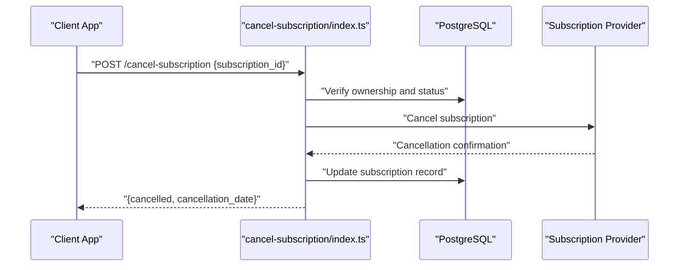

**Diagram sources**
- [supabase/functions/cancel-subscription/index.ts](file://supabase/functions/cancel-subscription/index.ts)
- [supabase/migrations/001_schema.sql](file://supabase/migrations/001_schema.sql)

**Section sources**
- [supabase/functions/cancel-subscription/index.ts](file://supabase/functions/cancel-subscription/index.ts)
- [supabase/migrations/001_schema.sql](file://supabase/migrations/001_schema.sql)

#### Create PayPal Order
- Purpose: Create a PayPal order for checkout.
- Method: POST
- Path: /functions/v1/create-paypal-order
- Authentication: Required (Bearer token)
- Request body:
  - amount: number
  - currency: string
  - description: string
- Response:
  - order_id: string
  - approve_url: string
- Errors:
  - 400 Bad Request: Invalid amount or currency
  - 401 Unauthorized: Missing or invalid token
  - 500 Internal Server Error: PayPal API failure

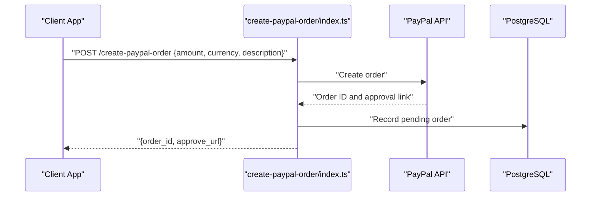

**Diagram sources**
- [supabase/functions/create-paypal-order/index.ts](file://supabase/functions/create-paypal-order/index.ts)
- [supabase/functions/_shared/paypal.ts](file://supabase/functions/_shared/paypal.ts)
- [supabase/migrations/001_schema.sql](file://supabase/migrations/001_schema.sql)

**Section sources**
- [supabase/functions/create-paypal-order/index.ts](file://supabase/functions/create-paypal-order/index.ts)
- [supabase/functions/_shared/paypal.ts](file://supabase/functions/_shared/paypal.ts)
- [supabase/migrations/001_schema.sql](file://supabase/migrations/001_schema.sql)

#### Capture PayPal Order
- Purpose: Capture payment after user approves the PayPal order.
- Method: POST
- Path: /functions/v1/capture-paypal-order
- Authentication: Required (Bearer token)
- Request body:
  - order_id: string
- Response:
  - captured: boolean
  - transaction_id: string
  - captured_at: timestamp
- Errors:
  - 400 Bad Request: Missing order_id
  - 401 Unauthorized: Missing or invalid token
  - 404 Not Found: Order not found
  - 500 Internal Server Error: PayPal capture failure

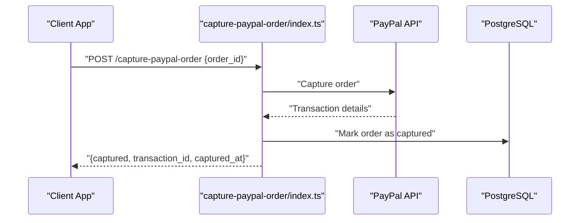

**Diagram sources**
- [supabase/functions/capture-paypal-order/index.ts](file://supabase/functions/capture-paypal-order/index.ts)
- [supabase/functions/_shared/paypal.ts](file://supabase/functions/_shared/paypal.ts)
- [supabase/migrations/001_schema.sql](file://supabase/migrations/001_schema.sql)

**Section sources**
- [supabase/functions/capture-paypal-order/index.ts](file://supabase/functions/capture-paypal-order/index.ts)
- [supabase/functions/_shared/paypal.ts](file://supabase/functions/_shared/paypal.ts)
- [supabase/migrations/001_schema.sql](file://supabase/migrations/001_schema.sql)

### Payment Webhooks

#### PayMongo Webhook
- Purpose: Receive and process PayMongo events (payment succeeded, failed, refunded).
- Method: POST
- Path: /functions/v1/paymongo-webhook
- Authentication: None (signature verification required)
- Headers:
  - X-PayMongo-Signature: string
- Request body:
  - event_type: string
  - data: object
- Response:
  - 200 OK if processed successfully
- Signature Verification:
  - Verify HMAC signature using configured secret.
  - Reject requests with missing or invalid signatures.
- Retry Mechanism:
  - Idempotency keys ensure duplicate events are ignored.
  - Return 200 only after successful processing.

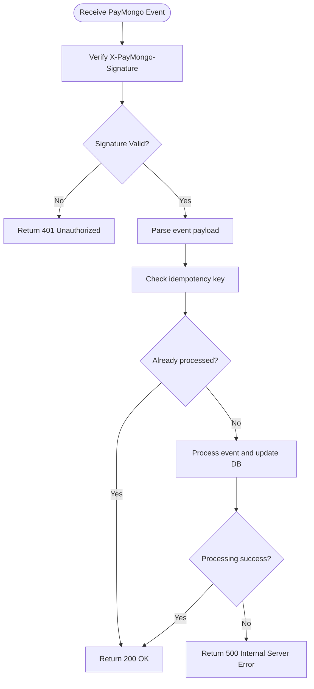

**Diagram sources**
- [supabase/functions/paymongo-webhook/index.ts](file://supabase/functions/paymongo-webhook/index.ts)
- [supabase/migrations/001_schema.sql](file://supabase/migrations/001_schema.sql)

**Section sources**
- [supabase/functions/paymongo-webhook/index.ts](file://supabase/functions/paymongo-webhook/index.ts)
- [supabase/migrations/001_schema.sql](file://supabase/migrations/001_schema.sql)

#### PayPal Webhook
- Purpose: Receive and process PayPal events (order approved, captured, refunded).
- Method: POST
- Path: /functions/v1/paypal-webhook
- Authentication: None (signature verification required)
- Headers:
  - PayPal-Transmission-Id: string
  - PayPal-Transmission-Time: string
  - PayPal-Transmission-Sig: string
  - PayPal-Cert-Url: string
- Request body:
  - event_version: string
  - resource: object
- Response:
  - 200 OK if processed successfully
- Signature Verification:
  - Fetch certificate from PayPal-Cert-Url and verify transmission signature.
  - Validate transmission ID and time to prevent replay attacks.
- Retry Mechanism:
  - Store transmission IDs to avoid reprocessing.
  - Return 200 only after successful processing.

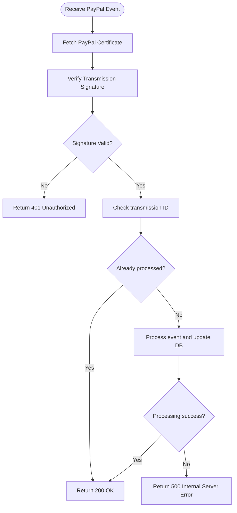

**Diagram sources**
- [supabase/functions/paypal-webhook/index.ts](file://supabase/functions/paypal-webhook/index.ts)
- [supabase/functions/_shared/paypal.ts](file://supabase/functions/_shared/paypal.ts)
- [supabase/migrations/002_paypal_fulfillment.sql](file://supabase/migrations/002_paypal_fulfillment.sql)

**Section sources**
- [supabase/functions/paypal-webhook/index.ts](file://supabase/functions/paypal-webhook/index.ts)
- [supabase/functions/_shared/paypal.ts](file://supabase/functions/_shared/paypal.ts)
- [supabase/migrations/002_paypal_fulfillment.sql](file://supabase/migrations/002_paypal_fulfillment.sql)

### AI Proxy Endpoint
- Purpose: Securely proxy AI requests from the client to external AI providers.
- Method: POST
- Path: /functions/v1/ai-proxy
- Authentication: Required (Bearer token)
- Request body:
  - model: string
  - prompt: string
  - options: object (optional)
- Response:
  - result: string
  - usage: object
- Errors:
  - 400 Bad Request: Missing model or prompt
  - 401 Unauthorized: Missing or invalid token
  - 500 Internal Server Error: Provider API failure

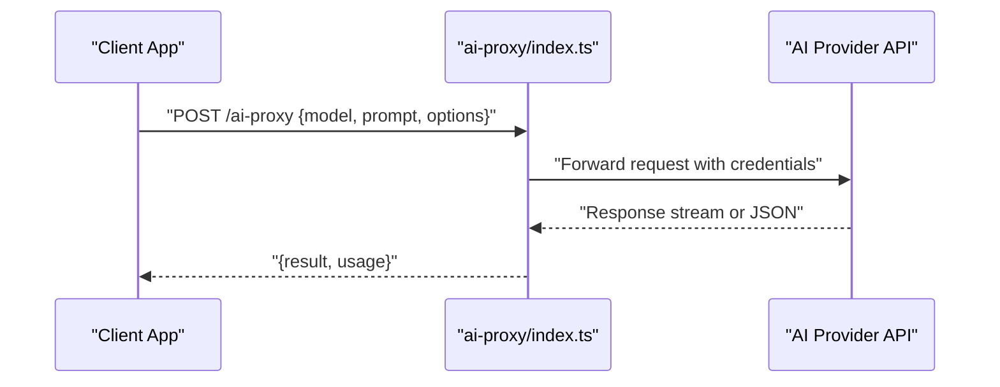

**Diagram sources**
- [supabase/functions/ai-proxy/index.ts](file://supabase/functions/ai-proxy/index.ts)

**Section sources**
- [supabase/functions/ai-proxy/index.ts](file://supabase/functions/ai-proxy/index.ts)

### Download Message Pack
- Purpose: Generate and serve a downloadable message pack for the authenticated user.
- Method: GET
- Path: /functions/v1/download-message-pack
- Authentication: Required (Bearer token)
- Query parameters:
  - format: string (e.g., "json", "csv")
- Response:
  - File stream with appropriate Content-Type
- Errors:
  - 401 Unauthorized: Missing or invalid token
  - 400 Bad Request: Unsupported format
  - 500 Internal Server Error: Generation failure

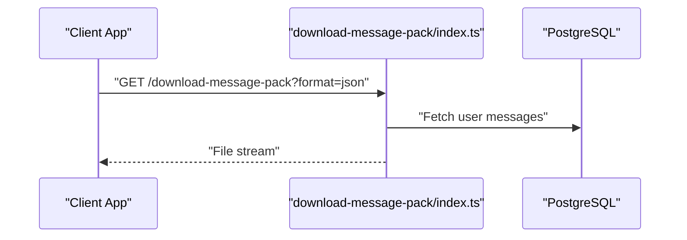

**Diagram sources**
- [supabase/functions/download-message-pack/index.ts](file://supabase/functions/download-message-pack/index.ts)
- [supabase/migrations/001_schema.sql](file://supabase/migrations/001_schema.sql)

**Section sources**
- [supabase/functions/download-message-pack/index.ts](file://supabase/functions/download-message-pack/index.ts)
- [supabase/migrations/001_schema.sql](file://supabase/migrations/001_schema.sql)

### WebSocket APIs
- No WebSocket endpoints are implemented in this repository. Real-time features should be handled via Supabase Realtime channels if needed.

[No sources needed since this section doesn't analyze specific files]

### Rate Limiting and Security Headers
- Rate limiting: Implement at the edge layer or via Supabase limits. Avoid per-request heavy computations without caching.
- Security headers: Set CORS origins explicitly; include Content-Type: application/json for JSON responses.
- Versioning: Use path-based versioning (/functions/v1/...) to maintain backward compatibility.

Best practices:
- Validate and sanitize all inputs.
- Log errors with correlation IDs for tracing.
- Use idempotency keys for webhook processing.

[No sources needed since this section provides general guidance]

### Client Integration Examples

#### Using Supabase JS Client
- Initialize the client with your project URL and anon/public key.
- Call Edge Functions via the Supabase client’s RPC-like methods.

Example pattern:
- Import the Supabase client.
- Authenticate the user.
- Invoke function endpoints with proper headers.

**Section sources**
- [src/lib/supabase.js](file://src/lib/supabase.js)
- [src/auth.jsx](file://src/auth.jsx)

#### Billing Library Usage
- Use the billing library to orchestrate checkout flows and subscription management.
- Handle redirects to provider URLs returned by the backend.

**Section sources**
- [src/lib/billing.js](file://src/lib/billing.js)

#### Entitlement Checks
- Use the entitlement library to check feature access based on subscription status.
- Cache results locally when appropriate.

**Section sources**
- [src/lib/entitlement.js](file://src/lib/entitlement.js)

#### Cloud Utilities
- Leverage cloud utilities for secure communication with Edge Functions.
- Centralize error handling and retries.

**Section sources**
- [src/lib/cloud.js](file://src/lib/cloud.js)

## Dependency Analysis
The following diagram shows dependencies between shared modules and function implementations.

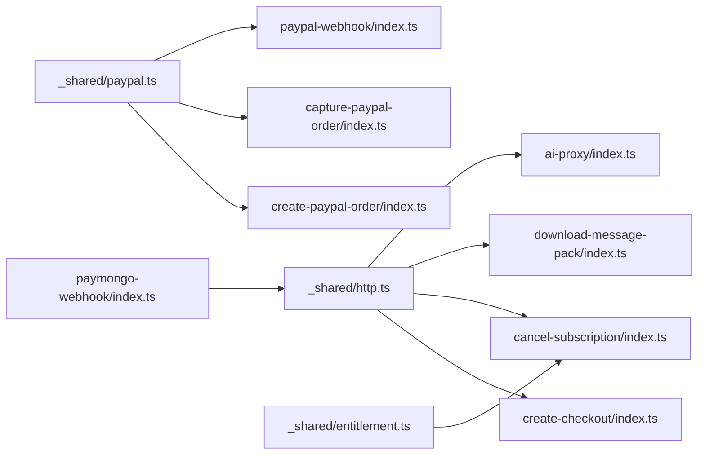

**Diagram sources**
- [supabase/functions/_shared/http.ts](file://supabase/functions/_shared/http.ts)
- [supabase/functions/_shared/entitlement.ts](file://supabase/functions/_shared/entitlement.ts)
- [supabase/functions/_shared/paypal.ts](file://supabase/functions/_shared/paypal.ts)
- [supabase/functions/create-checkout/index.ts](file://supabase/functions/create-checkout/index.ts)
- [supabase/functions/cancel-subscription/index.ts](file://supabase/functions/cancel-subscription/index.ts)
- [supabase/functions/capture-paypal-order/index.ts](file://supabase/functions/capture-paypal-order/index.ts)
- [supabase/functions/create-paypal-order/index.ts](file://supabase/functions/create-paypal-order/index.ts)
- [supabase/functions/paymongo-webhook/index.ts](file://supabase/functions/paymongo-webhook/index.ts)
- [supabase/functions/paypal-webhook/index.ts](file://supabase/functions/paypal-webhook/index.ts)
- [supabase/functions/download-message-pack/index.ts](file://supabase/functions/download-message-pack/index.ts)
- [supabase/functions/ai-proxy/index.ts](file://supabase/functions/ai-proxy/index.ts)

**Section sources**
- [supabase/functions/_shared/http.ts](file://supabase/functions/_shared/http.ts)
- [supabase/functions/_shared/entitlement.ts](file://supabase/functions/_shared/entitlement.ts)
- [supabase/functions/_shared/paypal.ts](file://supabase/functions/_shared/paypal.ts)
- [supabase/functions/create-checkout/index.ts](file://supabase/functions/create-checkout/index.ts)
- [supabase/functions/cancel-subscription/index.ts](file://supabase/functions/cancel-subscription/index.ts)
- [supabase/functions/capture-paypal-order/index.ts](file://supabase/functions/capture-paypal-order/index.ts)
- [supabase/functions/create-paypal-order/index.ts](file://supabase/functions/create-paypal-order/index.ts)
- [supabase/functions/paymongo-webhook/index.ts](file://supabase/functions/paymongo-webhook/index.ts)
- [supabase/functions/paypal-webhook/index.ts](file://supabase/functions/paypal-webhook/index.ts)
- [supabase/functions/download-message-pack/index.ts](file://supabase/functions/download-message-pack/index.ts)
- [supabase/functions/ai-proxy/index.ts](file://supabase/functions/ai-proxy/index.ts)

## Performance Considerations
- Minimize database round-trips by batching operations where possible.
- Cache frequently accessed entitlement data at the edge level.
- Use streaming responses for large downloads like message packs.
- Implement exponential backoff for external API calls (PayPal, PayMongo).

[No sources needed since this section provides general guidance]

## Troubleshooting Guide
Common issues and resolutions:
- 401 Unauthorized: Ensure Authorization header includes a valid Bearer token.
- 400 Bad Request: Validate request body fields and types.
- 500 Internal Server Error: Check logs for provider failures or DB constraints.
- Webhook signature mismatch: Verify secrets and headers; confirm idempotency keys.
- Duplicate webhook processing: Confirm transmission/idempotency key storage.

Operational tips:
- Enable detailed logging in Edge Functions.
- Monitor error rates and latency metrics.
- Test webhook handlers with sandbox environments.

**Section sources**
- [supabase/functions/_shared/http.ts](file://supabase/functions/_shared/http.ts)
- [supabase/functions/paymongo-webhook/index.ts](file://supabase/functions/paymongo-webhook/index.ts)
- [supabase/functions/paypal-webhook/index.ts](file://supabase/functions/paypal-webhook/index.ts)

## Conclusion
ApplyGuard PH’s backend provides a robust set of Edge Function endpoints for billing, subscriptions, AI proxying, and data export. By following authentication requirements, validating signatures for webhooks, and adhering to best practices for security and performance, integrators can build reliable and scalable applications. For real-time features, consider leveraging Supabase Realtime channels as needed.