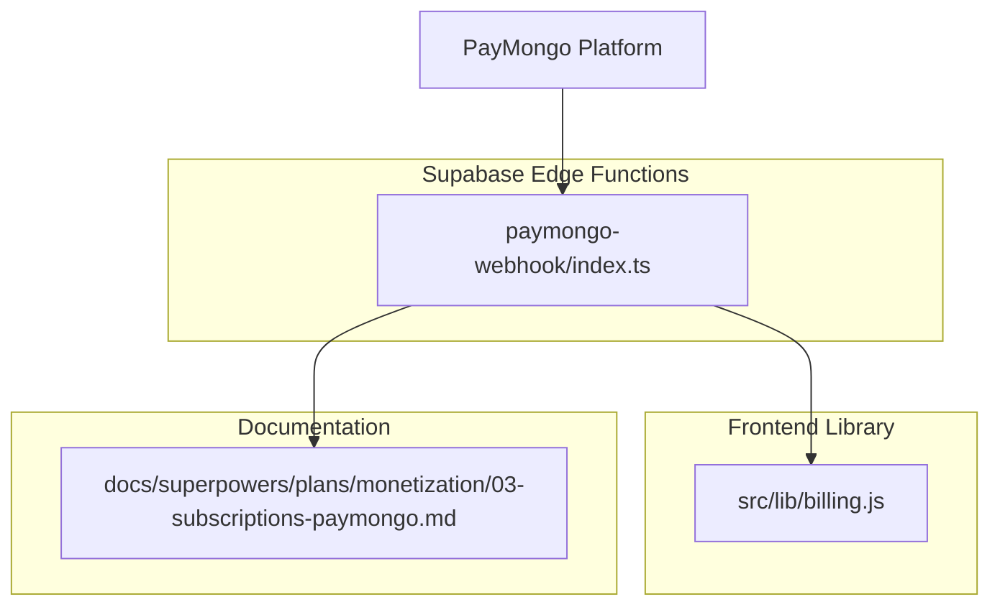
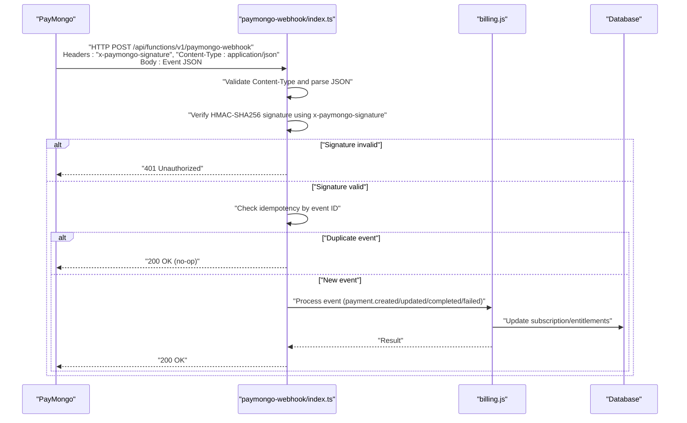
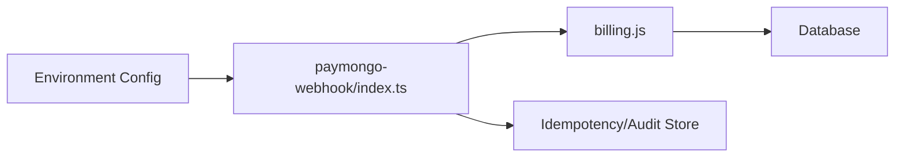

# PayMongo Webhook API

<cite>
**Referenced Files in This Document**
- [paymongo-webhook/index.ts](file://supabase/functions/paymongo-webhook/index.ts)
- [billing.js](file://src/lib/billing.js)
- [03-subscriptions-paymongo.md](file://docs/superpowers/plans/monetization/03-subscriptions-paymongo.md)
</cite>

## Table of Contents
1. [Introduction](#introduction)
2. [Project Structure](#project-structure)
3. [Core Components](#core-components)
4. [Architecture Overview](#architecture-overview)
5. [Detailed Component Analysis](#detailed-component-analysis)
6. [Dependency Analysis](#dependency-analysis)
7. [Performance Considerations](#performance-considerations)
8. [Troubleshooting Guide](#troubleshooting-guide)
9. [Conclusion](#conclusion)
10. [Appendices](#appendices)

## Introduction
This document provides comprehensive webhook API documentation for PayMongo payment processing as implemented in this project. It covers the webhook endpoint, HTTP methods, required headers, signature verification using HMAC-SHA256, event types and payloads, security requirements, testing strategies, debugging techniques, monitoring approaches, implementation examples, idempotency handling, error response formats, retry mechanisms, timeout handling, and failure recovery patterns.

The project implements a serverless webhook handler within Supabase Functions to receive and process PayMongo events, and integrates with billing logic to update entitlements and subscription state.

## Project Structure
The relevant parts of the codebase for PayMongo webhooks are:
- A Supabase Function that receives PayMongo webhook requests and processes them
- Billing utilities used by the function to update user entitlements and subscriptions
- Documentation describing the monetization architecture and PayMongo integration

**Diagram sources**
- [paymongo-webhook/index.ts](file://supabase/functions/paymongo-webhook/index.ts)
- [billing.js](file://src/lib/billing.js)
- [03-subscriptions-paymongo.md](file://docs/superpowers/plans/monetization/03-subscriptions-paymongo.md)

**Section sources**
- [paymongo-webhook/index.ts](file://supabase/functions/paymongo-webhook/index.ts)
- [billing.js](file://src/lib/billing.js)
- [03-subscriptions-paymongo.md](file://docs/superpowers/plans/monetization/03-subscriptions-paymongo.md)

## Core Components
- Webhook Handler (Supabase Function): Receives HTTP POST requests from PayMongo, validates signatures, parses events, enforces idempotency, updates billing state, and returns appropriate responses.
- Billing Integration: Provides functions to reconcile payments, activate or cancel subscriptions, and manage entitlements based on PayMongo events.
- Configuration and Secrets: The webhook handler reads environment variables such as the PayMongo secret key and any internal identifiers needed for reconciliation.

Key responsibilities:
- Validate request origin and signature
- Parse and normalize event payloads
- Ensure idempotent processing via event IDs
- Update database/state through billing utilities
- Return correct HTTP status codes and structured error responses

**Section sources**
- [paymongo-webhook/index.ts](file://supabase/functions/paymongo-webhook/index.ts)
- [billing.js](file://src/lib/billing.js)

## Architecture Overview
The webhook flow is designed to be secure, idempotent, and resilient.

**Diagram sources**
- [paymongo-webhook/index.ts](file://supabase/functions/paymongo-webhook/index.ts)
- [billing.js](file://src/lib/billing.js)

## Detailed Component Analysis

### Webhook Endpoint and Security
- Endpoint URL: The Supabase Function is exposed at a path under the platform’s functions base URL. Configure your PayMongo dashboard to send events to this URL.
- HTTP Method: POST only.
- Required Headers:
  - Content-Type: application/json
  - x-paymongo-signature: HMAC-SHA256 signature generated by PayMongo using your webhook secret key.
- Signature Verification:
  - Compute HMAC-SHA256 over the raw request body using the configured secret key.
  - Compare the computed signature with the value in x-paymongo-signature.
  - Reject requests where signatures do not match.
- Replay Attack Prevention:
  - Enforce idempotency by storing processed event IDs and ignoring duplicates.
  - Optionally validate timestamps if provided by the payload.

Implementation references:
- Header validation and signature verification logic
- Idempotency checks using event identifiers
- Error responses for invalid signatures or malformed payloads

**Section sources**
- [paymongo-webhook/index.ts](file://supabase/functions/paymongo-webhook/index.ts)

### Event Types and Payload Schemas
The following event types are supported:
- payment.created
- payment.updated
- payment.completed
- payment.failed

For each event type, the payload includes:
- Event metadata: event ID, timestamp, type
- Resource data: payment object with fields such as amount, currency, status, reference, customer details, and related identifiers
- Additional context: links to resources, metadata, and notes

Validation rules:
- All events must include a unique event ID for idempotency.
- Amounts should be represented consistently (e.g., integer minor units).
- Status values must conform to documented enumerations.
- Timestamps must be ISO 8601 strings.

Processing guidance:
- payment.created: Initialize pending records and prepare fulfillment workflow.
- payment.updated: Sync incremental changes; avoid re-processing completed states unless explicitly changed.
- payment.completed: Activate subscriptions, grant entitlements, and confirm fulfillment.
- payment.failed: Mark failures, notify users, and optionally trigger retries or manual review.

Note: For exact field names and nested structures, refer to the implementation and PayMongo’s official schema definitions.

**Section sources**
- [paymongo-webhook/index.ts](file://supabase/functions/paymongo-webhook/index.ts)
- [billing.js](file://src/lib/billing.js)

### Implementation Examples
- Webhook Handler:
  - Read and validate headers
  - Verify signature
  - Parse JSON body
  - Check idempotency
  - Dispatch to event-specific processors
  - Return 200 OK on success, 4xx/5xx on errors
- Event Processing Workflow:
  - Normalize payload
  - Apply business rules per event type
  - Update billing state and entitlements
  - Persist audit logs
- Idempotency Handling:
  - Store event IDs in a deduplication store
  - Skip duplicate events gracefully
- Error Response Formats:
  - Use standard HTTP status codes
  - Include structured error messages for diagnostics

References:
- Handler orchestration and dispatching
- Billing integration calls for state updates

**Section sources**
- [paymongo-webhook/index.ts](file://supabase/functions/paymongo-webhook/index.ts)
- [billing.js](file://src/lib/billing.js)

### Retry Mechanisms, Timeouts, and Failure Recovery
- Retry Policy:
  - Implement exponential backoff for transient failures
  - Limit maximum retries to prevent infinite loops
- Timeout Handling:
  - Set reasonable timeouts for external calls
  - Fail fast on signature verification and parsing errors
- Failure Recovery:
  - Log detailed context for failed events
  - Provide manual replay capabilities using stored payloads
  - Monitor and alert on repeated failures

**Section sources**
- [paymongo-webhook/index.ts](file://supabase/functions/paymongo-webhook/index.ts)

### Monitoring and Debugging
- Request Logging:
  - Log incoming requests, parsed events, and processing outcomes
  - Redact sensitive information while retaining diagnostic context
- Failed Webhook Monitoring:
  - Track error rates and latency
  - Alert on signature verification failures and repeated processing errors
- Testing Strategies:
  - Use PayMongo’s test mode to simulate events
  - Validate signature computation locally with known secrets
  - Assert idempotency by sending duplicate events

**Section sources**
- [paymongo-webhook/index.ts](file://supabase/functions/paymongo-webhook/index.ts)

## Dependency Analysis
The webhook handler depends on:
- Environment configuration for PayMongo secret keys and identifiers
- Billing utilities for updating subscriptions and entitlements
- Database storage for idempotency and audit trails

**Diagram sources**
- [paymongo-webhook/index.ts](file://supabase/functions/paymongo-webhook/index.ts)
- [billing.js](file://src/lib/billing.js)

**Section sources**
- [paymongo-webhook/index.ts](file://supabase/functions/paymongo-webhook/index.ts)
- [billing.js](file://src/lib/billing.js)

## Performance Considerations
- Keep signature verification and parsing efficient
- Minimize blocking I/O; use asynchronous operations
- Cache static configuration when safe
- Avoid heavy computations during webhook processing; offload to background jobs if necessary

[No sources needed since this section provides general guidance]

## Troubleshooting Guide
Common issues and resolutions:
- Signature mismatch:
  - Verify the webhook secret key matches PayMongo’s configuration
  - Ensure raw body is used for HMAC computation without modifications
- Duplicate events:
  - Confirm idempotency store is working and accessible
  - Investigate whether event IDs are stable across retries
- Parsing errors:
  - Validate Content-Type and JSON structure
  - Add robust error handling for malformed payloads
- Timeouts:
  - Review external call latencies and adjust timeouts accordingly
- Monitoring gaps:
  - Enable detailed logging and set up alerts for critical failures

**Section sources**
- [paymongo-webhook/index.ts](file://supabase/functions/paymongo-webhook/index.ts)

## Conclusion
The PayMongo webhook implementation follows best practices for security, idempotency, and resilience. By validating signatures, enforcing idempotency, and integrating with billing utilities, the system ensures reliable payment event processing. Proper monitoring, testing, and error handling further strengthen operational stability.

[No sources needed since this section summarizes without analyzing specific files]

## Appendices

### Appendix A: Endpoints and Methods
- Endpoint: Supabase Functions path for paymongo-webhook
- Method: POST
- Headers:
  - Content-Type: application/json
  - x-paymongo-signature: HMAC-SHA256 signature

**Section sources**
- [paymongo-webhook/index.ts](file://supabase/functions/paymongo-webhook/index.ts)

### Appendix B: Event Type Reference
- payment.created
- payment.updated
- payment.completed
- payment.failed

For detailed schemas and field descriptions, consult the implementation and PayMongo’s official documentation.

**Section sources**
- [paymongo-webhook/index.ts](file://supabase/functions/paymongo-webhook/index.ts)
- [billing.js](file://src/lib/billing.js)

### Appendix C: Security Requirements Summary
- Header validation: Content-Type and signature header presence
- Payload signing verification: HMAC-SHA256 using the configured secret
- Replay attack prevention: Idempotency via event IDs
- Secure configuration management: Secret keys stored securely in environment variables

**Section sources**
- [paymongo-webhook/index.ts](file://supabase/functions/paymongo-webhook/index.ts)

### Appendix D: Testing and Debugging Checklist
- Test mode usage with PayMongo
- Local signature verification against known payloads
- Duplicate event injection to verify idempotency
- Structured logging and error tracking setup

**Section sources**
- [paymongo-webhook/index.ts](file://supabase/functions/paymongo-webhook/index.ts)