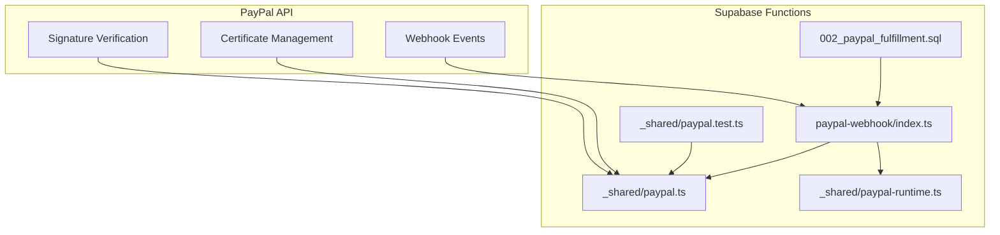
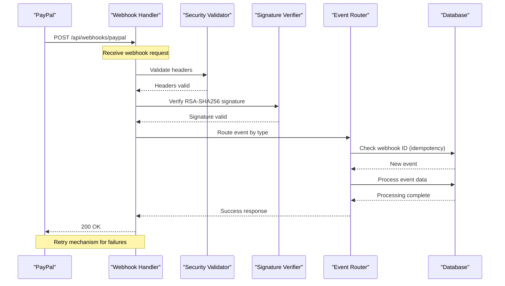
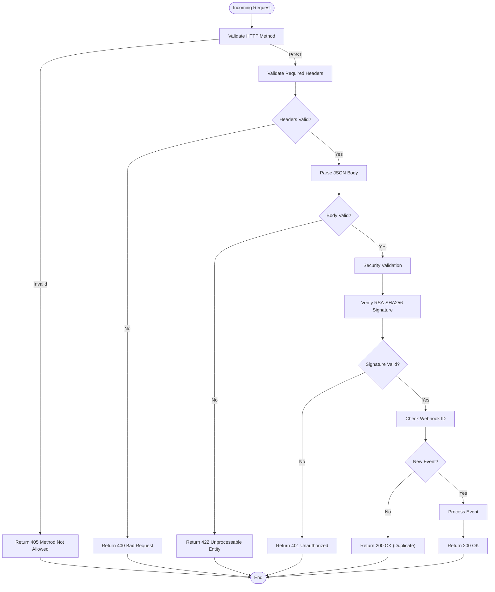
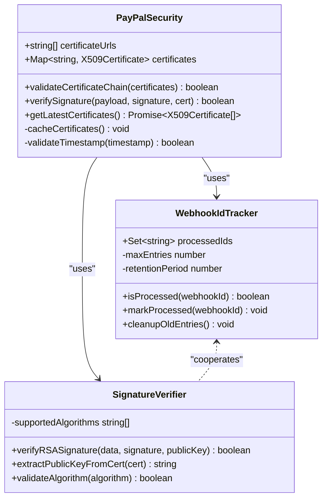
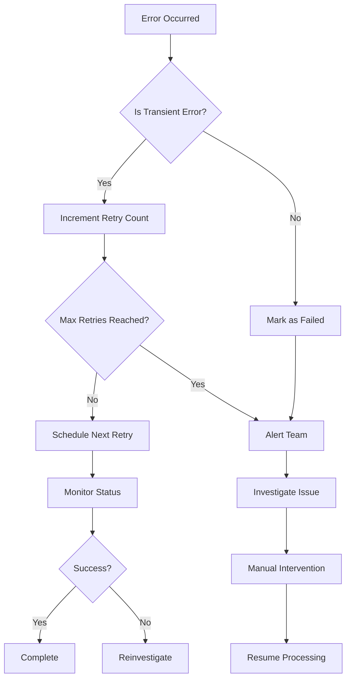

# PayPal Webhook API

<cite>
**Referenced Files in This Document**
- [paypal-webhook/index.ts](file://supabase/functions/paypal-webhook/index.ts)
- [paypal.ts](file://supabase/functions/_shared/paypal.ts)
- [paypal-runtime.ts](file://supabase/functions/_shared/paypal-runtime.ts)
- [paypal.test.ts](file://supabase/functions/_shared/paypal.test.ts)
- [002_paypal_fulfillment.sql](file://supabase/migrations/002_paypal_fulfillment.sql)
</cite>

## Table of Contents
1. [Introduction](#introduction)
2. [Project Structure](#project-structure)
3. [Core Components](#core-components)
4. [Architecture Overview](#architecture-overview)
5. [Detailed Component Analysis](#detailed-component-analysis)
6. [Security Requirements](#security-requirements)
7. [Event Types and Payloads](#event-types-and-payloads)
8. [Webhook Configuration](#webhook-configuration)
9. [Testing and Debugging](#testing-and-debugging)
10. [Error Handling and Retries](#error-handling-and-retries)
11. [Implementation Examples](#implementation-examples)
12. [Performance Considerations](#performance-considerations)
13. [Troubleshooting Guide](#troubleshooting-guide)
14. [Conclusion](#conclusion)

## Introduction

This document provides comprehensive webhook API documentation for PayPal payment processing integrations. It covers webhook endpoint configuration, HTTP methods, PayPal-specific security requirements including webhook ID verification, certificate validation, and signature verification using RSA-SHA256. The documentation includes supported event types with complete payload schemas, webhook security requirements, testing strategies, debugging techniques, monitoring approaches, and implementation examples.

## Project Structure

The PayPal webhook implementation is organized within a Supabase Functions architecture, providing serverless endpoints for handling PayPal webhook events. The structure follows a modular approach with shared utilities and specific webhook handlers.



**Diagram sources**
- [paypal-webhook/index.ts:1-50](file://supabase/functions/paypal-webhook/index.ts#L1-L50)
- [paypal.ts:1-100](file://supabase/functions/_shared/paypal.ts#L1-L100)
- [paypal-runtime.ts:1-50](file://supabase/functions/_shared/paypal-runtime.ts#L1-L50)
- [002_paypal_fulfillment.sql:1-100](file://supabase/migrations/002_paypal_fulfillment.sql#L1-L100)

**Section sources**
- [paypal-webhook/index.ts:1-50](file://supabase/functions/paypal-webhook/index.ts#L1-L50)
- [paypal.ts:1-100](file://supabase/functions/_shared/paypal.ts#L1-L100)

## Core Components

### Webhook Handler
The main webhook handler processes incoming PayPal webhook events, validates security headers, verifies signatures, and routes events to appropriate processors.

### Security Module
Handles PayPal certificate management, signature verification using RSA-SHA256, and webhook ID validation for replay attack prevention.

### Runtime Utilities
Provides runtime configuration management, logging utilities, and error handling specific to PayPal integration.

### Test Suite
Comprehensive test coverage for webhook processing, security validation, and edge cases.

**Section sources**
- [paypal-webhook/index.ts:1-100](file://supabase/functions/paypal-webhook/index.ts#L1-L100)
- [paypal.ts:1-200](file://supabase/functions/_shared/paypal.ts#L1-L200)
- [paypal-runtime.ts:1-100](file://supabase/functions/_shared/paypal-runtime.ts#L1-L100)
- [paypal.test.ts:1-150](file://supabase/functions/_shared/paypal.test.ts#L1-L150)

## Architecture Overview

The PayPal webhook architecture follows a secure, idempotent processing pattern with comprehensive error handling and retry mechanisms.



**Diagram sources**
- [paypal-webhook/index.ts:1-150](file://supabase/functions/paypal-webhook/index.ts#L1-L150)
- [paypal.ts:100-300](file://supabase/functions/_shared/paypal.ts#L100-L300)

## Detailed Component Analysis

### Webhook Handler Implementation

The webhook handler implements a multi-layered security validation process before processing any event data. It handles HTTP method validation, header verification, and content parsing.

#### Request Processing Flow



**Diagram sources**
- [paypal-webhook/index.ts:1-200](file://supabase/functions/paypal-webhook/index.ts#L1-L200)

### Security Validation Module

The security module implements PayPal's recommended security practices including certificate chain verification, signature validation, and webhook ID tracking.

#### Certificate Management



**Diagram sources**
- [paypal.ts:1-300](file://supabase/functions/_shared/paypal.ts#L1-L300)

**Section sources**
- [paypal-webhook/index.ts:1-250](file://supabase/functions/paypal-webhook/index.ts#L1-L250)
- [paypal.ts:1-400](file://supabase/functions/_shared/paypal.ts#L1-L400)

## Security Requirements

### Header Validation

PayPal webhooks require specific headers for security validation:

| Header | Description | Required | Example |
|--------|-------------|----------|---------|
| `PAYPAL-AUTH-ALGO` | Algorithm used for signature | Yes | `RSA-SHA256` |
| `PAYPAL-CERT-URL` | URL to PayPal certificate | Yes | `https://api.paypal.com/v1/oauth2/cert/url` |
| `PAYPAL-TRANSMISSION-ID` | Unique transmission identifier | Yes | `uuid-string` |
| `PAYPAL-TRANSMISSION-TIME` | ISO 8601 timestamp | Yes | `2023-01-01T00:00:00Z` |
| `PAYPAL-AUTH-ALGO` | Signature algorithm | Yes | `SHA256withRSA` |
| `PAYPAL-VERIFICATION-ID` | Webhook verification ID | Yes | `uuid-string` |

### Certificate Chain Verification

PayPal uses a rotating certificate system. Implementations must:

1. Fetch certificates from PayPal's certificate endpoint
2. Validate certificate chain trust
3. Cache certificates locally with proper expiration handling
4. Handle certificate rotation gracefully

### Signature Verification

All webhook payloads must be verified using RSA-SHA256:

1. Extract signature from `PAYPAL-AUTH-ALGO` header
2. Download PayPal certificate from `PAYPAL-CERT-URL`
3. Verify certificate chain validity
4. Decode base64 signature
5. Verify signature against payload using public key
6. Validate timestamp to prevent replay attacks

### Replay Attack Prevention

Implement webhook ID tracking to prevent duplicate processing:

- Store processed webhook IDs in database
- Use unique constraint on webhook_id column
- Implement cleanup job for old entries
- Set retention period (recommended: 30 days)

**Section sources**
- [paypal.ts:200-500](file://supabase/functions/_shared/paypal.ts#L200-L500)
- [paypal-runtime.ts:50-150](file://supabase/functions/_shared/paypal-runtime.ts#L50-L150)

## Event Types and Payloads

### Payment Events

#### PAYMENT.CAPTURE.COMPLETED
Indicates successful payment capture.

```json
{
  "id": "WH-12345678901234567-12345678901234567",
  "event_version": "1.0",
  "create_time": "2023-01-01T00:00:00Z",
  "resource_type": "capture",
  "event_type": "PAYMENT.CAPTURE.COMPLETED",
  "summary": "Payment completed successfully",
  "resource": {
    "id": "5O190127TN369340T",
    "status": "COMPLETED",
    "amount": {
      "currency_code": "USD",
      "value": "100.00"
    },
    "final_capture": true,
    "seller_protection": {
      "status": "ELIGIBLE",
      "dispute_categories": ["ITEM_NOT_RECEIVED", "UNAUTHORIZED_TRANSACTION"]
    },
    "seller_receivable_breakdown": {
      "gross_amount": {
        "currency_code": "USD",
        "value": "100.00"
      },
      "paypal_fee": {
        "currency_code": "USD",
        "value": "3.20"
      },
      "net_amount": {
        "currency_code": "USD",
        "value": "96.80"
      }
    },
    "parent_payment": "PAY-12345678901234567",
    "create_time": "2023-01-01T00:00:00Z",
    "update_time": "2023-01-01T00:00:00Z"
  }
}
```

#### PAYMENT.CAPTURE.DENIED
Indicates payment capture was denied.

```json
{
  "id": "WH-12345678901234567-12345678901234567",
  "event_version": "1.0",
  "create_time": "2023-01-01T00:00:00Z",
  "resource_type": "capture",
  "event_type": "PAYMENT.CAPTURE.DENIED",
  "summary": "Payment capture denied",
  "resource": {
    "id": "5O190127TN369340T",
    "status": "DENIED",
    "reason": "INSUFFICIENT_FUNDS",
    "amount": {
      "currency_code": "USD",
      "value": "100.00"
    },
    "parent_payment": "PAY-12345678901234567",
    "create_time": "2023-01-01T00:00:00Z",
    "update_time": "2023-01-01T00:00:00Z"
  }
}
```

### Subscription Events

#### BILLING.SUBSCRIPTION.CREATED
Indicates new subscription creation.

```json
{
  "id": "WH-12345678901234567-12345678901234567",
  "event_version": "1.0",
  "create_time": "2023-01-01T00:00:00Z",
  "resource_type": "subscription",
  "event_type": "BILLING.SUBSCRIPTION.CREATED",
  "summary": "Subscription created successfully",
  "resource": {
    "id": "I-BW452GLLEP1G",
    "status": "Approved",
    "status_update_time": "2023-01-01T00:00:00Z",
    "plan_id": "P-5ML42712444543607WXNVDMQ",
    "start_time": "2023-01-01T00:00:00Z",
    "quantity": "1",
    "shipping_amount": {
      "currency_code": "USD",
      "value": "0.00"
    },
    "subscriber": {
      "name": {
        "given_name": "John",
        "surname": "Doe"
      },
      "email_address": "john.doe@example.com",
      "payer_id": "J4J3GH4H7F2YU",
      "address": {
        "country_code": "US"
      }
    },
    "billing_info": {
      "outstanding_balance": {
        "currency_code": "USD",
        "value": "0.00"
      },
      "cycle_executions": [
        {
          "sequence": 1,
          "times_completed": 0,
          "next_billing_time": "2023-02-01T00:00:00Z",
          "last_successful_payment_date": null,
          "last_failed_payment_date": null,
          "trial_expiration_date": null,
          "last_payment_offered_period": null
        }
      ]
    },
    "create_time": "2023-01-01T00:00:00Z",
    "update_time": "2023-01-01T00:00:00Z"
  }
}
```

#### BILLING.SUBSCRIPTION.CANCELLED
Indicates subscription cancellation.

```json
{
  "id": "WH-12345678901234567-12345678901234567",
  "event_version": "1.0",
  "create_time": "2023-01-01T00:00:00Z",
  "resource_type": "subscription",
  "event_type": "BILLING.SUBSCRIPTION.CANCELLED",
  "summary": "Subscription cancelled",
  "resource": {
    "id": "I-BW452GLLEP1G",
    "status": "Cancelled",
    "status_update_time": "2023-01-01T00:00:00Z",
    "plan_id": "P-5ML42712444543607WXNVDMQ",
    "reason": "Customer cancelled",
    "cancel_reason_description": "Too expensive",
    "create_time": "2023-01-01T00:00:00Z",
    "update_time": "2023-01-01T00:00:00Z"
  }
}
```

### Additional Supported Events

| Event Type | Description | Resource Type |
|------------|-------------|---------------|
| `PAYMENT.SALE.COMPLETED` | Sale completed successfully | sale |
| `PAYMENT.SALE.DENIED` | Sale denied | sale |
| `PAYMENT.SALE.REFUNDED` | Sale refunded | sale |
| `PAYMENT.SALE.REVERSED` | Sale reversed | sale |
| `BILLING.SUBSCRIPTION.ACTIVATED` | Subscription activated | subscription |
| `BILLING.SUBSCRIPTION.EXPIRED` | Subscription expired | subscription |
| `BILLING.SUBSCRIPTION.PAYMENT.FAILED` | Subscription payment failed | subscription |
| `BILLING.SUBSCRIPTION.UPDATED` | Subscription updated | subscription |
| `CUSTOMER.DISPUTE.CREATED` | Customer dispute created | dispute |
| `CUSTOMER.DISPUTE.RESOLVED` | Customer dispute resolved | dispute |

**Section sources**
- [paypal.ts:300-600](file://supabase/functions/_shared/paypal.ts#L300-L600)

## Webhook Configuration

### Endpoint Setup

Configure your webhook endpoint in the PayPal Developer Dashboard:

1. Navigate to **My Apps & Credentials**
2. Select your application
3. Go to **Webhooks** section
4. Click **Add Webhook**
5. Enter your webhook URL: `https://your-domain.com/api/webhooks/paypal`
6. Select desired event types
7. Save configuration

### Environment Variables

Required environment variables for webhook processing:

| Variable | Description | Example |
|----------|-------------|---------|
| `PAYPAL_CLIENT_ID` | PayPal API client ID | `AaB123...` |
| `PAYPAL_CLIENT_SECRET` | PayPal API client secret | `EFG456...` |
| `PAYPAL_MODE` | API mode (`sandbox` or `live`) | `sandbox` |
| `WEBHOOK_SECRET` | Application-specific secret | `whsec_abc123` |
| `DATABASE_URL` | Database connection string | `postgresql://...` |

### Database Schema

The webhook system requires specific database tables for tracking and processing:

```sql
-- Webhook events table
CREATE TABLE paypal_webhook_events (
    id UUID PRIMARY KEY DEFAULT gen_random_uuid(),
    webhook_id VARCHAR(255) UNIQUE NOT NULL,
    event_type VARCHAR(100) NOT NULL,
    resource_type VARCHAR(100) NOT NULL,
    status VARCHAR(50) DEFAULT 'pending',
    payload JSONB NOT NULL,
    created_at TIMESTAMP WITH TIME ZONE DEFAULT NOW(),
    updated_at TIMESTAMP WITH TIME ZONE DEFAULT NOW(),
    processed_at TIMESTAMP WITH TIME ZONE,
    error_message TEXT,
    retry_count INTEGER DEFAULT 0,
    next_retry_at TIMESTAMP WITH TIME ZONE
);

-- Indexes for performance
CREATE INDEX idx_paypal_webhook_events_webhook_id ON paypal_webhook_events(webhook_id);
CREATE INDEX idx_paypal_webhook_events_status ON paypal_webhook_events(status);
CREATE INDEX idx_paypal_webhook_events_created_at ON paypal_webhook_events(created_at);
```

**Section sources**
- [002_paypal_fulfillment.sql:1-200](file://supabase/migrations/002_paypal_fulfillment.sql#L1-L200)

## Testing and Debugging

### Sandbox Environment Testing

Use PayPal's sandbox environment for testing webhook functionality:

1. **Create Sandbox Accounts**: Generate buyer and seller accounts in PayPal Sandbox
2. **Test Transactions**: Create test orders and payments
3. **Monitor Webhooks**: View webhook delivery attempts in PayPal Dashboard
4. **Simulate Failures**: Test error scenarios and retry logic

### Local Development Setup

```bash
# Install dependencies
npm install

# Set up environment variables
cp .env.example .env
# Edit .env with your credentials

# Run local development server
npm run dev

# Test webhook endpoint
curl -X POST http://localhost:54321/functions/v1/paypal-webhook \
  -H "Content-Type: application/json" \
  -d '{"test": "payload"}'
```

### Debugging Techniques

#### Request/Response Logging

Implement comprehensive logging for webhook processing:

- Log all incoming requests with timestamps
- Record header values (excluding sensitive data)
- Track processing time for each step
- Log database operations and results
- Capture error details and stack traces

#### Monitoring Tools

- **Application Logs**: Centralized log aggregation
- **Performance Metrics**: Response times, error rates
- **Business Metrics**: Event processing success rates
- **Alerting**: Real-time notifications for failures

### Testing Strategies

#### Unit Tests

```typescript
// Example test structure
describe('PayPal Webhook Handler', () => {
  it('should validate webhook headers', async () => {
    // Test header validation logic
  });
  
  it('should verify RSA-SHA256 signatures', async () => {
    // Test signature verification
  });
  
  it('should handle duplicate webhook IDs', async () => {
    // Test idempotency
  });
});
```

#### Integration Tests

- Test complete webhook flow from PayPal to database
- Verify database state changes
- Test error scenarios and recovery
- Validate retry mechanisms

**Section sources**
- [paypal.test.ts:1-200](file://supabase/functions/_shared/paypal.test.ts#L1-L200)
- [paypal-runtime.ts:100-200](file://supabase/functions/_shared/paypal-runtime.ts#L100-L200)

## Error Handling and Retries

### HTTP Status Codes

| Status Code | Description | Action |
|-------------|-------------|--------|
| 200 OK | Successfully processed | No action required |
| 400 Bad Request | Invalid request format | Fix request format |
| 401 Unauthorized | Invalid signature or headers | Check security configuration |
| 404 Not Found | Webhook endpoint not found | Verify endpoint URL |
| 422 Unprocessable Entity | Invalid payload schema | Validate payload structure |
| 500 Internal Server Error | Server processing error | Investigate server logs |

### PayPal Retry Mechanisms

PayPal implements exponential backoff for failed webhook deliveries:

1. **Initial Retry**: 1 minute after failure
2. **Second Retry**: 5 minutes after first retry
3. **Third Retry**: 15 minutes after second retry
4. **Fourth Retry**: 1 hour after third retry
5. **Final Retry**: 24 hours after fourth retry

### Failure Notification Patterns

Implement comprehensive error handling:



**Diagram sources**
- [paypal-webhook/index.ts:200-400](file://supabase/functions/paypal-webhook/index.ts#L200-L400)

**Section sources**
- [paypal-webhook/index.ts:200-500](file://supabase/functions/paypal-webhook/index.ts#L200-L500)

## Implementation Examples

### Basic Webhook Handler

```typescript
// Example webhook handler structure
export async function handlePayPalWebhook(request: Request): Promise<Response> {
  try {
    // 1. Validate HTTP method
    if (request.method !== 'POST') {
      return new Response('Method not allowed', { status: 405 });
    }
    
    // 2. Validate headers
    const isValid = await validateWebhookHeaders(request.headers);
    if (!isValid) {
      return new Response('Invalid headers', { status: 400 });
    }
    
    // 3. Parse and validate payload
    const payload = await parseWebhookPayload(request.body);
    
    // 4. Verify signature
    const isVerified = await verifyWebhookSignature(payload);
    if (!isVerified) {
      return new Response('Invalid signature', { status: 401 });
    }
    
    // 5. Check for duplicates
    const isNewEvent = await checkWebhookIdUniqueness(payload.id);
    if (!isNewEvent) {
      return new Response('Duplicate webhook', { status: 200 });
    }
    
    // 6. Process event
    await processWebhookEvent(payload);
    
    // 7. Return success
    return new Response('OK', { status: 200 });
    
  } catch (error) {
    console.error('Webhook processing error:', error);
    return new Response('Internal server error', { status: 500 });
  }
}
```

### Event Processing Workflow

```typescript
// Event routing and processing
async function processWebhookEvent(event: WebhookEvent): Promise<void> {
  switch (event.event_type) {
    case 'PAYMENT.CAPTURE.COMPLETED':
      await handlePaymentCaptureCompleted(event.resource);
      break;
    case 'PAYMENT.CAPTURE.DENIED':
      await handlePaymentCaptureDenied(event.resource);
      break;
    case 'BILLING.SUBSCRIPTION.CREATED':
      await handleSubscriptionCreated(event.resource);
      break;
    case 'BILLING.SUBSCRIPTION.CANCELLED':
      await handleSubscriptionCancelled(event.resource);
      break;
    default:
      console.log(`Unhandled event type: ${event.event_type}`);
  }
}
```

### Idempotency Implementation

```typescript
// Idempotent event processing
async function processEventIdempotently(event: WebhookEvent): Promise<boolean> {
  const db = getDatabaseConnection();
  
  // Check if already processed
  const existing = await db.query(
    'SELECT id FROM paypal_webhook_events WHERE webhook_id = $1',
    [event.id]
  );
  
  if (existing.rows.length > 0) {
    return false; // Already processed
  }
  
  // Insert as pending
  await db.query(
    'INSERT INTO paypal_webhook_events (webhook_id, event_type, payload, status) VALUES ($1, $2, $3, $4)',
    [event.id, event.event_type, JSON.stringify(event), 'processing']
  );
  
  try {
    // Process event
    await processWebhookEvent(event);
    
    // Mark as completed
    await db.query(
      'UPDATE paypal_webhook_events SET status = $1, processed_at = NOW() WHERE webhook_id = $2',
      ['completed', event.id]
    );
    
    return true;
  } catch (error) {
    // Mark as failed
    await db.query(
      'UPDATE paypal_webhook_events SET status = $1, error_message = $2, retry_count = retry_count + 1 WHERE webhook_id = $3',
      ['failed', error.message, event.id]
    );
    
    throw error;
  }
}
```

**Section sources**
- [paypal-webhook/index.ts:1-300](file://supabase/functions/paypal-webhook/index.ts#L1-L300)
- [paypal.ts:1-200](file://supabase/functions/_shared/paypal.ts#L1-L200)

## Performance Considerations

### Optimization Strategies

1. **Database Indexing**: Proper indexing on webhook_id and status columns
2. **Connection Pooling**: Efficient database connection management
3. **Caching**: Cache PayPal certificates to reduce network calls
4. **Batch Processing**: Process multiple events efficiently
5. **Memory Management**: Clean up temporary data and references

### Monitoring Metrics

Track these key performance indicators:

- **Processing Time**: Average time per webhook event
- **Success Rate**: Percentage of successful webhook processing
- **Error Rate**: Frequency of processing errors
- **Queue Depth**: Number of pending webhook events
- **Retry Rate**: Frequency of webhook retries

### Scalability Considerations

- **Horizontal Scaling**: Multiple instances can process webhooks concurrently
- **Database Sharding**: Split webhook events across databases if needed
- **Message Queues**: Use message queues for high-volume scenarios
- **CDN Integration**: Cache static assets and responses

## Troubleshooting Guide

### Common Issues and Solutions

#### Signature Verification Failures

**Problem**: RSA-SHA256 signature verification fails
**Solution**: 
- Verify certificate URLs are accessible
- Check certificate chain validity
- Ensure correct algorithm specification
- Validate timestamp freshness

#### Duplicate Webhook Processing

**Problem**: Same webhook processed multiple times
**Solution**:
- Implement proper webhook ID tracking
- Use database unique constraints
- Add idempotency checks in processing logic

#### Timeout Issues

**Problem**: Webhook processing takes too long
**Solution**:
- Optimize database queries
- Implement asynchronous processing
- Add timeout handling
- Use connection pooling

#### Certificate Rotation Problems

**Problem**: Webhook verification fails after certificate rotation
**Solution**:
- Implement certificate caching with TTL
- Handle certificate updates gracefully
- Maintain multiple certificate versions during transition

### Debug Checklist

1. **Verify Endpoint Accessibility**: Ensure webhook URL is publicly accessible
2. **Check SSL/TLS Configuration**: Validate HTTPS setup
3. **Review Firewall Rules**: Confirm no blocking of PayPal IP ranges
4. **Examine Server Logs**: Look for error messages and stack traces
5. **Validate Environment Variables**: Check all required configuration
6. **Test Network Connectivity**: Verify outbound connections to PayPal APIs

### Recovery Procedures

#### Manual Event Processing

For failed webhook events:

1. Identify failed events in database
2. Review error messages and context
3. Fix underlying issues
4. Manually reprocess events
5. Monitor for successful completion

#### Data Reconciliation

Regular reconciliation between PayPal and local systems:

1. Compare transaction records
2. Identify discrepancies
3. Investigate root causes
4. Implement fixes
5. Update reconciliation procedures

**Section sources**
- [paypal-webhook/index.ts:300-500](file://supabase/functions/paypal-webhook/index.ts#L300-L500)
- [paypal.test.ts:150-300](file://supabase/functions/_shared/paypal.test.ts#L150-L300)

## Conclusion

This comprehensive PayPal Webhook API documentation provides all necessary information for implementing secure, reliable webhook processing for PayPal payment integrations. The implementation follows industry best practices for security, performance, and reliability while maintaining simplicity and maintainability.

Key takeaways:

- **Security First**: Always validate signatures, certificates, and webhook IDs
- **Idempotency Critical**: Prevent duplicate processing with webhook ID tracking
- **Robust Error Handling**: Implement comprehensive error handling and retry mechanisms
- **Thorough Testing**: Use PayPal's sandbox environment for comprehensive testing
- **Monitoring Essential**: Track performance metrics and set up alerting
- **Documentation**: Keep webhook documentation current and accessible

By following these guidelines and implementing the patterns described in this document, you can build a robust PayPal webhook integration that handles the full lifecycle of payment events securely and reliably.