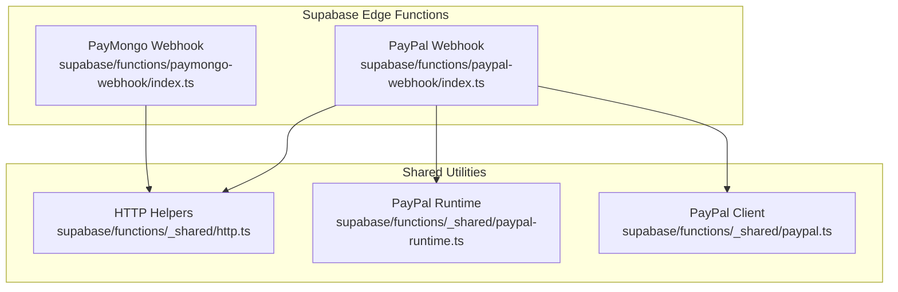
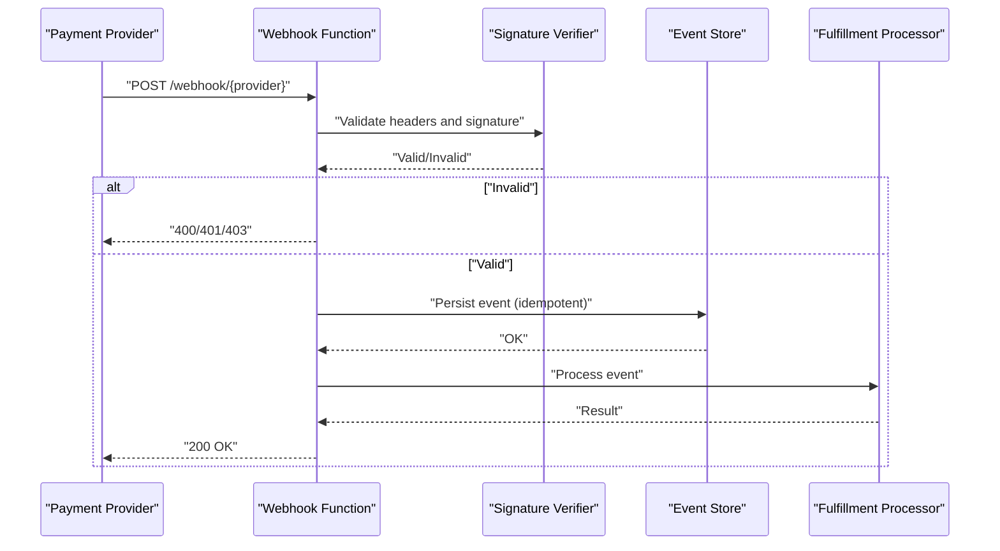
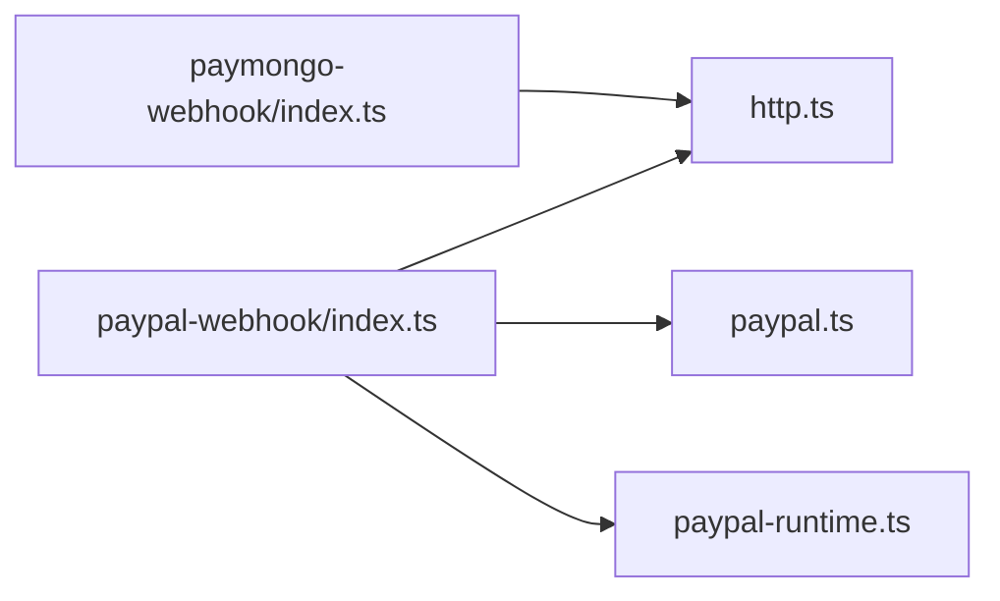

# Payment Webhook APIs

<cite>
**Referenced Files in This Document**
- [paymongo-webhook/index.ts](file://supabase/functions/paymongo-webhook/index.ts)
- [paypal-webhook/index.ts](file://supabase/functions/paypal-webhook/index.ts)
- [paypal.ts](file://supabase/functions/_shared/paypal.ts)
- [paypal-runtime.ts](file://supabase/functions/_shared/paypal-runtime.ts)
- [http.ts](file://supabase/functions/_shared/http.ts)
- [03-subscriptions-paymongo.md](file://docs/superpowers/plans/monetization/03-subscriptions-paymongo.md)
</cite>

## Table of Contents
1. [Introduction](#introduction)
2. [Project Structure](#project-structure)
3. [Core Components](#core-components)
4. [Architecture Overview](#architecture-overview)
5. [Detailed Component Analysis](#detailed-component-analysis)
6. [Dependency Analysis](#dependency-analysis)
7. [Performance Considerations](#performance-considerations)
8. [Troubleshooting Guide](#troubleshooting-guide)
9. [Conclusion](#conclusion)
10. [Appendices](#appendices)

## Introduction
This document provides detailed webhook API documentation for payment processing integrations with PayMongo and PayPal. It covers endpoint behavior, payload schemas, signature verification, event types, security requirements (header validation, payload signing, replay prevention), event lifecycle, retry mechanisms, idempotency handling, error response formats, testing strategies, debugging techniques, monitoring approaches, implementation examples, failure recovery patterns, dashboard configuration, and local development setup.

## Project Structure
The project implements two Supabase Edge Functions as webhook endpoints:
- PayMongo webhook handler
- PayPal webhook handler

Shared utilities provide HTTP helpers and PayPal-specific runtime and client logic.

**Diagram sources**
- [paymongo-webhook/index.ts](file://supabase/functions/paymongo-webhook/index.ts)
- [paypal-webhook/index.ts](file://supabase/functions/paypal-webhook/index.ts)
- [http.ts](file://supabase/functions/_shared/http.ts)
- [paypal-runtime.ts](file://supabase/functions/_shared/paypal-runtime.ts)
- [paypal.ts](file://supabase/functions/_shared/paypal.ts)

**Section sources**
- [paymongo-webhook/index.ts](file://supabase/functions/paymongo-webhook/index.ts)
- [paypal-webhook/index.ts](file://supabase/functions/paypal-webhook/index.ts)
- [http.ts](file://supabase/functions/_shared/http.ts)
- [paypal-runtime.ts](file://supabase/functions/_shared/paypal-runtime.ts)
- [paypal.ts](file://supabase/functions/_shared/paypal.ts)

## Core Components
- PayMongo Webhook Handler: Receives PayMongo events, validates signatures, normalizes payloads, persists events, and triggers fulfillment.
- PayPal Webhook Handler: Receives PayPal events, verifies signatures using the PayPal client, normalizes payloads, persists events, and triggers fulfillment.
- Shared HTTP Utilities: Provide request/response helpers used by both handlers.
- PayPal Client/Runtime: Encapsulate PayPal SDK calls and runtime configuration for signature verification and API interactions.

Key responsibilities:
- Signature verification per provider
- Event normalization into a common schema
- Idempotent persistence and processing
- Consistent error responses
- Logging and observability hooks

**Section sources**
- [paymongo-webhook/index.ts](file://supabase/functions/paymongo-webhook/index.ts)
- [paypal-webhook/index.ts](file://supabase/functions/paypal-webhook/index.ts)
- [http.ts](file://supabase/functions/_shared/http.ts)
- [paypal-runtime.ts](file://supabase/functions/_shared/paypal-runtime.ts)
- [paypal.ts](file://supabase/functions/_shared/paypal.ts)

## Architecture Overview
High-level flow for incoming webhooks:
- Provider sends an HTTP POST to the corresponding Edge Function.
- The handler validates headers and signature.
- The payload is parsed and normalized into a common event model.
- The event is persisted idempotently.
- A background or synchronous processor fulfills business outcomes (e.g., subscription activation).
- A consistent JSON response is returned to the provider.

[No sources needed since this diagram shows conceptual workflow, not actual code structure]

## Detailed Component Analysis

### PayMongo Webhook Endpoint
- Purpose: Receive and process PayMongo webhook events.
- Security:
  - Validate required headers from PayMongo.
  - Verify signature using the shared HTTP helper and environment configuration.
- Payload:
  - Parse and normalize PayMongo event into a common schema.
  - Extract core fields such as event type, resource identifiers, timestamps, and status.
- Processing:
  - Persist the event with a unique ID to ensure idempotency.
  - Dispatch to fulfillment logic based on event type.
- Response:
  - Return a standard JSON success response upon successful processing.
  - Return appropriate error codes for invalid requests or internal failures.

Implementation references:
- Entry point and main logic: [paymongo-webhook/index.ts](file://supabase/functions/paymongo-webhook/index.ts)
- HTTP helpers used for parsing and response formatting: [http.ts](file://supabase/functions/_shared/http.ts)

Security checklist:
- Header validation: Ensure expected headers are present and well-formed.
- Signature verification: Use provider’s public key or secret to validate the signature over the raw body.
- Replay prevention: Deduplicate events by provider event ID before processing.

Event lifecycle:
- Received -> Verified -> Normalized -> Persisted -> Processed -> Acknowledged.

Retry behavior:
- Providers may retry failed deliveries; idempotency ensures safe reprocessing.

Error responses:
- 400 Bad Request for malformed payloads or missing headers.
- 401/403 Unauthorized for invalid signatures.
- 500 Internal Server Error for unexpected processing errors.

Testing strategies:
- Use provider sandbox dashboards to send test events.
- Simulate payloads locally and verify signature checks.
- Assert idempotency by sending duplicate events.

Debugging techniques:
- Log request metadata (headers, event IDs, timestamps).
- Capture normalized event models for inspection.
- Track fulfillment outcomes and errors.

Monitoring approaches:
- Emit metrics for webhook volume, latency, and error rates.
- Alert on signature verification failures and repeated retries.

Configuration:
- Configure webhook URL in PayMongo dashboard to point to the deployed Edge Function.
- Set required secrets and keys in environment variables.

Local development:
- Use Supabase CLI to run functions locally and forward webhooks.
- Map local function routes to match provider expectations.

**Section sources**
- [paymongo-webhook/index.ts](file://supabase/functions/paymongo-webhook/index.ts)
- [http.ts](file://supabase/functions/_shared/http.ts)

### PayPal Webhook Endpoint
- Purpose: Receive and process PayPal webhook events.
- Security:
  - Validate PayPal-specific headers (e.g., transmission ID, timestamp, signature).
  - Verify signature using the PayPal client and runtime utilities.
- Payload:
  - Parse and normalize PayPal event into a common schema.
  - Extract event type, resource details, and lifecycle state.
- Processing:
  - Persist the event idempotently using PayPal event ID.
  - Trigger fulfillment actions (e.g., order capture confirmation, subscription updates).
- Response:
  - Return a standard JSON success response upon successful processing.
  - Return appropriate error codes for invalid requests or internal failures.

Implementation references:
- Entry point and main logic: [paypal-webhook/index.ts](file://supabase/functions/paypal-webhook/index.ts)
- PayPal client and runtime utilities: [paypal.ts](file://supabase/functions/_shared/paypal.ts), [paypal-runtime.ts](file://supabase/functions/_shared/paypal-runtime.ts)
- HTTP helpers used for parsing and response formatting: [http.ts](file://supabase/functions/_shared/http.ts)

Security checklist:
- Header validation: Ensure all required PayPal headers are present.
- Signature verification: Use PayPal’s public certificate chain and runtime configuration.
- Replay prevention: Deduplicate events by PayPal event ID before processing.

Event lifecycle:
- Received -> Verified -> Normalized -> Persisted -> Processed -> Acknowledged.

Retry behavior:
- PayPal retries failed deliveries; idempotency ensures safe reprocessing.

Error responses:
- 400 Bad Request for malformed payloads or missing headers.
- 401/403 Unauthorized for invalid signatures.
- 500 Internal Server Error for unexpected processing errors.

Testing strategies:
- Use PayPal Sandbox to create and trigger test events.
- Validate signature verification with known test payloads.
- Confirm idempotency by resending identical events.

Debugging techniques:
- Log PayPal transmission metadata and event IDs.
- Inspect normalized event structures.
- Record fulfillment steps and outcomes.

Monitoring approaches:
- Track webhook throughput, latency, and error distributions.
- Alert on signature failures and high retry counts.

Configuration:
- Register webhook URL in PayPal Developer Dashboard.
- Set required credentials and certificates via environment variables.

Local development:
- Use Supabase CLI to run functions locally and forward webhooks.
- Ensure local time synchronization for timestamp validation.

**Section sources**
- [paypal-webhook/index.ts](file://supabase/functions/paypal-webhook/index.ts)
- [paypal.ts](file://supabase/functions/_shared/paypal.ts)
- [paypal-runtime.ts](file://supabase/functions/_shared/paypal-runtime.ts)
- [http.ts](file://supabase/functions/_shared/http.ts)

### Shared Utilities

#### HTTP Helpers
- Provides standardized request parsing and response construction.
- Used by both PayMongo and PayPal handlers to ensure consistent behavior.

References:
- [http.ts](file://supabase/functions/_shared/http.ts)

#### PayPal Client and Runtime
- Encapsulates PayPal SDK calls and runtime configuration.
- Supports signature verification and API interactions required by the PayPal webhook handler.

References:
- [paypal.ts](file://supabase/functions/_shared/paypal.ts)
- [paypal-runtime.ts](file://supabase/functions/_shared/paypal-runtime.ts)

**Section sources**
- [http.ts](file://supabase/functions/_shared/http.ts)
- [paypal.ts](file://supabase/functions/_shared/paypal.ts)
- [paypal-runtime.ts](file://supabase/functions/_shared/paypal-runtime.ts)

## Dependency Analysis
The following diagram illustrates dependencies between webhook handlers and shared modules.

**Diagram sources**
- [paymongo-webhook/index.ts](file://supabase/functions/paymongo-webhook/index.ts)
- [paypal-webhook/index.ts](file://supabase/functions/paypal-webhook/index.ts)
- [http.ts](file://supabase/functions/_shared/http.ts)
- [paypal.ts](file://supabase/functions/_shared/paypal.ts)
- [paypal-runtime.ts](file://supabase/functions/_shared/paypal-runtime.ts)

**Section sources**
- [paymongo-webhook/index.ts](file://supabase/functions/paymongo-webhook/index.ts)
- [paypal-webhook/index.ts](file://supabase/functions/paypal-webhook/index.ts)
- [http.ts](file://supabase/functions/_shared/http.ts)
- [paypal.ts](file://supabase/functions/_shared/paypal.ts)
- [paypal-runtime.ts](file://supabase/functions/_shared/paypal-runtime.ts)

## Performance Considerations
- Keep webhook handlers fast and idempotent; perform heavy work asynchronously if necessary.
- Minimize external calls during signature verification; cache provider public keys where supported.
- Batch or queue fulfillment tasks to avoid blocking webhook acknowledgment.
- Monitor latency and set timeouts aligned with provider expectations.

[No sources needed since this section provides general guidance]

## Troubleshooting Guide
Common issues and resolutions:
- Signature verification failures:
  - Check provider headers and ensure correct secret/certificate configuration.
  - Validate that the raw body is used for signature computation.
- Duplicate processing:
  - Ensure idempotency by deduplicating on provider event IDs.
- Timeouts and retries:
  - Return quick acknowledgments; offload long-running tasks.
  - Implement exponential backoff for downstream calls.
- Debugging:
  - Log request metadata, normalized events, and fulfillment results.
  - Compare against provider sandbox samples.

**Section sources**
- [paymongo-webhook/index.ts](file://supabase/functions/paymongo-webhook/index.ts)
- [paypal-webhook/index.ts](file://supabase/functions/paypal-webhook/index.ts)

## Conclusion
The PayMongo and PayPal webhook endpoints follow a consistent pattern: secure ingestion, normalization, idempotent persistence, and reliable fulfillment. By adhering to the security requirements, implementing robust idempotency, and providing comprehensive logging and monitoring, the system can reliably process payment events across providers.

[No sources needed since this section summarizes without analyzing specific files]

## Appendices

### Webhook Security Requirements
- Header validation:
  - PayMongo: Validate provider-specific headers indicating event origin and signature presence.
  - PayPal: Validate transmission ID, timestamp, and signature headers.
- Payload signing:
  - PayMongo: Verify signature over the raw request body using configured secrets.
  - PayPal: Verify signature using PayPal’s public certificate chain and runtime configuration.
- Replay attack prevention:
  - Deduplicate events by provider event ID before processing.
  - Maintain a short-lived store of processed event IDs.

**Section sources**
- [paymongo-webhook/index.ts](file://supabase/functions/paymongo-webhook/index.ts)
- [paypal-webhook/index.ts](file://supabase/functions/paypal-webhook/index.ts)
- [paypal.ts](file://supabase/functions/_shared/paypal.ts)
- [paypal-runtime.ts](file://supabase/functions/_shared/paypal-runtime.ts)

### Event Types and Lifecycle
- Typical event categories:
  - Payment authorization, capture, settlement, refund, dispute, subscription lifecycle changes.
- Lifecycle stages:
  - Created -> Authorized -> Captured -> Settled -> Refunded -> Disputed -> Closed.
- Mapping:
  - Normalize provider-specific event types into a unified schema for consistent processing.

**Section sources**
- [03-subscriptions-paymongo.md](file://docs/superpowers/plans/monetization/03-subscriptions-paymongo.md)

### Retry Mechanisms and Idempotency
- Provider retries:
  - Both PayMongo and PayPal will retry failed deliveries; ensure handlers are idempotent.
- Idempotency strategy:
  - Use provider event IDs as unique keys when persisting events.
  - Skip processing if the event has already been handled successfully.

**Section sources**
- [paymongo-webhook/index.ts](file://supabase/functions/paymongo-webhook/index.ts)
- [paypal-webhook/index.ts](file://supabase/functions/paypal-webhook/index.ts)

### Error Response Formats
- Success:
  - 200 OK with a minimal JSON acknowledgment.
- Client errors:
  - 400 Bad Request for malformed payloads or missing headers.
  - 401/403 Unauthorized for invalid signatures.
- Server errors:
  - 500 Internal Server Error for unexpected processing errors.

**Section sources**
- [http.ts](file://supabase/functions/_shared/http.ts)

### Testing Strategies
- Sandbox testing:
  - Use PayMongo and PayPal sandboxes to generate realistic events.
- Local forwarding:
  - Forward local Supabase Edge Functions to provider sandboxes.
- Assertions:
  - Validate signature verification, normalization, persistence, and fulfillment outcomes.
  - Test idempotency by resending identical events.

**Section sources**
- [paymongo-webhook/index.ts](file://supabase/functions/paymongo-webhook/index.ts)
- [paypal-webhook/index.ts](file://supabase/functions/paypal-webhook/index.ts)

### Implementation Examples
- Webhook handler skeleton:
  - Validate headers and signature.
  - Parse and normalize payload.
  - Persist event idempotently.
  - Trigger fulfillment and return success.
- Event processing workflow:
  - Map normalized events to business actions.
  - Handle partial failures with retries and compensation.
- Failure recovery patterns:
  - Queue failed fulfillments for later processing.
  - Implement dead-letter queues for unrecoverable events.

[No sources needed since this section provides general guidance]

### Configuration and Local Development
- Provider dashboards:
  - Register webhook URLs pointing to deployed Edge Functions.
  - Configure required secrets and certificates.
- Environment variables:
  - Set provider credentials and keys securely.
- Local development:
  - Use Supabase CLI to run functions locally.
  - Forward webhooks from provider sandboxes to local endpoints.

**Section sources**
- [paymongo-webhook/index.ts](file://supabase/functions/paymongo-webhook/index.ts)
- [paypal-webhook/index.ts](file://supabase/functions/paypal-webhook/index.ts)