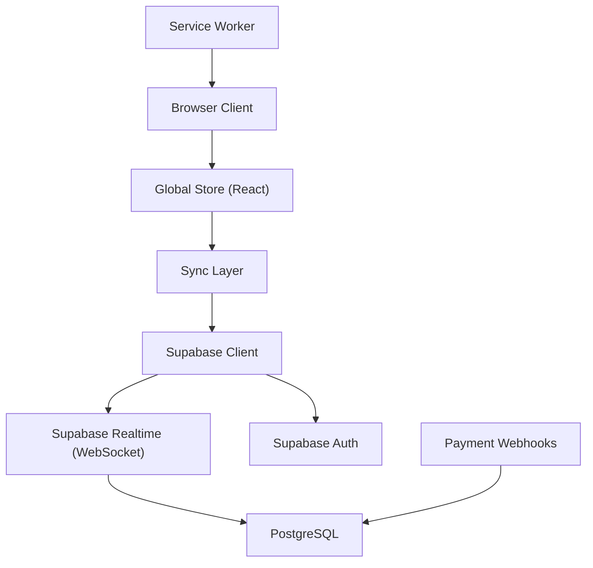
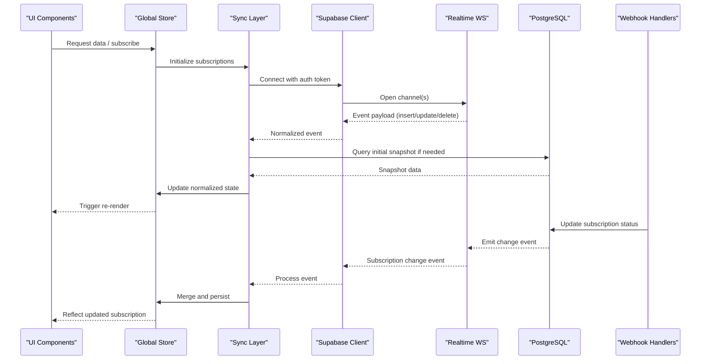
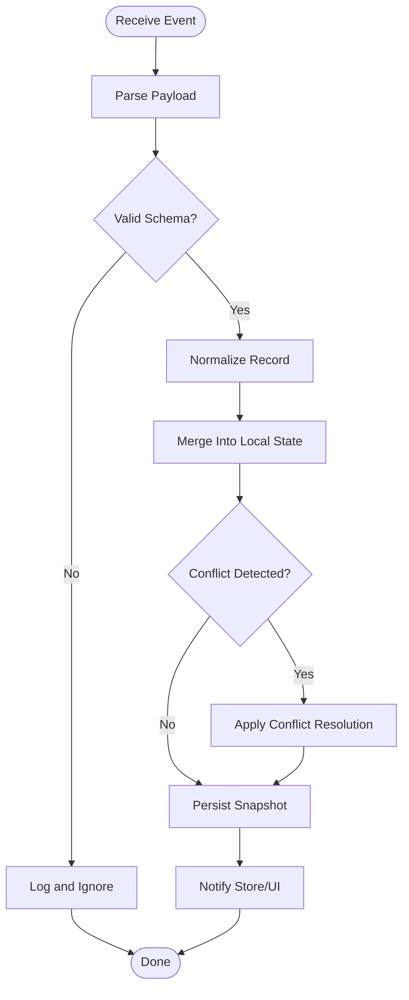
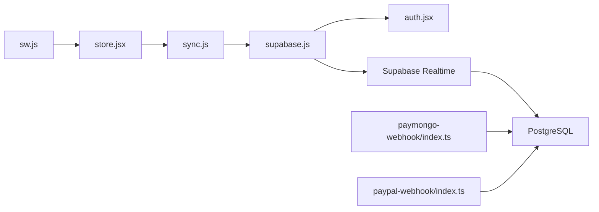
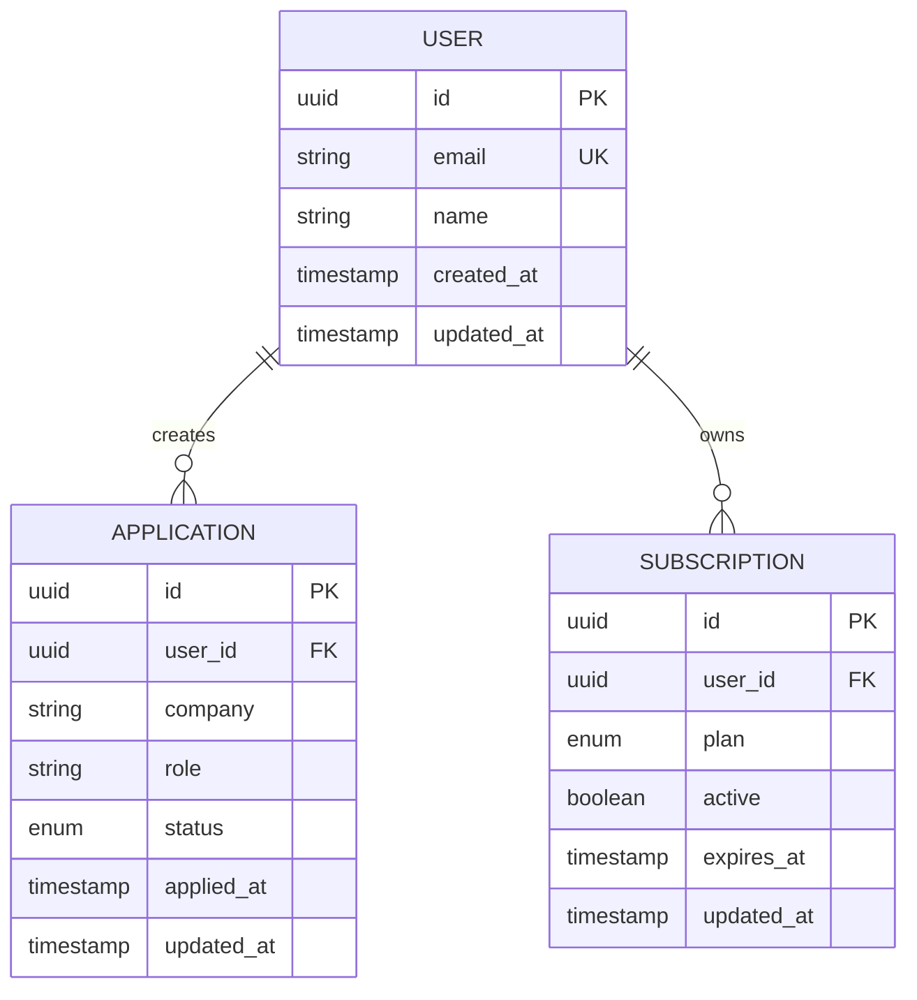

# Real-time Communication APIs

<cite>
**Referenced Files in This Document**
- [README.md](file://README.md)
- [src/lib/supabase.js](file://src/lib/supabase.js)
- [src/lib/sync.js](file://src/lib/sync.js)
- [src/store.jsx](file://src/store.jsx)
- [src/auth.jsx](file://src/auth.jsx)
- [supabase/functions/paymongo-webhook/index.ts](file://supabase/functions/paymongo-webhook/index.ts)
- [supabase/functions/paypal-webhook/index.ts](file://supabase/functions/paypal-webhook/index.ts)
- [supabase/migrations/001_schema.sql](file://supabase/migrations/001_schema.sql)
- [public/sw.js](file://public/sw.js)
</cite>

## Table of Contents
1. [Introduction](#introduction)
2. [Project Structure](#project-structure)
3. [Core Components](#core-components)
4. [Architecture Overview](#architecture-overview)
5. [Detailed Component Analysis](#detailed-component-analysis)
6. [Dependency Analysis](#dependency-analysis)
7. [Performance Considerations](#performance-considerations)
8. [Troubleshooting Guide](#troubleshooting-guide)
9. [Conclusion](#conclusion)
10. [Appendices](#appendices)

## Introduction
This document describes the real-time communication APIs used by ApplyGuard PH, focusing on live data synchronization via Supabase’s real-time features and WebSockets. It covers connection establishment, authentication using Supabase auth tokens, message protocols for bidirectional communication, event types for job application updates, user profile changes, and subscription status modifications. It also documents connection management patterns, reconnection strategies, offline support implementation, conflict resolution algorithms, client-side usage examples, error handling patterns, and performance optimization techniques.

## Project Structure
The real-time capabilities are implemented primarily through:
- A Supabase client configuration and initialization
- A synchronization layer that subscribes to database changes and manages local state
- A global store that exposes reactive state to UI components
- Authentication integration that supplies auth tokens for secure subscriptions
- Serverless functions that process payment webhooks and update subscription-related data
- Database schema migrations defining tables and policies
- A service worker for offline caching and background sync

**Diagram sources**
- [src/lib/supabase.js](file://src/lib/supabase.js)
- [src/lib/sync.js](file://src/lib/sync.js)
- [src/store.jsx](file://src/store.jsx)
- [src/auth.jsx](file://src/auth.jsx)
- [supabase/functions/paymongo-webhook/index.ts](file://supabase/functions/paymongo-webhook/index.ts)
- [supabase/functions/paypal-webhook/index.ts](file://supabase/functions/paypal-webhook/index.ts)
- [supabase/migrations/001_schema.sql](file://supabase/migrations/001_schema.sql)
- [public/sw.js](file://public/sw.js)

**Section sources**
- [README.md](file://README.md)
- [src/lib/supabase.js](file://src/lib/supabase.js)
- [src/lib/sync.js](file://src/lib/sync.js)
- [src/store.jsx](file://src/store.jsx)
- [src/auth.jsx](file://src/auth.jsx)
- [supabase/functions/paymongo-webhook/index.ts](file://supabase/functions/paymongo-webhook/index.ts)
- [supabase/functions/paypal-webhook/index.ts](file://supabase/functions/paypal-webhook/index.ts)
- [supabase/migrations/001_schema.sql](file://supabase/migrations/001_schema.sql)
- [public/sw.js](file://public/sw.js)

## Core Components
- Supabase client setup and configuration for real-time channels and authentication
- Synchronization module that subscribes to table-level events and maintains a normalized local cache
- Global store exposing reactive state and actions to React components
- Authentication integration ensuring only authenticated users subscribe to protected channels
- Payment webhook handlers updating subscription status in the database
- Service worker providing offline caching and background synchronization

Key responsibilities:
- Establish and manage WebSocket connections to Supabase Realtime
- Authenticate connections using Supabase auth tokens
- Subscribe to specific channels and events (e.g., job applications, user profiles, subscriptions)
- Normalize incoming payloads and merge with local state
- Handle reconnection, backoff, and error recovery
- Persist critical state for offline access and reconcile when online

**Section sources**
- [src/lib/supabase.js](file://src/lib/supabase.js)
- [src/lib/sync.js](file://src/lib/sync.js)
- [src/store.jsx](file://src/store.jsx)
- [src/auth.jsx](file://src/auth.jsx)
- [supabase/functions/paymongo-webhook/index.ts](file://supabase/functions/paymongo-webhook/index.ts)
- [supabase/functions/paypal-webhook/index.ts](file://supabase/functions/paypal-webhook/index.ts)
- [public/sw.js](file://public/sw.js)

## Architecture Overview
The real-time architecture leverages Supabase Realtime over WebSockets. The client authenticates with Supabase, subscribes to channels scoped to tables or rows, and receives change events. The sync layer normalizes these events into a local store, which drives UI updates. Payment webhooks trigger server-side updates that propagate to clients via Realtime.

**Diagram sources**
- [src/lib/supabase.js](file://src/lib/supabase.js)
- [src/lib/sync.js](file://src/lib/sync.js)
- [src/store.jsx](file://src/store.jsx)
- [supabase/functions/paymongo-webhook/index.ts](file://supabase/functions/paymongo-webhook/index.ts)
- [supabase/functions/paypal-webhook/index.ts](file://supabase/functions/paypal-webhook/index.ts)
- [supabase/migrations/001_schema.sql](file://supabase/migrations/001_schema.sql)

## Detailed Component Analysis

### Supabase Client and Realtime Channels
- Initializes the Supabase client with project URL and anon/public keys
- Configures realtime channels for relevant tables
- Ensures channels are subscribed only after successful authentication
- Manages channel lifecycle (subscribe/unsubscribe) and error callbacks

Implementation highlights:
- Channel names typically follow a pattern like “table:<tableName>”
- Filters can be applied to limit events to specific rows or columns
- Error handling includes logging and triggering reconnection logic

**Section sources**
- [src/lib/supabase.js](file://src/lib/supabase.js)

### Synchronization Layer
- Subscribes to insert, update, and delete events for key tables
- Normalizes payloads into a consistent shape
- Merges changes into local state while preserving referential integrity
- Handles conflicts by applying last-write-wins or custom merge rules
- Persists snapshots to IndexedDB for offline access

Event processing flow:

**Diagram sources**
- [src/lib/sync.js](file://src/lib/sync.js)

**Section sources**
- [src/lib/sync.js](file://src/lib/sync.js)

### Global Store and React Integration
- Exposes reactive state slices for job applications, user profiles, and subscriptions
- Provides actions to subscribe/unsubscribe and clear caches
- Integrates with React hooks for efficient re-renders
- Coordinates with the sync layer to ensure consistency

Usage patterns:
- Components subscribe to slices they need
- Actions dispatch side effects (e.g., fetch initial data)
- Store persists critical slices to storage for resilience

**Section sources**
- [src/store.jsx](file://src/store.jsx)

### Authentication and Token Management
- Authenticates users via Supabase Auth
- Supplies session tokens to realtime channels
- Handles token refresh and logout scenarios
- Ensures channels are closed upon logout

Security considerations:
- Only authenticated sessions can subscribe to protected channels
- Row-level security policies enforce per-user access

**Section sources**
- [src/auth.jsx](file://src/auth.jsx)
- [src/lib/supabase.js](file://src/lib/supabase.js)

### Payment Webhooks and Subscription Updates
- PayMongo and PayPal webhook handlers validate signatures and payloads
- Update subscription records in the database
- Realtime emits change events to clients reflecting new subscription status

Operational notes:
- Idempotent processing to handle duplicate deliveries
- Error retries and dead-lettering for failed events

**Section sources**
- [supabase/functions/paymongo-webhook/index.ts](file://supabase/functions/paymongo-webhook/index.ts)
- [supabase/functions/paypal-webhook/index.ts](file://supabase/functions/paypal-webhook/index.ts)

### Offline Support and Service Worker
- Caches essential data for offline viewing
- Queues mutations when offline and replays them when reconnected
- Background sync ensures eventual consistency

Offline strategy:
- Cache-first retrieval for read operations
- Queue writes and retry on connectivity restoration

**Section sources**
- [public/sw.js](file://public/sw.js)

## Dependency Analysis
The following diagram shows how core modules depend on each other and external services:

**Diagram sources**
- [src/store.jsx](file://src/store.jsx)
- [src/lib/sync.js](file://src/lib/sync.js)
- [src/lib/supabase.js](file://src/lib/supabase.js)
- [src/auth.jsx](file://src/auth.jsx)
- [supabase/functions/paymongo-webhook/index.ts](file://supabase/functions/paymongo-webhook/index.ts)
- [supabase/functions/paypal-webhook/index.ts](file://supabase/functions/paypal-webhook/index.ts)
- [public/sw.js](file://public/sw.js)

**Section sources**
- [src/store.jsx](file://src/store.jsx)
- [src/lib/sync.js](file://src/lib/sync.js)
- [src/lib/supabase.js](file://src/lib/supabase.js)
- [src/auth.jsx](file://src/auth.jsx)
- [supabase/functions/paymongo-webhook/index.ts](file://supabase/functions/paymongo-webhook/index.ts)
- [supabase/functions/paypal-webhook/index.ts](file://supabase/functions/paypal-webhook/index.ts)
- [public/sw.js](file://public/sw.js)

## Performance Considerations
- Prefer column-specific filters on realtime subscriptions to reduce payload size
- Use normalized state to avoid redundant renders; memoize derived data
- Debounce high-frequency events (e.g., typing indicators) before UI updates
- Batch mutations where possible and apply optimistic updates with rollback on failure
- Implement exponential backoff with jitter for reconnections
- Cache frequently accessed data in IndexedDB and serve from cache first
- Limit subscription scopes to necessary tables and rows using RLS policies

[No sources needed since this section provides general guidance]

## Troubleshooting Guide
Common issues and resolutions:
- Connection failures: Check network availability, verify Supabase project URL and keys, inspect browser console for WebSocket errors
- Authentication errors: Ensure valid session exists; handle token refresh and logout flows; confirm RLS policies allow access
- Missing updates: Verify channel names and filters; check server-side webhook logs; confirm database triggers emit events
- Conflicts: Inspect conflict resolution logic; consider adding version fields or timestamps for deterministic merges
- Offline behavior: Confirm service worker registration and cache strategies; validate queued mutations replay correctly

Diagnostic steps:
- Log channel lifecycle events (connect, subscribe, unsubscribe, error)
- Track event counts and latency metrics
- Compare local snapshot with server snapshot after reconnects
- Review webhook delivery and idempotency keys

**Section sources**
- [src/lib/supabase.js](file://src/lib/supabase.js)
- [src/lib/sync.js](file://src/lib/sync.js)
- [src/store.jsx](file://src/store.jsx)
- [supabase/functions/paymongo-webhook/index.ts](file://supabase/functions/paymongo-webhook/index.ts)
- [supabase/functions/paypal-webhook/index.ts](file://supabase/functions/paypal-webhook/index.ts)
- [public/sw.js](file://public/sw.js)

## Conclusion
ApplyGuard PH uses Supabase Realtime over WebSockets to provide live synchronization across job applications, user profiles, and subscription statuses. The architecture separates concerns between client authentication, channel management, normalization, and persistence, enabling robust offline support and scalable real-time updates. By following the recommended patterns for connection management, reconnection, conflict resolution, and performance optimization, teams can maintain responsive and reliable user experiences.

[No sources needed since this section summarizes without analyzing specific files]

## Appendices

### Message Protocols and Event Types
- Channel naming convention: “table:<tableName>”
- Event types: insert, update, delete
- Payload structure: normalized record plus metadata (event type, timestamp, user ID)
- Filters: row-level predicates based on user context and RLS policies

Example event references:
- Job application updates: insert/update/delete on applications table
- User profile changes: update on profiles table
- Subscription status modifications: update on subscriptions table

**Section sources**
- [src/lib/sync.js](file://src/lib/sync.js)
- [supabase/migrations/001_schema.sql](file://supabase/migrations/001_schema.sql)

### Data Models
The following entities participate in real-time updates:

**Diagram sources**
- [supabase/migrations/001_schema.sql](file://supabase/migrations/001_schema.sql)

### Client-Side Implementation Examples
- Establishing a realtime connection and subscribing to channels after authentication
- Handling insert/update/delete events and merging into normalized state
- Managing reconnection with exponential backoff and jitter
- Persisting snapshots to IndexedDB and reconciling on reconnect
- Dispatching store actions to reflect changes in the UI

References:
- Supabase client setup and channel configuration
- Sync layer event processing and normalization
- Store actions and hooks for reactive updates
- Authentication integration for secure subscriptions
- Service worker caching and background sync

**Section sources**
- [src/lib/supabase.js](file://src/lib/supabase.js)
- [src/lib/sync.js](file://src/lib/sync.js)
- [src/store.jsx](file://src/store.jsx)
- [src/auth.jsx](file://src/auth.jsx)
- [public/sw.js](file://public/sw.js)