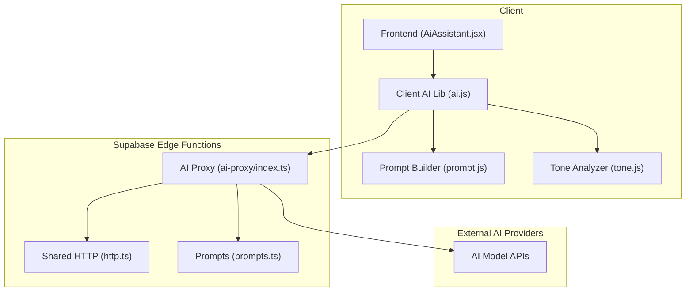
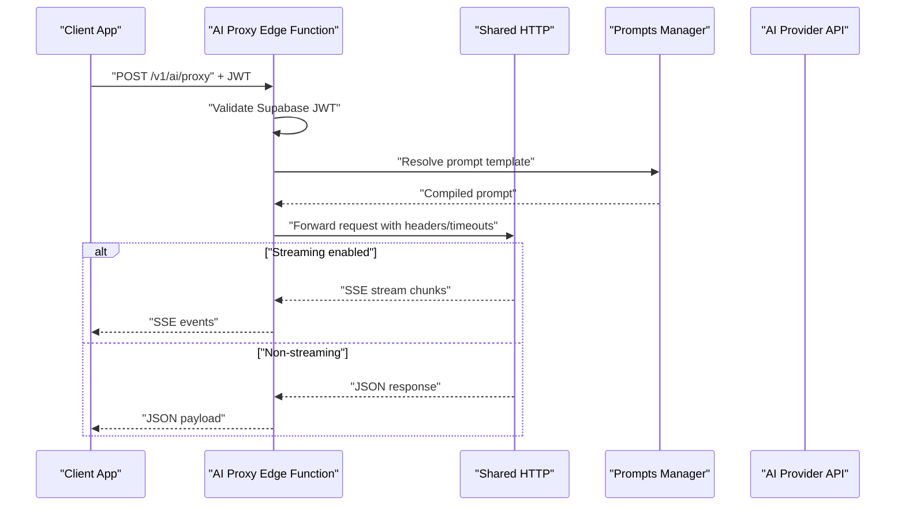
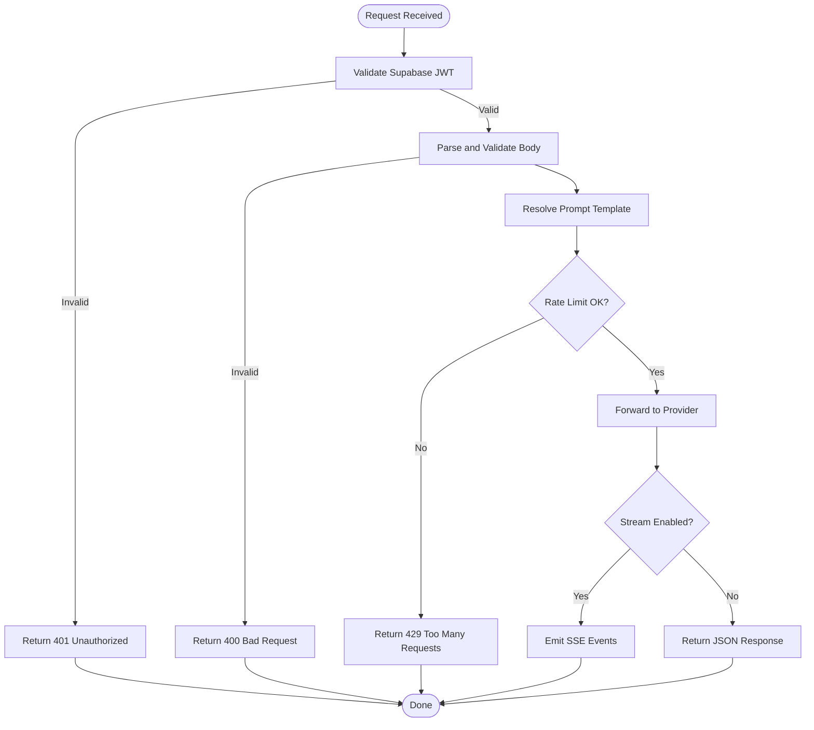
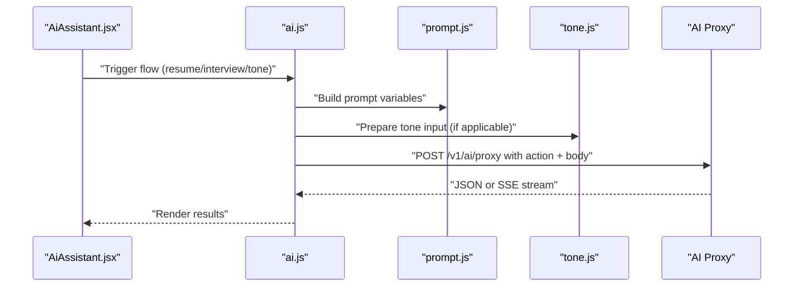
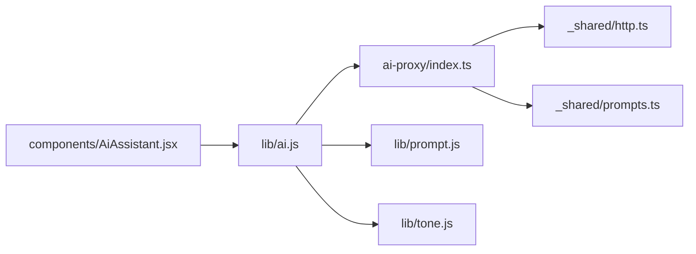

# AI Proxy Service

<cite>
**Referenced Files in This Document**
- [ai-proxy/index.ts](file://supabase/functions/ai-proxy/index.ts)
- [shared/http.ts](file://supabase/functions/_shared/http.ts)
- [shared/prompts.ts](file://supabase/functions/_shared/prompts.ts)
- [lib/ai.js](file://src/lib/ai.js)
- [lib/prompt.js](file://src/lib/prompt.js)
- [lib/tone.js](file://src/lib/tone.js)
- [components/AiAssistant.jsx](file://src/components/AiAssistant.jsx)
</cite>

## Table of Contents
1. [Introduction](#introduction)
2. [Project Structure](#project-structure)
3. [Core Components](#core-components)
4. [Architecture Overview](#architecture-overview)
5. [Detailed Component Analysis](#detailed-component-analysis)
6. [Dependency Analysis](#dependency-analysis)
7. [Performance Considerations](#performance-considerations)
8. [Troubleshooting Guide](#troubleshooting-guide)
9. [Conclusion](#conclusion)
10. [Appendices](#appendices)

## Introduction
This document provides detailed API documentation for the AI Proxy Edge Function that routes and proxies AI model requests on behalf of clients. It covers request routing, response streaming, authentication using Supabase JWT tokens, prompt management integration, rate limiting strategies, security considerations, client implementation examples, error handling patterns, timeout configurations, and performance optimization tips.

## Project Structure
The AI proxy is implemented as a Supabase Edge Function with shared utilities and frontend integrations:
- supabase/functions/ai-proxy/index.ts: Entry point for the proxy edge function
- supabase/functions/_shared/http.ts: HTTP helpers used by the proxy
- supabase/functions/_shared/prompts.ts: Prompt management utilities
- src/lib/ai.js: Client-side AI orchestration
- src/lib/prompt.js: Prompt composition helpers
- src/lib/tone.js: Tone analysis helper
- src/components/AiAssistant.jsx: UI component invoking AI features

**Diagram sources**
- [ai-proxy/index.ts](file://supabase/functions/ai-proxy/index.ts)
- [shared/http.ts](file://supabase/functions/_shared/http.ts)
- [shared/prompts.ts](file://supabase/functions/_shared/prompts.ts)
- [lib/ai.js](file://src/lib/ai.js)
- [lib/prompt.js](file://src/lib/prompt.js)
- [lib/tone.js](file://src/lib/tone.js)
- [components/AiAssistant.jsx](file://src/components/AiAssistant.jsx)

**Section sources**
- [ai-proxy/index.ts](file://supabase/functions/ai-proxy/index.ts)
- [shared/http.ts](file://supabase/functions/_shared/http.ts)
- [shared/prompts.ts](file://supabase/functions/_shared/prompts.ts)
- [lib/ai.js](file://src/lib/ai.js)
- [lib/prompt.js](file://src/lib/prompt.js)
- [lib/tone.js](file://src/lib/tone.js)
- [components/AiAssistant.jsx](file://src/components/AiAssistant.jsx)

## Core Components
- AI Proxy Edge Function: Validates Supabase JWT, parses typed requests, resolves prompts, forwards to external AI providers, streams responses when supported, and returns standardized JSON or SSE events.
- Shared HTTP Utilities: Provides consistent request/response wrappers, headers, timeouts, and streaming helpers.
- Prompt Management: Loads and composes prompts from configuration or storage, enabling dynamic prompt templates and versioning.
- Client AI Library: Orchestrates calls to the proxy, handles retries, timeouts, and SSE parsing on the client side.
- Prompt Builder: Composes structured prompts for resume analysis, interview questions, and tone analysis.
- Tone Analyzer: Prepares inputs for tone analysis endpoints.
- AiAssistant Component: User-facing UI that triggers AI flows and renders results.

**Section sources**
- [ai-proxy/index.ts](file://supabase/functions/ai-proxy/index.ts)
- [shared/http.ts](file://supabase/functions/_shared/http.ts)
- [shared/prompts.ts](file://supabase/functions/_shared/prompts.ts)
- [lib/ai.js](file://src/lib/ai.js)
- [lib/prompt.js](file://src/lib/prompt.js)
- [lib/tone.js](file://src/lib/tone.js)
- [components/AiAssistant.jsx](file://src/components/AiAssistant.jsx)

## Architecture Overview
The AI Proxy sits between the client and external AI providers. It enforces authentication, applies rate limits, manages prompts, and supports both JSON and streaming responses.

**Diagram sources**
- [ai-proxy/index.ts](file://supabase/functions/ai-proxy/index.ts)
- [shared/http.ts](file://supabase/functions/_shared/http.ts)
- [shared/prompts.ts](file://supabase/functions/_shared/prompts.ts)

## Detailed Component Analysis

### AI Proxy Edge Function API
- Endpoint: POST /v1/ai/proxy
- Authentication: Requires a valid Supabase JWT in the Authorization header as Bearer token. The proxy validates the token before processing.
- Request Body Schema:
  - action: string — one of "resume_analysis", "interview_questions", "tone_analysis"
  - prompt_key: string — key identifying the prompt template to use
  - variables: object — dynamic values injected into the prompt template
  - provider: string — target AI provider identifier
  - model: string — model name or variant
  - stream: boolean — enable server-sent events (SSE) streaming
  - options: object — provider-specific parameters (e.g., temperature, max_tokens)
- Response Formats:
  - Non-streaming: JSON with fields such as content, usage, and metadata
  - Streaming: SSE events with incremental chunks and final completion event
- Error Responses:
  - 401 Unauthorized if JWT is missing or invalid
  - 400 Bad Request for malformed payloads or unsupported actions
  - 429 Too Many Requests when rate limit exceeded
  - 5xx errors proxied from upstream providers with normalized error bodies

**Diagram sources**
- [ai-proxy/index.ts](file://supabase/functions/ai-proxy/index.ts)
- [shared/http.ts](file://supabase/functions/_shared/http.ts)
- [shared/prompts.ts](file://supabase/functions/_shared/prompts.ts)

**Section sources**
- [ai-proxy/index.ts](file://supabase/functions/ai-proxy/index.ts)
- [shared/http.ts](file://supabase/functions/_shared/http.ts)
- [shared/prompts.ts](file://supabase/functions/_shared/prompts.ts)

### Authentication and Security
- JWT Validation: The proxy checks the Supabase JWT signature and claims before forwarding any request.
- Header Sanitization: Only whitelisted headers are forwarded to providers; sensitive headers are stripped.
- Input Validation: Strict schema validation prevents injection and ensures safe prompt templating.
- Secrets Management: Provider keys are accessed via environment variables configured at runtime.
- Rate Limiting: Per-user or per-token limits enforced to protect upstream services.

**Section sources**
- [ai-proxy/index.ts](file://supabase/functions/ai-proxy/index.ts)
- [shared/http.ts](file://supabase/functions/_shared/http.ts)

### Prompt Management Integration
- Prompt Resolution: The proxy uses a prompt manager to load templates by key and inject variables safely.
- Versioning: Templates can be versioned and selected based on action or feature flags.
- Safety: Variables are escaped and validated to prevent prompt injection.

**Section sources**
- [shared/prompts.ts](file://supabase/functions/_shared/prompts.ts)

### Client Implementation Examples
- Resume Analysis:
  - Action: "resume_analysis"
  - Inputs: resume text, job description, optional scoring criteria
  - Output: structured analysis including strengths, gaps, and recommendations
- Interview Questions:
  - Action: "interview_questions"
  - Inputs: role, seniority, tech stack, focus areas
  - Output: curated question set with difficulty levels and expected answers
- Tone Analysis:
  - Action: "tone_analysis"
  - Inputs: message or email text
  - Output: sentiment, tone classification, and suggestions

**Diagram sources**
- [components/AiAssistant.jsx](file://src/components/AiAssistant.jsx)
- [lib/ai.js](file://src/lib/ai.js)
- [lib/prompt.js](file://src/lib/prompt.js)
- [lib/tone.js](file://src/lib/tone.js)
- [ai-proxy/index.ts](file://supabase/functions/ai-proxy/index.ts)

**Section sources**
- [components/AiAssistant.jsx](file://src/components/AiAssistant.jsx)
- [lib/ai.js](file://src/lib/ai.js)
- [lib/prompt.js](file://src/lib/prompt.js)
- [lib/tone.js](file://src/lib/tone.js)

### Error Handling Patterns
- Normalized Errors: All upstream errors are mapped to consistent JSON structures with codes and messages.
- Retry Strategy: Exponential backoff with jitter for transient failures.
- Timeouts: Configurable request timeouts and SSE read timeouts to avoid hanging connections.
- Graceful Degradation: Fallback models or cached responses when available.

**Section sources**
- [ai-proxy/index.ts](file://supabase/functions/ai-proxy/index.ts)
- [shared/http.ts](file://supabase/functions/_shared/http.ts)

### Rate Limiting Strategies
- Token-based Limits: Enforce per-Supabase-user quotas to prevent abuse.
- Global Caps: Apply global caps per action type to protect provider stability.
- Backpressure: Return 429 with retry-after hints when limits are hit.

**Section sources**
- [ai-proxy/index.ts](file://supabase/functions/ai-proxy/index.ts)

### Performance Optimization Tips
- Enable Streaming: Use stream=true for long outputs to reduce latency and memory usage.
- Cache Prompts: Reuse compiled prompts where possible to minimize overhead.
- Batch Requests: Combine multiple small queries into single calls when supported.
- Tune Options: Adjust temperature and max_tokens to balance quality and cost.

[No sources needed since this section provides general guidance]

## Dependency Analysis
The proxy depends on shared HTTP utilities and prompt management, while the client relies on AI orchestration libraries and UI components.

**Diagram sources**
- [ai-proxy/index.ts](file://supabase/functions/ai-proxy/index.ts)
- [shared/http.ts](file://supabase/functions/_shared/http.ts)
- [shared/prompts.ts](file://supabase/functions/_shared/prompts.ts)
- [lib/ai.js](file://src/lib/ai.js)
- [lib/prompt.js](file://src/lib/prompt.js)
- [lib/tone.js](file://src/lib/tone.js)
- [components/AiAssistant.jsx](file://src/components/AiAssistant.jsx)

**Section sources**
- [ai-proxy/index.ts](file://supabase/functions/ai-proxy/index.ts)
- [shared/http.ts](file://supabase/functions/_shared/http.ts)
- [shared/prompts.ts](file://supabase/functions/_shared/prompts.ts)
- [lib/ai.js](file://src/lib/ai.js)
- [lib/prompt.js](file://src/lib/prompt.js)
- [lib/tone.js](file://src/lib/tone.js)
- [components/AiAssistant.jsx](file://src/components/AiAssistant.jsx)

## Performance Considerations
- Prefer streaming for large outputs to improve perceived latency.
- Set appropriate timeouts to fail fast on slow providers.
- Use efficient prompt templates to reduce token usage.
- Monitor provider response times and adjust concurrency accordingly.

[No sources needed since this section provides general guidance]

## Troubleshooting Guide
- 401 Unauthorized: Ensure the Authorization header contains a valid Supabase JWT.
- 400 Bad Request: Verify action, prompt_key, and variables match expected schemas.
- 429 Too Many Requests: Implement retry with backoff and respect retry-after hints.
- Timeouts: Increase timeout settings or switch to non-streaming mode for heavy tasks.
- Provider Errors: Inspect normalized error bodies for upstream status codes and messages.

**Section sources**
- [ai-proxy/index.ts](file://supabase/functions/ai-proxy/index.ts)
- [shared/http.ts](file://supabase/functions/_shared/http.ts)

## Conclusion
The AI Proxy Edge Function centralizes authentication, prompt management, rate limiting, and provider communication, offering a secure and efficient interface for AI features. By following the documented API, error handling patterns, and performance tips, clients can reliably integrate resume analysis, interview question generation, and tone analysis capabilities.

[No sources needed since this section summarizes without analyzing specific files]

## Appendices

### Request/Response Schemas Summary
- Actions: "resume_analysis", "interview_questions", "tone_analysis"
- Headers: Authorization: Bearer <Supabase JWT>
- Body Fields: action, prompt_key, variables, provider, model, stream, options
- Responses: JSON payload or SSE events with chunked data and completion markers

**Section sources**
- [ai-proxy/index.ts](file://supabase/functions/ai-proxy/index.ts)
- [shared/http.ts](file://supabase/functions/_shared/http.ts)