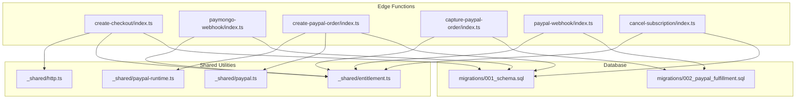
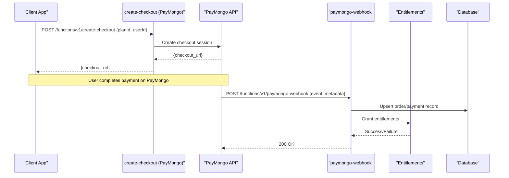
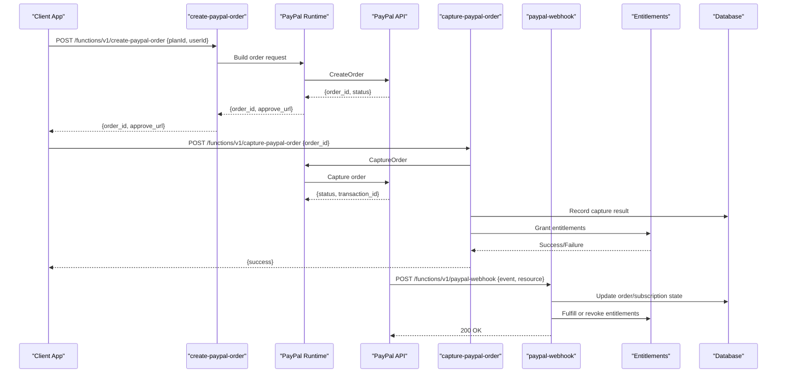
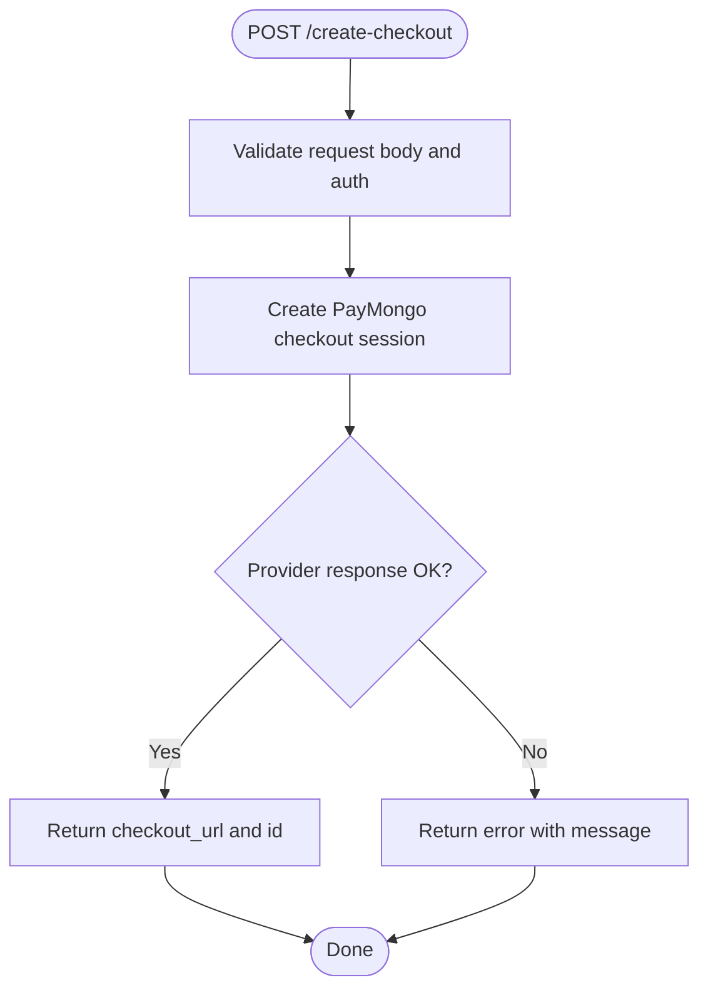
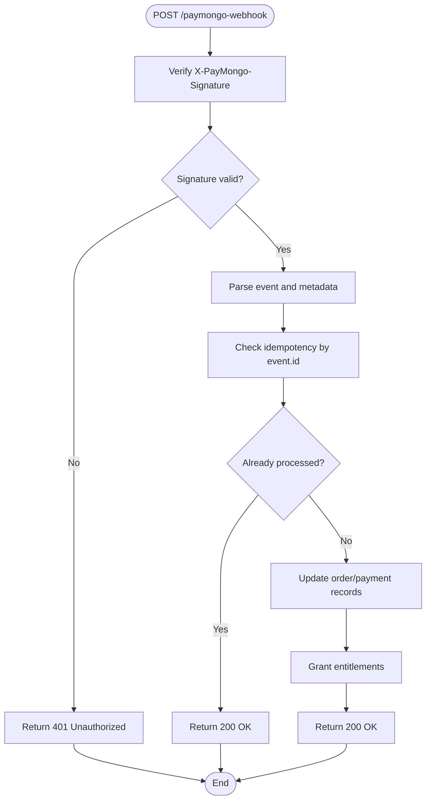
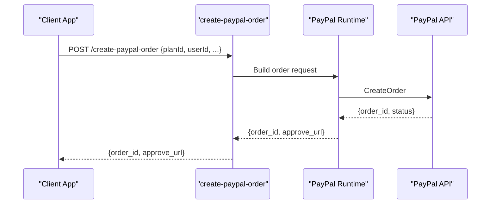
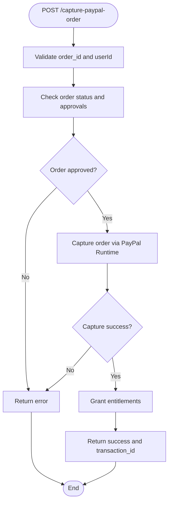
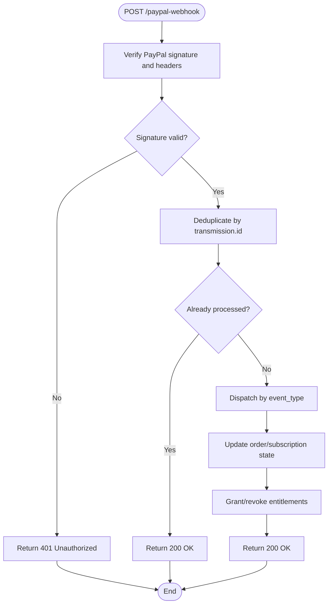
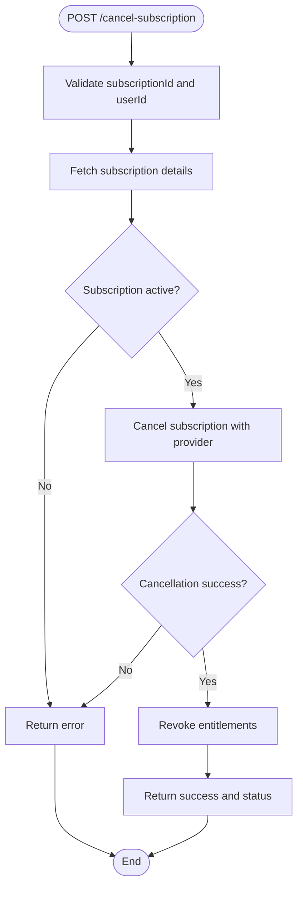
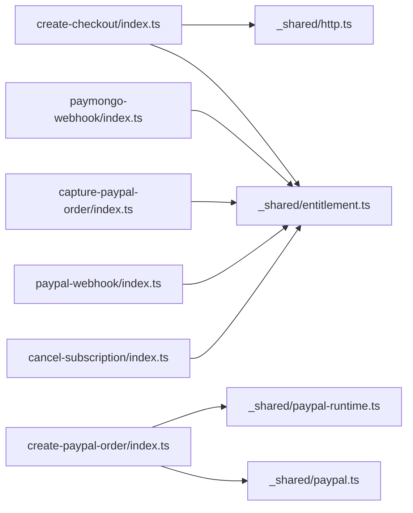

# Billing & Payment Functions

<cite>
**Referenced Files in This Document**
- [create-checkout/index.ts](file://supabase/functions/create-checkout/index.ts)
- [paymongo-webhook/index.ts](file://supabase/functions/paymongo-webhook/index.ts)
- [create-paypal-order/index.ts](file://supabase/functions/create-paypal-order/index.ts)
- [capture-paypal-order/index.ts](file://supabase/functions/capture-paypal-order/index.ts)
- [paypal-webhook/index.ts](file://supabase/functions/paypal-webhook/index.ts)
- [cancel-subscription/index.ts](file://supabase/functions/cancel-subscription/index.ts)
- [shared/http.ts](file://supabase/functions/_shared/http.ts)
- [shared/paypal-runtime.ts](file://supabase/functions/_shared/paypal-runtime.ts)
- [shared/paypal.ts](file://supabase/functions/_shared/paypal.ts)
- [shared/entitlement.ts](file://supabase/functions/_shared/entitlement.ts)
- [migrations/001_schema.sql](file://supabase/migrations/001_schema.sql)
- [migrations/002_paypal_fulfillment.sql](file://supabase/migrations/002_paypal_fulfillment.sql)
</cite>

## Table of Contents
1. [Introduction](#introduction)
2. [Project Structure](#project-structure)
3. [Core Components](#core-components)
4. [Architecture Overview](#architecture-overview)
5. [Detailed Component Analysis](#detailed-component-analysis)
6. [Dependency Analysis](#dependency-analysis)
7. [Performance Considerations](#performance-considerations)
8. [Troubleshooting Guide](#troubleshooting-guide)
9. [Conclusion](#conclusion)
10. [Appendices](#appendices)

## Introduction
This document provides comprehensive API documentation for billing and payment-related Edge Functions, including checkout creation endpoints for PayMongo and PayPal, webhook handlers for payment processing, order capture functions, and subscription cancellation services. It specifies HTTP methods, URL patterns, request/response schemas, webhook payload formats, signature verification, idempotency considerations, error handling strategies, security best practices, and client implementation examples. It also covers webhook retry mechanisms, failure handling, and monitoring approaches.

## Project Structure
The billing and payment system is implemented as Supabase Edge Functions with shared utilities and database migrations:

- Checkout creation: create-checkout (PayMongo), create-paypal-order (PayPal)
- Webhooks: paymongo-webhook, paypal-webhook
- Order capture: capture-paypal-order
- Subscription management: cancel-subscription
- Shared utilities: http, paypal runtime and helpers, entitlements
- Database schema: 001_schema.sql, 002_paypal_fulfillment.sql

**Diagram sources**
- [create-checkout/index.ts](file://supabase/functions/create-checkout/index.ts)
- [paymongo-webhook/index.ts](file://supabase/functions/paymongo-webhook/index.ts)
- [create-paypal-order/index.ts](file://supabase/functions/create-paypal-order/index.ts)
- [capture-paypal-order/index.ts](file://supabase/functions/capture-paypal-order/index.ts)
- [paypal-webhook/index.ts](file://supabase/functions/paypal-webhook/index.ts)
- [cancel-subscription/index.ts](file://supabase/functions/cancel-subscription/index.ts)
- [shared/http.ts](file://supabase/functions/_shared/http.ts)
- [shared/paypal-runtime.ts](file://supabase/functions/_shared/paypal-runtime.ts)
- [shared/paypal.ts](file://supabase/functions/_shared/paypal.ts)
- [shared/entitlement.ts](file://supabase/functions/_shared/entitlement.ts)
- [migrations/001_schema.sql](file://supabase/migrations/001_schema.sql)
- [migrations/002_paypal_fulfillment.sql](file://supabase/migrations/002_paypal_fulfillment.sql)

**Section sources**
- [create-checkout/index.ts](file://supabase/functions/create-checkout/index.ts)
- [paymongo-webhook/index.ts](file://supabase/functions/paymongo-webhook/index.ts)
- [create-paypal-order/index.ts](file://supabase/functions/create-paypal-order/index.ts)
- [capture-paypal-order/index.ts](file://supabase/functions/capture-paypal-order/index.ts)
- [paypal-webhook/index.ts](file://supabase/functions/paypal-webhook/index.ts)
- [cancel-subscription/index.ts](file://supabase/functions/cancel-subscription/index.ts)
- [shared/http.ts](file://supabase/functions/_shared/http.ts)
- [shared/paypal-runtime.ts](file://supabase/functions/_shared/paypal-runtime.ts)
- [shared/paypal.ts](file://supabase/functions/_shared/paypal.ts)
- [shared/entitlement.ts](file://supabase/functions/_shared/entitlement.ts)
- [migrations/001_schema.sql](file://supabase/migrations/001_schema.sql)
- [migrations/002_paypal_fulfillment.sql](file://supabase/migrations/002_paypal_fulfillment.sql)

## Core Components
- Create Checkout (PayMongo): Creates a PayMongo checkout session and returns a redirect URL to complete payment.
- PayMongo Webhook: Receives PayMongo events, verifies signatures, updates order status, and fulfills entitlements.
- Create PayPal Order: Creates a PayPal order via the PayPal runtime and returns order details for client approval.
- Capture PayPal Order: Captures an approved PayPal order and fulfills entitlements upon success.
- PayPal Webhook: Processes PayPal events, verifies signatures, updates order state, and manages subscriptions.
- Cancel Subscription: Cancels an active subscription and revokes entitlements accordingly.

Key responsibilities:
- Securely interact with external payment providers using environment variables.
- Enforce idempotency on webhooks and captures.
- Update database records for orders and subscriptions.
- Grant or revoke user entitlements based on payment outcomes.

**Section sources**
- [create-checkout/index.ts](file://supabase/functions/create-checkout/index.ts)
- [paymongo-webhook/index.ts](file://supabase/functions/paymongo-webhook/index.ts)
- [create-paypal-order/index.ts](file://supabase/functions/create-paypal-order/index.ts)
- [capture-paypal-order/index.ts](file://supabase/functions/capture-paypal-order/index.ts)
- [paypal-webhook/index.ts](file://supabase/functions/paypal-webhook/index.ts)
- [cancel-subscription/index.ts](file://supabase/functions/cancel-subscription/index.ts)

## Architecture Overview
The payment architecture integrates client flows with provider-specific Edge Functions and shared entitlement logic.

**Diagram sources**
- [create-checkout/index.ts](file://supabase/functions/create-checkout/index.ts)
- [paymongo-webhook/index.ts](file://supabase/functions/paymongo-webhook/index.ts)
- [shared/entitlement.ts](file://supabase/functions/_shared/entitlement.ts)
- [migrations/001_schema.sql](file://supabase/migrations/001_schema.sql)

**Diagram sources**
- [create-paypal-order/index.ts](file://supabase/functions/create-paypal-order/index.ts)
- [shared/paypal-runtime.ts](file://supabase/functions/_shared/paypal-runtime.ts)
- [shared/paypal.ts](file://supabase/functions/_shared/paypal.ts)
- [capture-paypal-order/index.ts](file://supabase/functions/capture-paypal-order/index.ts)
- [paypal-webhook/index.ts](file://supabase/functions/paypal-webhook/index.ts)
- [shared/entitlement.ts](file://supabase/functions/_shared/entitlement.ts)
- [migrations/002_paypal_fulfillment.sql](file://supabase/migrations/002_paypal_fulfillment.sql)

## Detailed Component Analysis

### Create Checkout (PayMongo)
- Purpose: Create a PayMongo checkout session and return a URL for the client to redirect users to complete payment.
- HTTP Method: POST
- URL Pattern: /functions/v1/create-checkout
- Request Body:
  - planId: string — identifier for the product/plan
  - userId: string — authenticated user identifier
  - currency?: string — ISO currency code (optional)
  - amount?: number — total amount in minor units (optional)
  - metadata?: object — arbitrary key-value pairs forwarded to provider
- Response Body:
  - checkout_url: string — PayMongo hosted checkout page
  - id: string — internal checkout reference
  - status: string — initial status (e.g., pending)
- Error Responses:
  - 400 Bad Request: Missing required fields
  - 500 Internal Server Error: Provider or network errors
- Idempotency: Not applicable at creation; rely on webhook idempotency for fulfillment.
- Security:
  - Validate authentication context for userId
  - Use environment variables for provider credentials
  - Sanitize and validate inputs

**Diagram sources**
- [create-checkout/index.ts](file://supabase/functions/create-checkout/index.ts)
- [shared/http.ts](file://supabase/functions/_shared/http.ts)

**Section sources**
- [create-checkout/index.ts](file://supabase/functions/create-checkout/index.ts)
- [shared/http.ts](file://supabase/functions/_shared/http.ts)

### PayMongo Webhook
- Purpose: Receive PayMongo events, verify signatures, update order/payment records, and fulfill entitlements.
- HTTP Method: POST
- URL Pattern: /functions/v1/paymongo-webhook
- Headers:
  - X-PayMongo-Signature: string — signature header for verification
- Request Body:
  - event: object — PayMongo event payload
  - data: object — event data (payment, checkout, etc.)
  - metadata: object — original metadata from checkout creation
- Signature Verification:
  - Verify HMAC signature using shared secret from environment
  - Reject requests with invalid or missing signatures
- Processing Logic:
  - Identify event type (e.g., payment.paid, checkout.completed)
  - Lookup order by metadata.orderId
  - Update order status and payment details
  - Grant entitlements if payment succeeded
- Idempotency:
  - Deduplicate events by event.id
  - Skip processing if already fulfilled
- Response:
  - 200 OK on successful processing
  - 400/401/403 for invalid signatures
  - 500 for internal errors
- Error Handling:
  - Log failures and continue processing other events
  - Retry strategy managed by provider; function should be idempotent

**Diagram sources**
- [paymongo-webhook/index.ts](file://supabase/functions/paymongo-webhook/index.ts)
- [shared/entitlement.ts](file://supabase/functions/_shared/entitlement.ts)

**Section sources**
- [paymongo-webhook/index.ts](file://supabase/functions/paymongo-webhook/index.ts)
- [shared/entitlement.ts](file://supabase/functions/_shared/entitlement.ts)

### Create PayPal Order
- Purpose: Create a PayPal order and return approval details for the client to finalize.
- HTTP Method: POST
- URL Pattern: /functions/v1/create-paypal-order
- Request Body:
  - planId: string — product/plan identifier
  - userId: string — authenticated user identifier
  - currency?: string — ISO currency code
  - amount?: number — total amount in minor units
  - metadata?: object — additional context
- Response Body:
  - order_id: string — PayPal order identifier
  - approve_url: string — client-side approval URL
  - status: string — initial order status
- Error Responses:
  - 400 Bad Request: Invalid input
  - 500 Internal Server Error: PayPal API or runtime errors
- Security:
  - Validate authentication context
  - Use PayPal runtime to manage tokens securely

**Diagram sources**
- [create-paypal-order/index.ts](file://supabase/functions/create-paypal-order/index.ts)
- [shared/paypal-runtime.ts](file://supabase/functions/_shared/paypal-runtime.ts)
- [shared/paypal.ts](file://supabase/functions/_shared/paypal.ts)

**Section sources**
- [create-paypal-order/index.ts](file://supabase/functions/create-paypal-order/index.ts)
- [shared/paypal-runtime.ts](file://supabase/functions/_shared/paypal-runtime.ts)
- [shared/paypal.ts](file://supabase/functions/_shared/paypal.ts)

### Capture PayPal Order
- Purpose: Capture an approved PayPal order and fulfill entitlements upon success.
- HTTP Method: POST
- URL Pattern: /functions/v1/capture-paypal-order
- Request Body:
  - order_id: string — PayPal order identifier
  - userId: string — authenticated user identifier
- Response Body:
  - success: boolean — capture outcome
  - transaction_id?: string — PayPal transaction identifier
  - status: string — updated order status
- Error Responses:
  - 400 Bad Request: Missing order_id
  - 404 Not Found: Order not found
  - 500 Internal Server Error: Capture or fulfillment errors
- Idempotency:
  - Check existing capture status before processing
  - Avoid duplicate captures
- Security:
  - Validate ownership of order_id against userId
  - Ensure only approved orders are captured

**Diagram sources**
- [capture-paypal-order/index.ts](file://supabase/functions/capture-paypal-order/index.ts)
- [shared/paypal-runtime.ts](file://supabase/functions/_shared/paypal-runtime.ts)
- [shared/entitlement.ts](file://supabase/functions/_shared/entitlement.ts)

**Section sources**
- [capture-paypal-order/index.ts](file://supabase/functions/capture-paypal-order/index.ts)
- [shared/paypal-runtime.ts](file://supabase/functions/_shared/paypal-runtime.ts)
- [shared/entitlement.ts](file://supabase/functions/_shared/entitlement.ts)

### PayPal Webhook
- Purpose: Process PayPal events, verify signatures, update order/subscription state, and manage entitlements.
- HTTP Method: POST
- URL Pattern: /functions/v1/paypal-webhook
- Headers:
  - PayPal-Auth-Algorithm: string — algorithm used for signature
  - PayPal-Transmission-ID: string — unique transmission ID
  - PayPal-Transmission-Time: string — timestamp
  - PayPal-Cert-URL: string — certificate URL
  - PayPal-Signature: string — signature value
- Request Body:
  - event_type: string — PayPal event type
  - resource: object — event resource (order, subscription, etc.)
  - metadata?: object — custom metadata
- Signature Verification:
  - Verify signature using provided certificate and algorithm
  - Validate transmission metadata
- Processing Logic:
  - Map event types to actions (e.g., ORDER.APPROVED, BILLING.SUBSCRIPTION.CANCELLED)
  - Update order/subscription records
  - Grant or revoke entitlements based on event
- Idempotency:
  - Deduplicate by transmission.id
  - Skip if already processed
- Response:
  - 200 OK on successful processing
  - 400/401/403 for invalid signatures or malformed payloads
  - 500 for internal errors

**Diagram sources**
- [paypal-webhook/index.ts](file://supabase/functions/paypal-webhook/index.ts)
- [shared/entitlement.ts](file://supabase/functions/_shared/entitlement.ts)

**Section sources**
- [paypal-webhook/index.ts](file://supabase/functions/paypal-webhook/index.ts)
- [shared/entitlement.ts](file://supabase/functions/_shared/entitlement.ts)

### Cancel Subscription
- Purpose: Cancel an active subscription and revoke associated entitlements.
- HTTP Method: POST
- URL Pattern: /functions/v1/cancel-subscription
- Request Body:
  - subscriptionId: string — provider subscription identifier
  - userId: string — authenticated user identifier
  - reason?: string — optional cancellation reason
- Response Body:
  - success: boolean — cancellation outcome
  - status: string — updated subscription status
- Error Responses:
  - 400 Bad Request: Missing subscriptionId or userId
  - 404 Not Found: Subscription not found
  - 500 Internal Server Error: Provider or internal errors
- Security:
  - Validate ownership of subscriptionId against userId
  - Ensure only active subscriptions can be cancelled
- Post-Cancellation:
  - Revoke entitlements immediately or at period end depending on policy
  - Update database records

**Diagram sources**
- [cancel-subscription/index.ts](file://supabase/functions/cancel-subscription/index.ts)
- [shared/entitlement.ts](file://supabase/functions/_shared/entitlement.ts)

**Section sources**
- [cancel-subscription/index.ts](file://supabase/functions/cancel-subscription/index.ts)
- [shared/entitlement.ts](file://supabase/functions/_shared/entitlement.ts)

## Dependency Analysis
The following diagram shows dependencies between Edge Functions and shared modules:

**Diagram sources**
- [create-checkout/index.ts](file://supabase/functions/create-checkout/index.ts)
- [paymongo-webhook/index.ts](file://supabase/functions/paymongo-webhook/index.ts)
- [create-paypal-order/index.ts](file://supabase/functions/create-paypal-order/index.ts)
- [capture-paypal-order/index.ts](file://supabase/functions/capture-paypal-order/index.ts)
- [paypal-webhook/index.ts](file://supabase/functions/paypal-webhook/index.ts)
- [cancel-subscription/index.ts](file://supabase/functions/cancel-subscription/index.ts)
- [shared/http.ts](file://supabase/functions/_shared/http.ts)
- [shared/paypal-runtime.ts](file://supabase/functions/_shared/paypal-runtime.ts)
- [shared/paypal.ts](file://supabase/functions/_shared/paypal.ts)
- [shared/entitlement.ts](file://supabase/functions/_shared/entitlement.ts)

**Section sources**
- [create-checkout/index.ts](file://supabase/functions/create-checkout/index.ts)
- [paymongo-webhook/index.ts](file://supabase/functions/paymongo-webhook/index.ts)
- [create-paypal-order/index.ts](file://supabase/functions/create-paypal-order/index.ts)
- [capture-paypal-order/index.ts](file://supabase/functions/capture-paypal-order/index.ts)
- [paypal-webhook/index.ts](file://supabase/functions/paypal-webhook/index.ts)
- [cancel-subscription/index.ts](file://supabase/functions/cancel-subscription/index.ts)
- [shared/http.ts](file://supabase/functions/_shared/http.ts)
- [shared/paypal-runtime.ts](file://supabase/functions/_shared/paypal-runtime.ts)
- [shared/paypal.ts](file://supabase/functions/_shared/paypal.ts)
- [shared/entitlement.ts](file://supabase/functions/_shared/entitlement.ts)

## Performance Considerations
- Minimize external API calls by caching provider responses where safe.
- Use connection pooling and timeouts when calling external APIs.
- Keep webhook handlers fast and idempotent; offload heavy work to background jobs if needed.
- Batch entitlement updates when possible to reduce database writes.
- Monitor latency and error rates for each provider integration.

[No sources needed since this section provides general guidance]

## Troubleshooting Guide
Common issues and resolutions:
- Invalid webhook signatures:
  - Ensure correct secrets and algorithms are configured
  - Verify headers and payload integrity
- Duplicate processing:
  - Confirm idempotency keys are used and checked
- Failed entitlement grants:
  - Check provider responses and database constraints
  - Implement retries with exponential backoff for transient errors
- Network timeouts:
  - Increase timeouts and implement circuit breakers
- Logging and monitoring:
  - Add structured logs for all critical steps
  - Track metrics for success/failure rates and latencies

**Section sources**
- [paymongo-webhook/index.ts](file://supabase/functions/paymongo-webhook/index.ts)
- [paypal-webhook/index.ts](file://supabase/functions/paypal-webhook/index.ts)
- [capture-paypal-order/index.ts](file://supabase/functions/capture-paypal-order/index.ts)
- [cancel-subscription/index.ts](file://supabase/functions/cancel-subscription/index.ts)

## Conclusion
The billing and payment system provides robust, secure, and idempotent workflows for both one-time payments and subscriptions across PayMongo and PayPal. By leveraging shared utilities for HTTP and provider interactions, and centralized entitlement management, the system ensures consistent fulfillment and reliable error handling. Proper signature verification, idempotency checks, and monitoring are essential to maintain reliability and security.

[No sources needed since this section summarizes without analyzing specific files]

## Appendices

### Client Implementation Examples
- PayMongo One-Time Payment Flow:
  - Initiate checkout via create-checkout endpoint
  - Redirect user to returned checkout_url
  - Wait for webhook confirmation before granting access
- PayPal One-Time Payment Flow:
  - Create order via create-paypal-order
  - Approve order on client side using approve_url
  - Capture order via capture-paypal-order
  - Fulfill entitlements upon success
- PayPal Subscription Management:
  - Create subscription through provider flow
  - Listen to paypal-webhook events for lifecycle changes
  - Cancel subscription via cancel-subscription endpoint

[No sources needed since this section provides conceptual guidance]

### Webhook Retry Mechanisms and Failure Handling
- Providers may retry failed deliveries; ensure functions are idempotent
- Implement deduplication using event IDs or transmission IDs
- Log all webhook attempts and outcomes for observability
- Use dead-letter queues for failed events requiring manual intervention

[No sources needed since this section provides conceptual guidance]

### Monitoring Approaches
- Track success/failure rates per endpoint
- Measure latency percentiles for provider calls
- Alert on signature verification failures and idempotency collisions
- Correlate logs with database state changes for audits

[No sources needed since this section provides conceptual guidance]