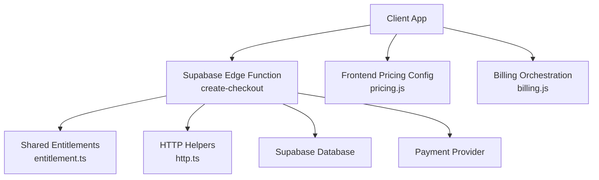
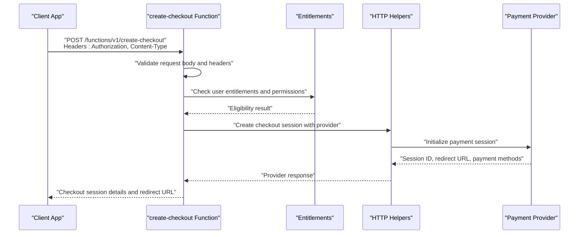
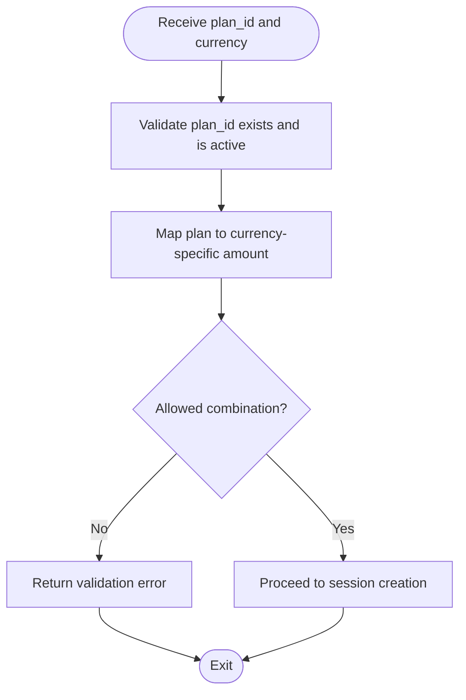
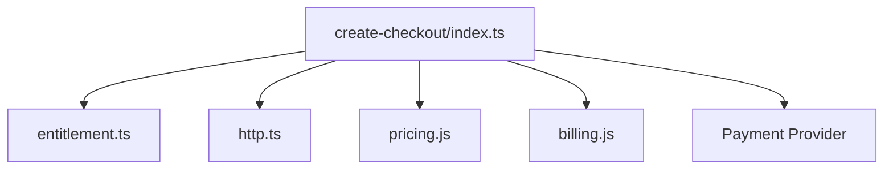

# Checkout Creation Functions

<cite>
**Referenced Files in This Document**
- [create-checkout/index.ts](file://supabase/functions/create-checkout/index.ts)
- [entitlement.ts](file://supabase/functions/_shared/entitlement.ts)
- [http.ts](file://supabase/functions/_shared/http.ts)
- [pricing.js](file://src/lib/pricing.js)
- [billing.js](file://src/lib/billing.js)
- [03-subscriptions-paymongo.md](file://docs/superpowers/plans/monetization/03-subscriptions-paymongo.md)
</cite>

## Table of Contents
1. [Introduction](#introduction)
2. [Project Structure](#project-structure)
3. [Core Components](#core-components)
4. [Architecture Overview](#architecture-overview)
5. [Detailed Component Analysis](#detailed-component-analysis)
6. [Dependency Analysis](#dependency-analysis)
7. [Performance Considerations](#performance-considerations)
8. [Troubleshooting Guide](#troubleshooting-guide)
9. [Security Considerations](#security-considerations)
10. [Conclusion](#conclusion)

## Introduction
This document provides detailed API documentation for the checkout creation function used to initiate subscription-based payments. It covers the HTTP endpoint, request parameters (including user authentication, pricing tier selection, and currency configuration), response schema (checkout session details, payment method options, and redirect URLs), implementation examples for different subscription plans, error handling scenarios, and security considerations such as input validation, rate limiting, and fraud prevention.

## Project Structure
The checkout creation flow is implemented as a serverless function within the Supabase Edge Functions runtime. The core logic resides in the create-checkout function, which integrates with shared entitlement utilities, HTTP helpers, and frontend billing libraries for pricing and client-side orchestration.

**Diagram sources**
- [create-checkout/index.ts](file://supabase/functions/create-checkout/index.ts)
- [entitlement.ts](file://supabase/functions/_shared/entitlement.ts)
- [http.ts](file://supabase/functions/_shared/http.ts)
- [pricing.js](file://src/lib/pricing.js)
- [billing.js](file://src/lib/billing.js)

**Section sources**
- [create-checkout/index.ts](file://supabase/functions/create-checkout/index.ts)
- [entitlement.ts](file://supabase/functions/_shared/entitlement.ts)
- [http.ts](file://supabase/functions/_shared/http.ts)
- [pricing.js](file://src/lib/pricing.js)
- [billing.js](file://src/lib/billing.js)

## Core Components
- Checkout Creation Function: Handles authenticated requests, validates inputs, resolves pricing tiers, constructs payment sessions, and returns redirect URLs and metadata.
- Shared Entitlements: Provides access control and entitlement checks relevant to checkout eligibility.
- HTTP Helpers: Encapsulates outbound calls to external services (e.g., payment provider).
- Frontend Billing Libraries: Provide pricing configuration and client-side orchestration for initiating checkout flows.

Key responsibilities:
- Enforce user authentication and authorization before creating a checkout session.
- Validate pricing tier selection and supported currencies.
- Create a checkout session with the payment provider and return necessary client-side data.
- Return structured responses including redirect URLs and payment method options.

**Section sources**
- [create-checkout/index.ts](file://supabase/functions/create-checkout/index.ts)
- [entitlement.ts](file://supabase/functions/_shared/entitlement.ts)
- [http.ts](file://supabase/functions/_shared/http.ts)
- [pricing.js](file://src/lib/pricing.js)
- [billing.js](file://src/lib/billing.js)

## Architecture Overview
The checkout creation process follows a clear sequence from client initiation through server-side validation and payment provider integration.

**Diagram sources**
- [create-checkout/index.ts](file://supabase/functions/create-checkout/index.ts)
- [entitlement.ts](file://supabase/functions/_shared/entitlement.ts)
- [http.ts](file://supabase/functions/_shared/http.ts)

## Detailed Component Analysis

### HTTP Endpoint
- Method: POST
- Path: /functions/v1/create-checkout
- Authentication: Required via Authorization header (Bearer token or Supabase session context)
- Content-Type: application/json

Request Parameters:
- user_id: Identifier of the authenticated user initiating checkout
- plan_id: Selected pricing tier identifier
- currency: ISO 4217 currency code (e.g., USD, EUR)
- success_url: Redirect URL after successful payment
- cancel_url: Redirect URL if the user cancels the payment
- metadata: Optional key-value pairs for tracking and analytics

Response Schema:
- checkout_session_id: Unique identifier for the created checkout session
- redirect_url: Full URL to complete the payment
- payment_methods: Array of available payment method identifiers
- status: Current state of the checkout session (e.g., pending, completed, canceled)
- expires_at: Timestamp when the session expires
- metadata: Echoed request metadata for client correlation

Example Response:
{
  "checkout_session_id": "cs_xxxxx",
  "redirect_url": "https://provider.example.com/checkout/cs_xxxxx",
  "payment_methods": ["card", "bank_transfer"],
  "status": "pending",
  "expires_at": "2025-01-01T00:00:00Z",
  "metadata": {
    "plan_id": "pro_monthly",
    "currency": "USD"
  }
}

Implementation Examples:
- Basic monthly plan checkout:
  - Request includes plan_id set to the monthly tier and currency configured to the user’s preferred currency.
  - Success and cancel URLs point to appropriate client routes.
- Annual plan checkout with promotional metadata:
  - Request includes plan_id for annual tier and additional metadata indicating promo codes or campaign IDs.
- Multi-currency support:
  - Requests specify supported currency codes; backend validates against allowed currencies and maps to provider-specific amounts.

Error Handling:
- Invalid request: Missing required fields or malformed JSON returns a 400-level error with descriptive message.
- Insufficient permissions: Unauthorized or forbidden responses indicate missing entitlements or invalid tokens.
- Service unavailability: Provider errors or timeouts return 500-level errors with retry guidance.

Security Considerations:
- Input validation: Strict schema validation for all request fields.
- Rate limiting: Enforce per-user and global limits to prevent abuse.
- Fraud prevention: Validate plan_id and currency combinations, enforce idempotency keys, and log suspicious patterns.

**Section sources**
- [create-checkout/index.ts](file://supabase/functions/create-checkout/index.ts)
- [entitlement.ts](file://supabase/functions/_shared/entitlement.ts)
- [http.ts](file://supabase/functions/_shared/http.ts)
- [pricing.js](file://src/lib/pricing.js)
- [billing.js](file://src/lib/billing.js)

### Pricing Tier Selection
Pricing tiers are defined centrally and referenced by plan_id. The checkout function validates that the selected plan exists and is active for the given currency.

- Supported plans: Monthly, Annual, Enterprise
- Currency mapping: Each plan has associated price points per currency
- Eligibility rules: Certain plans may require prior entitlement checks

**Diagram sources**
- [pricing.js](file://src/lib/pricing.js)
- [create-checkout/index.ts](file://supabase/functions/create-checkout/index.ts)

**Section sources**
- [pricing.js](file://src/lib/pricing.js)
- [create-checkout/index.ts](file://supabase/functions/create-checkout/index.ts)

### Currency Configuration
Currency configuration ensures that only supported currencies are accepted and mapped correctly to provider amounts.

- Supported currencies: Defined in configuration and validated at runtime
- Conversion rules: Plan prices are converted based on predefined rates
- Locale considerations: Display formatting handled on the client side

**Section sources**
- [pricing.js](file://src/lib/pricing.js)
- [create-checkout/index.ts](file://supabase/functions/create-checkout/index.ts)

### User Authentication and Permissions
Authentication is enforced at the function boundary using Supabase Edge Functions context. Permissions are checked via shared entitlements to ensure users can purchase selected plans.

- Authentication: Bearer token or session context validated
- Authorization: Entitlement checks determine eligibility for specific plans
- Session binding: Checkout session tied to authenticated user_id

**Section sources**
- [entitlement.ts](file://supabase/functions/_shared/entitlement.ts)
- [create-checkout/index.ts](file://supabase/functions/create-checkout/index.ts)

### Payment Method Options
Payment methods returned in the response reflect provider capabilities and regional availability.

- Methods: Card, bank transfer, digital wallets (as supported by provider)
- Dynamic availability: Determined by provider response and user region
- Client rendering: UI adapts to available methods

**Section sources**
- [create-checkout/index.ts](file://supabase/functions/create-checkout/index.ts)
- [http.ts](file://supabase/functions/_shared/http.ts)

### Redirect URLs
Redirect URLs guide users back to the application after payment completion or cancellation.

- success_url: Post-payment landing page
- cancel_url: Cancellation fallback page
- Validation: URLs must be whitelisted and securely bound to the session

**Section sources**
- [create-checkout/index.ts](file://supabase/functions/create-checkout/index.ts)

## Dependency Analysis
The checkout creation function depends on shared entitlements and HTTP helpers, while integrating with frontend billing libraries for pricing configuration and client orchestration.

**Diagram sources**
- [create-checkout/index.ts](file://supabase/functions/create-checkout/index.ts)
- [entitlement.ts](file://supabase/functions/_shared/entitlement.ts)
- [http.ts](file://supabase/functions/_shared/http.ts)
- [pricing.js](file://src/lib/pricing.js)
- [billing.js](file://src/lib/billing.js)

**Section sources**
- [create-checkout/index.ts](file://supabase/functions/create-checkout/index.ts)
- [entitlement.ts](file://supabase/functions/_shared/entitlement.ts)
- [http.ts](file://supabase/functions/_shared/http.ts)
- [pricing.js](file://src/lib/pricing.js)
- [billing.js](file://src/lib/billing.js)

## Performance Considerations
- Minimize round-trips: Batch validation and provider calls where possible.
- Cache pricing configurations: Reduce repeated lookups for static plan definitions.
- Idempotency: Use idempotency keys to avoid duplicate charges and improve resilience.
- Timeouts and retries: Configure provider call timeouts and implement exponential backoff for transient failures.

[No sources needed since this section provides general guidance]

## Troubleshooting Guide
Common issues and resolutions:
- Invalid request: Ensure all required fields are present and correctly formatted.
- Insufficient permissions: Verify user entitlements and plan eligibility.
- Provider errors: Check network connectivity and provider status; retry with backoff.
- Redirect failures: Confirm success_url and cancel_url are whitelisted and accessible.

Operational tips:
- Log request payloads and provider responses for diagnostics.
- Monitor error rates and latency metrics for the checkout function.
- Use structured error messages to aid client-side handling.

**Section sources**
- [create-checkout/index.ts](file://supabase/functions/create-checkout/index.ts)
- [http.ts](file://supabase/functions/_shared/http.ts)

## Security Considerations
Input validation:
- Enforce strict schemas for request bodies.
- Whitelist allowed plan_ids and currencies.
- Validate redirect URLs against an allowlist.

Rate limiting:
- Apply per-user and global rate limits to mitigate abuse.
- Implement throttling for high-frequency requests.

Fraud prevention:
- Require idempotency keys for checkout creation.
- Cross-check plan_id and currency combinations against known mappings.
- Detect anomalous patterns and flag for review.

Access control:
- Enforce authentication and authorization at the function boundary.
- Use short-lived tokens and secure session management.

**Section sources**
- [create-checkout/index.ts](file://supabase/functions/create-checkout/index.ts)
- [entitlement.ts](file://supabase/functions/_shared/entitlement.ts)
- [http.ts](file://supabase/functions/_shared/http.ts)

## Conclusion
The checkout creation function provides a secure, validated, and extensible entry point for initiating subscription payments. By enforcing strong authentication, validating pricing and currency selections, and returning comprehensive session details, it enables robust client-side checkout flows. Adhering to the security and performance recommendations ensures reliable operation and protection against common threats.

[No sources needed since this section summarizes without analyzing specific files]