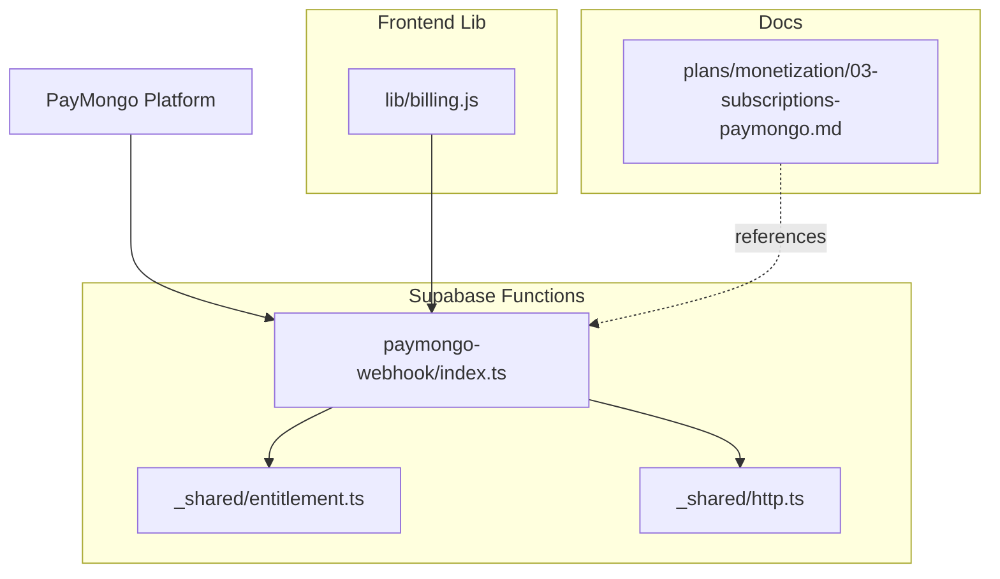
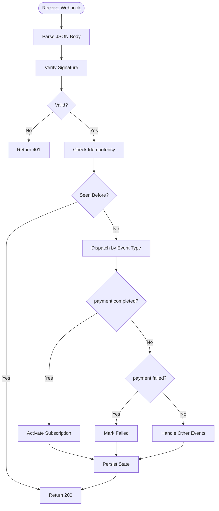
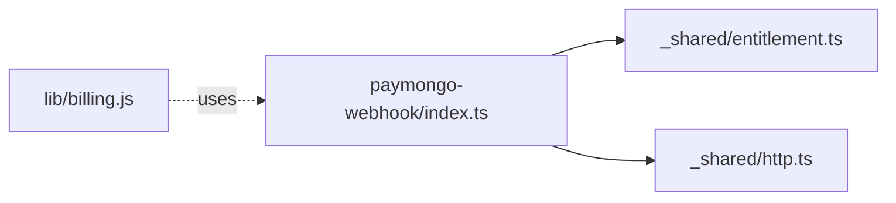

# PayMongo Webhook Handler

<cite>
**Referenced Files in This Document**
- [paymongo-webhook/index.ts](file://supabase/functions/paymongo-webhook/index.ts)
- [billing.js](file://src/lib/billing.js)
- [entitlement.ts](file://supabase/functions/_shared/entitlement.ts)
- [http.ts](file://supabase/functions/_shared/http.ts)
- [03-subscriptions-paymongo.md](file://docs/superpowers/plans/monetization/03-subscriptions-paymongo.md)
</cite>

## Table of Contents
1. Introduction
2. Project Structure
3. Core Components
4. Architecture Overview
5. Detailed Component Analysis
6. Dependency Analysis
7. Performance Considerations
8. Troubleshooting Guide
9. Conclusion

## Introduction
This document provides comprehensive webhook documentation for PayMongo payment processing within the project. It covers event types, payload structures, signature verification, idempotency and retry handling, error strategies, security best practices, and troubleshooting guidance. The implementation is a serverless function that receives PayMongo webhooks, validates them, processes events, updates subscription status, and ensures reliable delivery through idempotent operations.

## Project Structure
The PayMongo webhook handler is implemented as a Supabase Edge Function. Related billing logic and shared utilities are located under the functions and lib directories. Documentation for the monetization plan and PayMongo integration is included in the docs folder.

**Diagram sources**
- [paymongo-webhook/index.ts](file://supabase/functions/paymongo-webhook/index.ts)
- [entitlement.ts](file://supabase/functions/_shared/entitlement.ts)
- [http.ts](file://supabase/functions/_shared/http.ts)
- [billing.js](file://src/lib/billing.js)
- [03-subscriptions-paymongo.md](file://docs/superpowers/plans/monetization/03-subscriptions-paymongo.md)

**Section sources**
- [paymongo-webhook/index.ts](file://supabase/functions/paymongo-webhook/index.ts)
- [billing.js](file://src/lib/billing.js)
- [entitlement.ts](file://supabase/functions/_shared/entitlement.ts)
- [http.ts](file://supabase/functions/_shared/http.ts)
- [03-subscriptions-paymongo.md](file://docs/superpowers/plans/monetization/03-subscriptions-paymongo.md)

## Core Components
- Webhook endpoint: Receives HTTP POST requests from PayMongo, parses the body, verifies the signature, and dispatches to event handlers.
- Event handlers: Process specific event types such as payment.created, payment.completed, and payment.failed. They update subscription state and entitlements accordingly.
- Idempotency layer: Ensures duplicate events do not cause side effects by tracking processed event IDs.
- Security validation: Verifies webhook signatures using a secret and enforces secure configuration.
- Shared utilities: Provide HTTP helpers and entitlement management used across functions.

Key responsibilities:
- Validate request origin and signature
- Parse and normalize payloads
- Apply idempotency checks
- Update subscription and entitlement records
- Return appropriate HTTP responses to signal success or failure

**Section sources**
- [paymongo-webhook/index.ts](file://supabase/functions/paymongo-webhook/index.ts)
- [entitlement.ts](file://supabase/functions/_shared/entitlement.ts)
- [http.ts](file://supabase/functions/_shared/http.ts)

## Architecture Overview
The webhook flow involves receiving an event from PayMongo, validating it, processing the event, updating internal state (subscription and entitlements), and responding with success or error codes.

```mermaid
sequenceDiagram
participant PM as "PayMongo"
participant WH as "Webhook Handler"
participant ENT as "Entitlement Manager"
participant DB as "Database"
PM->>WH : "POST /functions/v1/paymongo-webhook"
WH->>WH : "Parse JSON body"
WH->>WH : "Verify signature"
alt "Signature invalid"
WH-->>PM : "401 Unauthorized"
else "Signature valid"
WH->>WH : "Check idempotency (event ID)"
alt "Already processed"
WH-->>PM : "200 OK"
else "New event"
alt "Event type : payment.completed"
WH->>ENT : "Update subscription status"
ENT->>DB : "Persist changes"
DB-->>ENT : "OK"
ENT-->>WH : "OK"
WH-->>PM : "200 OK"
else "Event type : payment.failed"
WH->>ENT : "Mark subscription as failed"
ENT->>DB : "Persist changes"
DB-->>ENT : "OK"
ENT-->>WH : "OK"
WH-->>PM : "200 OK"
else "Other events"
WH-->>PM : "200 OK"
end
end
end
```

**Diagram sources**
- [paymongo-webhook/index.ts](file://supabase/functions/paymongo-webhook/index.ts)
- [entitlement.ts](file://supabase/functions/_shared/entitlement.ts)

## Detailed Component Analysis

### Webhook Endpoint
Responsibilities:
- Accept POST requests at the designated function path
- Read and parse the JSON body
- Verify the webhook signature using the configured secret
- Route to event-specific handlers based on event type
- Enforce idempotency by checking previously processed event IDs
- Respond with appropriate HTTP status codes

Security considerations:
- Signature verification must be performed before any business logic
- Secrets should be stored securely via environment variables
- Reject malformed or unsigned requests early

Idempotency:
- Use the unique event identifier to prevent duplicate processing
- Store processed event IDs in a durable store (e.g., database table)
- Return success for duplicates to avoid retries

Error handling:
- Log errors with context (event ID, type, user reference)
- Return non-2xx only when necessary; prefer 200 for successfully handled events
- Surface actionable errors for debugging

**Section sources**
- [paymongo-webhook/index.ts](file://supabase/functions/paymongo-webhook/index.ts)

### Event Types and Payload Structures
Supported event types:
- payment.created
- payment.completed
- payment.failed

Payload structure guidelines:
- Each event includes a unique event ID for idempotency
- Events include metadata linking to the customer and subscription
- Payment events contain payment details such as amount, currency, and status

Processing expectations:
- For payment.created: acknowledge receipt and prepare fulfillment
- For payment.completed: activate or extend subscription access
- For payment.failed: mark subscription as failed and notify relevant systems

Note: Refer to the PayMongo platform documentation for exact field names and formats. Ensure your handler is resilient to schema evolution by ignoring unknown fields.

**Section sources**
- [paymongo-webhook/index.ts](file://supabase/functions/paymongo-webhook/index.ts)

### Subscription Status Updates
Actions:
- On successful payment completion, update subscription status to active or renewed
- On payment failure, set subscription status to failed or expired
- Maintain audit logs for all status transitions

Integration points:
- Entitlement manager updates user access rights based on subscription status
- Database persistence ensures consistency across reads and writes

Idempotent updates:
- Use upsert patterns keyed by subscription ID
- Avoid double-charging or redundant activations

**Section sources**
- [entitlement.ts](file://supabase/functions/_shared/entitlement.ts)
- [paymongo-webhook/index.ts](file://supabase/functions/paymongo-webhook/index.ts)

### Error Handling Strategies
Approach:
- Validate inputs and signatures first
- Catch and log exceptions with contextual information
- Return 200 for successfully processed events even if downstream updates fail, but record failures for later reconciliation
- Use structured logging for observability

Retry behavior:
- Rely on PayMongo’s retry policy for transient failures
- Ensure your handler is idempotent so retries do not cause side effects

**Section sources**
- [paymongo-webhook/index.ts](file://supabase/functions/paymongo-webhook/index.ts)

### Security Best Practices
- Signature validation: Always verify the webhook signature using the provided secret before processing
- Secret management: Store secrets in environment variables and never hardcode them
- IP whitelisting: If supported by your hosting environment, restrict inbound traffic to PayMongo IPs
- Input sanitization: Treat all incoming data as untrusted; validate and sanitize before use
- Least privilege: Limit database permissions to only what is required for webhook processing

**Section sources**
- [paymongo-webhook/index.ts](file://supabase/functions/paymongo-webhook/index.ts)
- [http.ts](file://supabase/functions/_shared/http.ts)

### Idempotency Requirements
- Use the event ID to deduplicate requests
- Persist processed event IDs with timestamps
- Skip reprocessing if the same event ID is received again
- Ensure database constraints prevent duplicate entries where possible

**Section sources**
- [paymongo-webhook/index.ts](file://supabase/functions/paymongo-webhook/index.ts)

### Retry Mechanisms
- Configure your runtime to handle transient network errors gracefully
- Let PayMongo manage retries for failed deliveries
- Keep handlers fast and idempotent to support retries without side effects

**Section sources**
- [paymongo-webhook/index.ts](file://supabase/functions/paymongo-webhook/index.ts)

### Examples of Processing Different Webhook Events
- payment.created: Acknowledge and queue fulfillment tasks
- payment.completed: Activate subscription and grant entitlements
- payment.failed: Mark subscription as failed and trigger notifications

Implementation notes:
- Branch logic by event type
- Perform minimal work per branch to reduce latency
- Record outcomes for auditing and debugging

**Section sources**
- [paymongo-webhook/index.ts](file://supabase/functions/paymongo-webhook/index.ts)

### Updating Subscription Status
Flow:
- Map event outcome to desired subscription state
- Call entitlement manager to apply changes
- Persist state and return success

Best practices:
- Use transactions to ensure consistency
- Include correlation IDs for tracing
- Handle partial failures with compensating actions

**Section sources**
- [entitlement.ts](file://supabase/functions/_shared/entitlement.ts)
- [paymongo-webhook/index.ts](file://supabase/functions/paymongo-webhook/index.ts)

### Handling Payment Failures
Actions:
- Set subscription status to failed/expired
- Optionally pause services tied to paid features
- Notify users and support teams
- Schedule review or retry workflows as needed

**Section sources**
- [paymongo-webhook/index.ts](file://supabase/functions/paymongo-webhook/index.ts)

### Conceptual Overview

[No sources needed since this diagram shows conceptual workflow, not actual code structure]

## Dependency Analysis
The webhook handler depends on shared utilities for HTTP operations and entitlement management. Frontend billing logic may interact with the webhook indirectly via API calls.

**Diagram sources**
- [paymongo-webhook/index.ts](file://supabase/functions/paymongo-webhook/index.ts)
- [entitlement.ts](file://supabase/functions/_shared/entitlement.ts)
- [http.ts](file://supabase/functions/_shared/http.ts)
- [billing.js](file://src/lib/billing.js)

**Section sources**
- [paymongo-webhook/index.ts](file://supabase/functions/paymongo-webhook/index.ts)
- [entitlement.ts](file://supabase/functions/_shared/entitlement.ts)
- [http.ts](file://supabase/functions/_shared/http.ts)
- [billing.js](file://src/lib/billing.js)

## Performance Considerations
- Keep webhook handlers fast and stateless where possible
- Minimize database round-trips by batching updates
- Use indexes on frequently queried fields (e.g., event ID, subscription ID)
- Enable connection pooling for database access
- Monitor cold start times and optimize dependencies

[No sources needed since this section provides general guidance]

## Troubleshooting Guide
Common issues:
- Signature verification failures: Check secret configuration and timestamp skew
- Duplicate processing: Ensure idempotency keys are persisted and checked
- Missing events: Inspect PayMongo dashboard for delivery status and retry attempts
- Slow responses: Profile handler execution and reduce I/O operations

Debugging techniques:
- Log event IDs, types, and user references
- Capture request headers and payload summaries (sanitized)
- Correlate logs with PayMongo event IDs
- Use structured logging and centralized monitoring

Operational tips:
- Implement health checks for the webhook endpoint
- Alert on high error rates or slow response times
- Periodically reconcile subscription states against payment records

**Section sources**
- [paymongo-webhook/index.ts](file://supabase/functions/paymongo-webhook/index.ts)

## Conclusion
The PayMongo webhook handler integrates payment events into subscription and entitlement management with strong emphasis on security, idempotency, and reliability. By validating signatures, enforcing idempotency, and handling errors gracefully, the system ensures consistent state and robust operation. Follow the security best practices and troubleshooting guidance to maintain a healthy webhook pipeline.

[No sources needed since this section summarizes without analyzing specific files]