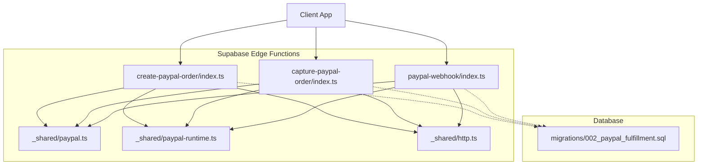
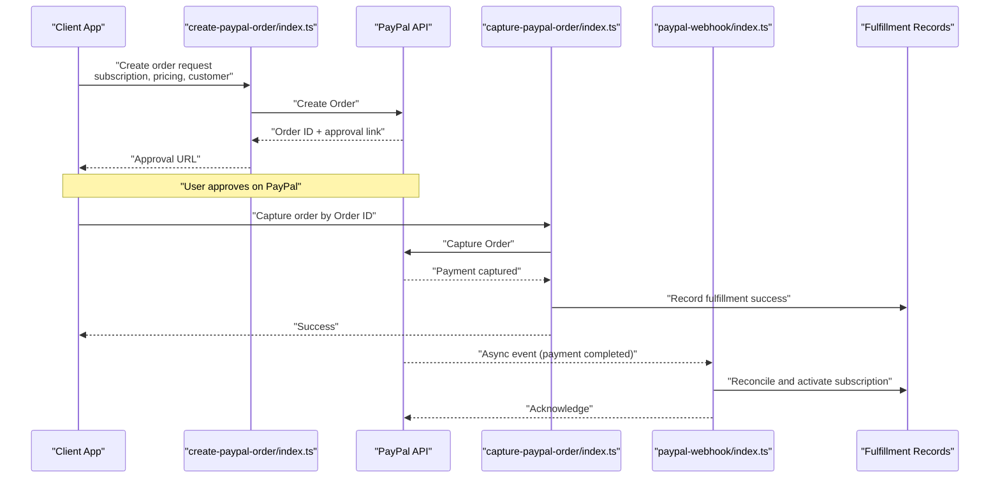
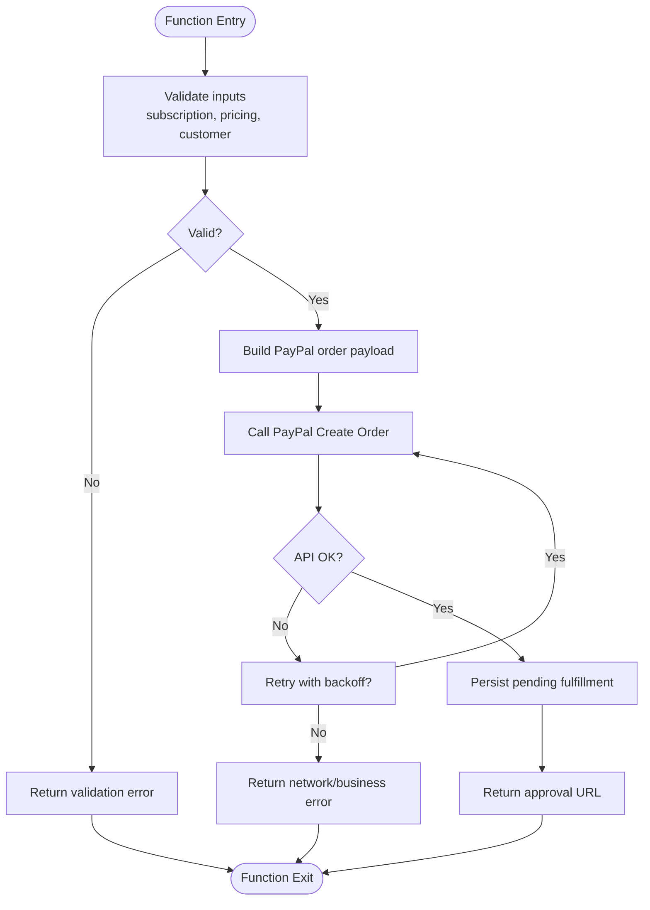
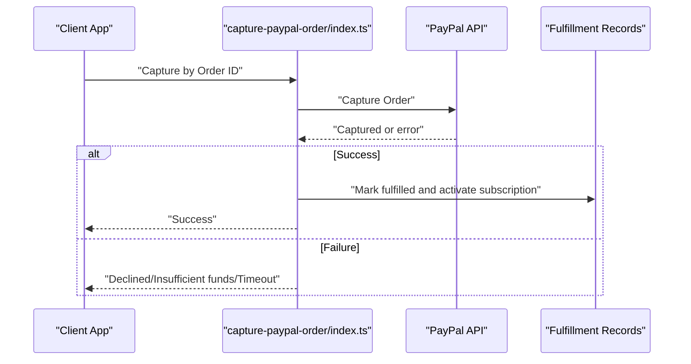
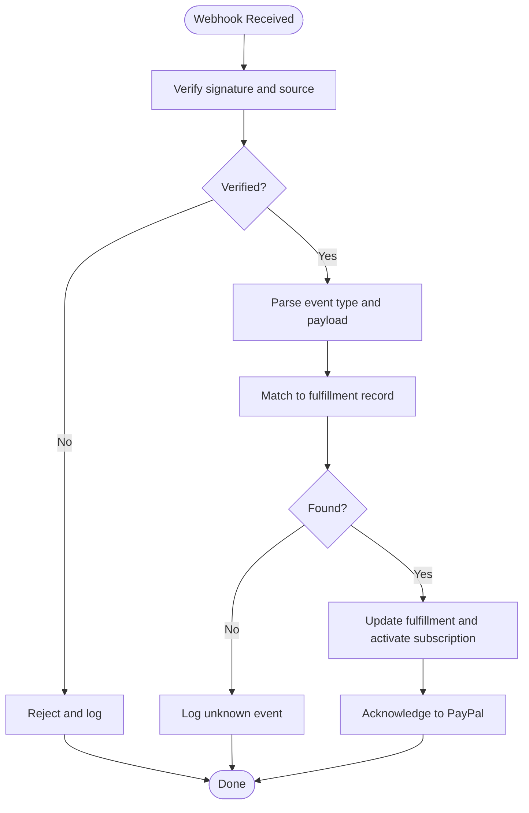
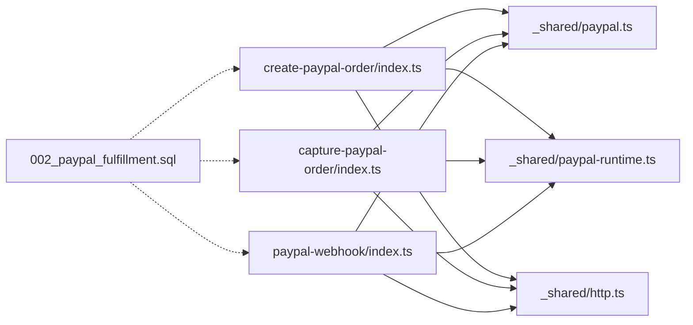

# PayPal Order Management

<cite>
**Referenced Files in This Document**
- [create-paypal-order/index.ts](file://supabase/functions/create-paypal-order/index.ts)
- [capture-paypal-order/index.ts](file://supabase/functions/capture-paypal-order/index.ts)
- [paypal-webhook/index.ts](file://supabase/functions/paypal-webhook/index.ts)
- [_shared/paypal.ts](file://supabase/functions/_shared/paypal.ts)
- [_shared/paypal-runtime.ts](file://supabase/functions/_shared/paypal-runtime.ts)
- [_shared/http.ts](file://supabase/functions/_shared/http.ts)
- [002_paypal_fulfillment.sql](file://supabase/migrations/002_paypal_fulfillment.sql)
</cite>

## Table of Contents
1. [Introduction](#introduction)
2. [Project Structure](#project-structure)
3. [Core Components](#core-components)
4. [Architecture Overview](#architecture-overview)
5. [Detailed Component Analysis](#detailed-component-analysis)
6. [Dependency Analysis](#dependency-analysis)
7. [Performance Considerations](#performance-considerations)
8. [Troubleshooting Guide](#troubleshooting-guide)
9. [Conclusion](#conclusion)
10. [Appendices](#appendices)

## Introduction
This document explains the PayPal order management implementation for creating and capturing orders, including end-to-end workflows from order initiation to payment completion. It covers:
- The create-order endpoint for subscription details, pricing, and customer information
- The capture-order endpoint for finalizing payments and updating subscription status
- Error handling for declined payments, insufficient funds, and network timeouts
- Integration examples with retry logic and state synchronization between PayPal and application databases

## Project Structure
The PayPal integration is implemented as Supabase Edge Functions with shared utilities and a database migration for fulfillment records.

**Diagram sources**
- [create-paypal-order/index.ts](file://supabase/functions/create-paypal-order/index.ts)
- [capture-paypal-order/index.ts](file://supabase/functions/capture-paypal-order/index.ts)
- [paypal-webhook/index.ts](file://supabase/functions/paypal-webhook/index.ts)
- [_shared/paypal.ts](file://supabase/functions/_shared/paypal.ts)
- [_shared/paypal-runtime.ts](file://supabase/functions/_shared/paypal-runtime.ts)
- [_shared/http.ts](file://supabase/functions/_shared/http.ts)
- [002_paypal_fulfillment.sql](file://supabase/migrations/002_paypal_fulfillment.sql)

**Section sources**
- [create-paypal-order/index.ts](file://supabase/functions/create-paypal-order/index.ts)
- [capture-paypal-order/index.ts](file://supabase/functions/capture-paypl-order/index.ts)
- [paypal-webhook/index.ts](file://supabase/functions/paypal-webhook/index.ts)
- [_shared/paypal.ts](file://supabase/functions/_shared/paypal.ts)
- [_shared/paypal-runtime.ts](file://supabase/functions/_shared/paypal-runtime.ts)
- [_shared/http.ts](file://supabase/functions/_shared/http.ts)
- [002_paypal_fulfillment.sql](file://supabase/migrations/002_paypal_fulfillment.sql)

## Core Components
- Create Order Function: Accepts subscription plan, pricing, and customer context; calls PayPal to create an order and returns the approval URL.
- Capture Order Function: Finalizes a previously approved order, updates local fulfillment state, and activates subscriptions if applicable.
- Webhook Handler: Processes asynchronous PayPal events (e.g., payment completions) to reconcile state and activate subscriptions.
- Shared Utilities:
  - PayPal client helpers for authentication and API calls
  - HTTP transport abstraction for requests and retries
  - Runtime configuration loader for secrets

Key responsibilities:
- Input validation and normalization
- Idempotent operations where possible
- Robust error classification and user-facing messages
- State synchronization via fulfillment records

**Section sources**
- [create-paypal-order/index.ts](file://supabase/functions/create-paypal-order/index.ts)
- [capture-paypal-order/index.ts](file://supabase/functions/capture-paypal-order/index.ts)
- [paypal-webhook/index.ts](file://supabase/functions/paypal-webhook/index.ts)
- [_shared/paypal.ts](file://supabase/functions/_shared/paypal.ts)
- [_shared/paypal-runtime.ts](file://supabase/functions/_shared/paypal-runtime.ts)
- [_shared/http.ts](file://supabase/functions/_shared/http.ts)

## Architecture Overview
End-to-end flow from order creation to payment completion and subscription activation.

**Diagram sources**
- [create-paypal-order/index.ts](file://supabase/functions/create-paypal-order/index.ts)
- [capture-paypal-order/index.ts](file://supabase/functions/capture-paypal-order/index.ts)
- [paypal-webhook/index.ts](file://supabase/functions/paypal-webhook/index.ts)

## Detailed Component Analysis

### Create Order Endpoint
Purpose:
- Validate inputs for subscription plan, pricing, and customer data
- Build a PayPal order payload
- Call PayPal to create an order
- Return the approval URL to the client

Request parameters:
- Subscription details: plan identifier, billing cycle, start date
- Pricing: currency, amount, tax/shipping breakdown if applicable
- Customer information: email, name, optional shipping address
- Contextual metadata: internal order reference, callback URLs

Processing logic:
- Normalize and validate input fields
- Construct PayPal order body with items and purchase units
- Invoke PayPal create order via shared utilities
- Persist a pending fulfillment record for idempotency and auditability
- Return approval URL and order reference

Error handling:
- Invalid or missing fields return clear validation errors
- Network failures are retried with backoff
- PayPal business errors are mapped to user-friendly messages

Integration notes:
- Use idempotency keys when available
- Store minimal PII locally; rely on PayPal for sensitive data

**Section sources**
- [create-paypal-order/index.ts](file://supabase/functions/create-paypal-order/index.ts)
- [_shared/paypal.ts](file://supabase/functions/_shared/paypal.ts)
- [_shared/http.ts](file://supabase/functions/_shared/http.ts)
- [_shared/paypal-runtime.ts](file://supabase/functions/_shared/paypal-runtime.ts)

#### Create Order Flowchart

**Diagram sources**
- [create-paypal-order/index.ts](file://supabase/functions/create-paypal-order/index.ts)
- [_shared/http.ts](file://supabase/functions/_shared/http.ts)

### Capture Order Endpoint
Purpose:
- Finalize a previously approved PayPal order
- Update fulfillment status to paid
- Activate subscription entitlements

Request parameters:
- Order ID (from create-order response)
- Optional authorization token if required by your flow
- Internal identifiers for linking to user accounts and plans

Processing logic:
- Validate presence of Order ID
- Call PayPal capture using shared utilities
- On success, update fulfillment records and activate subscription
- On failure, classify error and return actionable message

Error handling:
- Declined payment: inform user and allow retry with updated payment method
- Insufficient funds: prompt re-authentication or alternative payment
- Network timeout: retry with exponential backoff and circuit breaker hints

Idempotency:
- Ensure repeated captures do not double-charge
- Record capture attempts and outcomes

**Section sources**
- [capture-paypal-order/index.ts](file://supabase/functions/capture-paypal-order/index.ts)
- [_shared/paypal.ts](file://supabase/functions/_shared/paypal.ts)
- [_shared/http.ts](file://supabase/functions/_shared/http.ts)
- [_shared/paypal-runtime.ts](file://supabase/functions/_shared/paypal-runtime.ts)

#### Capture Order Sequence

**Diagram sources**
- [capture-paypal-order/index.ts](file://supabase/functions/capture-paypal-order/index.ts)
- [_shared/paypal.ts](file://supabase/functions/_shared/paypal.ts)

### PayPal Webhook Handler
Purpose:
- Receive asynchronous PayPal events (e.g., payment completed)
- Reconcile order state and ensure subscription activation even if capture fails
- Maintain consistent state across systems

Processing logic:
- Verify webhook signature and source
- Parse event type and payload
- Match event to existing fulfillment records
- Update status and trigger subscription activation
- Acknowledge receipt to PayPal

Error handling:
- Reject unknown or malformed events
- Log and surface verification failures
- Implement idempotent processing to avoid duplicate activations

**Section sources**
- [paypal-webhook/index.ts](file://supabase/functions/paypal-webhook/index.ts)
- [_shared/paypal.ts](file://supabase/functions/_shared/paypal.ts)
- [_shared/http.ts](file://supabase/functions/_shared/http.ts)

#### Webhook Processing Flow

**Diagram sources**
- [paypal-webhook/index.ts](file://supabase/functions/paypal-webhook/index.ts)

### Shared Utilities

#### PayPal Client Helpers
Responsibilities:
- Authenticate with PayPal using runtime-configured credentials
- Build and send REST API requests for order lifecycle operations
- Map PayPal error codes to domain-specific messages

Complexity considerations:
- Minimize token refresh overhead by caching tokens within function lifetime
- Use connection pooling via HTTP client

**Section sources**
- [_shared/paypal.ts](file://supabase/functions/_shared/paypal.ts)
- [_shared/paypal-runtime.ts](file://supabase/functions/_shared/paypal-runtime.ts)

#### HTTP Transport Abstraction
Responsibilities:
- Provide standardized request/response handling
- Implement retry with exponential backoff and jitter
- Enforce timeouts and circuit breaker hints for resilience

Error classification:
- Network errors vs. server errors vs. client errors
- Distinguish transient vs. permanent failures

**Section sources**
- [_shared/http.ts](file://supabase/functions/_shared/http.ts)

### Database Schema for Fulfillment
The migration defines tables and indexes necessary to track order fulfillment, capture attempts, and subscription activation. Typical fields include:
- Unique order reference
- Status transitions (pending, captured, failed)
- Timestamps for auditing
- Links to user accounts and subscription plans

Ensure:
- Unique constraints to prevent duplicates
- Indexes on frequently queried columns (order_id, user_id, status)
- Audit trails for compliance

**Section sources**
- [002_paypal_fulfillment.sql](file://supabase/migrations/002_paypal_fulfillment.sql)

## Dependency Analysis
Internal dependencies:
- create-paypal-order depends on shared PayPal client, HTTP transport, and runtime config
- capture-paypal-order depends on shared PayPal client, HTTP transport, and runtime config
- paypal-webhook depends on shared PayPal client, HTTP transport, and runtime config
- All functions may interact with fulfillment records defined in the migration

External dependencies:
- PayPal REST APIs for order creation and capture
- Supabase Edge runtime for environment variables and execution context

**Diagram sources**
- [create-paypal-order/index.ts](file://supabase/functions/create-paypal-order/index.ts)
- [capture-paypal-order/index.ts](file://supabase/functions/capture-paypal-order/index.ts)
- [paypal-webhook/index.ts](file://supabase/functions/paypal-webhook/index.ts)
- [_shared/paypal.ts](file://supabase/functions/_shared/paypal.ts)
- [_shared/paypal-runtime.ts](file://supabase/functions/_shared/paypal-runtime.ts)
- [_shared/http.ts](file://supabase/functions/_shared/http.ts)
- [002_paypal_fulfillment.sql](file://supabase/migrations/002_paypal_fulfillment.sql)

**Section sources**
- [create-paypal-order/index.ts](file://supabase/functions/create-paypal-order/index.ts)
- [capture-paypal-order/index.ts](file://supabase/functions/capture-paypal-order/index.ts)
- [paypal-webhook/index.ts](file://supabase/functions/paypal-webhook/index.ts)
- [_shared/paypal.ts](file://supabase/functions/_shared/paypal.ts)
- [_shared/paypal-runtime.ts](file://supabase/functions/_shared/paypal-runtime.ts)
- [_shared/http.ts](file://supabase/functions/_shared/http.ts)
- [002_paypal_fulfillment.sql](file://supabase/migrations/002_paypal_fulfillment.sql)

## Performance Considerations
- Token caching: reuse PayPal access tokens within function lifetime to reduce latency
- Connection reuse: leverage HTTP client pooling for outbound calls
- Idempotency: use unique order references to prevent duplicate charges
- Backoff and jitter: implement exponential backoff with randomization for retries
- Timeouts: set reasonable request timeouts to fail fast under load
- Minimal payloads: pass only necessary fields to reduce bandwidth and parsing time

[No sources needed since this section provides general guidance]

## Troubleshooting Guide
Common issues and resolutions:
- Declined payments:
  - Check PayPal error code and message
  - Prompt user to update payment method and retry capture
  - Log attempt with correlation IDs for support
- Insufficient funds:
  - Inform user and suggest alternative funding source
  - Allow retry after user updates payment method
- Network timeouts:
  - Enable retries with exponential backoff
  - Monitor upstream service health and circuit breaker metrics
- Signature verification failures:
  - Validate webhook secret and timestamp tolerance
  - Reject and log suspicious events

Operational tips:
- Correlate logs using order IDs and webhook event IDs
- Track fulfillment state transitions for auditability
- Alert on high failure rates or repeated declines

**Section sources**
- [capture-paypal-order/index.ts](file://supabase/functions/capture-paypal-order/index.ts)
- [paypal-webhook/index.ts](file://supabase/functions/paypal-webhook/index.ts)
- [_shared/http.ts](file://supabase/functions/_shared/http.ts)

## Conclusion
The PayPal order management implementation provides a robust, resilient workflow for creating orders, capturing payments, and synchronizing state through webhooks. By leveraging shared utilities for authentication, HTTP transport, and runtime configuration, the system ensures consistency, idempotency, and clear error handling. Proper integration patterns—such as retry logic, state reconciliation, and comprehensive logging—help maintain reliability and a smooth user experience.

[No sources needed since this section summarizes without analyzing specific files]

## Appendices

### Integration Examples

- Creating an order:
  - Collect subscription plan, pricing, and customer info
  - Call create-order endpoint
  - Redirect user to approval URL
  - On return, proceed to capture

- Capturing an order:
  - Send Order ID to capture endpoint
  - Handle success and failure responses
  - Update UI and notify user

- Handling webhooks:
  - Verify signature and parse event
  - Match to fulfillment record
  - Activate subscription and acknowledge

- Error handling and retries:
  - Classify errors (declined, insufficient funds, timeout)
  - Apply retry with backoff for transient failures
  - Surface actionable messages to users

- State synchronization:
  - Persist fulfillment records at each step
  - Reconcile via webhooks to ensure eventual consistency
  - Provide admin tools to inspect and repair state

[No sources needed since this section provides general guidance]