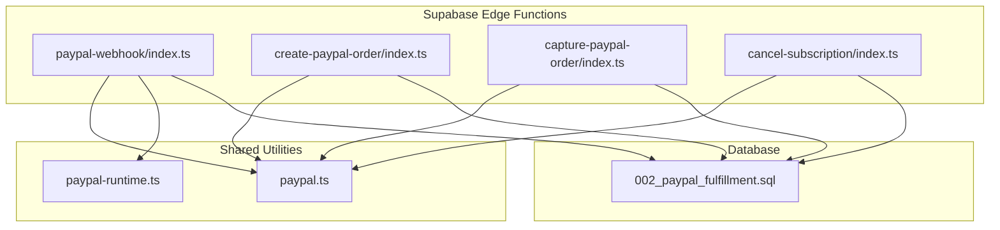
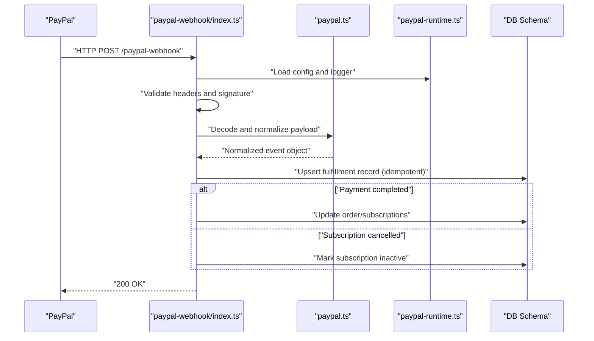
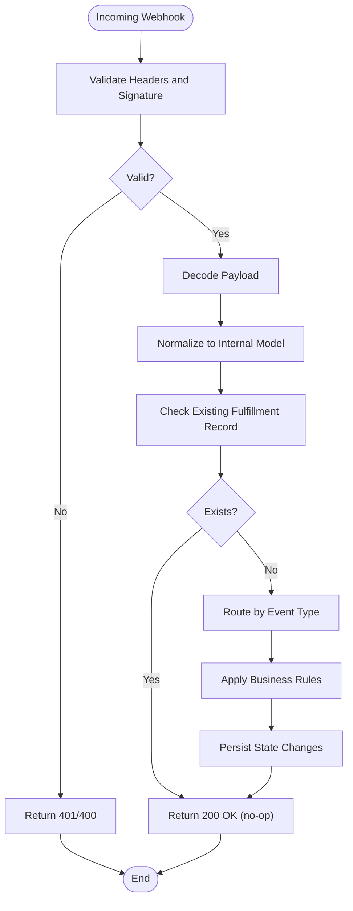
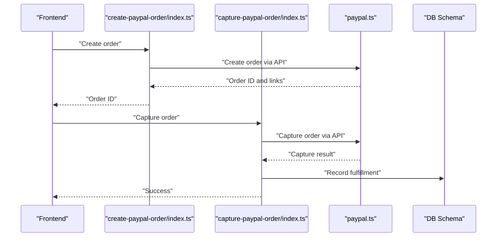
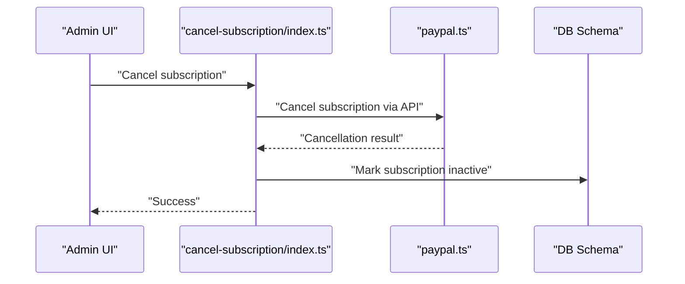
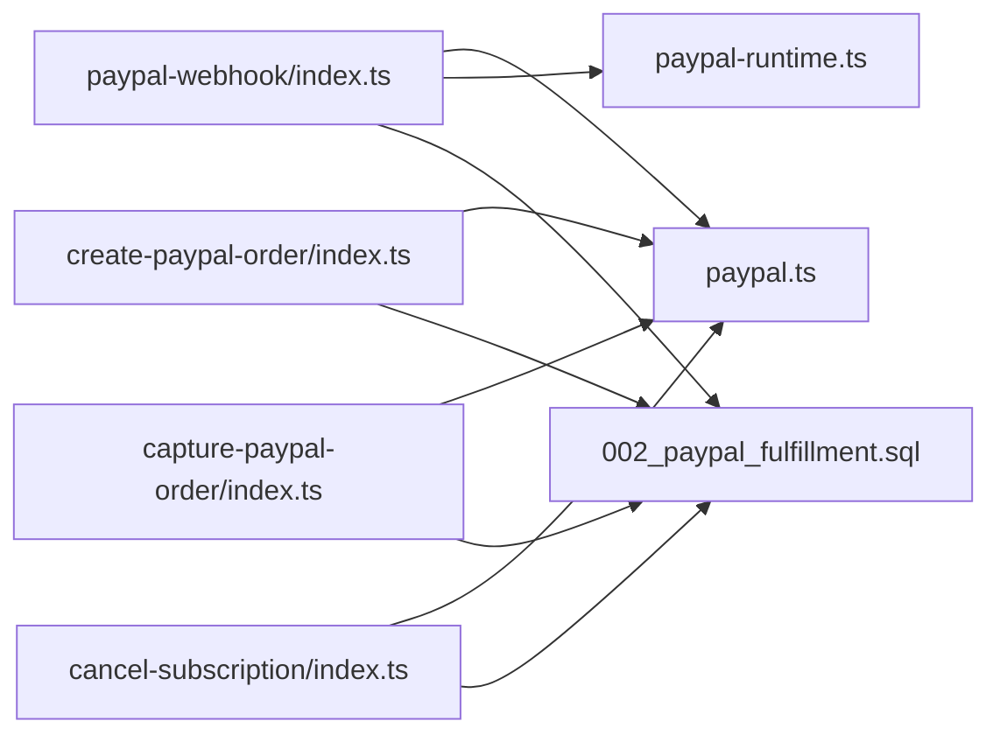

# PayPal Webhook Handler

<cite>
**Referenced Files in This Document**
- [paypal-webhook/index.ts](file://supabase/functions/paypal-webhook/index.ts)
- [paypal.ts](file://supabase/functions/_shared/paypal.ts)
- [paypal-runtime.ts](file://supabase/functions/_shared/paypal-runtime.ts)
- [paypal.test.ts](file://supabase/functions/_shared/paypal.test.ts)
- [002_paypal_fulfillment.sql](file://supabase/migrations/002_paypal_fulfillment.sql)
- [create-paypal-order/index.ts](file://supabase/functions/create-paypal-order/index.ts)
- [capture-paypal-order/index.ts](file://supabase/functions/capture-paypal-order/index.ts)
- [cancel-subscription/index.ts](file://supabase/functions/cancel-subscription/index.ts)
</cite>

## Table of Contents
1. [Introduction](#introduction)
2. [Project Structure](#project-structure)
3. [Core Components](#core-components)
4. [Architecture Overview](#architecture-overview)
5. [Detailed Component Analysis](#detailed-component-analysis)
6. [Dependency Analysis](#dependency-analysis)
7. [Performance Considerations](#performance-considerations)
8. [Troubleshooting Guide](#troubleshooting-guide)
9. [Conclusion](#conclusion)
10. [Appendices](#appendices)

## Introduction
This document provides comprehensive webhook documentation for PayPal payment events within the project. It covers supported event types, payload schemas, verification processes using PayPal’s certificate-based authentication, event processing workflows, subscription lifecycle management, billing agreement updates, and security considerations. It also includes monitoring and alerting strategies for webhook processing failures.

## Project Structure
The PayPal integration is implemented as Supabase Edge Functions with shared utilities and database migrations:
- Webhook handler function receives and verifies PayPal events
- Shared PayPal client and runtime helpers encapsulate API calls and configuration
- Database schema defines tables for order fulfillment and subscription state
- Additional functions orchestrate order creation, capture, and subscription cancellation

**Diagram sources**
- [paypal-webhook/index.ts](file://supabase/functions/paypal-webhook/index.ts)
- [paypal.ts](file://supabase/functions/_shared/paypal.ts)
- [paypal-runtime.ts](file://supabase/functions/_shared/paypal-runtime.ts)
- [002_paypal_fulfillment.sql](file://supabase/migrations/002_paypal_fulfillment.sql)
- [create-paypal-order/index.ts](file://supabase/functions/create-paypal-order/index.ts)
- [capture-paypal-order/index.ts](file://supabase/functions/capture-paypal-order/index.ts)
- [cancel-subscription/index.ts](file://supabase/functions/cancel-subscription/index.ts)

**Section sources**
- [paypal-webhook/index.ts](file://supabase/functions/paypal-webhook/index.ts)
- [paypal.ts](file://supabase/functions/_shared/paypal.ts)
- [paypal-runtime.ts](file://supabase/functions/_shared/paypal-runtime.ts)
- [002_paypal_fulfillment.sql](file://supabase/migrations/002_paypal_fulfillment.sql)
- [create-paypal-order/index.ts](file://supabase/functions/create-paypal-order/index.ts)
- [capture-paypal-order/index.ts](file://supabase/functions/capture-paypal-order/index.ts)
- [cancel-subscription/index.ts](file://supabase/functions/cancel-subscription/index.ts)

## Core Components
- Webhook handler: Receives HTTP requests from PayPal, validates headers and signature, decodes payloads, and dispatches to event-specific processors.
- PayPal client: Encapsulates REST API interactions (orders, subscriptions, billing agreements), token retrieval, and error mapping.
- Runtime helpers: Provide environment configuration, logging, and common utilities used by all PayPal-related functions.
- Database schema: Defines tables for orders, subscriptions, and fulfillment records to persist state changes.

Key responsibilities:
- Verify webhook authenticity via PayPal’s certificate chain and request headers
- Idempotently process events using event IDs
- Update subscription status and billing agreement metadata
- Record fulfillment outcomes and audit logs

**Section sources**
- [paypal-webhook/index.ts](file://supabase/functions/paypal-webhook/index.ts)
- [paypal.ts](file://supabase/functions/_shared/paypal.ts)
- [paypal-runtime.ts](file://supabase/functions/_shared/paypal-runtime.ts)
- [002_paypal_fulfillment.sql](file://supabase/migrations/002_paypal_fulfillment.sql)

## Architecture Overview
The system follows a clear separation between inbound webhook handling, PayPal API interactions, and persistent state management.

**Diagram sources**
- [paypal-webhook/index.ts](file://supabase/functions/paypal-webhook/index.ts)
- [paypal.ts](file://supabase/functions/_shared/paypal.ts)
- [paypal-runtime.ts](file://supabase/functions/_shared/paypal-runtime.ts)
- [002_paypal_fulfillment.sql](file://supabase/migrations/002_paypal_fulfillment.sql)

## Detailed Component Analysis

### Webhook Handler
Responsibilities:
- Accepts PayPal webhook requests
- Validates request headers and signature using PayPal’s certificate chain
- Decodes and normalizes payloads into internal event models
- Dispatches to event-specific handlers
- Persists idempotent records to prevent duplicate processing
- Returns appropriate HTTP responses

Supported event types:
- PAYMENT.SALE.COMPLETED
- BILLING.SUBSCRIPTION.CANCELLED
- BILLING.SUBSCRIPTION.ACTIVATED
- BILLING.SUBSCRIPTION.UPDATED
- BILLING.SUBSCRIPTION.EXPIRED
- BILLING.SUBSCRIPTION.PAYMENT.FAILED
- BILLING.SUBSCRIPTION.RE-AUTHORIZED
- BILLING.SUBSCRIPTION.SUSPENDED
- BILLING.SUBSCRIPTION.CANCELLED (alias if present)
- BILLING.AGREEMENT.CREATED
- BILLING.AGREEMENT.UPDATED
- BILLING.AGREEMENT.EXPIRED
- ORDERS.APPROVED
- ORDERS.CAPTURED
- ORDERS.DENIED
- ORDERS.REFUNDED

Payload schema highlights:
- Event ID and type for idempotency and routing
- Resource object containing transaction details, payer info, and subscription metadata
- Timestamps for ordering and processing
- Links for resource retrieval and related operations

Verification process:
- Validate required headers (e.g., transmission ID, certification URL, webhook ID)
- Fetch PayPal’s certificate chain using the provided certification URL
- Verify the webhook signature against the raw request body
- Ensure webhook ID matches configured endpoint

Event processing workflow:
- Normalize payload into internal model
- Check existing fulfillment record for idempotency
- Apply business rules per event type
- Update subscription or order state accordingly
- Log outcome and metrics

**Diagram sources**
- [paypal-webhook/index.ts](file://supabase/functions/paypal-webhook/index.ts)
- [paypal.ts](file://supabase/functions/_shared/paypal.ts)
- [paypal-runtime.ts](file://supabase/functions/_shared/paypal-runtime.ts)
- [002_paypal_fulfillment.sql](file://supabase/migrations/002_paypal_fulfillment.sql)

**Section sources**
- [paypal-webhook/index.ts](file://supabase/functions/paypal-webhook/index.ts)
- [paypal.ts](file://supabase/functions/_shared/paypal.ts)
- [paypal-runtime.ts](file://supabase/functions/_shared/paypal-runtime.ts)
- [002_paypal_fulfillment.sql](file://supabase/migrations/002_paypal_fulfillment.sql)

### PayPal Client and Runtime
Responsibilities:
- Manage OAuth tokens and API base URLs
- Execute REST calls for orders, subscriptions, and billing agreements
- Map PayPal errors to application-level exceptions
- Provide consistent logging and retry behavior

Key capabilities:
- Token acquisition and caching
- Request signing and header injection
- Response normalization and error translation
- Environment-aware configuration (sandbox vs production)

**Section sources**
- [paypal.ts](file://supabase/functions/_shared/paypal.ts)
- [paypal-runtime.ts](file://supabase/functions/_shared/paypal-runtime.ts)
- [paypal.test.ts](file://supabase/functions/_shared/paypal.test.ts)

### Subscription Lifecycle Management
Lifecycle states:
- Created
- Activated
- Suspended
- Expired
- Cancelled
- Re-authorized

Processing logic:
- On ACTIVATED: Enable entitlements and update billing agreement metadata
- On UPDATED: Sync plan changes, proration, and next billing date
- On CANCELLED/SUSPENDED/EXPIRED: Disable entitlements and mark subscription inactive
- On RE-AUTHORIZED: Refresh authorization and resume billing

Billing agreement updates:
- Maintain external agreement ID and last updated timestamp
- Store payer consent and shipping preferences when available
- Track plan identifiers and effective dates

**Section sources**
- [paypal-webhook/index.ts](file://supabase/functions/paypal-webhook/index.ts)
- [paypal.ts](file://supabase/functions/_shared/paypal.ts)
- [002_paypal_fulfillment.sql](file://supabase/migrations/002_paypal_fulfillment.sql)

### Order Processing and Capture
Order flow:
- Create order via create-paypal-order function
- Approve order on frontend
- Capture funds via capture-paypal-order function
- Fulfill upon successful capture

**Diagram sources**
- [create-paypal-order/index.ts](file://supabase/functions/create-paypal-order/index.ts)
- [capture-paypal-order/index.ts](file://supabase/functions/capture-paypal-order/index.ts)
- [paypal.ts](file://supabase/functions/_shared/paypal.ts)
- [002_paypal_fulfillment.sql](file://supabase/migrations/002_paypal_fulfillment.sql)

**Section sources**
- [create-paypal-order/index.ts](file://supabase/functions/create-paypal-order/index.ts)
- [capture-paypal-order/index.ts](file://supabase/functions/capture-paypal-order/index.ts)
- [paypal.ts](file://supabase/functions/_shared/paypal.ts)
- [002_paypal_fulfillment.sql](file://supabase/migrations/002_paypal_fulfillment.sql)

### Subscription Cancellation Flow
Cancellation triggers:
- User-initiated via cancel-subscription function
- PayPal-initiated via BILLING.SUBSCRIPTION.CANCELLED webhook

**Diagram sources**
- [cancel-subscription/index.ts](file://supabase/functions/cancel-subscription/index.ts)
- [paypal.ts](file://supabase/functions/_shared/paypal.ts)
- [002_paypal_fulfillment.sql](file://supabase/migrations/002_paypal_fulfillment.sql)

**Section sources**
- [cancel-subscription/index.ts](file://supabase/functions/cancel-subscription/index.ts)
- [paypal.ts](file://supabase/functions/_shared/paypal.ts)
- [002_paypal_fulfillment.sql](file://supabase/migrations/002_paypal_fulfillment.sql)

## Dependency Analysis
The following diagram shows how components depend on each other:

**Diagram sources**
- [paypal-webhook/index.ts](file://supabase/functions/paypal-webhook/index.ts)
- [paypal.ts](file://supabase/functions/_shared/paypal.ts)
- [paypal-runtime.ts](file://supabase/functions/_shared/paypal-runtime.ts)
- [002_paypal_fulfillment.sql](file://supabase/migrations/002_paypal_fulfillment.sql)
- [create-paypal-order/index.ts](file://supabase/functions/create-paypal-order/index.ts)
- [capture-paypal-order/index.ts](file://supabase/functions/capture-paypal-order/index.ts)
- [cancel-subscription/index.ts](file://supabase/functions/cancel-subscription/index.ts)

**Section sources**
- [paypal-webhook/index.ts](file://supabase/functions/paypal-webhook/index.ts)
- [paypal.ts](file://supabase/functions/_shared/paypal.ts)
- [paypal-runtime.ts](file://supabase/functions/_shared/paypal-runtime.ts)
- [002_paypal_fulfillment.sql](file://supabase/migrations/002_paypal_fulfillment.sql)
- [create-paypal-order/index.ts](file://supabase/functions/create-paypal-order/index.ts)
- [capture-paypal-order/index.ts](file://supabase/functions/capture-paypal-order/index.ts)
- [cancel-subscription/index.ts](file://supabase/functions/cancel-subscription/index.ts)

## Performance Considerations
- Idempotency: Use event IDs to avoid duplicate processing and ensure safe retries.
- Minimal I/O: Perform only necessary database writes; batch updates where possible.
- Logging: Keep structured logs with correlation IDs for tracing.
- Timeouts: Configure appropriate timeouts for outbound PayPal API calls.
- Backpressure: Queue long-running tasks if needed to keep webhook response times low.

[No sources needed since this section provides general guidance]

## Troubleshooting Guide
Common issues and resolutions:
- Invalid signature: Verify webhook ID, transmission ID, and certification URL; ensure raw body is preserved during verification.
- Missing headers: Confirm PayPal sends required headers; log missing fields for diagnostics.
- Duplicate events: Check fulfillment records by event ID; return success without reprocessing.
- Subscription state mismatch: Compare PayPal state with local state; reconcile discrepancies via reconciliation jobs.
- Network errors: Implement retries with exponential backoff for transient failures.

Monitoring and alerting strategies:
- Track webhook latency and error rates
- Alert on signature validation failures
- Monitor subscription state drift between PayPal and local DB
- Set up dashboards for fulfillment success/failure ratios

**Section sources**
- [paypal-webhook/index.ts](file://supabase/functions/paypal-webhook/index.ts)
- [paypal.ts](file://supabase/functions/_shared/paypal.ts)
- [paypal-runtime.ts](file://supabase/functions/_shared/paypal-runtime.ts)
- [002_paypal_fulfillment.sql](file://supabase/migrations/002_paypal_fulfillment.sql)

## Conclusion
The PayPal webhook implementation provides secure, idempotent processing of payment and subscription events. By leveraging certificate-based verification, normalized payloads, and robust state management, the system ensures reliable fulfillment and accurate subscription lifecycle handling. Monitoring and alerting further enhance operational visibility and resilience.

[No sources needed since this section summarizes without analyzing specific files]

## Appendices

### Security Considerations
- Webhook URL configuration:
  - Register the correct HTTPS endpoint in PayPal dashboard
  - Use environment-specific endpoints for sandbox and production
- Certificate validation:
  - Always fetch certificates from PayPal-provided URLs
  - Validate signatures against the raw request body
- Secure environment setup:
  - Store secrets securely in environment variables
  - Restrict access to webhook endpoints and admin functions
  - Enable TLS and enforce strong cipher suites

**Section sources**
- [paypal-webhook/index.ts](file://supabase/functions/paypal-webhook/index.ts)
- [paypal-runtime.ts](file://supabase/functions/_shared/paypal-runtime.ts)

### Example Scenarios
- Recurring payments:
  - Handle BILLING.SUBSCRIPTION.PAYMENT.SUCCESSFUL events to continue entitlements
  - Update next billing date and track payment history
- Subscription upgrades/downgrades:
  - Process BILLING.SUBSCRIPTION.UPDATED events
  - Apply proration and adjust plan identifiers
- Cancellations:
  - Respond to BILLING.SUBSCRIPTION.CANCELLED by disabling entitlements
  - Honor grace periods and refund policies as applicable

**Section sources**
- [paypal-webhook/index.ts](file://supabase/functions/paypal-webhook/index.ts)
- [paypal.ts](file://supabase/functions/_shared/paypal.ts)
- [002_paypal_fulfillment.sql](file://supabase/migrations/002_paypal_fulfillment.sql)