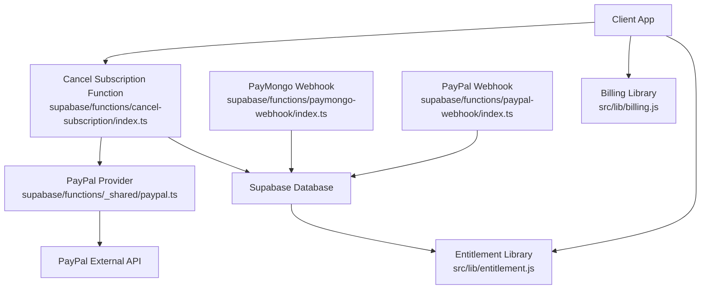
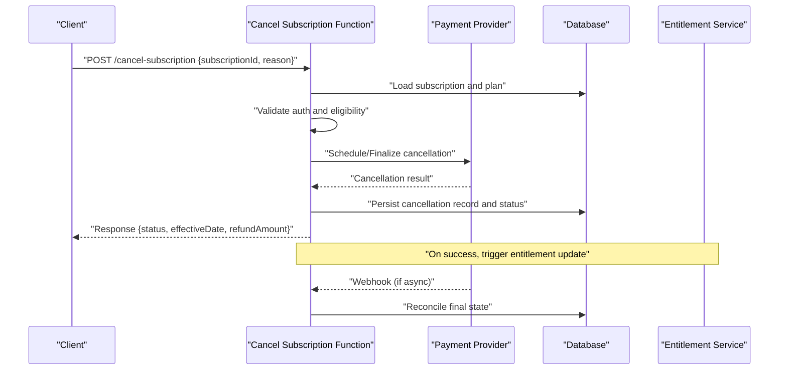
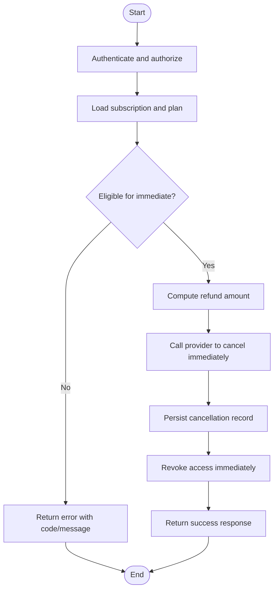
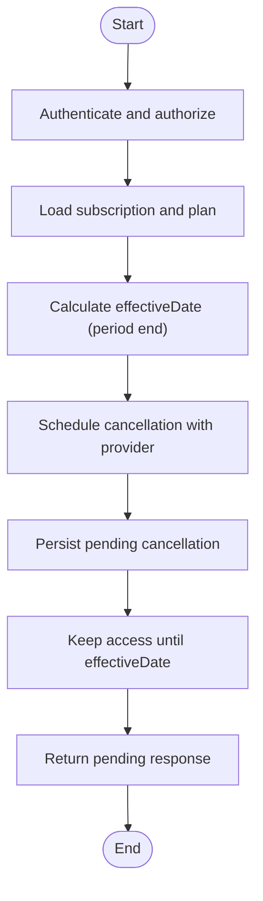
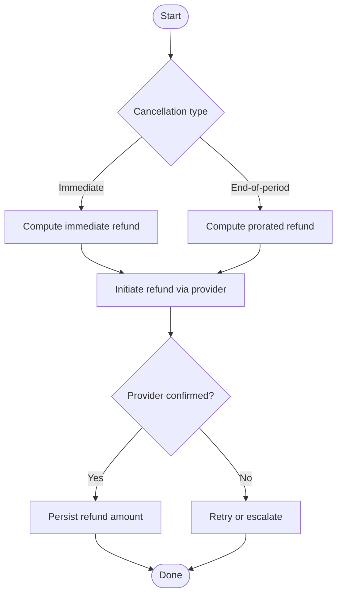
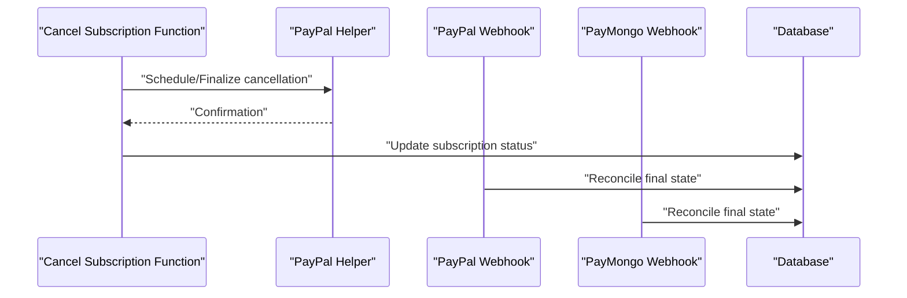
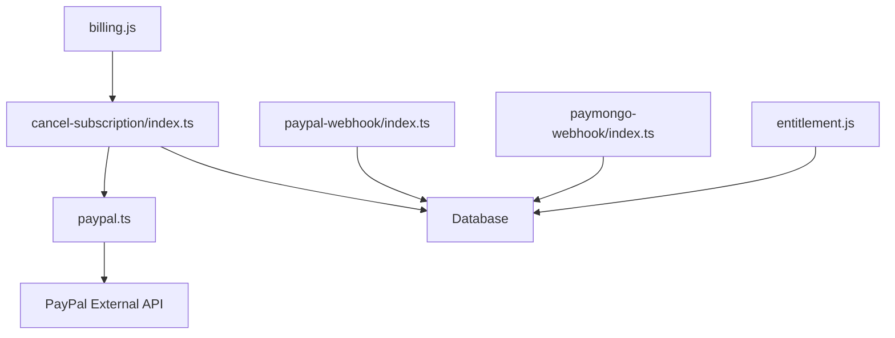

# Subscription Cancellation Service

<cite>
**Referenced Files in This Document**
- [cancel-subscription/index.ts](file://supabase/functions/cancel-subscription/index.ts)
- [billing.js](file://src/lib/billing.js)
- [entitlement.js](file://src/lib/entitlement.js)
- [03-subscriptions-paymongo.md](file://docs/superpowers/plans/monetization/03-subscriptions-paymongo.md)
- [paypal.ts](file://supabase/functions/_shared/paypal.ts)
- [paypal-webhook/index.ts](file://supabase/functions/paypal-webhook/index.ts)
- [paymongo-webhook/index.ts](file://supabase/functions/paymongo-webhook/index.ts)
- [00-architecture.md](file://docs/superpowers/plans/monetization/00-architecture.md)
</cite>

## Table of Contents
1. [Introduction](#introduction)
2. [Project Structure](#project-structure)
3. [Core Components](#core-components)
4. [Architecture Overview](#architecture-overview)
5. [Detailed Component Analysis](#detailed-component-analysis)
6. [Dependency Analysis](#dependency-analysis)
7. [Performance Considerations](#performance-considerations)
8. [Troubleshooting Guide](#troubleshooting-guide)
9. [Conclusion](#conclusion)
10. [Appendices](#appendices)

## Introduction
This document specifies the subscription cancellation service, focusing on the cancellation endpoint and its integration with external payment providers (PayPal and PayMongo). It covers authentication requirements, request parameters, response formats, business rules (eligibility, prorated refunds, access revocation timing), workflow examples (immediate vs end-of-period cancellations), refund handling, data retention policies, and integration patterns for updating local subscription status after provider confirmation.

## Project Structure
The cancellation flow spans serverless functions, shared provider utilities, webhooks, and client-side billing logic:
- Serverless function: cancel-subscription
- Shared provider utilities: PayPal client helpers
- Webhooks: PayPal and PayMongo event handlers
- Client libraries: billing and entitlement modules
- Documentation: architecture and monetization plans

**Diagram sources**
- [cancel-subscription/index.ts](file://supabase/functions/cancel-subscription/index.ts)
- [paypal.ts](file://supabase/functions/_shared/paypal.ts)
- [paypal-webhook/index.ts](file://supabase/functions/paypal-webhook/index.ts)
- [paymongo-webhook/index.ts](file://supabase/functions/paymongo-webhook/index.ts)
- [billing.js](file://src/lib/billing.js)
- [entitlement.js](file://src/lib/entitlement.js)

**Section sources**
- [00-architecture.md](file://docs/superpowers/plans/monetization/00-architecture.md)
- [03-subscriptions-paymongo.md](file://docs/superpowers/plans/monetization/03-subscriptions-paymongo.md)

## Core Components
- Cancel Subscription Function: Orchestrates cancellation by validating inputs, enforcing business rules, invoking provider APIs, and persisting state changes.
- PayPal Integration: Provides helper methods to call PayPal’s subscription management endpoints.
- Webhooks: Receive asynchronous confirmations from providers to reconcile final states and update local records.
- Client Libraries: Expose high-level billing operations and entitlement checks used by the UI.

Key responsibilities:
- Validate user identity and authorization
- Resolve subscription and plan details
- Determine cancellation type (immediate vs end-of-period)
- Compute refund eligibility and proration
- Call provider APIs to schedule or execute cancellation
- Persist audit logs and updated subscription status
- Emit events for downstream sync and entitlement updates

**Section sources**
- [cancel-subscription/index.ts](file://supabase/functions/cancel-subscription/index.ts)
- [paypal.ts](file://supabase/functions/_shared/paypal.ts)
- [paypal-webhook/index.ts](file://supabase/functions/paypal-webhook/index.ts)
- [paymongo-webhook/index.ts](file://supabase/functions/paymongo-webhook/index.ts)
- [billing.js](file://src/lib/billing.js)
- [entitlement.js](file://src/lib/entitlement.js)

## Architecture Overview
High-level cancellation flow:
- Client calls the cancel-subscription function with required parameters.
- Function validates authentication and subscription ownership.
- Function determines cancellation policy (immediate vs end-of-period) and computes refund/proration.
- Function invokes provider APIs (PayPal/PayMongo) to schedule or finalize cancellation.
- Provider responds with confirmation; function persists state and returns a structured response.
- Webhooks may later reconcile final outcomes and update entitlements.

**Diagram sources**
- [cancel-subscription/index.ts](file://supabase/functions/cancel-subscription/index.ts)
- [paypal.ts](file://supabase/functions/_shared/paypal.ts)
- [paypal-webhook/index.ts](file://supabase/functions/paypal-webhook/index.ts)
- [paymongo-webhook/index.ts](file://supabase/functions/paymongo-webhook/index.ts)
- [entitlement.js](file://src/lib/entitlement.js)

## Detailed Component Analysis

### Cancellation Endpoint Specification
- Method: POST
- Path: /functions/v1/cancel-subscription
- Authentication: Required (user session token)
- Request body:
  - subscriptionId: string, required
  - reason: string, required
- Response formats:
  - Success (immediate):
    - status: "cancelled"
    - effectiveDate: ISO timestamp
    - refundAmount: number or null
    - message: string
  - Pending (end-of-period):
    - status: "pending_cancellation"
    - effectiveDate: ISO timestamp (period end)
    - refundAmount: number or null
    - message: string
  - Error:
    - status: "error"
    - code: string
    - message: string

Business rules:
- Eligibility:
  - Subscription must be active or in grace period per plan rules.
  - Ownership verified via authenticated user context.
- Cancellation types:
  - Immediate: cancels now; refund computed if eligible.
  - End-of-period: schedules cancellation at next billing cycle; partial refund may apply based on proration policy.
- Prorated refunds:
  - Calculated based on remaining days in current period minus non-refundable fees.
  - If provider supports proration, use provider calculation; otherwise compute locally using plan terms.
- Access revocation timing:
  - Immediate: revoke access immediately upon successful cancellation.
  - End-of-period: maintain access until effectiveDate; revoke at that time.
- Data retention:
  - Retain cancellation audit records indefinitely for compliance.
  - Personal data follows platform retention policy; anonymize where applicable.

Integration notes:
- For PayPal, use provider helpers to schedule/finalize cancellation and capture confirmation.
- For PayMongo, rely on webhook-driven reconciliation to finalize state.

**Section sources**
- [cancel-subscription/index.ts](file://supabase/functions/cancel-subscription/index.ts)
- [paypal.ts](file://supabase/functions/_shared/paypal.ts)
- [paypal-webhook/index.ts](file://supabase/functions/paypal-webhook/index.ts)
- [paymongo-webhook/index.ts](file://supabase/functions/paymongo-webhook/index.ts)
- [billing.js](file://src/lib/billing.js)
- [entitlement.js](file://src/lib/entitlement.js)

### Workflow Examples

#### Immediate Cancellation
- Trigger: User requests immediate cancellation.
- Steps:
  - Validate auth and subscription ownership.
  - Check eligibility and compute refund.
  - Call provider to cancel immediately.
  - Persist cancellation and revoke access.
  - Return success response with effectiveDate equal to now.

**Diagram sources**
- [cancel-subscription/index.ts](file://supabase/functions/cancel-subscription/index.ts)
- [paypal.ts](file://supabase/functions/_shared/paypal.ts)

#### End-of-Period Cancellation
- Trigger: User requests cancellation at period end.
- Steps:
  - Validate auth and subscription ownership.
  - Determine effectiveDate as next billing cycle end.
  - Schedule cancellation with provider.
  - Persist pending cancellation and keep access until effectiveDate.
  - Return pending response with effectiveDate.

**Diagram sources**
- [cancel-subscription/index.ts](file://supabase/functions/cancel-subscription/index.ts)
- [paypal.ts](file://supabase/functions/_shared/paypal.ts)

#### Refund Handling
- Immediate cancellation:
  - If eligible, compute prorated refund and initiate refund via provider.
  - On provider confirmation, persist refund amount and update records.
- End-of-period cancellation:
  - If proration applies, calculate partial refund based on remaining days.
  - Initiate refund at period end or when provider allows.

**Diagram sources**
- [cancel-subscription/index.ts](file://supabase/functions/cancel-subscription/index.ts)
- [paypal.ts](file://supabase/functions/_shared/paypal.ts)

#### Data Retention Policies
- Audit logs:
  - Store cancellation requests, provider responses, and outcome decisions.
- Personal data:
  - Follow platform policy; anonymize identifiers where feasible.
- Compliance:
  - Maintain records for auditability and dispute resolution.

[No sources needed since this section provides general guidance]

### Business Rules Summary
- Eligibility:
  - Active or grace-period subscriptions only.
  - Must be owned by authenticated user.
- Prorated refunds:
  - Based on remaining days minus non-refundable fees.
  - Use provider calculation when available; fallback to local computation.
- Access revocation:
  - Immediate: revoke now.
  - End-of-period: revoke at effectiveDate.

**Section sources**
- [cancel-subscription/index.ts](file://supabase/functions/cancel-subscription/index.ts)
- [entitlement.js](file://src/lib/entitlement.js)

### Integration with External Payment Providers
- PayPal:
  - Use provider helpers to schedule/finalize cancellation and handle confirmations.
  - Webhook handler reconciles final state and updates local records.
- PayMongo:
  - Rely on webhook-driven reconciliation to finalize state and update entitlements.

**Diagram sources**
- [paypal.ts](file://supabase/functions/_shared/paypal.ts)
- [paypal-webhook/index.ts](file://supabase/functions/paypal-webhook/index.ts)
- [paymongo-webhook/index.ts](file://supabase/functions/paymongo-webhook/index.ts)
- [cancel-subscription/index.ts](file://supabase/functions/cancel-subscription/index.ts)

### Client-Side Integration
- Billing library:
  - Exposes high-level methods to initiate cancellation and poll for status.
- Entitlement library:
  - Checks current entitlements and enforces feature access based on subscription state.

Usage pattern:
- Call billing method with subscriptionId and reason.
- Handle response:
  - Immediate success: revoke features immediately.
  - Pending: continue access until effectiveDate.
- Listen for webhook-driven updates to refresh entitlements.

**Section sources**
- [billing.js](file://src/lib/billing.js)
- [entitlement.js](file://src/lib/entitlement.js)

## Dependency Analysis
- The cancellation function depends on:
  - Provider utilities (PayPal)
  - Database for persistence
  - Webhooks for reconciliation
- Client libraries depend on:
  - Billing module for API calls
  - Entitlement module for access control

**Diagram sources**
- [cancel-subscription/index.ts](file://supabase/functions/cancel-subscription/index.ts)
- [paypal.ts](file://supabase/functions/_shared/paypal.ts)
- [paypal-webhook/index.ts](file://supabase/functions/paypal-webhook/index.ts)
- [paymongo-webhook/index.ts](file://supabase/functions/paymongo-webhook/index.ts)
- [billing.js](file://src/lib/billing.js)
- [entitlement.js](file://src/lib/entitlement.js)

**Section sources**
- [00-architecture.md](file://docs/superpowers/plans/monetization/00-architecture.md)
- [03-subscriptions-paymongo.md](file://docs/superpowers/plans/monetization/03-subscriptions-paymongo.md)

## Performance Considerations
- Minimize provider round-trips by batching validation and scheduling steps.
- Cache plan and pricing metadata to reduce database reads during cancellation.
- Use idempotency keys for cancellation requests to prevent duplicate processing.
- Implement retries with exponential backoff for transient provider errors.
- Ensure webhook handlers are idempotent and fast to avoid backlog.

[No sources needed since this section provides general guidance]

## Troubleshooting Guide
Common issues and resolutions:
- Invalid or missing subscriptionId:
  - Verify existence and ownership before proceeding.
- Unauthorized access:
  - Ensure user session is valid and matches subscription owner.
- Provider errors:
  - Log provider error codes and messages; retry with backoff; escalate on persistent failures.
- State mismatch between provider and local records:
  - Use webhooks to reconcile; implement conflict resolution strategies.
- Refund discrepancies:
  - Compare provider-calculated amounts with local computations; adjust proration logic accordingly.

Operational tips:
- Enable detailed logging for all cancellation attempts and provider interactions.
- Monitor webhook delivery and processing latency.
- Set up alerts for failed cancellations and refund anomalies.

**Section sources**
- [paypal-webhook/index.ts](file://supabase/functions/paypal-webhook/index.ts)
- [paymongo-webhook/index.ts](file://supabase/functions/paymongo-webhook/index.ts)
- [cancel-subscription/index.ts](file://supabase/functions/cancel-subscription/index.ts)

## Conclusion
The subscription cancellation service provides a robust, auditable pathway to cancel subscriptions either immediately or at period end, with clear business rules for eligibility, proration, and access revocation. Integration with PayPal and PayMongo ensures reliable provider coordination and reconciliation through webhooks. Clients can confidently manage cancellation flows using the billing and entitlement libraries while maintaining compliance through comprehensive data retention practices.

[No sources needed since this section summarizes without analyzing specific files]

## Appendices

### API Reference Summary
- Endpoint: POST /functions/v1/cancel-subscription
- Authentication: Required
- Request parameters:
  - subscriptionId: string
  - reason: string
- Responses:
  - Success (immediate): { status: "cancelled", effectiveDate, refundAmount, message }
  - Pending (end-of-period): { status: "pending_cancellation", effectiveDate, refundAmount, message }
  - Error: { status: "error", code, message }

**Section sources**
- [cancel-subscription/index.ts](file://supabase/functions/cancel-subscription/index.ts)