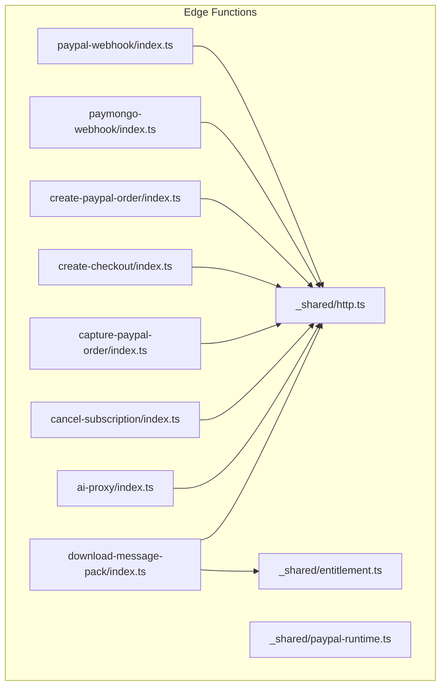
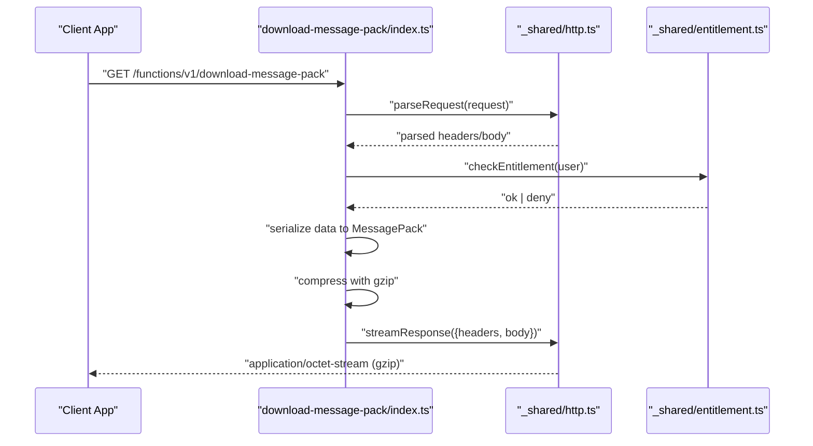
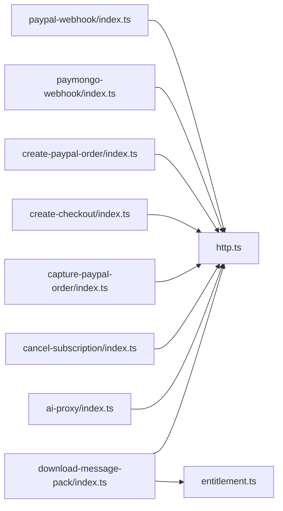

# Data Export & Utilities

<cite>
**Referenced Files in This Document**
- [download-message-pack/index.ts](file://supabase/functions/download-message-pack/index.ts)
- [http.ts](file://supabase/functions/_shared/http.ts)
- [entitlement.ts](file://supabase/functions/_shared/entitlement.ts)
- [paypal-runtime.ts](file://supabase/functions/_shared/paypal-runtime.ts)
- [ai-proxy/index.ts](file://supabase/functions/ai-proxy/index.ts)
- [cancel-subscription/index.ts](file://supabase/functions/cancel-subscription/index.ts)
- [capture-paypal-order/index.ts](file://supabase/functions/capture-paypal-order/index.ts)
- [create-checkout/index.ts](file://supabase/functions/create-checkout/index.ts)
- [create-paypal-order/index.ts](file://supabase/functions/create-paypal-order/index.ts)
- [paymongo-webhook/index.ts](file://supabase/functions/paymongo-webhook/index.ts)
- [paypal-webhook/index.ts](file://supabase/functions/paypal-webhook/index.ts)
</cite>

## Table of Contents
1. [Introduction](#introduction)
2. [Project Structure](#project-structure)
3. [Core Components](#core-components)
4. [Architecture Overview](#architecture-overview)
5. [Detailed Component Analysis](#detailed-component-analysis)
6. [Dependency Analysis](#dependency-analysis)
7. [Performance Considerations](#performance-considerations)
8. [Troubleshooting Guide](#troubleshooting-guide)
9. [Conclusion](#conclusion)
10. [Appendices](#appendices)

## Introduction
This document provides detailed API documentation for data export and utility Edge Functions, with a focus on the message pack download function. It covers HTTP methods, URL patterns, authentication requirements, response formats, serialization patterns, file size limitations, performance considerations for large datasets, and client implementation examples for triggering exports, handling download progress, and managing file storage. It also documents the shared HTTP utilities library and common request/response helpers used across edge functions.

## Project Structure
The relevant code is organized under Supabase Edge Functions:
- Shared utilities are located in supabase/functions/_shared.
- Feature-specific endpoints are each implemented as their own function directory under supabase/functions.

**Diagram sources**
- [download-message-pack/index.ts](file://supabase/functions/download-message-pack/index.ts)
- [http.ts](file://supabase/functions/_shared/http.ts)
- [entitlement.ts](file://supabase/functions/_shared/entitlement.ts)
- [paypal-runtime.ts](file://supabase/functions/_shared/paypal-runtime.ts)
- [ai-proxy/index.ts](file://supabase/functions/ai-proxy/index.ts)
- [cancel-subscription/index.ts](file://supabase/functions/cancel-subscription/index.ts)
- [capture-paypal-order/index.ts](file://supabase/functions/capture-paypal-order/index.ts)
- [create-checkout/index.ts](file://supabase/functions/create-checkout/index.ts)
- [create-paypal-order/index.ts](file://supabase/functions/create-paypal-order/index.ts)
- [paymongo-webhook/index.ts](file://supabase/functions/paymongo-webhook/index.ts)
- [paypal-webhook/index.ts](file://supabase/functions/paypal-webhook/index.ts)

**Section sources**
- [download-message-pack/index.ts](file://supabase/functions/download-message-pack/index.ts)
- [http.ts](file://supabase/functions/_shared/http.ts)
- [entitlement.ts](file://supabase/functions/_shared/entitlement.ts)
- [paypal-runtime.ts](file://supabase/functions/_shared/paypal-runtime.ts)
- [ai-proxy/index.ts](file://supabase/functions/ai-proxy/index.ts)
- [cancel-subscription/index.ts](file://supabase/functions/cancel-subscription/index.ts)
- [capture-paypal-order/index.ts](file://supabase/functions/capture-paypal-order/index.ts)
- [create-checkout/index.ts](file://supabase/functions/create-checkout/index.ts)
- [create-paypal-order/index.ts](file://supabase/functions/create-paypal-order/index.ts)
- [paymongo-webhook/index.ts](file://supabase/functions/paymongo-webhook/index.ts)
- [paypal-webhook/index.ts](file://supabase/functions/paypal-webhook/index.ts)

## Core Components
- Message Pack Download Function: Generates a serialized payload (MessagePack), compresses it, and serves a secure downloadable file.
- Shared HTTP Utilities: Provides standardized request parsing, response helpers, error formatting, and optional compression/streaming support.
- Entitlements: Validates user permissions or subscription status before allowing export operations.
- Payment Webhooks and Checkout Helpers: Demonstrate consistent request validation, signature verification, and structured responses.

Key responsibilities:
- Enforce authentication and authorization checks prior to generating exports.
- Serialize application data into MessagePack for compact representation.
- Compress output using gzip to reduce bandwidth.
- Stream responses when necessary to handle large payloads efficiently.
- Return well-formed JSON errors for non-successful outcomes.

**Section sources**
- [download-message-pack/index.ts](file://supabase/functions/download-message-pack/index.ts)
- [http.ts](file://supabase/functions/_shared/http.ts)
- [entitlement.ts](file://supabase/functions/_shared/entitlement.ts)

## Architecture Overview
The message pack download flow integrates authentication, entitlement checks, data serialization, compression, and streaming delivery.

**Diagram sources**
- [download-message-pack/index.ts](file://supabase/functions/download-message-pack/index.ts)
- [http.ts](file://supabase/functions/_shared/http.ts)
- [entitlement.ts](file://supabase/functions/_shared/entitlement.ts)

## Detailed Component Analysis

### Message Pack Download API
- Purpose: Generate and serve a compressed MessagePack export file securely.
- Method: GET
- URL Pattern: /functions/v1/download-message-pack
- Authentication: Requires valid session token; validated via shared utilities.
- Authorization: Entitlement check enforced before export generation.
- Request Headers:
  - Authorization: Bearer <session-token>
  - Optional query parameters may control export scope (implementation-dependent).
- Response:
  - Success: application/octet-stream with Content-Encoding: gzip and appropriate Content-Disposition for download.
  - Error: application/json with structured error object.

Data Serialization and Compression:
- Data is serialized using MessagePack for compact binary format.
- Output is gzip-compressed to minimize transfer size.
- Streaming is preferred for large datasets to avoid memory spikes.

File Size Limitations:
- Enforce maximum payload size at the function level to prevent abuse.
- Reject oversized requests early with a clear error.

Security Considerations:
- Validate user identity and entitlements before exporting.
- Avoid logging sensitive data.
- Use HTTPS-only transport.

Client Implementation Examples:
- Trigger export by calling the endpoint with proper Authorization header.
- Handle binary response and save to local storage or device filesystem.
- For large files, implement chunked download and resume capability if supported by the server.

Progress Handling:
- If the server supports range requests or SSE, clients can track progress accordingly.
- Otherwise, rely on standard download progress events provided by the runtime.

Storage Management:
- Save exported files with deterministic names and metadata.
- Implement cleanup policies for old exports.

Error Handling:
- Parse JSON error responses and surface actionable messages to users.
- Retry transient failures with exponential backoff.

**Section sources**
- [download-message-pack/index.ts](file://supabase/functions/download-message-pack/index.ts)
- [http.ts](file://supabase/functions/_shared/http.ts)
- [entitlement.ts](file://supabase/functions/_shared/entitlement.ts)

### Shared HTTP Utilities Library
Responsibilities:
- Parse incoming requests safely and consistently.
- Provide helper functions to construct successful and error responses.
- Support streaming responses for large payloads.
- Centralize content-type and encoding handling.
- Normalize error shapes across all edge functions.

Common Patterns:
- Use typed request parsing to extract headers, query params, and body.
- Wrap business logic calls with try/catch to return standardized JSON errors.
- Apply compression only when beneficial and supported by the client.

Usage Across Edge Functions:
- All feature functions import and use these helpers to ensure consistent behavior.

**Section sources**
- [http.ts](file://supabase/functions/_shared/http.ts)
- [ai-proxy/index.ts](file://supabase/functions/ai-proxy/index.ts)
- [cancel-subscription/index.ts](file://supabase/functions/cancel-subscription/index.ts)
- [capture-paypal-order/index.ts](file://supabase/functions/capture-paypal-order/index.ts)
- [create-checkout/index.ts](file://supabase/functions/create-checkout/index.ts)
- [create-paypal-order/index.ts](file://supabase/functions/create-paypal-order/index.ts)
- [paymongo-webhook/index.ts](file://supabase/functions/paymongo-webhook/index.ts)
- [paypal-webhook/index.ts](file://supabase/functions/paypal-webhook/index.ts)

### Entitlements Helper
Responsibilities:
- Verify user eligibility for protected features such as exports.
- Integrate with subscription or account state.
- Return structured results indicating allow/deny decisions.

Integration Points:
- Called by export endpoints prior to data processing.
- Used by other protected endpoints to gate access.

**Section sources**
- [entitlement.ts](file://supabase/functions/_shared/entitlement.ts)

### Payment Runtime Utilities
Responsibilities:
- Provide helpers for PayPal order creation, capture, and webhook processing.
- Standardize request validation and response formatting.
- Demonstrate robust error handling and idempotency patterns.

Relevance:
- Illustrates consistent patterns that also apply to export endpoints.

**Section sources**
- [paypal-runtime.ts](file://supabase/functions/_shared/paypal-runtime.ts)
- [create-paypal-order/index.ts](file://supabase/functions/create-paypal-order/index.ts)
- [capture-paypal-order/index.ts](file://supabase/functions/capture-paypal-order/index.ts)
- [paypal-webhook/index.ts](file://supabase/functions/paypal-webhook/index.ts)

## Dependency Analysis
The following diagram shows how the message pack download function depends on shared utilities and entitlement checks, and how other functions reuse the same HTTP helpers.

**Diagram sources**
- [download-message-pack/index.ts](file://supabase/functions/download-message-pack/index.ts)
- [http.ts](file://supabase/functions/_shared/http.ts)
- [entitlement.ts](file://supabase/functions/_shared/entitlement.ts)
- [ai-proxy/index.ts](file://supabase/functions/ai-proxy/index.ts)
- [cancel-subscription/index.ts](file://supabase/functions/cancel-subscription/index.ts)
- [capture-paypal-order/index.ts](file://supabase/functions/capture-paypal-order/index.ts)
- [create-checkout/index.ts](file://supabase/functions/create-checkout/index.ts)
- [create-paypal-order/index.ts](file://supabase/functions/create-paypal-order/index.ts)
- [paymongo-webhook/index.ts](file://supabase/functions/paymongo-webhook/index.ts)
- [paypal-webhook/index.ts](file://supabase/functions/paypal-webhook/index.ts)

**Section sources**
- [download-message-pack/index.ts](file://supabase/functions/download-message-pack/index.ts)
- [http.ts](file://supabase/functions/_shared/http.ts)
- [entitlement.ts](file://supabase/functions/_shared/entitlement.ts)
- [ai-proxy/index.ts](file://supabase/functions/ai-proxy/index.ts)
- [cancel-subscription/index.ts](file://supabase/functions/cancel-subscription/index.ts)
- [capture-paypal-order/index.ts](file://supabase/functions/capture-paypal-order/index.ts)
- [create-checkout/index.ts](file://supabase/functions/create-checkout/index.ts)
- [create-paypal-order/index.ts](file://supabase/functions/create-paypal-order/index.ts)
- [paymongo-webhook/index.ts](file://supabase/functions/paymongo-webhook/index.ts)
- [paypal-webhook/index.ts](file://supabase/functions/paypal-webhook/index.ts)

## Performance Considerations
- Prefer streaming responses for large exports to reduce memory usage and time-to-first-byte.
- Enable gzip compression for binary payloads to minimize bandwidth.
- Validate and reject oversized requests early to protect resources.
- Batch data retrieval and avoid N+1 queries where possible.
- Cache frequently accessed reference data to reduce database load.
- Monitor function execution duration and memory footprint; adjust batch sizes accordingly.

[No sources needed since this section provides general guidance]

## Troubleshooting Guide
Common issues and resolutions:
- Authentication failures: Ensure Authorization header contains a valid session token.
- Entitlement denied: Confirm user has required subscription or permission.
- Payload too large: Reduce export scope or split into multiple smaller exports.
- Compression errors: Verify client supports gzip decoding.
- Network timeouts: Implement retries with backoff and consider resumable downloads.

Operational tips:
- Log structured errors without sensitive data.
- Surface user-friendly messages from JSON error responses.
- Inspect response headers for content type and encoding.

**Section sources**
- [http.ts](file://supabase/functions/_shared/http.ts)
- [entitlement.ts](file://supabase/functions/_shared/entitlement.ts)
- [download-message-pack/index.ts](file://supabase/functions/download-message-pack/index.ts)

## Conclusion
The message pack download Edge Function demonstrates a secure, efficient pattern for exporting large datasets using MessagePack serialization and gzip compression. The shared HTTP utilities provide consistent request/response handling across all functions, while entitlement checks enforce access control. By following the recommended client patterns and performance practices, applications can reliably trigger exports, manage progress, and store files effectively.

[No sources needed since this section summarizes without analyzing specific files]

## Appendices

### API Reference Summary
- Endpoint: GET /functions/v1/download-message-pack
- Authentication: Required (Bearer token)
- Authorization: Entitlement check enforced
- Request Headers:
  - Authorization: Bearer <token>
- Response:
  - 200 OK: application/octet-stream (Content-Encoding: gzip)
  - 4xx/5xx: application/json with structured error

### Client Integration Checklist
- Include Authorization header.
- Handle binary responses and set correct MIME types.
- Implement retry and timeout strategies.
- Persist downloaded files with metadata and versioning.
- Provide UI feedback for progress and errors.

[No sources needed since this section provides general guidance]