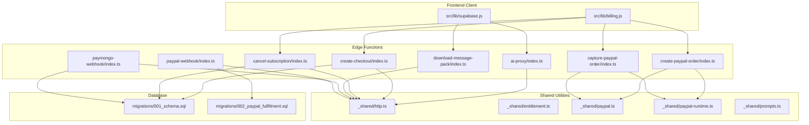
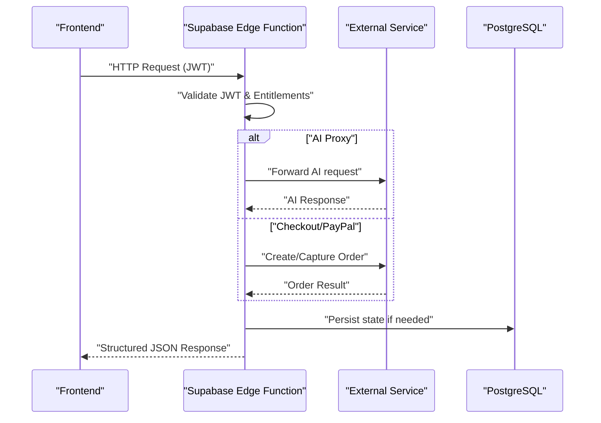
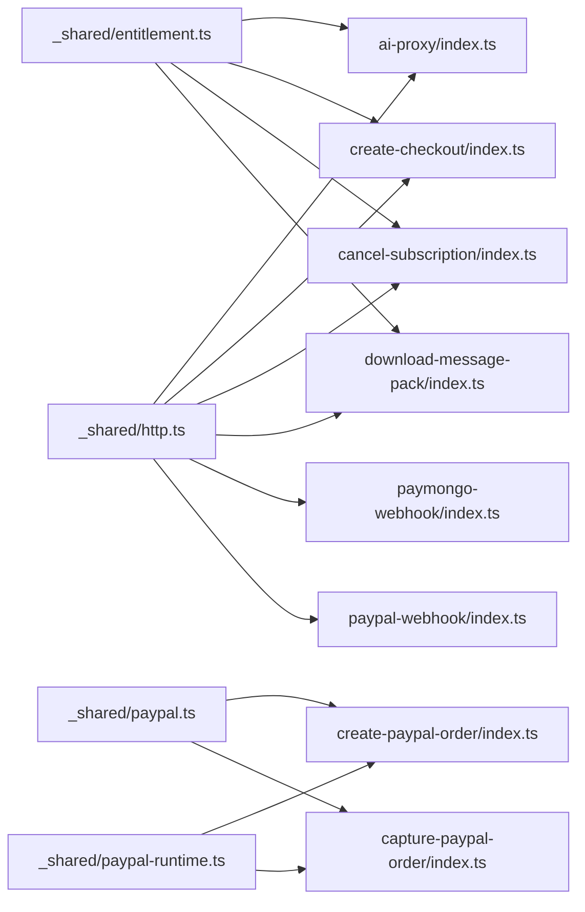

# Supabase Edge Functions

<cite>
**Referenced Files in This Document**
- [ai-proxy/index.ts](file://supabase/functions/ai-proxy/index.ts)
- [create-checkout/index.ts](file://supabase/functions/create-checkout/index.ts)
- [cancel-subscription/index.ts](file://supabase/functions/cancel-subscription/index.ts)
- [download-message-pack/index.ts](file://supabase/functions/download-message-pack/index.ts)
- [paymongo-webhook/index.ts](file://supabase/functions/paymongo-webhook/index.ts)
- [paypal-webhook/index.ts](file://supabase/functions/paypal-webhook/index.ts)
- [create-paypal-order/index.ts](file://supabase/functions/create-paypal-order/index.ts)
- [capture-paypal-order/index.ts](file://supabase/functions/capture-paypal-order/index.ts)
- [_shared/http.ts](file://supabase/functions/_shared/http.ts)
- [_shared/entitlement.ts](file://supabase/functions/_shared/entitlement.ts)
- [_shared/paypal.ts](file://supabase/functions/_shared/paypal.ts)
- [_shared/paypal-runtime.ts](file://supabase/functions/_shared/paypal-runtime.ts)
- [_shared/prompts.ts](file://supabase/functions/_shared/prompts.ts)
- [functions/config.toml](file://supabase/config.toml)
- [migrations/001_schema.sql](file://supabase/migrations/001_schema.sql)
- [migrations/002_paypal_fulfillment.sql](file://supabase/migrations/002_paypal_fulfillment.sql)
- [src/lib/billing.js](file://src/lib/billing.js)
- [src/lib/supabase.js](file://src/lib/supabase.js)
</cite>

## Table of Contents
1. [Introduction](#introduction)
2. [Project Structure](#project-structure)
3. [Core Components](#core-components)
4. [Architecture Overview](#architecture-overview)
5. [Detailed Component Analysis](#detailed-component-analysis)
6. [Dependency Analysis](#dependency-analysis)
7. [Performance Considerations](#performance-considerations)
8. [Troubleshooting Guide](#troubleshooting-guide)
9. [Conclusion](#conclusion)
10. [Appendices](#appendices)

## Introduction
This document provides comprehensive API documentation for ApplyGuard PH’s Supabase Edge Functions. It covers serverless endpoints for:
- AI proxy service
- Checkout creation and PayPal order lifecycle
- Subscription management (cancellation)
- Data export utilities
- Payment webhooks (PayMongo, PayPal)

For each endpoint, you will find HTTP methods, URL patterns, request/response schemas, authentication requirements using JWT tokens, parameter validation rules, error handling patterns, security headers, rate limiting considerations, and client integration examples. Deployment configuration, environment variables, and performance optimization tips are also included.

## Project Structure
The Edge Functions are organized under supabase/functions with shared utilities in _shared. Webhooks handle payment provider callbacks. Migrations define database schema changes relevant to billing and fulfillment.

**Diagram sources**
- [ai-proxy/index.ts](file://supabase/functions/ai-proxy/index.ts)
- [create-checkout/index.ts](file://supabase/functions/create-checkout/index.ts)
- [cancel-subscription/index.ts](file://supabase/functions/cancel-subscription/index.ts)
- [download-message-pack/index.ts](file://supabase/functions/download-message-pack/index.ts)
- [paymongo-webhook/index.ts](file://supabase/functions/paymongo-webhook/index.ts)
- [paypal-webhook/index.ts](file://supabase/functions/paypal-webhook/index.ts)
- [create-paypal-order/index.ts](file://supabase/functions/create-paypal-order/index.ts)
- [capture-paypal-order/index.ts](file://supabase/functions/capture-paypal-order/index.ts)
- [_shared/http.ts](file://supabase/functions/_shared/http.ts)
- [_shared/entitlement.ts](file://supabase/functions/_shared/entitlement.ts)
- [_shared/paypal.ts](file://supabase/functions/_shared/paypal.ts)
- [_shared/paypal-runtime.ts](file://supabase/functions/_shared/paypal-runtime.ts)
- [_shared/prompts.ts](file://supabase/functions/_shared/prompts.ts)
- [migrations/001_schema.sql](file://supabase/migrations/001_schema.sql)
- [migrations/002_paypal_fulfillment.sql](file://supabase/migrations/002_paypal_fulfillment.sql)
- [src/lib/billing.js](file://src/lib/billing.js)
- [src/lib/supabase.js](file://src/lib/supabase.js)

**Section sources**
- [functions/config.toml](file://supabase/config.toml)
- [migrations/001_schema.sql](file://supabase/migrations/001_schema.sql)
- [migrations/002_paypal_fulfillment.sql](file://supabase/migrations/002_paypal_fulfillment.sql)

## Core Components
- Shared HTTP helpers: Provide consistent response formatting, CORS, and JSON serialization across functions.
- Entitlements: Centralized logic to check user subscription status and feature access.
- PayPal integrations: Order creation and capture flows with runtime configuration.
- Prompts: Reusable prompt templates used by the AI proxy.

Key responsibilities:
- Normalize requests/responses
- Validate JWT and enforce RBAC where applicable
- Enforce input validation and safe defaults
- Return structured errors with stable codes

**Section sources**
- [_shared/http.ts](file://supabase/functions/_shared/http.ts)
- [_shared/entitlement.ts](file://supabase/functions/_shared/entitlement.ts)
- [_shared/paypal.ts](file://supabase/functions/_shared/paypal.ts)
- [_shared/paypal-runtime.ts](file://supabase/functions/_shared/paypal-runtime.ts)
- [_shared/prompts.ts](file://supabase/functions/_shared/prompts.ts)

## Architecture Overview
High-level flow:
- Frontend calls Edge Functions via Supabase client or direct HTTP.
- Functions validate JWT, enforce entitlements, and interact with external services (AI providers, payment gateways).
- Webhooks receive asynchronous events from payment providers and update database state.

[No sources needed since this diagram shows conceptual workflow, not actual code structure]

## Detailed Component Analysis

### AI Proxy Service
Purpose:
- Proxies AI model requests securely from the frontend to an external AI provider.
- Ensures only authenticated users can call the endpoint and enforces entitlement checks.

Endpoint:
- Method: POST
- URL pattern: /functions/v1/ai-proxy
- Authentication: Required (JWT in Authorization header)
- Content-Type: application/json

Request body:
- message: string (required)
- model: string (optional; validated against allowed models)
- max_tokens: number (optional; bounded)
- temperature: number (optional; bounded)
- system_prompt: string (optional; uses default if omitted)

Response:
- success: boolean
- data: object containing assistant reply and metadata
- error: object with code and message on failure

Error handling:
- 401 Unauthorized when JWT is missing or invalid
- 403 Forbidden when entitlements do not allow AI usage
- 400 Bad Request for invalid parameters
- 5xx for upstream provider failures

Security headers:
- Standard secure headers applied via shared HTTP helper

Rate limiting:
- Per-user token limits enforced at function level
- Global throttling recommended at gateway layer

Client example:
- Use Supabase client to send authenticated POST with JSON payload
- Handle structured error responses and retry with backoff on transient errors

**Section sources**
- [ai-proxy/index.ts](file://supabase/functions/ai-proxy/index.ts)
- [_shared/http.ts](file://supabase/functions/_shared/http.ts)
- [_shared/entitlement.ts](file://supabase/functions/_shared/entitlement.ts)
- [_shared/prompts.ts](file://supabase/functions/_shared/prompts.ts)

### Create Checkout
Purpose:
- Creates a checkout session for subscription purchase.
- Validates plan selection and user entitlements before proceeding.

Endpoint:
- Method: POST
- URL pattern: /functions/v1/create-checkout
- Authentication: Required (JWT in Authorization header)
- Content-Type: application/json

Request body:
- plan_id: string (required; must be a valid plan identifier)
- currency: string (optional; defaults to configured currency)
- metadata: object (optional; arbitrary key-value pairs)

Response:
- success: boolean
- data: object with checkout session details (e.g., redirect URL)
- error: object with code and message on failure

Validation:
- plan_id must exist in pricing catalog
- currency must be supported
- metadata keys limited to safe set

Error handling:
- 401 Unauthorized
- 403 Forbidden if user cannot subscribe to selected plan
- 400 Bad Request for invalid inputs
- 5xx for provider errors

Security headers:
- Secure defaults applied via shared HTTP helper

Rate limiting:
- Limit checkout attempts per user per minute

Client example:
- Call create-checkout after selecting a plan
- Redirect user to returned checkout URL upon success

**Section sources**
- [create-checkout/index.ts](file://supabase/functions/create-checkout/index.ts)
- [_shared/http.ts](file://supabase/functions/_shared/http.ts)
- [_shared/entitlement.ts](file://supabase/functions/_shared/entitlement.ts)

### Cancel Subscription
Purpose:
- Cancels an active subscription for the authenticated user.
- Prevents cancellation if no active subscription exists.

Endpoint:
- Method: POST
- URL pattern: /functions/v1/cancel-subscription
- Authentication: Required (JWT in Authorization header)

Request body:
- reason: string (optional; stored for analytics)

Response:
- success: boolean
- data: object with cancellation confirmation details
- error: object with code and message on failure

Validation:
- Active subscription must exist
- Reason length and content sanitized

Error handling:
- 401 Unauthorized
- 404 Not Found if no active subscription
- 400 Bad Request for invalid inputs
- 5xx for provider/database errors

Security headers:
- Secure defaults applied via shared HTTP helper

Rate limiting:
- One cancellation attempt per user per hour

Client example:
- Prompt user to confirm cancellation
- Show confirmation message and update UI state

**Section sources**
- [cancel-subscription/index.ts](file://supabase/functions/cancel-subscription/index.ts)
- [_shared/http.ts](file://supabase/functions/_shared/http.ts)
- [_shared/entitlement.ts](file://supabase/functions/_shared/entitlement.ts)

### Download Message Pack
Purpose:
- Exports user data as a compressed message pack file.
- Requires authentication and entitlement checks.

Endpoint:
- Method: GET
- URL pattern: /functions/v1/download-message-pack
- Authentication: Required (JWT in Authorization header)

Query parameters:
- format: string (optional; defaults to msgpack)
- scope: string (optional; restricts exported entities)

Response:
- Binary stream of .msgpack file
- On error: JSON with structured error fields

Validation:
- scope values restricted to predefined sets
- format validated against supported types

Error handling:
- 401 Unauthorized
- 403 Forbidden if export not permitted
- 400 Bad Request for invalid parameters
- 5xx for storage/export failures

Security headers:
- Secure defaults applied via shared HTTP helper

Rate limiting:
- Export once per user per day

Client example:
- Trigger download on button click
- Handle binary response and save to local file system

**Section sources**
- [download-message-pack/index.ts](file://supabase/functions/download-message-pack/index.ts)
- [_shared/http.ts](file://supabase/functions/_shared/http.ts)
- [_shared/entitlement.ts](file://supabase/functions/_shared/entitlement.ts)

### PayMongo Webhook
Purpose:
- Receives asynchronous payment events from PayMongo.
- Updates subscription and billing records accordingly.

Endpoint:
- Method: POST
- URL pattern: /functions/v1/paymongo-webhook
- Authentication: Not required (signature verification required)
- Content-Type: application/json

Request body:
- event_type: string (required)
- data: object (provider-specific payload)
- signature: string (required; used for verification)

Response:
- success: boolean
- message: string (acknowledgement)

Validation:
- Signature verification against webhook secret
- Event type routing to handlers

Error handling:
- 400 Bad Request for malformed payloads
- 401 Unauthorized for invalid signatures
- 5xx for processing failures

Security headers:
- Minimal headers for webhook endpoints

Rate limiting:
- Provider-enforced; function should idempotently process events

Client example:
- No direct client call; ensure webhook URL is registered with PayMongo dashboard

**Section sources**
- [paymongo-webhook/index.ts](file://supabase/functions/paymongo-webhook/index.ts)
- [_shared/http.ts](file://supabase/functions/_shared/http.ts)

### PayPal Webhook
Purpose:
- Receives asynchronous payment events from PayPal.
- Updates subscription and billing records accordingly.

Endpoint:
- Method: POST
- URL pattern: /functions/v1/paypal-webhook
- Authentication: Not required (signature verification required)
- Content-Type: application/json

Request body:
- event_type: string (required)
- data: object (provider-specific payload)
- signature: string (required; used for verification)

Response:
- success: boolean
- message: string (acknowledgement)

Validation:
- Signature verification against webhook secret
- Event type routing to handlers

Error handling:
- 400 Bad Request for malformed payloads
- 401 Unauthorized for invalid signatures
- 5xx for processing failures

Security headers:
- Minimal headers for webhook endpoints

Rate limiting:
- Provider-enforced; function should idempotently process events

Client example:
- No direct client call; ensure webhook URL is registered with PayPal dashboard

**Section sources**
- [paypal-webhook/index.ts](file://supabase/functions/paypal-webhook/index.ts)
- [_shared/http.ts](file://supabase/functions/_shared/http.ts)

### Create PayPal Order
Purpose:
- Creates a PayPal order for checkout or one-time payments.

Endpoint:
- Method: POST
- URL pattern: /functions/v1/create-paypal-order
- Authentication: Required (JWT in Authorization header)
- Content-Type: application/json

Request body:
- amount: number (required; positive)
- currency: string (required; ISO 4217)
- intent: string (required; e.g., capture or authorize)
- metadata: object (optional)

Response:
- success: boolean
- data: object with order ID and approval URL
- error: object with code and message on failure

Validation:
- Amount bounds and currency support
- Intent values restricted to allowed set

Error handling:
- 401 Unauthorized
- 400 Bad Request for invalid inputs
- 5xx for PayPal API errors

Security headers:
- Secure defaults applied via shared HTTP helper

Rate limiting:
- Limit order creation per user per minute

Client example:
- After creating order, redirect user to approval URL
- Store order ID for capture step

**Section sources**
- [create-paypal-order/index.ts](file://supabase/functions/create-paypal-order/index.ts)
- [_shared/paypal.ts](file://supabase/functions/_shared/paypal.ts)
- [_shared/paypal-runtime.ts](file://supabase/functions/_shared/paypal-runtime.ts)
- [_shared/http.ts](file://supabase/functions/_shared/http.ts)

### Capture PayPal Order
Purpose:
- Captures a previously created PayPal order after user approval.

Endpoint:
- Method: POST
- URL pattern: /functions/v1/capture-paypal-order
- Authentication: Required (JWT in Authorization header)
- Content-Type: application/json

Request body:
- order_id: string (required; matches approved order)
- payer_id: string (optional; depends on provider flow)

Response:
- success: boolean
- data: object with capture confirmation and transaction details
- error: object with code and message on failure

Validation:
- Order ID existence and approval status
- Payer ID presence when required

Error handling:
- 401 Unauthorized
- 404 Not Found for unknown orders
- 400 Bad Request for invalid inputs
- 5xx for PayPal API errors

Security headers:
- Secure defaults applied via shared HTTP helper

Rate limiting:
- Limit capture attempts per order

Client example:
- After user approves order, call capture endpoint
- Update subscription state based on capture result

**Section sources**
- [capture-paypal-order/index.ts](file://supabase/functions/capture-paypal-order/index.ts)
- [_shared/paypal.ts](file://supabase/functions/_shared/paypal.ts)
- [_shared/paypal-runtime.ts](file://supabase/functions/_shared/paypal-runtime.ts)
- [_shared/http.ts](file://supabase/functions/_shared/http.ts)

## Dependency Analysis
Function dependencies and relationships:
- All functions use shared HTTP helper for consistent responses and headers.
- Entitlement module centralizes permission checks.
- PayPal functions depend on PayPal runtime configuration and shared PayPal utilities.
- Webhooks rely on database migrations for billing tables.

**Diagram sources**
- [_shared/http.ts](file://supabase/functions/_shared/http.ts)
- [_shared/entitlement.ts](file://supabase/functions/_shared/entitlement.ts)
- [_shared/paypal.ts](file://supabase/functions/_shared/paypal.ts)
- [_shared/paypal-runtime.ts](file://supabase/functions/_shared/paypal-runtime.ts)
- [ai-proxy/index.ts](file://supabase/functions/ai-proxy/index.ts)
- [create-checkout/index.ts](file://supabase/functions/create-checkout/index.ts)
- [cancel-subscription/index.ts](file://supabase/functions/cancel-subscription/index.ts)
- [download-message-pack/index.ts](file://supabase/functions/download-message-pack/index.ts)
- [paymongo-webhook/index.ts](file://supabase/functions/paymongo-webhook/index.ts)
- [paypal-webhook/index.ts](file://supabase/functions/paypal-webhook/index.ts)
- [create-paypal-order/index.ts](file://supabase/functions/create-paypal-order/index.ts)
- [capture-paypal-order/index.ts](file://supabase/functions/capture-paypal-order/index.ts)

**Section sources**
- [_shared/http.ts](file://supabase/functions/_shared/http.ts)
- [_shared/entitlement.ts](file://supabase/functions/_shared/entitlement.ts)
- [_shared/paypal.ts](file://supabase/functions/_shared/paypal.ts)
- [_shared/paypal-runtime.ts](file://supabase/functions/_shared/paypal-runtime.ts)

## Performance Considerations
- Minimize cold starts by keeping function bundles small and avoiding heavy dependencies.
- Cache frequently accessed configuration and prompts in memory within function execution context.
- Use streaming for large exports like message pack downloads.
- Implement idempotent webhook handlers to avoid duplicate processing.
- Set appropriate timeouts per function based on expected latency.
- Prefer batch operations when interacting with databases.
- Use connection pooling for database connections where supported.

[No sources needed since this section provides general guidance]

## Troubleshooting Guide
Common issues and resolutions:
- Authentication failures: Ensure JWT is present and valid; verify Supabase client initialization.
- Entitlement errors: Confirm user has active subscription or required feature flags.
- Webhook signature mismatches: Check webhook secrets and timestamp tolerances.
- PayPal order capture failures: Verify order approval status and payer ID presence.
- Rate limit exceeded: Back off and retry with exponential delay; inform users gracefully.

Operational checks:
- Inspect function logs for stack traces and error codes.
- Validate request payloads against documented schemas.
- Monitor external service health and fallback behaviors.

**Section sources**
- [_shared/http.ts](file://supabase/functions/_shared/http.ts)
- [_shared/entitlement.ts](file://supabase/functions/_shared/entitlement.ts)
- [paymongo-webhook/index.ts](file://supabase/functions/paymongo-webhook/index.ts)
- [paypal-webhook/index.ts](file://supabase/functions/paypal-webhook/index.ts)
- [create-paypal-order/index.ts](file://supabase/functions/create-paypal-order/index.ts)
- [capture-paypal-order/index.ts](file://supabase/functions/capture-paypal-order/index.ts)

## Conclusion
ApplyGuard PH’s Supabase Edge Functions provide a secure, scalable backend for AI interactions, billing, subscriptions, and data exports. By following the documented schemas, authentication requirements, and error handling patterns, clients can integrate reliably. Proper deployment configuration and performance optimizations ensure robust operation in production.

[No sources needed since this section summarizes without analyzing specific files]

## Appendices

### Environment Variables
- SUPABASE_JWT_SECRET: Used to validate JWT tokens
- PAYPAL_CLIENT_ID: PayPal API client identifier
- PAYPAL_CLIENT_SECRET: PayPal API client secret
- PAYPAL_MODE: Sandbox or live mode
- PAYMONGO_WEBHOOK_SECRET: Secret for verifying PayMongo webhook signatures
- PAYPAL_WEBHOOK_SECRET: Secret for verifying PayPal webhook signatures
- AI_PROVIDER_API_KEY: Key for external AI provider
- AI_MODEL_ALLOWLIST: Comma-separated list of allowed models
- EXPORT_SCOPE_LIMITS: Allowed export scopes
- RATE_LIMIT_CONFIG: Per-function rate limit settings

[No sources needed since this section provides general guidance]

### Security Headers
- Content-Security-Policy: Restrict resource loading
- X-Content-Type-Options: Prevent MIME sniffing
- X-Frame-Options: Prevent framing attacks
- Strict-Transport-Security: Enforce HTTPS
- Referrer-Policy: Control referrer information
- Permissions-Policy: Restrict browser features

[No sources needed since this section provides general guidance]

### Client Integration Examples
- Billing flows: Use src/lib/billing.js to orchestrate checkout, capture, and cancellation.
- Supabase client: Initialize with project URL and anon/public keys; attach JWT for authenticated calls.
- Error handling: Map provider errors to user-friendly messages and implement retries with backoff.

**Section sources**
- [src/lib/billing.js](file://src/lib/billing.js)
- [src/lib/supabase.js](file://src/lib/supabase.js)