# Architecture Overview

<cite>
**Referenced Files in This Document**
- [README.md](file://README.md)
- [package.json](file://package.json)
- [vite.config.js](file://vite.config.js)
- [netlify.toml](file://netlify.toml)
- [vercel.json](file://vercel.json)
- [capacitor.config.ts](file://capacitor.config.ts)
- [index.html](file://index.html)
- [src/main.jsx](file://src/main.jsx)
- [src/App.jsx](file://src/App.jsx)
- [src/store.jsx](file://src/store.jsx)
- [src/auth.jsx](file://src/auth.jsx)
- [src/mobile.js](file://src/mobile.js)
- [src/components/Layout.jsx](file://src/components/Layout.jsx)
- [src/components/AccountPage.jsx](file://src/components/AccountPage.jsx)
- [src/components/MockInterviewPage.jsx](file://src/components/MockInterviewPage.jsx)
- [src/components/OffersPage.jsx](file://src/components/OffersPage.jsx)
- [src/components/ResultView.jsx](file://src/components/ResultView.jsx)
- [src/components/ScanForm.jsx](file://src/components/ScanForm.jsx)
- [src/components/Settings.jsx](file://src/components/Settings.jsx)
- [src/components/Toast.jsx](file://src/components/Toast.jsx)
- [src/components/Tracker.jsx](file://src/components/Tracker.jsx)
- [src/lib/supabase.js](file://src/lib/supabase.js)
- [src/lib/storage.js](file://src/lib/storage.js)
- [src/lib/cloud.js](file://src/lib/cloud.js)
- [src/lib/sync.js](file://src/lib/sync.js)
- [src/lib/billing.js](file://src/lib/billing.js)
- [src/lib/entitlement.js](file://src/lib/entitlement.js)
- [src/lib/ai.js](file://src/lib/ai.js)
- [public/sw.js](file://public/sw.js)
- [supabase/functions/_shared/http.ts](file://supabase/functions/_shared/http.ts)
- [supabase/functions/_shared/entitlement.ts](file://supabase/functions/_shared/entitlement.ts)
- [supabase/functions/paymongo-webhook/index.ts](file://supabase/functions/paymongo-webhook/index.ts)
- [supabase/functions/paypal-webhook/index.ts](file://supabase/functions/paypal-webhook/index.ts)
- [supabase/functions/capture-paypal-order/index.ts](file://supabase/functions/capture-paypal-order/index.ts)
- [supabase/functions/create-checkout/index.ts](file://supabase/functions/create-checkout/index.ts)
- [supabase/functions/create-paypal-order/index.ts](file://supabase/functions/create-paypal-order/index.ts)
- [supabase/functions/ai-proxy/index.ts](file://supabase/functions/ai-proxy/index.ts)
- [supabase/migrations/001_schema.sql](file://supabase/migrations/001_schema.sql)
- [supabase/migrations/002_paypal_fulfillment.sql](file://supabase/migrations/002_paypal_fulfillment.sql)
</cite>

## Table of Contents
1. Introduction
2. Project Structure
3. Core Components
4. Architecture Overview
5. Detailed Component Analysis
6. Dependency Analysis
7. Performance Considerations
8. Security Architecture
9. Scalability and Deployment Topology
10. Troubleshooting Guide
11. Conclusion

## Introduction
This document provides a comprehensive architectural overview of the ApplyGuard PH system. It explains the high-level design patterns, including component-based architecture, service layer separation, and state management strategy. It also documents technology stack decisions, system boundaries between frontend, backend services, and external integrations, and details data flow from user interactions through local storage to cloud synchronization. Infrastructure diagrams illustrate component relationships, API call patterns, and real-time sync mechanisms. Finally, it addresses scalability considerations, security architecture, and deployment topology across web and mobile platforms.

## Project Structure
The project is a modern web application with optional mobile packaging:
- Frontend built with Vite and React, organized by features (components), shared logic (lib), and app bootstrap (main entry points).
- Backend functions are hosted on Supabase Edge Functions for billing, AI proxying, and webhook handling.
- Data persistence uses Supabase Postgres via migrations; client-side caching and offline support leverage browser storage and a service worker.
- Mobile packaging is configured via Capacitor for cross-platform distribution.

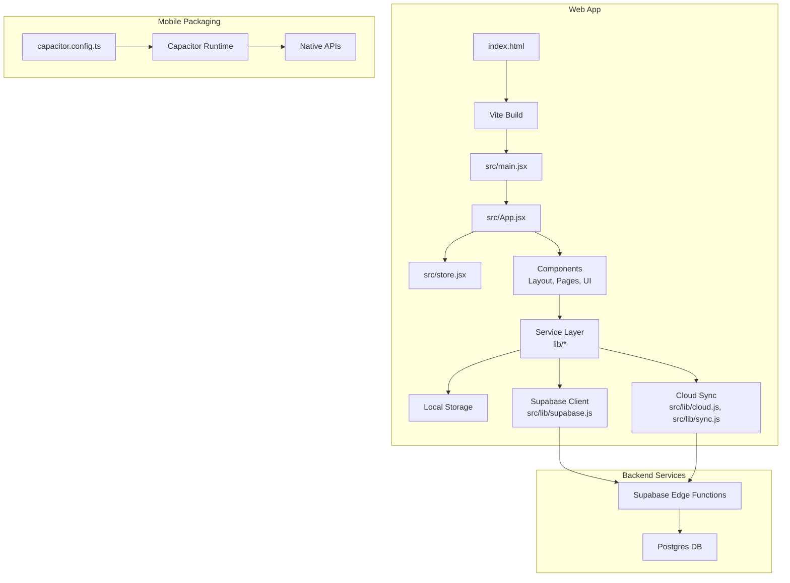

**Diagram sources**
- [index.html](file://index.html)
- [vite.config.js](file://vite.config.js)
- [src/main.jsx](file://src/main.jsx)
- [src/App.jsx](file://src/App.jsx)
- [src/store.jsx](file://src/store.jsx)
- [src/components/Layout.jsx](file://src/components/Layout.jsx)
- [src/lib/supabase.js](file://src/lib/supabase.js)
- [src/lib/cloud.js](file://src/lib/cloud.js)
- [src/lib/sync.js](file://src/lib/sync.js)
- [capacitor.config.ts](file://capacitor.config.ts)
- [supabase/functions/_shared/http.ts](file://supabase/functions/_shared/http.ts)
- [supabase/migrations/001_schema.sql](file://supabase/migrations/001_schema.sql)

**Section sources**
- [README.md](file://README.md)
- [package.json](file://package.json)
- [vite.config.js](file://vite.config.js)
- [capacitor.config.ts](file://capacitor.config.ts)
- [index.html](file://index.html)

## Core Components
- Application Bootstrap and Routing
  - Entry point initializes the React app and mounts the root component.
  - The root component composes layout and feature pages.
- State Management
  - Centralized store holds application state and exposes actions for components.
  - Store integrates with local storage for persistence and with cloud sync for multi-device consistency.
- Service Layer
  - Encapsulates domain logic and external calls:
    - Supabase client configuration and queries.
    - Cloud sync orchestration and conflict resolution.
    - Billing and entitlements integration with payment providers.
    - AI assistant proxying to external models.
- Feature Components
  - Account, Mock Interview, Offers, Result View, Scan Form, Settings, Toast notifications, Tracker.
- Offline and PWA Support
  - Service worker enables caching and background tasks.

**Section sources**
- [src/main.jsx](file://src/main.jsx)
- [src/App.jsx](file://src/App.jsx)
- [src/store.jsx](file://src/store.jsx)
- [src/components/Layout.jsx](file://src/components/Layout.jsx)
- [src/components/AccountPage.jsx](file://src/components/AccountPage.jsx)
- [src/components/MockInterviewPage.jsx](file://src/components/MockInterviewPage.jsx)
- [src/components/OffersPage.jsx](file://src/components/OffersPage.jsx)
- [src/components/ResultView.jsx](file://src/components/ResultView.jsx)
- [src/components/ScanForm.jsx](file://src/components/ScanForm.jsx)
- [src/components/Settings.jsx](file://src/components/Settings.jsx)
- [src/components/Toast.jsx](file://src/components/Toast.jsx)
- [src/components/Tracker.jsx](file://src/components/Tracker.jsx)
- [src/lib/supabase.js](file://src/lib/supabase.js)
- [src/lib/cloud.js](file://src/lib/cloud.js)
- [src/lib/sync.js](file://src/lib/sync.js)
- [src/lib/billing.js](file://src/lib/billing.js)
- [src/lib/entitlement.js](file://src/lib/entitlement.js)
- [src/lib/ai.js](file://src/lib/ai.js)
- [public/sw.js](file://public/sw.js)

## Architecture Overview
The system follows a component-based architecture with clear separation between UI, state, and services. The service layer abstracts all external integrations (Supabase, payment gateways, AI providers). State is managed centrally and persisted locally, with cloud synchronization ensuring consistency across devices.

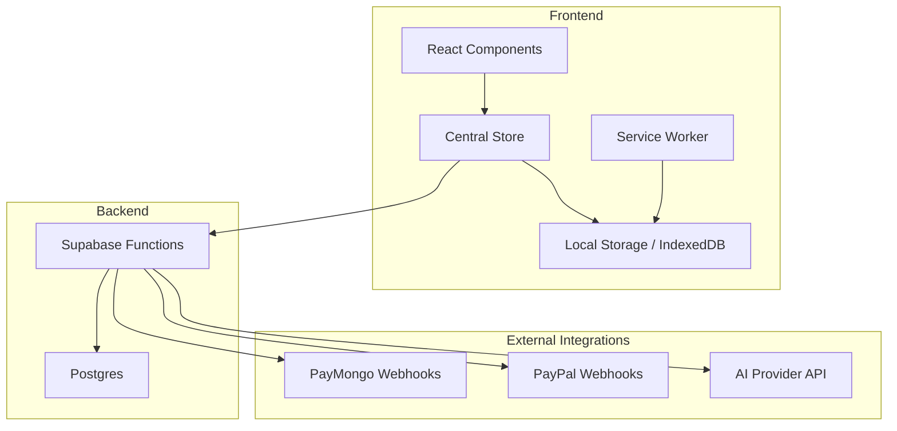

**Diagram sources**
- [src/App.jsx](file://src/App.jsx)
- [src/store.jsx](file://src/store.jsx)
- [src/lib/supabase.js](file://src/lib/supabase.js)
- [src/lib/cloud.js](file://src/lib/cloud.js)
- [src/lib/sync.js](file://src/lib/sync.js)
- [public/sw.js](file://public/sw.js)
- [supabase/functions/paymongo-webhook/index.ts](file://supabase/functions/paymongo-webhook/index.ts)
- [supabase/functions/paypal-webhook/index.ts](file://supabase/functions/paypal-webhook/index.ts)
- [supabase/functions/ai-proxy/index.ts](file://supabase/functions/ai-proxy/index.ts)
- [supabase/migrations/001_schema.sql](file://supabase/migrations/001_schema.sql)

## Detailed Component Analysis

### Component-Based UI Architecture
- Layout and Pages
  - Layout composes navigation and page shells.
  - Feature pages encapsulate domain-specific UI and behavior.
- Shared UI Utilities
  - Toast notifications provide user feedback.
  - Tracker monitors usage or performance metrics.

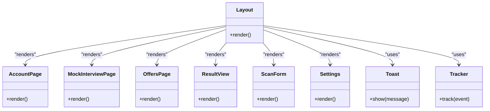

**Diagram sources**
- [src/components/Layout.jsx](file://src/components/Layout.jsx)
- [src/components/AccountPage.jsx](file://src/components/AccountPage.jsx)
- [src/components/MockInterviewPage.jsx](file://src/components/MockInterviewPage.jsx)
- [src/components/OffersPage.jsx](file://src/components/OffersPage.jsx)
- [src/components/ResultView.jsx](file://src/components/ResultView.jsx)
- [src/components/ScanForm.jsx](file://src/components/ScanForm.jsx)
- [src/components/Settings.jsx](file://src/components/Settings.jsx)
- [src/components/Toast.jsx](file://src/components/Toast.jsx)
- [src/components/Tracker.jsx](file://src/components/Tracker.jsx)

**Section sources**
- [src/components/Layout.jsx](file://src/components/Layout.jsx)
- [src/components/AccountPage.jsx](file://src/components/AccountPage.jsx)
- [src/components/MockInterviewPage.jsx](file://src/components/MockInterviewPage.jsx)
- [src/components/OffersPage.jsx](file://src/components/OffersPage.jsx)
- [src/components/ResultView.jsx](file://src/components/ResultView.jsx)
- [src/components/ScanForm.jsx](file://src/components/ScanForm.jsx)
- [src/components/Settings.jsx](file://src/components/Settings.jsx)
- [src/components/Toast.jsx](file://src/components/Toast.jsx)
- [src/components/Tracker.jsx](file://src/components/Tracker.jsx)

### Service Layer Separation
- Supabase Integration
  - Configures client and provides typed helpers for database operations.
- Cloud Sync
  - Orchestrates upload/download cycles, handles conflicts, and maintains local-first consistency.
- Billing and Entitlements
  - Creates checkout sessions, captures orders, and verifies entitlements server-side.
- AI Assistant Proxy
  - Proxies requests to AI providers securely, enforcing rate limits and logging.

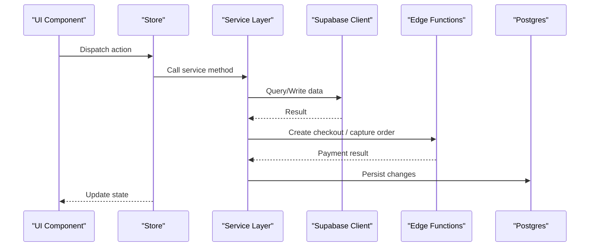

**Diagram sources**
- [src/lib/supabase.js](file://src/lib/supabase.js)
- [src/lib/cloud.js](file://src/lib/cloud.js)
- [src/lib/sync.js](file://src/lib/sync.js)
- [src/lib/billing.js](file://src/lib/billing.js)
- [src/lib/entitlement.js](file://src/lib/entitlement.js)
- [supabase/functions/create-checkout/index.ts](file://supabase/functions/create-checkout/index.ts)
- [supabase/functions/capture-paypal-order/index.ts](file://supabase/functions/capture-paypal-order/index.ts)
- [supabase/migrations/001_schema.sql](file://supabase/migrations/001_schema.sql)

**Section sources**
- [src/lib/supabase.js](file://src/lib/supabase.js)
- [src/lib/cloud.js](file://src/lib/cloud.js)
- [src/lib/sync.js](file://src/lib/sync.js)
- [src/lib/billing.js](file://src/lib/billing.js)
- [src/lib/entitlement.js](file://src/lib/entitlement.js)

### State Management Strategy
- Centralized Store
  - Holds global state and exposes actions for mutation.
  - Persists critical state to local storage for resilience.
- Local-First Design
  - Optimistic updates improve UX; background sync reconciles with cloud.
- Conflict Resolution
  - Timestamps and version vectors ensure consistent merges.

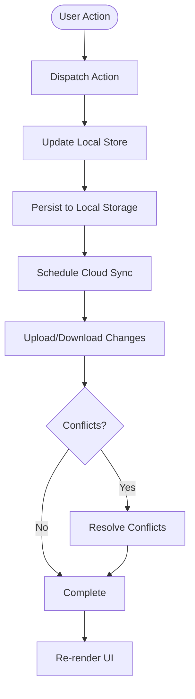

**Diagram sources**
- [src/store.jsx](file://src/store.jsx)
- [src/lib/storage.js](file://src/lib/storage.js)
- [src/lib/cloud.js](file://src/lib/cloud.js)
- [src/lib/sync.js](file://src/lib/sync.js)

**Section sources**
- [src/store.jsx](file://src/store.jsx)
- [src/lib/storage.js](file://src/lib/storage.js)
- [src/lib/cloud.js](file://src/lib/cloud.js)
- [src/lib/sync.js](file://src/lib/sync.js)

### Authentication and Authorization
- Auth Flow
  - Handles sign-in/sign-up and session management.
- Entitlements
  - Server-side verification ensures paid features are accessible only to entitled users.

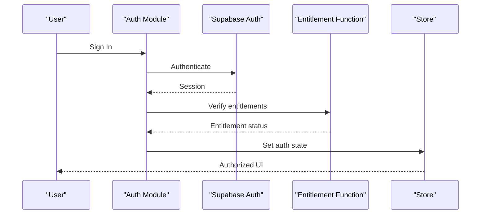

**Diagram sources**
- [src/auth.jsx](file://src/auth.jsx)
- [src/lib/entitlement.js](file://src/lib/entitlement.js)
- [supabase/functions/_shared/entitlement.ts](file://supabase/functions/_shared/entitlement.ts)

**Section sources**
- [src/auth.jsx](file://src/auth.jsx)
- [src/lib/entitlement.js](file://src/lib/entitlement.js)
- [supabase/functions/_shared/entitlement.ts](file://supabase/functions/_shared/entitlement.ts)

### Billing and Payments
- Checkout and Capture
  - Creates checkout sessions and captures payments via provider APIs.
- Webhooks
  - Processes events from PayMongo and PayPal to fulfill subscriptions and update entitlements.

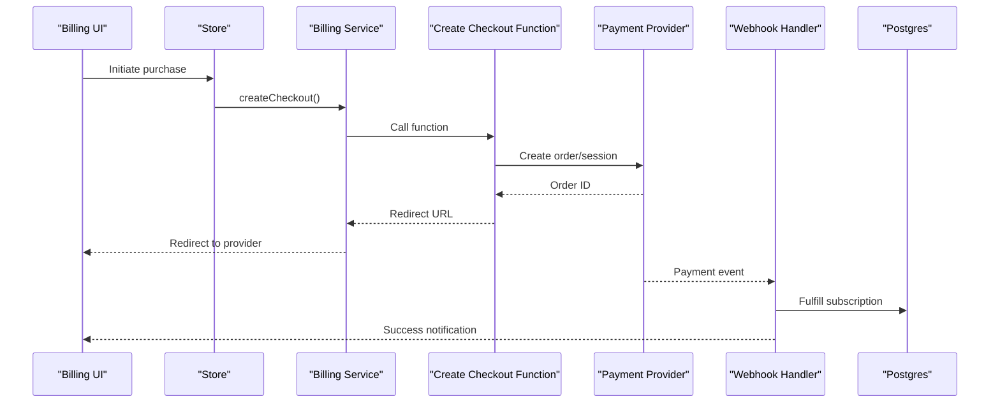

**Diagram sources**
- [src/lib/billing.js](file://src/lib/billing.js)
- [supabase/functions/create-checkout/index.ts](file://supabase/functions/create-checkout/index.ts)
- [supabase/functions/capture-paypal-order/index.ts](file://supabase/functions/capture-paypal-order/index.ts)
- [supabase/functions/paymongo-webhook/index.ts](file://supabase/functions/paymongo-webhook/index.ts)
- [supabase/functions/paypal-webhook/index.ts](file://supabase/functions/paypal-webhook/index.ts)
- [supabase/migrations/002_paypal_fulfillment.sql](file://supabase/migrations/002_paypal_fulfillment.sql)

**Section sources**
- [src/lib/billing.js](file://src/lib/billing.js)
- [supabase/functions/create-checkout/index.ts](file://supabase/functions/create-checkout/index.ts)
- [supabase/functions/capture-paypal-order/index.ts](file://supabase/functions/capture-paypal-order/index.ts)
- [supabase/functions/paymongo-webhook/index.ts](file://supabase/functions/paymongo-webhook/index.ts)
- [supabase/functions/paypal-webhook/index.ts](file://supabase/functions/paypal-webhook/index.ts)
- [supabase/migrations/002_paypal_fulfillment.sql](file://supabase/migrations/002_paypal_fulfillment.sql)

### AI Assistant Integration
- Secure Proxy
  - Frontend calls an internal AI proxy function to avoid exposing secrets.
- Rate Limiting and Logging
  - Enforced at the function level for safety and observability.

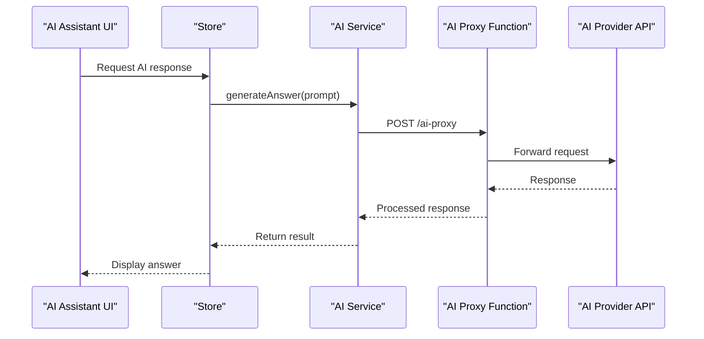

**Diagram sources**
- [src/lib/ai.js](file://src/lib/ai.js)
- [supabase/functions/ai-proxy/index.ts](file://supabase/functions/ai-proxy/index.ts)

**Section sources**
- [src/lib/ai.js](file://src/lib/ai.js)
- [supabase/functions/ai-proxy/index.ts](file://supabase/functions/ai-proxy/index.ts)

### Real-Time Synchronization Mechanisms
- Change Detection
  - Local mutations trigger sync jobs.
- Upload/Download
  - Batched operations minimize network overhead.
- Conflict Handling
  - Deterministic merge strategies maintain consistency.

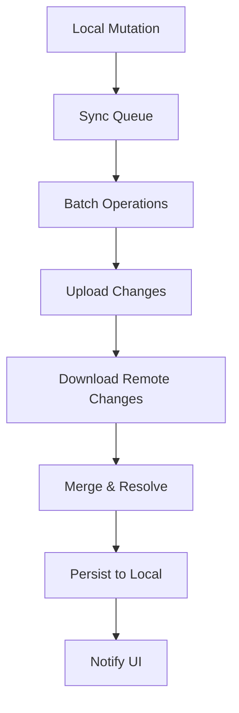

**Diagram sources**
- [src/lib/cloud.js](file://src/lib/cloud.js)
- [src/lib/sync.js](file://src/lib/sync.js)

**Section sources**
- [src/lib/cloud.js](file://src/lib/cloud.js)
- [src/lib/sync.js](file://src/lib/sync.js)

### Offline and PWA Support
- Service Worker
  - Caches assets and supports background sync.
- Local Persistence
  - Ensures app functionality without connectivity.

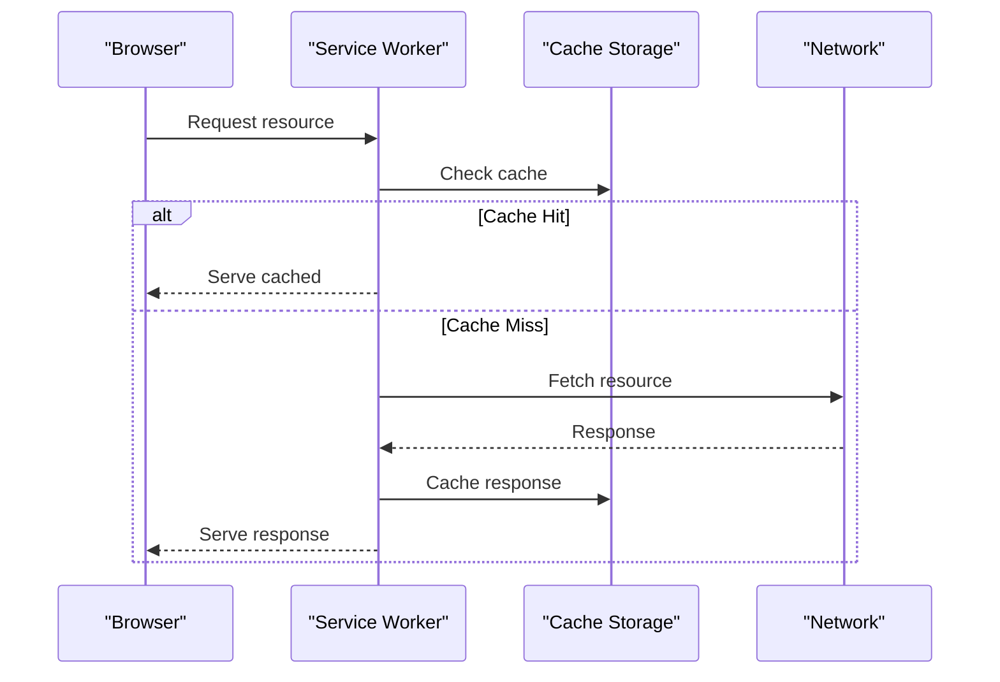

**Diagram sources**
- [public/sw.js](file://public/sw.js)

**Section sources**
- [public/sw.js](file://public/sw.js)

## Dependency Analysis
- Frontend Dependencies
  - React, Vite, Capacitor for mobile packaging.
- Backend Dependencies
  - Supabase Edge Functions for serverless compute.
  - Postgres for relational data.
- External Integrations
  - PayMongo and PayPal for payments.
  - AI provider APIs proxied via functions.

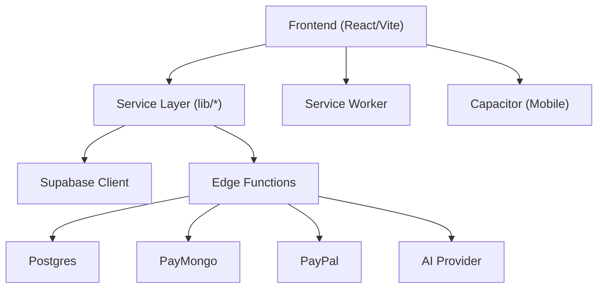

**Diagram sources**
- [package.json](file://package.json)
- [vite.config.js](file://vite.config.js)
- [capacitor.config.ts](file://capacitor.config.ts)
- [src/lib/supabase.js](file://src/lib/supabase.js)
- [supabase/functions/_shared/http.ts](file://supabase/functions/_shared/http.ts)
- [supabase/migrations/001_schema.sql](file://supabase/migrations/001_schema.sql)

**Section sources**
- [package.json](file://package.json)
- [vite.config.js](file://vite.config.js)
- [capacitor.config.ts](file://capacitor.config.ts)
- [src/lib/supabase.js](file://src/lib/supabase.js)
- [supabase/functions/_shared/http.ts](file://supabase/functions/_shared/http.ts)
- [supabase/migrations/001_schema.sql](file://supabase/migrations/001_schema.sql)

## Performance Considerations
- Local-First Updates
  - Optimistic UI reduces perceived latency.
- Batched Sync
  - Aggregates changes to reduce network round-trips.
- Caching Strategy
  - Service worker caches static assets and frequently accessed resources.
- Database Indexing
  - Ensure indexes on frequently queried columns to optimize read performance.

[No sources needed since this section provides general guidance]

## Security Architecture
- Secrets Management
  - All sensitive keys are stored in environment variables within Edge Functions.
- Authorization
  - Row-level security policies enforced at the database level.
- Input Validation
  - Validate inputs at both frontend and backend layers.
- Webhook Verification
  - Verify signatures from payment providers before processing events.

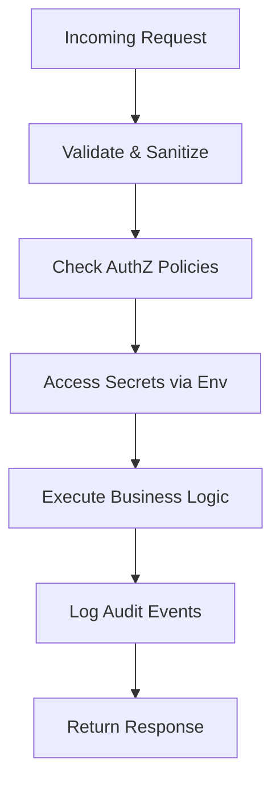

**Diagram sources**
- [supabase/functions/_shared/http.ts](file://supabase/functions/_shared/http.ts)
- [supabase/functions/paymongo-webhook/index.ts](file://supabase/functions/paymongo-webhook/index.ts)
- [supabase/functions/paypal-webhook/index.ts](file://supabase/functions/paypal-webhook/index.ts)

**Section sources**
- [supabase/functions/_shared/http.ts](file://supabase/functions/_shared/http.ts)
- [supabase/functions/paymongo-webhook/index.ts](file://supabase/functions/paymongo-webhook/index.ts)
- [supabase/functions/paypal-webhook/index.ts](file://supabase/functions/paypal-webhook/index.ts)

## Scalability and Deployment Topology
- Horizontal Scaling
  - Edge Functions scale automatically with demand.
- CDN and Caching
  - Static assets served via CDN; service worker enhances offline performance.
- Multi-Platform Deployment
  - Web deployment via Netlify/Vercel configurations.
  - Mobile packaging via Capacitor for iOS/Android distribution.

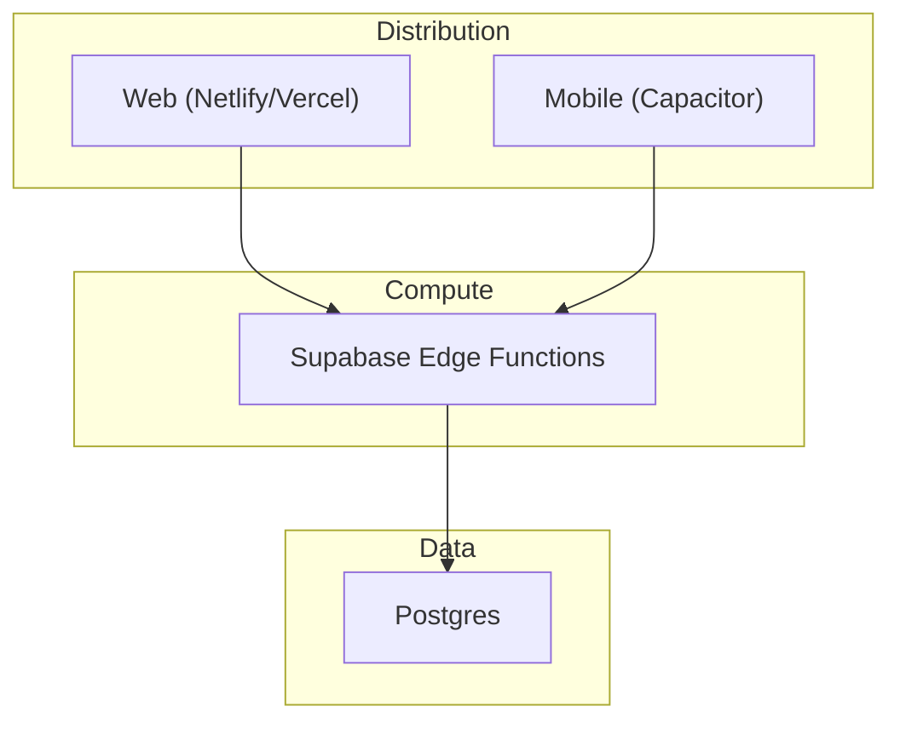

**Diagram sources**
- [netlify.toml](file://netlify.toml)
- [vercel.json](file://vercel.json)
- [capacitor.config.ts](file://capacitor.config.ts)
- [supabase/functions/_shared/http.ts](file://supabase/functions/_shared/http.ts)
- [supabase/migrations/001_schema.sql](file://supabase/migrations/001_schema.sql)

**Section sources**
- [netlify.toml](file://netlify.toml)
- [vercel.json](file://vercel.json)
- [capacitor.config.ts](file://capacitor.config.ts)

## Troubleshooting Guide
- Common Issues
  - Sync failures: Inspect queue and retry logic; verify network connectivity.
  - Payment webhook errors: Confirm signature verification and idempotency.
  - AI proxy timeouts: Check provider availability and rate limits.
- Debugging Tools
  - Use browser dev tools for local storage inspection.
  - Review Edge Function logs for server-side issues.

**Section sources**
- [src/lib/sync.js](file://src/lib/sync.js)
- [supabase/functions/paymongo-webhook/index.ts](file://supabase/functions/paymongo-webhook/index.ts)
- [supabase/functions/paypal-webhook/index.ts](file://supabase/functions/paypal-webhook/index.ts)
- [supabase/functions/ai-proxy/index.ts](file://supabase/functions/ai-proxy/index.ts)

## Conclusion
The ApplyGuard PH system employs a robust component-based architecture with a clear service layer separation and a local-first state management strategy. It leverages Supabase for backend services and data persistence, integrates payment providers securely via Edge Functions, and supports offline capabilities through a service worker. The design emphasizes scalability, security, and cross-platform deployment, providing a solid foundation for future enhancements.