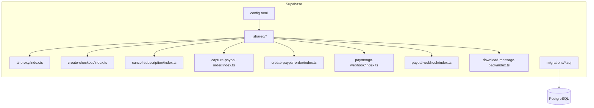
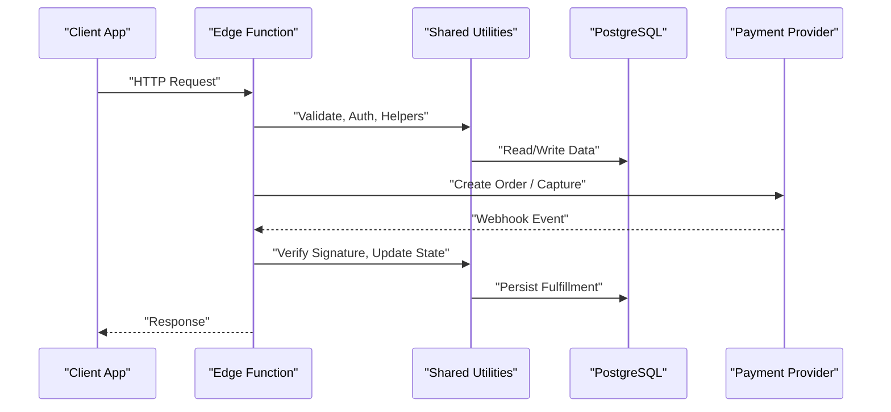
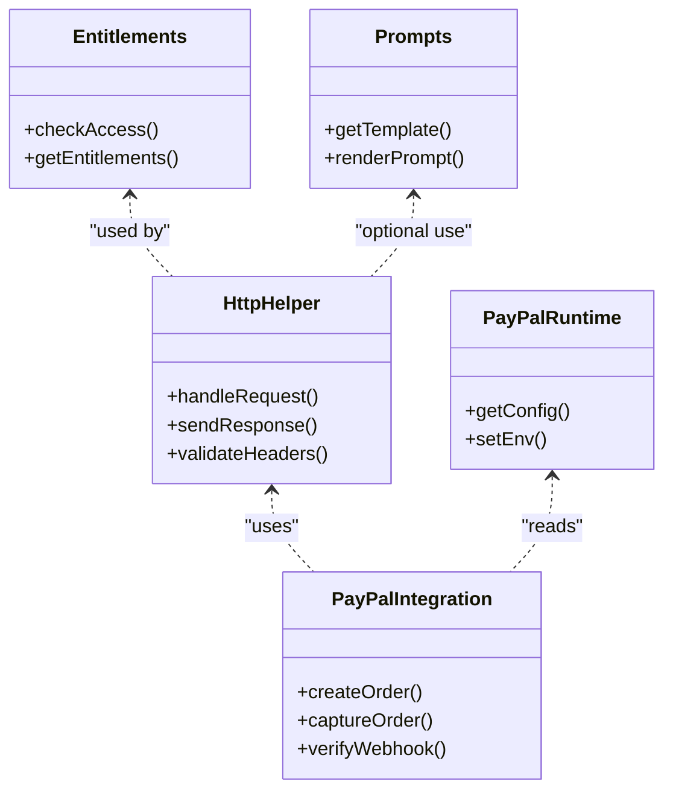
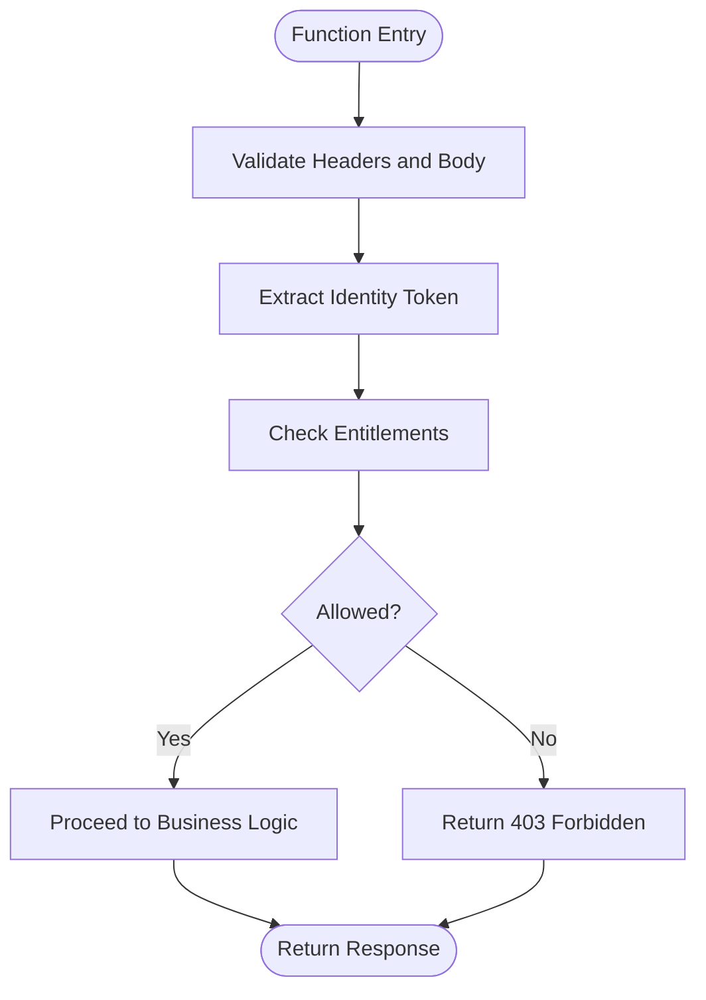
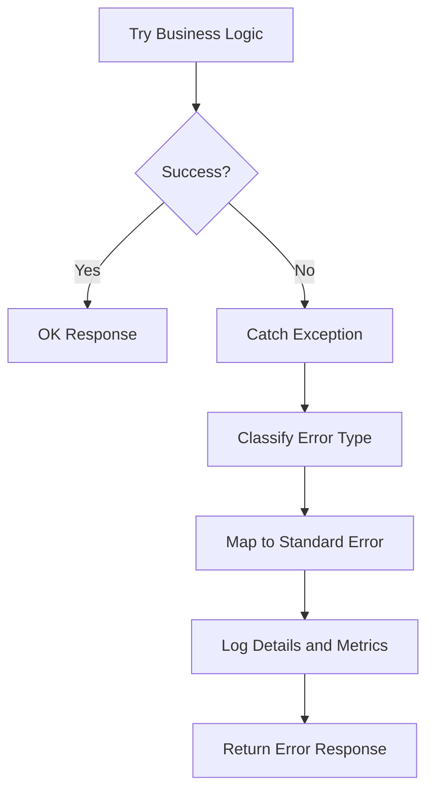
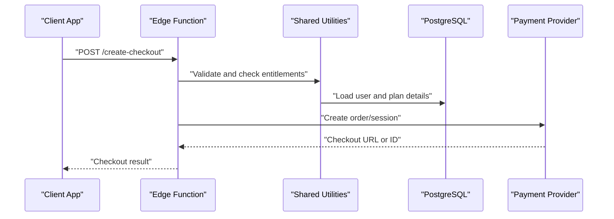
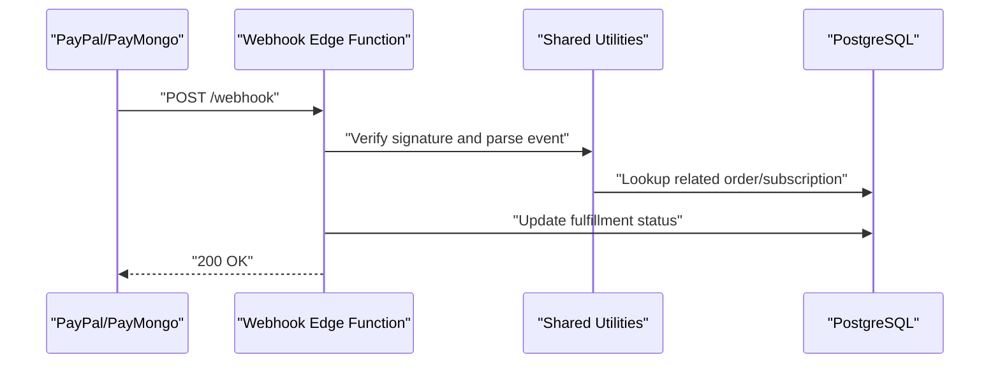
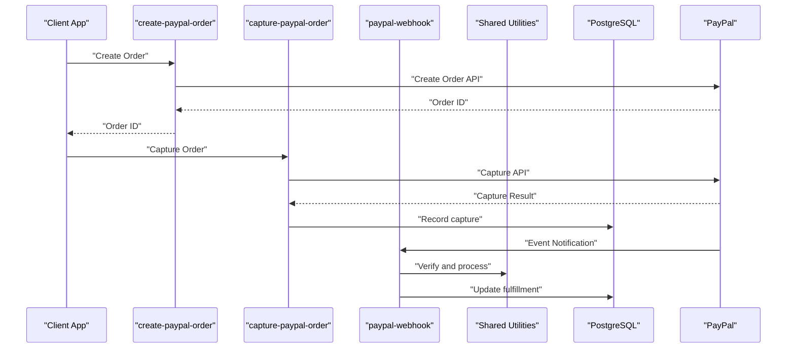
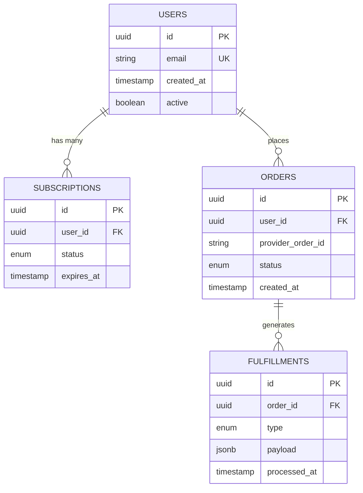
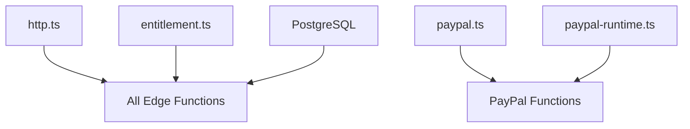

# Backend Services

<cite>
**Referenced Files in This Document**
- [supabase/config.toml](file://supabase/config.toml)
- [supabase/functions/_shared/http.ts](file://supabase/functions/_shared/http.ts)
- [supabase/functions/_shared/entitlement.ts](file://supabase/functions/_shared/entitlement.ts)
- [supabase/functions/_shared/paypal.ts](file://supabase/functions/_shared/paypal.ts)
- [supabase/functions/_shared/paypal-runtime.ts](file://supabase/functions/_shared/paypal-runtime.ts)
- [supabase/functions/_shared/prompts.ts](file://supabase/functions/_shared/prompts.ts)
- [supabase/functions/ai-proxy/index.ts](file://supabase/functions/ai-proxy/index.ts)
- [supabase/functions/create-checkout/index.ts](file://supabase/functions/create-checkout/index.ts)
- [supabase/functions/cancel-subscription/index.ts](file://supabase/functions/cancel-subscription/index.ts)
- [supabase/functions/capture-paypal-order/index.ts](file://supabase/functions/capture-paypal-order/index.ts)
- [supabase/functions/create-paypal-order/index.ts](file://supabase/functions/create-paypal-order/index.ts)
- [supabase/functions/paymongo-webhook/index.ts](file://supabase/functions/paymongo-webhook/index.ts)
- [supabase/functions/paypal-webhook/index.ts](file://supabase/functions/paypal-webhook/index.ts)
- [supabase/functions/download-message-pack/index.ts](file://supabase/functions/download-message-pack/index.ts)
- [supabase/migrations/001_schema.sql](file://supabase/migrations/001_schema.sql)
- [supabase/migrations/002_paypal_fulfillment.sql](file://supabase/migrations/002_paypal_fulfillment.sql)
</cite>

## Table of Contents
1. [Introduction](#introduction)
2. [Project Structure](#project-structure)
3. [Core Components](#core-components)
4. [Architecture Overview](#architecture-overview)
5. [Detailed Component Analysis](#detailed-component-analysis)
6. [Dependency Analysis](#dependency-analysis)
7. [Performance Considerations](#performance-considerations)
8. [Troubleshooting Guide](#troubleshooting-guide)
9. [Conclusion](#conclusion)

## Introduction
This document describes the backend services architecture built on Supabase Edge Functions, a shared utilities library, and a relational database schema managed via migrations. It explains serverless function patterns, authentication middleware, error handling strategies, migration system, relationship modeling, indexing, API endpoint design, webhook processing, third-party integrations (PayPal and PayMongo), security policies, rate limiting considerations, and monitoring approaches.

## Project Structure
The backend is organized under supabase:
- functions: Deno-based Edge Functions implementing API endpoints and webhooks
- _shared: Shared TypeScript modules for HTTP helpers, entitlements, PayPal integration, runtime configuration, and prompts
- migrations: SQL migration files defining the database schema and feature-specific changes

**Diagram sources**
- [supabase/config.toml](file://supabase/config.toml)
- [supabase/functions/_shared/http.ts](file://supabase/functions/_shared/http.ts)
- [supabase/functions/_shared/entitlement.ts](file://supabase/functions/_shared/entitlement.ts)
- [supabase/functions/_shared/paypal.ts](file://supabase/functions/_shared/paypal.ts)
- [supabase/functions/_shared/paypal-runtime.ts](file://supabase/functions/_shared/paypal-runtime.ts)
- [supabase/functions/_shared/prompts.ts](file://supabase/functions/_shared/prompts.ts)
- [supabase/functions/ai-proxy/index.ts](file://supabase/functions/ai-proxy/index.ts)
- [supabase/functions/create-checkout/index.ts](file://supabase/functions/create-checkout/index.ts)
- [supabase/functions/cancel-subscription/index.ts](file://supabase/functions/cancel-subscription/index.ts)
- [supabase/functions/capture-paypal-order/index.ts](file://supabase/functions/capture-paypal-order/index.ts)
- [supabase/functions/create-paypal-order/index.ts](file://supabase/functions/create-paypal-order/index.ts)
- [supabase/functions/paymongo-webhook/index.ts](file://supabase/functions/paymongo-webhook/index.ts)
- [supabase/functions/paypal-webhook/index.ts](file://supabase/functions/paypal-webhook/index.ts)
- [supabase/functions/download-message-pack/index.ts](file://supabase/functions/download-message-pack/index.ts)
- [supabase/migrations/001_schema.sql](file://supabase/migrations/001_schema.sql)
- [supabase/migrations/002_paypal_fulfillment.sql](file://supabase/migrations/002_paypal_fulfillment.sql)

**Section sources**
- [supabase/config.toml](file://supabase/config.toml)
- [supabase/functions/_shared/http.ts](file://supabase/functions/_shared/http.ts)
- [supabase/functions/_shared/entitlement.ts](file://supabase/functions/_shared/entitlement.ts)
- [supabase/functions/_shared/paypal.ts](file://supabase/functions/_shared/paypal.ts)
- [supabase/functions/_shared/paypal-runtime.ts](file://supabase/functions/_shared/paypal-runtime.ts)
- [supabase/functions/_shared/prompts.ts](file://supabase/functions/_shared/prompts.ts)
- [supabase/functions/ai-proxy/index.ts](file://supabase/functions/ai-proxy/index.ts)
- [supabase/functions/create-checkout/index.ts](file://supabase/functions/create-checkout/index.ts)
- [supabase/functions/cancel-subscription/index.ts](file://supabase/functions/cancel-subscription/index.ts)
- [supabase/functions/capture-paypal-order/index.ts](file://supabase/functions/capture-paypal-order/index.ts)
- [supabase/functions/create-paypal-order/index.ts](file://supabase/functions/create-paypal-order/index.ts)
- [supabase/functions/paymongo-webhook/index.ts](file://supabase/functions/paymongo-webhook/index.ts)
- [supabase/functions/paypal-webhook/index.ts](file://supabase/functions/paypal-webhook/index.ts)
- [supabase/functions/download-message-pack/index.ts](file://supabase/functions/download-message-pack/index.ts)
- [supabase/migrations/001_schema.sql](file://supabase/migrations/001_schema.sql)
- [supabase/migrations/002_paypal_fulfillment.sql](file://supabase/migrations/002_paypal_fulfillment.sql)

## Core Components
- Shared HTTP helper: Centralizes request/response handling, headers, CORS, and JSON serialization for Edge Functions.
- Entitlements module: Encapsulates access control logic used across functions to enforce subscription or feature availability.
- PayPal integration: Provides order creation, capture, and webhook verification utilities with runtime configuration.
- Prompts utility: Centralizes prompt templates or configurations used by AI-related functions.
- Database migrations: Define core tables, relationships, constraints, and indexes; include PayPal fulfillment schema evolution.

Key responsibilities:
- Serverless function entry points implement REST-like endpoints and webhook handlers.
- Shared modules reduce duplication and standardize behavior across functions.
- Migrations ensure consistent schema state across environments.

**Section sources**
- [supabase/functions/_shared/http.ts](file://supabase/functions/_shared/http.ts)
- [supabase/functions/_shared/entitlement.ts](file://supabase/functions/_shared/entitlement.ts)
- [supabase/functions/_shared/paypal.ts](file://supabase/functions/_shared/paypal.ts)
- [supabase/functions/_shared/paypal-runtime.ts](file://supabase/functions/_shared/paypal-runtime.ts)
- [supabase/functions/_shared/prompts.ts](file://supabase/functions/_shared/prompts.ts)
- [supabase/migrations/001_schema.sql](file://supabase/migrations/001_schema.sql)
- [supabase/migrations/002_paypal_fulfillment.sql](file://supabase/migrations/002_paypal_fulfillment.sql)

## Architecture Overview
High-level flow:
- Clients call Edge Function endpoints for business operations (e.g., create checkout, cancel subscription).
- Webhooks from payment providers (PayPal, PayMongo) trigger fulfillment functions that update internal state.
- Shared utilities provide common HTTP, entitlement checks, and provider integrations.
- All persistent data is stored in PostgreSQL via Supabase, governed by migrations.

**Diagram sources**
- [supabase/functions/_shared/http.ts](file://supabase/functions/_shared/http.ts)
- [supabase/functions/_shared/entitlement.ts](file://supabase/functions/_shared/entitlement.ts)
- [supabase/functions/_shared/paypal.ts](file://supabase/functions/_shared/paypal.ts)
- [supabase/functions/_shared/paypal-runtime.ts](file://supabase/functions/_shared/paypal-runtime.ts)
- [supabase/functions/create-checkout/index.ts](file://supabase/functions/create-checkout/index.ts)
- [supabase/functions/cancel-subscription/index.ts](file://supabase/functions/cancel-subscription/index.ts)
- [supabase/functions/capture-paypal-order/index.ts](file://supabase/functions/capture-paypal-order/index.ts)
- [supabase/functions/create-paypal-order/index.ts](file://supabase/functions/create-paypal-order/index.ts)
- [supabase/functions/paymongo-webhook/index.ts](file://supabase/functions/paymongo-webhook/index.ts)
- [supabase/functions/paypal-webhook/index.ts](file://supabase/functions/paypal-webhook/index.ts)
- [supabase/migrations/001_schema.sql](file://supabase/migrations/001_schema.sql)
- [supabase/migrations/002_paypal_fulfillment.sql](file://supabase/migrations/002_paypal_fulfillment.sql)

## Detailed Component Analysis

### Shared Utilities Library
Responsibilities:
- HTTP helper: Standardizes response formatting, header management, and error wrapping.
- Entitlements: Centralized checks for user permissions and subscription status.
- PayPal integration: Order lifecycle helpers, signature verification, and idempotency support.
- Runtime config: Environment-driven settings for providers and features.
- Prompts: Reusable prompt content for AI flows.

**Diagram sources**
- [supabase/functions/_shared/http.ts](file://supabase/functions/_shared/http.ts)
- [supabase/functions/_shared/entitlement.ts](file://supabase/functions/_shared/entitlement.ts)
- [supabase/functions/_shared/paypal.ts](file://supabase/functions/_shared/paypal.ts)
- [supabase/functions/_shared/paypal-runtime.ts](file://supabase/functions/_shared/paypal-runtime.ts)
- [supabase/functions/_shared/prompts.ts](file://supabase/functions/_shared/prompts.ts)

**Section sources**
- [supabase/functions/_shared/http.ts](file://supabase/functions/_shared/http.ts)
- [supabase/functions/_shared/entitlement.ts](file://supabase/functions/_shared/entitlement.ts)
- [supabase/functions/_shared/paypal.ts](file://supabase/functions/_shared/paypal.ts)
- [supabase/functions/_shared/paypal-runtime.ts](file://supabase/functions/_shared/paypal-runtime.ts)
- [supabase/functions/_shared/prompts.ts](file://supabase/functions/_shared/prompts.ts)

### Authentication Middleware Pattern
Pattern:
- Each function validates the incoming request using shared helpers.
- Authorization checks rely on entitlements to determine access based on user identity and subscription state.
- Responses are standardized with appropriate status codes and error payloads.

**Diagram sources**
- [supabase/functions/_shared/http.ts](file://supabase/functions/_shared/http.ts)
- [supabase/functions/_shared/entitlement.ts](file://supabase/functions/_shared/entitlement.ts)

**Section sources**
- [supabase/functions/_shared/http.ts](file://supabase/functions/_shared/http.ts)
- [supabase/functions/_shared/entitlement.ts](file://supabase/functions/_shared/entitlement.ts)

### Error Handling Strategy
Approach:
- Centralized error wrapping in the HTTP helper ensures consistent error responses.
- Functions catch provider errors and translate them into safe client-facing messages.
- Logging and metrics should be emitted for failed requests and retries.

**Diagram sources**
- [supabase/functions/_shared/http.ts](file://supabase/functions/_shared/http.ts)

**Section sources**
- [supabase/functions/_shared/http.ts](file://supabase/functions/_shared/http.ts)

### API Endpoint Architecture
Endpoints implemented as Edge Functions:
- Create Checkout: Initiates a checkout session with a payment provider.
- Cancel Subscription: Cancels an existing subscription and updates records.
- Download Message Pack: Generates and serves downloadable assets.

**Diagram sources**
- [supabase/functions/create-checkout/index.ts](file://supabase/functions/create-checkout/index.ts)
- [supabase/functions/_shared/http.ts](file://supabase/functions/_shared/http.ts)
- [supabase/functions/_shared/entitlement.ts](file://supabase/functions/_shared/entitlement.ts)
- [supabase/migrations/001_schema.sql](file://supabase/migrations/001_schema.sql)

**Section sources**
- [supabase/functions/create-checkout/index.ts](file://supabase/functions/create-checkout/index.ts)
- [supabase/functions/cancel-subscription/index.ts](file://supabase/functions/cancel-subscription/index.ts)
- [supabase/functions/download-message-pack/index.ts](file://supabase/functions/download-message-pack/index.ts)
- [supabase/functions/_shared/http.ts](file://supabase/functions/_shared/http.ts)
- [supabase/functions/_shared/entitlement.ts](file://supabase/functions/_shared/entitlement.ts)
- [supabase/migrations/001_schema.sql](file://supabase/migrations/001_schema.sql)

### Webhook Processing Patterns
Providers:
- PayPal Webhook: Verifies signatures, maps events to internal actions, and persists fulfillment records.
- PayMongo Webhook: Validates events and triggers fulfillment workflows.

**Diagram sources**
- [supabase/functions/paypal-webhook/index.ts](file://supabase/functions/paypal-webhook/index.ts)
- [supabase/functions/paymongo-webhook/index.ts](file://supabase/functions/paymongo-webhook/index.ts)
- [supabase/functions/_shared/http.ts](file://supabase/functions/_shared/http.ts)
- [supabase/functions/_shared/paypal.ts](file://supabase/functions/_shared/paypal.ts)
- [supabase/migrations/002_paypal_fulfillment.sql](file://supabase/migrations/002_paypal_fulfillment.sql)

**Section sources**
- [supabase/functions/paypal-webhook/index.ts](file://supabase/functions/paypal-webhook/index.ts)
- [supabase/functions/paymongo-webhook/index.ts](file://supabase/functions/paymongo-webhook/index.ts)
- [supabase/functions/_shared/paypal.ts](file://supabase/functions/_shared/paypal.ts)
- [supabase/migrations/002_paypal_fulfillment.sql](file://supabase/migrations/002_paypal_fulfillment.sql)

### Third-Party Integration Flows
PayPal:
- Create Order: Edge function calls provider APIs to initiate orders.
- Capture Order: Completes payment capture after successful authorization.
- Webhook: Processes fulfillment events and updates internal state.

AI Proxy:
- Proxies AI requests securely, applying shared validation and logging.

**Diagram sources**
- [supabase/functions/create-paypal-order/index.ts](file://supabase/functions/create-paypal-order/index.ts)
- [supabase/functions/capture-paypal-order/index.ts](file://supabase/functions/capture-paypal-order/index.ts)
- [supabase/functions/paypal-webhook/index.ts](file://supabase/functions/paypal-webhook/index.ts)
- [supabase/functions/_shared/paypal.ts](file://supabase/functions/_shared/paypal.ts)
- [supabase/functions/_shared/paypal-runtime.ts](file://supabase/functions/_shared/paypal-runtime.ts)
- [supabase/migrations/002_paypal_fulfillment.sql](file://supabase/migrations/002_paypal_fulfillment.sql)

**Section sources**
- [supabase/functions/create-paypal-order/index.ts](file://supabase/functions/create-paypal-order/index.ts)
- [supabase/functions/capture-paypal-order/index.ts](file://supabase/functions/capture-paypal-order/index.ts)
- [supabase/functions/paypal-webhook/index.ts](file://supabase/functions/paypal-webhook/index.ts)
- [supabase/functions/_shared/paypal.ts](file://supabase/functions/_shared/paypal.ts)
- [supabase/functions/_shared/paypal-runtime.ts](file://supabase/functions/_shared/paypal-runtime.ts)
- [supabase/migrations/002_paypal_fulfillment.sql](file://supabase/migrations/002_paypal_fulfillment.sql)

### Database Schema Design and Migration System
Design principles:
- Normalized tables with clear primary keys and foreign key relationships.
- Indexes on frequently queried columns to optimize performance.
- Migrations versioned and applied consistently across environments.

PayPal fulfillment:
- Dedicated schema evolution for capturing and tracking PayPal events and outcomes.

**Diagram sources**
- [supabase/migrations/001_schema.sql](file://supabase/migrations/001_schema.sql)
- [supabase/migrations/002_paypal_fulfillment.sql](file://supabase/migrations/002_paypal_fulfillment.sql)

**Section sources**
- [supabase/migrations/001_schema.sql](file://supabase/migrations/001_schema.sql)
- [supabase/migrations/002_paypal_fulfillment.sql](file://supabase/migrations/002_paypal_fulfillment.sql)

### Security Policies
Recommendations aligned with current structure:
- Enforce HTTPS-only endpoints and validate Content-Type and Origin headers.
- Use shared entitlement checks to gate access to protected resources.
- Validate and sanitize all inputs before database writes.
- Store secrets via environment variables and avoid hardcoding credentials.

**Section sources**
- [supabase/functions/_shared/http.ts](file://supabase/functions/_shared/http.ts)
- [supabase/functions/_shared/entitlement.ts](file://supabase/functions/_shared/entitlement.ts)

### Rate Limiting and Throttling
Guidance:
- Implement per-user and per-endpoint rate limits at the function level or via gateway configuration.
- Use token bucket or sliding window algorithms to prevent abuse.
- Return appropriate 429 responses with retry-after hints when limits are exceeded.

[No sources needed since this section provides general guidance]

### Monitoring and Observability
Guidance:
- Emit structured logs for requests, errors, and provider interactions.
- Track latency, success rates, and failure reasons.
- Integrate with centralized logging and alerting systems.

[No sources needed since this section provides general guidance]

## Dependency Analysis
Internal dependencies:
- All functions depend on shared HTTP helper for consistent request/response handling.
- Payment functions depend on PayPal integration and runtime configuration.
- Entitlements are reused across functions to enforce access control.

External dependencies:
- Payment providers (PayPal, PayMongo) via HTTP APIs.
- Database via Supabase Postgres.

**Diagram sources**
- [supabase/functions/_shared/http.ts](file://supabase/functions/_shared/http.ts)
- [supabase/functions/_shared/entitlement.ts](file://supabase/functions/_shared/entitlement.ts)
- [supabase/functions/_shared/paypal.ts](file://supabase/functions/_shared/paypal.ts)
- [supabase/functions/_shared/paypal-runtime.ts](file://supabase/functions/_shared/paypal-runtime.ts)
- [supabase/functions/create-checkout/index.ts](file://supabase/functions/create-checkout/index.ts)
- [supabase/functions/cancel-subscription/index.ts](file://supabase/functions/cancel-subscription/index.ts)
- [supabase/functions/capture-paypal-order/index.ts](file://supabase/functions/capture-paypal-order/index.ts)
- [supabase/functions/create-paypal-order/index.ts](file://supabase/functions/create-paypal-order/index.ts)
- [supabase/functions/paymongo-webhook/index.ts](file://supabase/functions/paymongo-webhook/index.ts)
- [supabase/functions/paypal-webhook/index.ts](file://supabase/functions/paypal-webhook/index.ts)

**Section sources**
- [supabase/functions/_shared/http.ts](file://supabase/functions/_shared/http.ts)
- [supabase/functions/_shared/entitlement.ts](file://supabase/functions/_shared/entitlement.ts)
- [supabase/functions/_shared/paypal.ts](file://supabase/functions/_shared/paypal.ts)
- [supabase/functions/_shared/paypal-runtime.ts](file://supabase/functions/_shared/paypal-runtime.ts)
- [supabase/functions/create-checkout/index.ts](file://supabase/functions/create-checkout/index.ts)
- [supabase/functions/cancel-subscription/index.ts](file://supabase/functions/cancel-subscription/index.ts)
- [supabase/functions/capture-paypal-order/index.ts](file://supabase/functions/capture-paypal-order/index.ts)
- [supabase/functions/create-paypal-order/index.ts](file://supabase/functions/create-paypal-order/index.ts)
- [supabase/functions/paymongo-webhook/index.ts](file://supabase/functions/paymongo-webhook/index.ts)
- [supabase/functions/paypal-webhook/index.ts](file://supabase/functions/paypal-webhook/index.ts)

## Performance Considerations
- Minimize cold starts by keeping function bundles small and avoiding heavy initialization.
- Cache frequently accessed read-only data where appropriate.
- Use efficient queries and leverage indexes defined in migrations.
- Batch database operations and avoid N+1 query patterns.

[No sources needed since this section provides general guidance]

## Troubleshooting Guide
Common issues and resolutions:
- Authentication failures: Ensure tokens are present and valid; verify entitlement checks.
- Webhook signature mismatches: Confirm secret configuration and payload integrity.
- Provider API errors: Inspect logs for provider responses and adjust retries/backoff.
- Database constraint violations: Review migration definitions and input validation.

**Section sources**
- [supabase/functions/_shared/http.ts](file://supabase/functions/_shared/http.ts)
- [supabase/functions/_shared/paypal.ts](file://supabase/functions/_shared/paypal.ts)
- [supabase/migrations/001_schema.sql](file://supabase/migrations/001_schema.sql)
- [supabase/migrations/002_paypal_fulfillment.sql](file://supabase/migrations/002_paypal_fulfillment.sql)

## Conclusion
The backend leverages Supabase Edge Functions with a cohesive shared utilities layer to implement secure, maintainable serverless endpoints and webhook processors. The database schema is versioned through migrations, supporting robust relationships and performance-critical indexes. Integrations with PayPal and PayMongo follow consistent verification and idempotent processing patterns. Applying recommended security, rate limiting, and monitoring practices will further strengthen reliability and scalability.