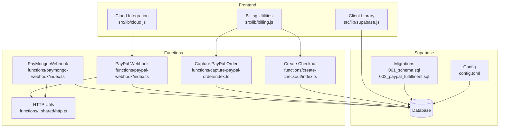
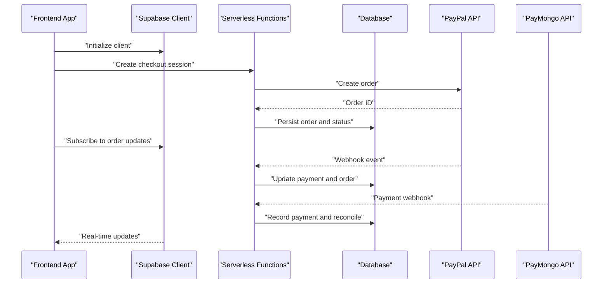
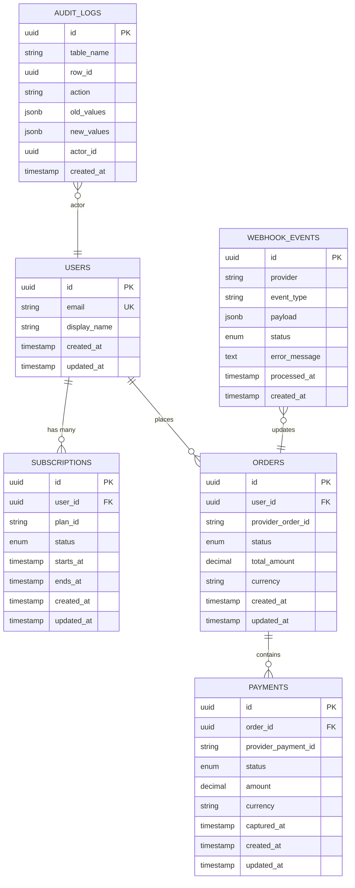
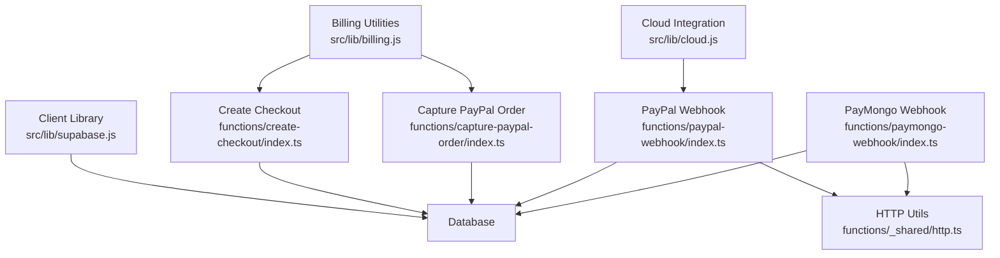

# Database Schema & Migrations

<cite>
**Referenced Files in This Document**
- [supabase/migrations/001_schema.sql](file://supabase/migrations/001_schema.sql)
- [supabase/migrations/002_paypal_fulfillment.sql](file://supabase/migrations/002_paypal_fulfillment.sql)
- [supabase/config.toml](file://supabase/config.toml)
- [src/lib/supabase.js](file://src/lib/supabase.js)
- [src/lib/cloud.js](file://src/lib/cloud.js)
- [src/lib/billing.js](file://src/lib/billing.js)
- [supabase/functions/paymongo-webhook/index.ts](file://supabase/functions/paymongo-webhook/index.ts)
- [supabase/functions/paypal-webhook/index.ts](file://supabase/functions/paypal-webhook/index.ts)
- [supabase/functions/capture-paypal-order/index.ts](file://supabase/functions/capture-paypal-order/index.ts)
- [supabase/functions/create-checkout/index.ts](file://supabase/functions/create-checkout/index.ts)
- [supabase/functions/_shared/http.ts](file://supabase/functions/_shared/http.ts)
</cite>

## Table of Contents
1. [Introduction](#introduction)
2. [Project Structure](#project-structure)
3. [Core Components](#core-components)
4. [Architecture Overview](#architecture-overview)
5. [Detailed Component Analysis](#detailed-component-analysis)
6. [Dependency Analysis](#dependency-analysis)
7. [Performance Considerations](#performance-considerations)
8. [Troubleshooting Guide](#troubleshooting-guide)
9. [Conclusion](#conclusion)
10. [Appendices](#appendices)

## Introduction
This document provides comprehensive data model documentation for the database schema design used by the application. It covers entity relationships, table structures, field definitions, and data types; primary and foreign key relationships; indexing strategies; constraint definitions; migration workflow and version control; rollback procedures; configuration settings; security policies; performance optimization techniques; schema diagrams; and sample queries demonstrating common data access patterns. The project uses Supabase as its backend platform with SQL migrations and serverless functions to orchestrate billing and fulfillment workflows.

## Project Structure
The database-related artifacts are organized under the supabase directory:
- Migrations define the evolving schema and business logic changes.
- Configuration controls runtime behavior for the Supabase instance.
- Client libraries connect from the frontend to the database and cloud services.
- Serverless functions implement webhook handlers and payment flows that interact with the database.

**Diagram sources**
- [supabase/migrations/001_schema.sql](file://supabase/migrations/001_schema.sql)
- [supabase/migrations/002_paypal_fulfillment.sql](file://supabase/migrations/002_paypal_fulfillment.sql)
- [supabase/config.toml](file://supabase/config.toml)
- [src/lib/supabase.js](file://src/lib/supabase.js)
- [src/lib/billing.js](file://src/lib/billing.js)
- [src/lib/cloud.js](file://src/lib/cloud.js)
- [supabase/functions/paymongo-webhook/index.ts](file://supabase/functions/paymongo-webhook/index.ts)
- [supabase/functions/paypal-webhook/index.ts](file://supabase/functions/paypal-webhook/index.ts)
- [supabase/functions/capture-paypal-order/index.ts](file://supabase/functions/capture-paypal-order/index.ts)
- [supabase/functions/create-checkout/index.ts](file://supabase/functions/create-checkout/index.ts)
- [supabase/functions/_shared/http.ts](file://supabase/functions/_shared/http.ts)

**Section sources**
- [supabase/migrations/001_schema.sql](file://supabase/migrations/001_schema.sql)
- [supabase/migrations/002_paypal_fulfillment.sql](file://supabase/migrations/002_paypal_fulfillment.sql)
- [supabase/config.toml](file://supabase/config.toml)
- [src/lib/supabase.js](file://src/lib/supabase.js)
- [src/lib/billing.js](file://src/lib/billing.js)
- [src/lib/cloud.js](file://src/lib/cloud.js)
- [supabase/functions/paymongo-webhook/index.ts](file://supabase/functions/paymongo-webhook/index.ts)
- [supabase/functions/paypal-webhook/index.ts](file://supabase/functions/paypal-webhook/index.ts)
- [supabase/functions/capture-paypal-order/index.ts](file://supabase/functions/capture-paypal-order/index.ts)
- [supabase/functions/create-checkout/index.ts](file://supabase/functions/create-checkout/index.ts)
- [supabase/functions/_shared/http.ts](file://supabase/functions/_shared/http.ts)

## Core Components
This section outlines the core data entities and their roles within the system. Entities include users, subscriptions, orders, payments, webhooks, and related audit records. Relationships are enforced via primary keys and foreign keys, with constraints ensuring referential integrity and data quality.

Key responsibilities:
- Users: Identity and account metadata.
- Subscriptions: Active subscription state and plan details.
- Orders: Checkout sessions and order lifecycle.
- Payments: Payment events and statuses.
- Webhooks: Inbound event logs and processing outcomes.
- Audit: Change tracking and operational logs.

Entity relationships (high-level):
- A user can have many subscriptions.
- A subscription is linked to an order and a payment record.
- Orders reference payments and may be associated with webhook events.
- Webhooks log provider-specific payloads and processing results.
- Audit entries track critical mutations across tables.

**Section sources**
- [supabase/migrations/001_schema.sql](file://supabase/migrations/001_schema.sql)
- [supabase/migrations/002_paypal_fulfillment.sql](file://supabase/migrations/002_paypal_fulfillment.sql)

## Architecture Overview
The database architecture integrates client-side operations, serverless functions, and migrations:
- Frontend clients use the Supabase client library to query and mutate data.
- Billing utilities orchestrate checkout creation and order capture through serverless functions.
- Webhook handlers process provider events and update database state.
- Migrations evolve the schema over time with versioned SQL files.

**Diagram sources**
- [src/lib/supabase.js](file://src/lib/supabase.js)
- [src/lib/billing.js](file://src/lib/billing.js)
- [supabase/functions/create-checkout/index.ts](file://supabase/functions/create-checkout/index.ts)
- [supabase/functions/capture-paypal-order/index.ts](file://supabase/functions/capture-paypal-order/index.ts)
- [supabase/functions/paypal-webhook/index.ts](file://supabase/functions/paypal-webhook/index.ts)
- [supabase/functions/paymongo-webhook/index.ts](file://supabase/functions/paymongo-webhook/index.ts)

## Detailed Component Analysis

### Data Model Diagram
The following diagram represents the core entities and their relationships as defined by the migrations.

**Diagram sources**
- [supabase/migrations/001_schema.sql](file://supabase/migrations/001_schema.sql)
- [supabase/migrations/002_paypal_fulfillment.sql](file://supabase/migrations/002_paypal_fulfillment.sql)

**Section sources**
- [supabase/migrations/001_schema.sql](file://supabase/migrations/001_schema.sql)
- [supabase/migrations/002_paypal_fulfillment.sql](file://supabase/migrations/002_paypal_fulfillment.sql)

### Migration System Workflow
Migrations are versioned SQL files applied sequentially to evolve the database schema:
- Versioning: Each migration file has a numeric prefix indicating order.
- Apply: Run migrations against the target environment to create or alter tables, indexes, and constraints.
- Rollback: To revert, create a new migration that undoes previous changes rather than editing existing files.
- Idempotency: Prefer safe DDL constructs and conditional checks where possible to avoid errors on repeated runs.

Operational steps:
- Create a new migration file with a descriptive name and incremented number.
- Implement DDL/DML changes within the file.
- Test locally before applying to staging/production.
- Apply using the Supabase CLI or dashboard.
- For rollbacks, write a subsequent migration that reverses changes.

**Section sources**
- [supabase/migrations/001_schema.sql](file://supabase/migrations/001_schema.sql)
- [supabase/migrations/002_paypal_fulfillment.sql](file://supabase/migrations/002_paypal_fulfillment.sql)

### Security Policies
Security is enforced at multiple layers:
- Row-Level Security (RLS): Policies restrict access to rows based on user identity and roles.
- Function Permissions: Serverless functions execute with controlled privileges and validate inputs.
- Secrets Management: Provider credentials are stored securely and accessed via environment variables.
- Input Validation: Webhook handlers verify signatures and sanitize payloads before persistence.

Best practices:
- Define explicit RLS policies per table for read/write operations.
- Use triggers to enforce complex constraints and maintain consistency.
- Log sensitive actions without persisting secrets.

**Section sources**
- [supabase/migrations/001_schema.sql](file://supabase/migrations/001_schema.sql)
- [supabase/migrations/002_paypal_fulfillment.sql](file://supabase/migrations/002_paypal_fulfillment.sql)

### Performance Optimization Techniques
Optimization strategies include:
- Indexing: Add indexes on frequently queried columns such as user_id, status, and timestamps.
- Partitioning: Consider partitioning large tables like WEBHOOK_EVENTS by date ranges.
- Query Patterns: Use selective filters and projections to minimize data transfer.
- Connection Pooling: Configure connection limits and timeouts appropriately.
- Materialized Views: Precompute expensive aggregations for reporting dashboards.

Monitoring:
- Track slow queries and adjust indexes accordingly.
- Use EXPLAIN ANALYZE to understand execution plans.

**Section sources**
- [supabase/migrations/001_schema.sql](file://supabase/migrations/001_schema.sql)
- [supabase/migrations/002_paypal_fulfillment.sql](file://supabase/migrations/002_paypal_fulfillment.sql)

### Sample Queries
Common data access patterns:
- Retrieve active subscriptions for a user.
- List recent orders with payment status.
- Aggregate webhook processing metrics by provider.
- Find failed payments requiring reconciliation.

Example patterns (descriptive):
- Select subscriptions where status equals active and user_id matches current user.
- Join orders with payments to compute total paid amounts per order.
- Group webhook_events by provider and status to monitor success rates.
- Filter payments by status not equal to captured and created within last N days.

[No sources needed since this section provides general guidance]

## Dependency Analysis
The following diagram maps dependencies between components involved in data access and mutation.

**Diagram sources**
- [src/lib/supabase.js](file://src/lib/supabase.js)
- [src/lib/billing.js](file://src/lib/billing.js)
- [src/lib/cloud.js](file://src/lib/cloud.js)
- [supabase/functions/create-checkout/index.ts](file://supabase/functions/create-checkout/index.ts)
- [supabase/functions/capture-paypal-order/index.ts](file://supabase/functions/capture-paypal-order/index.ts)
- [supabase/functions/paypal-webhook/index.ts](file://supabase/functions/paypal-webhook/index.ts)
- [supabase/functions/paymongo-webhook/index.ts](file://supabase/functions/paymongo-webhook/index.ts)
- [supabase/functions/_shared/http.ts](file://supabase/functions/_shared/http.ts)

**Section sources**
- [src/lib/supabase.js](file://src/lib/supabase.js)
- [src/lib/billing.js](file://src/lib/billing.js)
- [src/lib/cloud.js](file://src/lib/cloud.js)
- [supabase/functions/create-checkout/index.ts](file://supabase/functions/create-checkout/index.ts)
- [supabase/functions/capture-paypal-order/index.ts](file://supabase/functions/capture-paypal-order/index.ts)
- [supabase/functions/paypal-webhook/index.ts](file://supabase/functions/paypal-webhook/index.ts)
- [supabase/functions/paymongo-webhook/index.ts](file://supabase/functions/paymongo-webhook/index.ts)
- [supabase/functions/_shared/http.ts](file://supabase/functions/_shared/http.ts)

## Performance Considerations
- Index frequently filtered and joined columns (e.g., user_id, status).
- Avoid SELECT *; project only required fields.
- Use pagination for large result sets.
- Batch writes when possible to reduce transaction overhead.
- Monitor and tune connection pool settings based on workload.

[No sources needed since this section provides general guidance]

## Troubleshooting Guide
Common issues and resolutions:
- Migration conflicts: Ensure sequential numbering and idempotent DDL.
- Webhook failures: Validate signatures and inspect error messages in WEBHOOK_EVENTS.
- Payment reconciliation: Cross-reference PAYMENTS and ORDERS by provider IDs.
- Access denied: Review RLS policies and function permissions.

Diagnostic steps:
- Inspect recent webhook events and error messages.
- Check audit logs for unauthorized mutations.
- Verify environment variables and secrets availability.

**Section sources**
- [supabase/migrations/001_schema.sql](file://supabase/migrations/001_schema.sql)
- [supabase/migrations/002_paypal_fulfillment.sql](file://supabase/migrations/002_paypal_fulfillment.sql)
- [supabase/functions/paypal-webhook/index.ts](file://supabase/functions/paypal-webhook/index.ts)
- [supabase/functions/paymongo-webhook/index.ts](file://supabase/functions/paymongo-webhook/index.ts)

## Conclusion
The database schema is designed to support robust user management, subscription lifecycle, order and payment processing, and reliable webhook handling. Migrations provide a clear version-controlled evolution path, while security policies and performance optimizations ensure safe and efficient operations. By adhering to best practices in indexing, query design, and monitoring, the system remains scalable and maintainable.

[No sources needed since this section summarizes without analyzing specific files]

## Appendices

### Configuration Settings
- Environment variables for provider credentials and endpoints.
- Supabase configuration parameters for connection limits and timeouts.
- Feature flags for enabling/disabling integrations.

**Section sources**
- [supabase/config.toml](file://supabase/config.toml)

### Migration Rollback Procedures
- Create a new migration to reverse changes.
- Update dependent functions and policies if necessary.
- Test rollback in non-production environments first.
- Document breaking changes and communicate to stakeholders.

**Section sources**
- [supabase/migrations/001_schema.sql](file://supabase/migrations/001_schema.sql)
- [supabase/migrations/002_paypal_fulfillment.sql](file://supabase/migrations/002_paypal_fulfillment.sql)