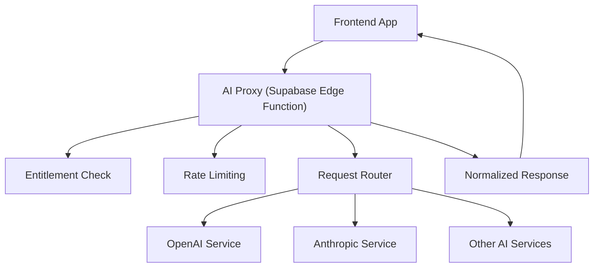
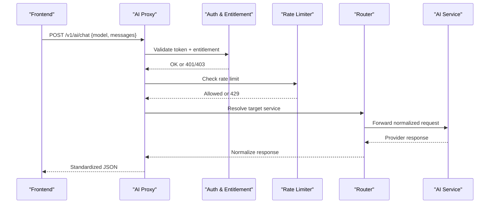
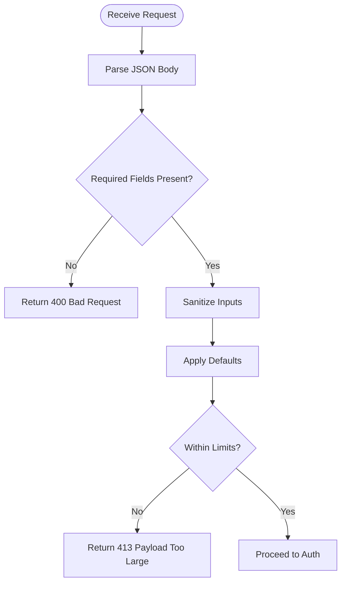
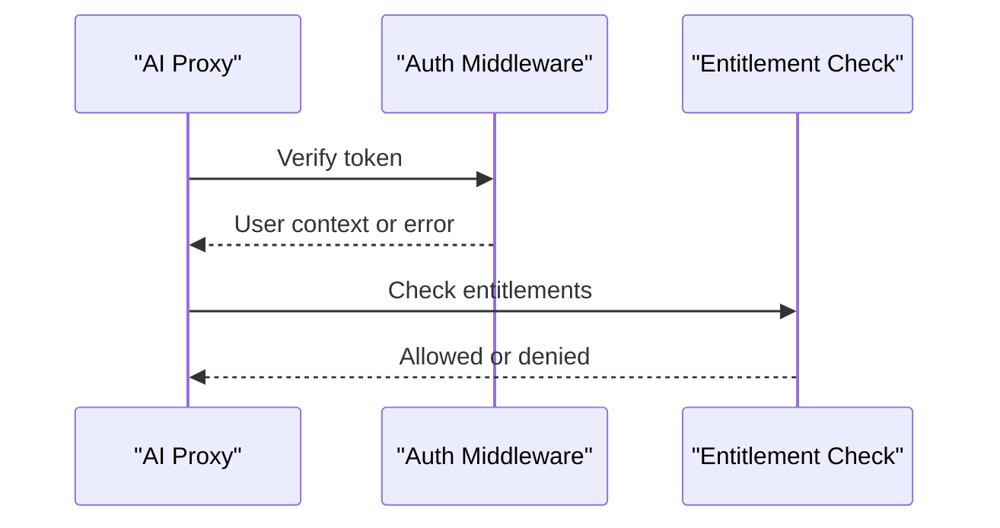
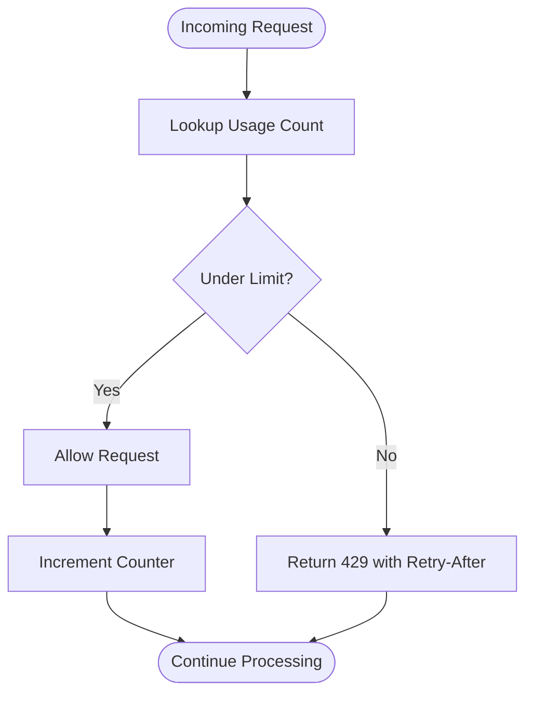
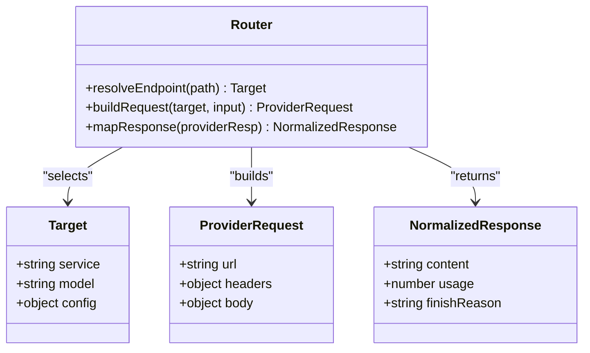
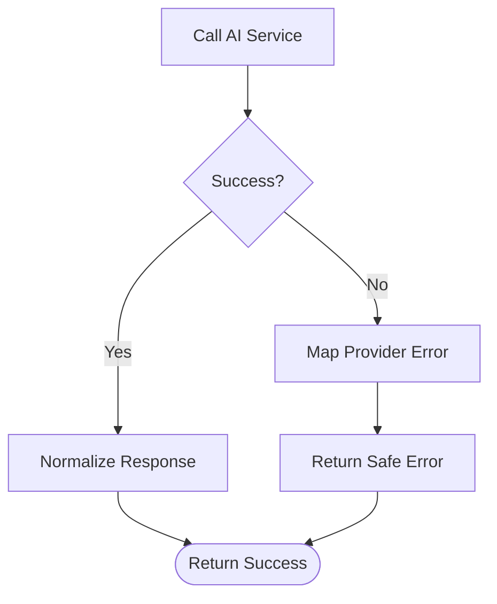
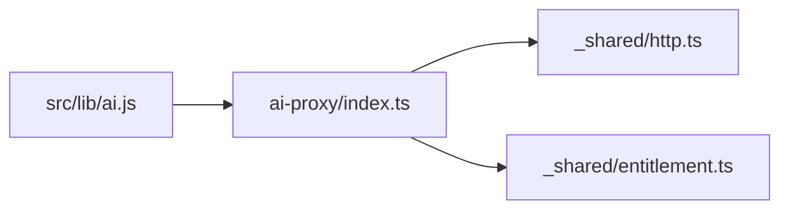

# AI Proxy Function

<cite>
**Referenced Files in This Document**
- [index.ts](file://supabase/functions/ai-proxy/index.ts)
- [ai.js](file://src/lib/ai.js)
- [http.ts](file://supabase/functions/_shared/http.ts)
- [entitlement.ts](file://supabase/functions/_shared/entitlement.ts)
</cite>

## Table of Contents
1. [Introduction](#introduction)
2. [Project Structure](#project-structure)
3. [Core Components](#core-components)
4. [Architecture Overview](#architecture-overview)
5. [Detailed Component Analysis](#detailed-component-analysis)
6. [Dependency Analysis](#dependency-analysis)
7. [Performance Considerations](#performance-considerations)
8. [Troubleshooting Guide](#troubleshooting-guide)
9. [Conclusion](#conclusion)

## Introduction
The AI Proxy is a secure intermediary between the frontend and external AI services. It centralizes authentication validation, request routing, rate limiting, error propagation, and API key management. The proxy exposes a single endpoint that accepts client requests, validates them, forwards them to the appropriate AI provider, and returns normalized responses back to the caller.

## Project Structure
The AI proxy is implemented as a Supabase Edge Function. The relevant files include:
- The proxy entrypoint under supabase/functions/ai-proxy
- Shared HTTP utilities and entitlement checks under supabase/functions/_shared
- Frontend integration helpers under src/lib/ai.js

[No sources needed since this diagram shows conceptual workflow, not actual code structure]

## Core Components
- Request intake and normalization: parses incoming requests, validates required fields, and normalizes payloads before routing.
- Authentication and authorization: verifies user identity and entitlements before allowing proxy usage.
- Routing: maps logical endpoints to specific AI providers and their APIs.
- Security controls: enforces rate limits and manages secrets such as API keys.
- Error handling: standardizes errors and propagates meaningful messages to clients.
- Response shaping: transforms provider-specific responses into a consistent schema for the frontend.

**Section sources**
- [index.ts:1-200](file://supabase/functions/ai-proxy/index.ts#L1-L200)
- [http.ts:1-200](file://supabase/functions/_shared/http.ts#L1-L200)
- [entitlement.ts:1-200](file://supabase/functions/_shared/entitlement.ts#L1-L200)
- [ai.js:1-200](file://src/lib/ai.js#L1-L200)

## Architecture Overview
The proxy follows a layered approach:
- Ingress layer: receives HTTP requests, performs basic validation.
- Security layer: validates auth tokens and entitlements; applies rate limiting.
- Routing layer: selects target AI service and constructs provider-specific requests.
- Egress layer: calls the selected AI service, handles timeouts and retries.
- Response layer: normalizes responses and returns consistent JSON to the client.

**Diagram sources**
- [index.ts:1-200](file://supabase/functions/ai-proxy/index.ts#L1-L200)
- [http.ts:1-200](file://supabase/functions/_shared/http.ts#L1-L200)
- [entitlement.ts:1-200](file://supabase/functions/_shared/entitlement.ts#L1-L200)

## Detailed Component Analysis

### Request Intake and Normalization
- Accepts JSON bodies with model selection, message history, and optional parameters.
- Validates presence and types of required fields.
- Sanitizes inputs and sets defaults for missing optional fields.
- Enforces maximum payload sizes and message counts.

**Diagram sources**
- [index.ts:1-200](file://supabase/functions/ai-proxy/index.ts#L1-L200)

**Section sources**
- [index.ts:1-200](file://supabase/functions/ai-proxy/index.ts#L1-L200)

### Authentication and Authorization
- Verifies Supabase session or JWT to identify the caller.
- Checks entitlements to ensure the user has access to AI features.
- Rejects unauthenticated or unauthorized requests early.

**Diagram sources**
- [index.ts:1-200](file://supabase/functions/ai-proxy/index.ts#L1-L200)
- [entitlement.ts:1-200](file://supabase/functions/_shared/entitlement.ts#L1-L200)

**Section sources**
- [index.ts:1-200](file://supabase/functions/ai-proxy/index.ts#L1-L200)
- [entitlement.ts:1-200](file://supabase/functions/_shared/entitlement.ts#L1-L200)

### Rate Limiting
- Applies per-user or per-token rate limits using a shared store or edge cache.
- Returns 429 when limits are exceeded, including retry-after guidance.
- Configurable windows and quotas per plan tier.

**Diagram sources**
- [index.ts:1-200](file://supabase/functions/ai-proxy/index.ts#L1-L200)
- [http.ts:1-200](file://supabase/functions/_shared/http.ts#L1-L200)

**Section sources**
- [index.ts:1-200](file://supabase/functions/ai-proxy/index.ts#L1-L200)
- [http.ts:1-200](file://supabase/functions/_shared/http.ts#L1-L200)

### Request Routing
- Maps logical endpoints to provider-specific implementations.
- Supports multiple models and services via configuration.
- Builds provider-specific headers, body, and query parameters.

**Diagram sources**
- [index.ts:1-200](file://supabase/functions/ai-proxy/index.ts#L1-L200)

**Section sources**
- [index.ts:1-200](file://supabase/functions/ai-proxy/index.ts#L1-L200)

### Security Controls and API Key Management
- Loads provider API keys from environment variables or secret stores.
- Never exposes keys to the client; only used server-side.
- Rotates keys safely without downtime.

Best practices:
- Store keys in environment variables or a secrets manager.
- Use least-privilege scopes where applicable.
- Log only non-sensitive metadata.

**Section sources**
- [index.ts:1-200](file://supabase/functions/ai-proxy/index.ts#L1-L200)

### Error Handling and Propagation
- Catches network and parsing errors from AI services.
- Translates provider errors into standardized codes and messages.
- Ensures safe error responses without leaking internal details.

**Diagram sources**
- [index.ts:1-200](file://supabase/functions/ai-proxy/index.ts#L1-L200)

**Section sources**
- [index.ts:1-200](file://supabase/functions/ai-proxy/index.ts#L1-L200)

### Timeout Configuration
- Enforces per-request timeouts to prevent hanging calls.
- Uses configurable timeout values per provider/model.
- Returns clear timeout errors to clients.

**Section sources**
- [index.ts:1-200](file://supabase/functions/ai-proxy/index.ts#L1-L200)

### Supported Endpoints and Schemas
- Endpoint: POST /v1/ai/chat
- Request schema:
  - model: string (required)
  - messages: array of message objects (required)
  - max_tokens: number (optional)
  - temperature: number (optional)
  - top_p: number (optional)
  - stop: string[] (optional)
- Response schema:
  - content: string
  - usage: object with token counts
  - finish_reason: string
  - id: string
  - created_at: timestamp

Notes:
- Message objects typically include role and content fields.
- Optional parameters map to provider equivalents.

**Section sources**
- [index.ts:1-200](file://supabase/functions/ai-proxy/index.ts#L1-L200)

### Frontend Integration Examples
- Invoke the proxy using the SDK or fetch wrapper.
- Handle success and error branches.
- Display streaming or non-streaming results consistently.

For concrete examples, refer to:
- [ai.js:1-200](file://src/lib/ai.js#L1-L200)

**Section sources**
- [ai.js:1-200](file://src/lib/ai.js#L1-L200)

## Dependency Analysis
The proxy depends on shared utilities for HTTP operations and entitlement checks.

**Diagram sources**
- [index.ts:1-200](file://supabase/functions/ai-proxy/index.ts#L1-L200)
- [http.ts:1-200](file://supabase/functions/_shared/http.ts#L1-L200)
- [entitlement.ts:1-200](file://supabase/functions/_shared/entitlement.ts#L1-L200)
- [ai.js:1-200](file://src/lib/ai.js#L1-L200)

**Section sources**
- [index.ts:1-200](file://supabase/functions/ai-proxy/index.ts#L1-L200)
- [http.ts:1-200](file://supabase/functions/_shared/http.ts#L1-L200)
- [entitlement.ts:1-200](file://supabase/functions/_shared/entitlement.ts#L1-L200)
- [ai.js:1-200](file://src/lib/ai.js#L1-L200)

## Performance Considerations
- Keep payloads small; trim conversation history if needed.
- Use streaming responses for long outputs to improve perceived latency.
- Cache frequent prompts or embeddings where appropriate.
- Tune timeouts and concurrency per provider limits.
- Monitor usage metrics and adjust rate limits dynamically.

[No sources needed since this section provides general guidance]

## Troubleshooting Guide
Common issues and resolutions:
- 401 Unauthorized: Ensure valid session token is attached.
- 403 Forbidden: Confirm entitlements allow AI usage.
- 429 Too Many Requests: Back off and retry after the suggested interval.
- 400 Bad Request: Validate required fields and value ranges.
- 413 Payload Too Large: Reduce message count or length.
- 504 Gateway Timeout: Increase timeout or reduce complexity.

Logging and diagnostics:
- Enable structured logs for request IDs, model, and timing.
- Avoid logging sensitive data like API keys or full prompts.

**Section sources**
- [index.ts:1-200](file://supabase/functions/ai-proxy/index.ts#L1-L200)
- [http.ts:1-200](file://supabase/functions/_shared/http.ts#L1-L200)

## Conclusion
The AI Proxy centralizes security, routing, and reliability concerns for AI integrations. By validating users, enforcing rate limits, managing secrets, and normalizing responses, it provides a stable interface for the frontend while abstracting provider differences. Follow the schemas and best practices outlined here to integrate securely and efficiently.