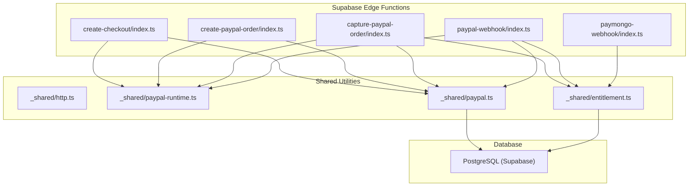
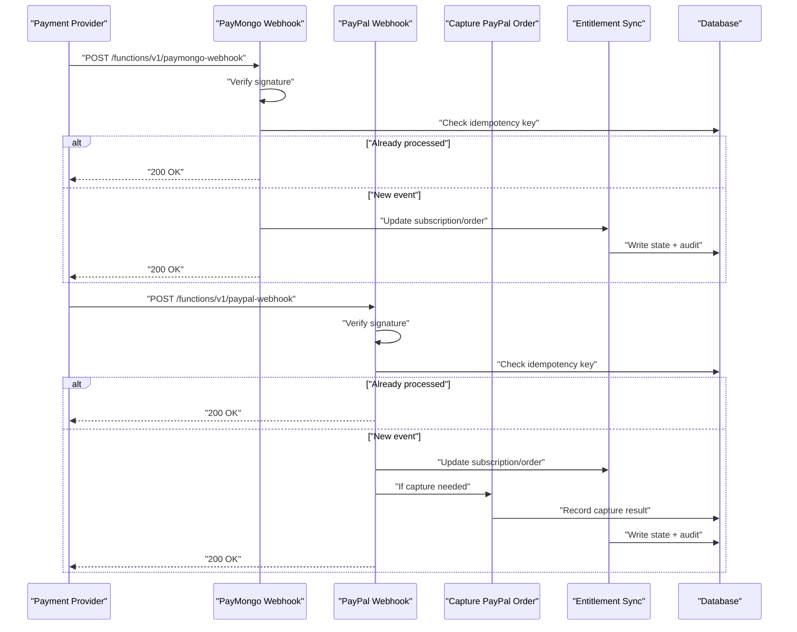
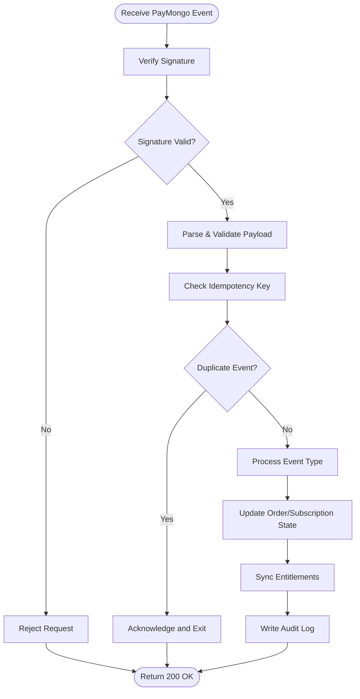
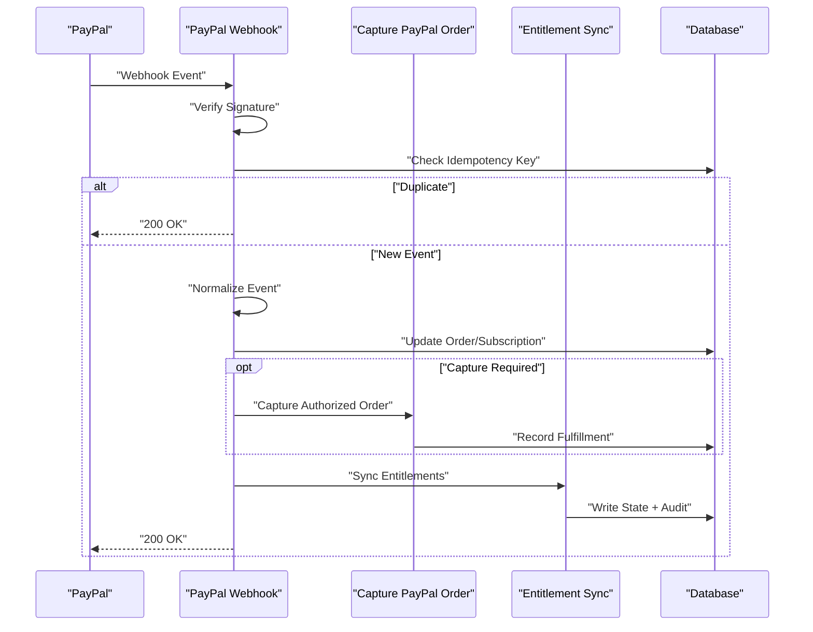
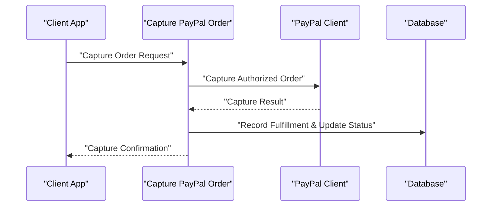
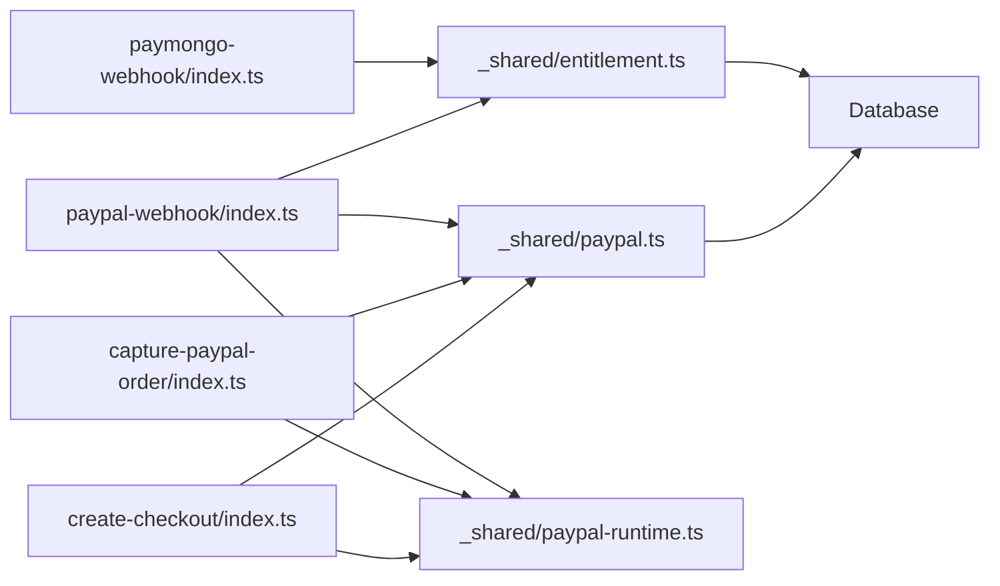

# Billing Webhook Handlers

<cite>
**Referenced Files in This Document**
- [paymongo-webhook/index.ts](file://supabase/functions/paymongo-webhook/index.ts)
- [paypal-webhook/index.ts](file://supabase/functions/paypal-webhook/index.ts)
- [capture-paypal-order/index.ts](file://supabase/functions/capture-paypal-order/index.ts)
- [create-paypal-order/index.ts](file://supabase/functions/create-paypal-order/index.ts)
- [create-checkout/index.ts](file://supabase/functions/create-checkout/index.ts)
- [_shared/http.ts](file://supabase/functions/_shared/http.ts)
- [_shared/paypal-runtime.ts](file://supabase/functions/_shared/paypal-runtime.ts)
- [_shared/paypal.ts](file://supabase/functions/_shared/paypal.ts)
- [_shared/entitlement.ts](file://supabase/functions/_shared/entitlement.ts)
- [migrations/001_schema.sql](file://supabase/migrations/001_schema.sql)
- [migrations/002_paypal_fulfillment.sql](file://supabase/migrations/002_paypal_fulfillment.sql)
</cite>

## Table of Contents
1. [Introduction](#introduction)
2. [Project Structure](#project-structure)
3. [Core Components](#core-components)
4. [Architecture Overview](#architecture-overview)
5. [Detailed Component Analysis](#detailed-component-analysis)
6. [Dependency Analysis](#dependency-analysis)
7. [Performance Considerations](#performance-considerations)
8. [Troubleshooting Guide](#troubleshooting-guide)
9. [Conclusion](#conclusion)
10. [Appendices](#appendices)

## Introduction
This document provides comprehensive documentation for billing webhook handlers covering PayMongo and PayPal integrations. It explains webhook signature verification, event processing workflows, subscription lifecycle management, order capture processes, payment confirmation handling, error recovery mechanisms, idempotency, retry logic, security considerations, database synchronization patterns, and example payload structures and status updates.

## Project Structure
The billing webhooks are implemented as Supabase Edge Functions with shared utilities for HTTP handling and PayPal SDK integration. Database schema changes related to billing and fulfillment are defined in migrations.

**Diagram sources**
- [paymongo-webhook/index.ts](file://supabase/functions/paymongo-webhook/index.ts)
- [paypal-webhook/index.ts](file://supabase/functions/paypal-webhook/index.ts)
- [capture-paypal-order/index.ts](file://supabase/functions/capture-paypal-order/index.ts)
- [create-paypal-order/index.ts](file://supabase/functions/create-paypal-order/index.ts)
- [create-checkout/index.ts](file://supabase/functions/create-checkout/index.ts)
- [_shared/http.ts](file://supabase/functions/_shared/http.ts)
- [_shared/paypal-runtime.ts](file://supabase/functions/_shared/paypal-runtime.ts)
- [_shared/paypal.ts](file://supabase/functions/_shared/paypal.ts)
- [_shared/entitlement.ts](file://supabase/functions/_shared/entitlement.ts)
- [migrations/001_schema.sql](file://supabase/migrations/001_schema.sql)
- [migrations/002_paypal_fulfillment.sql](file://supabase/migrations/002_paypal_fulfillment.sql)

**Section sources**
- [paymongo-webhook/index.ts](file://supabase/functions/paymongo-webhook/index.ts)
- [paypal-webhook/index.ts](file://supabase/functions/paypal-webhook/index.ts)
- [capture-paypal-order/index.ts](file://supabase/functions/capture-paypal-order/index.ts)
- [create-paypal-order/index.ts](file://supabase/functions/create-paypal-order/index.ts)
- [create-checkout/index.ts](file://supabase/functions/create-checkout/index.ts)
- [_shared/http.ts](file://supabase/functions/_shared/http.ts)
- [_shared/paypal-runtime.ts](file://supabase/functions/_shared/paypal-runtime.ts)
- [_shared/paypal.ts](file://supabase/functions/_shared/paypal.ts)
- [_shared/entitlement.ts](file://supabase/functions/_shared/entitlement.ts)
- [migrations/001_schema.sql](file://supabase/migrations/001_schema.sql)
- [migrations/002_paypal_fulfillment.sql](file://supabase/migrations/002_paypal_fulfillment.sql)

## Core Components
- PayMongo Webhook Handler: Receives PayMongo events, verifies signatures, validates payloads, enforces idempotency, updates subscription and order state, and synchronizes entitlements.
- PayPal Webhook Handler: Receives PayPal events, verifies signatures, normalizes events, enforces idempotency, updates orders/subscriptions, captures payments when required, and synchronizes entitlements.
- PayPal Order Capture: Captures an authorized PayPal order and records fulfillment details.
- Shared Utilities:
  - HTTP helpers for request/response handling and logging.
  - PayPal runtime and client wrappers for API calls.
  - Entitlement synchronization module for granting access based on successful payments or subscriptions.
- Database Migrations: Define tables and indexes for orders, subscriptions, fulfillment records, and audit logs.

Key responsibilities:
- Signature verification using provider-specific headers and secrets.
- Idempotent processing keyed by provider event IDs.
- Robust error handling with safe retries and dead-lettering where applicable.
- Consistent database state transitions and auditability.

**Section sources**
- [paymongo-webhook/index.ts](file://supabase/functions/paymongo-webhook/index.ts)
- [paypal-webhook/index.ts](file://supabase/functions/paypal-webhook/index.ts)
- [capture-paypal-order/index.ts](file://supabase/functions/capture-paypal-order/index.ts)
- [_shared/http.ts](file://supabase/functions/_shared/http.ts)
- [_shared/paypal-runtime.ts](file://supabase/functions/_shared/paypal-runtime.ts)
- [_shared/paypal.ts](file://supabase/functions/_shared/paypal.ts)
- [_shared/entitlement.ts](file://supabase/functions/_shared/entitlement.ts)
- [migrations/001_schema.sql](file://supabase/migrations/001_schema.sql)
- [migrations/002_paypal_fulfillment.sql](file://supabase/migrations/002_paypal_fulfillment.sql)

## Architecture Overview
The system follows a clear separation between inbound webhook endpoints, shared business logic, and data persistence.

**Diagram sources**
- [paymongo-webhook/index.ts](file://supabase/functions/paymongo-webhook/index.ts)
- [paypal-webhook/index.ts](file://supabase/functions/paypal-webhook/index.ts)
- [capture-paypal-order/index.ts](file://supabase/functions/capture-paypal-order/index.ts)
- [_shared/entitlement.ts](file://supabase/functions/_shared/entitlement.ts)
- [migrations/001_schema.sql](file://supabase/migrations/001_schema.sql)
- [migrations/002_paypal_fulfillment.sql](file://supabase/migrations/002_paypal_fulfillment.sql)

## Detailed Component Analysis

### PayMongo Webhook Handler
Responsibilities:
- Verify PayMongo webhook signature using the configured secret and request headers.
- Parse and validate the incoming event payload.
- Enforce idempotency using the provider event ID.
- Update subscription and order records according to event type.
- Synchronize user entitlements upon successful payment or subscription activation.
- Return appropriate HTTP responses and log outcomes.

Security and validation:
- Signature verification ensures the request originates from PayMongo and has not been tampered with.
- Payload validation checks required fields and expected values before processing.

Idempotency:
- Uses a unique key derived from the provider event ID to prevent duplicate processing.
- Stores processed event keys in the database to detect duplicates.

State transitions:
- Updates order and subscription statuses consistently.
- Records audit entries for traceability.

Error handling and retries:
- Returns non-2xx only for unrecoverable errors; transient failures rely on provider retry policies.
- Logs detailed context for debugging.

**Diagram sources**
- [paymongo-webhook/index.ts](file://supabase/functions/paymongo-webhook/index.ts)
- [_shared/entitlement.ts](file://supabase/functions/_shared/entitlement.ts)
- [migrations/001_schema.sql](file://supabase/migrations/001_schema.sql)

**Section sources**
- [paymongo-webhook/index.ts](file://supabase/functions/paymongo-webhook/index.ts)
- [_shared/entitlement.ts](file://supabase/functions/_shared/entitlement.ts)
- [migrations/001_schema.sql](file://supabase/migrations/001_schema.sql)

### PayPal Webhook Handler
Responsibilities:
- Verify PayPal webhook signature using the configured secret and request headers.
- Normalize PayPal events into internal representations.
- Enforce idempotency using the provider event ID.
- Update orders and subscriptions based on event types (e.g., payment completed, refunded).
- Trigger order capture when necessary.
- Synchronize user entitlements upon successful payment or subscription activation.
- Return appropriate HTTP responses and log outcomes.

Security and validation:
- Signature verification ensures authenticity and integrity of the webhook.
- Payload validation checks required fields and event consistency.

Order capture workflow:
- For authorizations requiring explicit capture, the handler invokes the capture endpoint.
- The capture endpoint confirms success and records fulfillment details.

Idempotency:
- Uses a unique key derived from the provider event ID to prevent duplicate processing.
- Stores processed event keys in the database to detect duplicates.

State transitions:
- Updates order and subscription statuses consistently.
- Records audit entries for traceability.

Error handling and retries:
- Returns non-2xx only for unrecoverable errors; transient failures rely on provider retry policies.
- Logs detailed context for debugging.

**Diagram sources**
- [paypal-webhook/index.ts](file://supabase/functions/paypal-webhook/index.ts)
- [capture-paypal-order/index.ts](file://supabase/functions/capture-paypal-order/index.ts)
- [_shared/entitlement.ts](file://supabase/functions/_shared/entitlement.ts)
- [migrations/001_schema.sql](file://supabase/migrations/001_schema.sql)
- [migrations/002_paypal_fulfillment.sql](file://supabase/migrations/002_paypal_fulfillment.sql)

**Section sources**
- [paypal-webhook/index.ts](file://supabase/functions/paypal-webhook/index.ts)
- [capture-paypal-order/index.ts](file://supabase/functions/capture-paypal-order/index.ts)
- [_shared/entitlement.ts](file://supabase/functions/_shared/entitlement.ts)
- [migrations/001_schema.sql](file://supabase/migrations/001_schema.sql)
- [migrations/002_paypal_fulfillment.sql](file://supabase/migrations/002_paypal_fulfillment.sql)

### PayPal Order Capture
Responsibilities:
- Accept a request to capture an authorized PayPal order.
- Call PayPal APIs to finalize the transaction.
- Record fulfillment details and update order status.
- Ensure idempotency via order ID and capture reference.

**Diagram sources**
- [capture-paypal-order/index.ts](file://supabase/functions/capture-paypal-order/index.ts)
- [_shared/paypal.ts](file://supabase/functions/_shared/paypal.ts)
- [_shared/paypal-runtime.ts](file://supabase/functions/_shared/paypal-runtime.ts)
- [migrations/002_paypal_fulfillment.sql](file://supabase/migrations/002_paypal_fulfillment.sql)

**Section sources**
- [capture-paypal-order/index.ts](file://supabase/functions/capture-paypal-order/index.ts)
- [_shared/paypal.ts](file://supabase/functions/_shared/paypal.ts)
- [_shared/paypal-runtime.ts](file://supabase/functions/_shared/paypal-runtime.ts)
- [migrations/002_paypal_fulfillment.sql](file://supabase/migrations/002_paypal_fulfillment.sql)

### Shared Utilities
- HTTP Helpers: Provide standardized request parsing, response formatting, and logging utilities used across functions.
- PayPal Runtime and Client: Encapsulate PayPal SDK initialization, configuration, and API calls for orders, captures, and webhooks.
- Entitlement Sync: Centralizes logic to grant or revoke user entitlements based on payment and subscription states.

**Section sources**
- [_shared/http.ts](file://supabase/functions/_shared/http.ts)
- [_shared/paypal-runtime.ts](file://supabase/functions/_shared/paypal-runtime.ts)
- [_shared/paypal.ts](file://supabase/functions/_shared/paypal.ts)
- [_shared/entitlement.ts](file://supabase/functions/_shared/entitlement.ts)

### Database Schema and Synchronization
Migrations define core entities and relationships for billing operations:
- Orders: Track payment intent, provider references, amounts, currency, and status.
- Subscriptions: Manage recurring billing, provider subscription IDs, plan identifiers, and lifecycle states.
- Fulfillment Records: Capture PayPal order captures and related metadata.
- Audit Logs: Record state transitions and webhook processing outcomes for traceability.

Synchronization patterns:
- On successful payment or subscription activation, entitlements are updated atomically with order/subscription state changes.
- Idempotency keys ensure that repeated webhook deliveries do not cause inconsistent state.

**Section sources**
- [migrations/001_schema.sql](file://supabase/migrations/001_schema.sql)
- [migrations/002_paypal_fulfillment.sql](file://supabase/migrations/002_paypal_fulfillment.sql)

## Dependency Analysis
The following diagram shows how webhook handlers depend on shared utilities and the database.

**Diagram sources**
- [paymongo-webhook/index.ts](file://supabase/functions/paymongo-webhook/index.ts)
- [paypal-webhook/index.ts](file://supabase/functions/paypal-webhook/index.ts)
- [capture-paypal-order/index.ts](file://supabase/functions/capture-paypal-order/index.ts)
- [create-checkout/index.ts](file://supabase/functions/create-checkout/index.ts)
- [_shared/http.ts](file://supabase/functions/_shared/http.ts)
- [_shared/paypal-runtime.ts](file://supabase/functions/_shared/paypal-runtime.ts)
- [_shared/paypal.ts](file://supabase/functions/_shared/paypal.ts)
- [_shared/entitlement.ts](file://supabase/functions/_shared/entitlement.ts)
- [migrations/001_schema.sql](file://supabase/migrations/001_schema.sql)
- [migrations/002_paypal_fulfillment.sql](file://supabase/migrations/002_paypal_fulfillment.sql)

**Section sources**
- [paymongo-webhook/index.ts](file://supabase/functions/paymongo-webhook/index.ts)
- [paypal-webhook/index.ts](file://supabase/functions/paypal-webhook/index.ts)
- [capture-paypal-order/index.ts](file://supabase/functions/capture-paypal-order/index.ts)
- [create-checkout/index.ts](file://supabase/functions/create-checkout/index.ts)
- [_shared/http.ts](file://supabase/functions/_shared/http.ts)
- [_shared/paypal-runtime.ts](file://supabase/functions/_shared/paypal-runtime.ts)
- [_shared/paypal.ts](file://supabase/functions/_shared/paypal.ts)
- [_shared/entitlement.ts](file://supabase/functions/_shared/entitlement.ts)
- [migrations/001_schema.sql](file://supabase/migrations/001_schema.sql)
- [migrations/002_paypal_fulfillment.sql](file://supabase/migrations/002_paypal_fulfillment.sql)

## Performance Considerations
- Keep webhook handlers fast and idempotent; avoid heavy computations inside the critical path.
- Use minimal database writes and batch operations where possible.
- Leverage provider retry policies; design handlers to be resilient to duplicates.
- Monitor latency and error rates; add structured logging for observability.

[No sources needed since this section provides general guidance]

## Troubleshooting Guide
Common issues and resolutions:
- Signature verification failures:
  - Ensure correct provider secrets are configured.
  - Verify that the correct headers are used for signature computation.
- Duplicate processing:
  - Confirm idempotency keys are stored and checked before processing.
- Inconsistent state:
  - Review audit logs to trace state transitions.
  - Re-run reconciliation jobs if necessary.
- PayPal capture failures:
  - Check authorization expiry and order status before capture.
  - Inspect capture results and update order status accordingly.

Operational tips:
- Enable detailed logging for all webhook events and outcomes.
- Implement alerting for failed webhooks and long-running requests.
- Periodically reconcile provider states with local database records.

**Section sources**
- [paymongo-webhook/index.ts](file://supabase/functions/paymongo-webhook/index.ts)
- [paypal-webhook/index.ts](file://supabase/functions/paypal-webhook/index.ts)
- [capture-paypal-order/index.ts](file://supabase/functions/capture-paypal-order/index.ts)
- [_shared/http.ts](file://supabase/functions/_shared/http.ts)
- [_shared/entitlement.ts](file://supabase/functions/_shared/entitlement.ts)

## Conclusion
The billing webhook handlers implement secure, idempotent, and resilient processing for PayMongo and PayPal events. They maintain consistent order and subscription states, synchronize entitlements promptly, and provide robust error handling and auditability. Following the recommended practices will help ensure reliable billing operations and smooth user experiences.

[No sources needed since this section summarizes without analyzing specific files]

## Appendices

### Example Webhook Payload Structures
- PayMongo:
  - Includes event type, resource identifiers, timestamps, and payment details.
  - Signature is provided via provider-specific headers.
- PayPal:
  - Includes event type, resource URLs, and nested resource objects.
  - Signature verification uses the configured secret and request headers.

Note: Refer to provider documentation for exact field names and formats.

[No sources needed since this section describes conceptual payload structures]

### Security Considerations
- Always verify webhook signatures before processing.
- Store provider secrets securely and restrict access.
- Validate and sanitize all inputs.
- Use HTTPS and enforce TLS for all communications.
- Limit permissions for database access and function execution roles.

[No sources needed since this section provides general guidance]

### Idempotency and Retry Logic
- Idempotency:
  - Deduplicate events using provider event IDs.
  - Persist processed keys to prevent reprocessing.
- Retry Logic:
  - Rely on provider retry policies for transient failures.
  - Avoid implementing custom exponential backoff within handlers; keep them deterministic and fast.

[No sources needed since this section provides general guidance]