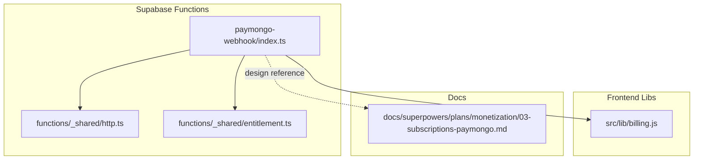
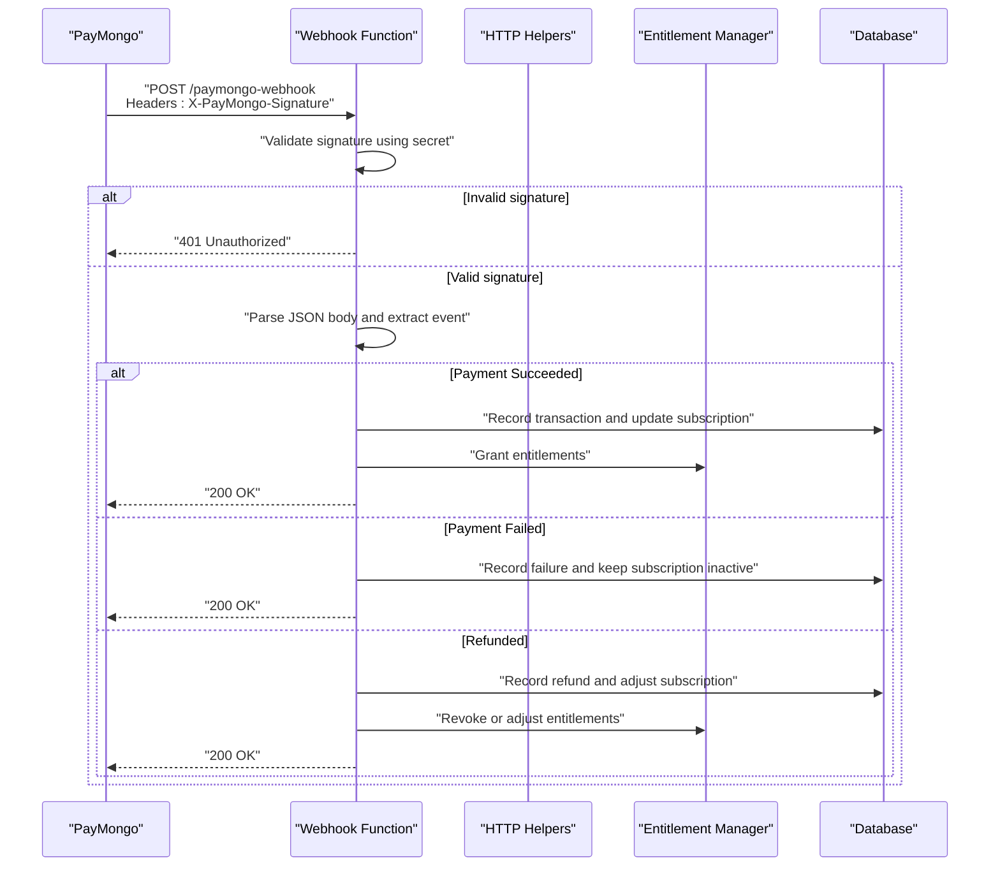
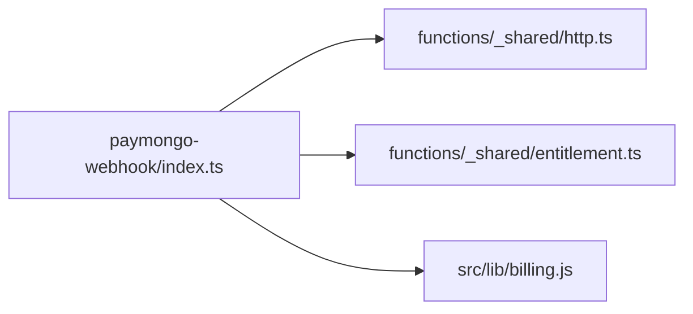

# PayMongo Webhook Handler

<cite>
**Referenced Files in This Document**
- [paymongo-webhook/index.ts](file://supabase/functions/paymongo-webhook/index.ts)
- [billing.js](file://src/lib/billing.js)
- [entitlement.ts](file://supabase/functions/_shared/entitlement.ts)
- [http.ts](file://supabase/functions/_shared/http.ts)
- [03-subscriptions-paymongo.md](file://docs/superpowers/plans/monetization/03-subscriptions-paymongo.md)
</cite>

## Table of Contents
1. [Introduction](#introduction)
2. [Project Structure](#project-structure)
3. [Core Components](#core-components)
4. [Architecture Overview](#architecture-overview)
5. [Detailed Component Analysis](#detailed-component-analysis)
6. [Dependency Analysis](#dependency-analysis)
7. [Performance Considerations](#performance-considerations)
8. [Troubleshooting Guide](#troubleshooting-guide)
9. [Conclusion](#conclusion)
10. [Appendices](#appendices)

## Introduction
This document explains the PayMongo webhook handler implementation, focusing on:
- Signature verification and request validation
- Event type processing for payment success, failure, and refund events
- Subscription status updates and entitlement synchronization
- Payload structures and database synchronization patterns
- Error handling strategies, idempotency, and retry mechanisms
- Security considerations for webhook endpoints

The goal is to provide both a high-level understanding and actionable details for developers integrating or maintaining PayMongo webhooks.

## Project Structure
The PayMongo webhook handler resides under Supabase Functions and integrates with shared utilities and billing logic. The relevant files include:
- The webhook endpoint implementation
- Shared HTTP helpers
- Entitlement management utilities
- Billing integration code used by the frontend and backend flows
- Design documentation describing subscription and PayMongo integration

**Diagram sources**
- [paymongo-webhook/index.ts](file://supabase/functions/paymongo-webhook/index.ts)
- [http.ts](file://supabase/functions/_shared/http.ts)
- [entitlement.ts](file://supabase/functions/_shared/entitlement.ts)
- [billing.js](file://src/lib/billing.js)
- [03-subscriptions-paymongo.md](file://docs/superpowers/plans/monetization/03-subscriptions-paymongo.md)

**Section sources**
- [paymongo-webhook/index.ts](file://supabase/functions/paymongo-webhook/index.ts)
- [http.ts](file://supabase/functions/_shared/http.ts)
- [entitlement.ts](file://supabase/functions/_shared/entitlement.ts)
- [billing.js](file://src/lib/billing.js)
- [03-subscriptions-paymongo.md](file://docs/superpowers/plans/monetization/03-subscriptions-paymongo.md)

## Core Components
- Webhook Endpoint: Receives raw PayMongo payloads, validates signatures, parses events, and dispatches handlers per event type.
- Signature Verification: Ensures requests originate from PayMongo using provided secrets and headers.
- Event Processing: Routes events such as payment succeeded, failed, and refunded to dedicated handlers.
- Subscription Sync: Updates subscription records and entitlements based on event outcomes.
- Idempotency: Prevents duplicate processing using unique identifiers from the payload.
- Error Handling: Returns appropriate HTTP statuses and logs failures for retries.

Key responsibilities are implemented across:
- The webhook function file
- Shared HTTP utilities for request/response handling
- Entitlement utilities for user access control
- Billing module for higher-level operations

**Section sources**
- [paymongo-webhook/index.ts](file://supabase/functions/paymongo-webhook/index.ts)
- [http.ts](file://supabase/functions/_shared/http.ts)
- [entitlement.ts](file://supabase/functions/_shared/entitlement.ts)
- [billing.js](file://src/lib/billing.js)

## Architecture Overview
The webhook flow involves receiving a signed request, verifying it, extracting event metadata, updating internal state (subscriptions and entitlements), and responding promptly to PayMongo.

**Diagram sources**
- [paymongo-webhook/index.ts](file://supabase/functions/paymongo-webhook/index.ts)
- [http.ts](file://supabase/functions/_shared/http.ts)
- [entitlement.ts](file://supabase/functions/_shared/entitlement.ts)

## Detailed Component Analysis

### Webhook Endpoint Implementation
Responsibilities:
- Read raw request body and required headers
- Verify PayMongo signature
- Parse and normalize payload
- Route to event-specific handlers
- Ensure idempotent processing
- Return correct HTTP status codes

Security considerations:
- Validate content type and presence of signature header
- Use constant-time comparison where applicable
- Reject malformed or unsigned requests early

Idempotency:
- Deduplicate by event ID or charge ID
- Track processed events to avoid reprocessing

Error handling:
- Log errors with context
- Return 5xx only for transient server issues; otherwise return 200 after recording failure

**Section sources**
- [paymongo-webhook/index.ts](file://supabase/functions/paymongo-webhook/index.ts)

### Signature Verification
Requirements:
- Compute expected signature from request body and timestamp using HMAC
- Compare with header value securely
- Enforce time window tolerance to mitigate replay attacks

Implementation notes:
- Use cryptographic primitives provided by runtime environment
- Fail fast on invalid signatures
- Do not log sensitive data

**Section sources**
- [paymongo-webhook/index.ts](file://supabase/functions/paymongo-webhook/index.ts)
- [http.ts](file://supabase/functions/_shared/http.ts)

### Event Type Processing
Supported events:
- Payment Successful: Update subscription to active, record transaction, grant entitlements
- Payment Failed: Record failure, keep subscription inactive, notify downstream systems if needed
- Refunded: Record refund, adjust subscription period or revoke entitlements

Processing steps:
- Extract event type and associated IDs
- Load existing subscription and user context
- Apply state transitions deterministically
- Persist audit trail entries

**Section sources**
- [paymongo-webhook/index.ts](file://supabase/functions/paymongo-webhook/index.ts)
- [billing.js](file://src/lib/billing.js)

### Subscription Status Updates and Entitlements
Actions:
- Update subscription table fields (status, period start/end, last paid at)
- Reconcile entitlements to match subscription state
- Handle proration or adjustments for refunds

Patterns:
- Transactional updates to ensure consistency
- Backoff and retry for external calls
- Idempotent writes keyed by event IDs

**Section sources**
- [paymongo-webhook/index.ts](file://supabase/functions/paymongo-webhook/index.ts)
- [entitlement.ts](file://supabase/functions/_shared/entitlement.ts)

### Database Synchronization Patterns
Guidelines:
- Use upserts keyed by PayMongo IDs to maintain idempotency
- Maintain separate tables for transactions, subscriptions, and refunds
- Keep an audit log for all changes triggered by webhooks
- Avoid long-running operations inside the webhook handler; offload heavy work to background jobs when possible

**Section sources**
- [paymongo-webhook/index.ts](file://supabase/functions/paymongo-webhook/index.ts)

### Error Handling Strategies
Approach:
- Distinguish between client errors (invalid signature, malformed payload) and server errors (database failures)
- For transient errors, return 5xx to trigger PayMongo retries
- For permanent errors, return 200 after persisting failure details to allow manual review
- Include correlation IDs in logs for traceability

**Section sources**
- [paymongo-webhook/index.ts](file://supabase/functions/paymongo-webhook/index.ts)
- [http.ts](file://supabase/functions/_shared/http.ts)

### Idempotency and Retry Mechanisms
Mechanisms:
- Store processed event IDs and skip duplicates
- Use atomic checks before applying state changes
- Implement exponential backoff for downstream service calls
- Provide a reconciliation job to detect missed or partial updates

**Section sources**
- [paymongo-webhook/index.ts](file://supabase/functions/paymongo-webhook/index.ts)

## Dependency Analysis
The webhook function depends on shared HTTP utilities and entitlement management, and may coordinate with billing logic.

**Diagram sources**
- [paymongo-webhook/index.ts](file://supabase/functions/paymongo-webhook/index.ts)
- [http.ts](file://supabase/functions/_shared/http.ts)
- [entitlement.ts](file://supabase/functions/_shared/entitlement.ts)
- [billing.js](file://src/lib/billing.js)

**Section sources**
- [paymongo-webhook/index.ts](file://supabase/functions/paymongo-webhook/index.ts)
- [http.ts](file://supabase/functions/_shared/http.ts)
- [entitlement.ts](file://supabase/functions/_shared/entitlement.ts)
- [billing.js](file://src/lib/billing.js)

## Performance Considerations
- Keep webhook processing minimal and synchronous to respond quickly to PayMongo
- Offload heavy tasks to background workers or queues
- Cache frequently accessed configuration (e.g., public keys) securely
- Batch database writes when feasible
- Monitor latency and error rates to tune timeouts and retries

[No sources needed since this section provides general guidance]

## Troubleshooting Guide
Common issues and resolutions:
- Signature mismatch: Verify secret configuration and header names; ensure raw body is used for verification
- Duplicate processing: Check idempotency store for event IDs; investigate race conditions
- Subscription drift: Run reconciliation jobs comparing PayMongo state with local records
- Timeouts: Reduce processing time; move non-critical work out of the handler
- Logging gaps: Add correlation IDs and structured logs for each step

Operational tips:
- Inspect recent webhook deliveries and responses
- Replay failed events safely using stored payloads and event IDs
- Validate environment variables and secrets rotation procedures

**Section sources**
- [paymongo-webhook/index.ts](file://supabase/functions/paymongo-webhook/index.ts)
- [http.ts](file://supabase/functions/_shared/http.ts)

## Conclusion
The PayMongo webhook handler implements secure request validation, robust event routing, and consistent subscription and entitlement updates. By emphasizing idempotency, clear error handling, and efficient database synchronization, the system ensures reliable financial event processing while maintaining security and performance.

[No sources needed since this section summarizes without analyzing specific files]

## Appendices

### Webhook Payload Structures
Typical fields present in PayMongo webhook payloads:
- Event metadata: event ID, type, timestamp
- Resource identifiers: charge ID, invoice ID, subscription ID
- Financial details: amount, currency, status, refund information
- Customer references: customer ID, email, metadata

Use these fields to:
- Identify the event type and route processing
- Correlate with local subscription and transaction records
- Populate audit logs and reconciliation reports

**Section sources**
- [paymongo-webhook/index.ts](file://supabase/functions/paymongo-webhook/index.ts)
- [03-subscriptions-paymongo.md](file://docs/superpowers/plans/monetization/03-subscriptions-paymongo.md)

### Security Checklist
- Require HTTPS and validate Content-Type
- Verify HMAC signature using the correct algorithm and secret
- Enforce time-window checks to prevent replay attacks
- Sanitize inputs and avoid logging sensitive data
- Rotate secrets regularly and restrict access to configuration

**Section sources**
- [paymongo-webhook/index.ts](file://supabase/functions/paymongo-webhook/index.ts)
- [http.ts](file://supabase/functions/_shared/http.ts)