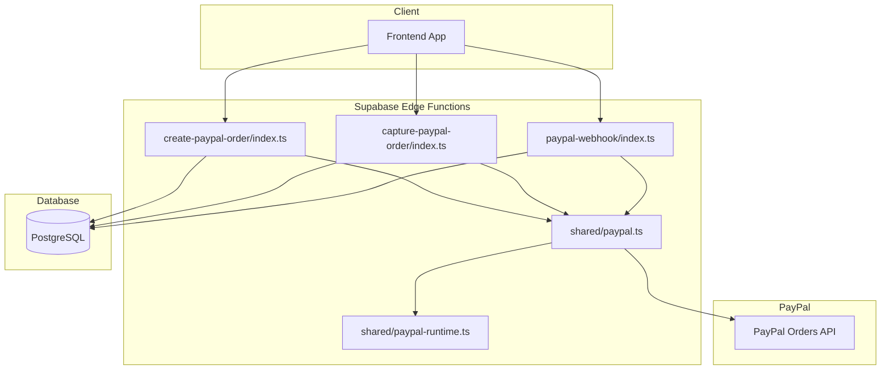
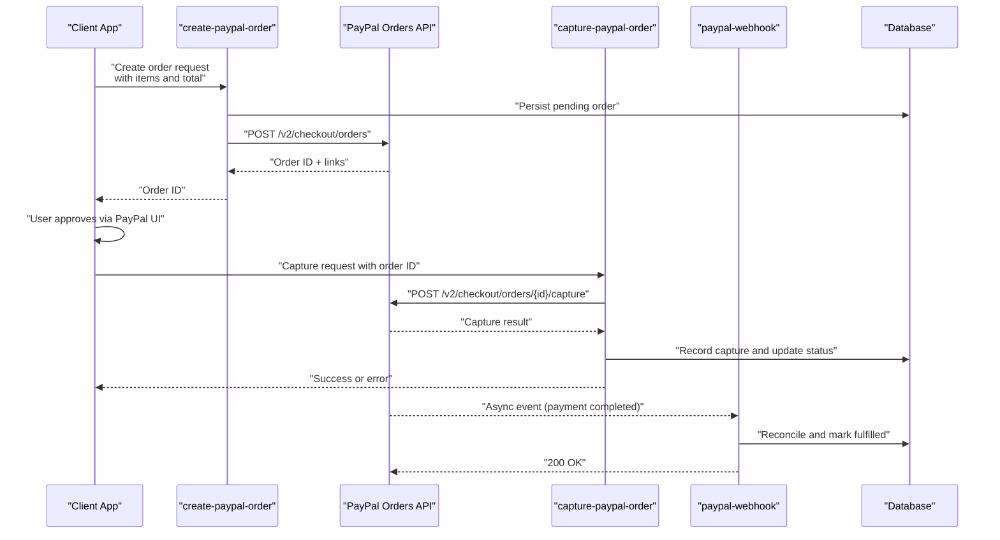
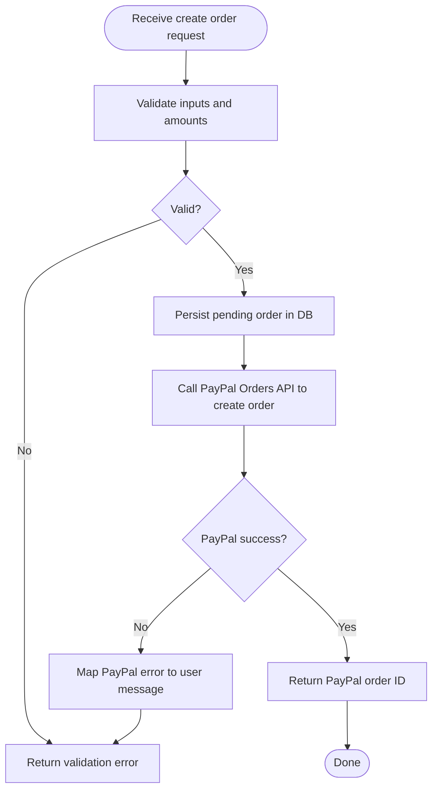
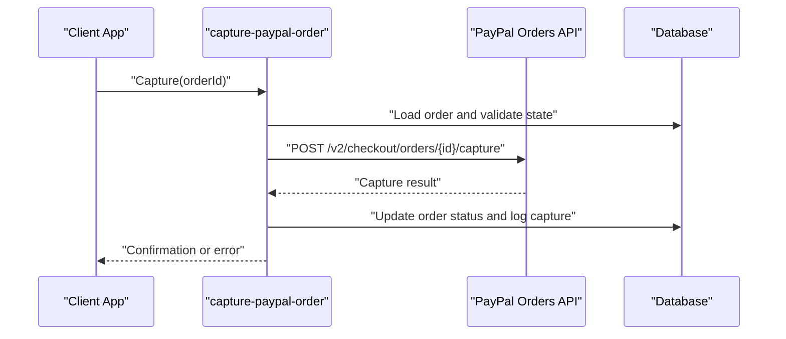
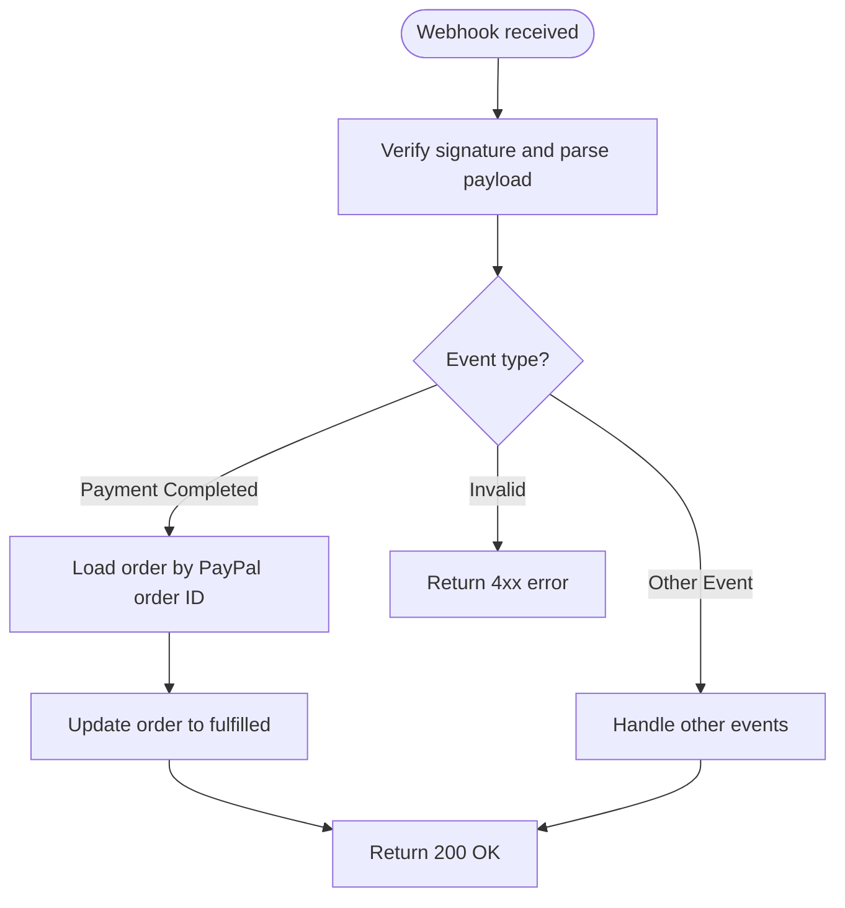
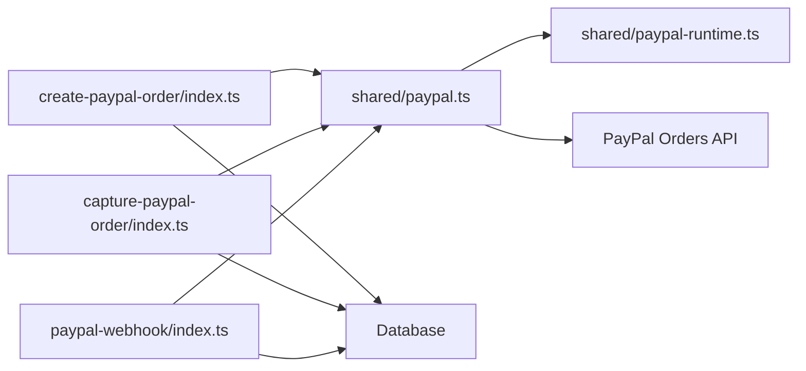

# PayPal Order Capture Flow

<cite>
**Referenced Files in This Document**
- [create-paypal-order/index.ts](file://supabase/functions/create-paypal-order/index.ts)
- [capture-paypal-order/index.ts](file://supabase/functions/capture-paypal-order/index.ts)
- [paypal-webhook/index.ts](file://supabase/functions/paypal-webhook/index.ts)
- [shared/paypal.ts](file://supabase/functions/_shared/paypal.ts)
- [shared/paypal-runtime.ts](file://supabase/functions/_shared/paypal-runtime.ts)
- [migrations/002_paypal_fulfillment.sql](file://supabase/migrations/002_paypal_fulfillment.sql)
</cite>

## Table of Contents
1. [Introduction](#introduction)
2. [Project Structure](#project-structure)
3. [Core Components](#core-components)
4. [Architecture Overview](#architecture-overview)
5. [Detailed Component Analysis](#detailed-component-analysis)
6. [Dependency Analysis](#dependency-analysis)
7. [Performance Considerations](#performance-considerations)
8. [Troubleshooting Guide](#troubleshooting-guide)
9. [Conclusion](#conclusion)

## Introduction
This document describes the end-to-end PayPal order capture workflow implemented in the project. It covers order creation, client-side approval, server-side capture, webhook-driven fulfillment, and refund handling. The flow emphasizes secure API calls to PayPal, robust state management, amount validation, error recovery, and clear user feedback.

## Project Structure
The PayPal integration is implemented as Supabase Edge Functions with shared utilities and database migrations for fulfillment tracking.

**Diagram sources**
- [create-paypal-order/index.ts](file://supabase/functions/create-paypal-order/index.ts)
- [capture-paypal-order/index.ts](file://supabase/functions/capture-paypal-order/index.ts)
- [paypal-webhook/index.ts](file://supabase/functions/paypal-webhook/index.ts)
- [shared/paypal.ts](file://supabase/functions/_shared/paypal.ts)
- [shared/paypal-runtime.ts](file://supabase/functions/_shared/paypal-runtime.ts)
- [migrations/002_paypal_fulfillment.sql](file://supabase/migrations/002_paypal_fulfillment.sql)

**Section sources**
- [create-paypal-order/index.ts](file://supabase/functions/create-paypal-order/index.ts)
- [capture-paypal-order/index.ts](file://supabase/functions/capture-paypal-order/index.ts)
- [paypal-webhook/index.ts](file://supabase/functions/paypal-webhook/index.ts)
- [shared/paypal.ts](file://supabase/functions/_shared/paypal.ts)
- [shared/paypal-runtime.ts](file://supabase/functions/_shared/paypal-runtime.ts)
- [migrations/002_paypal_fulfillment.sql](file://supabase/migrations/002_paypal_fulfillment.sql)

## Core Components
- Create Order Function: Creates a PayPal order on behalf of the client after validating request parameters and amounts. Returns an order ID for client approval.
- Capture Order Function: Captures an approved PayPal order and records fulfillment status in the database.
- Webhook Handler: Receives asynchronous events from PayPal (e.g., payment completions), reconciles state, and triggers fulfillment if needed.
- Shared PayPal Utilities: Encapsulates HTTP calls to PayPal, token management, and common response/error handling.
- Runtime Helpers: Provides environment configuration and runtime helpers used by PayPal utilities.
- Database Schema: Defines tables for orders, captures, and fulfillment records.

Key responsibilities:
- Validate and normalize amounts before creating or capturing orders.
- Ensure idempotency and safe retries for capture and webhook processing.
- Maintain consistent order state across client, server, and PayPal.

**Section sources**
- [create-paypal-order/index.ts](file://supabase/functions/create-paypal-order/index.ts)
- [capture-paypal-order/index.ts](file://supabase/functions/capture-paypal-order/index.ts)
- [paypal-webhook/index.ts](file://supabase/functions/paypal-webhook/index.ts)
- [shared/paypal.ts](file://supabase/functions/_shared/paypal.ts)
- [shared/paypal-runtime.ts](file://supabase/functions/_shared/paypal-runtime.ts)
- [migrations/002_paypal_fulfillment.sql](file://supabase/migrations/002_paypal_fulfillment.sql)

## Architecture Overview
The high-level sequence from order initiation to final capture includes client actions, server orchestration, PayPal interactions, and database updates.

**Diagram sources**
- [create-paypal-order/index.ts](file://supabase/functions/create-paypal-order/index.ts)
- [capture-paypal-order/index.ts](file://supabase/functions/capture-paypal-order/index.ts)
- [paypal-webhook/index.ts](file://supabase/functions/paypal-webhook/index.ts)
- [shared/paypal.ts](file://supabase/functions/_shared/paypal.ts)
- [migrations/002_paypal_fulfillment.sql](file://supabase/migrations/002_paypal_fulfillment.sql)

## Detailed Component Analysis

### Create Order Endpoint
Purpose:
- Accepts client order details (items, currency, total).
- Validates inputs and amounts.
- Creates a PayPal order and persists a pending record.
- Returns the PayPal order ID to the client for approval.

Key behaviors:
- Input validation: non-empty items, positive totals, supported currency codes.
- Amount normalization: ensure correct decimal precision and currency formatting.
- Idempotent order creation: avoid duplicate orders when clients retry.
- Error mapping: translate PayPal errors into user-friendly messages.

**Diagram sources**
- [create-paypal-order/index.ts](file://supabase/functions/create-paypal-order/index.ts)
- [shared/paypal.ts](file://supabase/functions/_shared/paypal.ts)
- [migrations/002_paypal_fulfillment.sql](file://supabase/migrations/002_paypal_fulfillment.sql)

**Section sources**
- [create-paypal-order/index.ts](file://supabase/functions/create-paypal-order/index.ts)
- [shared/paypal.ts](file://supabase/functions/_shared/paypal.ts)
- [migrations/002_paypal_fulfillment.sql](file://supabase/migrations/002_paypal_fulfillment.sql)

### Capture Order Endpoint
Purpose:
- Captures an approved PayPal order.
- Updates local order state to captured/paid.
- Ensures idempotency and handles partial captures if applicable.

Key behaviors:
- Verify order exists and is in an approvable state.
- Call PayPal capture endpoint with the order ID.
- Record capture metadata and timestamps.
- Return confirmation to the client and trigger downstream fulfillment.

**Diagram sources**
- [capture-paypal-order/index.ts](file://supabase/functions/capture-paypal-order/index.ts)
- [shared/paypal.ts](file://supabase/functions/_shared/paypal.ts)
- [migrations/002_paypal_fulfillment.sql](file://supabase/migrations/002_paypal_fulfillment.sql)

**Section sources**
- [capture-paypal-order/index.ts](file://supabase/functions/capture-paypal-order/index.ts)
- [shared/paypal.ts](file://supabase/functions/_shared/paypal.ts)
- [migrations/002_paypal_fulfillment.sql](file://supabase/migrations/002_paypal_fulfillment.sql)

### PayPal Webhook Handler
Purpose:
- Receives asynchronous events from PayPal (e.g., payments completed).
- Reconciles order state and marks fulfillment complete.
- Supports idempotent processing using event IDs.

Key behaviors:
- Verify webhook signature and payload integrity.
- Parse event type and associated order ID.
- Update database records and trigger fulfillment logic.
- Respond with appropriate status codes to acknowledge receipt.

**Diagram sources**
- [paypal-webhook/index.ts](file://supabase/functions/paypal-webhook/index.ts)
- [shared/paypal.ts](file://supabase/functions/_shared/paypal.ts)
- [migrations/002_paypal_fulfillment.sql](file://supabase/migrations/002_paypal_fulfillment.sql)

**Section sources**
- [paypal-webhook/index.ts](file://supabase/functions/paypal-webhook/index.ts)
- [shared/paypal.ts](file://supabase/functions/_shared/paypal.ts)
- [migrations/002_paypal_fulfillment.sql](file://supabase/migrations/002_paypal_fulfillment.sql)

### Shared PayPal Utilities and Runtime
Responsibilities:
- Encapsulate HTTP requests to PayPal endpoints.
- Manage access tokens and headers securely.
- Normalize responses and map errors consistently.
- Provide helper functions for amount formatting and validation.

Runtime helpers:
- Load environment variables for credentials and base URLs.
- Provide logging and tracing hooks for debugging.

**Section sources**
- [shared/paypal.ts](file://supabase/functions/_shared/paypal.ts)
- [shared/paypal-runtime.ts](file://supabase/functions/_shared/paypal-runtime.ts)

### Database Schema for Fulfillment
Tables and relationships:
- Orders: stores PayPal order ID, client reference, amounts, currency, and status.
- Captures: logs capture attempts, results, and timestamps.
- Fulfillments: tracks completion of business-side fulfillment tied to orders.

Constraints and indexes:
- Unique constraints on PayPal order IDs to prevent duplicates.
- Indexes on order IDs and statuses for efficient queries.

**Section sources**
- [migrations/002_paypal_fulfillment.sql](file://supabase/migrations/002_paypal_fulfillment.sql)

## Dependency Analysis
The following diagram shows how components depend on each other and external services.

**Diagram sources**
- [create-paypal-order/index.ts](file://supabase/functions/create-paypal-order/index.ts)
- [capture-paypal-order/index.ts](file://supabase/functions/capture-paypal-order/index.ts)
- [paypal-webhook/index.ts](file://supabase/functions/paypal-webhook/index.ts)
- [shared/paypal.ts](file://supabase/functions/_shared/paypal.ts)
- [shared/paypal-runtime.ts](file://supabase/functions/_shared/paypal-runtime.ts)
- [migrations/002_paypal_fulfillment.sql](file://supabase/migrations/002_paypal_fulfillment.sql)

**Section sources**
- [create-paypal-order/index.ts](file://supabase/functions/create-paypal-order/index.ts)
- [capture-paypal-order/index.ts](file://supabase/functions/capture-paypal-order/index.ts)
- [paypal-webhook/index.ts](file://supabase/functions/paypal-webhook/index.ts)
- [shared/paypal.ts](file://supabase/functions/_shared/paypal.ts)
- [shared/paypal-runtime.ts](file://supabase/functions/_shared/paypal-runtime.ts)
- [migrations/002_paypal_fulfillment.sql](file://supabase/migrations/002_paypal_fulfillment.sql)

## Performance Considerations
- Minimize network calls: cache PayPal access tokens where appropriate and reuse connections.
- Use idempotency keys for create and capture operations to safely handle retries.
- Batch database writes when possible and keep transaction scopes small.
- Add timeouts and circuit breakers around PayPal API calls to prevent cascading failures.
- Log only necessary fields; avoid sensitive data in logs.

[No sources needed since this section provides general guidance]

## Troubleshooting Guide
Common issues and resolutions:
- Invalid amount or currency: ensure amounts are positive and formatted correctly per currency rules.
- Order not found or already captured: verify order state before capture; implement idempotent checks.
- Webhook signature verification failure: confirm secret configuration and payload integrity.
- Network errors from PayPal: implement retries with exponential backoff and surface actionable errors to users.
- Partial captures: handle scenarios where full capture fails but partial succeeds; reconcile amounts and notify users.

Operational tips:
- Inspect database records for order lifecycle states and capture logs.
- Correlate PayPal event IDs with local order IDs for auditability.
- Use structured logging to trace requests across create, capture, and webhook flows.

**Section sources**
- [create-paypal-order/index.ts](file://supabase/functions/create-paypal-order/index.ts)
- [capture-paypal-order/index.ts](file://supabase/functions/capture-paypal-order/index.ts)
- [paypal-webhook/index.ts](file://supabase/functions/paypal-webhook/index.ts)
- [shared/paypal.ts](file://supabase/functions/_shared/paypal.ts)
- [migrations/002_paypal_fulfillment.sql](file://supabase/migrations/002_paypal_fulfillment.sql)

## Conclusion
The PayPal order capture flow integrates client approvals with server-side orchestration, robust validation, and reliable state management. By leveraging shared utilities, idempotent operations, and webhook reconciliation, the system ensures secure transactions, accurate amount handling, and resilient error recovery. Proper logging and database tracking provide visibility into the entire lifecycle from order creation through capture and fulfillment.

[No sources needed since this section summarizes without analyzing specific files]