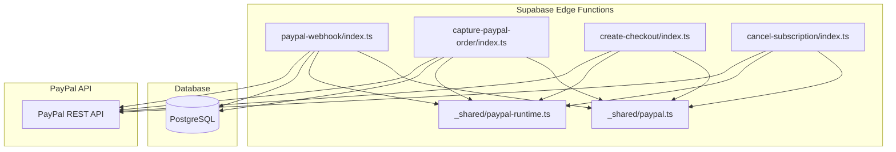
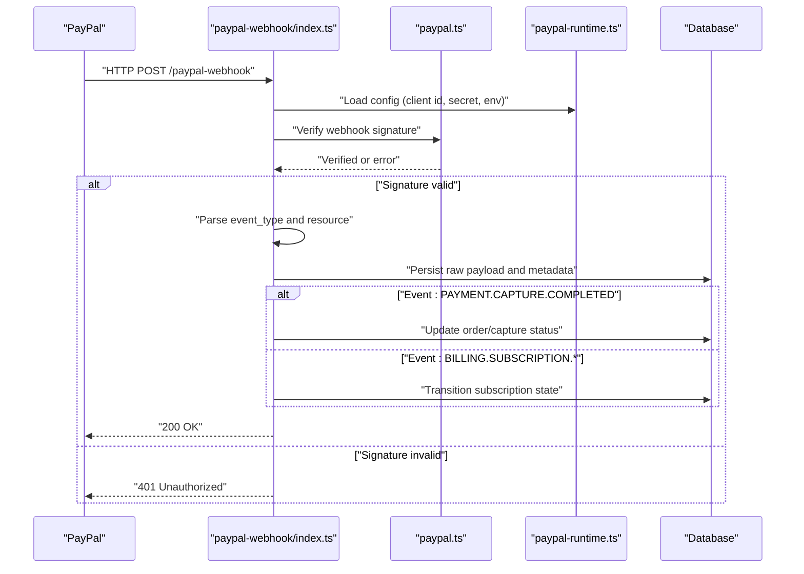
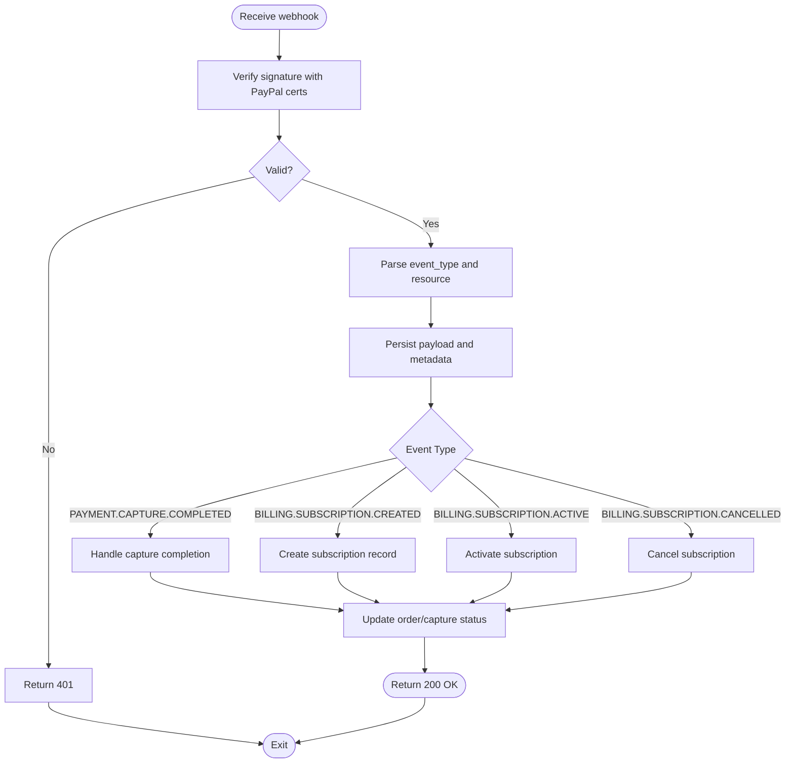
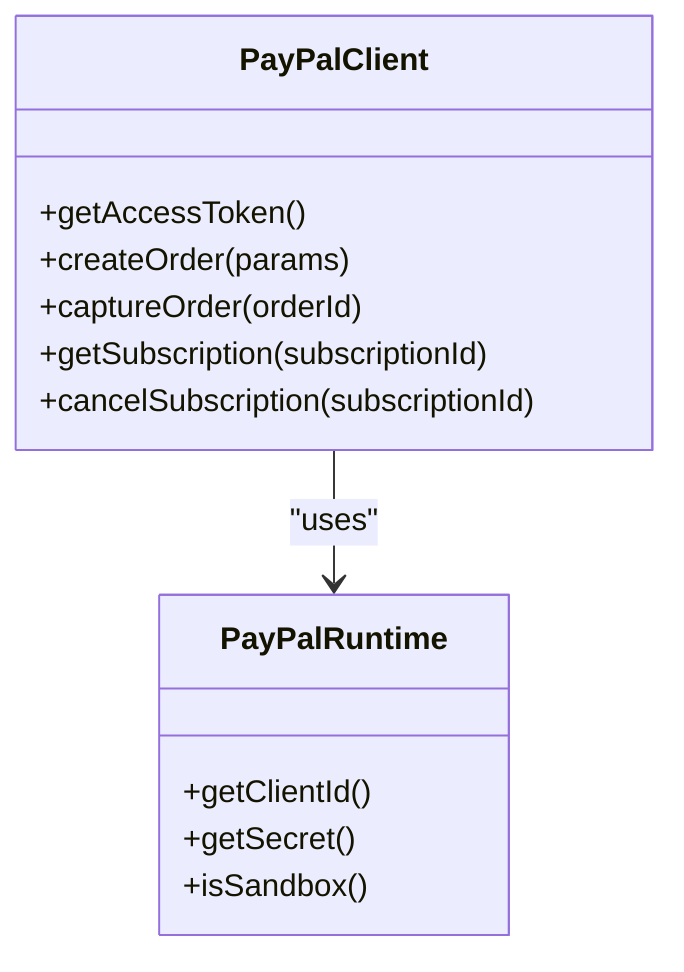
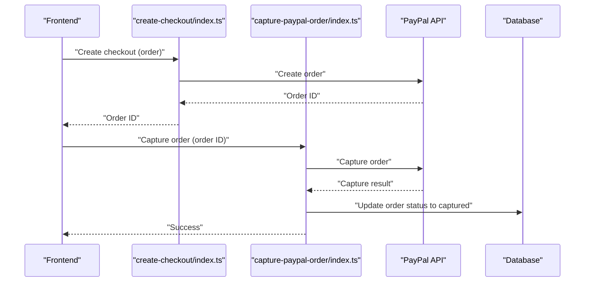
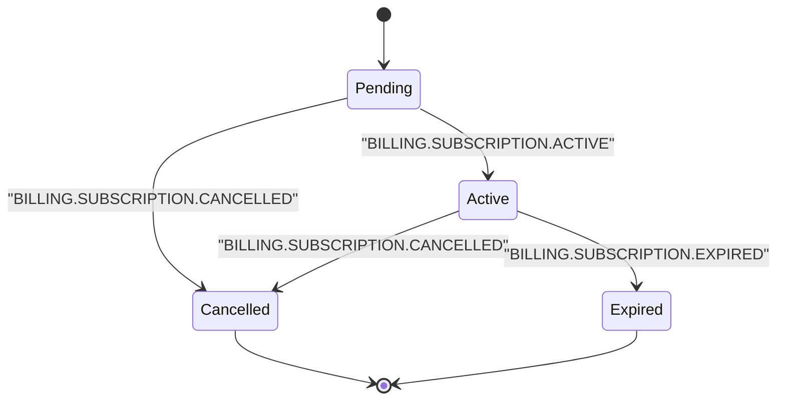
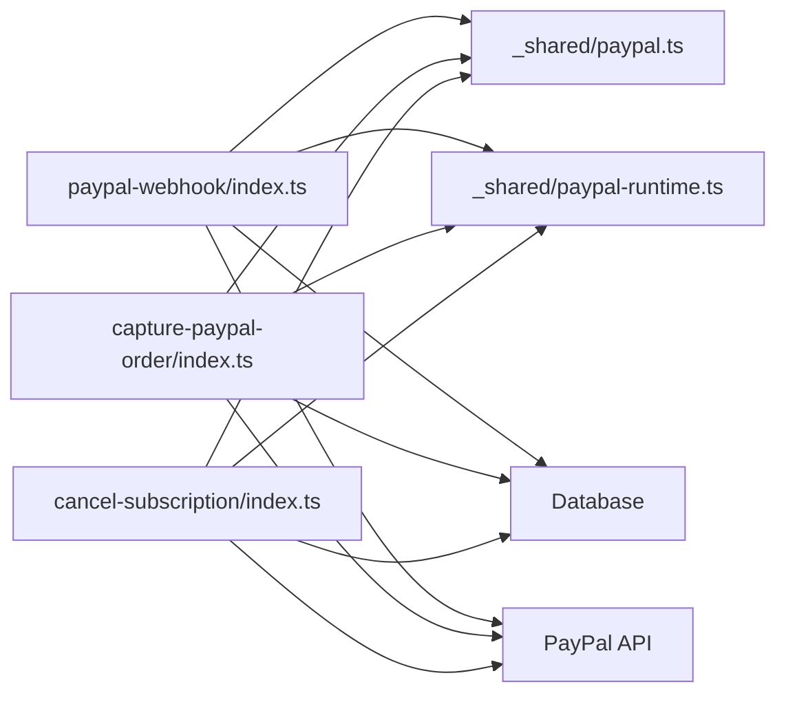

# PayPal Webhook Handler

<cite>
**Referenced Files in This Document**
- [paypal-webhook/index.ts](file://supabase/functions/paypal-webhook/index.ts)
- [paypal.ts](file://supabase/functions/_shared/paypal.ts)
- [paypal-runtime.ts](file://supabase/functions/_shared/paypal-runtime.ts)
- [paypal.test.ts](file://supabase/functions/_shared/paypal.test.ts)
- [capture-paypal-order/index.ts](file://supabase/functions/capture-paypal-order/index.ts)
- [create-checkout/index.ts](file://supabase/functions/create-checkout/index.ts)
- [cancel-subscription/index.ts](file://supabase/functions/cancel-subscription/index.ts)
- [002_paypal_fulfillment.sql](file://supabase/migrations/002_paypal_fulfillment.sql)
</cite>

## Table of Contents
1. [Introduction](#introduction)
2. [Project Structure](#project-structure)
3. [Core Components](#core-components)
4. [Architecture Overview](#architecture-overview)
5. [Detailed Component Analysis](#detailed-component-analysis)
6. [Dependency Analysis](#dependency-analysis)
7. [Performance Considerations](#performance-considerations)
8. [Troubleshooting Guide](#troubleshooting-guide)
9. [Conclusion](#conclusion)
10. [Appendices](#appendices)

## Introduction
This document explains the PayPal webhook handler and related billing flows. It covers:
- Supported PayPal event types (e.g., payment capture completion, subscription lifecycle events)
- Signature verification using PayPal’s certificate-based authentication
- Order capture confirmation flow
- Subscription lifecycle management
- Payload examples, state transitions, and database updates
- PayPal-specific error handling, webhook versioning, and debugging techniques

The implementation is provided as Supabase Edge Functions with shared utilities for PayPal integration.

## Project Structure
Key files involved in PayPal webhooks and fulfillment:
- supabase/functions/paypal-webhook/index.ts: Entry point for receiving and processing PayPal webhooks
- supabase/functions/_shared/paypal.ts: PayPal client helpers and request/response shaping
- supabase/functions/_shared/paypal-runtime.ts: Runtime configuration and environment access for PayPal
- supabase/functions/_shared/paypal.test.ts: Tests for PayPal utilities
- supabase/functions/capture-paypal-order/index.ts: Captures a previously created PayPal order
- supabase/functions/create-checkout/index.ts: Creates a PayPal checkout session or order
- supabase/functions/cancel-subscription/index.ts: Cancels an existing PayPal subscription
- supabase/migrations/002_paypal_fulfillment.sql: Database schema for tracking PayPal fulfillments and subscriptions

**Diagram sources**
- [paypal-webhook/index.ts](file://supabase/functions/paypal-webhook/index.ts)
- [paypal.ts](file://supabase/functions/_shared/paypal.ts)
- [paypal-runtime.ts](file://supabase/functions/_shared/paypal-runtime.ts)
- [capture-paypal-order/index.ts](file://supabase/functions/capture-paypal-order/index.ts)
- [create-checkout/index.ts](file://supabase/functions/create-checkout/index.ts)
- [cancel-subscription/index.ts](file://supabase/functions/cancel-subscription/index.ts)
- [002_paypal_fulfillment.sql](file://supabase/migrations/002_paypal_fulfillment.sql)

**Section sources**
- [paypal-webhook/index.ts](file://supabase/functions/paypal-webhook/index.ts)
- [paypal.ts](file://supabase/functions/_shared/paypal.ts)
- [paypal-runtime.ts](file://supabase/functions/_shared/paypal-runtime.ts)
- [capture-paypal-order/index.ts](file://supabase/functions/capture-paypal-order/index.ts)
- [create-checkout/index.ts](file://supabase/functions/create-checkout/index.ts)
- [cancel-subscription/index.ts](file://supabase/functions/cancel-subscription/index.ts)
- [002_paypal_fulfillment.sql](file://supabase/migrations/002_paypal_fulfillment.sql)

## Core Components
- PayPal Webhook Handler: Receives webhook events, verifies authenticity, routes to handlers by event type, persists audit records, and triggers fulfillment logic.
- PayPal Client Utilities: Encapsulates HTTP calls to PayPal APIs, token acquisition, and response parsing.
- Runtime Configuration: Loads environment variables such as client ID, secret, and sandbox toggles.
- Fulfillment Migrations: Defines tables for orders, captures, subscriptions, and status tracking.

Responsibilities:
- Authentication and signature verification against PayPal certificates
- Idempotent processing of webhook events
- State transitions for orders and subscriptions
- Error reporting and retry guidance

**Section sources**
- [paypal-webhook/index.ts](file://supabase/functions/paypal-webhook/index.ts)
- [paypal.ts](file://supabase/functions/_shared/paypal.ts)
- [paypal-runtime.ts](file://supabase/functions/_shared/paypal-runtime.ts)
- [002_paypal_fulfillment.sql](file://supabase/migrations/002_paypal_fulfillment.sql)

## Architecture Overview
End-to-end flow from PayPal to your system:

**Diagram sources**
- [paypal-webhook/index.ts](file://supabase/functions/paypal-webhook/index.ts)
- [paypal.ts](file://supabase/functions/_shared/paypal.ts)
- [paypal-runtime.ts](file://supabase/functions/_shared/paypal-runtime.ts)
- [002_paypal_fulfillment.sql](file://supabase/migrations/002_paypal_fulfillment.sql)

## Detailed Component Analysis

### PayPal Webhook Handler
Purpose:
- Accepts incoming webhook requests
- Verifies authenticity using PayPal’s certificate chain
- Routes events to specific handlers based on event_type
- Persists audit logs and performs idempotent updates
- Returns appropriate HTTP status codes

Key behaviors:
- Signature verification using PayPal-provided certificates
- Event routing by event_type (e.g., PAYMENT.CAPTURE.COMPLETED, BILLING.SUBSCRIPTION.CREATED/ACTIVE/CANCELLED)
- Deduplication via event_id or resource_id
- Database updates for orders and subscriptions

**Diagram sources**
- [paypal-webhook/index.ts](file://supabase/functions/paypal-webhook/index.ts)
- [paypal.ts](file://supabase/functions/_shared/paypal.ts)
- [002_paypal_fulfillment.sql](file://supabase/migrations/002_paypal_fulfillment.sql)

**Section sources**
- [paypal-webhook/index.ts](file://supabase/functions/paypal-webhook/index.ts)

### PayPal Client Utilities
Purpose:
- Provides functions to call PayPal APIs (orders, captures, subscriptions)
- Handles token acquisition and request signing
- Normalizes responses into internal models

Key responsibilities:
- Token retrieval and caching
- Constructing authenticated requests
- Parsing and validating PayPal responses
- Mapping PayPal fields to internal entities

**Diagram sources**
- [paypal.ts](file://supabase/functions/_shared/paypal.ts)
- [paypal-runtime.ts](file://supabase/functions/_shared/paypal-runtime.ts)

**Section sources**
- [paypal.ts](file://supabase/functions/_shared/paypal.ts)
- [paypal-runtime.ts](file://supabase/functions/_shared/paypal-runtime.ts)

### Order Capture Confirmation
Purpose:
- Confirms and finalizes a PayPal order after user authorization
- Updates internal order state to captured and fulfills entitlements

Flow:
- Frontend calls create-checkout to obtain an order ID
- After user approves, frontend invokes capture-paypal-order
- Backend verifies order state and captures funds
- On success, backend updates database and grants access

**Diagram sources**
- [create-checkout/index.ts](file://supabase/functions/create-checkout/index.ts)
- [capture-paypal-order/index.ts](file://supabase/functions/capture-paypal-order/index.ts)
- [paypal.ts](file://supabase/functions/_shared/paypal.ts)
- [002_paypal_fulfillment.sql](file://supabase/migrations/002_paypal_fulfillment.sql)

**Section sources**
- [capture-paypal-order/index.ts](file://supabase/functions/capture-paypal-order/index.ts)
- [create-checkout/index.ts](file://supabase/functions/create-checkout/index.ts)

### Subscription Lifecycle Management
Supported events:
- BILLING.SUBSCRIPTION.CREATED
- BILLING.SUBSCRIPTION.ACTIVE
- BILLING.SUBSCRIPTION.CANCELLED
- Additional lifecycle events as needed (e.g., EXPIRED, SUSPENDED)

State transitions:
- Created -> Active upon successful activation
- Active -> Cancelled when cancellation occurs
- Active -> Expired if subscription lapses

**Diagram sources**
- [paypal-webhook/index.ts](file://supabase/functions/paypal-webhook/index.ts)
- [002_paypal_fulfillment.sql](file://supabase/migrations/002_paypal_fulfillment.sql)

**Section sources**
- [paypal-webhook/index.ts](file://supabase/functions/paypal-webhook/index.ts)
- [002_paypal_fulfillment.sql](file://supabase/migrations/002_paypal_fulfillment.sql)

### Database Schema and Updates
Tables typically include:
- Orders: order_id, paypal_order_id, status, amount, currency, created_at, updated_at
- Captures: capture_id, order_id, status, amount, currency, captured_at
- Subscriptions: subscription_id, paypal_subscription_id, status, plan_id, billing_cycle, next_billing_date, created_at, updated_at
- WebhookAudit: event_id, event_type, resource_id, raw_payload, processed_at, status

Updates:
- On PAYMENT.CAPTURE.COMPLETED: mark order as captured, insert capture record
- On BILLING.SUBSCRIPTION.*: update subscription status and timestamps
- Always persist raw payloads for auditing and replay

**Section sources**
- [002_paypal_fulfillment.sql](file://supabase/migrations/002_paypal_fulfillment.sql)

## Dependency Analysis
Internal dependencies:
- paypal-webhook depends on paypal utilities and runtime configuration
- capture-paypal-order and cancel-subscription depend on paypal utilities and runtime configuration
- All components interact with the database through Supabase client

External dependencies:
- PayPal REST API endpoints for orders, captures, subscriptions
- PayPal certificate endpoints for signature verification

**Diagram sources**
- [paypal-webhook/index.ts](file://supabase/functions/paypal-webhook/index.ts)
- [paypal.ts](file://supabase/functions/_shared/paypal.ts)
- [paypal-runtime.ts](file://supabase/functions/_shared/paypal-runtime.ts)
- [capture-paypal-order/index.ts](file://supabase/functions/capture-paypal-order/index.ts)
- [cancel-subscription/index.ts](file://supabase/functions/cancel-subscription/index.ts)
- [002_paypal_fulfillment.sql](file://supabase/migrations/002_paypal_fulfillment.sql)

**Section sources**
- [paypal-webhook/index.ts](file://supabase/functions/paypal-webhook/index.ts)
- [paypal.ts](file://supabase/functions/_shared/paypal.ts)
- [paypal-runtime.ts](file://supabase/functions/_shared/paypal-runtime.ts)
- [capture-paypal-order/index.ts](file://supabase/functions/capture-paypal-order/index.ts)
- [cancel-subscription/index.ts](file://supabase/functions/cancel-subscription/index.ts)
- [002_paypal_fulfillment.sql](file://supabase/migrations/002_paypal_fulfillment.sql)

## Performance Considerations
- Idempotency: Use event_id or resource_id to avoid duplicate processing
- Minimal payload persistence: Store only necessary fields; archive raw payloads separately if large
- Connection pooling: Ensure database connections are reused within function execution
- Timeout handling: PayPal webhooks may be delayed; implement retries at the platform level
- Logging: Keep structured logs for correlation IDs and event types

[No sources needed since this section provides general guidance]

## Troubleshooting Guide
Common issues and resolutions:
- Signature verification failures:
  - Ensure correct PayPal certificate URLs and network access
  - Validate environment variables for client ID and secret
  - Check time skew and TLS settings
- Duplicate events:
  - Implement deduplication using event_id or resource_id
  - Maintain processed event registry
- Missing or incorrect fields:
  - Validate required fields before processing
  - Log malformed payloads for review
- Subscription state mismatches:
  - Reconcile local state with PayPal subscription details
  - Use explicit transitions and guard conditions

Debugging techniques:
- Enable verbose logging for webhook payloads and responses
- Use correlation IDs across functions and database records
- Replay failed events using stored raw payloads
- Monitor PayPal dashboard for delivery status and errors

**Section sources**
- [paypal-webhook/index.ts](file://supabase/functions/paypal-webhook/index.ts)
- [paypal.test.ts](file://supabase/functions/_shared/paypal.test.ts)

## Conclusion
The PayPal webhook handler integrates securely with PayPal’s API, verifying signatures and managing order captures and subscription lifecycles. By enforcing idempotency, robust error handling, and clear state transitions, the system ensures reliable fulfillment and consistent database state.

[No sources needed since this section summarizes without analyzing specific files]

## Appendices

### Webhook Event Types and Handling
- PAYMENT.CAPTURE.COMPLETED: Finalize order capture and grant entitlements
- BILLING.SUBSCRIPTION.CREATED: Initialize subscription record
- BILLING.SUBSCRIPTION.ACTIVE: Activate subscription and enable features
- BILLING.SUBSCRIPTION.CANCELLED: Disable features and update status

**Section sources**
- [paypal-webhook/index.ts](file://supabase/functions/paypal-webhook/index.ts)

### Webhook Versioning
- Track webhook versions in metadata
- Support backward-compatible parsing for older payloads
- Migrate handlers gradually when breaking changes occur

**Section sources**
- [paypal-webhook/index.ts](file://supabase/functions/paypal-webhook/index.ts)