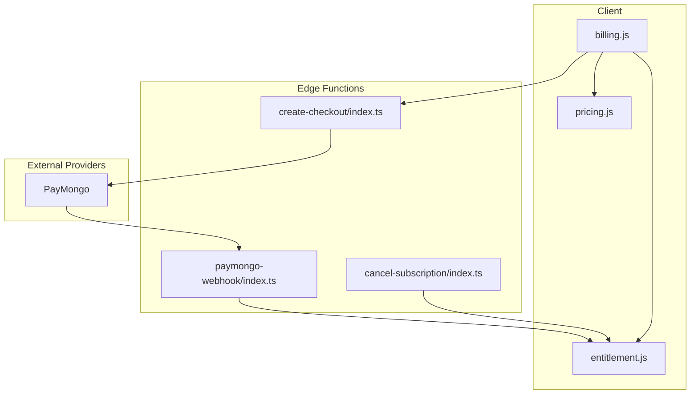
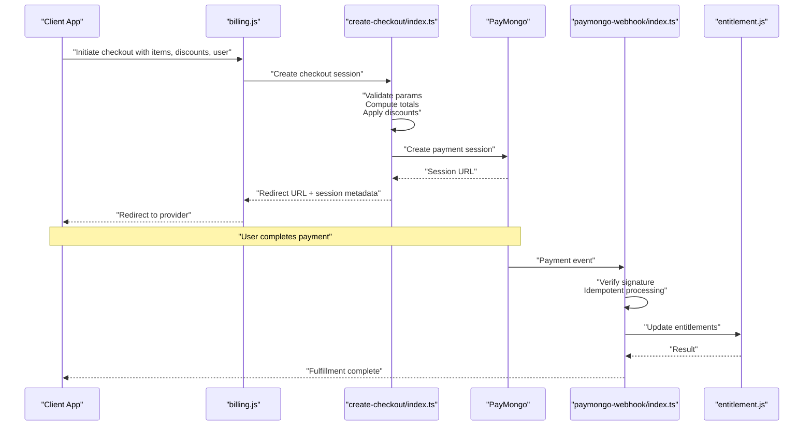
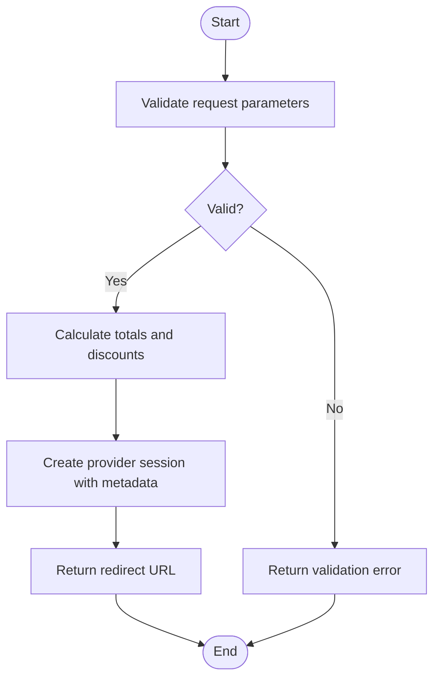
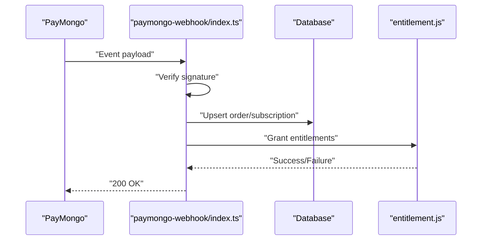
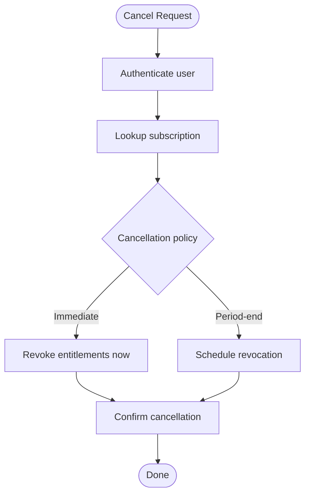
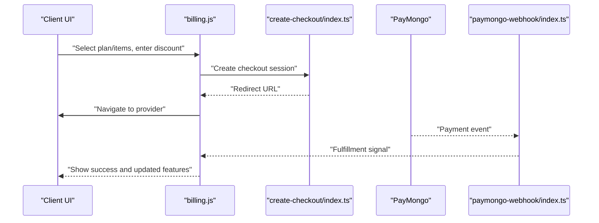
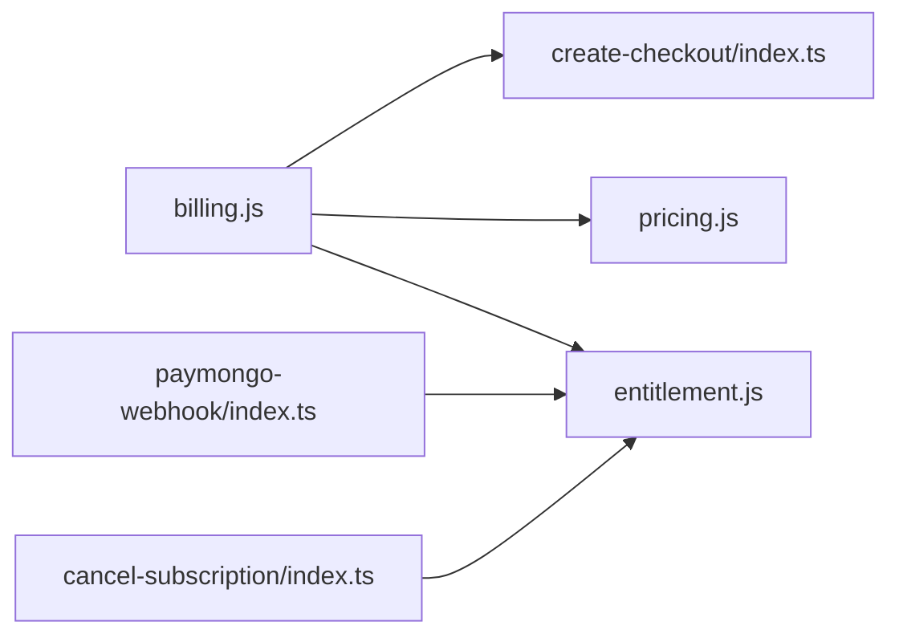

# Checkout & Subscription Management

<cite>
**Referenced Files in This Document**
- [create-checkout/index.ts](file://supabase/functions/create-checkout/index.ts)
- [paymongo-webhook/index.ts](file://supabase/functions/paymongo-webhook/index.ts)
- [cancel-subscription/index.ts](file://supabase/functions/cancel-subscription/index.ts)
- [billing.js](file://src/lib/billing.js)
- [entitlement.js](file://src/lib/entitlement.js)
- [pricing.js](file://src/lib/pricing.js)
- [03-subscriptions-paymongo.md](file://docs/superpowers/plans/monetization/03-subscriptions-paymongo.md)
</cite>

## Table of Contents
1. [Introduction](#introduction)
2. [Project Structure](#project-structure)
3. [Core Components](#core-components)
4. [Architecture Overview](#architecture-overview)
5. [Detailed Component Analysis](#detailed-component-analysis)
6. [Dependency Analysis](#dependency-analysis)
7. [Performance Considerations](#performance-considerations)
8. [Troubleshooting Guide](#troubleshooting-guide)
9. [Conclusion](#conclusion)

## Introduction
This document explains the end-to-end checkout and subscription management flows, including:
- Creating a checkout session
- Pricing calculations and discount application
- Payment completion via webhook
- Updating user entitlements after successful payment
- Subscription cancellation workflows
- Refund processing considerations
- Account state transitions and error handling for payment failures

The goal is to provide both high-level understanding and code-level details for developers integrating or maintaining billing features.

## Project Structure
Billing-related functionality spans serverless functions (Supabase Edge Functions), client-side libraries, and design documentation:
- Serverless functions handle checkout creation, webhooks, and subscription lifecycle events
- Client libraries encapsulate pricing, billing orchestration, and entitlement logic
- Design docs outline architecture and integration points with payment providers

**Diagram sources**
- [create-checkout/index.ts](file://supabase/functions/create-checkout/index.ts)
- [paymongo-webhook/index.ts](file://supabase/functions/paymongo-webhook/index.ts)
- [cancel-subscription/index.ts](file://supabase/functions/cancel-subscription/index.ts)
- [billing.js](file://src/lib/billing.js)
- [entitlement.js](file://src/lib/entitlement.js)
- [pricing.js](file://src/lib/pricing.js)

**Section sources**
- [03-subscriptions-paymongo.md](file://docs/superpowers/plans/monetization/03-subscriptions-paymongo.md)

## Core Components
- Checkout Creation Function: Creates a payment session with validated parameters, computes totals, applies discounts, and returns a redirect URL to the provider.
- Webhook Handler: Verifies signatures, processes payment events, updates order/subscription records, and triggers entitlement updates.
- Billing Library: Orchestrates checkout calls, manages session metadata, and coordinates post-payment actions on the client.
- Entitlement Library: Evaluates and updates user access based on active subscriptions and one-time purchases.
- Pricing Library: Provides base prices, tiers, and discount rules used during checkout calculation.

Key responsibilities:
- Input validation and idempotency
- Secure signature verification
- Accurate price computation and currency handling
- Reliable state synchronization between provider, backend, and client
- Clear error propagation and retry strategies

**Section sources**
- [create-checkout/index.ts](file://supabase/functions/create-checkout/index.ts)
- [paymongo-webhook/index.ts](file://supabase/functions/paymongo-webhook/index.ts)
- [billing.js](file://src/lib/billing.js)
- [entitlement.js](file://src/lib/entitlement.js)
- [pricing.js](file://src/lib/pricing.js)

## Architecture Overview
The checkout flow integrates client orchestration, serverless checkout creation, external payment processing, and webhook-driven fulfillment.

**Diagram sources**
- [billing.js](file://src/lib/billing.js)
- [create-checkout/index.ts](file://supabase/functions/create-checkout/index.ts)
- [paymongo-webhook/index.ts](file://supabase/functions/paymongo-webhook/index.ts)
- [entitlement.js](file://src/lib/entitlement.js)

## Detailed Component Analysis

### Checkout Session Creation
Responsibilities:
- Validate inputs (user identity, items, quantities, discount codes)
- Compute line-item totals and apply discounts deterministically
- Create a provider session with stable metadata for reconciliation
- Return a secure redirect URL to the provider’s hosted checkout

Important behaviors:
- Idempotency keys prevent duplicate sessions
- Currency and rounding handled consistently
- Metadata includes user ID, plan/tier, and order identifiers for webhook matching

**Diagram sources**
- [create-checkout/index.ts](file://supabase/functions/create-checkout/index.ts)
- [pricing.js](file://src/lib/pricing.js)

**Section sources**
- [create-checkout/index.ts](file://supabase/functions/create-checkout/index.ts)
- [pricing.js](file://src/lib/pricing.js)

### Pricing Calculations and Discount Application
Responsibilities:
- Resolve base prices by tier or item SKU
- Apply percentage or fixed discounts with precedence rules
- Enforce minimums, caps, and tax handling if applicable
- Ensure deterministic results across client and server

Best practices:
- Always compute totals server-side
- Use integer cents or smallest currency unit
- Log discount breakdowns for auditability

**Section sources**
- [pricing.js](file://src/lib/pricing.js)

### Payment Completion and Fulfillment
Responsibilities:
- Receive and verify webhook signatures
- Process only confirmed payment events
- Update internal records (orders/subscriptions)
- Trigger entitlement updates and notify clients

Error handling:
- Reject unknown events or invalid payloads
- Implement idempotent processing using event IDs
- Retry failed operations safely

**Diagram sources**
- [paymongo-webhook/index.ts](file://supabase/functions/paymongo-webhook/index.ts)
- [entitlement.js](file://src/lib/entitlement.js)

**Section sources**
- [paymongo-webhook/index.ts](file://supabase/functions/paymongo-webhook/index.ts)
- [entitlement.js](file://src/lib/entitlement.js)

### User Entitlement Updates
Responsibilities:
- Evaluate current subscriptions and one-time purchases
- Grant or revoke access to features based on effective dates and status
- Persist entitlement state and propagate changes to clients

State transitions:
- Active -> Expired (non-renewal)
- Active -> Cancelled (end-of-period)
- Pending -> Active (payment success)
- Failed -> Inactive (payment failure)

**Section sources**
- [entitlement.js](file://src/lib/entitlement.js)

### Subscription Cancellation Workflow
Responsibilities:
- Accept cancellation requests from authenticated users
- Determine cancellation timing (immediate vs period-end)
- Update subscription status and schedule final billing
- Revoke or adjust entitlements per policy

**Diagram sources**
- [cancel-subscription/index.ts](file://supabase/functions/cancel-subscription/index.ts)
- [entitlement.js](file://src/lib/entitlement.js)

**Section sources**
- [cancel-subscription/index.ts](file://supabase/functions/cancel-subscription/index.ts)
- [entitlement.js](file://src/lib/entitlement.js)

### Refund Processing
Responsibilities:
- Handle refund events from the provider
- Reverse charges and adjust entitlements accordingly
- Maintain audit logs and reconcile discrepancies

Considerations:
- Partial vs full refunds
- Time windows for eligibility
- Customer communication and support workflows

**Section sources**
- [paymongo-webhook/index.ts](file://supabase/functions/paymongo-webhook/index.ts)

### Client Orchestration (billing.js)
Responsibilities:
- Build checkout payloads with items, discounts, and user context
- Call the checkout creation function and handle redirects
- Listen for fulfillment signals and refresh entitlements
- Surface errors and guide users through retries

**Diagram sources**
- [billing.js](file://src/lib/billing.js)
- [create-checkout/index.ts](file://supabase/functions/create-checkout/index.ts)
- [paymongo-webhook/index.ts](file://supabase/functions/paymongo-webhook/index.ts)

**Section sources**
- [billing.js](file://src/lib/billing.js)

## Dependency Analysis
High-level dependencies among components:
- billing.js depends on create-checkout function and pricing/entitlement modules
- paymongo-webhook depends on entitlement updates and database writes
- cancel-subscription depends on entitlement adjustments and subscription records

**Diagram sources**
- [billing.js](file://src/lib/billing.js)
- [create-checkout/index.ts](file://supabase/functions/create-checkout/index.ts)
- [paymongo-webhook/index.ts](file://supabase/functions/paymongo-webhook/index.ts)
- [cancel-subscription/index.ts](file://supabase/functions/cancel-subscription/index.ts)
- [entitlement.js](file://src/lib/entitlement.js)
- [pricing.js](file://src/lib/pricing.js)

**Section sources**
- [billing.js](file://src/lib/billing.js)
- [create-checkout/index.ts](file://supabase/functions/create-checkout/index.ts)
- [paymongo-webhook/index.ts](file://supabase/functions/paymongo-webhook/index.ts)
- [cancel-subscription/index.ts](file://supabase/functions/cancel-subscription/index.ts)
- [entitlement.js](file://src/lib/entitlement.js)
- [pricing.js](file://src/lib/pricing.js)

## Performance Considerations
- Keep checkout creation lightweight; defer heavy computations to server-side
- Cache static pricing data where safe to do so
- Use idempotency keys to avoid redundant provider calls
- Batch entitlement updates when possible
- Monitor webhook latency and implement backoff for retries

[No sources needed since this section provides general guidance]

## Troubleshooting Guide
Common issues and resolutions:
- Invalid or missing parameters in checkout requests: validate early and return clear errors
- Signature verification failures in webhooks: ensure secret configuration and exact payload hashing
- Duplicate events: rely on idempotency keys and deduplicate by event ID
- Entitlement mismatches: reconcile provider state with local records and re-run fulfillment
- Payment failures: surface actionable messages and allow retry with updated payment method

Operational checks:
- Verify webhook endpoints are reachable and returning 2xx
- Inspect logs for signature mismatches and malformed payloads
- Audit discount application logs for unexpected totals
- Confirm subscription status transitions align with provider events

**Section sources**
- [paymongo-webhook/index.ts](file://supabase/functions/paymongo-webhook/index.ts)
- [create-checkout/index.ts](file://supabase/functions/create-checkout/index.ts)
- [entitlement.js](file://src/lib/entitlement.js)

## Conclusion
The checkout and subscription system combines robust server-side validation, precise pricing and discount logic, reliable webhook processing, and consistent entitlement management. By following the documented flows and best practices, teams can deliver a resilient billing experience that scales and remains auditable.

[No sources needed since this section summarizes without analyzing specific files]