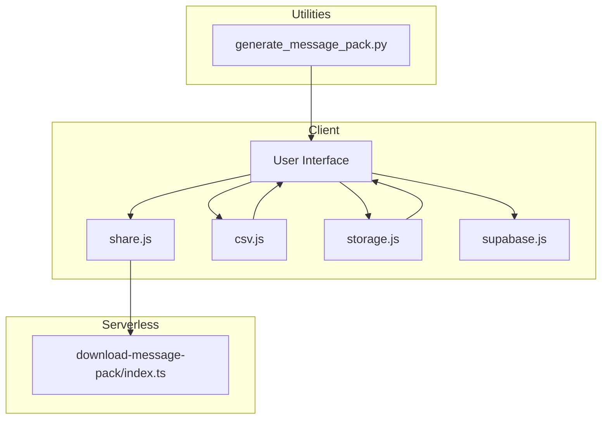
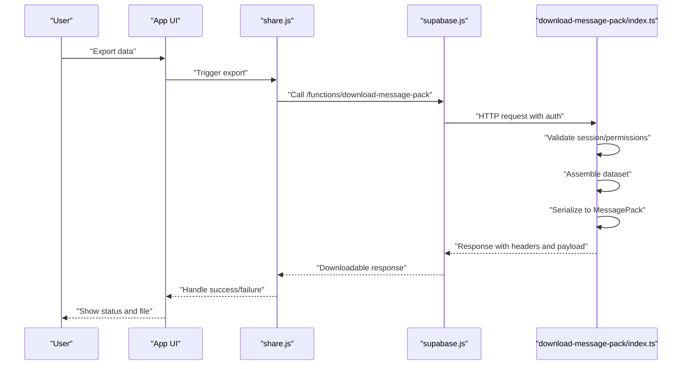
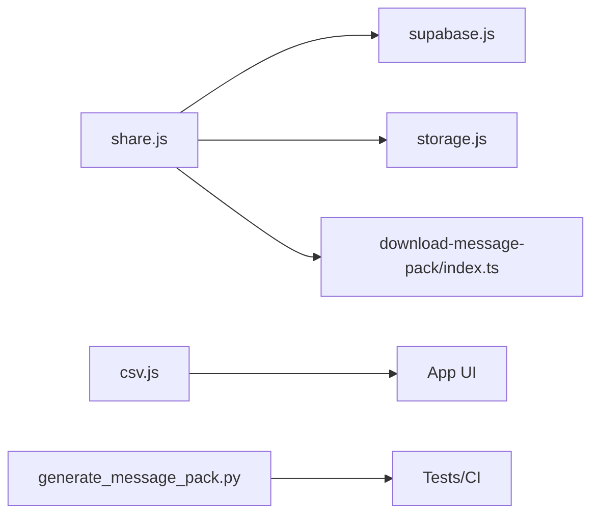

# Data Export Utilities

<cite>
**Referenced Files in This Document**
- [download-message-pack/index.ts](file://supabase/functions/download-message-pack/index.ts)
- [generate_message_pack.py](file://scripts/generate_message_pack.py)
- [csv.js](file://src/lib/csv.js)
- [share.js](file://src/lib/share.js)
- [storage.js](file://src/lib/storage.js)
- [supabase.js](file://src/lib/supabase.js)
</cite>

## Table of Contents
1. [Introduction](#introduction)
2. [Project Structure](#project-structure)
3. [Core Components](#core-components)
4. [Architecture Overview](#architecture-overview)
5. [Detailed Component Analysis](#detailed-component-analysis)
6. [Dependency Analysis](#dependency-analysis)
7. [Performance Considerations](#performance-considerations)
8. [Troubleshooting Guide](#troubleshooting-guide)
9. [Conclusion](#conclusion)

## Introduction
This document explains the data export utilities with a focus on the MessagePack download functionality. It covers how exports are generated, serialized, and delivered to users, including security measures for access control, file size limitations, and format specifications. It also provides examples for triggering exports, handling large datasets, and managing download expiration.

## Project Structure
The export feature spans serverless functions (Supabase Edge Functions), client-side libraries, and a helper script:
- Server-side export endpoint: Supabase Edge Function that generates and serves the export.
- Client-side helpers: Libraries for CSV generation, sharing, storage, and Supabase client configuration.
- Helper script: A Python utility for generating MessagePack content locally or in CI.

**Diagram sources**
- [download-message-pack/index.ts](file://supabase/functions/download-message-pack/index.ts)
- [csv.js](file://src/lib/csv.js)
- [share.js](file://src/lib/share.js)
- [storage.js](file://src/lib/storage.js)
- [supabase.js](file://src/lib/supabase.js)
- [generate_message_pack.py](file://scripts/generate_message_pack.py)

**Section sources**
- [download-message-pack/index.ts](file://supabase/functions/download-message-pack/index.ts)
- [csv.js](file://src/lib/csv.js)
- [share.js](file://src/lib/share.js)
- [storage.js](file://src/lib/storage.js)
- [supabase.js](file://src/lib/supabase.js)
- [generate_message_pack.py](file://scripts/generate_message_pack.py)

## Core Components
- MessagePack download function: The serverless endpoint responsible for validating requests, assembling export data, serializing it into MessagePack, and returning a downloadable response with appropriate headers and expiration controls.
- Client-side share library: Orchestrates export triggers, manages temporary links, and handles user feedback.
- CSV library: Provides an alternative export path for tabular data when needed.
- Storage library: Manages local caching and persistence of export metadata or artifacts as required by the app.
- Supabase client: Configures authentication and network calls to the serverless function.
- Python generator: Utility to produce MessagePack payloads for testing or offline workflows.

Key responsibilities:
- Security: Validate identity and permissions before generating any export.
- Serialization: Produce compact, deterministic MessagePack output; optionally provide CSV fallbacks.
- Download management: Set correct Content-Type, Content-Disposition, and expiration behavior.
- Size limits: Enforce maximum payload sizes to protect server resources and ensure reliable delivery.

**Section sources**
- [download-message-pack/index.ts](file://supabase/functions/download-message-pack/index.ts)
- [share.js](file://src/lib/share.js)
- [csv.js](file://src/lib/csv.js)
- [storage.js](file://src/lib/storage.js)
- [supabase.js](file://src/lib/supabase.js)
- [generate_message_pack.py](file://scripts/generate_message_pack.py)

## Architecture Overview
The export flow is designed around a secure serverless endpoint that produces a MessagePack archive. Clients request an export via authenticated calls, receive a response with proper headers, and manage expiration at the application layer if necessary.

**Diagram sources**
- [download-message-pack/index.ts](file://supabase/functions/download-message-pack/index.ts)
- [share.js](file://src/lib/share.js)
- [supabase.js](file://src/lib/supabase.js)

## Detailed Component Analysis

### MessagePack Download Endpoint
Responsibilities:
- Authentication and authorization checks.
- Input validation and rate limiting considerations.
- Dataset assembly from internal state or external services.
- MessagePack serialization and optional compression.
- Response construction with correct MIME type and filename.
- Expiration policy enforcement and error handling.

Security measures:
- Require valid session tokens.
- Scope exports to the requesting user’s data only.
- Validate all inputs and reject malformed requests.
- Enforce maximum payload size to prevent abuse.

File generation process:
- Build structured data objects representing the export.
- Serialize using a MessagePack encoder.
- Attach headers: Content-Type for MessagePack, Content-Disposition for filename, and cache-control directives.

Download link management:
- If returning a direct blob, set appropriate headers so browsers can save the file.
- If returning a signed URL, include expiration time and validate on subsequent downloads.

Error handling:
- Return standardized error responses for invalid sessions, missing data, and size limit violations.
- Log errors securely without leaking sensitive information.

**Section sources**
- [download-message-pack/index.ts](file://supabase/functions/download-message-pack/index.ts)

### Client-Side Share Library
Responsibilities:
- Orchestrate export triggers across the app.
- Manage temporary links and retry logic.
- Provide user feedback and progress indicators.
- Coordinate with storage for caching export metadata.

Usage patterns:
- Trigger export on user action.
- Handle success by saving the file or updating UI.
- Handle failures by showing actionable messages and allowing retries.

**Section sources**
- [share.js](file://src/lib/share.js)

### CSV Export Library
Responsibilities:
- Convert arrays of records to CSV strings.
- Handle escaping, quoting, and encoding.
- Provide a fallback export format when MessagePack is not suitable.

Integration points:
- Used by UI components for tabular data exports.
- Can be combined with storage to persist intermediate results.

**Section sources**
- [csv.js](file://src/lib/csv.js)

### Storage Library
Responsibilities:
- Persist export metadata and small artifacts locally.
- Manage cache lifetimes and cleanup.
- Support offline scenarios where applicable.

Best practices:
- Avoid storing large binary files in local storage.
- Use structured keys and versioning for schema evolution.

**Section sources**
- [storage.js](file://src/lib/storage.js)

### Supabase Client Configuration
Responsibilities:
- Initialize the Supabase client with environment settings.
- Provide authenticated calls to serverless functions.
- Centralize error handling and retries.

Configuration notes:
- Ensure correct project URL and anonymous/public keys.
- Enable token refresh and handle session expiry gracefully.

**Section sources**
- [supabase.js](file://src/lib/supabase.js)

### Python MessagePack Generator
Responsibilities:
- Generate MessagePack payloads for testing or CI.
- Validate schema and determinism of exported structures.
- Assist in performance benchmarking and regression tests.

Usage:
- Run locally to produce sample archives.
- Integrate into test suites to assert export correctness.

**Section sources**
- [generate_message_pack.py](file://scripts/generate_message_pack.py)

## Dependency Analysis
The export feature has clear boundaries between client and server responsibilities. The serverless function depends on authentication and data assembly logic, while the client relies on shared libraries for orchestration and formatting.

**Diagram sources**
- [share.js](file://src/lib/share.js)
- [supabase.js](file://src/lib/supabase.js)
- [storage.js](file://src/lib/storage.js)
- [download-message-pack/index.ts](file://supabase/functions/download-message-pack/index.ts)
- [csv.js](file://src/lib/csv.js)
- [generate_message_pack.py](file://scripts/generate_message_pack.py)

**Section sources**
- [share.js](file://src/lib/share.js)
- [supabase.js](file://src/lib/supabase.js)
- [storage.js](file://src/lib/storage.js)
- [download-message-pack/index.ts](file://supabase/functions/download-message-pack/index.ts)
- [csv.js](file://src/lib/csv.js)
- [generate_message_pack.py](file://scripts/generate_message_pack.py)

## Performance Considerations
- Prefer MessagePack for compact, fast serialization over JSON for large datasets.
- Stream or chunk large exports when possible to reduce memory pressure.
- Enforce strict size limits on the server side to avoid timeouts.
- Cache frequently requested exports with short TTLs if safe.
- Use deterministic ordering and stable schemas to enable efficient diffs and caching.

[No sources needed since this section provides general guidance]

## Troubleshooting Guide
Common issues and resolutions:
- Authentication failures: Verify session validity and token refresh logic.
- Permission denied: Ensure the exporting user has access to the requested data scope.
- Payload too large: Reduce dataset size, paginate, or split into multiple exports.
- Invalid MIME type: Confirm Content-Type header matches MessagePack.
- Missing filename: Check Content-Disposition header includes a valid filename.
- Expiration errors: Regenerate signed URLs or re-trigger the export within allowed windows.

Operational tips:
- Add structured logging for failed exports without exposing sensitive data.
- Instrument client-side metrics for export duration and failure rates.
- Use the Python generator to reproduce problematic payloads in isolation.

**Section sources**
- [download-message-pack/index.ts](file://supabase/functions/download-message-pack/index.ts)
- [share.js](file://src/lib/share.js)
- [supabase.js](file://src/lib/supabase.js)

## Conclusion
The data export utilities center on a secure, efficient MessagePack download endpoint with robust client-side orchestration. By enforcing strong access controls, setting clear size limits, and standardizing formats and headers, the system delivers reliable exports while maintaining performance and safety. For large datasets, consider pagination and splitting strategies, and use the provided tools to validate and test export behavior.

[No sources needed since this section summarizes without analyzing specific files]