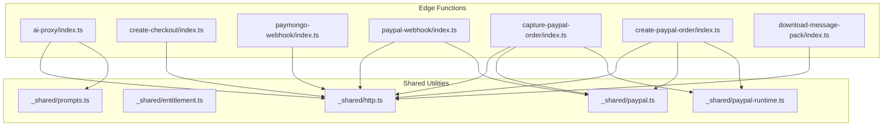
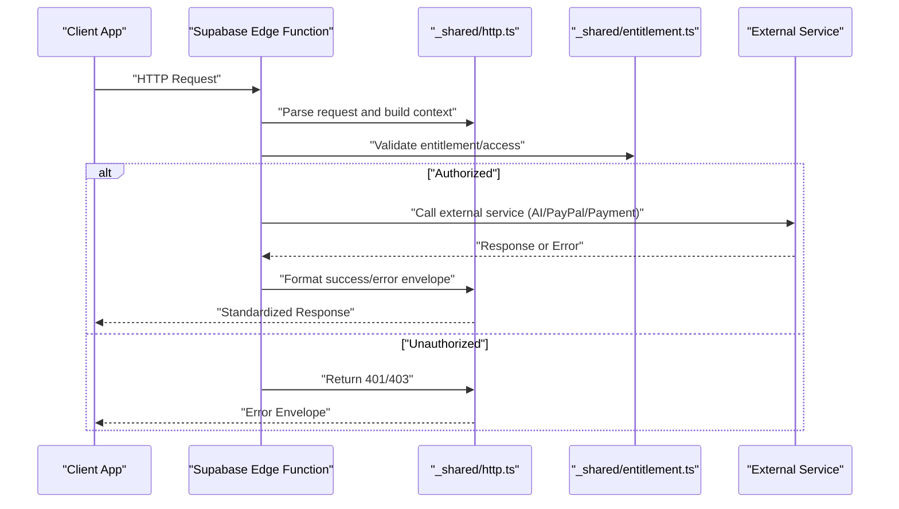
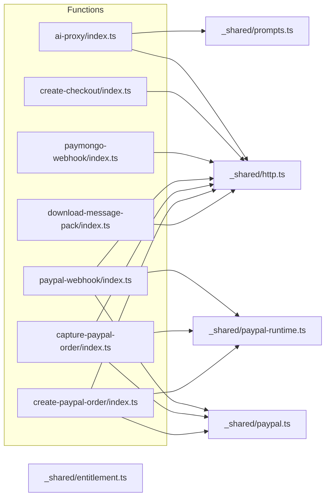

# Edge Functions

<cite>
**Referenced Files in This Document**
- [supabase/functions/ai-proxy/index.ts](file://supabase/functions/ai-proxy/index.ts)
- [supabase/functions/create-checkout/index.ts](file://supabase/functions/create-checkout/index.ts)
- [supabase/functions/paymongo-webhook/index.ts](file://supabase/functions/paymongo-webhook/index.ts)
- [supabase/functions/paypal-webhook/index.ts](file://supabase/functions/paypal-webhook/index.ts)
- [supabase/functions/capture-paypal-order/index.ts](file://supabase/functions/capture-paypal-order/index.ts)
- [supabase/functions/create-paypal-order/index.ts](file://supabase/functions/create-paypal-order/index.ts)
- [supabase/functions/download-message-pack/index.ts](file://supabase/functions/download-message-pack/index.ts)
- [supabase/functions/_shared/http.ts](file://supabase/functions/_shared/http.ts)
- [supabase/functions/_shared/entitlement.ts](file://supabase/functions/_shared/entitlement.ts)
- [supabase/functions/_shared/paypal.ts](file://supabase/functions/_shared/paypal.ts)
- [supabase/functions/_shared/paypal-runtime.ts](file://supabase/functions/_shared/paypal-runtime.ts)
- [supabase/functions/_shared/prompts.ts](file://supabase/functions/_shared/prompts.ts)
- [supabase/config.toml](file://supabase/config.toml)
</cite>

## Table of Contents
1. [Introduction](#introduction)
2. [Project Structure](#project-structure)
3. [Core Components](#core-components)
4. [Architecture Overview](#architecture-overview)
5. [Detailed Component Analysis](#detailed-component-analysis)
6. [Dependency Analysis](#dependency-analysis)
7. [Performance Considerations](#performance-considerations)
8. [Troubleshooting Guide](#troubleshooting-guide)
9. [Conclusion](#conclusion)

## Introduction
This document describes the Supabase Edge Functions architecture for the project, focusing on serverless endpoints that power AI resume analysis, payment checkout creation, webhook handling for PayMongo and PayPal, and data export utilities. It explains request/response formats, integration patterns, authentication middleware, error handling strategies, rate limiting approaches, and security considerations. It also provides guidance on how to invoke functions from clients, validate parameters, and format responses consistently.

## Project Structure
The Edge Functions are organized under supabase/functions with a shared utilities layer under _shared. Each function is a self-contained entry point implementing a specific responsibility:
- ai-proxy: Proxies requests to an AI provider for resume analysis.
- create-checkout: Creates payment checkouts via supported providers.
- paymongo-webhook: Handles PayMongo webhook events.
- paypal-webhook: Handles PayPal webhook events.
- capture-paypal-order: Captures PayPal orders after payment authorization.
- create-paypal-order: Creates PayPal orders for checkout flows.
- download-message-pack: Exports application messages as MessagePack.

**Diagram sources**
- [supabase/functions/ai-proxy/index.ts](file://supabase/functions/ai-proxy/index.ts)
- [supabase/functions/create-checkout/index.ts](file://supabase/functions/create-checkout/index.ts)
- [supabase/functions/paymongo-webhook/index.ts](file://supabase/functions/paymongo-webhook/index.ts)
- [supabase/functions/paypal-webhook/index.ts](file://supabase/functions/paypal-webhook/index.ts)
- [supabase/functions/capture-paypal-order/index.ts](file://supabase/functions/capture-paypal-order/index.ts)
- [supabase/functions/create-paypal-order/index.ts](file://supabase/functions/create-paypal-order/index.ts)
- [supabase/functions/download-message-pack/index.ts](file://supabase/functions/download-message-pack/index.ts)
- [supabase/functions/_shared/http.ts](file://supabase/functions/_shared/http.ts)
- [supabase/functions/_shared/entitlement.ts](file://supabase/functions/_shared/entitlement.ts)
- [supabase/functions/_shared/paypal.ts](file://supabase/functions/_shared/paypal.ts)
- [supabase/functions/_shared/paypal-runtime.ts](file://supabase/functions/_shared/paypal-runtime.ts)
- [supabase/functions/_shared/prompts.ts](file://supabase/functions/_shared/prompts.ts)

**Section sources**
- [supabase/config.toml](file://supabase/config.toml)

## Core Components
- HTTP utility: Centralized helpers for constructing responses, parsing JSON, and standardizing error shapes across functions.
- Entitlement helper: Validates user access and feature flags used by protected endpoints.
- PayPal SDK/runtime: Encapsulates PayPal API calls and runtime configuration for order creation and capture.
- Prompts: Shared prompt templates used by the AI proxy for resume analysis.

Key responsibilities:
- Consistent response formatting (success/error envelopes).
- Centralized validation and error mapping.
- Secure credential management via environment variables.
- Reusable business logic for entitlement checks and payment operations.

**Section sources**
- [supabase/functions/_shared/http.ts](file://supabase/functions/_shared/http.ts)
- [supabase/functions/_shared/entitlement.ts](file://supabase/functions/_shared/entitlement.ts)
- [supabase/functions/_shared/paypal.ts](file://supabase/functions/_shared/paypal.ts)
- [supabase/functions/_shared/paypal-runtime.ts](file://supabase/functions/_shared/paypal-runtime.ts)
- [supabase/functions/_shared/prompts.ts](file://supabase/functions/_shared/prompts.ts)

## Architecture Overview
The system follows a clear separation between function handlers and shared utilities:
- Handlers receive HTTP requests, validate inputs, enforce authentication/entitlements, call external services, and return standardized responses.
- Shared modules encapsulate cross-cutting concerns like HTTP response shaping, PayPal integrations, and entitlement checks.

**Diagram sources**
- [supabase/functions/_shared/http.ts](file://supabase/functions/_shared/http.ts)
- [supabase/functions/_shared/entitlement.ts](file://supabase/functions/_shared/entitlement.ts)

## Detailed Component Analysis

### AI Proxy Function (Resume Analysis)
Purpose:
- Accepts resume content and analysis prompts, forwards them to an AI provider, and returns structured analysis results.

Request format:
- Method: POST
- Headers: Authorization (Bearer token), Content-Type: application/json
- Body fields:
  - resume_text: string
  - prompt_id: string (selects template from shared prompts)
  - options: object (optional; e.g., tone, focus areas)

Response format:
- Success: { status: "ok", result: object }
- Error: { status: "error", code: string, message: string }

Integration pattern:
- Validates input using shared utilities.
- Loads prompt template from shared prompts.
- Calls AI provider with sanitized payload.
- Normalizes errors and returns consistent envelope.

Security considerations:
- Validate and sanitize resume text length and characters.
- Rate limit per-user to prevent abuse.
- Redact sensitive data before sending to AI provider.

Invocation example (conceptual):
- POST /functions/v1/ai-proxy with Authorization header and JSON body containing resume_text and prompt_id.

**Section sources**
- [supabase/functions/ai-proxy/index.ts](file://supabase/functions/ai-proxy/index.ts)
- [supabase/functions/_shared/prompts.ts](file://supabase/functions/_shared/prompts.ts)
- [supabase/functions/_shared/http.ts](file://supabase/functions/_shared/http.ts)

### Create Checkout Function
Purpose:
- Creates a payment checkout session based on selected provider (PayMongo or PayPal).

Request format:
- Method: POST
- Headers: Authorization (Bearer token), Content-Type: application/json
- Body fields:
  - provider: "paymongo" | "paypal"
  - amount: number
  - currency: string
  - metadata: object (optional; e.g., user_id, plan_id)

Response format:
- Success: { status: "ok", checkout_url: string, id: string }
- Error: { status: "error", code: string, message: string }

Integration pattern:
- Validates provider-specific parameters.
- Delegates to provider-specific logic (PayMongo or PayPal).
- Returns a secure checkout URL or order ID.

Rate limiting:
- Apply per-user limits to prevent spammy checkout creation.

**Section sources**
- [supabase/functions/create-checkout/index.ts](file://supabase/functions/create-checkout/index.ts)
- [supabase/functions/_shared/http.ts](file://supabase/functions/_shared/http.ts)

### PayMongo Webhook Handler
Purpose:
- Receives PayMongo webhook events, verifies signatures, updates subscription/payment state, and acknowledges receipt.

Request format:
- Method: POST
- Headers: X-PayMongo-Signature
- Body: PayMongo event payload

Processing steps:
- Verify signature using shared HTTP utilities.
- Parse event type and payload.
- Update internal state (e.g., subscription status, payment records).
- Return 200 OK upon successful processing.

Error handling:
- Log invalid signatures and malformed payloads.
- Return appropriate HTTP status codes for retries.

**Section sources**
- [supabase/functions/paymongo-webhook/index.ts](file://supabase/functions/paymongo-webhook/index.ts)
- [supabase/functions/_shared/http.ts](file://supabase/functions/_shared/http.ts)

### PayPal Webhook Handler
Purpose:
- Processes PayPal webhook events, validates signatures, reconciles payments, and updates entitlements.

Request format:
- Method: POST
- Headers: Authorization-Authorization, Webhook-ID, Webhook-Signature
- Body: PayPal event payload

Processing steps:
- Validate webhook signature and IDs.
- Handle event types (e.g., payment.capture.completed).
- Update order and user entitlements accordingly.
- Acknowledge with 200 OK.

Error handling:
- Reject unknown or invalid events.
- Provide detailed error logs for debugging.

**Section sources**
- [supabase/functions/paypal-webhook/index.ts](file://supabase/functions/paypal-webhook/index.ts)
- [supabase/functions/_shared/http.ts](file://supabase/functions/_shared/http.ts)

### Capture PayPal Order
Purpose:
- Captures an authorized PayPal order to finalize payment.

Request format:
- Method: POST
- Headers: Authorization (Bearer token), Content-Type: application/json
- Body fields:
  - order_id: string

Response format:
- Success: { status: "ok", capture_id: string, amount: number }
- Error: { status: "error", code: string, message: string }

Integration pattern:
- Uses PayPal runtime and SDK to capture the order.
- Updates local records and notifies client.

**Section sources**
- [supabase/functions/capture-paypal-order/index.ts](file://supabase/functions/capture-paypal-order/index.ts)
- [supabase/functions/_shared/paypal.ts](file://supabase/functions/_shared/paypal.ts)
- [supabase/functions/_shared/paypal-runtime.ts](file://supabase/functions/_shared/paypal-runtime.ts)
- [supabase/functions/_shared/http.ts](file://supabase/functions/_shared/http.ts)

### Create PayPal Order
Purpose:
- Creates a PayPal order for checkout flows.

Request format:
- Method: POST
- Headers: Authorization (Bearer token), Content-Type: application/json
- Body fields:
  - amount: number
  - currency: string
  - metadata: object (optional)

Response format:
- Success: { status: "ok", order_id: string, approve_url: string }
- Error: { status: "error", code: string, message: string }

Integration pattern:
- Builds PayPal order payload using shared PayPal utilities.
- Returns approval URL for client redirection.

**Section sources**
- [supabase/functions/create-paypal-order/index.ts](file://supabase/functions/create-paypal-order/index.ts)
- [supabase/functions/_shared/paypal.ts](file://supabase/functions/_shared/paypal.ts)
- [supabase/functions/_shared/paypal-runtime.ts](file://supabase/functions/_shared/paypal-runtime.ts)
- [supabase/functions/_shared/http.ts](file://supabase/functions/_shared/http.ts)

### Download Message Pack Utility
Purpose:
- Exports application messages as a MessagePack file for offline use or analytics.

Request format:
- Method: GET
- Headers: Authorization (Bearer token)
- Query params:
  - format: "msgpack"
  - filters: optional (e.g., date range, categories)

Response format:
- Success: Binary MessagePack stream
- Error: { status: "error", code: string, message: string }

Security considerations:
- Ensure only authenticated users can download exports.
- Validate filter parameters to prevent excessive queries.

**Section sources**
- [supabase/functions/download-message-pack/index.ts](file://supabase/functions/download-message-pack/index.ts)
- [supabase/functions/_shared/http.ts](file://supabase/functions/_shared/http.ts)

## Dependency Analysis
Functions rely on shared utilities for HTTP handling, entitlement checks, and PayPal integrations. The following diagram shows dependencies among functions and shared modules.

**Diagram sources**
- [supabase/functions/ai-proxy/index.ts](file://supabase/functions/ai-proxy/index.ts)
- [supabase/functions/create-checkout/index.ts](file://supabase/functions/create-checkout/index.ts)
- [supabase/functions/paymongo-webhook/index.ts](file://supabase/functions/paymongo-webhook/index.ts)
- [supabase/functions/paypal-webhook/index.ts](file://supabase/functions/paypal-webhook/index.ts)
- [supabase/functions/capture-paypal-order/index.ts](file://supabase/functions/capture-paypal-order/index.ts)
- [supabase/functions/create-paypal-order/index.ts](file://supabase/functions/create-paypal-order/index.ts)
- [supabase/functions/download-message-pack/index.ts](file://supabase/functions/download-message-pack/index.ts)
- [supabase/functions/_shared/http.ts](file://supabase/functions/_shared/http.ts)
- [supabase/functions/_shared/entitlement.ts](file://supabase/functions/_shared/entitlement.ts)
- [supabase/functions/_shared/paypal.ts](file://supabase/functions/_shared/paypal.ts)
- [supabase/functions/_shared/paypal-runtime.ts](file://supabase/functions/_shared/paypal-runtime.ts)
- [supabase/functions/_shared/prompts.ts](file://supabase/functions/_shared/prompts.ts)

**Section sources**
- [supabase/functions/_shared/http.ts](file://supabase/functions/_shared/http.ts)
- [supabase/functions/_shared/entitlement.ts](file://supabase/functions/_shared/entitlement.ts)
- [supabase/functions/_shared/paypal.ts](file://supabase/functions/_shared/paypal.ts)
- [supabase/functions/_shared/paypal-runtime.ts](file://supabase/functions/_shared/paypal-runtime.ts)
- [supabase/functions/_shared/prompts.ts](file://supabase/functions/_shared/prompts.ts)

## Performance Considerations
- Minimize payload sizes: compress large bodies where possible and avoid unnecessary fields.
- Cache frequently accessed data: use in-memory caches within function lifecycle for short-lived optimizations.
- Batch external calls: group API requests when feasible to reduce latency.
- Use streaming for large exports: handle binary streams efficiently to avoid memory spikes.
- Implement retry with exponential backoff for transient failures in external services.

[No sources needed since this section provides general guidance]

## Troubleshooting Guide
Common issues and resolutions:
- Invalid webhook signatures: verify secret keys and ensure headers are forwarded correctly.
- Malformed request bodies: validate JSON schema and provide descriptive error messages.
- Unauthorized access: confirm Authorization headers and token validity.
- External service timeouts: implement retries and circuit breakers; log detailed error contexts.
- Rate limit exceeded: adjust limits per user tier and communicate quotas to clients.

Operational tips:
- Enable structured logging for all function invocations.
- Monitor error rates and latency percentiles.
- Use health checks to detect degraded states.

**Section sources**
- [supabase/functions/_shared/http.ts](file://supabase/functions/_shared/http.ts)
- [supabase/functions/_shared/entitlement.ts](file://supabase/functions/_shared/entitlement.ts)

## Conclusion
The Supabase Edge Functions architecture cleanly separates handler logic from shared utilities, enabling consistent request/response handling, robust error management, and secure integrations with AI and payment providers. By adhering to standardized patterns for validation, authentication, and response formatting, the system remains maintainable and scalable. Follow the invocation examples and security guidelines to integrate clients effectively and mitigate risks.

[No sources needed since this section summarizes without analyzing specific files]