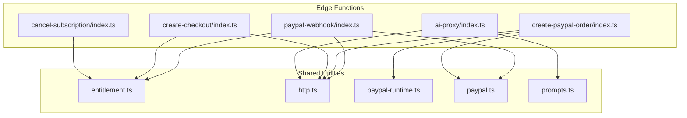
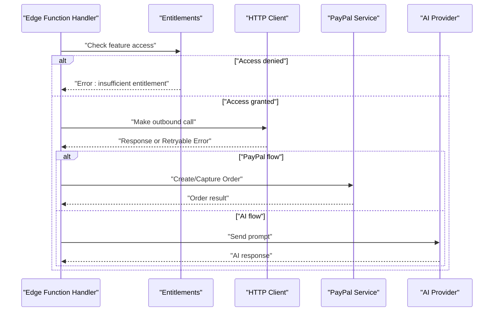
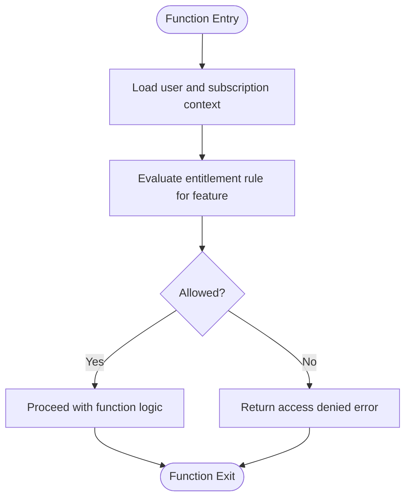
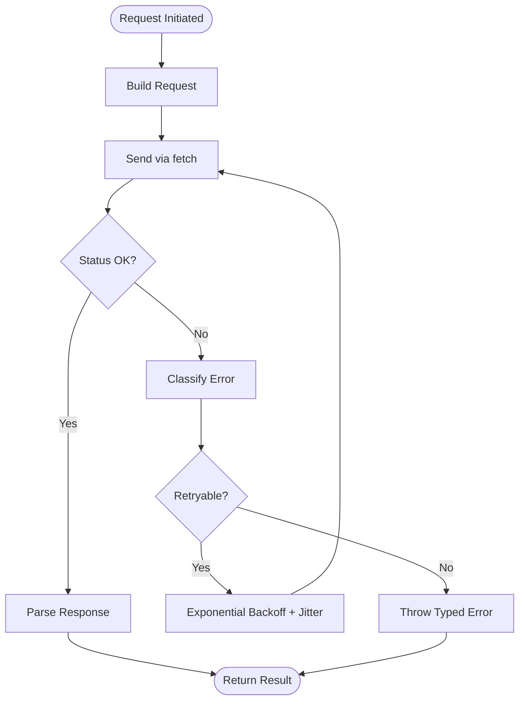
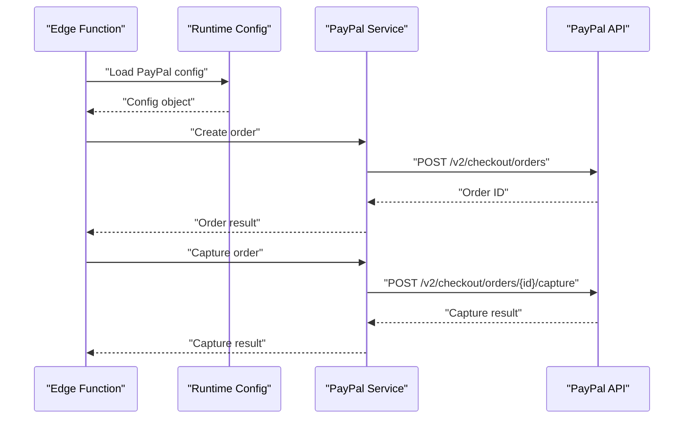
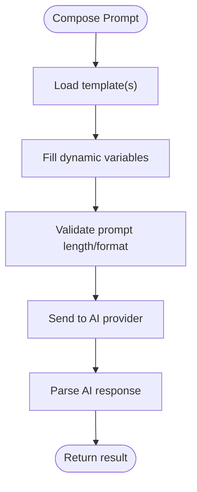
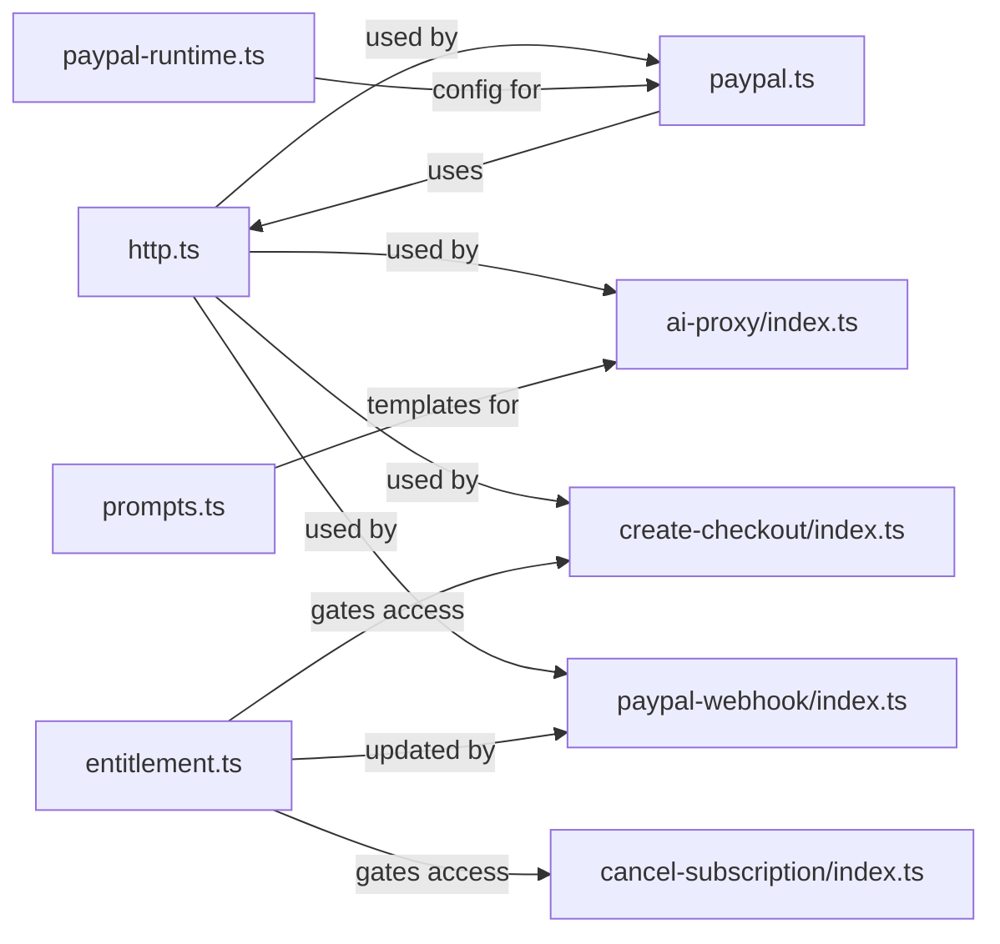

# Shared Utilities Library

<cite>
**Referenced Files in This Document**
- [entitlement.ts](file://supabase/functions/_shared/entitlement.ts)
- [http.ts](file://supabase/functions/_shared/http.ts)
- [paypal-runtime.ts](file://supabase/functions/_shared/paypal-runtime.ts)
- [paypal.ts](file://supabase/functions/_shared/paypal.ts)
- [prompts.ts](file://supabase/functions/_shared/prompts.ts)
- [index.ts (ai-proxy)](file://supabase/functions/ai-proxy/index.ts)
- [index.ts (cancel-subscription)](file://supabase/functions/cancel-subscription/index.ts)
- [index.ts (create-checkout)](file://supabase/functions/create-checkout/index.ts)
- [index.ts (create-paypal-order)](file://supabase/functions/create-paypal-order/index.ts)
- [index.ts (paypal-webhook)](file://supabase/functions/paypal-webhook/index.ts)
</cite>

## Table of Contents
1. [Introduction](#introduction)
2. [Project Structure](#project-structure)
3. [Core Components](#core-components)
4. [Architecture Overview](#architecture-overview)
5. [Detailed Component Analysis](#detailed-component-analysis)
6. [Dependency Analysis](#dependency-analysis)
7. [Performance Considerations](#performance-considerations)
8. [Troubleshooting Guide](#troubleshooting-guide)
9. [Conclusion](#conclusion)
10. [Appendices](#appendices)

## Introduction
This document describes the shared utilities library used across all Edge Functions. It focuses on:
- Entitlement management for feature access control
- HTTP client wrapper with retry logic and error handling
- PayPal SDK integration with runtime configuration
- Prompt management system for AI interactions
- Common utility functions, configuration management, logging patterns, and testing utilities
- Usage examples showing how to import and use these shared modules in custom functions

The goal is to provide a clear, practical guide for developers building or extending Edge Functions that rely on these shared capabilities.

## Project Structure
The shared utilities live under supabase/functions/_shared and are consumed by individual Edge Function handlers. The key files are:
- entitlement.ts: Feature entitlement checks and caching
- http.ts: Typed HTTP client with retries and standardized errors
- paypal-runtime.ts: Runtime configuration loader for PayPal
- paypal.ts: PayPal SDK operations (orders, captures, webhooks)
- prompts.ts: Centralized prompt templates and helpers for AI calls

**Diagram sources**
- [entitlement.ts](file://supabase/functions/_shared/entitlement.ts)
- [http.ts](file://supabase/functions/_shared/http.ts)
- [paypal-runtime.ts](file://supabase/functions/_shared/paypal-runtime.ts)
- [paypal.ts](file://supabase/functions/_shared/paypal.ts)
- [prompts.ts](file://supabase/functions/_shared/prompts.ts)
- [index.ts (ai-proxy)](file://supabase/functions/ai-proxy/index.ts)
- [index.ts (cancel-subscription)](file://supabase/functions/cancel-subscription/index.ts)
- [index.ts (create-checkout)](file://supabase/functions/create-checkout/index.ts)
- [index.ts (create-paypal-order)](file://supabase/functions/create-paypal-order/index.ts)
- [index.ts (paypal-webhook)](file://supabase/functions/paypal-webhook/index.ts)

**Section sources**
- [entitlement.ts](file://supabase/functions/_shared/entitlement.ts)
- [http.ts](file://supabase/functions/_shared/http.ts)
- [paypal-runtime.ts](file://supabase/functions/_shared/paypal-runtime.ts)
- [paypal.ts](file://supabase/functions/_shared/paypal.ts)
- [prompts.ts](file://supabase/functions/_shared/prompts.ts)
- [index.ts (ai-proxy)](file://supabase/functions/ai-proxy/index.ts)
- [index.ts (cancel-subscription)](file://supabase/functions/cancel-subscription/index.ts)
- [index.ts (create-checkout)](file://supabase/functions/create-checkout/index.ts)
- [index.ts (create-paypal-order)](file://supabase/functions/create-paypal-order/index.ts)
- [index.ts (paypal-webhook)](file://supabase/functions/paypal-webhook/index.ts)

## Core Components
- Entitlements: Provides feature gating based on user subscriptions and plan attributes. Includes caching strategies and consistent error responses.
- HTTP Client: A typed wrapper around fetch with exponential backoff, jitter, and categorized error types.
- PayPal Integration: Loads environment-specific runtime config and exposes order creation, capture, and webhook processing helpers.
- Prompts: Centralizes prompt templates and parameterization for AI interactions.

Usage pattern in an Edge Function:
- Import only what you need from _shared
- Initialize any required runtime configuration once at module scope
- Use typed request/response objects to ensure consistency

**Section sources**
- [entitlement.ts](file://supabase/functions/_shared/entitlement.ts)
- [http.ts](file://supabase/functions/_shared/http.ts)
- [paypal-runtime.ts](file://supabase/functions/_shared/paypal-runtime.ts)
- [paypal.ts](file://supabase/functions/_shared/paypal.ts)
- [prompts.ts](file://supabase/functions/_shared/prompts.ts)

## Architecture Overview
The shared utilities form a cohesive layer between Edge Function handlers and external systems (PayPal, AI providers). They standardize:
- Configuration loading
- Network behavior (retries, timeouts, error mapping)
- Access control (entitlements)
- Prompt templating for AI

[No sources needed since this diagram shows conceptual workflow, not actual code structure]

## Detailed Component Analysis

### Entitlement Management System
Purpose:
- Determine whether a user has access to a specific feature based on subscription state and plan attributes
- Provide consistent error semantics and optional caching to reduce repeated checks

Key responsibilities:
- Resolve user identity and subscription context
- Evaluate entitlement rules per feature
- Cache results when appropriate
- Return structured success/failure responses

Typical usage in an Edge Function:
- Import the entitlement checker
- Call it early in the handler to gate access
- Handle both allowed and denied paths

**Diagram sources**
- [entitlement.ts](file://supabase/functions/_shared/entitlement.ts)

**Section sources**
- [entitlement.ts](file://supabase/functions/_shared/entitlement.ts)

### HTTP Client Wrapper with Retry Logic and Error Handling
Purpose:
- Standardize outbound HTTP calls across Edge Functions
- Implement robust retry policies with exponential backoff and jitter
- Normalize network and application errors into typed responses

Key responsibilities:
- Build requests with headers, body, and timeout settings
- Apply retry policy for transient failures
- Map server and transport errors to consistent types
- Expose typed request/response interfaces

Typical usage in an Edge Function:
- Import the HTTP client
- Configure base URL and default options
- Perform GET/POST/PUT/DELETE with typed payloads
- Handle retryable vs non-retryable errors explicitly

**Diagram sources**
- [http.ts](file://supabase/functions/_shared/http.ts)

**Section sources**
- [http.ts](file://supabase/functions/_shared/http.ts)

### PayPal SDK Integration with Runtime Configuration
Purpose:
- Load PayPal credentials and endpoints from runtime configuration
- Provide helpers for creating orders, capturing payments, and processing webhooks
- Keep sensitive configuration out of source code

Key responsibilities:
- Read environment variables safely at runtime
- Initialize PayPal client with correct mode (sandbox/live)
- Encapsulate common PayPal flows with typed inputs/outputs
- Surface detailed error information for debugging

Typical usage in an Edge Function:
- Import runtime config and PayPal service
- Create or capture orders using provided helpers
- Validate and process webhook events securely

**Diagram sources**
- [paypal-runtime.ts](file://supabase/functions/_shared/paypal-runtime.ts)
- [paypal.ts](file://supabase/functions/_shared/paypal.ts)

**Section sources**
- [paypal-runtime.ts](file://supabase/functions/_shared/paypal-runtime.ts)
- [paypal.ts](file://supabase/functions/_shared/paypal.ts)

### Prompt Management System for AI Interactions
Purpose:
- Centralize prompt templates and parameters for AI calls
- Ensure consistent tone, structure, and safety constraints
- Simplify composition of complex prompts from reusable parts

Key responsibilities:
- Define prompt templates and sections
- Compose final prompts with dynamic values
- Provide helpers for validation and formatting
- Integrate with the HTTP client to call AI providers

Typical usage in an Edge Function:
- Import prompt builders
- Compose a prompt with user context
- Send to AI provider via HTTP client
- Parse and return structured results

**Diagram sources**
- [prompts.ts](file://supabase/functions/_shared/prompts.ts)

**Section sources**
- [prompts.ts](file://supabase/functions/_shared/prompts.ts)

### Example Edge Function Integrations
Below are representative integrations demonstrating how Edge Functions consume the shared utilities. These are illustrative patterns; adapt names and shapes to your implementation.

- ai-proxy/index.ts
  - Imports prompts and HTTP client
  - Builds a prompt using the prompt manager
  - Calls AI provider via HTTP client
  - Returns structured AI response

- create-paypal-order/index.ts
  - Loads PayPal runtime config
  - Creates an order via PayPal service
  - Returns order details to caller

- paypal-webhook/index.ts
  - Validates webhook signature
  - Processes event using PayPal service
  - Updates entitlements if necessary

- cancel-subscription/index.ts
  - Checks entitlement before proceeding
  - Performs cancellation flow
  - Returns confirmation

- create-checkout/index.ts
  - Verifies entitlement
  - Uses HTTP client to initiate checkout
  - Returns checkout session or error

**Section sources**
- [index.ts (ai-proxy)](file://supabase/functions/ai-proxy/index.ts)
- [index.ts (create-paypal-order)](file://supabase/functions/create-paypal-order/index.ts)
- [index.ts (paypal-webhook)](file://supabase/functions/paypal-webhook/index.ts)
- [index.ts (cancel-subscription)](file://supabase/functions/cancel-subscription/index.ts)
- [index.ts (create-checkout)](file://supabase/functions/create-checkout/index.ts)

## Dependency Analysis
The shared utilities have minimal coupling and are designed for reuse across multiple Edge Functions.

**Diagram sources**
- [http.ts](file://supabase/functions/_shared/http.ts)
- [paypal.ts](file://supabase/functions/_shared/paypal.ts)
- [paypal-runtime.ts](file://supabase/functions/_shared/paypal-runtime.ts)
- [entitlement.ts](file://supabase/functions/_shared/entitlement.ts)
- [prompts.ts](file://supabase/functions/_shared/prompts.ts)
- [index.ts (ai-proxy)](file://supabase/functions/ai-proxy/index.ts)
- [index.ts (cancel-subscription)](file://supabase/functions/cancel-subscription/index.ts)
- [index.ts (create-checkout)](file://supabase/functions/create-checkout/index.ts)
- [index.ts (paypal-webhook)](file://supabase/functions/paypal-webhook/index.ts)

**Section sources**
- [http.ts](file://supabase/functions/_shared/http.ts)
- [paypal.ts](file://supabase/functions/_shared/paypal.ts)
- [paypal-runtime.ts](file://supabase/functions/_shared/paypal-runtime.ts)
- [entitlement.ts](file://supabase/functions/_shared/entitlement.ts)
- [prompts.ts](file://supabase/functions/_shared/prompts.ts)
- [index.ts (ai-proxy)](file://supabase/functions/ai-proxy/index.ts)
- [index.ts (cancel-subscription)](file://supabase/functions/cancel-subscription/index.ts)
- [index.ts (create-checkout)](file://supabase/functions/create-checkout/index.ts)
- [index.ts (paypal-webhook)](file://supabase/functions/paypal-webhook/index.ts)

## Performance Considerations
- Entitlement caching: Avoid redundant checks by caching recent results where safe.
- HTTP retries: Tune backoff and jitter to balance resilience and latency.
- Prompt size: Keep prompts concise to reduce token usage and improve response times.
- PayPal calls: Minimize round-trips by batching operations when possible.
- Cold starts: Initialize heavy dependencies lazily if they are not always used.

[No sources needed since this section provides general guidance]

## Troubleshooting Guide
Common issues and resolutions:
- Insufficient entitlement: Verify user subscription state and entitlement rules. Check logs for denied paths.
- HTTP retry storms: Reduce retry counts or increase backoff caps; inspect upstream availability.
- PayPal config errors: Ensure runtime environment variables are set correctly for sandbox/live modes.
- Webhook verification failures: Confirm secret keys and payload signatures match expected formats.
- AI provider timeouts: Adjust timeouts and consider prompt simplification.

Operational tips:
- Log contextual identifiers (user IDs, order IDs) consistently.
- Wrap third-party calls with explicit error categorization.
- Add health checks for critical dependencies.

**Section sources**
- [entitlement.ts](file://supabase/functions/_shared/entitlement.ts)
- [http.ts](file://supabase/functions/_shared/http.ts)
- [paypal-runtime.ts](file://supabase/functions/_shared/paypal-runtime.ts)
- [paypal.ts](file://supabase/functions/_shared/paypal.ts)
- [prompts.ts](file://supabase/functions/_shared/prompts.ts)

## Conclusion
The shared utilities library standardizes cross-cutting concerns across Edge Functions:
- Entitlements enforce feature access consistently
- The HTTP client ensures resilient networking
- PayPal integration abstracts payment flows and configuration
- Prompt management centralizes AI interaction patterns

Adopting these modules improves reliability, maintainability, and developer productivity.

[No sources needed since this section summarizes without analyzing specific files]

## Appendices

### Quick Start: Using Shared Modules in Your Edge Function
- Import the modules you need from _shared
- Initialize runtime configuration once at module scope
- Gate access with entitlements before performing sensitive operations
- Use the HTTP client for outbound calls with typed requests/responses
- Compose prompts using the prompt manager for AI features
- Handle errors using the standardized error types

Example references:
- [index.ts (ai-proxy)](file://supabase/functions/ai-proxy/index.ts)
- [index.ts (create-paypal-order)](file://supabase/functions/create-paypal-order/index.ts)
- [index.ts (paypal-webhook)](file://supabase/functions/paypal-webhook/index.ts)
- [index.ts (cancel-subscription)](file://supabase/functions/cancel-subscription/index.ts)
- [index.ts (create-checkout)](file://supabase/functions/create-checkout/index.ts)

**Section sources**
- [index.ts (ai-proxy)](file://supabase/functions/ai-proxy/index.ts)
- [index.ts (create-paypal-order)](file://supabase/functions/create-paypal-order/index.ts)
- [index.ts (paypal-webhook)](file://supabase/functions/paypal-webhook/index.ts)
- [index.ts (cancel-subscription)](file://supabase/functions/cancel-subscription/index.ts)
- [index.ts (create-checkout)](file://supabase/functions/create-checkout/index.ts)