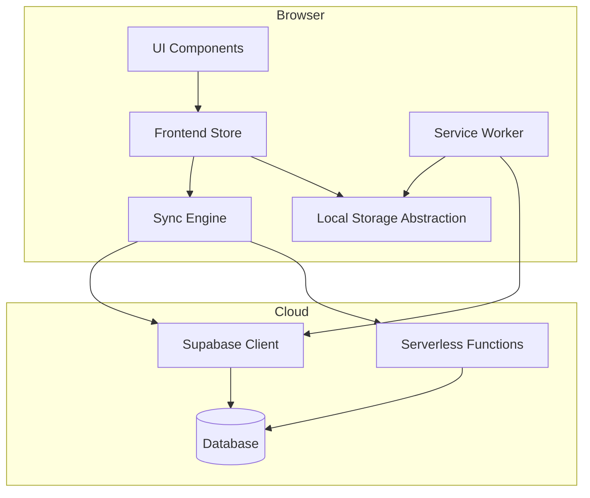
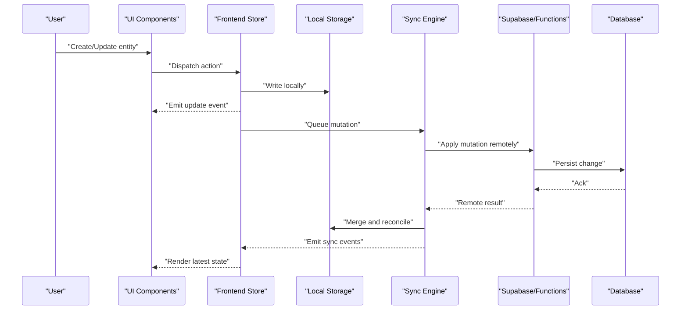
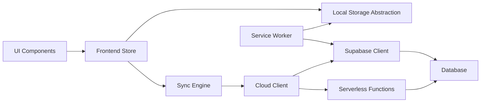

# Data Flow Architecture

<cite>
**Referenced Files in This Document**
- [src/lib/storage.js](file://src/lib/storage.js)
- [src/lib/sync.js](file://src/lib/sync.js)
- [src/lib/cloud.js](file://src/lib/cloud.js)
- [src/lib/supabase.js](file://src/lib/supabase.js)
- [src/store.jsx](file://src/store.jsx)
- [public/sw.js](file://public/sw.js)
- [supabase/functions/_shared/http.ts](file://supabase/functions/_shared/http.ts)
- [supabase/migrations/001_schema.sql](file://supabase/migrations/001_schema.sql)
</cite>

## Table of Contents
1. [Introduction](#introduction)
2. [Project Structure](#project-structure)
3. [Core Components](#core-components)
4. [Architecture Overview](#architecture-overview)
5. [Detailed Component Analysis](#detailed-component-analysis)
6. [Dependency Analysis](#dependency-analysis)
7. [Performance Considerations](#performance-considerations)
8. [Troubleshooting Guide](#troubleshooting-guide)
9. [Conclusion](#conclusion)

## Introduction
This document describes the end-to-end data flow architecture, covering the complete lifecycle from user input to local persistence and cloud synchronization. It explains real-time sync mechanisms, conflict resolution strategies, offline support, event-driven patterns, state synchronization protocols, and consistency guarantees. It also includes sequence diagrams for transformation pipelines, caching strategies, performance optimizations, validation, error recovery, and backup procedures.

## Project Structure
The application is a web-first app with optional mobile packaging. The data layer is implemented as modular libraries:
- Local storage abstraction
- Sync engine coordinating local state and remote changes
- Cloud client for Supabase and serverless functions
- Service Worker for offline caching and background tasks
- Frontend store wiring UI to the data layer

**Diagram sources**
- [src/store.jsx](file://src/store.jsx)
- [src/lib/storage.js](file://src/lib/storage.js)
- [src/lib/sync.js](file://src/lib/sync.js)
- [src/lib/cloud.js](file://src/lib/cloud.js)
- [src/lib/supabase.js](file://src/lib/supabase.js)
- [public/sw.js](file://public/sw.js)
- [supabase/functions/_shared/http.ts](file://supabase/functions/_shared/http.ts)
- [supabase/migrations/001_schema.sql](file://supabase/migrations/001_schema.sql)

**Section sources**
- [src/store.jsx](file://src/store.jsx)
- [src/lib/storage.js](file://src/lib/storage.js)
- [src/lib/sync.js](file://src/lib/sync.js)
- [src/lib/cloud.js](file://src/lib/cloud.js)
- [src/lib/supabase.js](file://src/lib/supabase.js)
- [public/sw.js](file://public/sw.js)
- [supabase/functions/_shared/http.ts](file://supabase/functions/_shared/http.ts)
- [supabase/migrations/001_schema.sql](file://supabase/migrations/001_schema.sql)

## Core Components
- Local Storage Abstraction: Provides a consistent interface for reading/writing entities locally, including versioning and change tracking.
- Sync Engine: Orchestrates bidirectional synchronization between local state and remote data, handling batching, retries, and conflict resolution.
- Cloud Client: Encapsulates Supabase client usage and calls to serverless functions for specialized operations (e.g., billing, AI proxy).
- Frontend Store: Centralized state container that exposes reactive APIs to components and coordinates sync triggers.
- Service Worker: Caches assets and API responses, intercepts network requests, and performs background sync when online.
- Serverless Functions: Stateless endpoints for sensitive or heavy operations, using shared HTTP utilities.

Key responsibilities:
- Validation at ingestion points (UI and storage)
- Event-driven updates via store subscriptions
- Conflict detection and resolution policies
- Offline-first behavior with queued mutations
- Real-time subscriptions for live updates

**Section sources**
- [src/lib/storage.js](file://src/lib/storage.js)
- [src/lib/sync.js](file://src/lib/sync.js)
- [src/lib/cloud.js](file://src/lib/cloud.js)
- [src/lib/supabase.js](file://src/lib/supabase.js)
- [src/store.jsx](file://src/store.jsx)
- [public/sw.js](file://public/sw.js)
- [supabase/functions/_shared/http.ts](file://supabase/functions/_shared/http.ts)

## Architecture Overview
The system follows an offline-first, event-driven architecture with a clear separation between UI, state, persistence, and sync layers.

**Diagram sources**
- [src/store.jsx](file://src/store.jsx)
- [src/lib/storage.js](file://src/lib/storage.js)
- [src/lib/sync.js](file://src/lib/sync.js)
- [src/lib/cloud.js](file://src/lib/cloud.js)
- [src/lib/supabase.js](file://src/lib/supabase.js)
- [supabase/migrations/001_schema.sql](file://supabase/migrations/001_schema.sql)

## Detailed Component Analysis

### Local Storage Abstraction
Responsibilities:
- Provide typed CRUD operations over local storage
- Maintain entity versions and timestamps for conflict detection
- Expose change listeners for downstream consumers
- Support batched writes and atomic transactions where possible

Data model highlights:
- Entities include unique identifiers, version counters, and last-modified timestamps
- Indexes are maintained for common queries to optimize reads

Validation:
- Input validation before persisting to ensure schema compliance
- Sanitization of user inputs to prevent corruption

Error handling:
- Graceful fallbacks on quota exceeded or storage unavailable
- Retry logic with exponential backoff for transient failures

Backup:
- Periodic export of critical entities to downloadable archives
- Incremental snapshots for faster restore

**Section sources**
- [src/lib/storage.js](file://src/lib/storage.js)

### Sync Engine
Responsibilities:
- Queue local mutations and apply them to the cloud
- Subscribe to remote changes and merge into local state
- Detect conflicts and apply resolution policies
- Manage connectivity state and retry scheduling

Real-time sync:
- Subscribes to relevant tables/channels for live updates
- Applies incremental patches to minimize re-renders

Conflict resolution:
- Last-write-wins with version checks
- Field-level merging for non-conflicting fields
- Fallback to manual resolution prompts when necessary

Offline support:
- Mutations are persisted locally until connectivity resumes
- Background sync attempts when connection is restored

Consistency guarantees:
- At-least-once delivery for mutations
- Idempotent operations keyed by operation IDs
- Eventual consistency across devices after reconciliation

**Section sources**
- [src/lib/sync.js](file://src/lib/sync.js)

### Cloud Client
Responsibilities:
- Wrap Supabase client initialization and configuration
- Provide typed methods for database operations
- Call serverless functions for sensitive or complex workflows

Integration points:
- Authentication context propagation
- Error normalization and retry policies
- Rate limiting and request deduplication

Security:
- Enforces RLS policies defined in migrations
- Uses short-lived tokens and secure headers

**Section sources**
- [src/lib/cloud.js](file://src/lib/cloud.js)
- [src/lib/supabase.js](file://src/lib/supabase.js)
- [supabase/migrations/001_schema.sql](file://supabase/migrations/001_schema.sql)

### Frontend Store
Responsibilities:
- Centralize application state and expose reactive APIs
- Dispatch actions and manage side effects
- Coordinate sync triggers and UI updates

Event-driven patterns:
- Publish/subscribe model for decoupled components
- Throttled debounced updates for performance

State synchronization protocol:
- Actions produce optimistic updates
- Sync results reconcile state and roll back on failure

**Section sources**
- [src/store.jsx](file://src/store.jsx)

### Service Worker
Responsibilities:
- Cache static assets and API responses
- Intercept network requests to serve cached content offline
- Perform background sync for pending mutations

Caching strategy:
- Stale-while-revalidate for list endpoints
- Cache-busting for immutable assets
- Priority queues for high-value resources

Background sync:
- Schedules retries for failed mutations
- Batches small mutations to reduce overhead

**Section sources**
- [public/sw.js](file://public/sw.js)

### Serverless Functions
Responsibilities:
- Host business logic requiring server-side access
- Integrate third-party services securely
- Provide standardized HTTP interfaces

Shared utilities:
- Common HTTP helpers for request/response handling
- Shared entitlement checks and prompt templates

**Section sources**
- [supabase/functions/_shared/http.ts](file://supabase/functions/_shared/http.ts)

## Dependency Analysis
The following diagram shows key dependencies among core modules.

**Diagram sources**
- [src/store.jsx](file://src/store.jsx)
- [src/lib/storage.js](file://src/lib/storage.js)
- [src/lib/sync.js](file://src/lib/sync.js)
- [src/lib/cloud.js](file://src/lib/cloud.js)
- [src/lib/supabase.js](file://src/lib/supabase.js)
- [public/sw.js](file://public/sw.js)
- [supabase/functions/_shared/http.ts](file://supabase/functions/_shared/http.ts)
- [supabase/migrations/001_schema.sql](file://supabase/migrations/001_schema.sql)

**Section sources**
- [src/store.jsx](file://src/store.jsx)
- [src/lib/storage.js](file://src/lib/storage.js)
- [src/lib/sync.js](file://src/lib/sync.js)
- [src/lib/cloud.js](file://src/lib/cloud.js)
- [src/lib/supabase.js](file://src/lib/supabase.js)
- [public/sw.js](file://public/sw.js)
- [supabase/functions/_shared/http.ts](file://supabase/functions/_shared/http.ts)
- [supabase/migrations/001_schema.sql](file://supabase/migrations/001_schema.sql)

## Performance Considerations
- Optimistic UI updates to reduce perceived latency
- Debounce/throttle frequent mutations to avoid excessive sync traffic
- Batched writes and merges to minimize storage I/O
- Selective subscriptions to limit real-time payload size
- Efficient caching in the service worker to reduce network round-trips
- Idempotent operations to prevent duplicate work during retries

[No sources needed since this section provides general guidance]

## Troubleshooting Guide
Common issues and resolutions:
- Network errors during sync:
  - Verify connectivity and retry schedule
  - Check rate limits and backoff settings
- Conflicts not resolving:
  - Inspect version fields and timestamps
  - Validate conflict resolution policy for affected entities
- Storage quota exceeded:
  - Trigger cleanup routines and archive old data
  - Prompt users to export and clear local cache
- Service Worker stale cache:
  - Invalidate caches for affected endpoints
  - Force refresh and re-validate resources
- Database permission errors:
  - Review RLS policies and function permissions
  - Ensure correct auth context propagation

Operational checks:
- Confirm subscription channels are active
- Validate migration status and schema compatibility
- Monitor function logs for server-side errors

**Section sources**
- [src/lib/sync.js](file://src/lib/sync.js)
- [src/lib/cloud.js](file://src/lib/cloud.js)
- [src/lib/supabase.js](file://src/lib/supabase.js)
- [public/sw.js](file://public/sw.js)
- [supabase/migrations/001_schema.sql](file://supabase/migrations/001_schema.sql)

## Conclusion
The data flow architecture emphasizes offline-first reliability, event-driven responsiveness, and robust synchronization with conflict resolution. By separating concerns across storage, sync, cloud, and UI layers, the system achieves scalability and maintainability while ensuring data consistency and resilience under adverse conditions.

[No sources needed since this section summarizes without analyzing specific files]