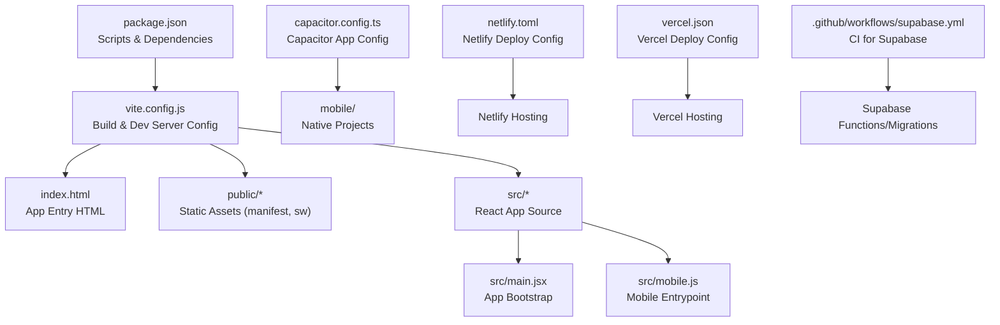
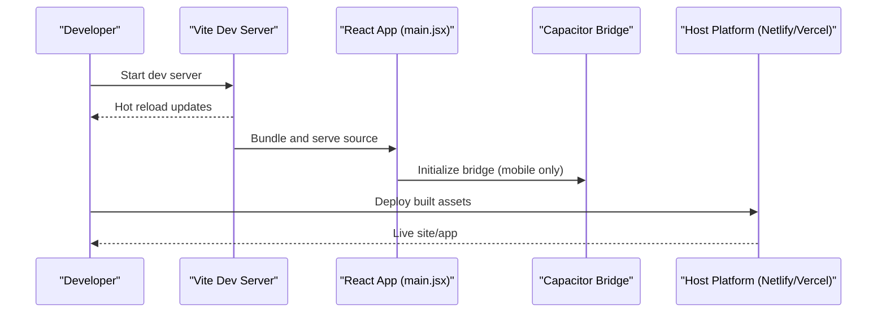
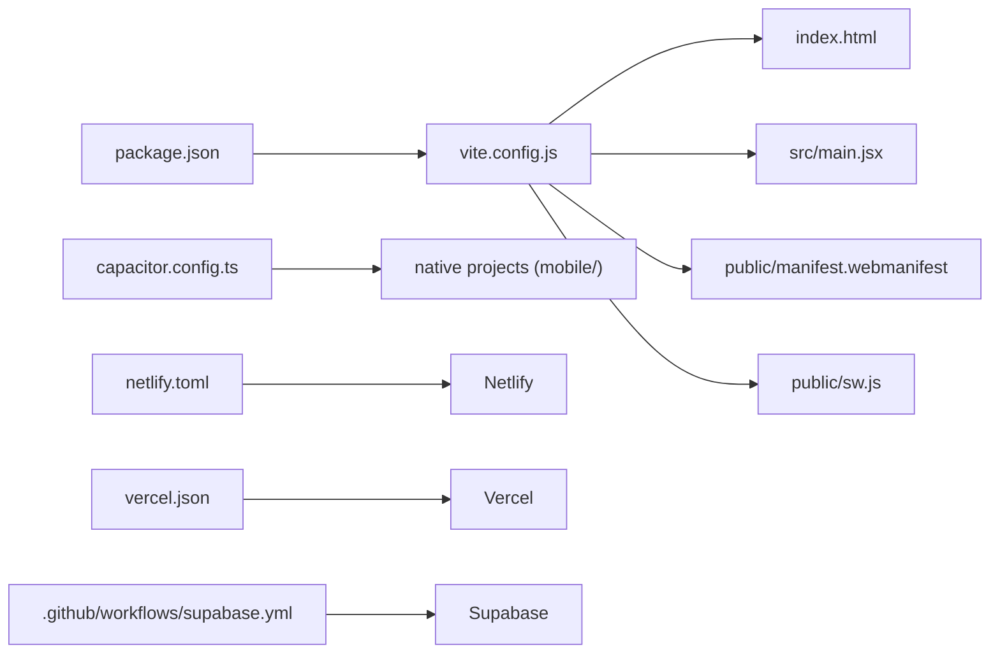

# Build & Development Configuration

<cite>
**Referenced Files in This Document**
- [package.json](file://package.json)
- [vite.config.js](file://vite.config.js)
- [capacitor.config.ts](file://capacitor.config.ts)
- [netlify.toml](file://netlify.toml)
- [vercel.json](file://vercel.json)
- [index.html](file://index.html)
- [public/manifest.webmanifest](file://public/manifest.webmanifest)
- [public/sw.js](file://public/sw.js)
- [src/main.jsx](file://src/main.jsx)
- [src/mobile.js](file://src/mobile.js)
- [.github/workflows/supabase.yml](file:///.github/workflows/supabase.yml)
</cite>

## Table of Contents
1. [Introduction](#introduction)
2. [Project Structure](#project-structure)
3. [Core Components](#core-components)
4. [Architecture Overview](#architecture-overview)
5. [Detailed Component Analysis](#detailed-component-analysis)
6. [Dependency Analysis](#dependency-analysis)
7. [Performance Considerations](#performance-considerations)
8. [Troubleshooting Guide](#troubleshooting-guide)
9. [Conclusion](#conclusion)
10. [Appendices](#appendices)

## Introduction
This document explains the build system and development configuration for the project, focusing on Vite-based web builds, Capacitor mobile app setup, deployment configurations for Netlify and Vercel, environment variable management, build scripts, dependency management, and best practices for performance and debugging. It is intended for developers who need to set up local development, run tests, build for production, and deploy across platforms consistently.

## Project Structure
The repository uses a modern frontend stack with Vite as the build tool, React components under src, and platform-specific integrations via Capacitor for mobile. Deployment targets include Netlify and Vercel, with CI defined for Supabase-related tasks.

**Diagram sources**
- [package.json](file://package.json)
- [vite.config.js](file://vite.config.js)
- [index.html](file://index.html)
- [public/manifest.webmanifest](file://public/manifest.webmanifest)
- [public/sw.js](file://public/sw.js)
- [src/main.jsx](file://src/main.jsx)
- [src/mobile.js](file://src/mobile.js)
- [capacitor.config.ts](file://capacitor.config.ts)
- [netlify.toml](file://netlify.toml)
- [vercel.json](file://vercel.json)
- [.github/workflows/supabase.yml](file:///.github/workflows/supabase.yml)

**Section sources**
- [package.json](file://package.json)
- [vite.config.js](file://vite.config.js)
- [index.html](file://index.html)
- [capacitor.config.ts](file://capacitor.config.ts)
- [netlify.toml](file://netlify.toml)
- [vercel.json](file://vercel.json)
- [.github/workflows/supabase.yml](file:///.github/workflows/supabase.yml)

## Core Components
- Build tooling: Vite configuration controls dev server behavior, asset handling, and production optimizations.
- Mobile integration: Capacitor config defines the native app wrapper and bridging settings.
- Deployment: Netlify and Vercel configuration files define redirects, rewrites, and build commands.
- Environment variables: Managed through Vite’s env loading conventions and runtime access patterns.
- Scripts: npm scripts orchestrate development, building, testing, and mobile workflows.

Key responsibilities:
- vite.config.js: Dev server options, plugins, asset optimization, output structure.
- capacitor.config.ts: App ID, name, webDir, and platform-specific options.
- netlify.toml and vercel.json: Routing rules, SPA fallbacks, build command overrides.
- package.json: Scripts, dependencies, and devDependencies.

**Section sources**
- [vite.config.js](file://vite.config.js)
- [capacitor.config.ts](file://capacitor.config.ts)
- [netlify.toml](file://netlify.toml)
- [vercel.json](file://vercel.json)
- [package.json](file://package.json)

## Architecture Overview
The application follows a standard Vite + React architecture with optional Capacitor mobile packaging. The build pipeline produces static assets served by hosting platforms. Environment variables are injected at build time or runtime depending on their naming convention.

**Diagram sources**
- [vite.config.js](file://vite.config.js)
- [src/main.jsx](file://src/main.jsx)
- [src/mobile.js](file://src/mobile.js)
- [capacitor.config.ts](file://capacitor.config.ts)
- [netlify.toml](file://netlify.toml)
- [vercel.json](file://vercel.json)

## Detailed Component Analysis

### Vite Configuration and Asset Optimization
Vite is configured to provide a fast development experience and optimized production builds. Typical areas covered include:
- Dev server options: port, open behavior, proxy settings if needed.
- Plugins: React support, path aliases, and any additional transformations.
- Build options: minification, code splitting, chunk sizing, sourcemaps.
- Asset handling: image, font, and media processing; public directory usage.
- Output structure: base path for deployments behind subpaths.

Best practices:
- Use environment-specific configs when necessary.
- Enable sourcemaps for production debugging where appropriate.
- Configure asset sizes and split points to improve load times.

**Section sources**
- [vite.config.js](file://vite.config.js)

### Capacitor Mobile App Configuration
Capacitor wraps the web build into native apps. Key configuration aspects:
- App identity: identifier and display name.
- Web directory: points to the Vite build output.
- Platform options: iOS and Android specific settings.
- Plugin initialization: how the app integrates with native features.

Development workflow:
- Build web assets first, then sync to native projects.
- Run on device or emulator using Capacitor CLI.
- Rebuild and resync after changes.

**Section sources**
- [capacitor.config.ts](file://capacitor.config.ts)
- [src/mobile.js](file://src/mobile.js)

### Deployment Configurations: Netlify and Vercel
Both platforms require SPA routing fallbacks and correct build commands.

Netlify:
- Build command: typically runs the Vite build script.
- Publish directory: points to the Vite output folder.
- Redirects/rewrites: ensure client-side routes resolve correctly.

Vercel:
- Build command: same as Netlify.
- Output directory: same as Netlify.
- Rewrites: configure SPA fallbacks for client routes.

Environment variables:
- Define required variables in each platform’s dashboard.
- Ensure Vite-compatible prefixes if used.

**Section sources**
- [netlify.toml](file://netlify.toml)
- [vercel.json](file://vercel.json)

### Environment Variable Management
Vite supports environment variables loaded from .env files. Common patterns:
- .env.local for local overrides.
- .env.development and .env.production for environment-specific values.
- Prefixing variables based on Vite’s exposure rules.

Runtime access:
- Access variables via the Vite-provided global object in the browser.
- Avoid exposing secrets; use server-side functions for sensitive operations.

CI considerations:
- Store secrets in platform secret managers.
- Inject variables during build steps.

**Section sources**
- [vite.config.js](file://vite.config.js)
- [package.json](file://package.json)

### Build Scripts and Dependency Management
npm scripts in package.json orchestrate common tasks:
- Development: start dev server with hot reloading.
- Build: generate production assets.
- Test: run unit/integration tests.
- Mobile: build web assets and sync to native projects.

Dependency management:
- Use package-lock.json to lock versions.
- Keep dependencies updated regularly.
- Separate devDependencies from runtime dependencies.

**Section sources**
- [package.json](file://package.json)

### Service Worker and PWA Assets
The public directory includes a service worker and manifest for PWA capabilities:
- manifest.webmanifest: app metadata for installability.
- sw.js: caching strategies and offline behavior.

Integration:
- Register the service worker from the app entrypoint.
- Ensure cache keys align with build outputs.

**Section sources**
- [public/manifest.webmanifest](file://public/manifest.webmanifest)
- [public/sw.js](file://public/sw.js)
- [src/main.jsx](file://src/main.jsx)

### CI Workflow for Supabase
A GitHub Actions workflow automates Supabase-related tasks such as migrations or function deployments. It ensures consistent backend state across environments.

**Section sources**
- [.github/workflows/supabase.yml](file:///.github/workflows/supabase.yml)

## Dependency Analysis
The following diagram shows how core configuration files relate to each other and to the build/deploy process.

**Diagram sources**
- [package.json](file://package.json)
- [vite.config.js](file://vite.config.js)
- [index.html](file://index.html)
- [src/main.jsx](file://src/main.jsx)
- [public/manifest.webmanifest](file://public/manifest.webmanifest)
- [public/sw.js](file://public/sw.js)
- [capacitor.config.ts](file://capacitor.config.ts)
- [netlify.toml](file://netlify.toml)
- [vercel.json](file://vercel.json)
- [.github/workflows/supabase.yml](file:///.github/workflows/supabase.yml)

**Section sources**
- [package.json](file://package.json)
- [vite.config.js](file://vite.config.js)
- [capacitor.config.ts](file://capacitor.config.ts)
- [netlify.toml](file://netlify.toml)
- [vercel.json](file://vercel.json)
- [.github/workflows/supabase.yml](file:///.github/workflows/supabase.yml)

## Performance Considerations
- Code splitting: leverage dynamic imports to reduce initial bundle size.
- Asset optimization: compress images and fonts; consider next-gen formats.
- Caching strategy: configure long-term caching for immutable assets and short-term for frequently changing files.
- Tree-shaking: remove unused code by importing modules explicitly.
- Minification and dead code elimination: enabled in production builds.
- Prefetching and preloading: prioritize critical resources.
- Service worker caching: implement efficient cache-first strategies for static assets.

[No sources needed since this section provides general guidance]

## Troubleshooting Guide
Common issues and resolutions:
- Dev server not starting: check port conflicts and environment variables.
- Missing environment variables: verify .env files and platform dashboards.
- SPA routing errors: confirm redirects/rewrites in Netlify/Vercel configs.
- Mobile build failures: ensure webDir points to the correct build output.
- Service worker not updating: clear caches and adjust cache-busting keys.
- Large bundles: analyze chunks and optimize imports.

Debugging techniques:
- Enable sourcemaps in development and optionally in production.
- Use browser dev tools to inspect network requests and cache headers.
- Log environment variables safely without exposing secrets.
- Use platform preview URLs to validate deployment behavior.

**Section sources**
- [vite.config.js](file://vite.config.js)
- [netlify.toml](file://netlify.toml)
- [vercel.json](file://vercel.json)
- [capacitor.config.ts](file://capacitor.config.ts)

## Conclusion
This project uses Vite for fast development and optimized builds, Capacitor for mobile packaging, and standardized deployment configurations for Netlify and Vercel. By following the documented scripts, environment variable practices, and performance recommendations, teams can maintain a smooth development workflow and reliable deployments across web and mobile platforms.

[No sources needed since this section summarizes without analyzing specific files]

## Appendices

### Quick Start Checklist
- Install dependencies using the package manager.
- Start the development server and verify hot reloading.
- Build for production and review output size.
- Sync to mobile projects and test on device/emulator.
- Deploy to Netlify or Vercel with correct environment variables.

[No sources needed since this section provides general guidance]