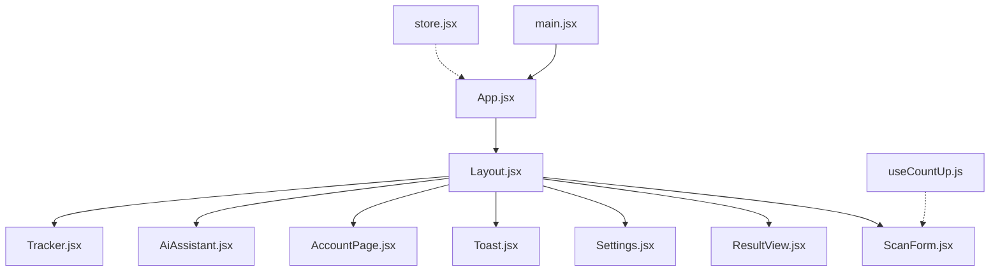
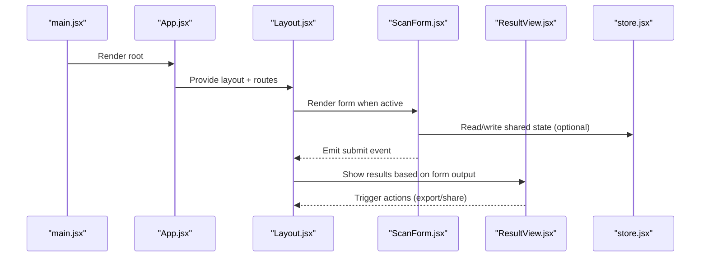
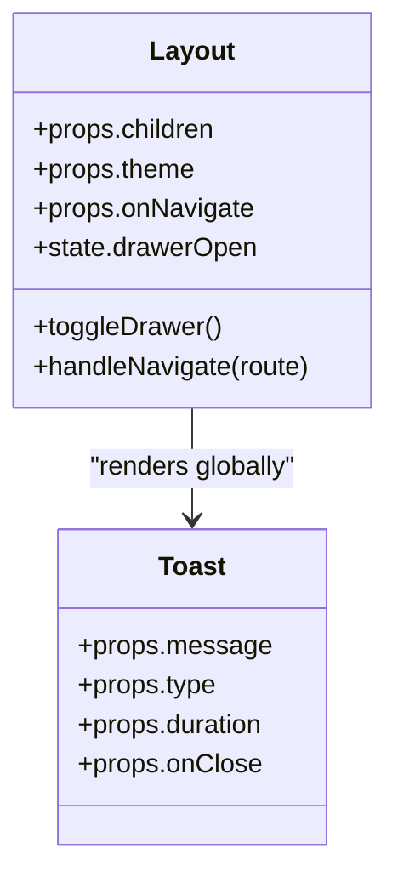
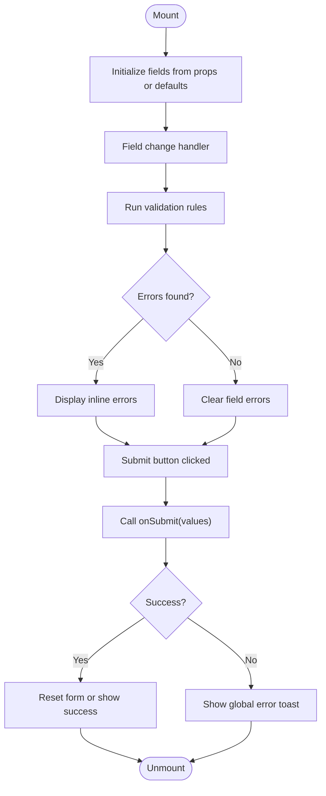
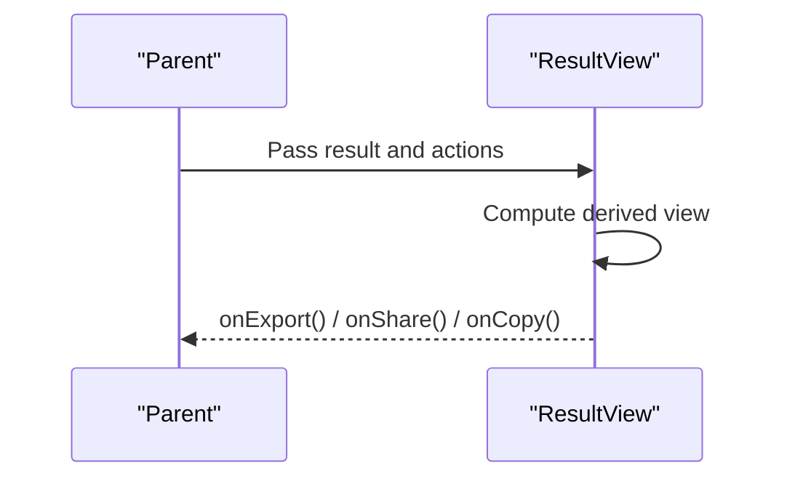
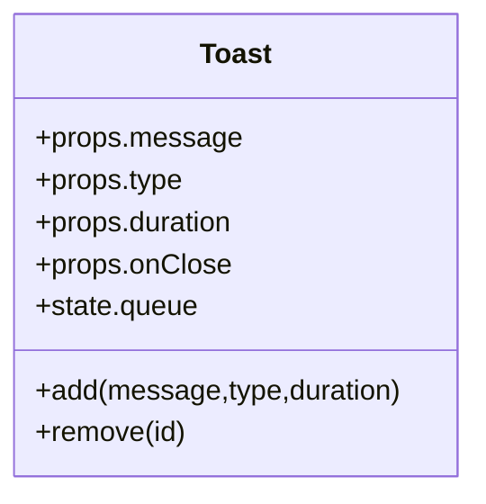
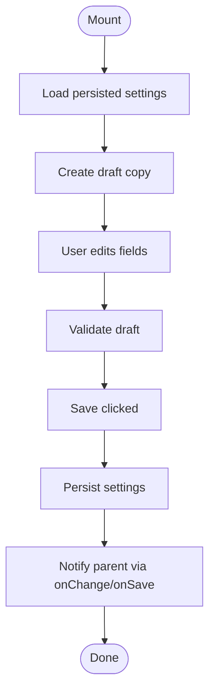
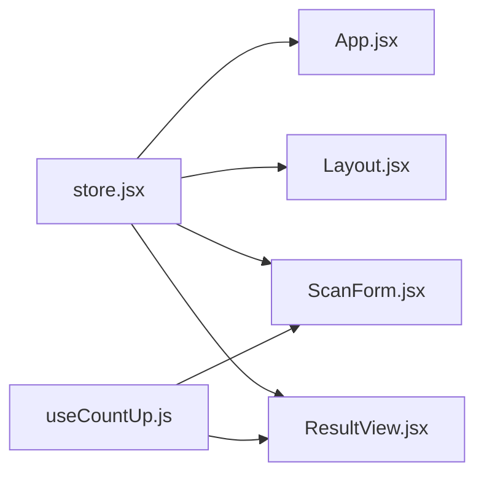

# Component System

<cite>
**Referenced Files in This Document**
- [App.jsx](file://src/App.jsx)
- [main.jsx](file://src/main.jsx)
- [store.jsx](file://src/store.jsx)
- [Layout.jsx](file://src/components/Layout.jsx)
- [ScanForm.jsx](file://src/components/ScanForm.jsx)
- [ResultView.jsx](file://src/components/ResultView.jsx)
- [Toast.jsx](file://src/components/Toast.jsx)
- [Settings.jsx](file://src/components/Settings.jsx)
- [AccountPage.jsx](file://src/components/AccountPage.jsx)
- [AiAssistant.jsx](file://src/components/AiAssistant.jsx)
- [Tracker.jsx](file://src/components/Tracker.jsx)
- [useCountUp.js](file://src/hooks/useCountUp.js)
</cite>

## Table of Contents
1. [Introduction](#introduction)
2. [Project Structure](#project-structure)
3. [Core Components](#core-components)
4. [Architecture Overview](#architecture-overview)
5. [Detailed Component Analysis](#detailed-component-analysis)
6. [Dependency Analysis](#dependency-analysis)
7. [Performance Considerations](#performance-considerations)
8. [Troubleshooting Guide](#troubleshooting-guide)
9. [Conclusion](#conclusion)

## Introduction
This document describes the React component system with a focus on the reusable architecture and integration patterns used across the application. It explains how core components compose together, how props are passed and validated, how state is managed at both local and global levels, and how lifecycle methods and effects coordinate data flow. The goal is to help developers understand the structure, reuse patterns, and customization options for Layout, ScanForm, ResultView, Toast, and Settings.

## Project Structure
The React application is bootstrapped by an entry point that renders the root component tree. The main application shell uses a layout wrapper to provide consistent chrome (header, navigation, content area). Feature pages and utilities are organized under src/components and src/hooks respectively. Global state and shared services live in src/lib and src/store.

**Diagram sources**
- [main.jsx](file://src/main.jsx)
- [App.jsx](file://src/App.jsx)
- [Layout.jsx](file://src/components/Layout.jsx)
- [ScanForm.jsx](file://src/components/ScanForm.jsx)
- [ResultView.jsx](file://src/components/ResultView.jsx)
- [Settings.jsx](file://src/components/Settings.jsx)
- [Toast.jsx](file://src/components/Toast.jsx)
- [AccountPage.jsx](file://src/components/AccountPage.jsx)
- [AiAssistant.jsx](file://src/components/AiAssistant.jsx)
- [Tracker.jsx](file://src/components/Tracker.jsx)
- [store.jsx](file://src/store.jsx)
- [useCountUp.js](file://src/hooks/useCountUp.js)

**Section sources**
- [main.jsx](file://src/main.jsx)
- [App.jsx](file://src/App.jsx)

## Core Components
This section summarizes each key component’s purpose, typical props, internal state, and interactions.

- Layout
  - Purpose: Provides consistent page chrome, navigation, and content slotting.
  - Props: children, optional theme or mode flags, navigation callbacks.
  - State: Local UI toggles (e.g., drawer open/close), active route context.
  - Lifecycle: Mounts once; may initialize analytics or global listeners.
  - Composition: Wraps feature pages and shared UI like Toast.

- ScanForm
  - Purpose: Collects user input for scanning or analysis tasks.
  - Props: onSubmit callback, initial values, validation rules, loading flag.
  - State: Form fields, errors, submission status.
  - Lifecycle: Effects to sync with external stores or URL params; cleanup on unmount.
  - Events: Field changes, validation triggers, submit handler.

- ResultView
  - Purpose: Displays analysis results and actions (export, share).
  - Props: result object, visibility flags, action handlers.
  - State: Temporary UI state (e.g., expanded sections).
  - Lifecycle: Effects to compute derived views or persist last result.
  - Events: Action clicks (copy, export, share).

- Toast
  - Purpose: Global notification surface.
  - Props: message, type, duration, onClose.
  - State: Internal queue and timers.
  - Lifecycle: Auto-dismiss after duration; cleanup timers on unmount.
  - Events: Dismiss, auto-close.

- Settings
  - Purpose: User preferences and configuration panel.
  - Props: settings object, onChange handler, save callback.
  - State: Draft settings, validation feedback.
  - Lifecycle: Effects to load persisted settings; debounce saves.
  - Events: Save, reset, field changes.

Additional components:
- AccountPage: User account management and profile editing.
- AiAssistant: AI-powered assistant interface and chat-like interactions.
- Tracker: Tracking and metrics display.

**Section sources**
- [Layout.jsx](file://src/components/Layout.jsx)
- [ScanForm.jsx](file://src/components/ScanForm.jsx)
- [ResultView.jsx](file://src/components/ResultView.jsx)
- [Toast.jsx](file://src/components/Toast.jsx)
- [Settings.jsx](file://src/components/Settings.jsx)
- [AccountPage.jsx](file://src/components/AccountPage.jsx)
- [AiAssistant.jsx](file://src/components/AiAssistant.jsx)
- [Tracker.jsx](file://src/components/Tracker.jsx)

## Architecture Overview
The application follows a composition-first pattern: App orchestrates routing and global state, Layout provides the shell, and feature components render within it. Shared notifications via Toast are mounted at the top level. Global store (if present) is consumed where needed.

**Diagram sources**
- [main.jsx](file://src/main.jsx)
- [App.jsx](file://src/App.jsx)
- [Layout.jsx](file://src/components/Layout.jsx)
- [ScanForm.jsx](file://src/components/ScanForm.jsx)
- [ResultView.jsx](file://src/components/ResultView.jsx)
- [store.jsx](file://src/store.jsx)

## Detailed Component Analysis

### Layout
- Responsibilities:
  - Provide header, sidebar/drawer, and content area.
  - Manage active navigation state and responsive behavior.
  - Compose global Toast container if applicable.
- Props Interface:
  - children: Node | ReactNode
  - theme?: string
  - onNavigate?: (route) => void
  - className?: string
- State Management:
  - Local UI toggles (drawer, mobile menu).
  - Optional integration with global store for theme or user context.
- Lifecycle Methods:
  - useEffect to attach global keyboard shortcuts or resize listeners.
  - Cleanup functions to remove listeners.
- Event Handling:
  - Navigation clicks update active route.
  - Drawer toggle updates local state.
- Composition Patterns:
  - Slot-based rendering via children prop.
  - Higher-order wrappers for authenticated-only sections.

**Diagram sources**
- [Layout.jsx](file://src/components/Layout.jsx)
- [Toast.jsx](file://src/components/Toast.jsx)

**Section sources**
- [Layout.jsx](file://src/components/Layout.jsx)

### ScanForm
- Responsibilities:
  - Capture inputs for scanning or analysis.
  - Validate fields and manage submission lifecycle.
- Props Interface:
  - initialValues?: Record<string, any>
  - onSubmit(values): Promise<void>
  - validate?(values): Record<string, string>
  - loading?: boolean
  - disabled?: boolean
- State Management:
  - Local form state (fields, errors, touched).
  - Submission status and error messages.
- Lifecycle Methods:
  - useEffect to sync with URL query parameters or global store.
  - Cleanup to abort pending requests or clear timeouts.
- Event Handling:
  - onChange per field updates local state and re-validates.
  - onBlur marks fields as touched.
  - onSubmit calls provided callback with sanitized values.
- Validation:
  - Inline validation function or library-driven rules.
  - Real-time feedback and error summaries.

**Diagram sources**
- [ScanForm.jsx](file://src/components/ScanForm.jsx)

**Section sources**
- [ScanForm.jsx](file://src/components/ScanForm.jsx)

### ResultView
- Responsibilities:
  - Present analysis results with interactive actions.
  - Support expand/collapse sections and copy/export flows.
- Props Interface:
  - result: object
  - visible?: boolean
  - onExport?: () => void
  - onShare?: () => void
  - onCopy?: () => void
- State Management:
  - Local UI toggles for sections.
  - Derived computed views from result.
- Lifecycle Methods:
  - useEffect to persist last result or trigger side effects on result change.
- Event Handling:
  - Action buttons call provided handlers.
  - Keyboard accessibility for actions.

**Diagram sources**
- [ResultView.jsx](file://src/components/ResultView.jsx)

**Section sources**
- [ResultView.jsx](file://src/components/ResultView.jsx)

### Toast
- Responsibilities:
  - Display transient notifications.
  - Manage queue and auto-dismiss timers.
- Props Interface:
  - message: string
  - type?: "info" | "success" | "warning" | "error"
  - duration?: number
  - onClose?: () => void
- State Management:
  - Internal queue of toasts.
  - Active timer IDs for auto-dismiss.
- Lifecycle Methods:
  - useEffect to schedule dismiss.
  - Cleanup to clear timers on unmount.
- Event Handling:
  - Close button triggers onClose.
  - Click-to-dismiss behavior.

**Diagram sources**
- [Toast.jsx](file://src/components/Toast.jsx)

**Section sources**
- [Toast.jsx](file://src/components/Toast.jsx)

### Settings
- Responsibilities:
  - Allow users to adjust app preferences.
  - Persist settings locally or remotely.
- Props Interface:
  - settings: object
  - onChange(settings): void
  - onSave?: (settings) => Promise<void>
  - resetToDefaults?: () => void
- State Management:
  - Draft settings state separate from saved settings.
  - Validation and conflict resolution.
- Lifecycle Methods:
  - useEffect to load persisted settings on mount.
  - Debounced save effect to avoid excessive writes.
- Event Handling:
  - Field changes update draft state.
  - Save triggers persistence and notifies parent.

**Diagram sources**
- [Settings.jsx](file://src/components/Settings.jsx)

**Section sources**
- [Settings.jsx](file://src/components/Settings.jsx)

### Additional Components
- AccountPage
  - Manages user account details and authentication-related UI.
  - Integrates with auth flows and global store.
- AiAssistant
  - Provides AI assistant interactions and streaming responses.
  - Uses hooks for debouncing and real-time updates.
- Tracker
  - Displays tracking metrics and charts.
  - Consumes data from lib modules and global store.

**Section sources**
- [AccountPage.jsx](file://src/components/AccountPage.jsx)
- [AiAssistant.jsx](file://src/components/AiAssistant.jsx)
- [Tracker.jsx](file://src/components/Tracker.jsx)

## Dependency Analysis
Components depend on:
- Global store for shared state (user, settings, results).
- Hooks for reusable logic (e.g., useCountUp).
- Utility libraries for formatting, validation, and storage.

**Diagram sources**
- [store.jsx](file://src/store.jsx)
- [App.jsx](file://src/App.jsx)
- [Layout.jsx](file://src/components/Layout.jsx)
- [ScanForm.jsx](file://src/components/ScanForm.jsx)
- [ResultView.jsx](file://src/components/ResultView.jsx)
- [useCountUp.js](file://src/hooks/useCountUp.js)

**Section sources**
- [store.jsx](file://src/store.jsx)
- [useCountUp.js](file://src/hooks/useCountUp.js)

## Performance Considerations
- Memoization: Use memoized selectors and derived computations in ResultView to avoid unnecessary re-renders.
- Debounce: Debounce heavy operations in Settings and ScanForm to reduce frequent writes and validations.
- Lazy Loading: Consider lazy-loading non-critical components (e.g., AiAssistant) to improve initial load time.
- List Rendering: Optimize lists in Tracker with stable keys and virtualization if datasets grow large.
- Effect Cleanup: Ensure all timers, listeners, and subscriptions are cleaned up to prevent memory leaks.

## Troubleshooting Guide
Common issues and resolutions:
- Form not submitting:
  - Verify onSubmit prop is provided and returns a promise.
  - Check validation rules for blocking conditions.
- Toast not appearing:
  - Ensure Toast container is rendered at the root.
  - Confirm duration and onClose handlers are set correctly.
- Settings not persisting:
  - Inspect onSave implementation and error handling.
  - Validate that draft vs saved settings are properly synchronized.
- ResultView stale data:
  - Confirm result prop updates and dependencies in effects.
  - Avoid mutating result objects directly; pass new references.

**Section sources**
- [ScanForm.jsx](file://src/components/ScanForm.jsx)
- [Toast.jsx](file://src/components/Toast.jsx)
- [Settings.jsx](file://src/components/Settings.jsx)
- [ResultView.jsx](file://src/components/ResultView.jsx)

## Conclusion
The component system emphasizes composition, clear prop interfaces, and predictable state management. Layout centralizes chrome and navigation, while feature components encapsulate domain-specific logic. Toast provides a consistent notification experience, and Settings ensures user preferences are manageable and persistent. By following these patterns, developers can extend functionality, customize behaviors, and maintain a scalable architecture.