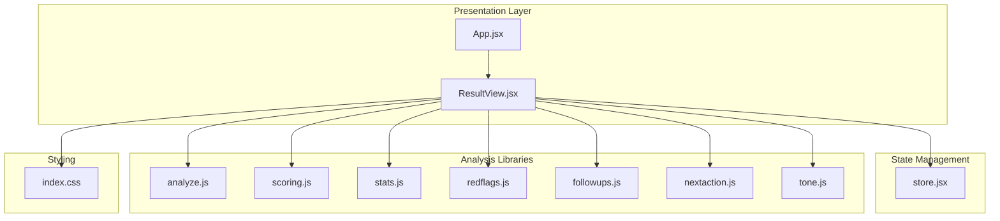
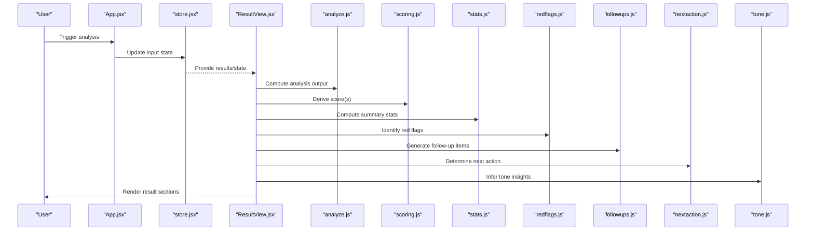
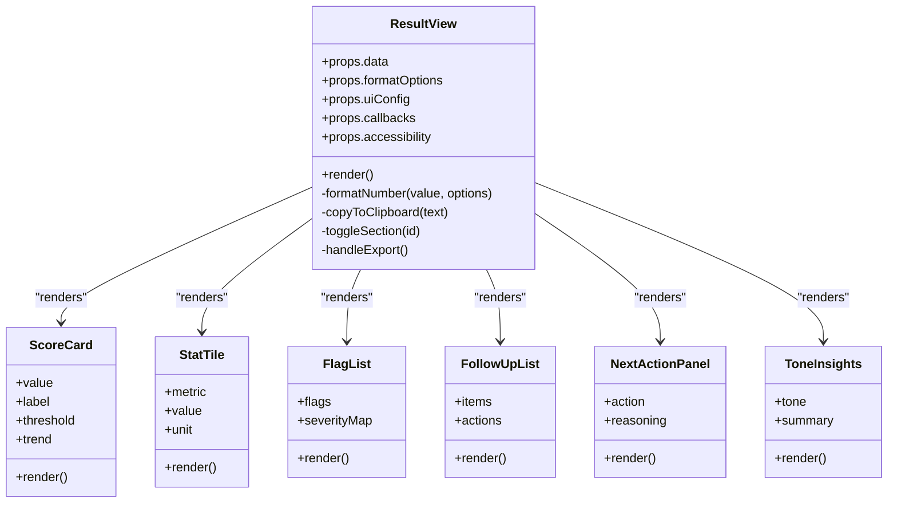
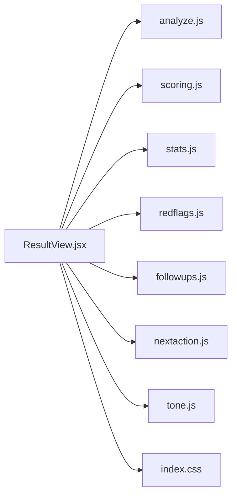

# Display Components

<cite>
**Referenced Files in This Document**
- [ResultView.jsx](file://src/components/ResultView.jsx)
- [App.jsx](file://src/App.jsx)
- [store.jsx](file://src/store.jsx)
- [analyze.js](file://src/lib/analyze.js)
- [scoring.js](file://src/lib/scoring.js)
- [stats.js](file://src/lib/stats.js)
- [redflags.js](file://src/lib/redflags.js)
- [followups.js](file://src/lib/followups.js)
- [nextaction.js](file://src/lib/nextaction.js)
- [tone.js](file://src/lib/tone.js)
- [index.css](file://src/index.css)
</cite>

## Table of Contents
1. [Introduction](#introduction)
2. [Project Structure](#project-structure)
3. [Core Components](#core-components)
4. [Architecture Overview](#architecture-overview)
5. [Detailed Component Analysis](#detailed-component-analysis)
6. [Dependency Analysis](#dependency-analysis)
7. [Performance Considerations](#performance-considerations)
8. [Troubleshooting Guide](#troubleshooting-guide)
9. [Conclusion](#conclusion)

## Introduction
This document focuses on display and presentation components with an emphasis on the ResultView component. It explains how results are rendered, how data states are handled (loading, success, error), and how dynamic content is presented to users. It also documents prop interfaces for data binding, formatting options, and interactive features, along with visualization patterns used across the result rendering pipeline.

## Project Structure
The display layer is primarily implemented as React components under src/components. The ResultView component consumes analysis outputs produced by library modules under src/lib and renders them using shared styles from src/index.css. State management and application wiring are provided by src/store.jsx and src/App.jsx.

**Diagram sources**
- [ResultView.jsx](file://src/components/ResultView.jsx)
- [App.jsx](file://src/App.jsx)
- [store.jsx](file://src/store.jsx)
- [analyze.js](file://src/lib/analyze.js)
- [scoring.js](file://src/lib/scoring.js)
- [stats.js](file://src/lib/stats.js)
- [redflags.js](file://src/lib/redflags.js)
- [followups.js](file://src/lib/followups.js)
- [nextaction.js](file://src/lib/nextaction.js)
- [tone.js](file://src/lib/tone.js)
- [index.css](file://src/index.css)

**Section sources**
- [ResultView.jsx](file://src/components/ResultView.jsx)
- [App.jsx](file://src/App.jsx)
- [store.jsx](file://src/store.jsx)
- [index.css](file://src/index.css)

## Core Components
- ResultView: Renders analysis outcomes including scores, statistics, red flags, follow-ups, next actions, and tone insights. It manages user interactions such as toggling details, copying text, and navigating between sections. It adapts its UI based on data state (loading, ready, error).
- App: Wires up global state and provides context or props to child components, including ResultView.
- store: Centralized state container that holds analysis inputs, results, and UI flags consumed by ResultView.

Key responsibilities:
- Data binding: Consumes structured analysis results and maps them to UI sections.
- Formatting: Applies number formatting, thresholds, and labels via library helpers.
- Interactivity: Supports expand/collapse, copy-to-clipboard, and navigation anchors.
- State handling: Displays loading indicators, empty states, and error messages.

**Section sources**
- [ResultView.jsx](file://src/components/ResultView.jsx)
- [App.jsx](file://src/App.jsx)
- [store.jsx](file://src/store.jsx)

## Architecture Overview
The ResultView component orchestrates multiple analysis libraries to produce a cohesive presentation. Inputs flow from the store into ResultView, which then calls library functions to compute derived views and render them. Styling is applied through shared CSS classes.

**Diagram sources**
- [ResultView.jsx](file://src/components/ResultView.jsx)
- [App.jsx](file://src/App.jsx)
- [store.jsx](file://src/store.jsx)
- [analyze.js](file://src/lib/analyze.js)
- [scoring.js](file://src/lib/scoring.js)
- [stats.js](file://src/lib/stats.js)
- [redflags.js](file://src/lib/redflags.js)
- [followups.js](file://src/lib/followups.js)
- [nextaction.js](file://src/lib/nextaction.js)
- [tone.js](file://src/lib/tone.js)

## Detailed Component Analysis

### ResultView Component
ResultView is the primary display surface for analysis outcomes. It composes multiple sub-sections, each responsible for a specific aspect of the result set.

#### Rendering Strategy
- Sectioned layout: Scores, statistics, red flags, follow-ups, next actions, and tone insights are grouped into distinct panels.
- Conditional rendering: Sections appear only when relevant data exists; otherwise, placeholders or empty-state messages are shown.
- Progressive disclosure: Expandable panels allow users to reveal detailed information without cluttering the initial view.
- Accessibility: Semantic headings, ARIA attributes, and keyboard navigation support improve usability.

#### Data States Handling
- Loading: Shows a spinner or skeleton placeholders while analysis runs.
- Ready: Displays computed results with formatted values and actionable items.
- Error: Presents a friendly message with retry guidance and logs diagnostic info.

#### Prop Interfaces
Props enable flexible data binding and customization:
- data: Structured analysis result object containing scores, stats, flags, follow-ups, next actions, and tone insights.
- formatOptions: Configuration for number formatting, date/time localization, threshold overrides, and label customizations.
- uiConfig: Flags controlling visibility of sections, default expanded states, and theme hints.
- callbacks: Handlers for user interactions such as copy-to-clipboard, export, share, and navigation.
- accessibility: Options for screen reader announcements and focus management.

Example prop usage patterns:
- Binding scores and thresholds via data.scores and formatOptions.thresholds.
- Customizing section titles and descriptions via uiConfig.labels.
- Enabling or disabling interactive features via uiConfig.features.

#### Interactive Features
- Copy-to-clipboard: One-click copying of key metrics or summaries.
- Export/share: Generating downloadable reports or shareable links.
- Navigation anchors: Jumping to specific sections within the result page.
- Expand/collapse: Revealing detailed breakdowns for scores and flags.

#### Visualization Patterns
- Score cards: Compact displays of numeric scores with contextual labels and trend indicators.
- Progress bars: Visual representation of metric levels relative to thresholds.
- Lists and badges: Red flags and follow-ups presented as actionable items with severity indicators.
- Summary tiles: Key statistics aggregated at a glance.

**Diagram sources**
- [ResultView.jsx](file://src/components/ResultView.jsx)

**Section sources**
- [ResultView.jsx](file://src/components/ResultView.jsx)

### Library Integration Points
ResultView delegates computation to specialized libraries:
- analyze.js: Produces core analysis outputs from input data.
- scoring.js: Computes normalized scores and applies thresholds.
- stats.js: Aggregates descriptive statistics and summaries.
- redflags.js: Identifies critical issues and categorizes severity.
- followups.js: Generates recommended follow-up tasks.
- nextaction.js: Determines prioritized next steps.
- tone.js: Infers sentiment or tone characteristics.

These modules return structured objects consumed by ResultView’s rendering logic.

**Section sources**
- [analyze.js](file://src/lib/analyze.js)
- [scoring.js](file://src/lib/scoring.js)
- [stats.js](file://src/lib/stats.js)
- [redflags.js](file://src/lib/redflags.js)
- [followups.js](file://src/lib/followups.js)
- [nextaction.js](file://src/lib/nextaction.js)
- [tone.js](file://src/lib/tone.js)

### Styling and Theming
Shared styles are defined in index.css and referenced by ResultView and related components. Classes encapsulate layout, typography, color tokens, and responsive behavior. Theme-aware variants can be applied via CSS variables or modifier classes.

**Section sources**
- [index.css](file://src/index.css)

## Dependency Analysis
ResultView depends on multiple analysis libraries and shared styling. The following diagram shows direct dependencies and their roles in the rendering pipeline.

**Diagram sources**
- [ResultView.jsx](file://src/components/ResultView.jsx)
- [analyze.js](file://src/lib/analyze.js)
- [scoring.js](file://src/lib/scoring.js)
- [stats.js](file://src/lib/stats.js)
- [redflags.js](file://src/lib/redflags.js)
- [followups.js](file://src/lib/followups.js)
- [nextaction.js](file://src/lib/nextaction.js)
- [tone.js](file://src/lib/tone.js)
- [index.css](file://src/index.css)

**Section sources**
- [ResultView.jsx](file://src/components/ResultView.jsx)
- [analyze.js](file://src/lib/analyze.js)
- [scoring.js](file://src/lib/scoring.js)
- [stats.js](file://src/lib/stats.js)
- [redflags.js](file://src/lib/redflags.js)
- [followups.js](file://src/lib/followups.js)
- [nextaction.js](file://src/lib/nextaction.js)
- [tone.js](file://src/lib/tone.js)
- [index.css](file://src/index.css)

## Performance Considerations
- Memoization: Cache expensive computations and derived views to avoid re-renders when inputs have not changed.
- Lazy rendering: Defer heavy sections until they become visible or interacted with.
- Batch updates: Consolidate state changes to minimize reflows and repaints.
- Efficient list rendering: Use stable keys and virtualization for long lists of flags or follow-ups.
- Minimal DOM mutations: Prefer declarative updates and avoid unnecessary inline styles.

[No sources needed since this section provides general guidance]

## Troubleshooting Guide
Common issues and resolutions:
- Missing data fields: Ensure all required properties exist in the data prop before rendering; provide fallbacks for optional fields.
- Incorrect formatting: Validate formatOptions and normalize units before passing to formatters.
- Interaction failures: Verify callback bindings and clipboard permissions; handle unsupported environments gracefully.
- Styling conflicts: Check for CSS specificity issues and ensure theme variables are correctly scoped.
- Error states: Log diagnostic context and present actionable messages to users.

**Section sources**
- [ResultView.jsx](file://src/components/ResultView.jsx)

## Conclusion
ResultView serves as the central presentation component for analysis outcomes, integrating multiple specialized libraries to deliver a comprehensive, interactive, and accessible user experience. By adhering to clear prop interfaces, robust state handling, and thoughtful visualization patterns, it ensures consistent and high-quality result rendering across diverse scenarios.

[No sources needed since this section summarizes without analyzing specific files]