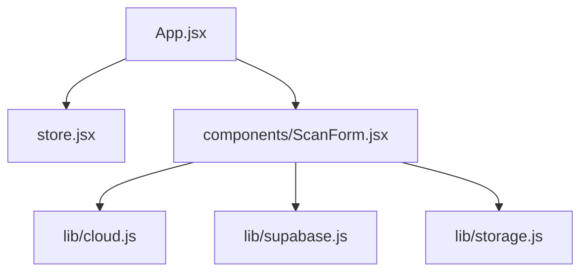
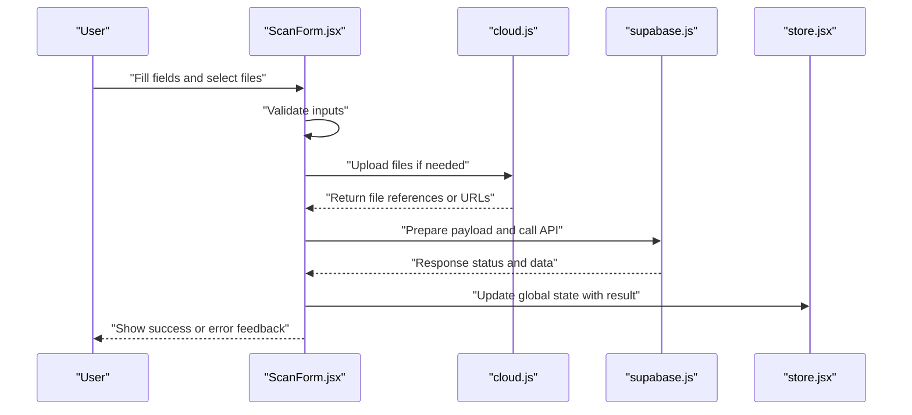
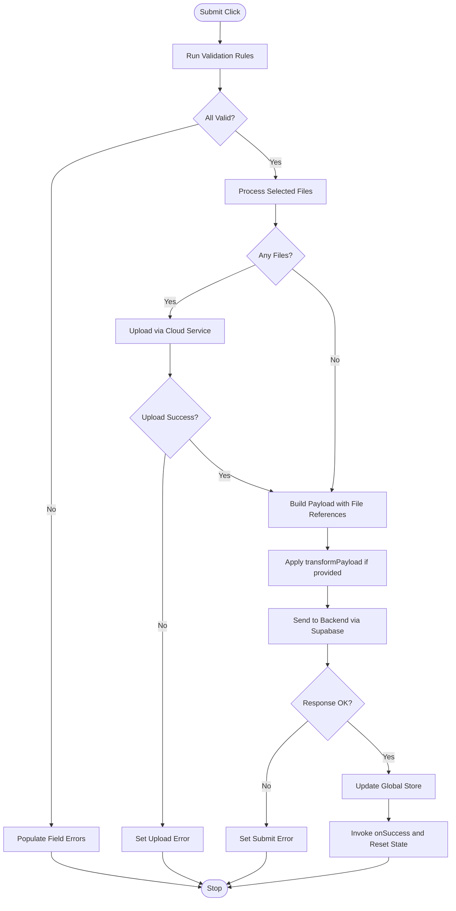
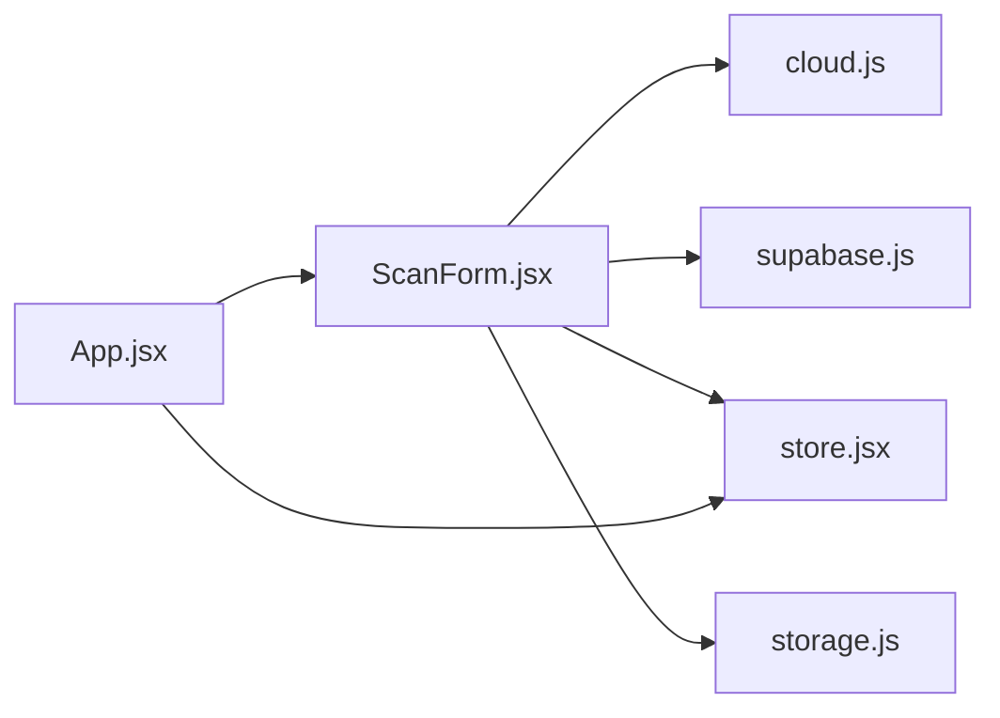

# Form Components

<cite>
**Referenced Files in This Document**
- [ScanForm.jsx](file://src/components/ScanForm.jsx)
- [App.jsx](file://src/App.jsx)
- [store.jsx](file://src/store.jsx)
- [supabase.js](file://src/lib/supabase.js)
- [cloud.js](file://src/lib/cloud.js)
- [storage.js](file://src/lib/storage.js)
</cite>

## Table of Contents
1. [Introduction](#introduction)
2. [Project Structure](#project-structure)
3. [Core Components](#core-components)
4. [Architecture Overview](#architecture-overview)
5. [Detailed Component Analysis](#detailed-component-analysis)
6. [Dependency Analysis](#dependency-analysis)
7. [Performance Considerations](#performance-considerations)
8. [Troubleshooting Guide](#troubleshooting-guide)
9. [Conclusion](#conclusion)

## Introduction
This document provides comprehensive documentation for form components with a focus on the ScanForm component. It explains validation patterns, user input handling, file upload processing, and form state management. It also covers the submission workflow, error handling, data transformation, prop interfaces, event handlers, and customization options to support different form scenarios.

## Project Structure
The form-related logic is primarily implemented in the ScanForm component and integrates with application state, cloud storage, and Supabase client utilities. The following diagram shows how ScanForm fits into the broader application structure.

**Diagram sources**
- [App.jsx](file://src/App.jsx)
- [store.jsx](file://src/store.jsx)
- [ScanForm.jsx](file://src/components/ScanForm.jsx)
- [cloud.js](file://src/lib/cloud.js)
- [supabase.js](file://src/lib/supabase.js)
- [storage.js](file://src/lib/storage.js)

**Section sources**
- [ScanForm.jsx](file://src/components/ScanForm.jsx)
- [App.jsx](file://src/App.jsx)
- [store.jsx](file://src/store.jsx)
- [cloud.js](file://src/lib/cloud.js)
- [supabase.js](file://src/lib/supabase.js)
- [storage.js](file://src/lib/storage.js)

## Core Components
- ScanForm: A React component that manages form state, validates inputs, handles file uploads, and submits data through cloud services. It exposes props for configuration and callbacks for lifecycle events.

Key responsibilities:
- Maintain local form state (fields, errors, loading flags).
- Validate user inputs before submission.
- Process uploaded files (size/type checks, optional transformations).
- Submit data via cloud integration and update global store.
- Provide feedback to users via success/error states.

**Section sources**
- [ScanForm.jsx](file://src/components/ScanForm.jsx)

## Architecture Overview
The form submission flow connects UI interactions to cloud services and persists results back into the application state.

**Diagram sources**
- [ScanForm.jsx](file://src/components/ScanForm.jsx)
- [cloud.js](file://src/lib/cloud.js)
- [supabase.js](file://src/lib/supabase.js)
- [store.jsx](file://src/store.jsx)

## Detailed Component Analysis

### ScanForm Component
ScanForm encapsulates all form behaviors including validation, file handling, submission, and state updates. It uses hooks for local state and effects for side effects such as uploading and syncing with the backend.

#### Prop Interfaces
- title: string — Displayed at the top of the form.
- initialData: object — Pre-populated field values.
- onSubmit: function — Callback invoked after successful submission with transformed payload.
- onError: function — Callback invoked when submission fails.
- onSuccess: function — Callback invoked upon successful submission.
- disabled: boolean — Disables interactive controls when true.
- showFileUpload: boolean — Toggles file upload section visibility.
- allowedFileTypes: array — Allowed MIME types for file uploads.
- maxFileSizeMB: number — Maximum file size in megabytes.
- requiredFields: array — Field keys that must be present and valid.
- transformPayload: function — Optional function to transform form data before submission.
- submitLabel: string — Text for the submit button.
- className: string — Additional CSS class names for styling.

These props enable flexible customization for different scanning scenarios while keeping the core behavior consistent.

**Section sources**
- [ScanForm.jsx](file://src/components/ScanForm.jsx)

#### State Management
- Fields: Controlled inputs bound to state; updated via change handlers.
- Errors: Per-field error messages keyed by field name.
- Loading: Boolean flag indicating active submission or upload.
- Success: Boolean flag indicating successful submission.
- Files: Array of selected files with metadata (name, type, size).

State transitions:
- On mount: Initialize from initialData and reset errors/loading/success.
- On change: Update field value and clear corresponding error.
- On submit: Validate all fields, process files, transform payload, then submit.
- On response: Set loading false; set success true on success or populate errors on failure.

**Section sources**
- [ScanForm.jsx](file://src/components/ScanForm.jsx)

#### Validation Patterns
- Required fields: Checked against requiredFields list.
- Type checks: Ensures numeric fields are numbers and email-like fields match expected patterns.
- File constraints: Validates allowedFileTypes and maxFileSizeMB.
- Custom rules: Extensible via transformPayload or dedicated validators passed through props.

Validation outcomes:
- If invalid: Populate per-field errors and prevent submission.
- If valid: Proceed to file processing and submission.

**Section sources**
- [ScanForm.jsx](file://src/components/ScanForm.jsx)

#### User Input Handling
- Change handlers: Normalize input values and update state immediately.
- Blur handlers: Trigger validation on field blur to provide early feedback.
- Keyboard shortcuts: Optional submit trigger on Enter when appropriate.

**Section sources**
- [ScanForm.jsx](file://src/components/ScanForm.jsx)

#### File Upload Processing
- Selection: Accepts multiple files constrained by allowedFileTypes and maxFileSizeMB.
- Preview: Generates preview URLs for supported image types.
- Upload: Uses cloud service to upload files and returns references or URLs.
- Error handling: Displays specific errors for unsupported types or oversized files.

Integration points:
- cloud.js: Handles upload requests and responses.
- supabase.js: May be used for storage endpoints depending on configuration.

**Section sources**
- [ScanForm.jsx](file://src/components/ScanForm.jsx)
- [cloud.js](file://src/lib/cloud.js)
- [supabase.js](file://src/lib/supabase.js)

#### Submission Workflow

**Diagram sources**
- [ScanForm.jsx](file://src/components/ScanForm.jsx)
- [cloud.js](file://src/lib/cloud.js)
- [supabase.js](file://src/lib/supabase.js)
- [store.jsx](file://src/store.jsx)

#### Data Transformation
- Normalization: Converts raw inputs into a structured payload.
- Enrichment: Adds timestamps, user context, or derived fields.
- Customization: transformPayload allows scenario-specific adjustments before sending.

**Section sources**
- [ScanForm.jsx](file://src/components/ScanForm.jsx)

#### Event Handlers and Lifecycle
- onChange: Updates field state and clears associated errors.
- onBlur: Triggers validation for immediate feedback.
- onSubmit: Orchestrates validation, file processing, submission, and state updates.
- onSuccess/onError: External callbacks for higher-level actions (navigation, analytics).

**Section sources**
- [ScanForm.jsx](file://src/components/ScanForm.jsx)

#### Customization Options
- Visual: className, submitLabel, title.
- Behavioral: disabled, showFileUpload, requiredFields, allowedFileTypes, maxFileSizeMB.
- Integration: onSubmit, onSuccess, onError, transformPayload.

These options allow reusing ScanForm across different scanning workflows without duplicating logic.

**Section sources**
- [ScanForm.jsx](file://src/components/ScanForm.jsx)

### Integration Points

#### Application State (store.jsx)
- After successful submission, ScanForm updates global state to reflect new scan results or related entities.
- Consumers of the store can reactively render updated data.

**Section sources**
- [store.jsx](file://src/store.jsx)

#### Cloud Services (cloud.js)
- Provides upload functions for files.
- Returns standardized responses with file references or URLs.
- Centralizes error mapping for consistent user feedback.

**Section sources**
- [cloud.js](file://src/lib/cloud.js)

#### Supabase Client (supabase.js)
- Used for API calls or storage operations depending on configuration.
- Encapsulates authentication and request formatting.

**Section sources**
- [supabase.js](file://src/lib/supabase.js)

#### Local Storage (storage.js)
- Optionally persists draft forms or partial submissions for recovery.
- Supports offline-first UX patterns.

**Section sources**
- [storage.js](file://src/lib/storage.js)

## Dependency Analysis
The following diagram illustrates dependencies between ScanForm and supporting modules.

**Diagram sources**
- [ScanForm.jsx](file://src/components/ScanForm.jsx)
- [cloud.js](file://src/lib/cloud.js)
- [supabase.js](file://src/lib/supabase.js)
- [store.jsx](file://src/store.jsx)
- [storage.js](file://src/lib/storage.js)
- [App.jsx](file://src/App.jsx)

**Section sources**
- [ScanForm.jsx](file://src/components/ScanForm.jsx)
- [cloud.js](file://src/lib/cloud.js)
- [supabase.js](file://src/lib/supabase.js)
- [store.jsx](file://src/store.jsx)
- [storage.js](file://src/lib/storage.js)
- [App.jsx](file://src/App.jsx)

## Performance Considerations
- Debounce input changes for expensive validations or network calls.
- Lazy-load file previews only when necessary.
- Batch uploads to reduce network overhead.
- Use memoization for computed fields or derived payloads.
- Avoid unnecessary re-renders by splitting large forms into smaller sub-components.

[No sources needed since this section provides general guidance]

## Troubleshooting Guide
Common issues and resolutions:
- Validation errors not clearing: Ensure change handlers reset per-field errors and that requiredFields matches actual field keys.
- File upload failures: Verify allowedFileTypes and maxFileSizeMB; check cloud service responses and map errors to user-friendly messages.
- Submission timeouts: Implement retry logic and user feedback; consider reducing payload size.
- State inconsistencies: Confirm that onSuccess resets loading and success flags and that global store updates occur after successful responses.

**Section sources**
- [ScanForm.jsx](file://src/components/ScanForm.jsx)
- [cloud.js](file://src/lib/cloud.js)
- [supabase.js](file://src/lib/supabase.js)
- [store.jsx](file://src/store.jsx)

## Conclusion
ScanForm provides a robust, customizable foundation for scanning workflows. Its modular design separates concerns across validation, file handling, submission, and state management. By leveraging props for configuration and callbacks for integration, it adapts to diverse scenarios while maintaining consistent user experience and reliable error handling.

[No sources needed since this section summarizes without analyzing specific files]