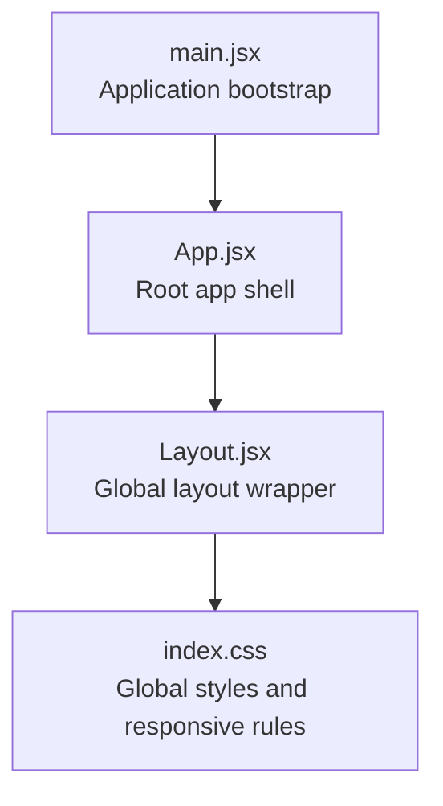
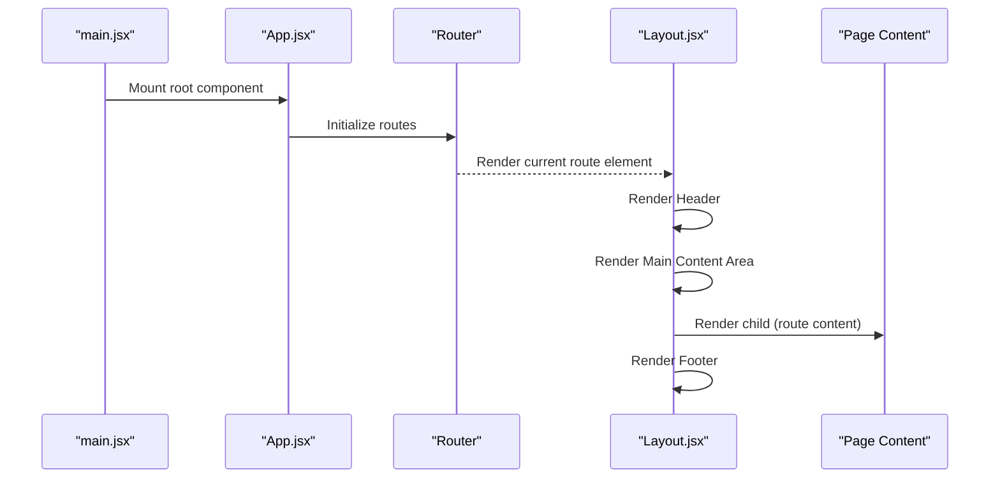
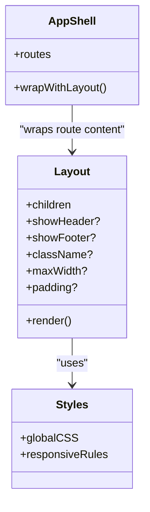
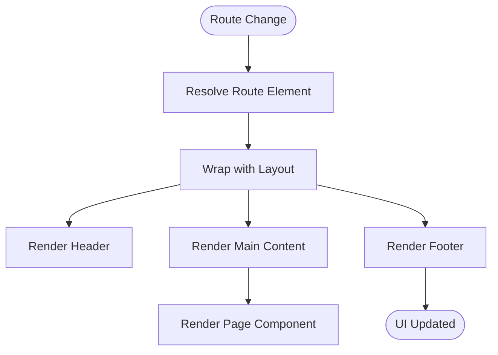
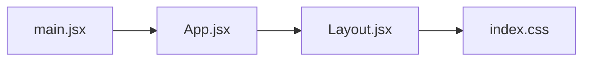

# Layout Components

<cite>
**Referenced Files in This Document**
- [Layout.jsx](file://src/components/Layout.jsx)
- [App.jsx](file://src/App.jsx)
- [main.jsx](file://src/main.jsx)
- [index.css](file://src/index.css)
</cite>

## Table of Contents
1. [Introduction](#introduction)
2. [Project Structure](#project-structure)
3. [Core Components](#core-components)
4. [Architecture Overview](#architecture-overview)
5. [Detailed Component Analysis](#detailed-component-analysis)
6. [Dependency Analysis](#dependency-analysis)
7. [Performance Considerations](#performance-considerations)
8. [Troubleshooting Guide](#troubleshooting-guide)
9. [Conclusion](#conclusion)
10. [Appendices](#appendices)

## Introduction
This document explains the Layout component system used to structure pages, manage global chrome (header and footer), and compose content areas across routes. It covers architecture, navigation integration, responsive design patterns, styling approaches, props interfaces, and strategies for extending layouts or creating custom page wrappers.

## Project Structure
The layout-related code is primarily implemented in a single Layout component and wired into the application entry points. Global styles are centralized in a CSS file. The following diagram shows how these files relate at a high level.

**Diagram sources**
- [main.jsx:1-200](file://src/main.jsx#L1-L200)
- [App.jsx:1-200](file://src/App.jsx#L1-L200)
- [Layout.jsx:1-200](file://src/components/Layout.jsx#L1-L200)
- [index.css:1-200](file://src/index.css#L1-L200)

**Section sources**
- [main.jsx:1-200](file://src/main.jsx#L1-L200)
- [App.jsx:1-200](file://src/App.jsx#L1-L200)
- [Layout.jsx:1-200](file://src/components/Layout.jsx#L1-L200)
- [index.css:1-200](file://src/index.css#L1-L200)

## Core Components
- Layout component: Provides the global page shell including header, main content area, and footer. It composes children (page content) and applies consistent spacing, alignment, and responsive behavior.
- App shell: Initializes routing and wraps route content with the Layout component so all pages inherit the same chrome.
- Global styles: Centralized CSS that defines base typography, spacing, grid/flex utilities, and responsive breakpoints used by the layout.

Key responsibilities:
- Render header and footer consistently across pages
- Provide a main content container with appropriate padding and max-width constraints
- Apply responsive behaviors for mobile, tablet, and desktop viewports
- Integrate with routing by wrapping route elements

**Section sources**
- [Layout.jsx:1-200](file://src/components/Layout.jsx#L1-L200)
- [App.jsx:1-200](file://src/App.jsx#L1-L200)
- [index.css:1-200](file://src/index.css#L1-L200)

## Architecture Overview
The layout architecture follows a simple composition pattern:
- Application bootstrap mounts the root component
- Root component sets up routing and renders an App shell
- App shell wraps all route content with the Layout component
- Layout renders header, main content area, and footer around the routed page

**Diagram sources**
- [main.jsx:1-200](file://src/main.jsx#L1-L200)
- [App.jsx:1-200](file://src/App.jsx#L1-L200)
- [Layout.jsx:1-200](file://src/components/Layout.jsx#L1-L200)

## Detailed Component Analysis

### Layout Component
Responsibilities:
- Compose header, main content area, and footer
- Enforce consistent spacing and alignment
- Apply responsive constraints (max-width, padding, grid/flex)
- Accept props to customize behavior (e.g., toggling header/footer visibility, adding sidebars)

Props interface (typical):
- children: ReactNode — The page content to render inside the main area
- showHeader?: boolean — Whether to render the header
- showFooter?: boolean — Whether to render the footer
- className?: string — Additional class names for the root container
- maxWidth?: string | number — Max width constraint for the content area
- padding?: string | number — Padding applied to the content area

Styling approach:
- Uses CSS classes defined in the global stylesheet
- Responsive rules via media queries in index.css
- Flexbox/Grid for layout composition

Integration with routing:
- Wrapped around route elements in the App shell so every page inherits the layout

Extending the layout:
- Create a higher-order wrapper that injects additional chrome (e.g., sidebar, breadcrumbs) while delegating to the base Layout
- Use conditional props to toggle sections based on route context

**Diagram sources**
- [Layout.jsx:1-200](file://src/components/Layout.jsx#L1-L200)
- [App.jsx:1-200](file://src/App.jsx#L1-L200)
- [index.css:1-200](file://src/index.css#L1-L200)

**Section sources**
- [Layout.jsx:1-200](file://src/components/Layout.jsx#L1-L200)
- [App.jsx:1-200](file://src/App.jsx#L1-L200)
- [index.css:1-200](file://src/index.css#L1-L200)

### App Shell and Routing Integration
Responsibilities:
- Initialize routing configuration
- Wrap all route elements with the Layout component
- Ensure consistent chrome across pages

Routing flow:
- Routes resolve to page components
- Each page is rendered inside the Layout’s main content area
- Header and footer remain constant across navigations

**Diagram sources**
- [App.jsx:1-200](file://src/App.jsx#L1-L200)
- [Layout.jsx:1-200](file://src/components/Layout.jsx#L1-L200)

**Section sources**
- [App.jsx:1-200](file://src/App.jsx#L1-L200)
- [Layout.jsx:1-200](file://src/components/Layout.jsx#L1-L200)

### Styling and Responsive Design Patterns
Approach:
- Global CSS defines base layout tokens (spacing, typography, colors)
- Media queries adjust layout for different screen sizes
- Flexbox/Grid used for composing header, main, and footer
- Max-width constraints keep content readable on large screens

Responsive patterns:
- Mobile-first base styles
- Breakpoints for tablet and desktop
- Flexible containers that adapt to viewport width

**Section sources**
- [index.css:1-200](file://src/index.css#L1-L200)

### Composition Strategies and Custom Wrappers
Strategies:
- Base Layout provides core chrome; extend via wrapper components
- Conditional rendering using props to include/exclude sections
- Higher-order components can inject additional UI (e.g., breadcrumbs, sidebars) without modifying the base Layout

Example patterns:
- AdminLayout extends Layout to add a sidebar and top navigation
- AuthenticatedLayout wraps Layout to enforce authentication state before rendering content
- MinimalLayout disables header/footer for specific flows (e.g., onboarding)

[No sources needed since this section describes conceptual extension patterns]

## Dependency Analysis
High-level dependencies among layout-related files:

**Diagram sources**
- [main.jsx:1-200](file://src/main.jsx#L1-L200)
- [App.jsx:1-200](file://src/App.jsx#L1-L200)
- [Layout.jsx:1-200](file://src/components/Layout.jsx#L1-L200)
- [index.css:1-200](file://src/index.css#L1-L200)

**Section sources**
- [main.jsx:1-200](file://src/main.jsx#L1-L200)
- [App.jsx:1-200](file://src/App.jsx#L1-L200)
- [Layout.jsx:1-200](file://src/components/Layout.jsx#L1-L200)
- [index.css:1-200](file://src/index.css#L1-L200)

## Performance Considerations
- Keep Layout lightweight; avoid heavy computations in render paths
- Memoize expensive subcomponents if necessary
- Prefer CSS-based responsive rules over JS-driven layout changes
- Minimize re-renders by passing stable props and avoiding unnecessary state updates in the layout

[No sources needed since this section provides general guidance]

## Troubleshooting Guide
Common issues and resolutions:
- Missing global styles: Ensure index.css is imported at the application entry point
- Layout not applying: Verify the App shell wraps route elements with the Layout component
- Responsive issues: Check media query breakpoints and ensure viewport meta tag is configured
- Overflow or clipping: Confirm max-width and padding values are appropriate for target devices

**Section sources**
- [main.jsx:1-200](file://src/main.jsx#L1-L200)
- [App.jsx:1-200](file://src/App.jsx#L1-L200)
- [Layout.jsx:1-200](file://src/components/Layout.jsx#L1-L200)
- [index.css:1-200](file://src/index.css#L1-L200)

## Conclusion
The Layout component system provides a consistent, responsive page structure across the application. By centralizing chrome and styling, it simplifies navigation and ensures a cohesive user experience. Extensibility is achieved through props and wrapper components, enabling tailored layouts for different contexts while maintaining a unified foundation.

[No sources needed since this section summarizes without analyzing specific files]

## Appendices

### Props Reference
- children: ReactNode — Page content rendered within the main area
- showHeader?: boolean — Toggle header visibility
- showFooter?: boolean — Toggle footer visibility
- className?: string — Additional CSS classes for the root container
- maxWidth?: string | number — Maximum width for the content area
- padding?: string | number — Padding applied to the content area

[No sources needed since this section lists conceptual props]

### Example: Creating a Custom Page Wrapper
- Define a wrapper component that accepts children and additional props
- Conditionally render extra UI (e.g., sidebar) around the base Layout
- Use the wrapper in place of the base Layout for specific routes

[No sources needed since this section describes conceptual patterns]