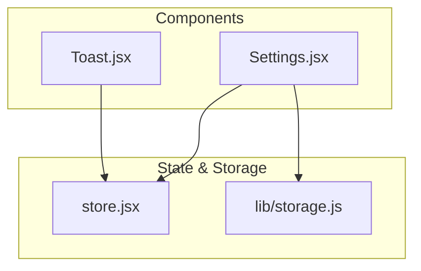
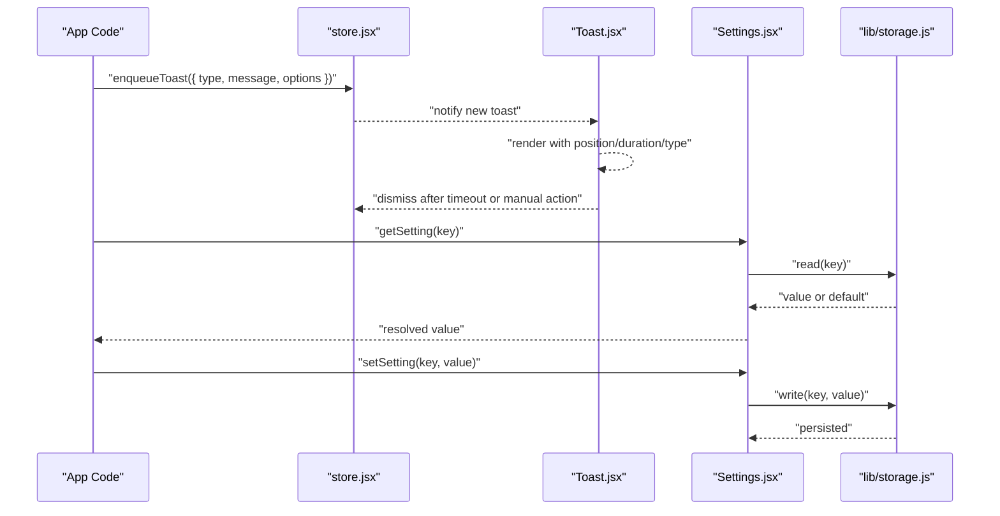
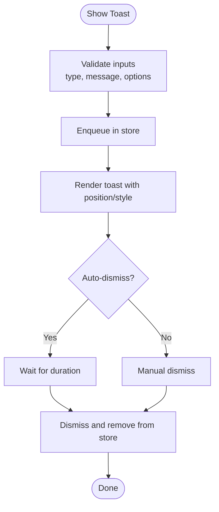
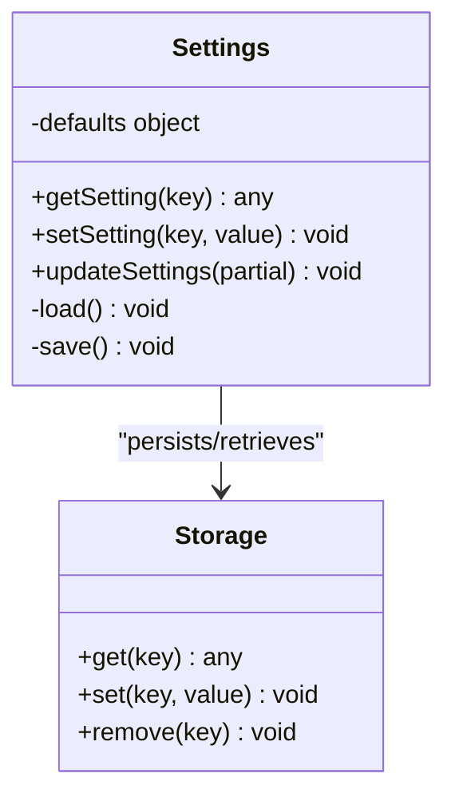
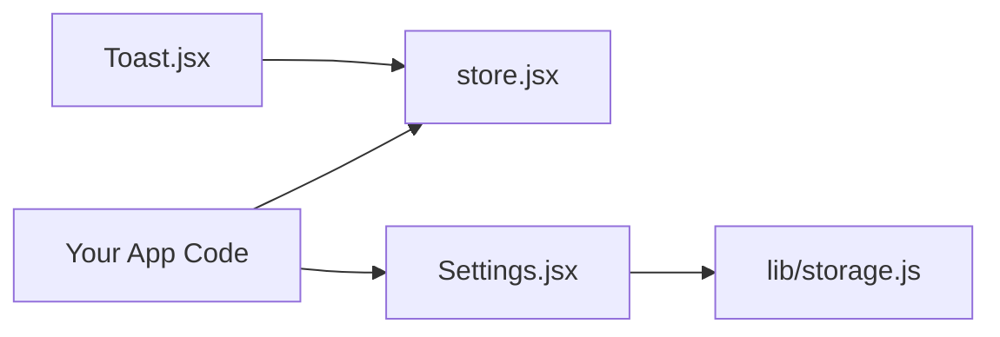

# Utility Components

<cite>
**Referenced Files in This Document**
- [Toast.jsx](file://src/components/Toast.jsx)
- [Settings.jsx](file://src/components/Settings.jsx)
- [store.jsx](file://src/store.jsx)
- [storage.js](file://src/lib/storage.js)
</cite>

## Table of Contents
1. [Introduction](#introduction)
2. [Project Structure](#project-structure)
3. [Core Components](#core-components)
4. [Architecture Overview](#architecture-overview)
5. [Detailed Component Analysis](#detailed-component-analysis)
6. [Dependency Analysis](#dependency-analysis)
7. [Performance Considerations](#performance-considerations)
8. [Troubleshooting Guide](#troubleshooting-guide)
9. [Conclusion](#conclusion)

## Introduction
This document explains the utility and helper components that power user feedback and configuration management: Toast notifications and Settings. It covers how to use these components, customize their behavior, integrate them into your application, and persist user preferences.

## Project Structure
The relevant files for this documentation are located under src/components and src/lib:
- Toast notification component
- Settings management component
- Global store for shared state (including toast queue)
- Storage utilities for persistent settings

**Diagram sources**
- [Toast.jsx](file://src/components/Toast.jsx)
- [Settings.jsx](file://src/components/Settings.jsx)
- [store.jsx](file://src/store.jsx)
- [storage.js](file://src/lib/storage.js)

**Section sources**
- [Toast.jsx](file://src/components/Toast.jsx)
- [Settings.jsx](file://src/components/Settings.jsx)
- [store.jsx](file://src/store.jsx)
- [storage.js](file://src/lib/storage.js)

## Core Components
- Toast: Displays transient messages with configurable positioning, duration, and message types. It integrates with a global store to manage queued notifications and auto-dismiss timers.
- Settings: Manages user preferences and configuration. It provides an interface to read/write settings and persists them using storage utilities.

Key responsibilities:
- Toast: enqueue/dequeue notifications, render different types, control visibility and timing, handle positioning.
- Settings: load/save defaults, merge updates, expose typed getters/setters, persist changes.

**Section sources**
- [Toast.jsx](file://src/components/Toast.jsx)
- [Settings.jsx](file://src/components/Settings.jsx)
- [store.jsx](file://src/store.jsx)
- [storage.js](file://src/lib/storage.js)

## Architecture Overview
The system uses a simple pub/sub-like pattern via a global store for Toasts and a dedicated storage layer for Settings.

**Diagram sources**
- [store.jsx](file://src/store.jsx)
- [Toast.jsx](file://src/components/Toast.jsx)
- [Settings.jsx](file://src/components/Settings.jsx)
- [storage.js](file://src/lib/storage.js)

## Detailed Component Analysis

### Toast Notification System
Purpose:
- Provide non-blocking feedback to users through short-lived messages.
- Support multiple message types (e.g., success, error, info).
- Allow flexible positioning and duration control.

Core concepts:
- Message types: Each toast has a type that influences styling and iconography.
- Positioning: Toasts can be anchored to corners or edges; stacking is supported.
- Duration: Auto-dismiss after a configurable time; supports manual dismissal.
- Queue: Multiple toasts can be enqueued and rendered sequentially or concurrently based on layout.

Integration points:
- Uses a global store to maintain the current list of active toasts and actions to add/remove them.
- Renders within the app’s root container to inherit theme and layout context.

Usage patterns:
- Show a one-off message: call the store action with a message and optional options.
- Group related messages: enqueue multiple toasts; they will stack according to position.
- Control behavior: set duration, position, and type per invocation.

Customization options:
- Type: Determines visual style and semantics.
- Duration: Time in milliseconds before auto-dismiss.
- Position: Placement anchor (e.g., top-right, bottom-left).
- Dismiss handler: Optional callback when dismissed.

Error handling:
- Invalid durations or positions should fall back to safe defaults.
- Duplicate messages may be coalesced to avoid clutter.

**Diagram sources**
- [Toast.jsx](file://src/components/Toast.jsx)
- [store.jsx](file://src/store.jsx)

**Section sources**
- [Toast.jsx](file://src/components/Toast.jsx)
- [store.jsx](file://src/store.jsx)

### Settings Management
Purpose:
- Centralize user preferences and application configuration.
- Provide typed accessors and setters for settings.
- Persist settings across sessions.

Core concepts:
- Defaults: A baseline configuration object with documented keys and values.
- Merge strategy: New values override existing ones without losing unrelated keys.
- Persistence: Writes to a durable storage backend; reads with fallback to defaults.

Integration points:
- Reads/writes via storage utilities which abstract the underlying persistence mechanism.
- Exposes a simple API for other components to get and update settings.

Usage patterns:
- Read a setting: call the getter with a key; returns the persisted value or default.
- Update a setting: call the setter with a key/value pair; triggers persistence.
- Batch updates: provide an object to update multiple keys at once.

Customization options:
- Default factory: Allows dynamic defaults based on environment or feature flags.
- Validation: Optional schema checks before persisting.
- Sync hooks: Optional callbacks when settings change.

Error handling:
- Storage failures should be caught and logged; operations should degrade gracefully.
- Invalid keys or types should return defaults or throw descriptive errors.

**Diagram sources**
- [Settings.jsx](file://src/components/Settings.jsx)
- [storage.js](file://src/lib/storage.js)

**Section sources**
- [Settings.jsx](file://src/components/Settings.jsx)
- [storage.js](file://src/lib/storage.js)

## Dependency Analysis
The following diagram shows how the components depend on shared state and storage:

**Diagram sources**
- [store.jsx](file://src/store.jsx)
- [Toast.jsx](file://src/components/Toast.jsx)
- [Settings.jsx](file://src/components/Settings.jsx)
- [storage.js](file://src/lib/storage.js)

**Section sources**
- [store.jsx](file://src/store.jsx)
- [Toast.jsx](file://src/components/Toast.jsx)
- [Settings.jsx](file://src/components/Settings.jsx)
- [storage.js](file://src/lib/storage.js)

## Performance Considerations
- Toast batching: Coalesce rapid successive toasts to reduce re-renders.
- Debounced saves: For frequent setting updates, debounce writes to storage to avoid excessive I/O.
- Lazy rendering: Only render visible toasts; offscreen items can be pruned.
- Minimal diffs: When updating settings, compute minimal changes and only persist deltas.

[No sources needed since this section provides general guidance]

## Troubleshooting Guide
Common issues and resolutions:
- Toast not appearing:
  - Ensure the store is initialized and the Toast component is mounted.
  - Verify that the enqueue action is called with valid parameters.
- Toast not dismissing:
  - Check duration values and timer cleanup logic.
  - Confirm no long-running tasks block the UI thread.
- Settings not persisting:
  - Inspect storage backend availability and permissions.
  - Validate that keys exist and values match expected types.
- Conflicting settings:
  - Review merge strategy and ensure partial updates do not overwrite required fields unintentionally.

**Section sources**
- [Toast.jsx](file://src/components/Toast.jsx)
- [store.jsx](file://src/store.jsx)
- [Settings.jsx](file://src/components/Settings.jsx)
- [storage.js](file://src/lib/storage.js)

## Conclusion
Toast and Settings are foundational utilities that improve user experience and configurability. By leveraging the global store for notifications and a robust storage-backed settings manager, you can deliver consistent feedback and reliable preference management across your application. Follow the usage patterns and customization options outlined here to integrate these components effectively.