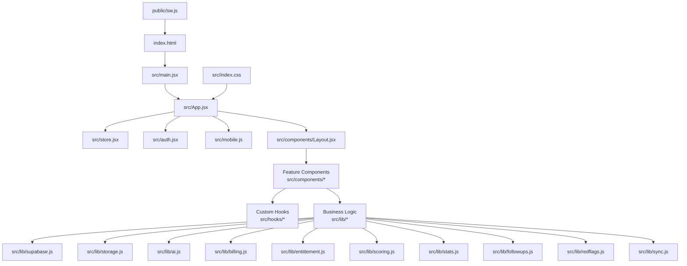
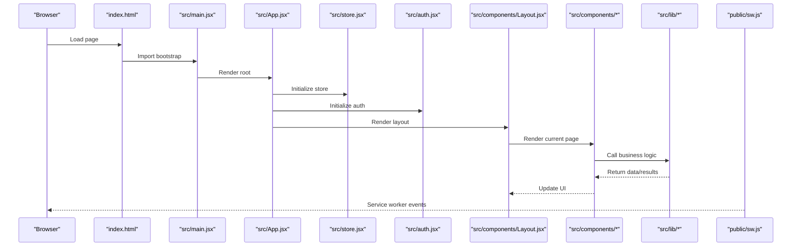
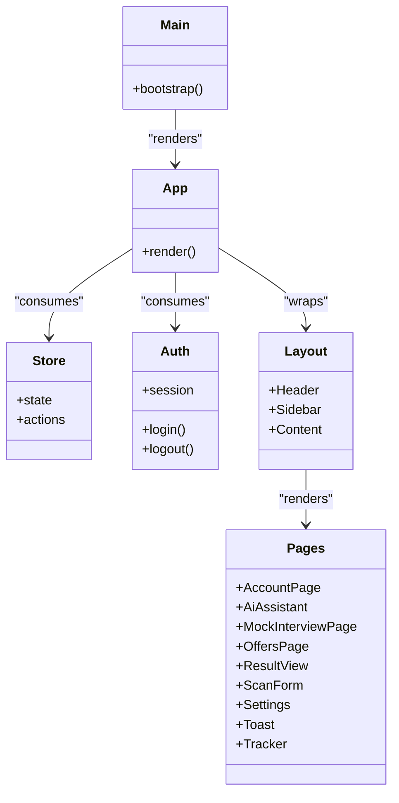
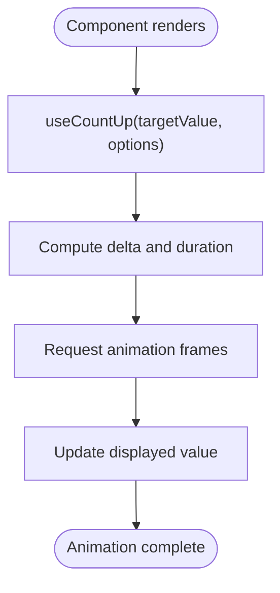
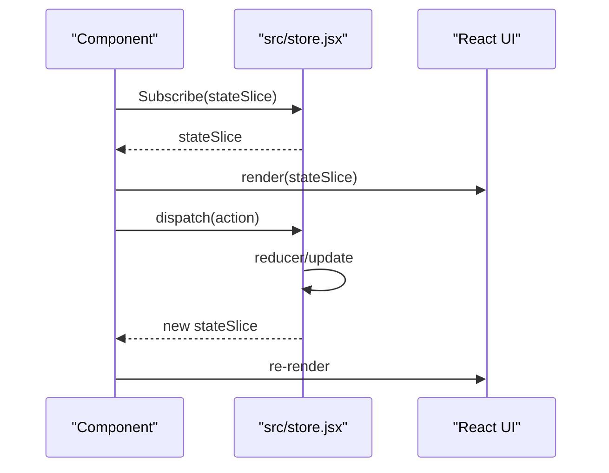
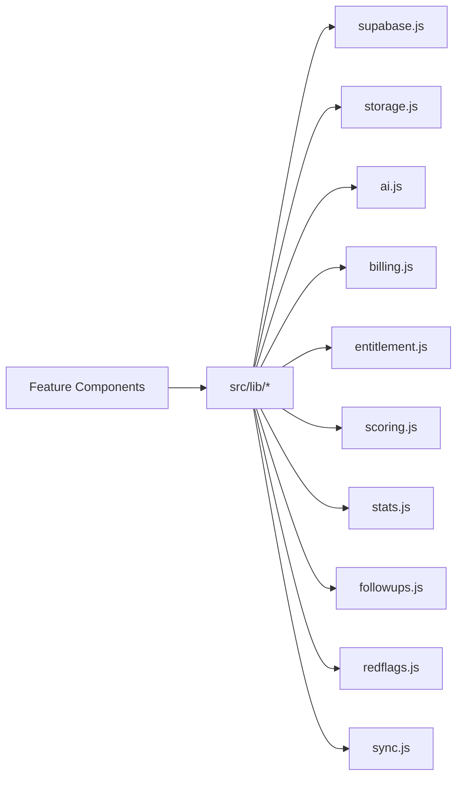
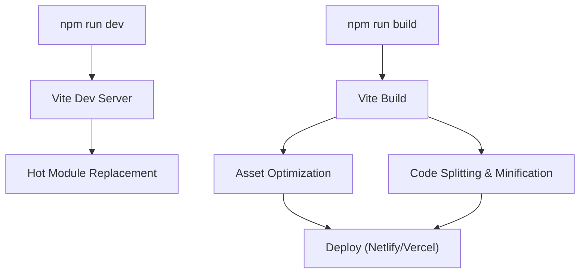
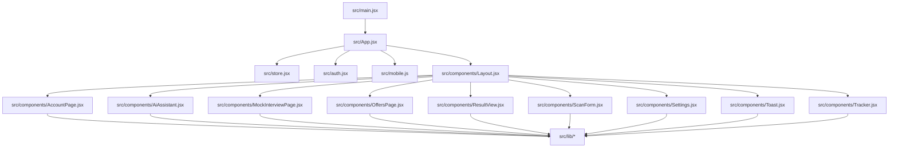

# Frontend Architecture

<cite>
**Referenced Files in This Document**
- [index.html](file://index.html)
- [vite.config.js](file://vite.config.js)
- [package.json](file://package.json)
- [src/main.jsx](file://src/main.jsx)
- [src/App.jsx](file://src/App.jsx)
- [src/store.jsx](file://src/store.jsx)
- [src/auth.jsx](file://src/auth.jsx)
- [src/mobile.js](file://src/mobile.js)
- [src/index.css](file://src/index.css)
- [src/components/Layout.jsx](file://src/components/Layout.jsx)
- [src/components/AccountPage.jsx](file://src/components/AccountPage.jsx)
- [src/components/AiAssistant.jsx](file://src/components/AiAssistant.jsx)
- [src/components/MockInterviewPage.jsx](file://src/components/MockInterviewPage.jsx)
- [src/components/OffersPage.jsx](file://src/components/OffersPage.jsx)
- [src/components/ResultView.jsx](file://src/components/ResultView.jsx)
- [src/components/ScanForm.jsx](file://src/components/ScanForm.jsx)
- [src/components/Settings.jsx](file://src/components/Settings.jsx)
- [src/components/Toast.jsx](file://src/components/Toast.jsx)
- [src/components/Tracker.jsx](file://src/components/Tracker.jsx)
- [src/hooks/useCountUp.js](file://src/hooks/useCountUp.js)
- [src/lib/supabase.js](file://src/lib/supabase.js)
- [src/lib/storage.js](file://src/lib/storage.js)
- [src/lib/ai.js](file://src/lib/ai.js)
- [src/lib/billing.js](file://src/lib/billing.js)
- [src/lib/entitlement.js](file://src/lib/entitlement.js)
- [src/lib/scoring.js](file://src/lib/scoring.js)
- [src/lib/stats.js](file://src/lib/stats.js)
- [src/lib/followups.js](file://src/lib/followups.js)
- [src/lib/redflags.js](file://src/lib/redflags.js)
- [src/lib/sync.js](file://src/lib/sync.js)
- [public/sw.js](file://public/sw.js)
</cite>

## Table of Contents
1. [Introduction](#introduction)
2. [Project Structure](#project-structure)
3. [Core Components](#core-components)
4. [Architecture Overview](#architecture-overview)
5. [Detailed Component Analysis](#detailed-component-analysis)
6. [Dependency Analysis](#dependency-analysis)
7. [Performance Considerations](#performance-considerations)
8. [Troubleshooting Guide](#troubleshooting-guide)
9. [Conclusion](#conclusion)
10. [Appendices](#appendices)

## Introduction
This document describes the frontend architecture of a React-based application built with Vite. It covers the component hierarchy, custom hooks library, state management patterns, modular business logic organization, styling approach, build configuration, asset optimization, and development workflow. It also includes diagrams for component interactions, data binding patterns, performance strategies, responsive design implementation, and cross-browser considerations.

## Project Structure
The frontend is organized into clear layers:
- Entry points and runtime bootstrap
- Application shell and routing
- Feature components under src/components
- Custom hooks under src/hooks
- Business logic modules under src/lib
- Global styles under src/index.css
- Build and deployment configuration at the repository root

**Diagram sources**
- [index.html](file://index.html)
- [src/main.jsx](file://src/main.jsx)
- [src/App.jsx](file://src/App.jsx)
- [src/store.jsx](file://src/store.jsx)
- [src/auth.jsx](file://src/auth.jsx)
- [src/mobile.js](file://src/mobile.js)
- [src/components/Layout.jsx](file://src/components/Layout.jsx)
- [src/index.css](file://src/index.css)
- [public/sw.js](file://public/sw.js)

**Section sources**
- [index.html](file://index.html)
- [vite.config.js](file://vite.config.js)
- [package.json](file://package.json)
- [src/main.jsx](file://src/main.jsx)
- [src/App.jsx](file://src/App.jsx)
- [src/index.css](file://src/index.css)
- [public/sw.js](file://public/sw.js)

## Core Components
- Application Shell
  - The root entry initializes the React app and mounts it to the DOM.
  - The application shell sets up global providers (e.g., auth, store), routes, and layout.
- Layout
  - Provides consistent chrome across pages (header, sidebar, content area).
  - Composes page-level components and shared UI elements.
- Feature Pages
  - AccountPage: user account overview and settings navigation.
  - AiAssistant: interface for AI-driven assistance flows.
  - MockInterviewPage: end-to-end interview simulation flow.
  - OffersPage: display and management of offers.
  - ResultView: presentation of analysis or scoring results.
  - ScanForm: form for scanning or inputting data.
  - Settings: application preferences and configuration.
  - Toast: non-intrusive notifications.
  - Tracker: tracking or monitoring features.
- State Management
  - Centralized store module provides reactive state and actions consumed by components.
- Authentication
  - Auth integration handles session lifecycle and guards protected routes.
- Mobile Integration
  - Mobile-specific initialization and capabilities are wired via mobile.js.

**Section sources**
- [src/main.jsx](file://src/main.jsx)
- [src/App.jsx](file://src/App.jsx)
- [src/store.jsx](file://src/store.jsx)
- [src/auth.jsx](file://src/auth.jsx)
- [src/mobile.js](file://src/mobile.js)
- [src/components/Layout.jsx](file://src/components/Layout.jsx)
- [src/components/AccountPage.jsx](file://src/components/AccountPage.jsx)
- [src/components/AiAssistant.jsx](file://src/components/AiAssistant.jsx)
- [src/components/MockInterviewPage.jsx](file://src/components/MockInterviewPage.jsx)
- [src/components/OffersPage.jsx](file://src/components/OffersPage.jsx)
- [src/components/ResultView.jsx](file://src/components/ResultView.jsx)
- [src/components/ScanForm.jsx](file://src/components/ScanForm.jsx)
- [src/components/Settings.jsx](file://src/components/Settings.jsx)
- [src/components/Toast.jsx](file://src/components/Toast.jsx)
- [src/components/Tracker.jsx](file://src/components/Tracker.jsx)

## Architecture Overview
High-level runtime flow from browser to feature components and business logic:

**Diagram sources**
- [index.html](file://index.html)
- [src/main.jsx](file://src/main.jsx)
- [src/App.jsx](file://src/App.jsx)
- [src/store.jsx](file://src/store.jsx)
- [src/auth.jsx](file://src/auth.jsx)
- [src/components/Layout.jsx](file://src/components/Layout.jsx)
- [public/sw.js](file://public/sw.js)

## Detailed Component Analysis

### Component Hierarchy and Composition
- Root composition
  - main.jsx bootstraps React and renders App.
  - App.jsx composes providers (store, auth), routes, and Layout.
- Layout composition
  - Layout.jsx wraps pages with shared chrome and navigational context.
- Page composition
  - Each page composes reusable subcomponents (forms, tables, charts) and consumes hooks and lib modules.

**Diagram sources**
- [src/main.jsx](file://src/main.jsx)
- [src/App.jsx](file://src/App.jsx)
- [src/store.jsx](file://src/store.jsx)
- [src/auth.jsx](file://src/auth.jsx)
- [src/components/Layout.jsx](file://src/components/Layout.jsx)
- [src/components/AccountPage.jsx](file://src/components/AccountPage.jsx)
- [src/components/AiAssistant.jsx](file://src/components/AiAssistant.jsx)
- [src/components/MockInterviewPage.jsx](file://src/components/MockInterviewPage.jsx)
- [src/components/OffersPage.jsx](file://src/components/OffersPage.jsx)
- [src/components/ResultView.jsx](file://src/components/ResultView.jsx)
- [src/components/ScanForm.jsx](file://src/components/ScanForm.jsx)
- [src/components/Settings.jsx](file://src/components/Settings.jsx)
- [src/components/Toast.jsx](file://src/components/Toast.jsx)
- [src/components/Tracker.jsx](file://src/components/Tracker.jsx)

**Section sources**
- [src/main.jsx](file://src/main.jsx)
- [src/App.jsx](file://src/App.jsx)
- [src/components/Layout.jsx](file://src/components/Layout.jsx)

### Custom Hooks Library
- useCountUp
  - Purpose: drives animated counters used in dashboards or result views.
  - Typical usage: invoked within components to animate numeric transitions based on props or derived values.

**Diagram sources**
- [src/hooks/useCountUp.js](file://src/hooks/useCountUp.js)

**Section sources**
- [src/hooks/useCountUp.js](file://src/hooks/useCountUp.js)

### State Management Patterns
- Centralized store
  - Provides a single source of truth for UI and domain state.
  - Exposes state slices and action creators consumed by components.
- Data binding
  - Components subscribe to store slices and dispatch actions to mutate state.
  - Derived values can be computed in components or via lightweight selectors.

**Diagram sources**
- [src/store.jsx](file://src/store.jsx)

**Section sources**
- [src/store.jsx](file://src/store.jsx)

### Business Logic Modules (lib)
The lib directory encapsulates domain logic and integrations:
- supabase.js: client setup and queries/mutations against Supabase.
- storage.js: local persistence helpers (e.g., localStorage/sessionStorage wrappers).
- ai.js: orchestration for AI assistant calls and prompts.
- billing.js: checkout and subscription-related operations.
- entitlement.js: feature gating and access control checks.
- scoring.js: scoring algorithms and transformations.
- stats.js: statistics aggregation and summaries.
- followups.js: scheduling and reminders logic.
- redflags.js: detection and reporting of risk indicators.
- sync.js: synchronization between local state and remote services.

**Diagram sources**
- [src/lib/supabase.js](file://src/lib/supabase.js)
- [src/lib/storage.js](file://src/lib/storage.js)
- [src/lib/ai.js](file://src/lib/ai.js)
- [src/lib/billing.js](file://src/lib/billing.js)
- [src/lib/entitlement.js](file://src/lib/entitlement.js)
- [src/lib/scoring.js](file://src/lib/scoring.js)
- [src/lib/stats.js](file://src/lib/stats.js)
- [src/lib/followups.js](file://src/lib/followups.js)
- [src/lib/redflags.js](file://src/lib/redflags.js)
- [src/lib/sync.js](file://src/lib/sync.js)

**Section sources**
- [src/lib/supabase.js](file://src/lib/supabase.js)
- [src/lib/storage.js](file://src/lib/storage.js)
- [src/lib/ai.js](file://src/lib/ai.js)
- [src/lib/billing.js](file://src/lib/billing.js)
- [src/lib/entitlement.js](file://src/lib/entitlement.js)
- [src/lib/scoring.js](file://src/lib/scoring.js)
- [src/lib/stats.js](file://src/lib/stats.js)
- [src/lib/followups.js](file://src/lib/followups.js)
- [src/lib/redflags.js](file://src/lib/redflags.js)
- [src/lib/sync.js](file://src/lib/sync.js)

### Styling Approach
- Global stylesheet
  - index.css defines base styles, typography, and layout primitives.
- Component-level styling
  - Components may import CSS modules or rely on global classes; ensure consistent naming conventions and avoid style duplication.
- Responsive design
  - Use fluid layouts, media queries, and flexible units to support multiple screen sizes.
  - Prefer relative sizing and spacing tokens for consistency.

**Section sources**
- [src/index.css](file://src/index.css)

### Build Configuration with Vite
- Development server and hot module replacement (HMR)
  - Configured via vite.config.js for fast feedback loops.
- Asset optimization
  - Production builds optimize assets (images, fonts) and minify code.
- Environment variables
  - Access via import.meta.env.* in Vite.
- Deployment targets
  - netlify.toml and vercel.json define hosting configurations.

**Diagram sources**
- [vite.config.js](file://vite.config.js)
- [package.json](file://package.json)

**Section sources**
- [vite.config.js](file://vite.config.js)
- [package.json](file://package.json)

### Service Worker and Offline Support
- public/sw.js registers a service worker for caching and offline behavior.
- Integrate with PWA manifest and cache strategies appropriate for your app’s needs.

**Section sources**
- [public/sw.js](file://public/sw.js)

## Dependency Analysis
Frontend dependency graph focusing on runtime relationships:

**Diagram sources**
- [src/main.jsx](file://src/main.jsx)
- [src/App.jsx](file://src/App.jsx)
- [src/store.jsx](file://src/store.jsx)
- [src/auth.jsx](file://src/auth.jsx)
- [src/mobile.js](file://src/mobile.js)
- [src/components/Layout.jsx](file://src/components/Layout.jsx)
- [src/components/AccountPage.jsx](file://src/components/AccountPage.jsx)
- [src/components/AiAssistant.jsx](file://src/components/AiAssistant.jsx)
- [src/components/MockInterviewPage.jsx](file://src/components/MockInterviewPage.jsx)
- [src/components/OffersPage.jsx](file://src/components/OffersPage.jsx)
- [src/components/ResultView.jsx](file://src/components/ResultView.jsx)
- [src/components/ScanForm.jsx](file://src/components/ScanForm.jsx)
- [src/components/Settings.jsx](file://src/components/Settings.jsx)
- [src/components/Toast.jsx](file://src/components/Toast.jsx)
- [src/components/Tracker.jsx](file://src/components/Tracker.jsx)
- [src/lib/supabase.js](file://src/lib/supabase.js)
- [src/lib/storage.js](file://src/lib/storage.js)
- [src/lib/ai.js](file://src/lib/ai.js)
- [src/lib/billing.js](file://src/lib/billing.js)
- [src/lib/entitlement.js](file://src/lib/entitlement.js)
- [src/lib/scoring.js](file://src/lib/scoring.js)
- [src/lib/stats.js](file://src/lib/stats.js)
- [src/lib/followups.js](file://src/lib/followups.js)
- [src/lib/redflags.js](file://src/lib/redflags.js)
- [src/lib/sync.js](file://src/lib/sync.js)

**Section sources**
- [src/main.jsx](file://src/main.jsx)
- [src/App.jsx](file://src/App.jsx)
- [src/store.jsx](file://src/store.jsx)
- [src/auth.jsx](file://src/auth.jsx)
- [src/mobile.js](file://src/mobile.js)
- [src/components/Layout.jsx](file://src/components/Layout.jsx)
- [src/components/AccountPage.jsx](file://src/components/AccountPage.jsx)
- [src/components/AiAssistant.jsx](file://src/components/AiAssistant.jsx)
- [src/components/MockInterviewPage.jsx](file://src/components/MockInterviewPage.jsx)
- [src/components/OffersPage.jsx](file://src/components/OffersPage.jsx)
- [src/components/ResultView.jsx](file://src/components/ResultView.jsx)
- [src/components/ScanForm.jsx](file://src/components/ScanForm.jsx)
- [src/components/Settings.jsx](file://src/components/Settings.jsx)
- [src/components/Toast.jsx](file://src/components/Toast.jsx)
- [src/components/Tracker.jsx](file://src/components/Tracker.jsx)
- [src/lib/supabase.js](file://src/lib/supabase.js)
- [src/lib/storage.js](file://src/lib/storage.js)
- [src/lib/ai.js](file://src/lib/ai.js)
- [src/lib/billing.js](file://src/lib/billing.js)
- [src/lib/entitlement.js](file://src/lib/entitlement.js)
- [src/lib/scoring.js](file://src/lib/scoring.js)
- [src/lib/stats.js](file://src/lib/stats.js)
- [src/lib/followups.js](file://src/lib/followups.js)
- [src/lib/redflags.js](file://src/lib/redflags.js)
- [src/lib/sync.js](file://src/lib/sync.js)

## Performance Considerations
- Code splitting and lazy loading
  - Route-level and component-level lazy imports to reduce initial bundle size.
- Memoization
  - Use memoization for expensive computations and stable references in components.
- Efficient rendering
  - Avoid unnecessary re-renders by keeping state granular and using derived values judiciously.
- Asset optimization
  - Leverage Vite’s production optimizations for images, fonts, and static assets.
- Network efficiency
  - Cache responses where appropriate; batch requests when possible.
- Service worker caching
  - Strategically cache critical assets for faster subsequent loads.

[No sources needed since this section provides general guidance]

## Troubleshooting Guide
- Common issues
  - Authentication failures: verify session handling and token refresh flows.
  - Store inconsistencies: ensure actions update state immutably and subscribers receive updates.
  - API errors: centralize error handling in lib modules and surface user-friendly messages via Toast.
  - Service worker conflicts: clear caches during development if stale assets persist.
- Debugging tips
  - Use browser dev tools to inspect network requests and store state changes.
  - Log key transitions in hooks and lib functions during development.

**Section sources**
- [src/auth.jsx](file://src/auth.jsx)
- [src/store.jsx](file://src/store.jsx)
- [src/components/Toast.jsx](file://src/components/Toast.jsx)
- [public/sw.js](file://public/sw.js)

## Conclusion
The frontend follows a clean separation of concerns: a thin bootstrap layer, a composed application shell, feature-focused components, and a well-organized lib layer for business logic. State is centralized and declaratively bound to components, while Vite provides a fast development experience and optimized production builds. Responsive design and cross-browser compatibility are achieved through modern CSS practices and progressive enhancement via the service worker.

[No sources needed since this section summarizes without analyzing specific files]

## Appendices

### Build and Development Workflow
- Local development
  - Start the dev server for instant feedback and HMR.
- Building for production
  - Generate optimized bundles and assets.
- Deployment
  - Configure hosting platforms using provided configuration files.

**Section sources**
- [vite.config.js](file://vite.config.js)
- [package.json](file://package.json)
- [netlify.toml](file://netlify.toml)
- [vercel.json](file://vercel.json)

### Cross-Browser Compatibility
- Polyfills and feature detection
  - Ensure core APIs used in hooks and lib modules are polyfilled or guarded for older browsers.
- CSS compatibility
  - Test layout and animations across major browsers; prefer widely supported properties.
- Service worker support
  - Gracefully degrade functionality when service workers are unavailable.

[No sources needed since this section provides general guidance]