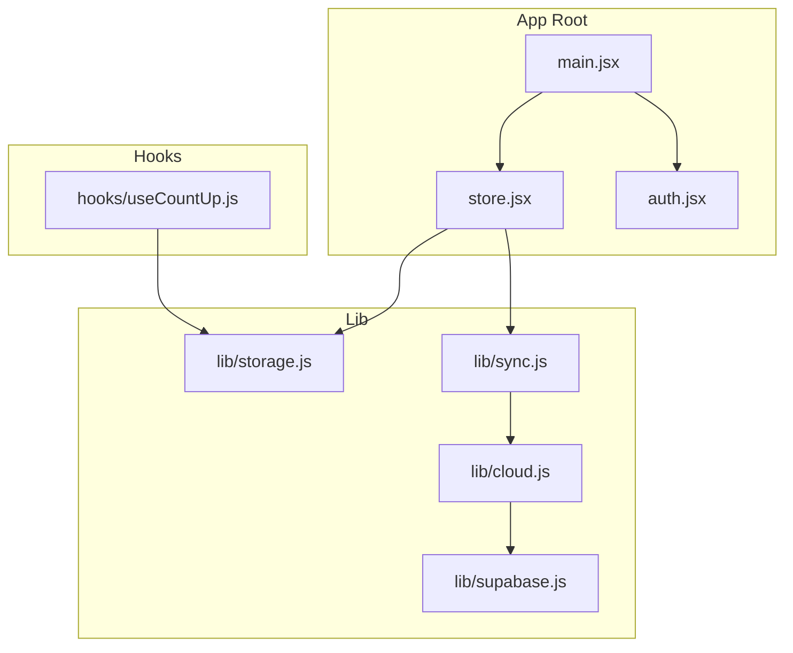
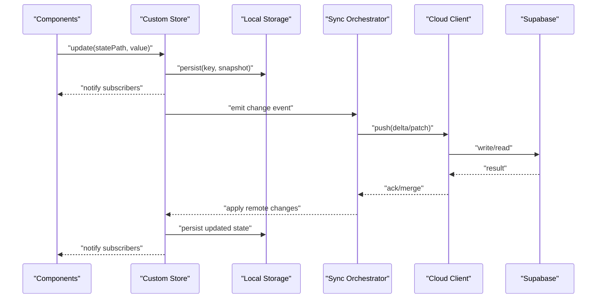
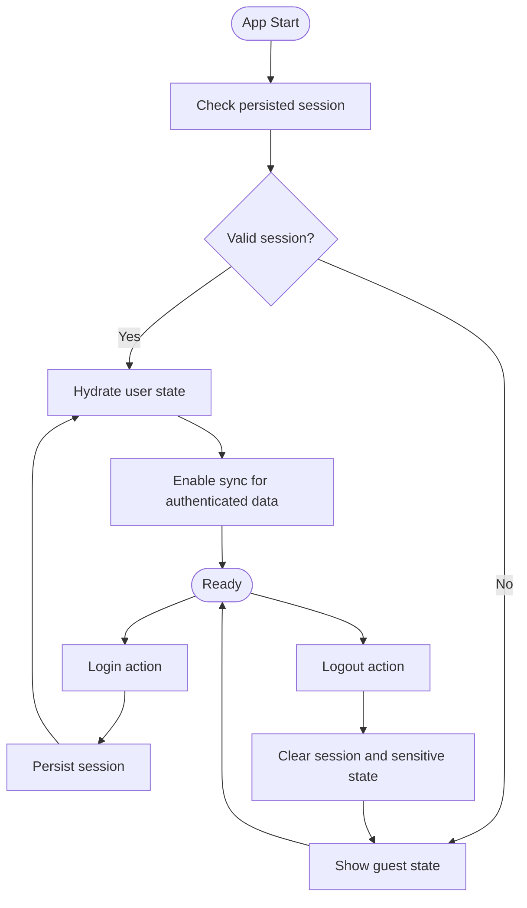
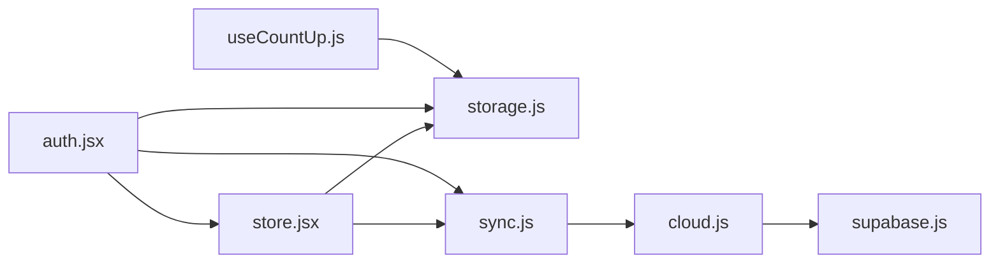

# State Management

<cite>
**Referenced Files in This Document**
- [store.jsx](file://src/store.jsx)
- [auth.jsx](file://src/auth.jsx)
- [main.jsx](file://src/main.jsx)
- [useCountUp.js](file://src/hooks/useCountUp.js)
- [storage.js](file://src/lib/storage.js)
- [cloud.js](file://src/lib/cloud.js)
- [sync.js](file://src/lib/sync.js)
- [supabase.js](file://src/lib/supabase.js)
</cite>

## Table of Contents
1. [Introduction](#introduction)
2. [Project Structure](#project-structure)
3. [Core Components](#core-components)
4. [Architecture Overview](#architecture-overview)
5. [Detailed Component Analysis](#detailed-component-analysis)
6. [Dependency Analysis](#dependency-analysis)
7. [Performance Considerations](#performance-considerations)
8. [Troubleshooting Guide](#troubleshooting-guide)
9. [Conclusion](#conclusion)
10. [Appendices](#appendices)

## Introduction
This document explains the state management architecture, focusing on:
- A custom store implementation for global application state
- Context-based state sharing across components
- Local storage persistence strategies
- The useCountUp hook and patterns for building custom hooks
- Authentication state flow
- Data synchronization between local and cloud storage
- State persistence mechanisms
- Guidance for creating new hooks and managing complex state interactions

The goal is to provide both a high-level understanding and actionable details for extending and maintaining the system.

## Project Structure
State-related code is organized into focused modules:
- Store and context providers at the application root
- Authentication state and flows
- Storage utilities for local persistence
- Cloud integration and sync orchestration
- Custom hooks for reusable logic

**Diagram sources**
- [main.jsx](file://src/main.jsx)
- [store.jsx](file://src/store.jsx)
- [auth.jsx](file://src/auth.jsx)
- [storage.js](file://src/lib/storage.js)
- [cloud.js](file://src/lib/cloud.js)
- [sync.js](file://src/lib/sync.js)
- [supabase.js](file://src/lib/supabase.js)
- [useCountUp.js](file://src/hooks/useCountUp.js)

**Section sources**
- [main.jsx](file://src/main.jsx)
- [store.jsx](file://src/store.jsx)
- [auth.jsx](file://src/auth.jsx)
- [storage.js](file://src/lib/storage.js)
- [cloud.js](file://src/lib/cloud.js)
- [sync.js](file://src/lib/sync.js)
- [supabase.js](file://src/lib/supabase.js)
- [useCountUp.js](file://src/hooks/useCountUp.js)

## Core Components
- Custom store: Provides a centralized state container with subscribe/update semantics and optional persistence. It exposes a provider that wraps the app so consumers can read and update state via context or direct subscriptions.
- Context-based sharing: React context is used to distribute store state and actions throughout the component tree without prop drilling.
- Local storage persistence: A storage adapter persists selected slices of state to localStorage and hydrates them on startup.
- Cloud sync: An orchestrator coordinates syncing between local state and remote data sources (e.g., Supabase), handling conflicts and offline scenarios.
- Authentication state: A dedicated module manages user session state, login/logout flows, and integrates with the store and sync layer.
- Custom hooks: Reusable logic such as useCountUp encapsulates stateful behavior and side effects, demonstrating best practices for composing hooks.

Key responsibilities:
- Store: state shape, updates, subscriptions, hydration
- Auth: session lifecycle, token/session persistence, auth-aware sync triggers
- Storage: typed reads/writes, error handling, schema versioning
- Sync: conflict resolution, backoff, idempotency
- Hooks: predictable state transitions, memoization, cleanup

**Section sources**
- [store.jsx](file://src/store.jsx)
- [auth.jsx](file://src/auth.jsx)
- [storage.js](file://src/lib/storage.js)
- [sync.js](file://src/lib/sync.js)
- [cloud.js](file://src/lib/cloud.js)
- [supabase.js](file://src/lib/supabase.js)
- [useCountUp.js](file://src/hooks/useCountUp.js)

## Architecture Overview
The state architecture follows a unidirectional data flow with clear boundaries:
- UI components dispatch actions or call store methods
- Store updates state and persists locally
- Sync layer observes changes and reconciles with cloud storage
- Auth state gates access and influences sync behavior

**Diagram sources**
- [store.jsx](file://src/store.jsx)
- [storage.js](file://src/lib/storage.js)
- [sync.js](file://src/lib/sync.js)
- [cloud.js](file://src/lib/cloud.js)
- [supabase.js](file://src/lib/supabase.js)

## Detailed Component Analysis

### Custom Store Implementation
Responsibilities:
- Maintain a single source of truth for application state
- Provide subscribe/unsubscribe for efficient reactivity
- Offer update functions with path-based mutations
- Persist and hydrate state from local storage
- Integrate with sync events to reconcile with cloud

Design considerations:
- Immutability-friendly updates to avoid unnecessary re-renders
- Debounced or batched writes for performance
- Versioned storage keys to support migrations
- Error boundaries around persistence operations

Typical usage:
- Initialize store with default state and persistence config
- Wrap app with store provider
- Read state via context or subscription
- Update state through store actions

**Section sources**
- [store.jsx](file://src/store.jsx)
- [storage.js](file://src/lib/storage.js)

### Context-Based State Sharing
React context distributes store state and actions:
- Provider injects store instance into the tree
- Consumers subscribe to relevant slices to minimize re-renders
- Actions are exposed as stable references to avoid churn

Best practices:
- Split contexts by domain if needed (e.g., auth vs. feature state)
- Memoize derived values where appropriate
- Avoid over-subscribing large trees; prefer targeted selectors

**Section sources**
- [store.jsx](file://src/store.jsx)
- [main.jsx](file://src/main.jsx)

### Local Storage Persistence Strategies
Persistence layer:
- Serializes state snapshots to localStorage
- Hydrates state on app start
- Handles parse errors and fallback defaults
- Supports partial persistence (only selected keys)

Operational notes:
- Use unique keys per feature or entity
- Implement versioning for schema evolution
- Guard against quota exceeded and serialization failures

**Section sources**
- [storage.js](file://src/lib/storage.js)
- [store.jsx](file://src/store.jsx)

### useCountUp Hook Implementation
Purpose:
- Encapsulate an incrementing counter with controlled state and optional persistence
- Demonstrate composition of local storage and effect lifecycles

Behavior highlights:
- Initializes count from storage or default
- Exposes increment/reset actions
- Persists count changes with debouncing or explicit commits
- Cleans up listeners on unmount

Extensibility:
- Accept options for key, initial value, and persistence strategy
- Return both state and action handlers for clarity

**Section sources**
- [useCountUp.js](file://src/hooks/useCountUp.js)
- [storage.js](file://src/lib/storage.js)

### Authentication State Flow
Auth module manages:
- Session detection and initialization
- Login/logout workflows
- Token/session persistence
- Integration with store and sync to gate features and trigger data sync

Flow overview:
- On app start, check persisted session
- If present, validate and hydrate user state
- On login, persist session and trigger sync
- On logout, clear session and optionally purge sensitive local state

**Diagram sources**
- [auth.jsx](file://src/auth.jsx)
- [store.jsx](file://src/store.jsx)
- [storage.js](file://src/lib/storage.js)
- [sync.js](file://src/lib/sync.js)

**Section sources**
- [auth.jsx](file://src/auth.jsx)
- [store.jsx](file://src/store.jsx)
- [storage.js](file://src/lib/storage.js)
- [sync.js](file://src/lib/sync.js)

### Data Synchronization Between Local and Cloud Storage
Sync orchestrator:
- Observes store changes and queues operations
- Applies remote changes and resolves conflicts
- Manages connectivity and retry/backoff
- Ensures idempotent writes and consistent merges

Conflict resolution strategies:
- Last-write-wins with timestamps
- Field-level merging for structured objects
- User prompts for manual resolution when necessary

Offline-first approach:
- Queue mutations while offline
- Replay queue on reconnect
- Graceful degradation with cached data

**Section sources**
- [sync.js](file://src/lib/sync.js)
- [cloud.js](file://src/lib/cloud.js)
- [supabase.js](file://src/lib/supabase.js)
- [store.jsx](file://src/store.jsx)

### State Persistence Mechanisms
Mechanisms:
- Snapshot-based persistence for simple structures
- Delta-based persistence for large datasets
- Selective persistence to reduce storage footprint
- Migration helpers for evolving schemas

Reliability:
- Try/catch around all I/O
- Fallback to defaults on corruption
- Background retries for transient failures

**Section sources**
- [storage.js](file://src/lib/storage.js)
- [store.jsx](file://src/store.jsx)

## Dependency Analysis
High-level dependencies among state modules:

**Diagram sources**
- [store.jsx](file://src/store.jsx)
- [storage.js](file://src/lib/storage.js)
- [sync.js](file://src/lib/sync.js)
- [cloud.js](file://src/lib/cloud.js)
- [supabase.js](file://src/lib/supabase.js)
- [auth.jsx](file://src/auth.jsx)
- [useCountUp.js](file://src/hooks/useCountUp.js)

**Section sources**
- [store.jsx](file://src/store.jsx)
- [storage.js](file://src/lib/storage.js)
- [sync.js](file://src/lib/sync.js)
- [cloud.js](file://src/lib/cloud.js)
- [supabase.js](file://src/lib/supabase.js)
- [auth.jsx](file://src/auth.jsx)
- [useCountUp.js](file://src/hooks/useCountUp.js)

## Performance Considerations
- Prefer selective subscriptions to avoid full-tree re-renders
- Batch multiple updates before persisting to reduce I/O
- Use stable references for actions and context values
- Debounce frequent writes and throttle network requests
- Keep state normalized to simplify diffs and merges
- Avoid deep object cloning; use immutable updates or structural sharing

[No sources needed since this section provides general guidance]

## Troubleshooting Guide
Common issues and resolutions:
- Persistence failures: Validate JSON serialization, handle quota exceeded, and ensure migration paths exist
- Sync conflicts: Inspect timestamps and merge rules; add logging around conflict points
- Auth loops: Verify session validation and guard against repeated refresh cycles
- Memory leaks: Ensure unsubscribe and cleanup in hooks and providers
- Stale data: Confirm that subscribers receive latest state after hydration

Diagnostic tips:
- Log state deltas around updates and sync events
- Add checkpoints around persistence and network calls
- Use feature flags to toggle verbose logging in development

**Section sources**
- [storage.js](file://src/lib/storage.js)
- [sync.js](file://src/lib/sync.js)
- [auth.jsx](file://src/auth.jsx)
- [store.jsx](file://src/store.jsx)

## Conclusion
The state management architecture centers on a custom store with context-based distribution, robust local persistence, and a sync layer for cloud reconciliation. Authentication state integrates seamlessly with these layers to enable secure, offline-first experiences. By following the patterns outlined here—especially around selective subscriptions, idempotent sync, and resilient persistence—you can extend the system confidently and maintain predictable state behavior across the application.

[No sources needed since this section summarizes without analyzing specific files]

## Appendices

### Creating New Hooks: Patterns and Examples
Guidelines:
- Define clear inputs and outputs; keep hooks pure where possible
- Encapsulate side effects (I/O, timers) within the hook
- Persist only what is necessary and debounce writes
- Provide sensible defaults and configuration options
- Test hooks in isolation using minimal setups

Example pattern: useCountUp
- Initializes from storage or default
- Exposes increment/reset actions
- Persists changes reliably
- Cleans up resources on unmount

**Section sources**
- [useCountUp.js](file://src/hooks/useCountUp.js)
- [storage.js](file://src/lib/storage.js)

### Managing Complex State Interactions
Recommendations:
- Normalize state to reduce duplication and simplify updates
- Use domain-scoped contexts or sub-stores for large applications
- Centralize conflict resolution and merge strategies in the sync layer
- Instrument critical paths with logging and metrics
- Write tests for state transitions, persistence, and sync edge cases

**Section sources**
- [store.jsx](file://src/store.jsx)
- [sync.js](file://src/lib/sync.js)
- [cloud.js](file://src/lib/cloud.js)
- [supabase.js](file://src/lib/supabase.js)