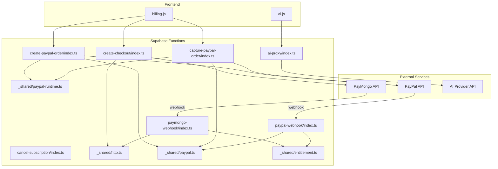
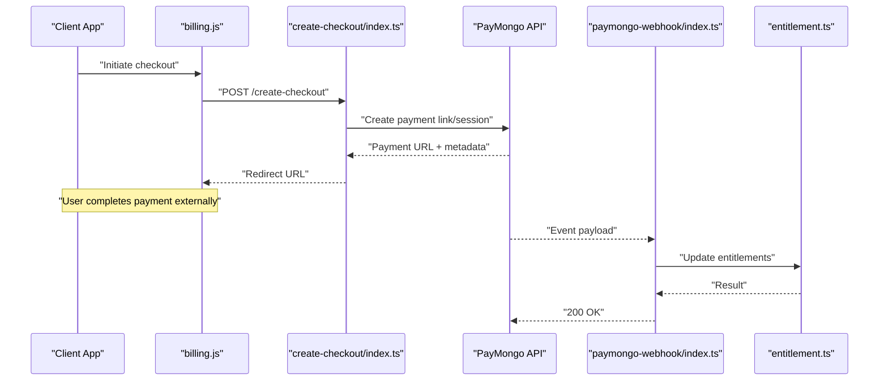
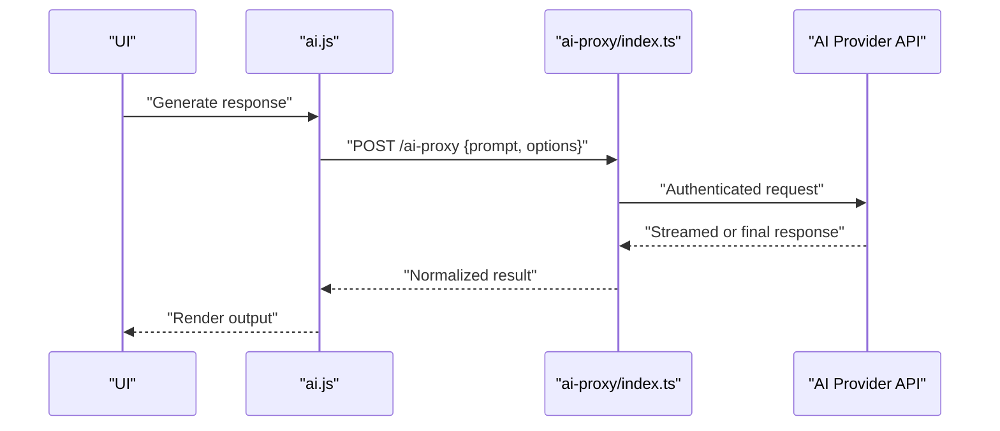
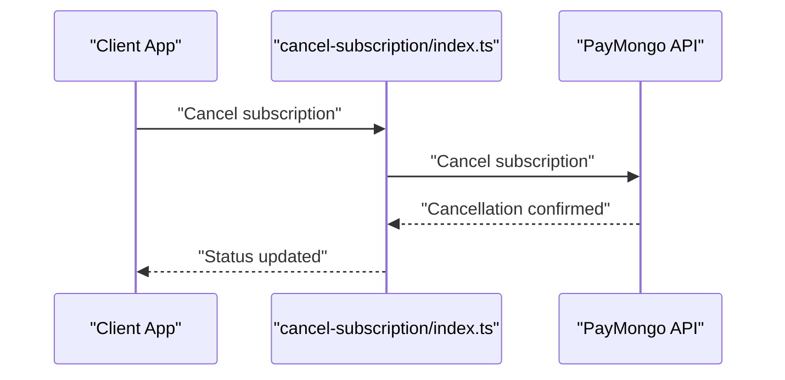
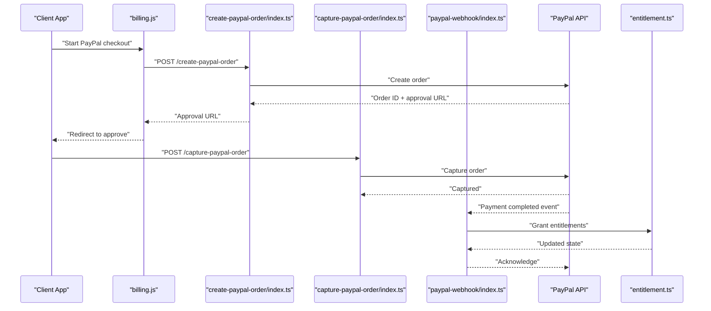
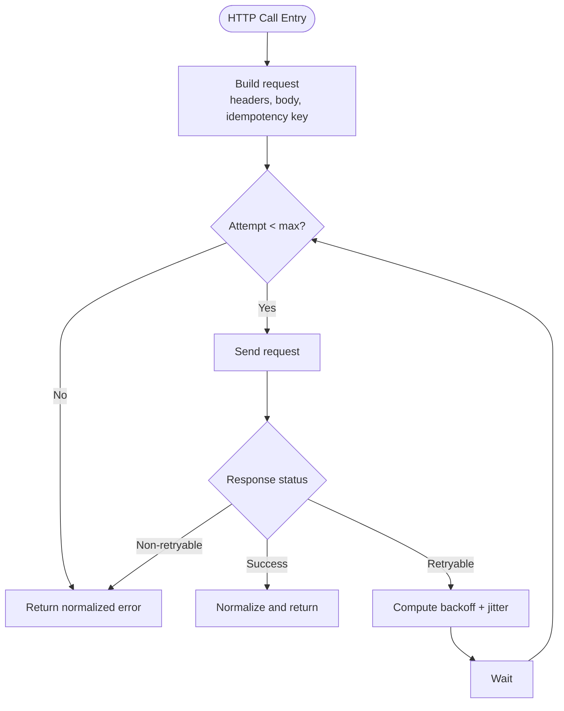
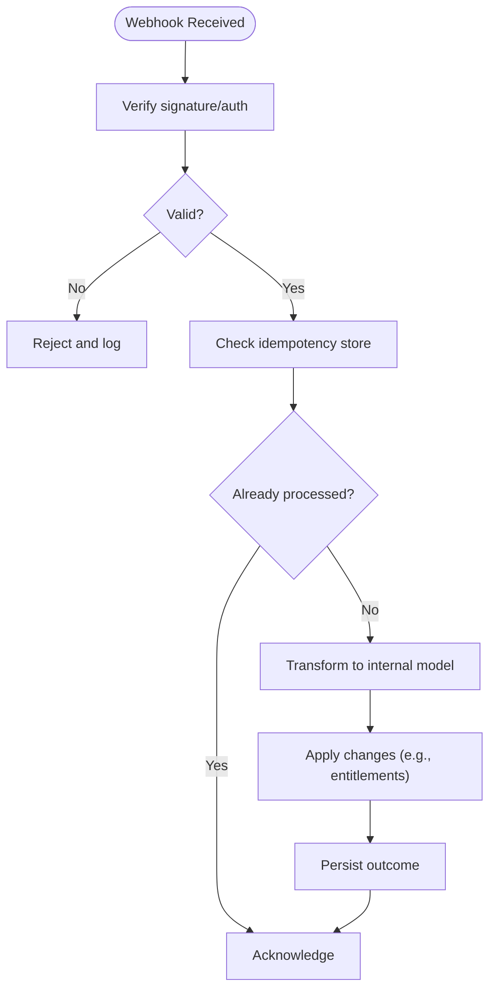
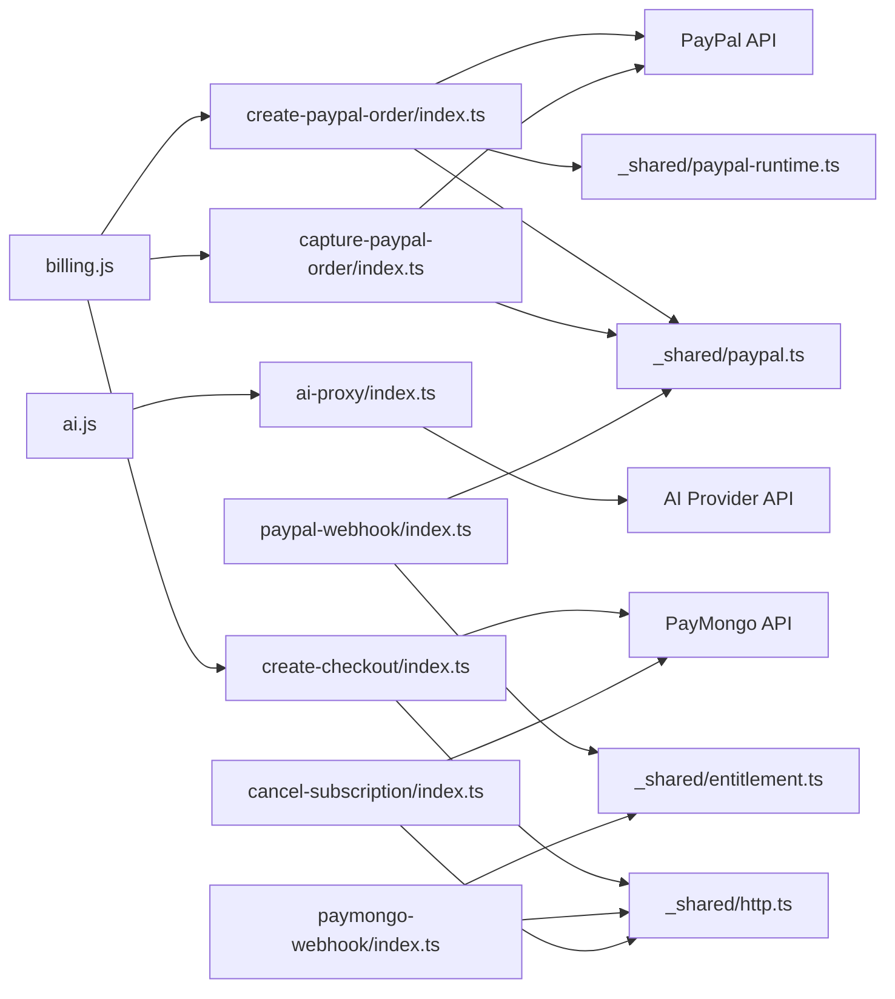

# Integration Patterns

<cite>
**Referenced Files in This Document**
- [ai-proxy/index.ts](file://supabase/functions/ai-proxy/index.ts)
- [create-checkout/index.ts](file://supabase/functions/create-checkout/index.ts)
- [paymongo-webhook/index.ts](file://supabase/functions/paymongo-webhook/index.ts)
- [cancel-subscription/index.ts](file://supabase/functions/cancel-subscription/index.ts)
- [create-paypal-order/index.ts](file://supabase/functions/create-paypal-order/index.ts)
- [capture-paypal-order/index.ts](file://supabase/functions/capture-paypal-order/index.ts)
- [paypal-webhook/index.ts](file://supabase/functions/paypal-webhook/index.ts)
- [http.ts](file://supabase/functions/_shared/http.ts)
- [paypal.ts](file://supabase/functions/_shared/paypal.ts)
- [paypal-runtime.ts](file://supabase/functions/_shared/paypal-runtime.ts)
- [entitlement.ts](file://supabase/functions/_shared/entitlement.ts)
- [billing.js](file://src/lib/billing.js)
- [ai.js](file://src/lib/ai.js)
- [03-subscriptions-paymongo.md](file://docs/superpowers/plans/monetization/03-subscriptions-paymongo.md)
- [04-ai-features.md](file://docs/superpowers/plans/monetization/04-ai-features.md)
</cite>

## Table of Contents
1. [Introduction](#introduction)
2. [Project Structure](#project-structure)
3. [Core Components](#core-components)
4. [Architecture Overview](#architecture-overview)
5. [Detailed Component Analysis](#detailed-component-analysis)
6. [Dependency Analysis](#dependency-analysis)
7. [Performance Considerations](#performance-considerations)
8. [Security Considerations](#security-considerations)
9. [Monitoring and Observability](#monitoring-and-observability)
10. [Troubleshooting Guide](#troubleshooting-guide)
11. [Conclusion](#conclusion)

## Introduction
This document describes the external integration patterns for AI services, payment processing (PayMongo and PayPal), and webhook handling. It focuses on API client patterns, retry strategies, error handling, subscription billing lifecycle, order fulfillment, authentication flows, data transformation, security considerations, rate limiting, and monitoring strategies for third-party dependencies.

## Project Structure
The integration surface is split between:
- Serverless functions (Supabase Functions) that act as secure proxies to third-party APIs and handle webhooks
- Shared libraries for HTTP transport and domain-specific clients (e.g., PayPal)
- Frontend libraries that orchestrate user flows and call serverless endpoints



**Diagram sources**
- [create-checkout/index.ts](file://supabase/functions/create-checkout/index.ts)
- [paymongo-webhook/index.ts](file://supabase/functions/paymongo-webhook/index.ts)
- [cancel-subscription/index.ts](file://supabase/functions/cancel-subscription/index.ts)
- [create-paypal-order/index.ts](file://supabase/functions/create-paypal-order/index.ts)
- [capture-paypal-order/index.ts](file://supabase/functions/capture-paypal-order/index.ts)
- [paypal-webhook/index.ts](file://supabase/functions/paypal-webhook/index.ts)
- [ai-proxy/index.ts](file://supabase/functions/ai-proxy/index.ts)
- [http.ts](file://supabase/functions/_shared/http.ts)
- [paypal.ts](file://supabase/functions/_shared/paypal.ts)
- [paypal-runtime.ts](file://supabase/functions/_shared/paypal-runtime.ts)
- [entitlement.ts](file://supabase/functions/_shared/entitlement.ts)
- [billing.js](file://src/lib/billing.js)
- [ai.js](file://src/lib/ai.js)

**Section sources**
- [03-subscriptions-paymongo.md](file://docs/superpowers/plans/monetization/03-subscriptions-paymongo.md)
- [04-ai-features.md](file://docs/superpowers/plans/monetization/04-ai-features.md)

## Core Components
- HTTP transport layer: Centralized request/response handling, headers, timeouts, retries, and error normalization used by all integrations.
- PayPal client: Encapsulates PayPal SDK/runtime configuration, order creation, capture, and webhook signature verification.
- Entitlements: Applies feature access based on subscription status and plan attributes.
- Billing orchestration: Frontend library coordinates checkout and order flows with serverless endpoints.
- AI proxy: Securely forwards prompts to the AI provider with credentials and response mapping.

Key responsibilities:
- Authentication and signing for outbound calls
- Idempotency and deduplication for webhooks
- Robust error handling and retry policies
- Data transformation between internal models and provider payloads

**Section sources**
- [http.ts](file://supabase/functions/_shared/http.ts)
- [paypal.ts](file://supabase/functions/_shared/paypal.ts)
- [paypal-runtime.ts](file://supabase/functions/_shared/paypal-runtime.ts)
- [entitlement.ts](file://supabase/functions/_shared/entitlement.ts)
- [billing.js](file://src/lib/billing.js)
- [ai.js](file://src/lib/ai.js)

## Architecture Overview
The system uses a thin frontend that delegates sensitive operations to serverless functions. These functions authenticate to third-party providers, transform payloads, persist state, and emit events or update entitlements. Webhooks are handled idempotently to ensure consistent state.



**Diagram sources**
- [billing.js](file://src/lib/billing.js)
- [create-checkout/index.ts](file://supabase/functions/create-checkout/index.ts)
- [paymongo-webhook/index.ts](file://supabase/functions/paymongo-webhook/index.ts)
- [entitlement.ts](file://supabase/functions/_shared/entitlement.ts)

## Detailed Component Analysis

### AI Service Integration
The AI integration follows a proxy pattern to keep secrets off the client and normalize responses. The frontend sends requests to a dedicated function which authenticates to the AI provider and returns structured results.



**Diagram sources**
- [ai.js](file://src/lib/ai.js)
- [ai-proxy/index.ts](file://supabase/functions/ai-proxy/index.ts)

**Section sources**
- [ai.js](file://src/lib/ai.js)
- [ai-proxy/index.ts](file://supabase/functions/ai-proxy/index.ts)
- [04-ai-features.md](file://docs/superpowers/plans/monetization/04-ai-features.md)

### PayMongo Subscription Billing
The PayMongo flow creates a checkout session, redirects the user, and updates entitlements upon successful payment via webhook. Cancellation is supported through a dedicated endpoint.

```mermaid
sequenceDiagram
participant Client as "Client App"
participant Billing as "billing.js"
participant Create as "create-checkout/index.ts"
participant PM as "PayMongo API"
participant WH as "paymongo-webhook/index.ts"
participant Ent as "entitlement.ts"
Client->>Billing : "Start subscription"
Billing->>Create : "POST /create-checkout"
Create->>PM : "Create checkout"
PM-->>Create : "Checkout URL"
Create-->>Billing : "URL"
Billing-->>Client : "Redirect"
PM-->>WH : "Payment succeeded event"
WH->>Ent : "Grant entitlements"
Ent-->>WH : "Updated state"
WH-->>PM : "Acknowledge"
```

Cancellation flow:



**Diagram sources**
- [billing.js](file://src/lib/billing.js)
- [create-checkout/index.ts](file://supabase/functions/create-checkout/index.ts)
- [paymongo-webhook/index.ts](file://supabase/functions/paymongo-webhook/index.ts)
- [cancel-subscription/index.ts](file://supabase/functions/cancel-subscription/index.ts)
- [entitlement.ts](file://supabase/functions/_shared/entitlement.ts)

**Section sources**
- [billing.js](file://src/lib/billing.js)
- [create-checkout/index.ts](file://supabase/functions/create-checkout/index.ts)
- [paymongo-webhook/index.ts](file://supabase/functions/paymongo-webhook/index.ts)
- [cancel-subscription/index.ts](file://supabase/functions/cancel-subscription/index.ts)
- [entitlement.ts](file://supabase/functions/_shared/entitlement.ts)
- [03-subscriptions-paymongo.md](file://docs/superpowers/plans/monetization/03-subscriptions-paymongo.md)

### PayPal Order Lifecycle and Fulfillment
PayPal integration includes order creation, capture, and webhook-driven fulfillment. The shared PayPal client abstracts runtime configuration and API calls.



**Diagram sources**
- [billing.js](file://src/lib/billing.js)
- [create-paypal-order/index.ts](file://supabase/functions/create-paypal-order/index.ts)
- [capture-paypal-order/index.ts](file://supabase/functions/capture-paypal-order/index.ts)
- [paypal-webhook/index.ts](file://supabase/functions/paypal-webhook/index.ts)
- [paypal.ts](file://supabase/functions/_shared/paypal.ts)
- [paypal-runtime.ts](file://supabase/functions/_shared/paypal-runtime.ts)
- [entitlement.ts](file://supabase/functions/_shared/entitlement.ts)

**Section sources**
- [billing.js](file://src/lib/billing.js)
- [create-paypal-order/index.ts](file://supabase/functions/create-paypal-order/index.ts)
- [capture-paypal-order/index.ts](file://supabase/functions/capture-paypal-order/index.ts)
- [paypal-webhook/index.ts](file://supabase/functions/paypal-webhook/index.ts)
- [paypal.ts](file://supabase/functions/_shared/paypal.ts)
- [paypal-runtime.ts](file://supabase/functions/_shared/paypal-runtime.ts)
- [entitlement.ts](file://supabase/functions/_shared/entitlement.ts)

### API Client Patterns and Retry Strategies
A centralized HTTP client standardizes:
- Request construction and header management
- Timeout and cancellation semantics
- Retry policy with exponential backoff and jitter
- Error classification and normalized responses
- Idempotency keys where applicable



**Diagram sources**
- [http.ts](file://supabase/functions/_shared/http.ts)

**Section sources**
- [http.ts](file://supabase/functions/_shared/http.ts)

### Webhook Handling Mechanisms
Webhooks must be verified, parsed, deduplicated, and processed idempotently. Both PayMongo and PayPal handlers follow similar patterns:
- Validate signatures or use platform verification
- Parse event payload and extract entity IDs
- Check local state to avoid duplicate processing
- Apply business changes (e.g., grant entitlements)
- Acknowledge receipt



**Diagram sources**
- [paymongo-webhook/index.ts](file://supabase/functions/paymongo-webhook/index.ts)
- [paypal-webhook/index.ts](file://supabase/functions/paypal-webhook/index.ts)
- [entitlement.ts](file://supabase/functions/_shared/entitlement.ts)

**Section sources**
- [paymongo-webhook/index.ts](file://supabase/functions/paymongo-webhook/index.ts)
- [paypal-webhook/index.ts](file://supabase/functions/paypal-webhook/index.ts)
- [entitlement.ts](file://supabase/functions/_shared/entitlement.ts)

## Dependency Analysis
The following diagram shows how components depend on each other and external services.



**Diagram sources**
- [billing.js](file://src/lib/billing.js)
- [ai.js](file://src/lib/ai.js)
- [create-checkout/index.ts](file://supabase/functions/create-checkout/index.ts)
- [create-paypal-order/index.ts](file://supabase/functions/create-paypal-order/index.ts)
- [capture-paypal-order/index.ts](file://supabase/functions/capture-paypal-order/index.ts)
- [paypal-webhook/index.ts](file://supabase/functions/paypal-webhook/index.ts)
- [paymongo-webhook/index.ts](file://supabase/functions/paymongo-webhook/index.ts)
- [cancel-subscription/index.ts](file://supabase/functions/cancel-subscription/index.ts)
- [ai-proxy/index.ts](file://supabase/functions/ai-proxy/index.ts)
- [http.ts](file://supabase/functions/_shared/http.ts)
- [paypal.ts](file://supabase/functions/_shared/paypal.ts)
- [paypal-runtime.ts](file://supabase/functions/_shared/paypal-runtime.ts)
- [entitlement.ts](file://supabase/functions/_shared/entitlement.ts)

**Section sources**
- [billing.js](file://src/lib/billing.js)
- [ai.js](file://src/lib/ai.js)
- [create-checkout/index.ts](file://supabase/functions/create-checkout/index.ts)
- [create-paypal-order/index.ts](file://supabase/functions/create-paypal-order/index.ts)
- [capture-paypal-order/index.ts](file://supabase/functions/capture-paypal-order/index.ts)
- [paypal-webhook/index.ts](file://supabase/functions/paypal-webhook/index.ts)
- [paymongo-webhook/index.ts](file://supabase/functions/paymongo-webhook/index.ts)
- [cancel-subscription/index.ts](file://supabase/functions/cancel-subscription/index.ts)
- [ai-proxy/index.ts](file://supabase/functions/ai-proxy/index.ts)
- [http.ts](file://supabase/functions/_shared/http.ts)
- [paypal.ts](file://supabase/functions/_shared/paypal.ts)
- [paypal-runtime.ts](file://supabase/functions/_shared/paypal-runtime.ts)
- [entitlement.ts](file://supabase/functions/_shared/entitlement.ts)

## Performance Considerations
- Use connection pooling and reuse clients where possible to reduce handshake overhead.
- Prefer streaming responses for long-running AI calls to improve perceived latency.
- Implement circuit breakers around third-party calls to fail fast during outages.
- Cache static configuration (e.g., PayPal client settings) at function startup.
- Batch or coalesce idempotent writes when processing high-volume webhooks.

[No sources needed since this section provides general guidance]

## Security Considerations
- Store secrets in environment variables; never hardcode credentials.
- Verify webhook signatures using provider-provided algorithms and secret values.
- Enforce least privilege for service accounts and API keys.
- Validate and sanitize all inbound payloads before processing.
- Use HTTPS-only communication and enforce TLS versions.
- Implement idempotency keys for create and capture operations to prevent double-charging.
- Restrict IP ranges or origins if supported by providers.

[No sources needed since this section provides general guidance]

## Monitoring and Observability
- Log structured events for each integration step (request, response, errors).
- Track success/failure rates, latency percentiles, and retry counts per provider.
- Emit metrics for webhook processing time and deduplication hits.
- Alert on sustained error spikes, signature verification failures, and timeout increases.
- Correlate logs across frontend, serverless functions, and provider dashboards.

[No sources needed since this section provides general guidance]

## Troubleshooting Guide
Common issues and resolutions:
- Webhook not received: Ensure public URLs are configured and DNS resolves correctly; verify provider’s delivery logs.
- Signature verification failed: Confirm secret values and algorithm match provider documentation; check timezone and clock skew.
- Duplicate processing: Verify idempotency checks and unique constraints in storage.
- Payment captured but entitlement not granted: Inspect post-capture steps and transaction boundaries; add compensating actions.
- Rate limited by provider: Reduce concurrency, implement backoff, and queue retries.

**Section sources**
- [paymongo-webhook/index.ts](file://supabase/functions/paymongo-webhook/index.ts)
- [paypal-webhook/index.ts](file://supabase/functions/paypal-webhook/index.ts)
- [http.ts](file://supabase/functions/_shared/http.ts)

## Conclusion
The integration architecture centralizes sensitive operations in serverless functions, standardizes HTTP behavior, and enforces robust error handling and idempotency. PayMongo and PayPal flows are clearly separated into creation, capture, and webhook stages, while the AI proxy secures provider interactions. With proper security, observability, and resilience measures, the system can reliably manage subscriptions and fulfill orders across multiple providers.