# System Architecture

<cite>
**Referenced Files in This Document**
- [App.jsx](file://src/App.jsx)
- [main.jsx](file://src/main.jsx)
- [store.jsx](file://src/store.jsx)
- [auth.jsx](file://src/auth.jsx)
- [supabase.js](file://src/lib/supabase.js)
- [cloud.js](file://src/lib/cloud.js)
- [sync.js](file://src/lib/sync.js)
- [storage.js](file://src/lib/storage.js)
- [entitlement.js](file://src/lib/entitlement.js)
- [billing.js](file://src/lib/billing.js)
- [AccountPage.jsx](file://src/components/AccountPage.jsx)
- [Settings.jsx](file://src/components/Settings.jsx)
- [Tracker.jsx](file://src/components/Tracker.jsx)
- [ScanForm.jsx](file://src/components/ScanForm.jsx)
- [AiAssistant.jsx](file://src/components/AiAssistant.jsx)
- [OfferPage.jsx](file://src/components/OffersPage.jsx)
- [ResultView.jsx](file://src/components/ResultView.jsx)
- [Layout.jsx](file://src/components/Layout.jsx)
- [index.html](file://index.html)
- [vite.config.js](file://vite.config.js)
- [capacitor.config.ts](file://capacitor.config.ts)
- [netlify.toml](file://netlify.toml)
- [vercel.json](file://vercel.json)
- [package.json](file://package.json)
- [config.toml](file://supabase/config.toml)
- [001_schema.sql](file://supabase/migrations/001_schema.sql)
- [002_paypal_fulfillment.sql](file://supabase/migrations/002_paypal_fulfillment.sql)
- [ai-proxy/index.ts](file://supabase/functions/ai-proxy/index.ts)
- [create-checkout/index.ts](file://supabase/functions/create-checkout/index.ts)
- [capture-paypal-order/index.ts](file://supabase/functions/capture-paypal-order/index.ts)
- [create-paypal-order/index.ts](file://supabase/functions/create-paypal-order/index.ts)
- [cancel-subscription/index.ts](file://supabase/functions/cancel-subscription/index.ts)
- [paymongo-webhook/index.ts](file://supabase/functions/paymongo-webhook/index.ts)
- [paypal-webhook/index.ts](file://supabase/functions/paypal-webhook/index.ts)
- [download-message-pack/index.ts](file://supabase/functions/download-message-pack/index.ts)
- [entitlement.ts](file://supabase/functions/_shared/entitlement.ts)
- [http.ts](file://supabase/functions/_shared/http.ts)
- [prompt.ts](file://supabase/functions/_shared/prompts.ts)
- [manifest.webmanifest](file://public/manifest.webmanifest)
- [sw.js](file://public/sw.js)
</cite>

## Table of Contents
1. [Introduction](#introduction)
2. [Project Structure](#project-structure)
3. [Core Components](#core-components)
4. [Architecture Overview](#architecture-overview)
5. [Detailed Component Analysis](#detailed-component-analysis)
6. [Dependency Analysis](#dependency-analysis)
7. [Performance Considerations](#performance-considerations)
8. [Security Architecture](#security-architecture)
9. [Scalability and Deployment Topology](#scalability-and-deployment-topology)
10. [Troubleshooting Guide](#troubleshooting-guide)
11. [Conclusion](#conclusion)

## Introduction
This document describes the system architecture for ApplyGuard PH, a web-first application with mobile packaging via Capacitor. It focuses on component-based UI design, service-layer separation, state management strategy, data flow from local storage to cloud synchronization, and integration points with Supabase Functions for billing and AI proxying. The goal is to provide both high-level architectural insights and code-level references for developers and operators.

## Project Structure
The project follows a feature-oriented layout:
- src/components: React components for user-facing features (account, settings, tracker, scan form, AI assistant, offers, results).
- src/lib: Service layer modules for storage, sync, cloud communication, entitlements, billing, and domain logic.
- supabase/functions: Serverless functions for billing flows, webhook handling, AI proxy, and shared utilities.
- supabase/migrations: Database schema and migration scripts.
- public: PWA assets including manifest and service worker.
- Root configuration files for build, deployment, and runtime behavior.

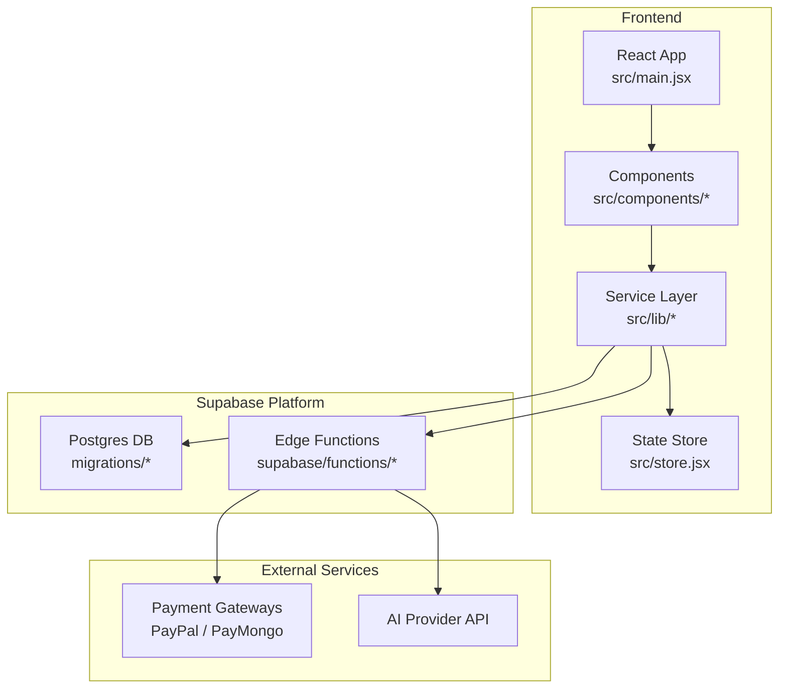

**Diagram sources**
- [main.jsx](file://src/main.jsx)
- [store.jsx](file://src/store.jsx)
- [supabase.js](file://src/lib/supabase.js)
- [cloud.js](file://src/lib/cloud.js)
- [sync.js](file://src/lib/sync.js)
- [001_schema.sql](file://supabase/migrations/001_schema.sql)
- [ai-proxy/index.ts](file://supabase/functions/ai-proxy/index.ts)
- [create-checkout/index.ts](file://supabase/functions/create-checkout/index.ts)

**Section sources**
- [main.jsx](file://src/main.jsx)
- [package.json](file://package.json)
- [vite.config.js](file://vite.config.js)

## Core Components
- Application shell and routing:
  - Entry point initializes the app and mounts the root component.
  - Layout component provides consistent structure across pages.
- Feature components:
  - Account and Settings manage user profile and preferences.
  - Tracker and ScanForm handle core scanning workflows.
  - AiAssistant integrates AI capabilities through server-side proxy.
  - Offers and ResultView present outcomes and related actions.
- State management:
  - Centralized store coordinates UI state and persistence hooks.
- Service layer:
  - Storage module abstracts local persistence.
  - Sync module orchestrates conflict resolution and real-time updates.
  - Cloud module encapsulates Supabase client usage and function calls.
  - Entitlement and Billing modules implement subscription checks and checkout flows.

**Section sources**
- [App.jsx](file://src/App.jsx)
- [Layout.jsx](file://src/components/Layout.jsx)
- [store.jsx](file://src/store.jsx)
- [storage.js](file://src/lib/storage.js)
- [sync.js](file://src/lib/sync.js)
- [cloud.js](file://src/lib/cloud.js)
- [entitlement.js](file://src/lib/entitlement.js)
- [billing.js](file://src/lib/billing.js)
- [AccountPage.jsx](file://src/components/AccountPage.jsx)
- [Settings.jsx](file://src/components/Settings.jsx)
- [Tracker.jsx](file://src/components/Tracker.jsx)
- [ScanForm.jsx](file://src/components/ScanForm.jsx)
- [AiAssistant.jsx](file://src/components/AiAssistant.jsx)
- [OffersPage.jsx](file://src/components/OffersPage.jsx)
- [ResultView.jsx](file://src/components/ResultView.jsx)

## Architecture Overview
ApplyGuard PH uses a component-based frontend with a clear service-layer separation. Data flows from user interactions into local storage, then synchronizes with Supabase Postgres via the Supabase client. Real-time subscriptions keep UI in sync. Billing and AI operations are routed through Supabase Edge Functions to external providers.

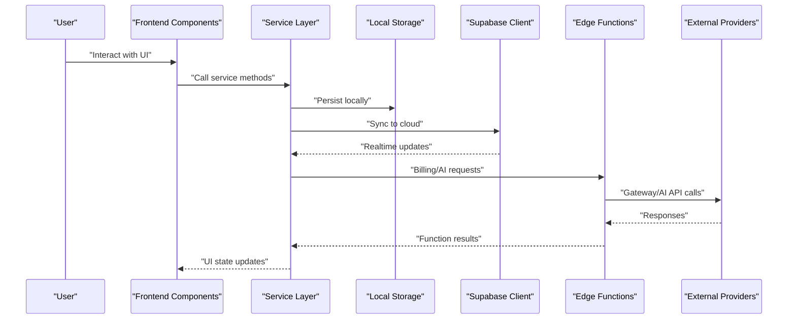

**Diagram sources**
- [sync.js](file://src/lib/sync.js)
- [supabase.js](file://src/lib/supabase.js)
- [cloud.js](file://src/lib/cloud.js)
- [create-checkout/index.ts](file://supabase/functions/create-checkout/index.ts)
- [ai-proxy/index.ts](file://supabase/functions/ai-proxy/index.ts)

## Detailed Component Analysis

### Frontend Shell and Routing
- main.jsx bootstraps the React application and mounts the root component tree.
- App.jsx defines top-level routing and layout composition.
- Layout.jsx provides consistent page chrome and navigation.

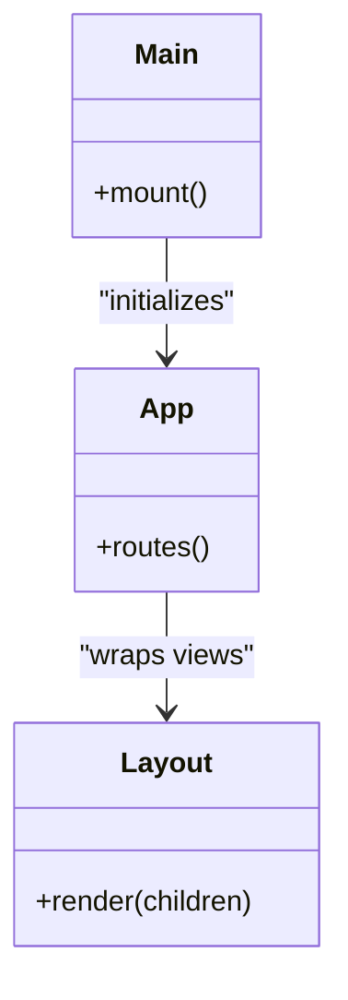

**Diagram sources**
- [main.jsx](file://src/main.jsx)
- [App.jsx](file://src/App.jsx)
- [Layout.jsx](file://src/components/Layout.jsx)

**Section sources**
- [main.jsx](file://src/main.jsx)
- [App.jsx](file://src/App.jsx)
- [Layout.jsx](file://src/components/Layout.jsx)

### State Management Strategy
- store.jsx centralizes application state and exposes reactive bindings to components.
- Components subscribe to relevant slices of state and dispatch actions or call service layer methods to mutate state.
- Local persistence is coordinated by the storage module; sync module reconciles with cloud state.

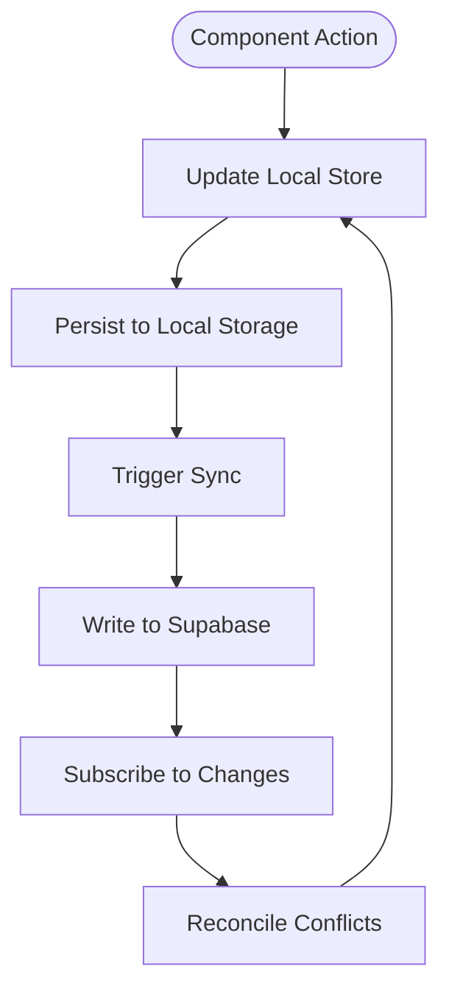

**Diagram sources**
- [store.jsx](file://src/store.jsx)
- [storage.js](file://src/lib/storage.js)
- [sync.js](file://src/lib/sync.js)
- [supabase.js](file://src/lib/supabase.js)

**Section sources**
- [store.jsx](file://src/store.jsx)
- [storage.js](file://src/lib/storage.js)
- [sync.js](file://src/lib/sync.js)

### Service Layer Modules
- supabase.js configures the Supabase client and common database helpers.
- cloud.js wraps function invocations and error handling for server-side operations.
- sync.js implements conflict detection, merge strategies, and realtime subscriptions.
- entitlement.js evaluates feature access based on subscription status.
- billing.js orchestrates checkout and subscription lifecycle.

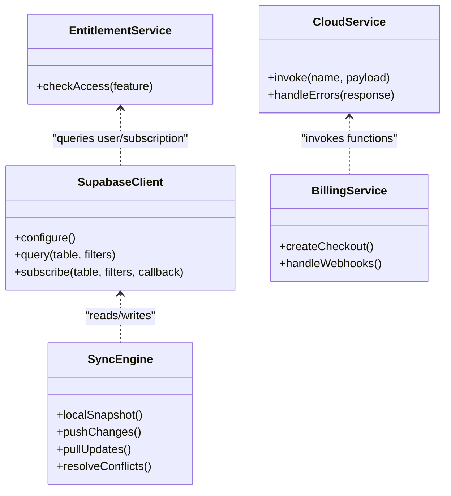

**Diagram sources**
- [supabase.js](file://src/lib/supabase.js)
- [cloud.js](file://src/lib/cloud.js)
- [sync.js](file://src/lib/sync.js)
- [entitlement.js](file://src/lib/entitlement.js)
- [billing.js](file://src/lib/billing.js)

**Section sources**
- [supabase.js](file://src/lib/supabase.js)
- [cloud.js](file://src/lib/cloud.js)
- [sync.js](file://src/lib/sync.js)
- [entitlement.js](file://src/lib/entitlement.js)
- [billing.js](file://src/lib/billing.js)

### Feature Components
- AccountPage.jsx and Settings.jsx manage user account details and app preferences.
- Tracker.jsx and ScanForm.jsx implement scanning workflows and result capture.
- AiAssistant.jsx triggers AI-powered assistance via server-side proxy.
- OffersPage.jsx and ResultView.jsx display outcomes and next actions.

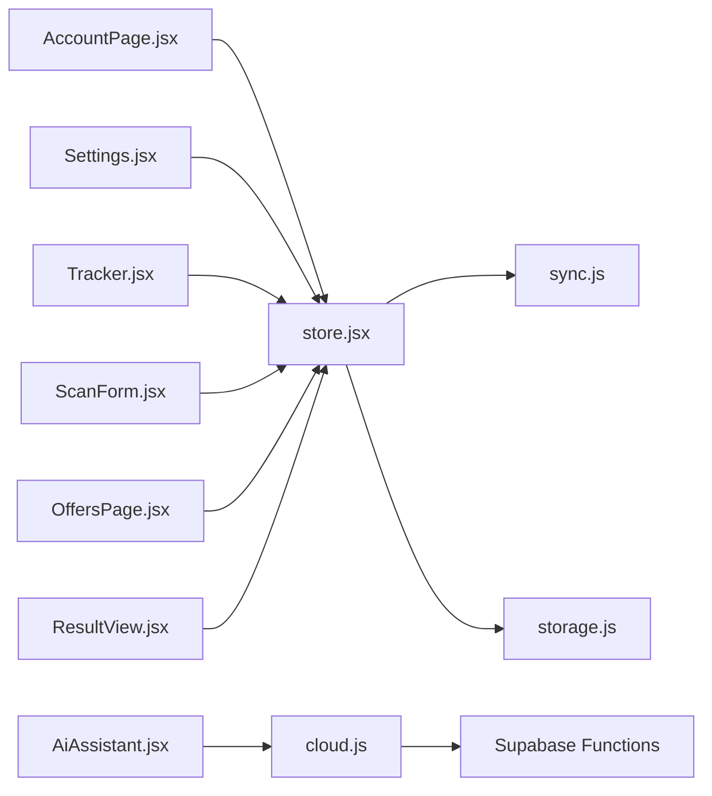

**Diagram sources**
- [AccountPage.jsx](file://src/components/AccountPage.jsx)
- [Settings.jsx](file://src/components/Settings.jsx)
- [Tracker.jsx](file://src/components/Tracker.jsx)
- [ScanForm.jsx](file://src/components/ScanForm.jsx)
- [AiAssistant.jsx](file://src/components/AiAssistant.jsx)
- [OffersPage.jsx](file://src/components/OffersPage.jsx)
- [ResultView.jsx](file://src/components/ResultView.jsx)
- [store.jsx](file://src/store.jsx)
- [sync.js](file://src/lib/sync.js)
- [storage.js](file://src/lib/storage.js)
- [cloud.js](file://src/lib/cloud.js)

**Section sources**
- [AccountPage.jsx](file://src/components/AccountPage.jsx)
- [Settings.jsx](file://src/components/Settings.jsx)
- [Tracker.jsx](file://src/components/Tracker.jsx)
- [ScanForm.jsx](file://src/components/ScanForm.jsx)
- [AiAssistant.jsx](file://src/components/AiAssistant.jsx)
- [OffersPage.jsx](file://src/components/OffersPage.jsx)
- [ResultView.jsx](file://src/components/ResultView.jsx)

### Authentication Flow
- auth.jsx handles authentication state and guards routes.
- Supabase client manages sessions and tokens.

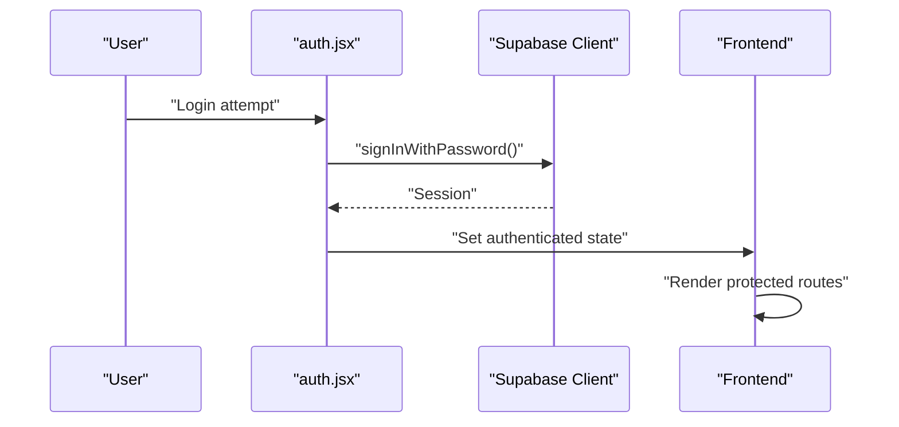

**Diagram sources**
- [auth.jsx](file://src/auth.jsx)
- [supabase.js](file://src/lib/supabase.js)

**Section sources**
- [auth.jsx](file://src/auth.jsx)
- [supabase.js](file://src/lib/supabase.js)

### Billing and Webhooks
- billing.js initiates checkout flows and subscribes to events.
- create-checkout function prepares payment sessions.
- capture-paypal-order and create-paypal-order orchestrate PayPal order lifecycle.
- cancel-subscription handles cancellation requests.
- paymongo-webhook and paypal-webhook process provider callbacks to update entitlements.

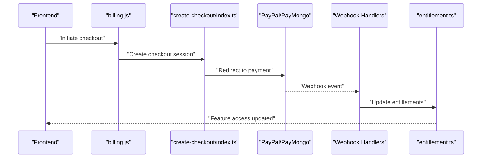

**Diagram sources**
- [billing.js](file://src/lib/billing.js)
- [create-checkout/index.ts](file://supabase/functions/create-checkout/index.ts)
- [capture-paypal-order/index.ts](file://supabase/functions/capture-paypal-order/index.ts)
- [create-paypal-order/index.ts](file://supabase/functions/create-paypal-order/index.ts)
- [cancel-subscription/index.ts](file://supabase/functions/cancel-subscription/index.ts)
- [paymongo-webhook/index.ts](file://supabase/functions/paymongo-webhook/index.ts)
- [paypal-webhook/index.ts](file://supabase/functions/paypal-webhook/index.ts)
- [entitlement.ts](file://supabase/functions/_shared/entitlement.ts)

**Section sources**
- [billing.js](file://src/lib/billing.js)
- [create-checkout/index.ts](file://supabase/functions/create-checkout/index.ts)
- [capture-paypal-order/index.ts](file://supabase/functions/capture-paypal-order/index.ts)
- [create-paypal-order/index.ts](file://supabase/functions/create-paypal-order/index.ts)
- [cancel-subscription/index.ts](file://supabase/functions/cancel-subscription/index.ts)
- [paymongo-webhook/index.ts](file://supabase/functions/paymongo-webhook/index.ts)
- [paypal-webhook/index.ts](file://supabase/functions/paypal-webhook/index.ts)
- [entitlement.ts](file://supabase/functions/_shared/entitlement.ts)

### AI Proxy Integration
- AiAssistant.jsx invokes AI capabilities via ai-proxy function.
- ai-proxy/index.ts forwards prompts to the AI provider and returns structured responses.
- Shared prompt templates reside in prompts.ts.

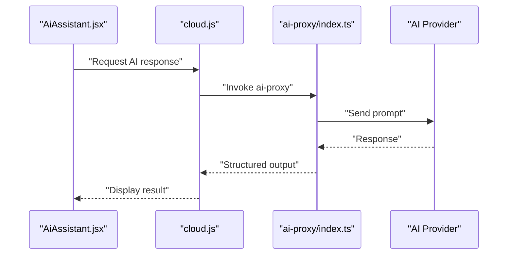

**Diagram sources**
- [AiAssistant.jsx](file://src/components/AiAssistant.jsx)
- [cloud.js](file://src/lib/cloud.js)
- [ai-proxy/index.ts](file://supabase/functions/ai-proxy/index.ts)
- [prompt.ts](file://supabase/functions/_shared/prompts.ts)

**Section sources**
- [AiAssistant.jsx](file://src/components/AiAssistant.jsx)
- [cloud.js](file://src/lib/cloud.js)
- [ai-proxy/index.ts](file://supabase/functions/ai-proxy/index.ts)
- [prompt.ts](file://supabase/functions/_shared/prompts.ts)

## Dependency Analysis
The frontend depends on:
- React ecosystem and Vite for build tooling.
- Supabase client for database and realtime.
- Capacitor for mobile packaging.
- PWA assets for offline support.

Serverless functions depend on:
- Supabase runtime environment.
- External payment gateways and AI APIs.

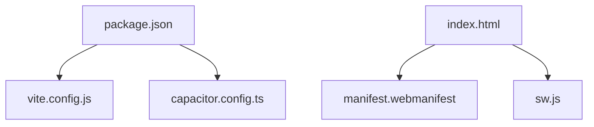

**Diagram sources**
- [package.json](file://package.json)
- [vite.config.js](file://vite.config.js)
- [capacitor.config.ts](file://capacitor.config.ts)
- [index.html](file://index.html)
- [manifest.webmanifest](file://public/manifest.webmanifest)
- [sw.js](file://public/sw.js)

**Section sources**
- [package.json](file://package.json)
- [vite.config.js](file://vite.config.js)
- [capacitor.config.ts](file://capacitor.config.ts)
- [index.html](file://index.html)
- [manifest.webmanifest](file://public/manifest.webmanifest)
- [sw.js](file://public/sw.js)

## Performance Considerations
- Prefer lightweight local state updates and batched writes to reduce network overhead.
- Use targeted realtime subscriptions to minimize payload size.
- Cache frequently accessed data locally and invalidate on changes.
- Defer heavy computations off the main thread where possible.
- Optimize images and assets for faster initial load.

[No sources needed since this section provides general guidance]

## Security Architecture
- Authentication handled via Supabase with secure session management.
- Authorization enforced at the database level using Row Level Security policies defined in migrations.
- Sensitive operations (billing, AI proxy) executed in serverless functions to protect secrets and enforce business rules.
- Webhooks validated and processed securely to prevent tampering.

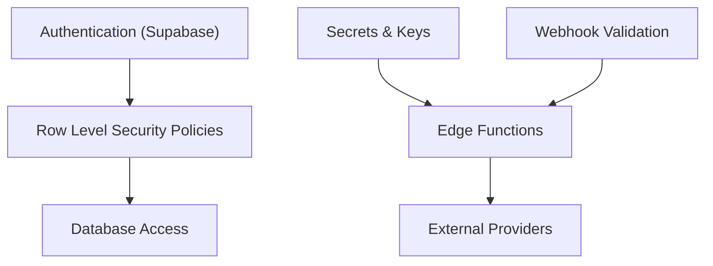

**Diagram sources**
- [auth.jsx](file://src/auth.jsx)
- [001_schema.sql](file://supabase/migrations/001_schema.sql)
- [002_paypal_fulfillment.sql](file://supabase/migrations/002_paypal_fulfillment.sql)
- [ai-proxy/index.ts](file://supabase/functions/ai-proxy/index.ts)
- [paymongo-webhook/index.ts](file://supabase/functions/paymongo-webhook/index.ts)
- [paypal-webhook/index.ts](file://supabase/functions/paypal-webhook/index.ts)

**Section sources**
- [auth.jsx](file://src/auth.jsx)
- [001_schema.sql](file://supabase/migrations/001_schema.sql)
- [002_paypal_fulfillment.sql](file://supabase/migrations/002_paypal_fulfillment.sql)
- [ai-proxy/index.ts](file://supabase/functions/ai-proxy/index.ts)
- [paymongo-webhook/index.ts](file://supabase/functions/paymongo-webhook/index.ts)
- [paypal-webhook/index.ts](file://supabase/functions/paypal-webhook/index.ts)

## Scalability and Deployment Topology
- Frontend deployed via Netlify or Vercel for global CDN distribution.
- Supabase platform provides scalable Postgres, Edge Functions, and realtime infrastructure.
- Capacitor enables packaging the same codebase for mobile platforms.
- PWA service worker improves offline resilience and performance.

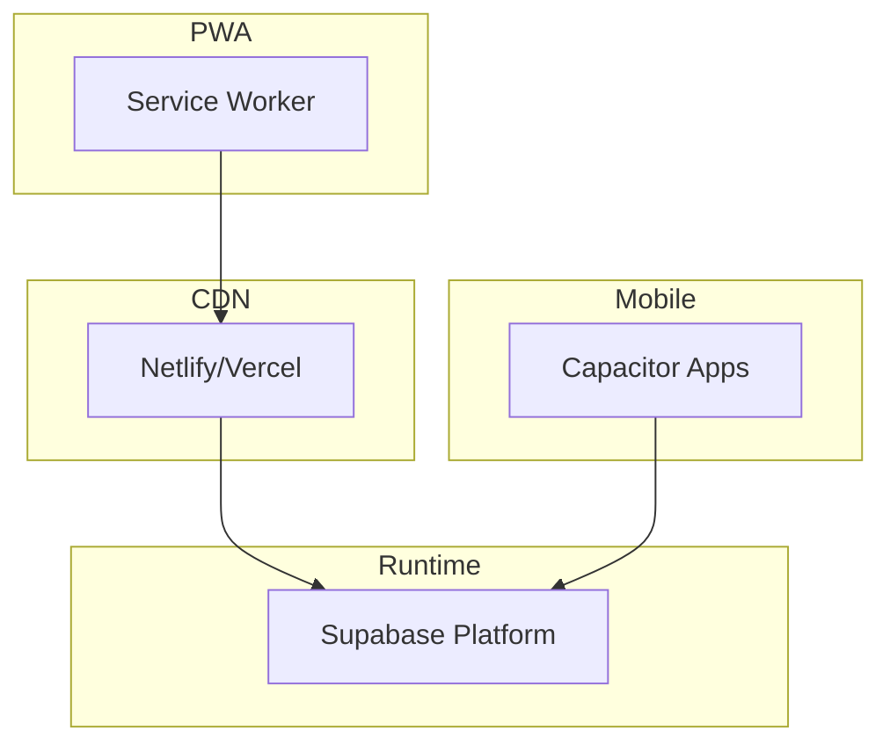

**Diagram sources**
- [netlify.toml](file://netlify.toml)
- [vercel.json](file://vercel.json)
- [capacitor.config.ts](file://capacitor.config.ts)
- [sw.js](file://public/sw.js)
- [config.toml](file://supabase/config.toml)

**Section sources**
- [netlify.toml](file://netlify.toml)
- [vercel.json](file://vercel.json)
- [capacitor.config.ts](file://capacitor.config.ts)
- [sw.js](file://public/sw.js)
- [config.toml](file://supabase/config.toml)

## Troubleshooting Guide
- Authentication issues:
  - Verify session state and token validity.
  - Check Supabase client configuration and environment variables.
- Sync conflicts:
  - Inspect local snapshot vs cloud state.
  - Review conflict resolution logic and timestamps.
- Billing failures:
  - Validate webhook signatures and payloads.
  - Confirm function logs for gateway errors.
- AI proxy errors:
  - Ensure prompt formatting and provider credentials.
  - Monitor function latency and rate limits.

**Section sources**
- [auth.jsx](file://src/auth.jsx)
- [supabase.js](file://src/lib/supabase.js)
- [sync.js](file://src/lib/sync.js)
- [billing.js](file://src/lib/billing.js)
- [ai-proxy/index.ts](file://supabase/functions/ai-proxy/index.ts)
- [paymongo-webhook/index.ts](file://supabase/functions/paymongo-webhook/index.ts)
- [paypal-webhook/index.ts](file://supabase/functions/paypal-webhook/index.ts)

## Conclusion
ApplyGuard PH employs a clean separation between UI components and service-layer modules, leveraging Supabase for data persistence, realtime updates, and serverless functions. The architecture supports scalability through CDN-hosted frontends and managed backend services, while maintaining security via RLS and function-bound secrets. The data flow ensures reliable local-first operation with robust cloud synchronization and real-time consistency.