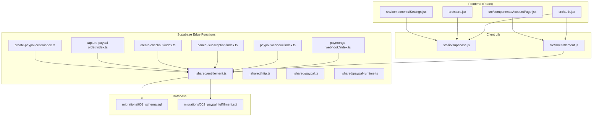
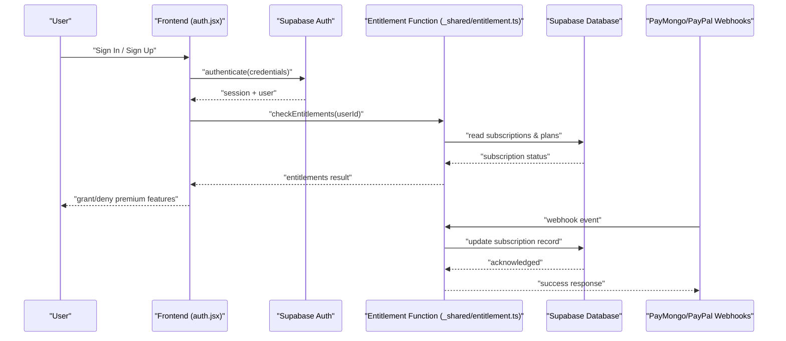
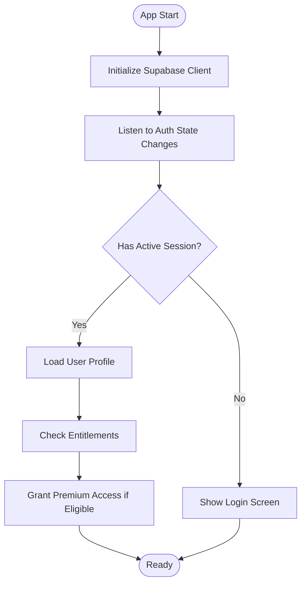
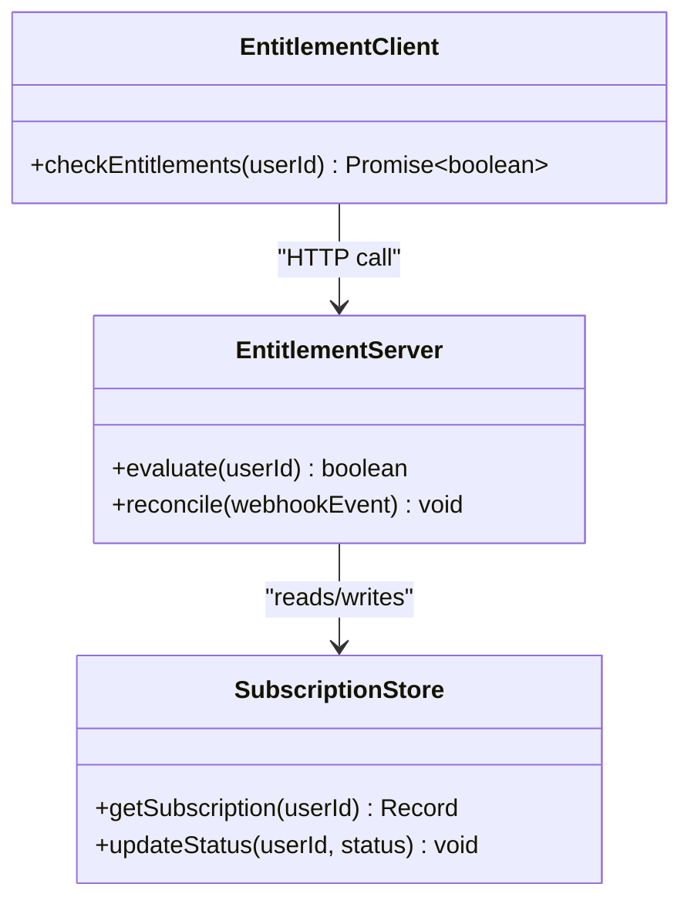
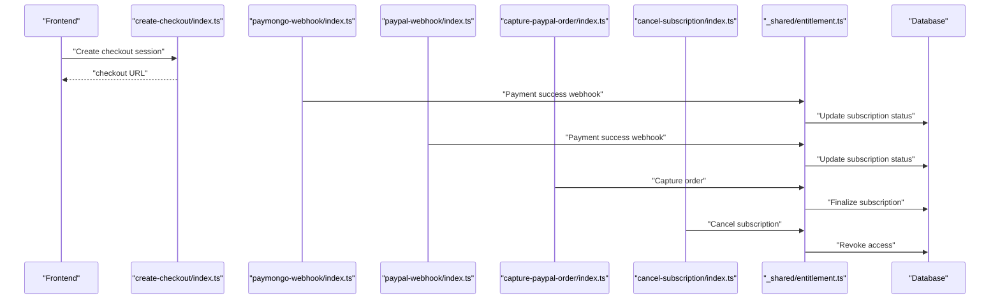
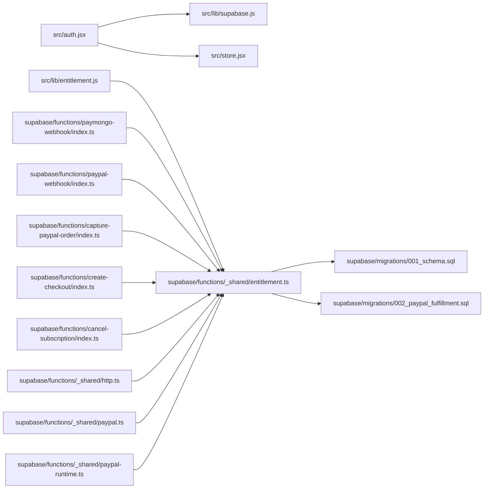

# Authentication & User Management

<cite>
**Referenced Files in This Document**
- [src/auth.jsx](file://src/auth.jsx)
- [src/lib/supabase.js](file://src/lib/supabase.js)
- [src/store.jsx](file://src/store.jsx)
- [src/components/AccountPage.jsx](file://src/components/AccountPage.jsx)
- [src/components/Settings.jsx](file://src/components/Settings.jsx)
- [src/lib/entitlement.js](file://src/lib/entitlement.js)
- [supabase/functions/_shared/entitlement.ts](file://supabase/functions/_shared/entitlement.ts)
- [supabase/migrations/001_schema.sql](file://supabase/migrations/001_schema.sql)
- [supabase/migrations/002_paypal_fulfillment.sql](file://supabase/migrations/002_paypal_fulfillment.sql)
- [supabase/functions/paymongo-webhook/index.ts](file://supabase/functions/paymongo-webhook/index.ts)
- [supabase/functions/paypal-webhook/index.ts](file://supabase/functions/paypal-webhook/index.ts)
- [supabase/functions/cancel-subscription/index.ts](file://supabase/functions/cancel-subscription/index.ts)
- [supabase/functions/create-checkout/index.ts](file://supabase/functions/create-checkout/index.ts)
- [supabase/functions/capture-paypal-order/index.ts](file://supabase/functions/capture-paypal-order/index.ts)
- [supabase/functions/create-paypal-order/index.ts](file://supabase/functions/create-paypal-order/index.ts)
- [supabase/functions/_shared/http.ts](file://supabase/functions/_shared/http.ts)
- [supabase/functions/_shared/paypal.ts](file://supabase/functions/_shared/paypal.ts)
- [supabase/functions/_shared/paypal-runtime.ts](file://supabase/functions/_shared/paypal-runtime.ts)
- [supabase/config.toml](file://supabase/config.toml)
- [package.json](file://package.json)
</cite>

## Table of Contents
1. [Introduction](#introduction)
2. [Project Structure](#project-structure)
3. [Core Components](#core-components)
4. [Architecture Overview](#architecture-overview)
5. [Detailed Component Analysis](#detailed-component-analysis)
6. [Dependency Analysis](#dependency-analysis)
7. [Performance Considerations](#performance-considerations)
8. [Troubleshooting Guide](#troubleshooting-guide)
9. [Conclusion](#conclusion)
10. [Appendices](#appendices)

## Introduction
This document explains how ApplyGuard PH handles authentication, user sessions, and account lifecycle using Supabase. It also documents the entitlement system for premium features, subscription status tracking, access control mechanisms, user profile data structure, preferences management, and account settings. Security considerations, password policies, and data privacy measures are included, along with the relationship between authentication state and feature access.

## Project Structure
The authentication and user management logic spans client-side React code, Supabase client configuration, serverless functions for billing and entitlements, and database migrations that define schema and subscription fulfillment.



**Diagram sources**
- [src/auth.jsx:1-200](file://src/auth.jsx#L1-L200)
- [src/lib/supabase.js:1-200](file://src/lib/supabase.js#L1-L200)
- [src/lib/entitlement.js:1-200](file://src/lib/entitlement.js#L1-L200)
- [supabase/functions/_shared/entitlement.ts:1-200](file://supabase/functions/_shared/entitlement.ts#L1-L200)
- [supabase/migrations/001_schema.sql:1-200](file://supabase/migrations/001_schema.sql#L1-L200)
- [supabase/migrations/002_paypal_fulfillment.sql:1-200](file://supabase/migrations/002_paypal_fulfillment.sql#L1-L200)
- [supabase/functions/paymongo-webhook/index.ts:1-200](file://supabase/functions/paymongo-webhook/index.ts#L1-L200)
- [supabase/functions/paypal-webhook/index.ts:1-200](file://supabase/functions/paypal-webhook/index.ts#L1-L200)
- [supabase/functions/cancel-subscription/index.ts:1-200](file://supabase/functions/cancel-subscription/index.ts#L1-L200)
- [supabase/functions/create-checkout/index.ts:1-200](file://supabase/functions/create-checkout/index.ts#L1-L200)
- [supabase/functions/capture-paypal-order/index.ts:1-200](file://supabase/functions/capture-paypal-order/index.ts#L1-L200)
- [supabase/functions/create-paypal-order/index.ts:1-200](file://supabase/functions/create-paypal-order/index.ts#L1-L200)
- [supabase/functions/_shared/http.ts:1-200](file://supabase/functions/_shared/http.ts#L1-L200)
- [supabase/functions/_shared/paypal.ts:1-200](file://supabase/functions/_shared/paypal.ts#L1-L200)
- [supabase/functions/_shared/paypal-runtime.ts:1-200](file://supabase/functions/_shared/paypal-runtime.ts#L1-L200)

**Section sources**
- [src/auth.jsx:1-200](file://src/auth.jsx#L1-L200)
- [src/lib/supabase.js:1-200](file://src/lib/supabase.js#L1-L200)
- [src/lib/entitlement.js:1-200](file://src/lib/entitlement.js#L1-L200)
- [supabase/functions/_shared/entitlement.ts:1-200](file://supabase/functions/_shared/entitlement.ts#L1-L200)
- [supabase/migrations/001_schema.sql:1-200](file://supabase/migrations/001_schema.sql#L1-L200)
- [supabase/migrations/002_paypal_fulfillment.sql:1-200](file://supabase/migrations/002_paypal_fulfillment.sql#L1-L200)

## Core Components
- Authentication entry point and session handling:
  - The auth module initializes the Supabase client, manages sign-in/sign-out flows, and exposes current session and user state to the app.
  - It integrates with global store to keep UI in sync with auth state changes.
- Supabase client configuration:
  - Centralized client setup with environment-based configuration and default options.
- Entitlements and access control:
  - Client-side entitlement checks call a shared serverless function to determine premium feature access based on subscription status.
- Account and Settings pages:
  - Provide UI for viewing/updating profile data and managing preferences.

Key responsibilities:
- Maintain authenticated session across navigation and refreshes.
- Enforce feature gating based on entitlements.
- Persist minimal user preferences locally while syncing critical settings via Supabase.

**Section sources**
- [src/auth.jsx:1-200](file://src/auth.jsx#L1-L200)
- [src/store.jsx:1-200](file://src/store.jsx#L1-L200)
- [src/lib/supabase.js:1-200](file://src/lib/supabase.js#L1-L200)
- [src/lib/entitlement.js:1-200](file://src/lib/entitlement.js#L1-L200)
- [src/components/AccountPage.jsx:1-200](file://src/components/AccountPage.jsx#L1-L200)
- [src/components/Settings.jsx:1-200](file://src/components/Settings.jsx#L1-L200)

## Architecture Overview
Authentication and entitlements flow:
- Frontend uses Supabase client to authenticate users and maintain sessions.
- Feature access is determined by calling a serverless entitlement function that reads subscription state from the database.
- Billing webhooks update subscription records; serverless functions reconcile payments and grant or revoke access accordingly.



**Diagram sources**
- [src/auth.jsx:1-200](file://src/auth.jsx#L1-L200)
- [src/lib/supabase.js:1-200](file://src/lib/supabase.js#L1-L200)
- [src/lib/entitlement.js:1-200](file://src/lib/entitlement.js#L1-L200)
- [supabase/functions/_shared/entitlement.ts:1-200](file://supabase/functions/_shared/entitlement.ts#L1-L200)
- [supabase/functions/paymongo-webhook/index.ts:1-200](file://supabase/functions/paymongo-webhook/index.ts#L1-L200)
- [supabase/functions/paypal-webhook/index.ts:1-200](file://supabase/functions/paypal-webhook/index.ts#L1-L200)
- [supabase/migrations/001_schema.sql:1-200](file://supabase/migrations/001_schema.sql#L1-L200)
- [supabase/migrations/002_paypal_fulfillment.sql:1-200](file://supabase/migrations/002_paypal_fulfillment.sql#L1-L200)

## Detailed Component Analysis

### Authentication and Session Management
- Initialization:
  - The auth module sets up the Supabase client and listens for auth state changes to keep the application synchronized.
- Sign-in/Sign-up:
  - Supports email/password and provider-based flows through Supabase Auth.
- Session persistence:
  - Relies on Supabase’s built-in session storage and auto-refresh behavior.
- Global integration:
  - Exposes current user/session to the app via a centralized store.



**Diagram sources**
- [src/auth.jsx:1-200](file://src/auth.jsx#L1-L200)
- [src/lib/supabase.js:1-200](file://src/lib/supabase.js#L1-L200)
- [src/store.jsx:1-200](file://src/store.jsx#L1-L200)

**Section sources**
- [src/auth.jsx:1-200](file://src/auth.jsx#L1-L200)
- [src/lib/supabase.js:1-200](file://src/lib/supabase.js#L1-L200)
- [src/store.jsx:1-200](file://src/store.jsx#L1-L200)

### Entitlement System and Access Control
- Client-side checks:
  - The entitlement library calls a serverless function to evaluate whether a user has premium access.
- Server-side evaluation:
  - The shared entitlement function queries subscription records and plan details to compute entitlements.
- Subscription updates:
  - Payment webhooks trigger entitlement updates via serverless functions.



**Diagram sources**
- [src/lib/entitlement.js:1-200](file://src/lib/entitlement.js#L1-L200)
- [supabase/functions/_shared/entitlement.ts:1-200](file://supabase/functions/_shared/entitlement.ts#L1-L200)
- [supabase/migrations/001_schema.sql:1-200](file://supabase/migrations/001_schema.sql#L1-L200)
- [supabase/migrations/002_paypal_fulfillment.sql:1-200](file://supabase/migrations/002_paypal_fulfillment.sql#L1-L200)

**Section sources**
- [src/lib/entitlement.js:1-200](file://src/lib/entitlement.js#L1-L200)
- [supabase/functions/_shared/entitlement.ts:1-200](file://supabase/functions/_shared/entitlement.ts#L1-L200)
- [supabase/migrations/001_schema.sql:1-200](file://supabase/migrations/001_schema.sql#L1-L200)
- [supabase/migrations/002_paypal_fulfillment.sql:1-200](file://supabase/migrations/002_paypal_fulfillment.sql#L1-L200)

### Billing Integration and Subscription Lifecycle
- Checkout creation:
  - Serverless endpoints create checkout sessions for PayMongo and PayPal.
- Order capture:
  - PayPal order capture endpoint finalizes payment and updates subscription status.
- Webhook processing:
  - PayMongo and PayPal webhook handlers update subscription records and reconcile entitlements.
- Cancellation:
  - Cancel subscription endpoint revokes access and updates records.



**Diagram sources**
- [supabase/functions/create-checkout/index.ts:1-200](file://supabase/functions/create-checkout/index.ts#L1-L200)
- [supabase/functions/paymongo-webhook/index.ts:1-200](file://supabase/functions/paymongo-webhook/index.ts#L1-L200)
- [supabase/functions/paypal-webhook/index.ts:1-200](file://supabase/functions/paypal-webhook/index.ts#L1-L200)
- [supabase/functions/capture-paypal-order/index.ts:1-200](file://supabase/functions/capture-paypal-order/index.ts#L1-L200)
- [supabase/functions/cancel-subscription/index.ts:1-200](file://supabase/functions/cancel-subscription/index.ts#L1-L200)
- [supabase/functions/_shared/entitlement.ts:1-200](file://supabase/functions/_shared/entitlement.ts#L1-L200)
- [supabase/migrations/001_schema.sql:1-200](file://supabase/migrations/001_schema.sql#L1-L200)
- [supabase/migrations/002_paypal_fulfillment.sql:1-200](file://supabase/migrations/002_paypal_fulfillment.sql#L1-L200)

**Section sources**
- [supabase/functions/create-checkout/index.ts:1-200](file://supabase/functions/create-checkout/index.ts#L1-L200)
- [supabase/functions/paymongo-webhook/index.ts:1-200](file://supabase/functions/paymongo-webhook/index.ts#L1-L200)
- [supabase/functions/paypal-webhook/index.ts:1-200](file://supabase/functions/paypal-webhook/index.ts#L1-L200)
- [supabase/functions/capture-paypal-order/index.ts:1-200](file://supabase/functions/capture-paypal-order/index.ts#L1-L200)
- [supabase/functions/cancel-subscription/index.ts:1-200](file://supabase/functions/cancel-subscription/index.ts#L1-L200)
- [supabase/functions/_shared/entitlement.ts:1-200](file://supabase/functions/_shared/entitlement.ts#L1-L200)
- [supabase/migrations/001_schema.sql:1-200](file://supabase/migrations/001_schema.sql#L1-L200)
- [supabase/migrations/002_paypal_fulfillment.sql:1-200](file://supabase/migrations/002_paypal_fulfillment.sql#L1-L200)

### User Profile Data Structure and Preferences
- Profile fields:
  - Basic identity and contact information stored in user profiles.
- Preferences:
  - Local storage for non-critical preferences; critical settings synced via Supabase.
- Account page:
  - Displays and allows editing of profile data.
- Settings page:
  - Manages user preferences and account-related toggles.

```mermaid
erDiagram
USER {
uuid id PK
string email UK
string full_name
timestamp created_at
timestamp updated_at
}
PROFILE {
uuid user_id PK FK
string avatar_url
jsonb preferences
boolean premium_active
timestamp last_subscription_check
}
SUBSCRIPTION {
uuid id PK
uuid user_id FK
enum provider
string external_id
enum status
timestamp starts_at
timestamp ends_at
timestamp created_at
timestamp updated_at
}
USER ||--o{ PROFILE : "has one"
USER ||--o{ SUBSCRIPTION : "owns"
```

**Diagram sources**
- [supabase/migrations/001_schema.sql:1-200](file://supabase/migrations/001_schema.sql#L1-L200)
- [supabase/migrations/002_paypal_fulfillment.sql:1-200](file://supabase/migrations/002_paypal_fulfillment.sql#L1-L200)
- [src/components/AccountPage.jsx:1-200](file://src/components/AccountPage.jsx#L1-L200)
- [src/components/Settings.jsx:1-200](file://src/components/Settings.jsx#L1-L200)

**Section sources**
- [src/components/AccountPage.jsx:1-200](file://src/components/AccountPage.jsx#L1-L200)
- [src/components/Settings.jsx:1-200](file://src/components/Settings.jsx#L1-L200)
- [supabase/migrations/001_schema.sql:1-200](file://supabase/migrations/001_schema.sql#L1-L200)
- [supabase/migrations/002_paypal_fulfillment.sql:1-200](file://supabase/migrations/002_paypal_fulfillment.sql#L1-L200)

### Security Considerations, Password Policies, and Data Privacy
- Authentication security:
  - Leverages Supabase Auth for secure credential handling, token management, and session persistence.
- Password policies:
  - Follow Supabase’s default password requirements and best practices; enforce strong passwords at signup.
- Data privacy:
  - Minimize sensitive data in local storage; prefer server-side validation and authorization.
- Access control:
  - Use Row Level Security (RLS) policies in Supabase to restrict data access per user.
- Secrets management:
  - Store API keys and secrets in environment variables configured via Supabase project settings.

**Section sources**
- [src/lib/supabase.js:1-200](file://src/lib/supabase.js#L1-L200)
- [supabase/config.toml:1-200](file://supabase/config.toml#L1-L200)
- [supabase/migrations/001_schema.sql:1-200](file://supabase/migrations/001_schema.sql#L1-L200)

## Dependency Analysis
The following diagram shows key dependencies among authentication, entitlements, billing, and database layers.



**Diagram sources**
- [src/auth.jsx:1-200](file://src/auth.jsx#L1-L200)
- [src/lib/supabase.js:1-200](file://src/lib/supabase.js#L1-L200)
- [src/store.jsx:1-200](file://src/store.jsx#L1-L200)
- [src/lib/entitlement.js:1-200](file://src/lib/entitlement.js#L1-L200)
- [supabase/functions/_shared/entitlement.ts:1-200](file://supabase/functions/_shared/entitlement.ts#L1-L200)
- [supabase/migrations/001_schema.sql:1-200](file://supabase/migrations/001_schema.sql#L1-L200)
- [supabase/migrations/002_paypal_fulfillment.sql:1-200](file://supabase/migrations/002_paypal_fulfillment.sql#L1-L200)
- [supabase/functions/paymongo-webhook/index.ts:1-200](file://supabase/functions/paymongo-webhook/index.ts#L1-L200)
- [supabase/functions/paypal-webhook/index.ts:1-200](file://supabase/functions/paypal-webhook/index.ts#L1-L200)
- [supabase/functions/capture-paypal-order/index.ts:1-200](file://supabase/functions/capture-paypal-order/index.ts#L1-L200)
- [supabase/functions/create-checkout/index.ts:1-200](file://supabase/functions/create-checkout/index.ts#L1-L200)
- [supabase/functions/cancel-subscription/index.ts:1-200](file://supabase/functions/cancel-subscription/index.ts#L1-L200)
- [supabase/functions/_shared/http.ts:1-200](file://supabase/functions/_shared/http.ts#L1-L200)
- [supabase/functions/_shared/paypal.ts:1-200](file://supabase/functions/_shared/paypal.ts#L1-L200)
- [supabase/functions/_shared/paypal-runtime.ts:1-200](file://supabase/functions/_shared/paypal-runtime.ts#L1-L200)

**Section sources**
- [package.json:1-200](file://package.json#L1-L200)

## Performance Considerations
- Cache entitlement results briefly on the client to reduce repeated server calls during a session.
- Debounce frequent preference updates; batch writes where possible.
- Use Supabase Realtime to reactively update UI when subscription status changes.
- Avoid heavy computations in UI threads; offload to serverless functions when necessary.

[No sources needed since this section provides general guidance]

## Troubleshooting Guide
Common issues and resolutions:
- Authentication failures:
  - Verify Supabase project credentials and network connectivity.
  - Check browser console for error messages related to session initialization.
- Entitlement mismatches:
  - Confirm subscription records exist and are up-to-date after payment events.
  - Inspect webhook logs for successful processing and reconciliation steps.
- Billing webhook errors:
  - Validate payload signatures and ensure idempotent processing.
  - Review error responses and retry strategies in webhook handlers.
- Profile and settings sync:
  - Ensure RLS policies allow read/write access for the current user.
  - Confirm local storage does not conflict with server-synced preferences.

**Section sources**
- [src/auth.jsx:1-200](file://src/auth.jsx#L1-L200)
- [src/lib/entitlement.js:1-200](file://src/lib/entitlement.js#L1-L200)
- [supabase/functions/paymongo-webhook/index.ts:1-200](file://supabase/functions/paymongo-webhook/index.ts#L1-L200)
- [supabase/functions/paypal-webhook/index.ts:1-200](file://supabase/functions/paypal-webhook/index.ts#L1-L200)
- [supabase/migrations/001_schema.sql:1-200](file://supabase/migrations/001_schema.sql#L1-L200)

## Conclusion
ApplyGuard PH integrates Supabase Auth for secure authentication and session management, with a robust entitlement system backed by serverless functions and database-driven subscription records. The architecture ensures consistent access control, reliable billing reconciliation, and a clear separation of concerns between client and server components. Following the security and privacy recommendations will help maintain a safe and compliant user experience.

[No sources needed since this section summarizes without analyzing specific files]

## Appendices
- Environment configuration:
  - Refer to Supabase config and project settings for secrets and runtime options.
- Package dependencies:
  - Review package.json for relevant libraries used in authentication and billing integrations.

**Section sources**
- [supabase/config.toml:1-200](file://supabase/config.toml#L1-L200)
- [package.json:1-200](file://package.json#L1-L200)