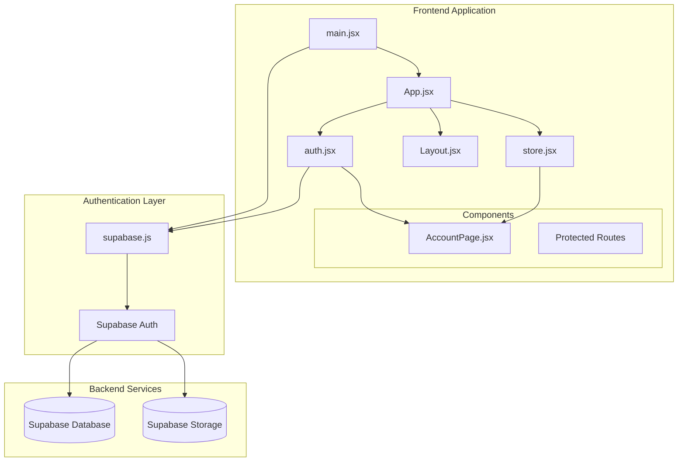
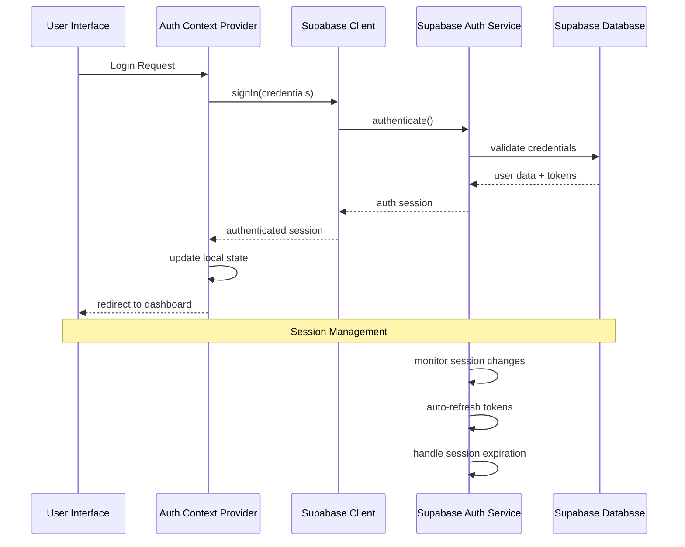
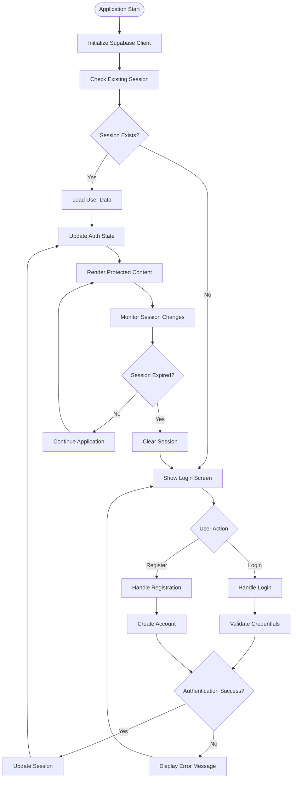
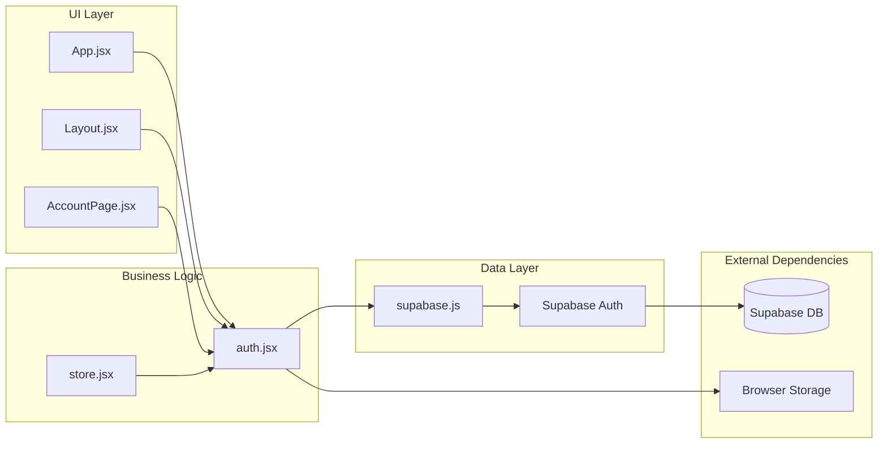

# Authentication System

<cite>
**Referenced Files in This Document**
- [auth.jsx](file://src/auth.jsx)
- [supabase.js](file://src/lib/supabase.js)
- [main.jsx](file://src/main.jsx)
- [App.jsx](file://src/App.jsx)
- [store.jsx](file://src/store.jsx)
- [AccountPage.jsx](file://src/components/AccountPage.jsx)
- [Layout.jsx](file://src/components/Layout.jsx)
- [config.toml](file://supabase/config.toml)
- [001_schema.sql](file://supabase/migrations/001_schema.sql)
</cite>

## Table of Contents
1. [Introduction](#introduction)
2. [Project Structure](#project-structure)
3. [Core Components](#core-components)
4. [Architecture Overview](#architecture-overview)
5. [Detailed Component Analysis](#detailed-component-analysis)
6. [Dependency Analysis](#dependency-analysis)
7. [Performance Considerations](#performance-considerations)
8. [Troubleshooting Guide](#troubleshooting-guide)
9. [Conclusion](#conclusion)
10. [Appendices](#appendices)

## Introduction

ApplyGuard PH is a comprehensive application built with React and Supabase that implements a robust authentication system. The authentication system leverages Supabase's built-in authentication capabilities to provide secure user registration, login/logout flows, session management, and protected route access. This document provides comprehensive documentation of the authentication architecture, implementation details, security measures, and best practices for maintaining secure user sessions.

The authentication system follows modern React patterns using context providers, custom hooks, and component-based architecture to ensure maintainable and scalable user authentication across the application.

## Project Structure

The authentication system is distributed across several key files and directories:

**Diagram sources**
- [main.jsx](file://src/main.jsx)
- [App.jsx](file://src/App.jsx)
- [auth.jsx](file://src/auth.jsx)
- [supabase.js](file://src/lib/supabase.js)

**Section sources**
- [main.jsx](file://src/main.jsx)
- [App.jsx](file://src/App.jsx)
- [auth.jsx](file://src/auth.jsx)
- [supabase.js](file://src/lib/supabase.js)

## Core Components

### Authentication Context Provider

The authentication system centers around a context provider that manages user state, authentication methods, and session lifecycle. This component serves as the single source of truth for authentication state throughout the application.

Key responsibilities include:
- User state management and persistence
- Authentication method implementations (login, logout, register)
- Session monitoring and automatic refresh
- Error handling and user feedback
- Loading state management

### Supabase Client Configuration

The Supabase client is configured with proper authentication settings, including:
- Environment-specific configuration
- Real-time subscription setup
- Error handling middleware
- Token refresh mechanisms

### Protected Route Implementation

Protected routes are implemented using higher-order components or route guards that check authentication status before rendering protected content. These components handle:
- Authentication status verification
- Redirect logic for unauthenticated users
- Loading states during authentication checks
- Role-based access control (if implemented)

**Section sources**
- [auth.jsx](file://src/auth.jsx)
- [supabase.js](file://src/lib/supabase.js)
- [store.jsx](file://src/store.jsx)

## Architecture Overview

The authentication architecture follows a layered approach with clear separation of concerns:

**Diagram sources**
- [auth.jsx](file://src/auth.jsx)
- [supabase.js](file://src/lib/supabase.js)

### Data Flow Architecture

**Diagram sources**
- [auth.jsx](file://src/auth.jsx)
- [supabase.js](file://src/lib/supabase.js)

## Detailed Component Analysis

### Authentication Context Implementation

The authentication context provides a comprehensive API for managing user authentication throughout the application lifecycle.

#### Key Methods and Properties

The context exposes essential authentication methods including user registration, login/logout functionality, and session management. It maintains reactive state that automatically updates UI components when authentication status changes.

#### State Persistence Strategy

Authentication state persists across browser sessions using Supabase's built-in session storage mechanisms. The implementation handles:
- Automatic session restoration on app reload
- Cross-tab synchronization
- Secure token storage
- Session expiration handling

#### Error Handling Patterns

Comprehensive error handling covers network failures, invalid credentials, server errors, and edge cases. Errors are normalized and presented to users through consistent feedback mechanisms.

**Section sources**
- [auth.jsx](file://src/auth.jsx)

### Supabase Integration Layer

The Supabase integration layer abstracts database operations and authentication calls behind a clean interface.

#### Client Configuration

The client is configured with environment-specific settings, connection pooling, and retry logic for resilience.

#### Authentication Methods

Authentication methods wrap Supabase's native functions with additional error handling, loading states, and user feedback.

#### Real-time Features

Real-time subscriptions enable live updates for user profile changes and other dynamic content.

**Section sources**
- [supabase.js](file://src/lib/supabase.js)

### Protected Route Components

Protected routes ensure that only authenticated users can access sensitive application features.

#### Route Guard Implementation

Route guards check authentication status before rendering protected components, redirecting unauthenticated users to appropriate login pages.

#### Loading States

Loading states prevent flash of unauthenticated content during authentication checks.

#### Role-Based Access Control

Extended protection includes role-based access control for different user types and permission levels.

**Section sources**
- [Layout.jsx](file://src/components/Layout.jsx)
- [AccountPage.jsx](file://src/components/AccountPage.jsx)

### User State Management

The application uses a combination of React context and local storage to manage user state efficiently.

#### State Synchronization

User state synchronizes between context, local storage, and Supabase backend to ensure consistency across tabs and sessions.

#### Performance Optimizations

State updates are optimized to minimize re-renders while maintaining responsive user interfaces.

**Section sources**
- [store.jsx](file://src/store.jsx)

## Dependency Analysis

The authentication system has well-defined dependencies and clear separation of concerns:

**Diagram sources**
- [App.jsx](file://src/App.jsx)
- [auth.jsx](file://src/auth.jsx)
- [supabase.js](file://src/lib/supabase.js)

### Component Coupling Analysis

The authentication system demonstrates low coupling between components while maintaining high cohesion within the authentication domain. Each component has a single responsibility and communicates through well-defined interfaces.

### External Dependencies

The system relies on Supabase for authentication, database operations, and real-time features. Browser APIs provide local storage and session management capabilities.

**Section sources**
- [app.jsx](file://src/App.jsx)
- [auth.jsx](file://src/auth.jsx)
- [supabase.js](file://src/lib/supabase.js)

## Performance Considerations

### Authentication State Optimization

The authentication system optimizes performance through:
- Memoized authentication checks
- Debounced state updates
- Lazy loading of protected routes
- Efficient re-rendering strategies

### Network Request Optimization

Network requests are optimized with:
- Request deduplication
- Caching strategies for user data
- Retry logic for failed requests
- Connection pooling through Supabase client

### Memory Management

Memory usage is minimized through:
- Proper cleanup of event listeners
- Garbage collection of unused authentication data
- Efficient session storage usage

## Troubleshooting Guide

### Common Authentication Issues

#### Session Not Persisting
- Verify Supabase client configuration
- Check browser storage permissions
- Ensure proper environment variables

#### Authentication Loop
- Review redirect logic in protected routes
- Check for infinite loading states
- Validate session checking logic

#### Token Refresh Failures
- Monitor network connectivity
- Check Supabase service status
- Implement fallback authentication methods

### Debugging Techniques

#### Console Logging
Enable detailed logging during development to track authentication flow and identify issues.

#### Network Inspection
Use browser developer tools to inspect authentication requests and responses.

#### State Inspection
Monitor authentication state changes and verify expected behavior.

### Error Recovery Strategies

Implement graceful degradation when authentication services are unavailable:
- Offline mode support
- Cached session validation
- User-friendly error messages

**Section sources**
- [auth.jsx](file://src/auth.jsx)
- [supabase.js](file://src/lib/supabase.js)

## Conclusion

The ApplyGuard PH authentication system provides a robust, secure, and user-friendly authentication experience built on Supabase's enterprise-grade infrastructure. The modular architecture ensures maintainability and scalability while providing comprehensive error handling and performance optimizations.

Key strengths of the implementation include:
- Clean separation of concerns
- Comprehensive error handling
- Performance optimizations
- Security best practices
- Extensible architecture for future enhancements

The system is designed to scale with application growth while maintaining security and performance standards.

## Appendices

### Security Best Practices

#### Token Management
- Use HTTPS for all authentication requests
- Implement proper token expiration handling
- Store tokens securely using Supabase's built-in mechanisms
- Avoid storing sensitive data in localStorage

#### Session Security
- Implement session timeout policies
- Use secure cookie attributes where applicable
- Validate sessions on each request
- Monitor for suspicious authentication patterns

#### Input Validation
- Sanitize all user inputs
- Validate email formats and password strength
- Implement rate limiting for authentication attempts
- Use CSRF protection for form submissions

### Configuration Reference

#### Environment Variables
Required environment variables for Supabase integration:
- Supabase URL
- Supabase anonymous key
- Development/production flags

#### Database Schema
Authentication-related database tables and relationships are defined in the migration files.

**Section sources**
- [config.toml](file://supabase/config.toml)
- [001_schema.sql](file://supabase/migrations/001_schema.sql)