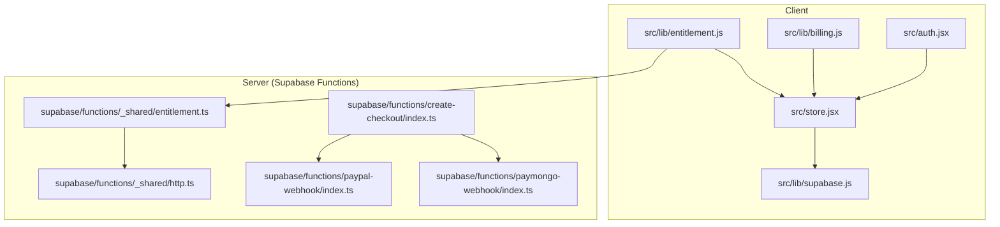
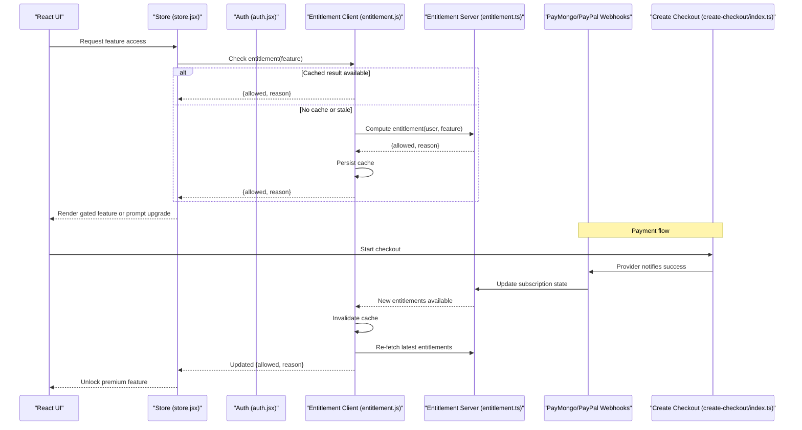
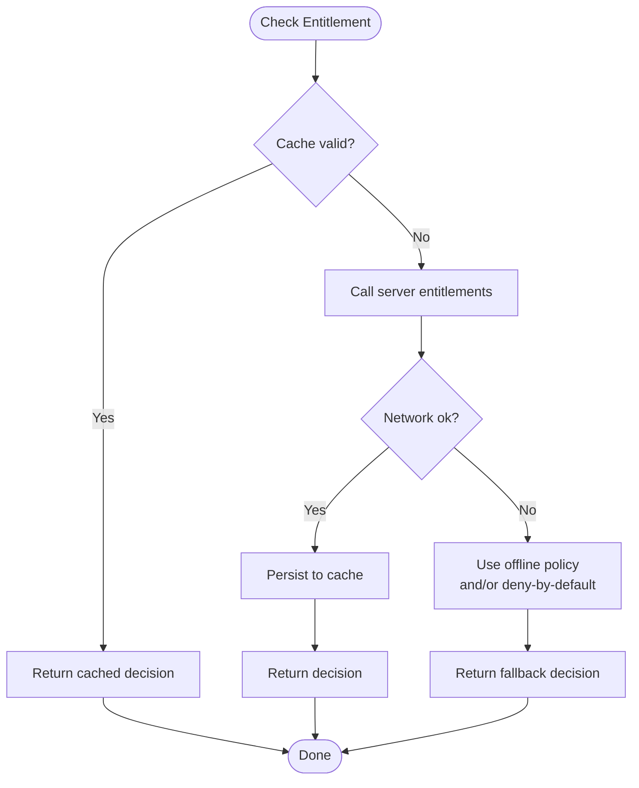
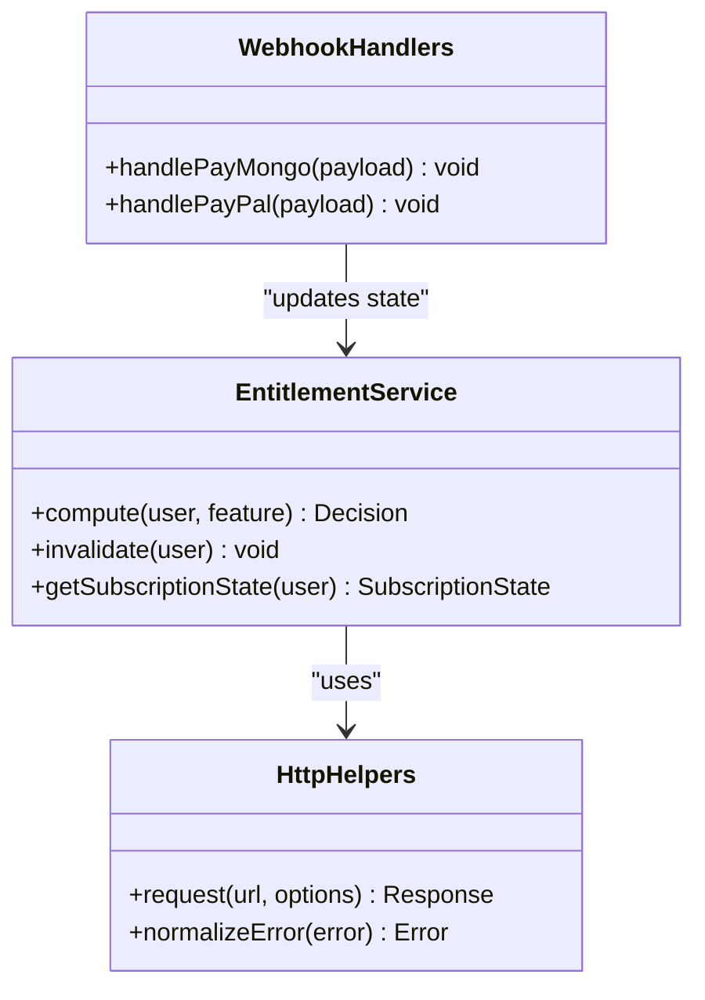
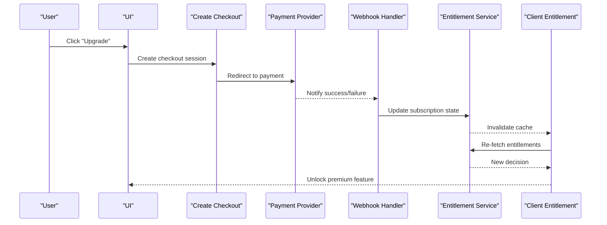
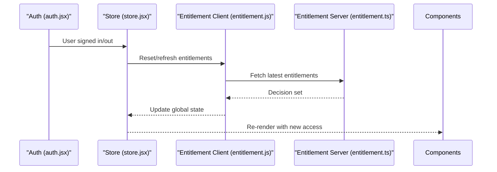
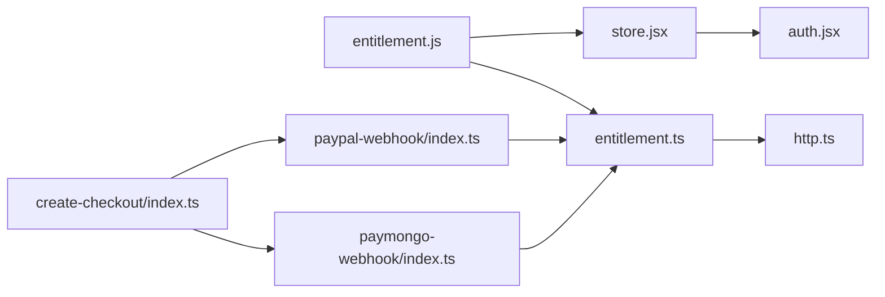

# Entitlements & Access Control

<cite>
**Referenced Files in This Document**
- [entitlement.js](file://src/lib/entitlement.js)
- [entitlement.test.js](file://src/lib/entitlement.test.js)
- [billing.js](file://src/lib/billing.js)
- [supabase.js](file://src/lib/supabase.js)
- [store.jsx](file://src/store.jsx)
- [auth.jsx](file://src/auth.jsx)
- [entitlement.ts](file://supabase/functions/_shared/entitlement.ts)
- [http.ts](file://supabase/functions/_shared/http.ts)
- [create-checkout/index.ts](file://supabase/functions/create-checkout/index.ts)
- [paymongo-webhook/index.ts](file://supabase/functions/paymongo-webhook/index.ts)
- [paypal-webhook/index.ts](file://supabase/functions/paypal-webhook/index.ts)
- [03-subscriptions-paymongo.md](file://docs/superpowers/plans/monetization/03-subscriptions-paymongo.md)
</cite>

## Table of Contents
1. [Introduction](#introduction)
2. [Project Structure](#project-structure)
3. [Core Components](#core-components)
4. [Architecture Overview](#architecture-overview)
5. [Detailed Component Analysis](#detailed-component-analysis)
6. [Dependency Analysis](#dependency-analysis)
7. [Performance Considerations](#performance-considerations)
8. [Troubleshooting Guide](#troubleshooting-guide)
9. [Conclusion](#conclusion)
10. [Appendices](#appendices)

## Introduction
This document explains the entitlements and access control system for ApplyGuard PH. It covers how premium features are gated by subscription status, how entitlements are evaluated on the client and server, how billing events update feature access, and how to implement protected features with robust error handling and fallback behaviors. The goal is to provide a clear mental model and practical guidance for developers implementing or extending access controls.

## Project Structure
The entitlements system spans both client-side logic and serverless functions:
- Client-side entitlement evaluation and UI gating live in the frontend library and React store.
- Server-side entitlement computation and billing integrations live in Supabase Edge Functions and shared utilities.
- Documentation for monetization architecture and PayMongo subscriptions provides additional context.

**Diagram sources**
- [entitlement.js](file://src/lib/entitlement.js)
- [billing.js](file://src/lib/billing.js)
- [store.jsx](file://src/store.jsx)
- [auth.jsx](file://src/auth.jsx)
- [supabase.js](file://src/lib/supabase.js)
- [entitlement.ts](file://supabase/functions/_shared/entitlement.ts)
- [http.ts](file://supabase/functions/_shared/http.ts)
- [create-checkout/index.ts](file://supabase/functions/create-checkout/index.ts)
- [paymongo-webhook/index.ts](file://supabase/functions/paymongo-webhook/index.ts)
- [paypal-webhook/index.ts](file://supabase/functions/paypal-webhook/index.ts)

**Section sources**
- [entitlement.js](file://src/lib/entitlement.js)
- [entitlement.test.js](file://src/lib/entitlement.test.js)
- [billing.js](file://src/lib/billing.js)
- [supabase.js](file://src/lib/supabase.js)
- [store.jsx](file://src/store.jsx)
- [auth.jsx](file://src/auth.jsx)
- [entitlement.ts](file://supabase/functions/_shared/entitlement.ts)
- [http.ts](file://supabase/functions/_shared/http.ts)
- [create-checkout/index.ts](file://supabase/functions/create-checkout/index.ts)
- [paymongo-webhook/index.ts](file://supabase/functions/paymongo-webhook/index.ts)
- [paypal-webhook/index.ts](file://supabase/functions/paypal-webhook/index.ts)
- [03-subscriptions-paymongo.md](file://docs/superpowers/plans/monetization/03-subscriptions-paymongo.md)

## Core Components
- Client entitlement evaluator: centralizes feature flags, permission checks, and caching strategies.
- Billing integration: manages checkout flows and listens to webhook-driven state changes.
- Server entitlement service: authoritative source of truth for entitlements based on subscription lifecycle and payment provider webhooks.
- Store and auth integration: exposes current user’s entitlements to components and triggers refreshes when authentication or billing state changes.

Key responsibilities:
- Evaluate whether a user can access a given feature.
- Cache results locally for resilience and performance.
- Refresh entitlements after successful payments or subscription updates.
- Provide safe defaults and graceful degradation under network failures.

**Section sources**
- [entitlement.js](file://src/lib/entitlement.js)
- [entitlement.test.js](file://src/lib/entitlement.test.js)
- [billing.js](file://src/lib/billing.js)
- [store.jsx](file://src/store.jsx)
- [auth.jsx](file://src/auth.jsx)
- [entitlement.ts](file://supabase/functions/_shared/entitlement.ts)

## Architecture Overview
The entitlements architecture follows a client-server model with an authoritative server and a resilient client cache.

**Diagram sources**
- [store.jsx](file://src/store.jsx)
- [auth.jsx](file://src/auth.jsx)
- [entitlement.js](file://src/lib/entitlement.js)
- [entitlement.ts](file://supabase/functions/_shared/entitlement.ts)
- [create-checkout/index.ts](file://supabase/functions/create-checkout/index.ts)
- [paymongo-webhook/index.ts](file://supabase/functions/paymongo-webhook/index.ts)
- [paypal-webhook/index.ts](file://supabase/functions/paypal-webhook/index.ts)

## Detailed Component Analysis

### Client Entitlement Service
Responsibilities:
- Feature flag registry and permission matrix.
- Local caching with TTL and invalidation hooks.
- Network request orchestration to server entitlements.
- Safe defaults and offline behavior.

Typical usage pattern:
- Call a check function with a feature identifier.
- Receive a decision object indicating allowed/denied and a reason.
- Use the decision to gate UI and business logic.

**Diagram sources**
- [entitlement.js](file://src/lib/entitlement.js)
- [entitlement.ts](file://supabase/functions/_shared/entitlement.ts)

**Section sources**
- [entitlement.js](file://src/lib/entitlement.js)
- [entitlement.test.js](file://src/lib/entitlement.test.js)

### Server Entitlement Service
Responsibilities:
- Authoritative computation of entitlements from subscription state.
- Integration with payment providers via webhooks.
- Deterministic rules for trial, active, expired, and canceled states.
- Consistent API for clients to query entitlements.

Integration points:
- HTTP helpers for outbound calls and response normalization.
- Webhook handlers that update subscription records and invalidate caches.

**Diagram sources**
- [entitlement.ts](file://supabase/functions/_shared/entitlement.ts)
- [http.ts](file://supabase/functions/_shared/http.ts)
- [paymongo-webhook/index.ts](file://supabase/functions/paymongo-webhook/index.ts)
- [paypal-webhook/index.ts](file://supabase/functions/paypal-webhook/index.ts)

**Section sources**
- [entitlement.ts](file://supabase/functions/_shared/entitlement.ts)
- [http.ts](file://supabase/functions/_shared/http.ts)
- [paymongo-webhook/index.ts](file://supabase/functions/paymongo-webhook/index.ts)
- [paypal-webhook/index.ts](file://supabase/functions/paypal-webhook/index.ts)

### Billing Integration and Checkout Flow
Responsibilities:
- Initiate checkout sessions.
- Listen to provider webhooks to reconcile subscription state.
- Trigger client-side cache invalidation upon successful fulfillment.

**Diagram sources**
- [create-checkout/index.ts](file://supabase/functions/create-checkout/index.ts)
- [paymongo-webhook/index.ts](file://supabase/functions/paymongo-webhook/index.ts)
- [paypal-webhook/index.ts](file://supabase/functions/paypal-webhook/index.ts)
- [entitlement.ts](file://supabase/functions/_shared/entitlement.ts)
- [entitlement.js](file://src/lib/entitlement.js)

**Section sources**
- [create-checkout/index.ts](file://supabase/functions/create-checkout/index.ts)
- [paymongo-webhook/index.ts](file://supabase/functions/paymongo-webhook/index.ts)
- [paypal-webhook/index.ts](file://supabase/functions/paypal-webhook/index.ts)
- [entitlement.ts](file://supabase/functions/_shared/entitlement.ts)
- [entitlement.js](file://src/lib/entitlement.js)

### Store and Auth Integration
Responsibilities:
- Expose current user’s entitlements to components.
- Refresh entitlements on sign-in/sign-out and billing events.
- Coordinate caching and revalidation.

**Diagram sources**
- [auth.jsx](file://src/auth.jsx)
- [store.jsx](file://src/store.jsx)
- [entitlement.js](file://src/lib/entitlement.js)
- [entitlement.ts](file://supabase/functions/_shared/entitlement.ts)

**Section sources**
- [auth.jsx](file://src/auth.jsx)
- [store.jsx](file://src/store.jsx)
- [entitlement.js](file://src/lib/entitlement.js)
- [entitlement.ts](file://supabase/functions/_shared/entitlement.ts)

## Dependency Analysis
- Client dependencies:
  - Entitlement client depends on local storage/cache and the server entitlement endpoint.
  - Store depends on auth state and entitlement client to keep UI consistent.
- Server dependencies:
  - Entitlement service depends on HTTP helpers and subscription data updated by webhooks.
  - Webhook handlers depend on payment provider payloads and call into the entitlement service to reconcile state.

**Diagram sources**
- [entitlement.js](file://src/lib/entitlement.js)
- [entitlement.ts](file://supabase/functions/_shared/entitlement.ts)
- [http.ts](file://supabase/functions/_shared/http.ts)
- [store.jsx](file://src/store.jsx)
- [auth.jsx](file://src/auth.jsx)
- [paymongo-webhook/index.ts](file://supabase/functions/paymongo-webhook/index.ts)
- [paypal-webhook/index.ts](file://supabase/functions/paypal-webhook/index.ts)
- [create-checkout/index.ts](file://supabase/functions/create-checkout/index.ts)

**Section sources**
- [entitlement.js](file://src/lib/entitlement.js)
- [entitlement.ts](file://supabase/functions/_shared/entitlement.ts)
- [http.ts](file://supabase/functions/_shared/http.ts)
- [store.jsx](file://src/store.jsx)
- [auth.jsx](file://src/auth.jsx)
- [paymongo-webhook/index.ts](file://supabase/functions/paymongo-webhook/index.ts)
- [paypal-webhook/index.ts](file://supabase/functions/paypal-webhook/index.ts)
- [create-checkout/index.ts](file://supabase/functions/create-checkout/index.ts)

## Performance Considerations
- Cache aggressively on the client with reasonable TTLs to reduce server load and improve responsiveness.
- Invalidate cache promptly on known events (sign-in, checkout completion, webhook processing).
- Batch feature checks where possible to minimize redundant requests.
- Prefer deterministic server-side decisions to avoid drift between client and server.

[No sources needed since this section provides general guidance]

## Troubleshooting Guide
Common issues and resolutions:
- Network failures during entitlement checks:
  - Ensure the client falls back to a safe default (deny-by-default for premium features) and retries with exponential backoff.
  - Verify cache invalidation does not leave stale entries after transient errors.
- Subscription changes not reflected immediately:
  - Confirm webhooks are processed successfully and trigger cache invalidation.
  - Add explicit re-fetch hooks after checkout completion.
- Offline access policies:
  - Define clear offline behavior for each feature (e.g., allow read-only, deny write operations).
  - Log offline denials to aid diagnostics.
- Inconsistent entitlements across devices:
  - Ensure server is the single source of truth; client should always re-validate after reconnecting.

Operational tips:
- Instrument logs around cache hits/misses, network errors, and webhook processing outcomes.
- Add tests for edge cases such as expired trials, canceled subscriptions, and partial webhook deliveries.

**Section sources**
- [entitlement.js](file://src/lib/entitlement.js)
- [entitlement.test.js](file://src/lib/entitlement.test.js)
- [paymongo-webhook/index.ts](file://supabase/functions/paymongo-webhook/index.ts)
- [paypal-webhook/index.ts](file://supabase/functions/paypal-webhook/index.ts)

## Conclusion
ApplyGuard PH implements a robust entitlements system that gates premium features based on verified subscription status. The design emphasizes a server-authoritative model with a resilient client cache, timely invalidation on billing events, and clear fallback behaviors for offline or error conditions. By following the patterns outlined here, teams can safely add new premium features, customize entitlement checks, and maintain a consistent user experience across all environments.

[No sources needed since this section summarizes without analyzing specific files]

## Appendices

### Implementing Protected Features
- Register a new feature flag in the client entitlement registry.
- Wrap feature entry points with an entitlement check and render appropriate UI (locked vs unlocked).
- On denial, present a clear upgrade path or explain limitations.

**Section sources**
- [entitlement.js](file://src/lib/entitlement.js)
- [store.jsx](file://src/store.jsx)

### Custom Entitlement Checks
- Extend the server entitlement service to incorporate custom rules (e.g., admin overrides, beta access).
- Keep client checks thin and delegate complex logic to the server.
- Validate inputs and return structured decisions with reasons for transparency.

**Section sources**
- [entitlement.ts](file://supabase/functions/_shared/entitlement.ts)
- [http.ts](file://supabase/functions/_shared/http.ts)

### Handling Access Denied Scenarios
- Show contextual messaging explaining why access is denied.
- Offer retry mechanisms if the denial may be due to transient issues.
- Track analytics to understand denial patterns and improve UX.

**Section sources**
- [entitlement.js](file://src/lib/entitlement.js)
- [entitlement.test.js](file://src/lib/entitlement.test.js)

### Real-Time Updates and Fallback Behaviors
- Subscribe to auth and billing events to trigger immediate re-evaluation.
- Use optimistic UI only when safe; otherwise, wait for server confirmation.
- Define explicit offline policies per feature to balance usability and security.

**Section sources**
- [store.jsx](file://src/store.jsx)
- [auth.jsx](file://src/auth.jsx)
- [entitlement.js](file://src/lib/entitlement.js)

### Relationship Between Billing Status and Feature Access
- Active subscriptions unlock premium features.
- Trials follow predefined limits and expiration rules.
- Canceled or expired subscriptions revert to free-tier access.

For detailed provider-specific flows, see:

**Section sources**
- [03-subscriptions-paymongo.md](file://docs/superpowers/plans/monetization/03-subscriptions-paymongo.md)