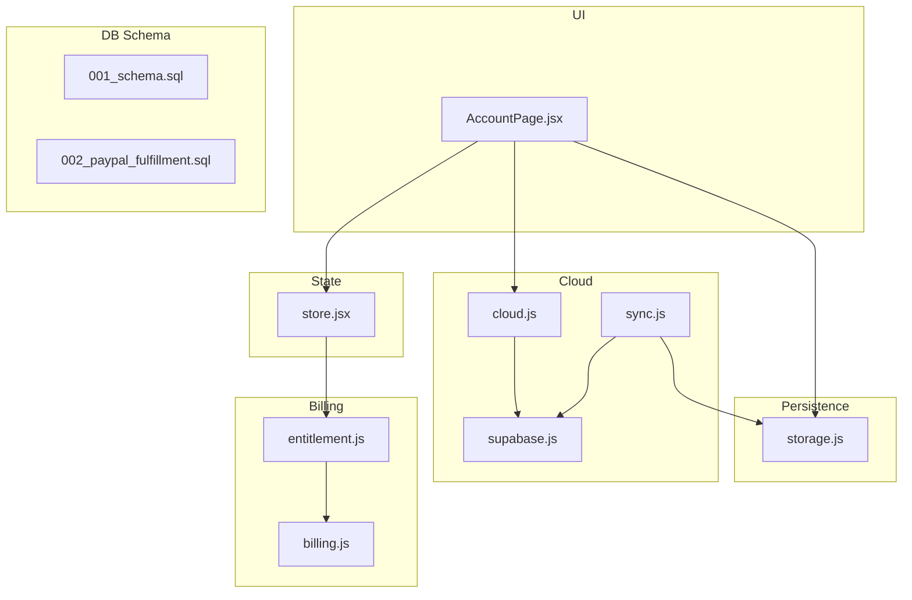
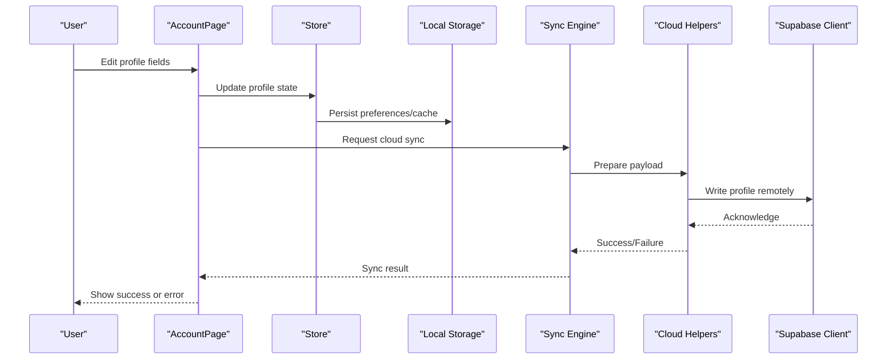
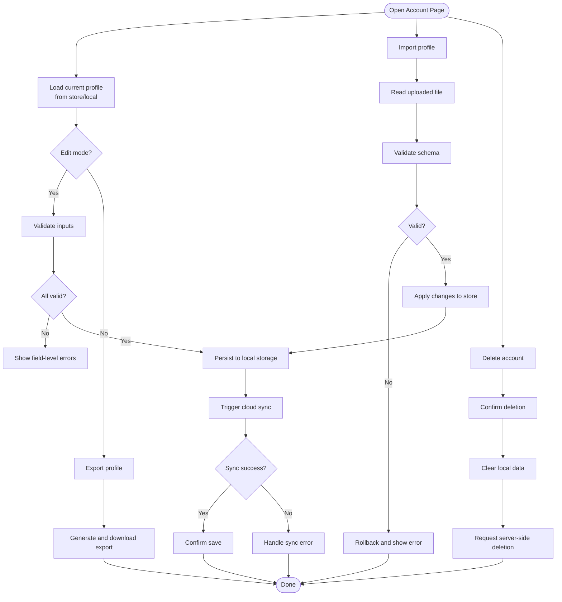
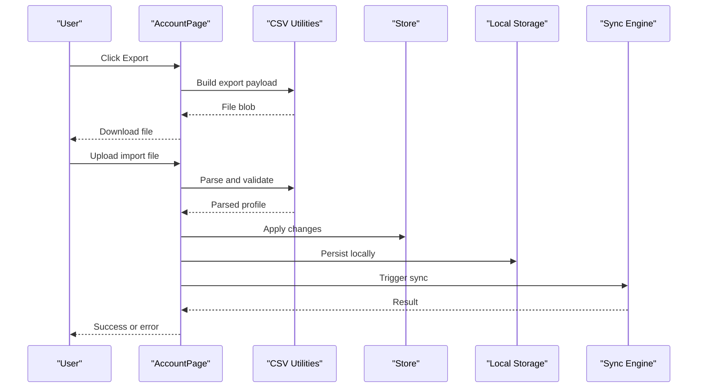
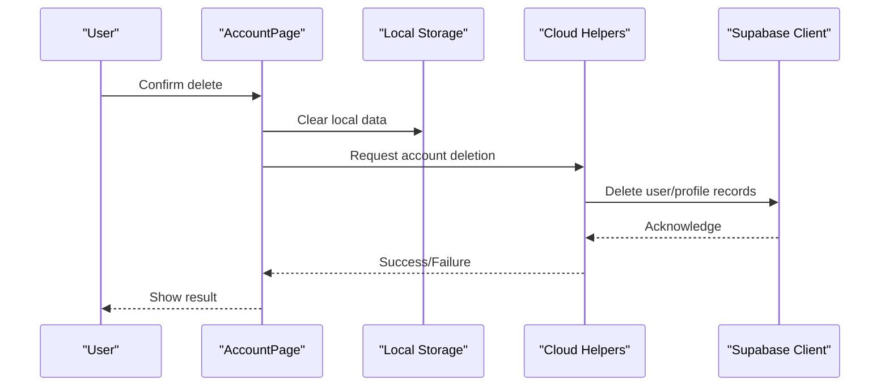
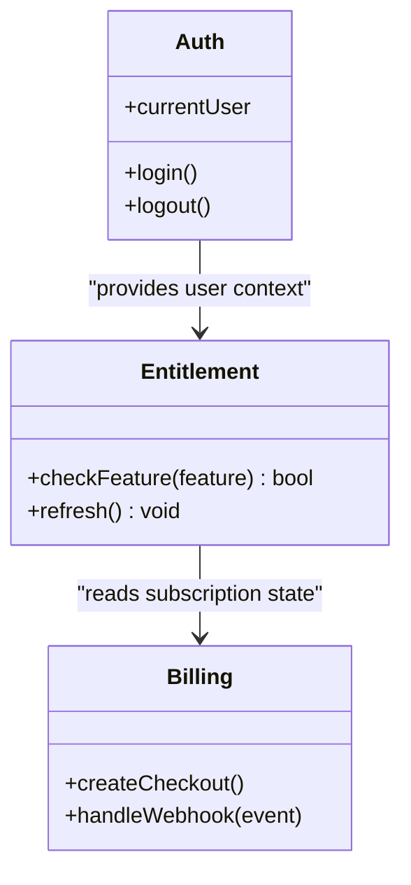
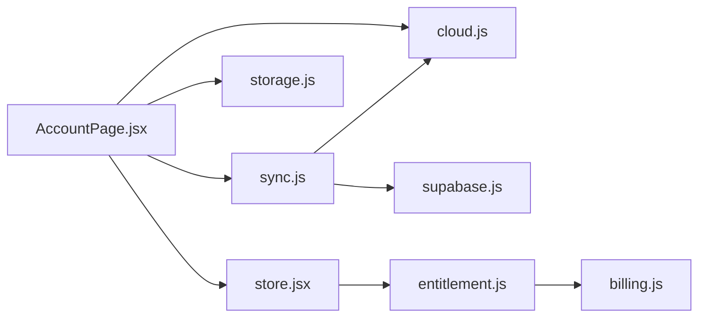

# User Accounts & Profiles

<cite>
**Referenced Files in This Document**
- [AccountPage.jsx](file://src/components/AccountPage.jsx)
- [auth.jsx](file://src/auth.jsx)
- [store.jsx](file://src/store.jsx)
- [storage.js](file://src/lib/storage.js)
- [cloud.js](file://src/lib/cloud.js)
- [sync.js](file://src/lib/sync.js)
- [supabase.js](file://src/lib/supabase.js)
- [csv.js](file://src/lib/csv.js)
- [entitlement.js](file://src/lib/entitlement.js)
- [billing.js](file://src/lib/billing.js)
- [002_paypal_fulfillment.sql](file://supabase/migrations/002_paypal_fulfillment.sql)
- [001_schema.sql](file://supabase/migrations/001_schema.sql)
</cite>

## Table of Contents
1. [Introduction](#introduction)
2. [Project Structure](#project-structure)
3. [Core Components](#core-components)
4. [Architecture Overview](#architecture-overview)
5. [Detailed Component Analysis](#detailed-component-analysis)
6. [Dependency Analysis](#dependency-analysis)
7. [Performance Considerations](#performance-considerations)
8. [Troubleshooting Guide](#troubleshooting-guide)
9. [Conclusion](#conclusion)
10. [Appendices](#appendices)

## Introduction
This document explains user account and profile management for ApplyGuard PH, focusing on the AccountPage component, profile data structure, settings and preferences, local storage strategies, cloud synchronization, and data consistency across devices. It also covers privacy considerations, data retention policies, and GDPR-related features such as export and deletion.

## Project Structure
The user account and profile functionality spans UI components, state management, persistence, and cloud services:
- UI: AccountPage component renders profile editing, export/import, and account deletion flows.
- State: Global store exposes current user and profile state to the app.
- Persistence: Local storage utilities manage offline preferences and cached data.
- Cloud: Supabase client, cloud helpers, and sync engine handle remote profiles and cross-device consistency.
- Billing/Entitlements: Integration with billing providers and entitlement checks affects feature access tied to accounts.

**Diagram sources**
- [AccountPage.jsx](file://src/components/AccountPage.jsx)
- [store.jsx](file://src/store.jsx)
- [storage.js](file://src/lib/storage.js)
- [cloud.js](file://src/lib/cloud.js)
- [sync.js](file://src/lib/sync.js)
- [supabase.js](file://src/lib/supabase.js)
- [entitlement.js](file://src/lib/entitlement.js)
- [billing.js](file://src/lib/billing.js)
- [001_schema.sql](file://supabase/migrations/001_schema.sql)
- [002_paypal_fulfillment.sql](file://supabase/migrations/002_paypal_fulfillment.sql)

**Section sources**
- [AccountPage.jsx](file://src/components/AccountPage.jsx)
- [store.jsx](file://src/store.jsx)
- [storage.js](file://src/lib/storage.js)
- [cloud.js](file://src/lib/cloud.js)
- [sync.js](file://src/lib/sync.js)
- [supabase.js](file://src/lib/supabase.js)
- [entitlement.js](file://src/lib/entitlement.js)
- [billing.js](file://src/lib/billing.js)
- [001_schema.sql](file://supabase/migrations/001_schema.sql)
- [002_paypal_fulfillment.sql](file://supabase/migrations/002_paypal_fulfillment.sql)

## Core Components
- AccountPage: Central UI for profile editing, exporting/importing profile data, and deleting the account. It orchestrates validation, persistence, and cloud operations.
- Auth integration: Provides authentication context and user identity used by AccountPage and other modules.
- Store: Exposes current user and profile state; updates propagate to UI and services.
- Storage: Manages local preferences and cached profile snapshots for offline use.
- Cloud/Sync: Handles remote profile read/write and conflict resolution across devices.
- Entitlement/Billing: Determines feature access based on subscription status.

Key responsibilities:
- Profile editing: Validate inputs, update local state, persist locally, and push changes to the cloud.
- Export/Import: Generate downloadable profile exports and import from files with validation and rollback on failure.
- Account deletion: Remove local data and request server-side deletion with confirmation and error handling.

**Section sources**
- [AccountPage.jsx](file://src/components/AccountPage.jsx)
- [auth.jsx](file://src/auth.jsx)
- [store.jsx](file://src/store.jsx)
- [storage.js](file://src/lib/storage.js)
- [cloud.js](file://src/lib/cloud.js)
- [sync.js](file://src/lib/sync.js)
- [entitlement.js](file://src/lib/entitlement.js)
- [billing.js](file://src/lib/billing.js)

## Architecture Overview
The account and profile system follows a layered architecture:
- Presentation layer (AccountPage) collects user input and triggers actions.
- State layer (store) holds current user and profile, broadcasting updates.
- Persistence layer (storage) writes preferences and cached data to local storage.
- Sync layer (sync + cloud) coordinates with Supabase for remote profile storage and conflict resolution.
- Identity and billing layers provide authentication and entitlement checks.

**Diagram sources**
- [AccountPage.jsx](file://src/components/AccountPage.jsx)
- [store.jsx](file://src/store.jsx)
- [storage.js](file://src/lib/storage.js)
- [sync.js](file://src/lib/sync.js)
- [cloud.js](file://src/lib/cloud.js)
- [supabase.js](file://src/lib/supabase.js)

## Detailed Component Analysis

### AccountPage Component
Responsibilities:
- Profile editing: Validates inputs, updates store, persists locally, and triggers cloud sync.
- Data export: Generates a structured export file from the current profile.
- Data import: Reads an exported file, validates schema, applies changes, and rolls back on errors.
- Account deletion: Confirms deletion, clears local data, and requests server-side removal.

Validation rules:
- Required fields: Ensure essential profile attributes are present and non-empty.
- Format constraints: Enforce email format, name length limits, and allowed characters.
- Consistency checks: Prevent duplicate entries and ensure referential integrity within the profile.

Error handling:
- Network failures: Retry with backoff and surface actionable messages.
- Validation errors: Highlight invalid fields and prevent submission until fixed.
- Import failures: Abort partial imports and restore previous state.

**Diagram sources**
- [AccountPage.jsx](file://src/components/AccountPage.jsx)
- [storage.js](file://src/lib/storage.js)
- [cloud.js](file://src/lib/cloud.js)
- [sync.js](file://src/lib/sync.js)

**Section sources**
- [AccountPage.jsx](file://src/components/AccountPage.jsx)

### Profile Data Structure
Typical profile fields include:
- Identity: user ID, display name, email, avatar URL.
- Preferences: theme, language, notification toggles, default view modes.
- Subscription: plan type, expiry date, feature flags.
- Metadata: created_at, updated_at, version/timestamp for sync.

Data model relationships:
- The profile is owned by the authenticated user and may reference entitlement records for billing features.

```mermaid
erDiagram
USER {
uuid id PK
string email UK
string display_name
string avatar_url
timestamp created_at
timestamp updated_at
}
PROFILE {
uuid id PK
uuid user_id FK
jsonb preferences
enum plan_type
timestamp plan_expiry
int version
timestamp updated_at
}
USER ||--o{ PROFILE : has_one
```

**Diagram sources**
- [001_schema.sql](file://supabase/migrations/001_schema.sql)
- [002_paypal_fulfillment.sql](file://supabase/migrations/002_paypal_fulfillment.sql)

**Section sources**
- [001_schema.sql](file://supabase/migrations/001_schema.sql)
- [002_paypal_fulfillment.sql](file://supabase/migrations/002_paypal_fulfillment.sql)

### Settings and Preference Management
- Local preferences: Stored via storage utilities for fast access and offline availability.
- Synced preferences: Pushed to cloud when online; conflicts resolved using timestamps or version numbers.
- Feature flags: Derived from entitlements and billing status.

Operations:
- Read: Retrieve merged preferences from local cache and remote source.
- Write: Update local store, persist immediately, schedule background sync.
- Merge: On conflict, prefer newer timestamp or apply deterministic merge rules.

**Section sources**
- [storage.js](file://src/lib/storage.js)
- [sync.js](file://src/lib/sync.js)
- [cloud.js](file://src/lib/cloud.js)
- [entitlement.js](file://src/lib/entitlement.js)

### Data Export and Import
Export:
- Collects current profile and preferences into a structured format.
- Generates a downloadable file for backup or migration.

Import:
- Parses uploaded file and validates against expected schema.
- Applies changes atomically; on failure, restores previous state.

**Diagram sources**
- [AccountPage.jsx](file://src/components/AccountPage.jsx)
- [csv.js](file://src/lib/csv.js)
- [storage.js](file://src/lib/storage.js)
- [sync.js](file://src/lib/sync.js)

**Section sources**
- [AccountPage.jsx](file://src/components/AccountPage.jsx)
- [csv.js](file://src/lib/csv.js)
- [storage.js](file://src/lib/storage.js)
- [sync.js](file://src/lib/sync.js)

### Account Deletion
Deletion flow:
- Confirmation dialog to prevent accidental loss.
- Clear all local data (preferences, cached profile).
- Request server-side deletion via cloud helpers.
- Notify user of success or retry on failure.

**Diagram sources**
- [AccountPage.jsx](file://src/components/AccountPage.jsx)
- [storage.js](file://src/lib/storage.js)
- [cloud.js](file://src/lib/cloud.js)
- [supabase.js](file://src/lib/supabase.js)

**Section sources**
- [AccountPage.jsx](file://src/components/AccountPage.jsx)
- [storage.js](file://src/lib/storage.js)
- [cloud.js](file://src/lib/cloud.js)
- [supabase.js](file://src/lib/supabase.js)

### Authentication and Entitlements
- Authentication provides the user identity used by AccountPage and sync processes.
- Entitlements determine access to premium features based on billing status.
- Billing integration manages subscriptions and fulfillment events.

**Diagram sources**
- [auth.jsx](file://src/auth.jsx)
- [entitlement.js](file://src/lib/entitlement.js)
- [billing.js](file://src/lib/billing.js)

**Section sources**
- [auth.jsx](file://src/auth.jsx)
- [entitlement.js](file://src/lib/entitlement.js)
- [billing.js](file://src/lib/billing.js)

## Dependency Analysis
Inter-module dependencies:
- AccountPage depends on store, storage, cloud, and sync for full CRUD and export/import/deletion workflows.
- Sync depends on cloud and supabase clients to perform remote operations.
- Entitlement depends on billing to reflect subscription state.
- Storage is used by both UI and sync for local caching.

**Diagram sources**
- [AccountPage.jsx](file://src/components/AccountPage.jsx)
- [store.jsx](file://src/store.jsx)
- [storage.js](file://src/lib/storage.js)
- [cloud.js](file://src/lib/cloud.js)
- [sync.js](file://src/lib/sync.js)
- [supabase.js](file://src/lib/supabase.js)
- [entitlement.js](file://src/lib/entitlement.js)
- [billing.js](file://src/lib/billing.js)

**Section sources**
- [AccountPage.jsx](file://src/components/AccountPage.jsx)
- [store.jsx](file://src/store.jsx)
- [storage.js](file://src/lib/storage.js)
- [cloud.js](file://src/lib/cloud.js)
- [sync.js](file://src/lib/sync.js)
- [supabase.js](file://src/lib/supabase.js)
- [entitlement.js](file://src/lib/entitlement.js)
- [billing.js](file://src/lib/billing.js)

## Performance Considerations
- Debounce profile edits to reduce frequent writes and network calls.
- Batch sync operations to minimize API overhead.
- Cache frequently accessed preferences locally to avoid redundant reads.
- Use optimistic UI updates with rollback on failure to improve perceived responsiveness.
- Limit export size by allowing selective fields or pagination if needed.

[No sources needed since this section provides general guidance]

## Troubleshooting Guide
Common issues and resolutions:
- Validation errors: Check required fields and formats; re-submit after corrections.
- Sync failures: Verify connectivity; retry with exponential backoff; inspect error codes.
- Import failures: Validate file schema; ensure no missing required columns; attempt re-import.
- Deletion not reflected: Confirm server-side deletion; clear local cache and reload.

Operational tips:
- Enable detailed logs during development to trace sync and storage operations.
- Use export to recover from corrupted local state before attempting import.
- Monitor entitlement refresh cycles to ensure feature flags are up-to-date.

**Section sources**
- [AccountPage.jsx](file://src/components/AccountPage.jsx)
- [sync.js](file://src/lib/sync.js)
- [storage.js](file://src/lib/storage.js)
- [cloud.js](file://src/lib/cloud.js)

## Conclusion
ApplyGuard PH’s account and profile system combines robust local persistence with reliable cloud synchronization, providing a seamless experience across devices. The AccountPage component centralizes profile editing, export/import, and deletion, while respecting validation, error handling, and privacy requirements. Entitlements and billing integrate to control feature access, and the database schema supports secure, consistent storage of user data.

[No sources needed since this section summarizes without analyzing specific files]

## Appendices

### Privacy, Retention, and GDPR Features
- Data minimization: Only collect necessary profile fields.
- Consent and transparency: Inform users about data usage and retention periods.
- Right to access: Provide export functionality for personal data.
- Right to erasure: Support account deletion with server-side cleanup.
- Data portability: Allow structured export for easy migration.
- Security: Encrypt sensitive data at rest and in transit; enforce access controls.

[No sources needed since this section provides general guidance]