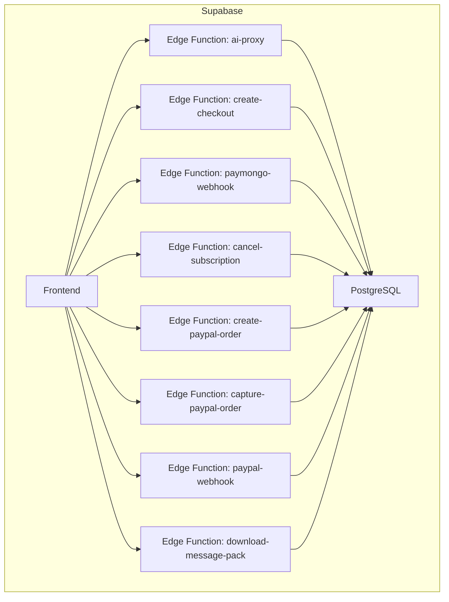
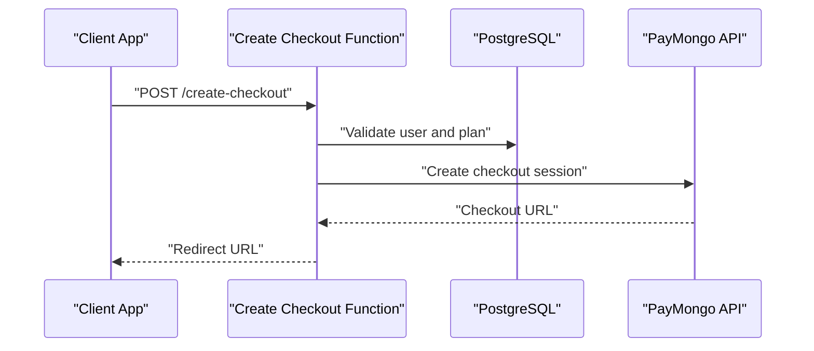
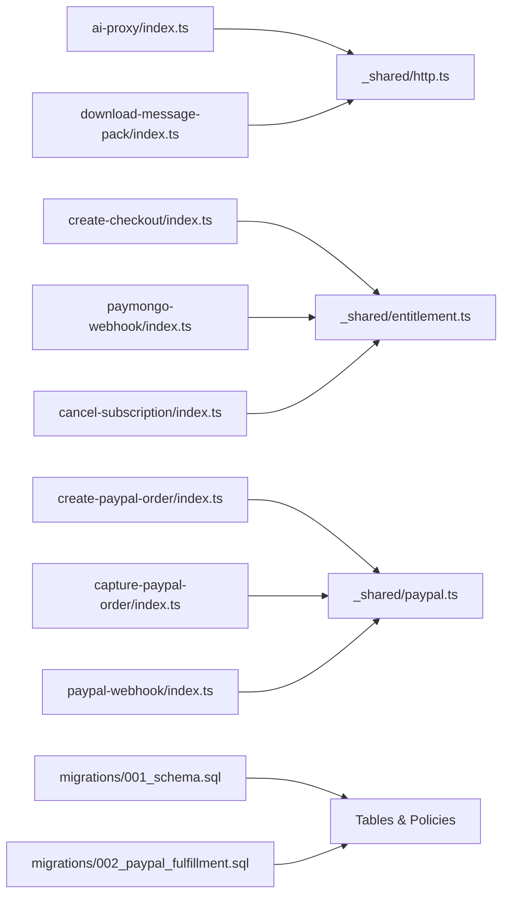

# Backend Services (Supabase)

<cite>
**Referenced Files in This Document**
- [supabase/functions/ai-proxy/index.ts](file://supabase/functions/ai-proxy/index.ts)
- [supabase/functions/create-checkout/index.ts](file://supabase/functions/create-checkout/index.ts)
- [supabase/functions/paymongo-webhook/index.ts](file://supabase/functions/paymongo-webhook/index.ts)
- [supabase/functions/cancel-subscription/index.ts](file://supabase/functions/cancel-subscription/index.ts)
- [supabase/functions/capture-paypal-order/index.ts](file://supabase/functions/capture-paypal-order/index.ts)
- [supabase/functions/create-paypal-order/index.ts](file://supabase/functions/create-paypal-order/index.ts)
- [supabase/functions/paypal-webhook/index.ts](file://supabase/functions/paypal-webhook/index.ts)
- [supabase/functions/download-message-pack/index.ts](file://supabase/functions/download-message-pack/index.ts)
- [supabase/functions/_shared/http.ts](file://supabase/functions/_shared/http.ts)
- [supabase/functions/_shared/entitlement.ts](file://supabase/functions/_shared/entitlement.ts)
- [supabase/functions/_shared/paypal.ts](file://supabase/functions/_shared/paypal.ts)
- [supabase/functions/_shared/paypal-runtime.ts](file://supabase/functions/_shared/paypal-runtime.ts)
- [supabase/functions/_shared/prompts.ts](file://supabase/functions/_shared/prompts.ts)
- [supabase/migrations/001_schema.sql](file://supabase/migrations/001_schema.sql)
- [supabase/migrations/002_paypal_fulfillment.sql](file://supabase/migrations/002_paypal_fulfillment.sql)
- [supabase/config.toml](file://supabase/config.toml)
- [.github/workflows/supabase.yml](file://.github/workflows/supabase.yml)
</cite>

## Table of Contents
1. Introduction
2. Project Structure
3. Core Components
4. Architecture Overview
5. Detailed Component Analysis
6. Dependency Analysis
7. Performance Considerations
8. Troubleshooting Guide
9. Conclusion
10. Appendices

## Introduction
This document describes the backend services for ApplyGuard PH built on Supabase Edge Functions and PostgreSQL. It covers:
- All edge functions including AI proxy, billing handlers, and utility services
- Database schema design, table relationships, and indexing strategies
- Security policies, row-level security rules, and API access controls
- Shared utilities library, common patterns, and best practices
- Deployment configuration, environment management, and monitoring approaches

The goal is to provide a comprehensive reference for developers integrating with or extending the backend.

## Project Structure
The backend is organized under supabase/:
- functions: Deno-based Edge Functions implementing business logic
  - ai-proxy: Proxies requests to external AI providers
  - create-checkout: Creates checkout sessions via PayMongo
  - paymongo-webhook: Processes PayMongo payment webhooks
  - cancel-subscription: Cancels subscriptions
  - capture-paypal-order: Captures PayPal orders
  - create-paypal-order: Creates PayPal orders
  - paypal-webhook: Processes PayPal webhooks
  - download-message-pack: Generates downloadable message packs
  - _shared: Shared libraries used across functions
- migrations: SQL migrations defining schema and RLS policies
- config.toml: Supabase project configuration

[No sources needed since this diagram shows conceptual workflow, not actual code structure]

## Core Components
- AI Proxy: Forwards prompts to external AI APIs securely, enforcing rate limits and logging.
- Billing Handlers: Create checkout sessions, manage PayPal orders, and process webhooks from PayMongo and PayPal.
- Utility Services: Shared HTTP client, entitlement checks, PayPal SDK wrappers, and prompt templates.

Key responsibilities:
- Enforce authentication and authorization at function boundaries
- Validate inputs and responses
- Persist state changes in PostgreSQL with proper RLS
- Provide consistent error handling and observability

**Section sources**
- [supabase/functions/ai-proxy/index.ts](file://supabase/functions/ai-proxy/index.ts)
- [supabase/functions/create-checkout/index.ts](file://supabase/functions/create-checkout/index.ts)
- [supabase/functions/paymongo-webhook/index.ts](file://supabase/functions/paymongo-webhook/index.ts)
- [supabase/functions/cancel-subscription/index.ts](file://supabase/functions/cancel-subscription/index.ts)
- [supabase/functions/capture-paypal-order/index.ts](file://supabase/functions/capture-paypal-order/index.ts)
- [supabase/functions/create-paypal-order/index.ts](file://supabase/functions/create-paypal-order/index.ts)
- [supabase/functions/paypal-webhook/index.ts](file://supabase/functions/paypal-webhook/index.ts)
- [supabase/functions/download-message-pack/index.ts](file://supabase/functions/download-message-pack/index.ts)
- [supabase/functions/_shared/http.ts](file://supabase/functions/_shared/http.ts)
- [supabase/functions/_shared/entitlement.ts](file://supabase/functions/_shared/entitlement.ts)
- [supabase/functions/_shared/paypal.ts](file://supabase/functions/_shared/paypal.ts)
- [supabase/functions/_shared/paypal-runtime.ts](file://supabase/functions/_shared/paypal-runtime.ts)
- [supabase/functions/_shared/prompts.ts](file://supabase/functions/_shared/prompts.ts)

## Architecture Overview
High-level flow:
- Frontend calls Edge Functions via Supabase client
- Functions authenticate users, validate payloads, and interact with PostgreSQL
- External integrations include AI providers, PayMongo, and PayPal
- Webhooks update subscription and payment states

**Diagram sources**
- [supabase/functions/create-checkout/index.ts](file://supabase/functions/create-checkout/index.ts)
- [supabase/functions/paymongo-webhook/index.ts](file://supabase/functions/paymongo-webhook/index.ts)
- [supabase/migrations/001_schema.sql](file://supabase/migrations/001_schema.sql)

## Detailed Component Analysis

### AI Proxy Function
Purpose:
- Securely proxy AI requests to external providers
- Enforce per-user quotas and feature flags
- Log usage metrics and errors

Responsibilities:
- Authenticate request and resolve user context
- Validate input payload and allowed models
- Forward request with configured headers and timeouts
- Stream or buffer response based on provider capabilities
- Record usage events and enforce rate limits

Error handling:
- Normalize provider errors into consistent formats
- Return appropriate HTTP status codes
- Avoid leaking sensitive provider details

Security:
- Restrict endpoints by entitlements
- Sanitize prompts and strip disallowed fields
- Enforce CORS and origin checks

Performance:
- Use connection pooling where applicable
- Cache repeated prompts if safe
- Implement retries with backoff for transient failures

**Section sources**
- [supabase/functions/ai-proxy/index.ts](file://supabase/functions/ai-proxy/index.ts)
- [supabase/functions/_shared/entitlement.ts](file://supabase/functions/_shared/entitlement.ts)
- [supabase/functions/_shared/http.ts](file://supabase/functions/_shared/http.ts)

### Billing: PayMongo Integration
Functions:
- create-checkout: Initiates a PayMongo checkout session
- paymongo-webhook: Confirms payments and updates subscriptions

Flow:
- Client requests checkout creation with plan and metadata
- Function validates entitlements and creates checkout session
- Webhook receives payment confirmation and updates database

Idempotency:
- Deduplicate webhook events using unique IDs
- Ensure idempotent updates to subscription records

Security:
- Verify webhook signatures
- Validate amounts and currency server-side

Data persistence:
- Store checkout sessions, payments, and subscription records
- Maintain audit trails for billing events

**Section sources**
- [supabase/functions/create-checkout/index.ts](file://supabase/functions/create-checkout/index.ts)
- [supabase/functions/paymongo-webhook/index.ts](file://supabase/functions/paymongo-webhook/index.ts)
- [supabase/migrations/001_schema.sql](file://supabase/migrations/001_schema.sql)

### Billing: PayPal Integration
Functions:
- create-paypal-order: Creates a PayPal order
- capture-paypal-order: Captures an approved order
- paypal-webhook: Handles PayPal event notifications

Flow:
- Client initiates order creation with plan details
- Function creates PayPal order and returns order ID
- On approval, client triggers capture
- Webhooks update order and subscription state

Idempotency:
- Guard against duplicate captures and webhook processing
- Track order lifecycle states

Security:
- Validate webhook events and signatures
- Confirm order totals before capture

Data persistence:
- Store orders, captures, and related metadata
- Link orders to user accounts and plans

**Section sources**
- [supabase/functions/create-paypal-order/index.ts](file://supabase/functions/create-paypal-order/index.ts)
- [supabase/functions/capture-paypal-order/index.ts](file://supabase/functions/capture-paypal-order/index.ts)
- [supabase/functions/paypal-webhook/index.ts](file://supabase/functions/paypal-webhook/index.ts)
- [supabase/functions/_shared/paypal.ts](file://supabase/functions/_shared/paypal.ts)
- [supabase/functions/_shared/paypal-runtime.ts](file://supabase/functions/_shared/paypal-runtime.ts)
- [supabase/migrations/002_paypal_fulfillment.sql](file://supabase/migrations/002_paypal_fulfillment.sql)

### Subscription Cancellation
Function:
- cancel-subscription: Cancels active subscriptions and revokes entitlements

Behavior:
- Validates cancellation eligibility
- Updates subscription status and effective dates
- Ensures downstream entitlements are revoked

Idempotency:
- Prevent multiple cancellations for the same subscription

Auditability:
- Record cancellation reasons and timestamps

**Section sources**
- [supabase/functions/cancel-subscription/index.ts](file://supabase/functions/cancel-subscription/index.ts)
- [supabase/migrations/001_schema.sql](file://supabase/migrations/001_schema.sql)

### Download Message Pack
Function:
- download-message-pack: Generates and serves a compressed archive of messages

Responsibilities:
- Validate user permissions
- Assemble messages into a package
- Stream or return file content with correct MIME type

Performance:
- Use streaming for large payloads
- Limit size and scope of generated archives

**Section sources**
- [supabase/functions/download-message-pack/index.ts](file://supabase/functions/download-message-pack/index.ts)

### Shared Utilities Library
Components:
- http.ts: Common HTTP client with retry, timeout, and error normalization
- entitlement.ts: Checks user entitlements and feature flags
- paypal.ts: PayPal SDK wrapper and helpers
- paypal-runtime.ts: Runtime configuration for PayPal integration
- prompts.ts: Centralized prompt templates and validation

Patterns:
- Consistent error shapes and logging
- Environment-driven configuration
- Reusable validation and sanitization

Best practices:
- Keep shared modules small and focused
- Export typed interfaces for consumers
- Unit test critical paths

**Section sources**
- [supabase/functions/_shared/http.ts](file://supabase/functions/_shared/http.ts)
- [supabase/functions/_shared/entitlement.ts](file://supabase/functions/_shared/entitlement.ts)
- [supabase/functions/_shared/paypal.ts](file://supabase/functions/_shared/paypal.ts)
- [supabase/functions/_shared/paypal-runtime.ts](file://supabase/functions/_shared/paypal-runtime.ts)
- [supabase/functions/_shared/prompts.ts](file://supabase/functions/_shared/prompts.ts)

## Dependency Analysis
Internal dependencies:
- Functions depend on shared utilities for HTTP, entitlements, and PayPal operations
- Migrations define tables and constraints consumed by functions

External dependencies:
- AI providers (via ai-proxy)
- PayMongo API (checkout and webhooks)
- PayPal API (orders, captures, webhooks)

**Diagram sources**
- [supabase/functions/ai-proxy/index.ts](file://supabase/functions/ai-proxy/index.ts)
- [supabase/functions/create-checkout/index.ts](file://supabase/functions/create-checkout/index.ts)
- [supabase/functions/paymongo-webhook/index.ts](file://supabase/functions/paymongo-webhook/index.ts)
- [supabase/functions/cancel-subscription/index.ts](file://supabase/functions/cancel-subscription/index.ts)
- [supabase/functions/capture-paypal-order/index.ts](file://supabase/functions/capture-paypal-order/index.ts)
- [supabase/functions/create-paypal-order/index.ts](file://supabase/functions/create-paypal-order/index.ts)
- [supabase/functions/paypal-webhook/index.ts](file://supabase/functions/paypal-webhook/index.ts)
- [supabase/functions/download-message-pack/index.ts](file://supabase/functions/download-message-pack/index.ts)
- [supabase/functions/_shared/http.ts](file://supabase/functions/_shared/http.ts)
- [supabase/functions/_shared/entitlement.ts](file://supabase/functions/_shared/entitlement.ts)
- [supabase/functions/_shared/paypal.ts](file://supabase/functions/_shared/paypal.ts)
- [supabase/migrations/001_schema.sql](file://supabase/migrations/001_schema.sql)
- [supabase/migrations/002_paypal_fulfillment.sql](file://supabase/migrations/002_paypal_fulfillment.sql)

**Section sources**
- [supabase/functions/_shared/http.ts](file://supabase/functions/_shared/http.ts)
- [supabase/functions/_shared/entitlement.ts](file://supabase/functions/_shared/entitlement.ts)
- [supabase/functions/_shared/paypal.ts](file://supabase/functions/_shared/paypal.ts)
- [supabase/migrations/001_schema.sql](file://supabase/migrations/001_schema.sql)
- [supabase/migrations/002_paypal_fulfillment.sql](file://supabase/migrations/002_paypal_fulfillment.sql)

## Performance Considerations
- Minimize cold starts by keeping function bundles lean and avoiding heavy dependencies
- Use streaming for large downloads and long-running AI responses
- Implement retries with exponential backoff for external API calls
- Cache frequently accessed data when safe and consistent
- Index high-cardinality columns used in frequent queries
- Batch writes where possible and avoid N+1 query patterns

[No sources needed since this section provides general guidance]

## Troubleshooting Guide
Common issues and resolutions:
- Authentication failures: Ensure valid tokens and correct scopes; verify RLS policies allow access
- Webhook signature mismatches: Check secret configuration and timestamp tolerances
- Idempotency violations: Deduplicate events using unique IDs and transactional updates
- Rate limiting: Monitor provider quotas and implement backoff strategies
- Schema mismatches: Align migration versions with deployed functions and clients

Operational tips:
- Enable structured logging with correlation IDs
- Add health checks for external dependencies
- Use feature flags to roll out risky changes gradually

**Section sources**
- [supabase/functions/paymongo-webhook/index.ts](file://supabase/functions/paymongo-webhook/index.ts)
- [supabase/functions/paypal-webhook/index.ts](file://supabase/functions/paypal-webhook/index.ts)
- [supabase/functions/_shared/http.ts](file://supabase/functions/_shared/http.ts)

## Conclusion
ApplyGuard PH’s Supabase backend provides a secure, extensible foundation for AI features and billing workflows. The modular function architecture, robust shared utilities, and well-defined schema enable reliable operation and clear separation of concerns. Following the recommended patterns for security, performance, and observability will help maintain stability as the system scales.

[No sources needed since this section summarizes without analyzing specific files]

## Appendices

### Database Schema Design and Relationships
- Users and accounts: Core identity and profile data
- Plans and subscriptions: Define tiers and lifecycle states
- Payments and orders: Capture transactions and linkage to subscriptions
- Audit logs: Track key actions and changes

Indexing strategy:
- Primary keys on all entities
- Unique indexes on natural keys (e.g., email, external IDs)
- Composite indexes for frequent filter combinations (e.g., user_id + status)
- Partial indexes for hot paths (e.g., active subscriptions)

Row-Level Security (RLS):
- Enforce user-scoped access on personal data
- Restrict admin-only tables to service roles
- Validate ownership on updates and deletes

API Access Controls:
- Require authenticated requests for protected functions
- Validate payloads and sanitize inputs
- Apply least-privilege principles for service accounts

**Section sources**
- [supabase/migrations/001_schema.sql](file://supabase/migrations/001_schema.sql)
- [supabase/migrations/002_paypal_fulfillment.sql](file://supabase/migrations/002_paypal_fulfillment.sql)

### Deployment Configuration and Environment Management
- Supabase configuration: Managed via config.toml
- CI/CD pipeline: GitHub Actions workflow for Supabase deployments
- Environment variables: Secrets for third-party APIs stored securely
- Version control: Migrations tracked and applied through CI

Monitoring approaches:
- Centralized logging with function-level correlation IDs
- Metrics collection for latency, errors, and throughput
- Alerting on critical failures and webhook anomalies

**Section sources**
- [supabase/config.toml](file://supabase/config.toml)
- [.github/workflows/supabase.yml](file://.github/workflows/supabase.yml)