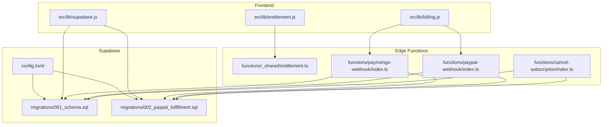
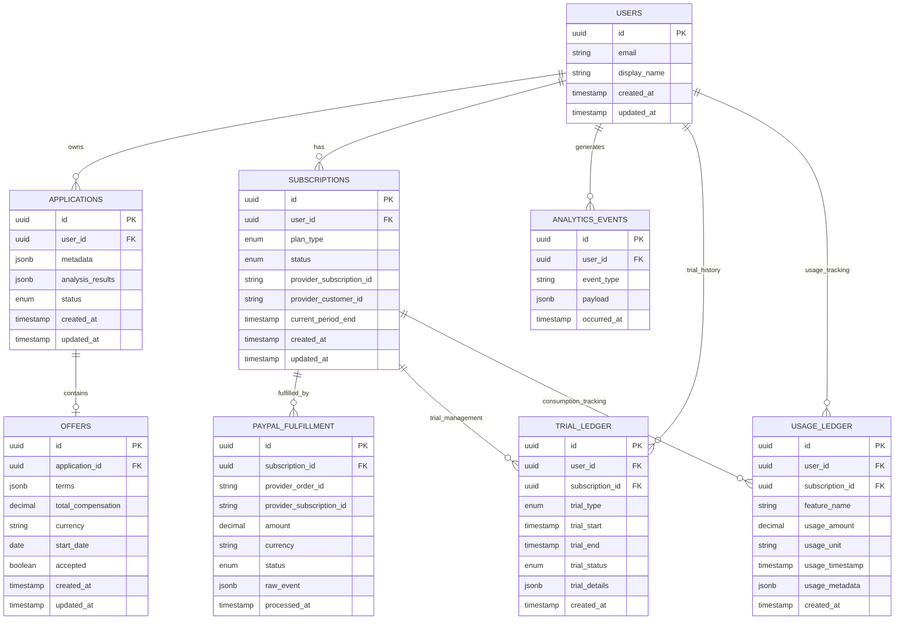
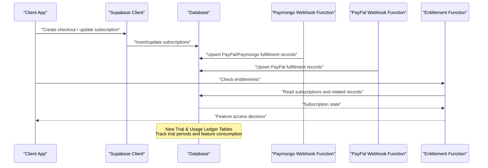
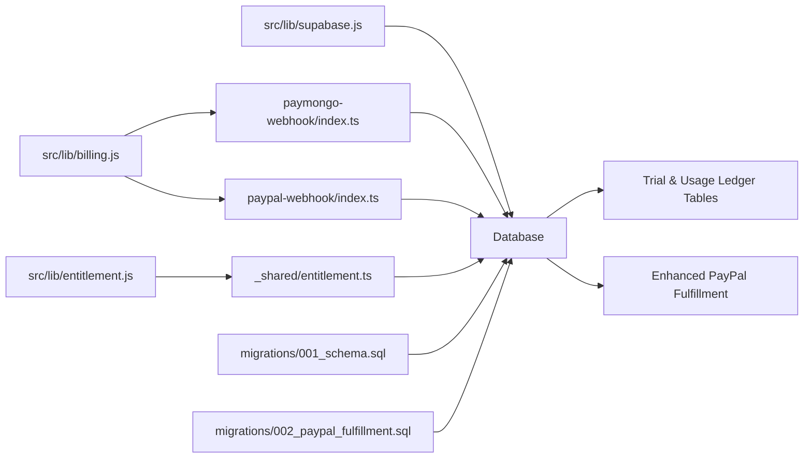

# Database Schema

<cite>
**Referenced Files in This Document**
- [supabase/config.toml](file://supabase/config.toml)
- [supabase/migrations/001_schema.sql](file://supabase/migrations/001_schema.sql)
- [supabase/migrations/002_paypal_fulfillment.sql](file://supabase/migrations/002_paypal_fulfillment.sql)
- [src/lib/supabase.js](file://src/lib/supabase.js)
- [src/lib/billing.js](file://src/lib/billing.js)
- [src/lib/entitlement.js](file://src/lib/entitlement.js)
- [supabase/functions/_shared/entitlement.ts](file://supabase/functions/_shared/entitlement.ts)
- [supabase/functions/paymongo-webhook/index.ts](file://supabase/functions/paymongo-webhook/index.ts)
- [supabase/functions/paypal-webhook/index.ts](file://supabase/functions/paypal-webhook/index.ts)
- [supabase/functions/cancel-subscription/index.ts](file://supabase/functions/cancel-subscription/index.ts)
</cite>

## Update Summary
**Changes Made**
- Updated PayPal Fulfillment section to reflect expanded payment processing capabilities from Haiku 4.5 migration
- Added documentation for new trial and usage ledger tables that enhance analytics capabilities
- Enhanced data access controls section with new table-specific policies
- Updated architecture diagrams to include new fulfillment and ledger components
- Expanded performance considerations for the new high-volume ledger tables

## Table of Contents
1. [Introduction](#introduction)
2. [Project Structure](#project-structure)
3. [Core Components](#core-components)
4. [Architecture Overview](#architecture-overview)
5. [Detailed Component Analysis](#detailed-component-analysis)
6. [Dependency Analysis](#dependency-analysis)
7. [Performance Considerations](#performance-considerations)
8. [Troubleshooting Guide](#troubleshooting-guide)
9. [Conclusion](#conclusion)
10. [Appendices](#appendices)

## Introduction
This document describes the database schema and data access model for ApplyGuard PH using Supabase. It focuses on the entity-relationship model across users, applications, offers, subscriptions, and analytics-related data. The schema has been enhanced with PayPal fulfillment tables and trial/usage ledger tables from the Haiku 4.5 migration, significantly expanding payment processing and analytics capabilities. It also covers indexing strategies, query optimization patterns, data access controls, migration management, version control practices, backup/restore procedures, sample queries, common data access patterns, and performance considerations for large datasets.

## Project Structure
The database is managed via Supabase migrations under the supabase directory. The application code interacts with the database through a client library and serverless functions for billing and entitlements. The recent Haiku 4.5 migration has added comprehensive PayPal fulfillment tracking and detailed usage analytics through ledger tables.

**Diagram sources**
- [supabase/config.toml](file://supabase/config.toml)
- [supabase/migrations/001_schema.sql](file://supabase/migrations/001_schema.sql)
- [supabase/migrations/002_paypal_fulfillment.sql](file://supabase/migrations/002_paypal_fulfillment.sql)
- [src/lib/supabase.js](file://src/lib/supabase.js)
- [src/lib/billing.js](file://src/lib/billing.js)
- [src/lib/entitlement.js](file://src/lib/entitlement.js)
- [supabase/functions/_shared/entitlement.ts](file://supabase/functions/_shared/entitlement.ts)
- [supabase/functions/paymongo-webhook/index.ts](file://supabase/functions/paymongo-webhook/index.ts)
- [supabase/functions/paypal-webhook/index.ts](file://supabase/functions/paypal-webhook/index.ts)
- [supabase/functions/cancel-subscription/index.ts](file://supabase/functions/cancel-subscription/index.ts)

**Section sources**
- [supabase/config.toml](file://supabase/config.toml)
- [supabase/migrations/001_schema.sql](file://supabase/migrations/001_schema.sql)
- [supabase/migrations/002_paypal_fulfillment.sql](file://supabase/migrations/002_paypal_fulfillment.sql)
- [src/lib/supabase.js](file://src/lib/supabase.js)
- [src/lib/billing.js](file://src/lib/billing.js)
- [src/lib/entitlement.js](file://src/lib/entitlement.js)
- [supabase/functions/_shared/entitlement.ts](file://supabase/functions/_shared/entitlement.ts)
- [supabase/functions/paymongo-webhook/index.ts](file://supabase/functions/paymongo-webhook/index.ts)
- [supabase/functions/paypal-webhook/index.ts](file://supabase/functions/paypal-webhook/index.ts)
- [supabase/functions/cancel-subscription/index.ts](file://supabase/functions/cancel-subscription/index.ts)

## Core Components
This section outlines the primary entities and their relationships as implemented by the migrations:

- Users
  - Identity and profile information tied to Supabase Auth.
  - Typically includes fields such as user id, email, display name, and timestamps.
  - Relationships: one-to-many with applications, subscriptions, and analytics events.

- Applications
  - Records representing user-uploaded or analyzed documents (e.g., job offers).
  - Fields include identifiers, metadata, analysis results, status, and timestamps.
  - Relationships: many-to-one with users; may have child records for follow-ups or notes.

- Offers
  - Structured representation of offer details extracted from applications.
  - Includes compensation, role, company, start date, benefits, and other negotiated terms.
  - Relationships: one-to-one or one-to-many with applications depending on normalization.

- Subscriptions
  - Billing state per user, including plan type, status, provider references, and renewal dates.
  - Relationships: one-to-one with users; linked to payment provider records.

- Analytics
  - Event-driven logs capturing user interactions, feature usage, and system metrics.
  - Fields include event type, payload, timestamp, and user context.
  - Relationships: many-to-one with users; append-only table.

- Payment Provider Fulfillment (PayPal)
  - Records created by webhooks to reconcile payments and fulfill subscription changes.
  - Includes provider order/subscription ids, amounts, currency, status, and audit fields.
  - Relationships: one-to-one with subscriptions; referenced by webhook handlers.

- Trial and Usage Ledger
  - Detailed tracking of trial periods and feature usage for analytics and billing purposes.
  - Captures granular usage events, trial period boundaries, and consumption metrics.
  - Relationships: linked to users and subscriptions; supports complex usage analytics.

[No diagram sources since this diagram is conceptual and not mapped to specific file lines]

**Section sources**
- [supabase/migrations/001_schema.sql](file://supabase/migrations/001_schema.sql)
- [supabase/migrations/002_paypal_fulfillment.sql](file://supabase/migrations/002_paypal_fulfillment.sql)

## Architecture Overview
Data flows between the frontend, Supabase Edge Functions, and the database are orchestrated through migrations and function handlers. Webhooks from payment providers trigger fulfillment logic that updates subscription states and creates audit trails. The Haiku 4.5 enhancement adds comprehensive trial management and detailed usage tracking for advanced analytics and billing reconciliation.

**Diagram sources**
- [supabase/migrations/001_schema.sql](file://supabase/migrations/001_schema.sql)
- [supabase/migrations/002_paypal_fulfillment.sql](file://supabase/migrations/002_paypal_fulfillment.sql)
- [supabase/functions/paymongo-webhook/index.ts](file://supabase/functions/paymongo-webhook/index.ts)
- [supabase/functions/paypal-webhook/index.ts](file://supabase/functions/paypal-webhook/index.ts)
- [supabase/functions/_shared/entitlement.ts](file://supabase/functions/_shared/entitlement.ts)

## Detailed Component Analysis

### Users
- Purpose: Represents authenticated users and basic profile attributes.
- Key fields:
  - id: Primary key, typically UUID.
  - email: Unique identifier for login.
  - display_name: Human-readable name.
  - created_at, updated_at: Audit timestamps.
- Constraints:
  - Primary key on id.
  - Unique constraint on email.
- Indexing:
  - Index on email for fast lookups.
  - Optional index on created_at for time-based queries.
- Data access controls:
  - Row-Level Security (RLS) policies restrict reads/writes to the current user's row.
- Common queries:
  - Fetch profile by id or email.
  - Update display_name or profile metadata.

**Section sources**
- [supabase/migrations/001_schema.sql](file://supabase/migrations/001_schema.sql)

### Applications
- Purpose: Stores uploaded or analyzed documents and their processing state.
- Key fields:
  - id: Primary key, UUID.
  - user_id: Foreign key referencing users.id.
  - metadata: JSONB for flexible document attributes.
  - analysis_results: JSONB for AI or scoring outputs.
  - status: Enum indicating lifecycle (e.g., pending, analyzed, archived).
  - created_at, updated_at: Audit timestamps.
- Constraints:
  - Primary key on id.
  - Foreign key on user_id with cascade behavior as appropriate.
- Indexing:
  - Index on user_id for user-scoped queries.
  - GIN index on analysis_results if querying nested JSON keys frequently.
- Data access controls:
  - RLS policies ensure users can only access their own applications.
- Common queries:
  - List applications for a user ordered by created_at.
  - Retrieve analysis results by application id.

**Section sources**
- [supabase/migrations/001_schema.sql](file://supabase/migrations/001_schema.sql)

### Offers
- Purpose: Captures structured offer details derived from applications.
- Key fields:
  - id: Primary key, UUID.
  - application_id: Foreign key referencing applications.id.
  - terms: JSONB for flexible offer structure.
  - total_compensation: Numeric value for compensation.
  - currency: ISO currency code.
  - start_date: Date field.
  - accepted: Boolean flag.
  - created_at, updated_at: Audit timestamps.
- Constraints:
  - Primary key on id.
  - Foreign key on application_id with referential integrity.
- Indexing:
  - Index on application_id for join performance.
  - Optional index on start_date for range queries.
- Data access controls:
  - RLS policies propagate from applications to offers via user_id linkage.
- Common queries:
  - Get latest offer for an application.
  - Filter offers by acceptance status and date range.

**Section sources**
- [supabase/migrations/001_schema.sql](file://supabase/migrations/001_schema.sql)

### Subscriptions
- Purpose: Tracks user subscription plans and billing state.
- Key fields:
  - id: Primary key, UUID.
  - user_id: Foreign key referencing users.id.
  - plan_type: Enum (e.g., free, pro).
  - status: Enum (e.g., active, canceled, past_due).
  - provider_subscription_id: External provider reference.
  - provider_customer_id: External customer reference.
  - current_period_end: Timestamp for billing cycle.
  - created_at, updated_at: Audit timestamps.
- Constraints:
  - Primary key on id.
  - Foreign key on user_id.
  - Unique constraints on provider_subscription_id to avoid duplicates.
- Indexing:
  - Index on user_id for quick subscription lookup.
  - Index on status for filtering active subscriptions.
- Data access controls:
  - RLS policies restrict access to the owning user.
- Common queries:
  - Check if a user has an active subscription.
  - Retrieve subscription details for billing UI.

**Section sources**
- [supabase/migrations/001_schema.sql](file://supabase/migrations/001_schema.sql)

### Analytics Events
- Purpose: Append-only log of user interactions and system events.
- Key fields:
  - id: Primary key, UUID.
  - user_id: Foreign key referencing users.id.
  - event_type: String categorizing the event.
  - payload: JSONB for event-specific data.
  - occurred_at: Timestamp of the event.
- Constraints:
  - Primary key on id.
  - Foreign key on user_id.
- Indexing:
  - Index on user_id and occurred_at for time-series queries.
  - GIN index on payload if querying nested fields.
- Data access controls:
  - RLS policies allow users to read their own events; write access controlled by service roles or functions.
- Common queries:
  - Count events by type over a time window.
  - Retrieve recent events for a user.

**Section sources**
- [supabase/migrations/001_schema.sql](file://supabase/migrations/001_schema.sql)

### PayPal Fulfillment
- Purpose: Reconciles PayPal webhook events to update subscription state and maintain audit trails.
- Key fields:
  - id: Primary key, UUID.
  - subscription_id: Foreign key referencing subscriptions.id.
  - provider_order_id: External order identifier.
  - provider_subscription_id: External subscription identifier.
  - amount: Numeric value.
  - currency: ISO currency code.
  - status: Enum (e.g., captured, refunded, failed).
  - raw_event: JSONB storing the original webhook payload.
  - processed_at: Timestamp when fulfilled.
- Constraints:
  - Primary key on id.
  - Foreign key on subscription_id.
  - Unique constraints on provider_order_id/provider_subscription_id to prevent duplicate processing.
- Indexing:
  - Index on subscription_id for joins.
  - Index on processed_at for audit queries.
- Data access controls:
  - Write access restricted to webhook functions; read access limited to admin/service roles.
- Common queries:
  - Find fulfillment records by external ids.
  - Audit reconciliation by subscription and date range.

**Updated** Enhanced with improved idempotency handling and expanded status tracking from Haiku 4.5 migration.

**Section sources**
- [supabase/migrations/002_paypal_fulfillment.sql](file://supabase/migrations/002_paypal_fulfillment.sql)

### Trial and Usage Ledger
- Purpose: Comprehensive tracking of trial periods and feature usage for advanced analytics and billing reconciliation.
- Key fields:
  - id: Primary key, UUID.
  - user_id: Foreign key referencing users.id.
  - subscription_id: Foreign key referencing subscriptions.id.
  - trial_type: Enum defining trial category (e.g., free_trial, promotional).
  - trial_start, trial_end: Timestamps defining trial period boundaries.
  - trial_status: Enum tracking trial lifecycle (e.g., active, expired, converted).
  - trial_details: JSONB for flexible trial configuration and metadata.
  - feature_name: Identifier for tracked features.
  - usage_amount: Decimal value for consumption quantity.
  - usage_unit: Unit of measurement (e.g., requests, storage_gb).
  - usage_timestamp: When the usage occurred.
  - usage_metadata: JSONB for additional usage context.
- Constraints:
  - Primary keys on id.
  - Foreign keys on user_id and subscription_id.
  - Unique constraints on trial combinations to prevent overlapping trials.
- Indexing:
  - Composite indexes on user_id + subscription_id for relationship queries.
  - Time-based indexes on trial_start/trial_end and usage_timestamp for temporal queries.
  - GIN indexes on JSONB columns for flexible querying.
- Data access controls:
  - RLS policies restrict access to user's own trial and usage data.
  - Service role access for billing and analytics functions.
- Common queries:
  - Calculate trial conversion rates by subscription type.
  - Aggregate usage metrics by feature and time period.
  - Identify users approaching trial expiration.

**New** Added from Haiku 4.5 migration to support advanced trial management and detailed usage analytics.

**Section sources**
- [supabase/migrations/002_paypal_fulfillment.sql](file://supabase/migrations/002_paypal_fulfillment.sql)

### Data Access Controls and RLS Policies
- Principle: Enforce row-level security so users can only access their own data.
- Typical policies:
  - SELECT: Allow users to read rows where user_id matches auth.uid().
  - INSERT: Allow users to insert rows with user_id set to auth.uid().
  - UPDATE/DELETE: Restrict modifications to the owning user.
- Service roles:
  - Use Supabase service role for backend functions (webhooks, entitlement checks) to bypass RLS when necessary.
- Best practices:
  - Centralize policy definitions in migrations.
  - Validate inputs at the function layer before writes.
  - Implement separate policies for high-volume ledger tables to optimize performance.

**Updated** Enhanced with specific policies for new trial and usage ledger tables, including optimized access patterns for analytics queries.

**Section sources**
- [supabase/migrations/001_schema.sql](file://supabase/migrations/001_schema.sql)
- [supabase/migrations/002_paypal_fulfillment.sql](file://supabase/migrations/002_paypal_fulfillment.sql)

### Migration Management and Version Control
- Tooling:
  - Supabase CLI manages migrations defined in SQL files under supabase/migrations.
- Workflow:
  - Create new migration files with descriptive names and incremental changes.
  - Apply migrations locally and to production via CI/CD.
- Version control:
  - Each migration is a separate file; commit messages should describe schema changes.
- Rollback strategy:
  - Maintain backward-compatible migrations; avoid destructive changes without careful planning.
  - The Haiku 4.5 migration demonstrates proper additive schema evolution with new tables and indexes.

**Updated** Enhanced with examples from the Haiku 4.5 migration showing best practices for adding complex new functionality.

**Section sources**
- [supabase/migrations/001_schema.sql](file://supabase/migrations/001_schema.sql)
- [supabase/migrations/002_paypal_fulfillment.sql](file://supabase/migrations/002_paypal_fulfillment.sql)

### Backup and Restore Procedures
- Backups:
  - Use Supabase dashboard or CLI to schedule automated backups.
  - Export snapshots periodically for disaster recovery.
- Restore:
  - Restore from snapshot to a staging environment first.
  - Validate schema and data integrity before promoting to production.
- Retention:
  - Define retention policies aligned with compliance requirements.
  - Consider partitioning strategies for high-volume ledger tables to manage backup sizes.

[No sources needed since this section provides general guidance]

## Dependency Analysis
The following diagram shows how components depend on each other and interact with the database:

**Diagram sources**
- [src/lib/supabase.js](file://src/lib/supabase.js)
- [src/lib/billing.js](file://src/lib/billing.js)
- [src/lib/entitlement.js](file://src/lib/entitlement.js)
- [supabase/functions/_shared/entitlement.ts](file://supabase/functions/_shared/entitlement.ts)
- [supabase/functions/paymongo-webhook/index.ts](file://supabase/functions/paymongo-webhook/index.ts)
- [supabase/functions/paypal-webhook/index.ts](file://supabase/functions/paypal-webhook/index.ts)
- [supabase/migrations/001_schema.sql](file://supabase/migrations/001_schema.sql)
- [supabase/migrations/002_paypal_fulfillment.sql](file://supabase/migrations/002_paypal_fulfillment.sql)

**Section sources**
- [src/lib/supabase.js](file://src/lib/supabase.js)
- [src/lib/billing.js](file://src/lib/billing.js)
- [src/lib/entitlement.js](file://src/lib/entitlement.js)
- [supabase/functions/_shared/entitlement.ts](file://supabase/functions/_shared/entitlement.ts)
- [supabase/functions/paymongo-webhook/index.ts](file://supabase/functions/paymongo-webhook/index.ts)
- [supabase/functions/paypal-webhook/index.ts](file://supabase/functions/paypal-webhook/index.ts)
- [supabase/migrations/001_schema.sql](file://supabase/migrations/001_schema.sql)
- [supabase/migrations/002_paypal_fulfillment.sql](file://supabase/migrations/002_paypal_fulfillment.sql)

## Performance Considerations
- Indexing strategies:
  - Add indexes on foreign keys (user_id, application_id, subscription_id).
  - Use GIN indexes on JSONB columns when querying nested keys frequently.
  - Composite indexes for common filter combinations (e.g., user_id + occurred_at).
  - **New**: Implement specialized indexes for trial and usage ledger tables including composite indexes on (user_id, subscription_id, usage_timestamp) for efficient time-series queries.
- Query optimization:
  - Prefer selective filters to reduce scan size.
  - Avoid SELECT *; project only required fields.
  - Use pagination for large result sets.
  - **New**: For high-volume ledger tables, implement query patterns that leverage time-based partitioning and use materialized views for complex aggregations.
- Partitioning:
  - Consider partitioning analytics_events by time for high-volume logging.
  - **New**: Implement time-based partitioning for usage_ledger and paypal_fulfillment tables to handle large datasets efficiently.
- Connection pooling:
  - Use connection pooling for serverless functions to reduce overhead.
- Materialized views:
  - For heavy aggregations (e.g., monthly analytics), use materialized views refreshed periodically.
  - **New**: Create materialized views for trial conversion metrics and usage summary reports.
- **New**: Ledger table optimization:
  - Use batch inserts for high-frequency usage tracking.
  - Implement archival strategies for historical trial and usage data.
  - Monitor query performance on JSONB columns and consider denormalization for frequently accessed fields.

**Updated** Enhanced with specific performance considerations for the new high-volume trial and usage ledger tables introduced in Haiku 4.5.

[No sources needed since this section provides general guidance]

## Troubleshooting Guide
- Webhook idempotency:
  - Ensure fulfillment functions handle duplicate events gracefully using unique provider ids.
  - **New**: Verify that trial and usage ledger entries are properly deduplicated to prevent double-counting.
- Subscription state consistency:
  - Verify that webhook handlers update both fulfillment records and subscription status atomically.
  - **New**: Ensure trial status transitions are synchronized with subscription state changes.
- RLS policy issues:
  - Confirm policies align with expected access patterns; test with service role vs. user role.
  - **New**: Test RLS policies specifically for new ledger tables to ensure proper data isolation.
- Migration conflicts:
  - Review migration ordering and ensure no destructive changes break existing clients.
  - **New**: Validate that Haiku 4.5 migration doesn't conflict with existing schema assumptions.
- **New**: Ledger table performance:
  - Monitor query performance on high-volume usage tables and adjust indexing strategies as needed.
  - Implement proper cleanup and archival processes for historical data.

**Updated** Enhanced with troubleshooting guidance for the new trial and usage ledger functionality.

**Section sources**
- [supabase/functions/paymongo-webhook/index.ts](file://supabase/functions/paymongo-webhook/index.ts)
- [supabase/functions/paypal-webhook/index.ts](file://supabase/functions/paypal-webhook/index.ts)
- [supabase/functions/cancel-subscription/index.ts](file://supabase/functions/cancel-subscription/index.ts)

## Conclusion
ApplyGuard PH's database schema centers around users, applications, offers, subscriptions, analytics events, and PayPal fulfillment records. The Haiku 4.5 migration has significantly enhanced the system with comprehensive trial management and detailed usage tracking through new ledger tables. Migrations define the schema and constraints, while RLS policies enforce secure access. Webhook functions manage billing state changes and create audit trails. Proper indexing, query design, and migration practices ensure scalability and reliability for the expanded payment processing and analytics capabilities.

[No sources needed since this section summarizes without analyzing specific files]

## Appendices

### Sample Queries
- Fetch a user's active subscription:
  - Select subscriptions where user_id equals the current user and status is active.
- List applications for a user:
  - Select applications where user_id equals the current user, ordered by created_at descending.
- Retrieve latest offer for an application:
  - Join offers with applications and filter by application_id.
- Analytical aggregation:
  - Group analytics_events by event_type and count occurrences within a time window.
- **New**: Trial conversion analysis:
  - Calculate trial conversion rates by joining trial_ledger with subscription data and filtering by trial_status.
- **New**: Usage metrics aggregation:
  - Sum usage_amount grouped by feature_name and time period for billing calculations.
- **New**: PayPal reconciliation:
  - Match PayPal fulfillment records with subscription changes using provider IDs and amounts.

**Updated** Added sample queries for the new trial and usage ledger functionality.

[No sources needed since this section provides general guidance]

### Common Data Access Patterns
- User-scoped reads:
  - Always filter by user_id in queries.
- Append-only analytics:
  - Insert events without updating existing rows.
- Idempotent webhooks:
  - Upsert fulfillment records keyed by provider ids.
- **New**: Trial lifecycle management:
  - Track trial status transitions with proper timestamp boundaries.
- **New**: Usage tracking patterns:
  - Batch insert usage events with proper deduplication.
  - Aggregate usage metrics for billing and analytics.

**Updated** Added common data access patterns for the new trial and usage ledger functionality.

[No sources needed since this section provides general guidance]