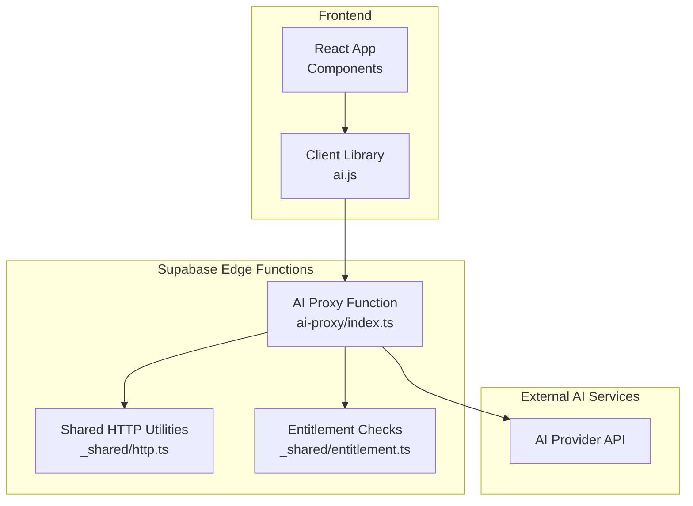
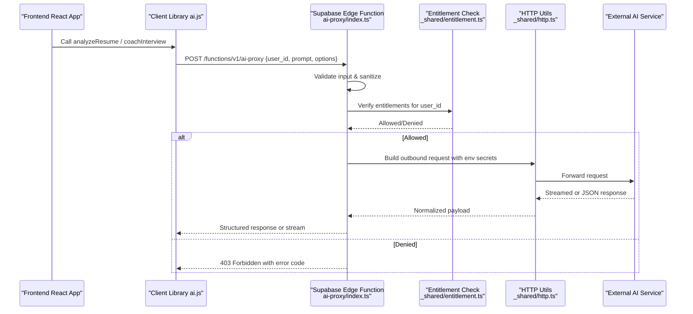
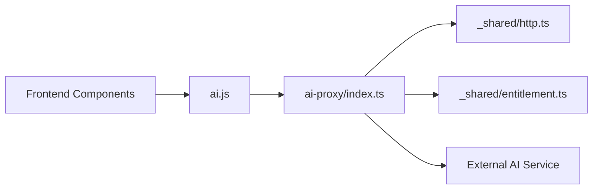

# AI Proxy Function

<cite>
**Referenced Files in This Document**
- [ai-proxy/index.ts](file://supabase/functions/ai-proxy/index.ts)
- [ai.js](file://src/lib/ai.js)
- [analyze.js](file://src/lib/analyze.js)
- [prompt.js](file://src/lib/prompt.js)
- [auth.jsx](file://src/auth.jsx)
- [AiAssistant.jsx](file://src/components/AiAssistant.jsx)
- [MockInterviewPage.jsx](file://src/components/MockInterviewPage.jsx)
- [_shared/http.ts](file://supabase/functions/_shared/http.ts)
- [_shared/entitlement.ts](file://supabase/functions/_shared/entitlement.ts)
</cite>

## Table of Contents
1. [Introduction](#introduction)
2. [Project Structure](#project-structure)
3. [Core Components](#core-components)
4. [Architecture Overview](#architecture-overview)
5. [Detailed Component Analysis](#detailed-component-analysis)
6. [Dependency Analysis](#dependency-analysis)
7. [Performance Considerations](#performance-considerations)
8. [Troubleshooting Guide](#troubleshooting-guide)
9. [Conclusion](#conclusion)
10. [Appendices](#appendices)

## Introduction
This document describes the AI proxy function that handles resume analysis and interview coaching requests. It explains how the Supabase Edge Function proxies requests to external AI services, manages API keys securely, validates inputs, enforces entitlements, and returns structured responses to the frontend. It also provides guidance on calling the proxy from React components, handling streaming when applicable, implementing retry logic, rate limiting, and security considerations for protecting AI service credentials.

## Project Structure
The AI proxy is implemented as a Supabase Edge Function under supabase/functions/ai-proxy. The frontend uses client libraries and hooks to call this endpoint. Shared utilities handle HTTP interactions and entitlement checks.

**Diagram sources**
- [ai-proxy/index.ts](file://supabase/functions/ai-proxy/index.ts)
- [ai.js](file://src/lib/ai.js)
- [_shared/http.ts](file://supabase/functions/_shared/http.ts)
- [_shared/entitlement.ts](file://supabase/functions/_shared/entitlement.ts)

**Section sources**
- [ai-proxy/index.ts](file://supabase/functions/ai-proxy/index.ts)
- [ai.js](file://src/lib/ai.js)
- [_shared/http.ts](file://supabase/functions/_shared/http.ts)
- [_shared/entitlement.ts](file://supabase/functions/_shared/entitlement.ts)

## Core Components
- AI Proxy Function: Receives authenticated requests, validates inputs, checks user entitlements, forwards prompts to external AI providers using secure environment variables, and returns structured JSON or streamed responses.
- Client Library (ai.js): Provides typed helpers to call the AI proxy with request payloads and parse responses.
- Shared HTTP Utilities: Encapsulate outbound HTTP calls, headers, timeouts, retries, and error mapping.
- Entitlement Module: Validates subscription or feature access before allowing AI usage.

Key responsibilities:
- Authentication and authorization via Supabase session context.
- Input validation and sanitization for prompt content and parameters.
- Secure retrieval of AI provider credentials from environment variables.
- Outbound request construction and response normalization.
- Streaming support where applicable.
- Error handling and consistent error shapes.

**Section sources**
- [ai-proxy/index.ts](file://supabase/functions/ai-proxy/index.ts)
- [ai.js](file://src/lib/ai.js)
- [_shared/http.ts](file://supabase/functions/_shared/http.ts)
- [_shared/entitlement.ts](file://supabase/functions/_shared/entitlement.ts)

## Architecture Overview
The AI proxy acts as a secure gateway between the frontend and external AI services. It ensures only authorized users can invoke AI features, enforces quotas, and centralizes credential management.

**Diagram sources**
- [ai-proxy/index.ts](file://supabase/functions/ai-proxy/index.ts)
- [ai.js](file://src/lib/ai.js)
- [_shared/http.ts](file://supabase/functions/_shared/http.ts)
- [_shared/entitlement.ts](file://supabase/functions/_shared/entitlement.ts)

## Detailed Component Analysis

### AI Proxy Function
Responsibilities:
- Parse and validate incoming request body fields such as user_id, prompt, and optional parameters (e.g., model, temperature).
- Enforce authentication by reading Supabase session context.
- Perform entitlement checks to ensure the user has access to AI features.
- Retrieve AI provider credentials from environment variables; never accept secrets from clients.
- Construct outbound requests to the AI provider with appropriate headers and payload.
- Support both JSON and streaming responses depending on provider capabilities.
- Normalize responses into a consistent schema for the frontend.
- Map provider errors to standardized error codes and messages.

Security considerations:
- Do not expose provider API keys to the client.
- Validate and sanitize all inputs to prevent injection or abuse.
- Apply rate limiting per user or globally at the function level.
- Log minimal sensitive data; avoid logging full prompts or tokens.

Error handling patterns:
- Return structured errors with codes like INVALID_INPUT, UNAUTHORIZED, FORBIDDEN, RATE_LIMITED, PROVIDER_ERROR.
- Include message and optional details for debugging while avoiding leaking secrets.

Streaming behavior:
- If supported by the provider, forward server-sent events or chunked responses.
- Ensure the client library consumes streams correctly and reassembles partial outputs.

Input validation rules:
- Required fields: user_id, prompt.
- Prompt length limits and allowed character sets.
- Optional parameters: model, max_tokens, temperature, top_p, with safe defaults and bounds.

Rate limiting:
- Implement per-user and global limits using in-memory counters or external stores if needed.
- Return 429 with retry-after guidance when exceeded.

**Section sources**
- [ai-proxy/index.ts](file://supabase/functions/ai-proxy/index.ts)
- [_shared/http.ts](file://supabase/functions/_shared/http.ts)
- [_shared/entitlement.ts](file://supabase/functions/_shared/entitlement.ts)

### Client Library (ai.js)
Responsibilities:
- Provide functions to call the AI proxy endpoint with typed payloads.
- Handle authentication headers automatically using Supabase client.
- Parse JSON responses and normalize them into application models.
- Optionally consume streaming responses if the backend supports it.
- Expose retry helpers with exponential backoff and jitter.

Usage examples:
- Resume analysis: call analyzeResume with resume text and options.
- Interview coaching: call coachInterview with questions and context.

Retry logic:
- Retry transient errors (network timeouts, 5xx, 429) with backoff.
- Avoid retrying invalid input or permission errors.

**Section sources**
- [ai.js](file://src/lib/ai.js)

### Shared HTTP Utilities (_shared/http.ts)
Responsibilities:
- Centralize outbound HTTP configuration: timeouts, retries, headers.
- Inject AI provider credentials from environment variables.
- Normalize provider responses and errors.
- Support streaming transport when available.

Configuration:
- Base URL and endpoints for the AI provider.
- Timeout durations and maximum retries.
- Header templates including authorization and content-type.

**Section sources**
- [_shared/http.ts](file://supabase/functions/_shared/http.ts)

### Entitlement Checks (_shared/entitlement.ts)
Responsibilities:
- Determine whether a user has access to AI features based on subscription status or feature flags.
- Cache results where appropriate to reduce overhead.
- Return clear allow/deny decisions to the proxy function.

Integration:
- Called early in the proxy flow to gate access.
- Returns specific codes for billing-related denials.

**Section sources**
- [_shared/entitlement.ts](file://supabase/functions/_shared/entitlement.ts)

### Frontend Integration Examples
- AiAssistant.jsx: Demonstrates invoking the AI proxy for conversational coaching and displaying incremental responses.
- MockInterviewPage.jsx: Shows batched prompting for mock interviews and result rendering.
- auth.jsx: Ensures user sessions are active before calling AI features.

Best practices:
- Always pass user_id from the authenticated session.
- Show loading states and progress indicators during long-running operations.
- Handle network failures gracefully with user-friendly messages.

**Section sources**
- [AiAssistant.jsx](file://src/components/AiAssistant.jsx)
- [MockInterviewPage.jsx](file://src/components/MockInterviewPage.jsx)
- [auth.jsx](file://src/auth.jsx)

## Dependency Analysis
The AI proxy depends on shared modules for HTTP and entitlements, and the frontend depends on the client library.

**Diagram sources**
- [ai.js](file://src/lib/ai.js)
- [ai-proxy/index.ts](file://supabase/functions/ai-proxy/index.ts)
- [_shared/http.ts](file://supabase/functions/_shared/http.ts)
- [_shared/entitlement.ts](file://supabase/functions/_shared/entitlement.ts)

**Section sources**
- [ai.js](file://src/lib/ai.js)
- [ai-proxy/index.ts](file://supabase/functions/ai-proxy/index.ts)
- [_shared/http.ts](file://supabase/functions/_shared/http.ts)
- [_shared/entitlement.ts](file://supabase/functions/_shared/entitlement.ts)

## Performance Considerations
- Use streaming for long responses to improve perceived latency.
- Set sensible timeouts to fail fast on slow providers.
- Cache entitlement checks to reduce repeated database lookups.
- Limit prompt sizes and apply token budgets to control costs.
- Implement circuit breakers around provider calls to avoid cascading failures.

[No sources needed since this section provides general guidance]

## Troubleshooting Guide
Common issues and resolutions:
- Invalid input: Ensure required fields are present and within allowed ranges.
- Unauthorized: Verify Supabase session and that the user is logged in.
- Forbidden: Confirm entitlements are active for AI features.
- Rate limited: Back off and retry after the suggested interval.
- Provider error: Inspect normalized error codes and messages without exposing secrets.

Debugging tips:
- Enable detailed logs in development only.
- Correlate request IDs across frontend and backend.
- Validate environment variables for provider credentials.

**Section sources**
- [ai-proxy/index.ts](file://supabase/functions/ai-proxy/index.ts)
- [_shared/http.ts](file://supabase/functions/_shared/http.ts)

## Conclusion
The AI proxy function centralizes secure access to external AI services, enforcing authentication, entitlements, input validation, and rate limiting. It normalizes responses and supports streaming, providing a robust foundation for resume analysis and interview coaching features. By following the recommended patterns for client integration, retries, and security, teams can deliver reliable and cost-effective AI experiences.

[No sources needed since this section summarizes without analyzing specific files]

## Appendices

### API Endpoint Reference
- Endpoint: POST /functions/v1/ai-proxy
- Authentication: Supabase session required
- Request body:
  - user_id: string (required)
  - prompt: string (required)
  - options: object (optional)
    - model: string
    - temperature: number
    - max_tokens: number
    - top_p: number
- Response body:
  - success: boolean
  - data: object|string (normalized output or stream chunks)
  - error: object|null (error code, message, details)
- Status codes:
  - 200: Success
  - 400: Invalid input
  - 401: Unauthorized
  - 403: Forbidden (no entitlement)
  - 429: Rate limited
  - 500: Internal error
  - 502/503: Provider unavailable

[No sources needed since this section provides general guidance]

### Security Checklist
- Store AI provider credentials in environment variables only.
- Never accept secrets from clients.
- Validate and sanitize all inputs.
- Apply rate limiting per user and globally.
- Log minimal sensitive information.
- Use HTTPS and short-lived tokens where possible.

[No sources needed since this section provides general guidance]