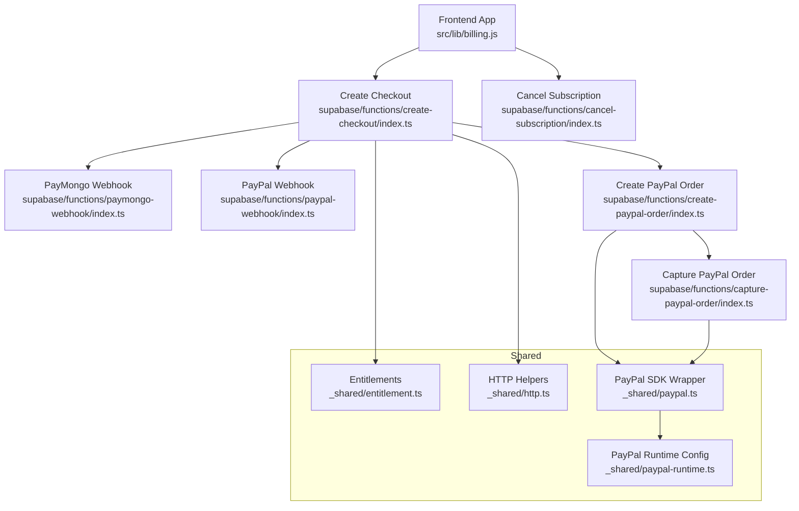
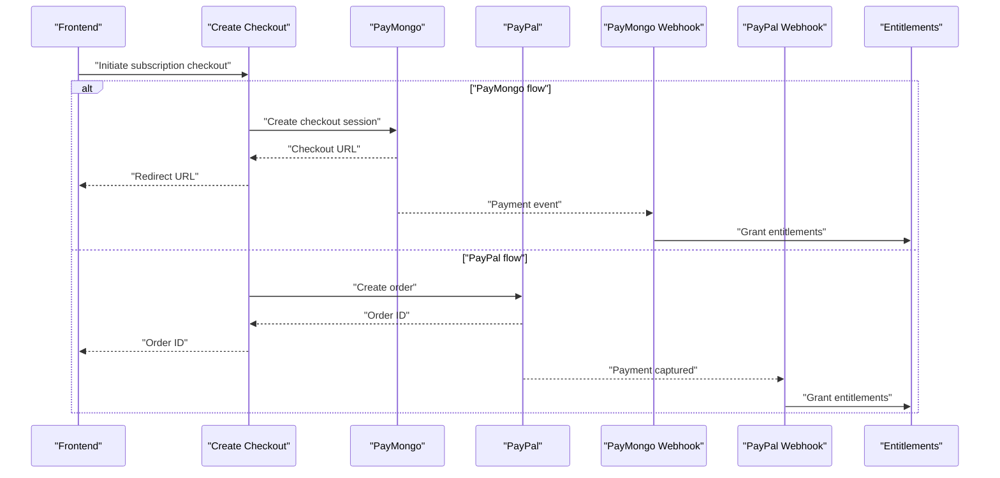
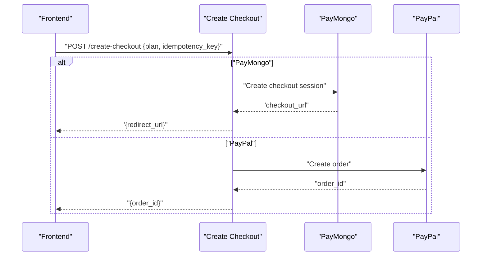
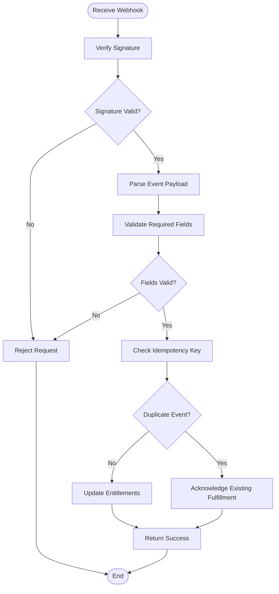
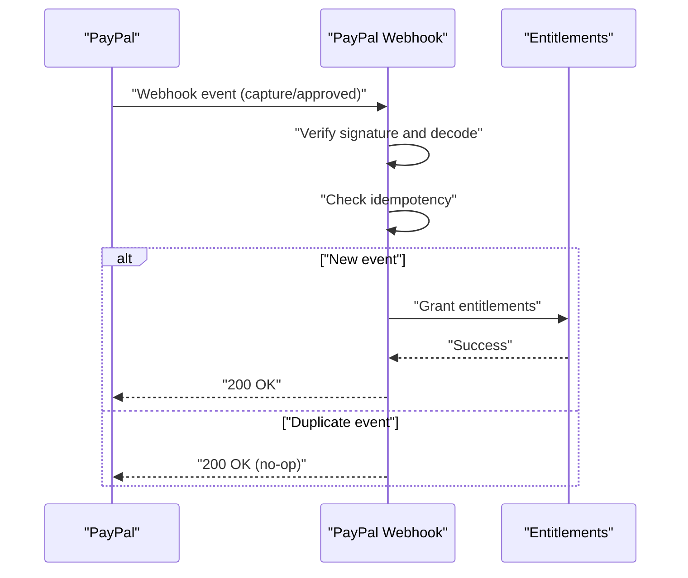
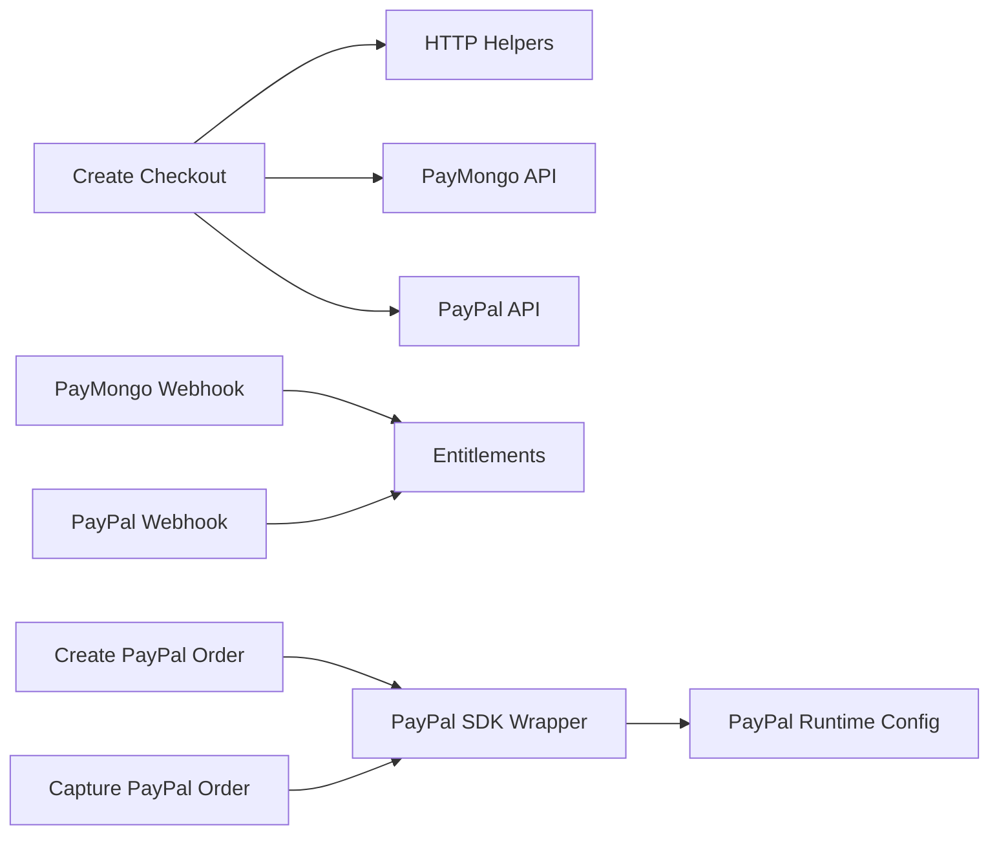

# Billing & Payment Functions

<cite>
**Referenced Files in This Document**
- [billing.js](file://src/lib/billing.js)
- [create-checkout/index.ts](file://supabase/functions/create-checkout/index.ts)
- [cancel-subscription/index.ts](file://supabase/functions/cancel-subscription/index.ts)
- [paymongo-webhook/index.ts](file://supabase/functions/paymongo-webhook/index.ts)
- [paypal-webhook/index.ts](file://supabase/functions/paypal-webhook/index.ts)
- [create-paypal-order/index.ts](file://supabase/functions/create-paypal-order/index.ts)
- [capture-paypal-order/index.ts](file://supabase/functions/capture-paypal-order/index.ts)
- [paypal.ts](file://supabase/functions/_shared/paypal.ts)
- [paypal-runtime.ts](file://supabase/functions/_shared/paypal-runtime.ts)
- [entitlement.ts](file://supabase/functions/_shared/entitlement.ts)
- [http.ts](file://supabase/functions/_shared/http.ts)
- [03-subscriptions-paymongo.md](file://docs/superpowers/plans/monetization/03-subscriptions-paymongo.md)
</cite>

## Table of Contents
1. [Introduction](#introduction)
2. [Project Structure](#project-structure)
3. [Core Components](#core-components)
4. [Architecture Overview](#architecture-overview)
5. [Detailed Component Analysis](#detailed-component-analysis)
6. [Dependency Analysis](#dependency-analysis)
7. [Performance Considerations](#performance-considerations)
8. [Troubleshooting Guide](#troubleshooting-guide)
9. [Conclusion](#conclusion)
10. [Appendices](#appendices)

## Introduction
This document explains the billing and payment processing functions for initiating subscription payments, managing subscriptions, and handling webhooks from PayMongo and PayPal. It covers:
- Creating a checkout session to start a subscription payment (PayMongo and PayPal flows)
- Canceling an active subscription
- Webhook signature verification and idempotency
- Authentication requirements and error scenarios
- Frontend integration patterns for initiating checkouts and synchronizing subscription state

## Project Structure
The billing system is implemented as Supabase Edge Functions with shared utilities and client-side helpers:
- Client helper: src/lib/billing.js
- Server endpoints:
  - supabase/functions/create-checkout/index.ts
  - supabase/functions/cancel-subscription/index.ts
  - supabase/functions/paymongo-webhook/index.ts
  - supabase/functions/paypal-webhook/index.ts
  - supabase/functions/create-paypal-order/index.ts
  - supabase/functions/capture-paypal-order/index.ts
- Shared libraries:
  - supabase/functions/_shared/paypal.ts
  - supabase/functions/_shared/paypal-runtime.ts
  - supabase/functions/_shared/entitlement.ts
  - supabase/functions/_shared/http.ts
- Design reference: docs/superpowers/plans/monetization/03-subscriptions-paymongo.md

**Diagram sources**
- [billing.js](file://src/lib/billing.js)
- [create-checkout/index.ts](file://supabase/functions/create-checkout/index.ts)
- [cancel-subscription/index.ts](file://supabase/functions/cancel-subscription/index.ts)
- [paymongo-webhook/index.ts](file://supabase/functions/paymongo-webhook/index.ts)
- [paypal-webhook/index.ts](file://supabase/functions/paypal-webhook/index.ts)
- [create-paypal-order/index.ts](file://supabase/functions/create-paypal-order/index.ts)
- [capture-paypal-order/index.ts](file://supabase/functions/capture-paypal-order/index.ts)
- [entitlement.ts](file://supabase/functions/_shared/entitlement.ts)
- [http.ts](file://supabase/functions/_shared/http.ts)
- [paypal.ts](file://supabase/functions/_shared/paypal.ts)
- [paypal-runtime.ts](file://supabase/functions/_shared/paypal-runtime.ts)

**Section sources**
- [billing.js](file://src/lib/billing.js)
- [create-checkout/index.ts](file://supabase/functions/create-checkout/index.ts)
- [cancel-subscription/index.ts](file://supabase/functions/cancel-subscription/index.ts)
- [paymongo-webhook/index.ts](file://supabase/functions/paymongo-webhook/index.ts)
- [paypal-webhook/index.ts](file://supabase/functions/paypal-webhook/index.ts)
- [create-paypal-order/index.ts](file://supabase/functions/create-paypal-order/index.ts)
- [capture-paypal-order/index.ts](file://supabase/functions/capture-paypal-order/index.ts)
- [entitlement.ts](file://supabase/functions/_shared/entitlement.ts)
- [http.ts](file://supabase/functions/_shared/http.ts)
- [paypal.ts](file://supabase/functions/_shared/paypal.ts)
- [paypal-runtime.ts](file://supabase/functions/_shared/paypal-runtime.ts)
- [03-subscriptions-paymongo.md](file://docs/superpowers/plans/monetization/03-subscriptions-paymongo.md)

## Core Components
- Create Checkout: Creates a PayMongo checkout session or a PayPal order for subscription payments. Returns a redirect URL or order ID for the frontend to complete payment.
- Cancel Subscription: Cancels an existing subscription based on provider-specific identifiers.
- Webhooks:
  - PayMongo Webhook: Verifies signatures, validates events, updates entitlements, and ensures idempotent fulfillment.
  - PayPal Webhook: Verifies webhook requests, decodes events, fulfills orders, and reconciles subscription state.
- Shared Utilities:
  - Entitlements: Centralized logic to grant/revoke features based on subscription status.
  - HTTP: Standardized outbound request helpers used by providers.
  - PayPal SDK wrapper and runtime configuration for secure API calls.

Key responsibilities:
- Enforce authentication before creating or modifying subscriptions.
- Validate and sign-check all incoming webhooks.
- Maintain idempotency using provider IDs and server-side deduplication.
- Keep client and server subscription state synchronized via webhooks and polling.

**Section sources**
- [create-checkout/index.ts](file://supabase/functions/create-checkout/index.ts)
- [cancel-subscription/index.ts](file://supabase/functions/cancel-subscription/index.ts)
- [paymongo-webhook/index.ts](file://supabase/functions/paymongo-webhook/index.ts)
- [paypal-webhook/index.ts](file://supabase/functions/paypal-webhook/index.ts)
- [entitlement.ts](file://supabase/functions/_shared/entitlement.ts)
- [http.ts](file://supabase/functions/_shared/http.ts)
- [paypal.ts](file://supabase/functions/_shared/paypal.ts)
- [paypal-runtime.ts](file://supabase/functions/_shared/paypal-runtime.ts)

## Architecture Overview
End-to-end flows:
- Initiate checkout: Frontend calls create-checkout; server returns a payment link or order ID; frontend redirects or completes payment.
- Fulfillment: Provider sends webhook; server verifies signature, checks idempotency, updates entitlements, and responds with success.
- Cancellation: Frontend calls cancel-subscription; server updates provider and local state.

**Diagram sources**
- [create-checkout/index.ts](file://supabase/functions/create-checkout/index.ts)
- [paymongo-webhook/index.ts](file://supabase/functions/paymongo-webhook/index.ts)
- [paypal-webhook/index.ts](file://supabase/functions/paypal-webhook/index.ts)
- [entitlement.ts](file://supabase/functions/_shared/entitlement.ts)

## Detailed Component Analysis

### Create Checkout Function
Purpose:
- Start a subscription payment via PayMongo or PayPal.
- Accept user identity and plan details.
- Return a redirect URL (PayMongo) or order ID (PayPal).

Request parameters:
- User identifier (authenticated context).
- Plan identifier or pricing metadata.
- Optional currency and region settings.
- Idempotency key (recommended for retries).

Response formats:
- PayMongo: Redirect URL to complete checkout.
- PayPal: Order ID to be used by the frontend to finalize payment.

Integration notes:
- Uses shared HTTP helpers for provider calls.
- For PayPal, may delegate to create-paypal-order and capture-paypal-order flows.
- Stores minimal metadata needed for reconciliation.

Frontend usage pattern:
- Call create-checkout with plan and idempotency key.
- If PayMongo, redirect user to returned URL.
- If PayPal, use returned order ID to complete payment via PayPal UI.
- After completion, poll or listen for webhook-driven state changes.

Error scenarios:
- Invalid or missing plan.
- Provider errors (network, auth, rate limits).
- Duplicate idempotency keys handled idempotently.

Idempotency:
- Use a unique idempotency key per checkout attempt to prevent duplicate charges.

Authentication:
- Requires authenticated user context before creating checkout.

**Section sources**
- [create-checkout/index.ts](file://supabase/functions/create-checkout/index.ts)
- [create-paypal-order/index.ts](file://supabase/functions/create-paypal-order/index.ts)
- [capture-paypal-order/index.ts](file://supabase/functions/capture-paypal-order/index.ts)
- [http.ts](file://supabase/functions/_shared/http.ts)
- [paypal.ts](file://supabase/functions/_shared/paypal.ts)
- [paypal-runtime.ts](file://supabase/functions/_shared/paypal-runtime.ts)

#### Create Checkout Flow (Sequence)

**Diagram sources**
- [create-checkout/index.ts](file://supabase/functions/create-checkout/index.ts)
- [create-paypal-order/index.ts](file://supabase/functions/create-paypal-order/index.ts)

### Cancel Subscription Function
Purpose:
- Cancel an active subscription for the authenticated user.
- Update provider and local state accordingly.

Request parameters:
- Subscription identifier or provider-specific subscription ID.
- Reason (optional).

Response format:
- Confirmation of cancellation with updated status.

Lifecycle considerations:
- Ensure cancellation is idempotent.
- Handle partial failures gracefully and retry safely.
- Revoke entitlements after successful cancellation.

Authentication:
- Requires authenticated user context and ownership validation.

**Section sources**
- [cancel-subscription/index.ts](file://supabase/functions/cancel-subscription/index.ts)
- [entitlement.ts](file://supabase/functions/_shared/entitlement.ts)

### PayMongo Webhook Handler
Responsibilities:
- Verify webhook signature using provider secret.
- Parse event payload and validate required fields.
- Check idempotency to avoid duplicate fulfillment.
- Update entitlements and return success response.

Signature verification:
- Validate timestamp and signature headers against configured secret.

Idempotency:
- Deduplicate events using event ID or transaction ID.

State synchronization:
- On success, grant entitlements and persist subscription state.

Error handling:
- Return appropriate HTTP status codes for invalid signatures or malformed payloads.
- Log detailed errors for observability.

**Section sources**
- [paymongo-webhook/index.ts](file://supabase/functions/paymongo-webhook/index.ts)
- [entitlement.ts](file://supabase/functions/_shared/entitlement.ts)

#### PayMongo Webhook Verification Flow (Flowchart)

**Diagram sources**
- [paymongo-webhook/index.ts](file://supabase/functions/paymongo-webhook/index.ts)

### PayPal Webhook Handler
Responsibilities:
- Verify webhook authenticity and decode event.
- Map PayPal events to internal subscription states.
- Fulfill orders and update entitlements.
- Ensure idempotent processing using order/event IDs.

Signature verification:
- Validate webhook headers and payload integrity.

Idempotency:
- Track processed order/event IDs to prevent double fulfillment.

State synchronization:
- On capture or approved events, grant entitlements and record subscription details.

Error handling:
- Return proper responses for invalid requests and log actionable errors.

**Section sources**
- [paypal-webhook/index.ts](file://supabase/functions/paypal-webhook/index.ts)
- [entitlement.ts](file://supabase/functions/_shared/entitlement.ts)

#### PayPal Webhook Processing Flow (Sequence)

**Diagram sources**
- [paypal-webhook/index.ts](file://supabase/functions/paypal-webhook/index.ts)
- [entitlement.ts](file://supabase/functions/_shared/entitlement.ts)

### Shared Utilities
- Entitlements: Centralized logic to manage feature access based on subscription status. Used by both webhooks and cancellation flows.
- HTTP: Standardized outbound requests to external services with retries and timeouts.
- PayPal SDK wrapper: Encapsulates PayPal API interactions and token management.
- PayPal runtime config: Loads environment variables securely at runtime.

**Section sources**
- [entitlement.ts](file://supabase/functions/_shared/entitlement.ts)
- [http.ts](file://supabase/functions/_shared/http.ts)
- [paypal.ts](file://supabase/functions/_shared/paypal.ts)
- [paypal-runtime.ts](file://supabase/functions/_shared/paypal-runtime.ts)

## Dependency Analysis
High-level dependencies:
- create-checkout depends on HTTP helpers and provider APIs (PayMongo/PayPal).
- Webhooks depend on signature verification, idempotency checks, and entitlement updates.
- PayPal flows depend on PayPal SDK wrapper and runtime configuration.

**Diagram sources**
- [create-checkout/index.ts](file://supabase/functions/create-checkout/index.ts)
- [paymongo-webhook/index.ts](file://supabase/functions/paymongo-webhook/index.ts)
- [paypal-webhook/index.ts](file://supabase/functions/paypal-webhook/index.ts)
- [create-paypal-order/index.ts](file://supabase/functions/create-paypal-order/index.ts)
- [capture-paypal-order/index.ts](file://supabase/functions/capture-paypal-order/index.ts)
- [entitlement.ts](file://supabase/functions/_shared/entitlement.ts)
- [http.ts](file://supabase/functions/_shared/http.ts)
- [paypal.ts](file://supabase/functions/_shared/paypal.ts)
- [paypal-runtime.ts](file://supabase/functions/_shared/paypal-runtime.ts)

**Section sources**
- [create-checkout/index.ts](file://supabase/functions/create-checkout/index.ts)
- [paymongo-webhook/index.ts](file://supabase/functions/paymongo-webhook/index.ts)
- [paypal-webhook/index.ts](file://supabase/functions/paypal-webhook/index.ts)
- [create-paypal-order/index.ts](file://supabase/functions/create-paypal-order/index.ts)
- [capture-paypal-order/index.ts](file://supabase/functions/capture-paypal-order/index.ts)
- [entitlement.ts](file://supabase/functions/_shared/entitlement.ts)
- [http.ts](file://supabase/functions/_shared/http.ts)
- [paypal.ts](file://supabase/functions/_shared/paypal.ts)
- [paypal-runtime.ts](file://supabase/functions/_shared/paypal-runtime.ts)

## Performance Considerations
- Minimize network calls by batching operations where possible.
- Use idempotency keys to avoid redundant provider requests.
- Implement short-lived retries with exponential backoff for transient errors.
- Cache non-sensitive configuration at runtime to reduce overhead.
- Keep webhook handlers fast and deterministic; offload heavy work if necessary.

[No sources needed since this section provides general guidance]

## Troubleshooting Guide
Common issues and resolutions:
- Invalid webhook signature: Ensure secrets are correctly configured and timestamps are within tolerance.
- Duplicate events: Confirm idempotency keys are present and persisted; verify deduplication logic.
- Missing plan or user context: Validate request payloads and ensure authentication middleware is applied.
- Provider errors: Inspect logs for network timeouts, rate limits, or invalid credentials.
- State drift: Reconcile subscription state by re-fetching provider data and updating entitlements.

Operational tips:
- Log structured events with correlation IDs for tracing across components.
- Monitor webhook delivery and retry policies.
- Use test modes for PayMongo and PayPal during development.

**Section sources**
- [paymongo-webhook/index.ts](file://supabase/functions/paymongo-webhook/index.ts)
- [paypal-webhook/index.ts](file://supabase/functions/paypal-webhook/index.ts)
- [create-checkout/index.ts](file://supabase/functions/create-checkout/index.ts)
- [cancel-subscription/index.ts](file://supabase/functions/cancel-subscription/index.ts)

## Conclusion
The billing system provides robust subscription lifecycle management through well-defined serverless endpoints and secure webhook handlers. By enforcing authentication, verifying signatures, and implementing idempotency, the system ensures reliable payment processing and consistent entitlements across PayMongo and PayPal integrations. The frontend should initiate checkouts via the provided helper, handle provider redirects or order completions, and synchronize state using webhooks and periodic polling.

[No sources needed since this section summarizes without analyzing specific files]

## Appendices

### Frontend Integration Patterns
- Initiating checkout:
  - Call create-checkout with plan and idempotency key.
  - For PayMongo, redirect to returned URL.
  - For PayPal, use returned order ID to complete payment.
- Handling callbacks:
  - Listen for success/failure signals from provider UI.
  - Poll server for subscription status until webhook confirms state.
- Synchronizing state:
  - Query current subscription status from server.
  - Update UI based on entitlements granted.

**Section sources**
- [billing.js](file://src/lib/billing.js)
- [create-checkout/index.ts](file://supabase/functions/create-checkout/index.ts)
- [paypal-webhook/index.ts](file://supabase/functions/paypal-webhook/index.ts)
- [paymongo-webhook/index.ts](file://supabase/functions/paymongo-webhook/index.ts)

### Reference Documentation
- PayMongo subscription architecture and implementation details are documented in the monetization plans.

**Section sources**
- [03-subscriptions-paymongo.md](file://docs/superpowers/plans/monetization/03-subscriptions-paymongo.md)