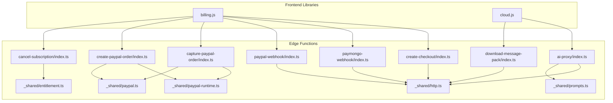
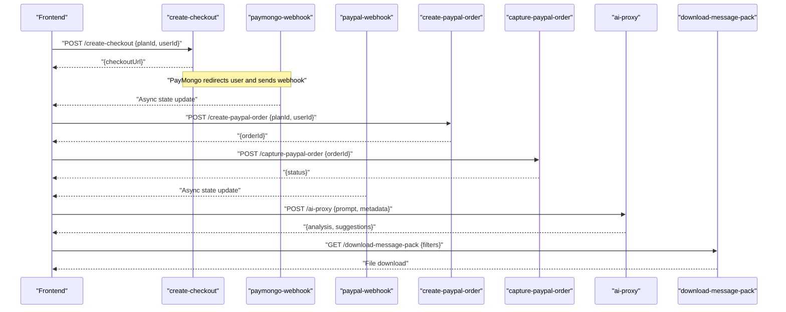
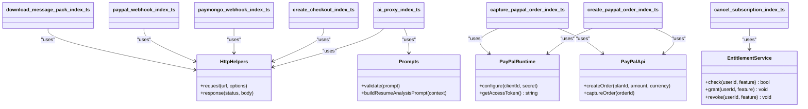

# Edge Functions

<cite>
**Referenced Files in This Document**
- [ai-proxy/index.ts](file://supabase/functions/ai-proxy/index.ts)
- [create-checkout/index.ts](file://supabase/functions/create-checkout/index.ts)
- [paymongo-webhook/index.ts](file://supabase/functions/paymongo-webhook/index.ts)
- [paypal-webhook/index.ts](file://supabase/functions/paypal-webhook/index.ts)
- [capture-paypal-order/index.ts](file://supabase/functions/capture-paypal-order/index.ts)
- [create-paypal-order/index.ts](file://supabase/functions/create-paypal-order/index.ts)
- [cancel-subscription/index.ts](file://supabase/functions/cancel-subscription/index.ts)
- [download-message-pack/index.ts](file://supabase/functions/download-message-pack/index.ts)
- [_shared/http.ts](file://supabase/functions/_shared/http.ts)
- [_shared/entitlement.ts](file://supabase/functions/_shared/entitlement.ts)
- [_shared/paypal-runtime.ts](file://supabase/functions/_shared/paypal-runtime.ts)
- [_shared/paypal.ts](file://supabase/functions/_shared/paypal.ts)
- [_shared/prompts.ts](file://supabase/functions/_shared/prompts.ts)
- [functions config.toml](file://supabase/config.toml)
- [billing.js](file://src/lib/billing.js)
- [cloud.js](file://src/lib/cloud.js)
</cite>

## Table of Contents
1. [Introduction](#introduction)
2. [Project Structure](#project-structure)
3. [Core Components](#core-components)
4. [Architecture Overview](#architecture-overview)
5. [Detailed Component Analysis](#detailed-component-analysis)
6. [Dependency Analysis](#dependency-analysis)
7. [Performance Considerations](#performance-considerations)
8. [Troubleshooting Guide](#troubleshooting-guide)
9. [Conclusion](#conclusion)
10. [Appendices](#appendices)

## Introduction
This document describes the Supabase Edge Functions for ApplyGuard PH, focusing on:
- AI proxy for resume analysis and interview coaching
- Billing functions for PayMongo and PayPal integrations
- Webhook handlers for payment processing
- Utility function for data export
It also covers authentication requirements, request/response formats, error handling patterns, security considerations, rate limiting, performance optimization, and frontend integration examples.

## Project Structure
The Edge Functions are organized by feature under supabase/functions, with shared utilities under _shared. The configuration is defined in supabase/config.toml. Frontend libraries for calling these functions live in src/lib.

**Diagram sources**
- [ai-proxy/index.ts](file://supabase/functions/ai-proxy/index.ts)
- [create-checkout/index.ts](file://supabase/functions/create-checkout/index.ts)
- [paymongo-webhook/index.ts](file://supabase/functions/paymongo-webhook/index.ts)
- [paypal-webhook/index.ts](file://supabase/functions/paypal-webhook/index.ts)
- [capture-paypal-order/index.ts](file://supabase/functions/capture-paypal-order/index.ts)
- [create-paypal-order/index.ts](file://supabase/functions/create-paypal-order/index.ts)
- [cancel-subscription/index.ts](file://supabase/functions/cancel-subscription/index.ts)
- [download-message-pack/index.ts](file://supabase/functions/download-message-pack/index.ts)
- [_shared/http.ts](file://supabase/functions/_shared/http.ts)
- [_shared/entitlement.ts](file://supabase/functions/_shared/entitlement.ts)
- [_shared/paypal-runtime.ts](file://supabase/functions/_shared/paypal-runtime.ts)
- [_shared/paypal.ts](file://supabase/functions/_shared/paypal.ts)
- [_shared/prompts.ts](file://supabase/functions/_shared/prompts.ts)
- [billing.js](file://src/lib/billing.js)
- [cloud.js](file://src/lib/cloud.js)

**Section sources**
- [functions config.toml](file://supabase/config.toml)
- [billing.js](file://src/lib/billing.js)
- [cloud.js](file://src/lib/cloud.js)

## Core Components
- AI Proxy: Proxies requests to an external AI service for resume analysis and interview coaching. It validates inputs, enforces entitlements, and returns structured results.
- Checkout Creation: Creates a checkout session via PayMongo and returns a redirect URL or client-side token.
- PayMongo Webhook: Verifies webhook signatures, updates subscription status, and records fulfillment events.
- PayPal Webhooks: Handles order capture and subscription lifecycle events; fulfills entitlements accordingly.
- PayPal Order Management: Creates and captures PayPal orders, coordinating with billing state.
- Subscription Cancellation: Cancels subscriptions through provider APIs and updates local state.
- Data Export: Generates downloadable exports (e.g., message pack) for user data.

Authentication and Authorization
- Protected endpoints require a valid Supabase session token passed as a header.
- Entitlement checks gate access to premium features (e.g., AI usage).
- Webhook endpoints validate provider signatures and enforce idempotency.

Request/Response Patterns
- JSON payloads for most endpoints.
- Redirect URLs returned for checkout flows.
- Webhooks receive provider-specific payloads and return HTTP 2xx upon success.

Security Considerations
- Validate and sanitize all inputs.
- Verify webhook signatures before processing.
- Use environment variables for secrets.
- Enforce least privilege when accessing databases or storage.

Rate Limiting and Performance
- Implement per-user and global rate limits at the function level.
- Cache expensive computations where appropriate.
- Stream large responses when possible.

Error Handling
- Return consistent error shapes with codes and messages.
- Log errors with correlation IDs.
- Avoid leaking sensitive details in responses.

**Section sources**
- [ai-proxy/index.ts](file://supabase/functions/ai-proxy/index.ts)
- [create-checkout/index.ts](file://supabase/functions/create-checkout/index.ts)
- [paymongo-webhook/index.ts](file://supabase/functions/paymongo-webhook/index.ts)
- [paypal-webhook/index.ts](file://supabase/functions/paypal-webhook/index.ts)
- [capture-paypal-order/index.ts](file://supabase/functions/capture-paypal-order/index.ts)
- [create-paypal-order/index.ts](file://supabase/functions/create-paypal-order/index.ts)
- [cancel-subscription/index.ts](file://supabase/functions/cancel-subscription/index.ts)
- [download-message-pack/index.ts](file://supabase/functions/download-message-pack/index.ts)
- [_shared/entitlement.ts](file://supabase/functions/_shared/entitlement.ts)
- [_shared/http.ts](file://supabase/functions/_shared/http.ts)

## Architecture Overview
High-level flow across components:
- Frontend calls create-checkout to initiate PayMongo checkout.
- Provider webhooks notify paymongo-webhook and paypal-webhook to update state.
- PayPal order creation and capture are handled by dedicated functions.
- AI proxy routes prompts to the AI backend after entitlement validation.
- Data export utility generates downloadable artifacts.

**Diagram sources**
- [create-checkout/index.ts](file://supabase/functions/create-checkout/index.ts)
- [paymongo-webhook/index.ts](file://supabase/functions/paymongo-webhook/index.ts)
- [paypal-webhook/index.ts](file://supabase/functions/paypal-webhook/index.ts)
- [create-paypal-order/index.ts](file://supabase/functions/create-paypal-order/index.ts)
- [capture-paypal-order/index.ts](file://supabase/functions/capture-paypal-order/index.ts)
- [ai-proxy/index.ts](file://supabase/functions/ai-proxy/index.ts)
- [download-message-pack/index.ts](file://supabase/functions/download-message-pack/index.ts)

## Detailed Component Analysis

### AI Proxy
Purpose
- Validates user entitlements and forwards prompts to the AI backend for resume analysis and interview coaching.
- Returns structured results including scores, feedback, and suggested improvements.

Endpoints
- POST /ai-proxy

Request
- Headers: Authorization (Bearer token), Content-Type: application/json
- Body fields: prompt, context (optional), model (optional)

Response
- Success: { result, tokens_used, plan }
- Error: { code, message }

Authentication
- Requires a valid Supabase session token.

Security
- Input validation and length limits.
- Prompt sanitization.
- Rate limiting per user.

Performance
- Streaming responses for long outputs.
- Caching repeated prompts if applicable.

Frontend Example
- See [cloud.js](file://src/lib/cloud.js) for how to call the AI proxy from the frontend.

**Section sources**
- [ai-proxy/index.ts](file://supabase/functions/ai-proxy/index.ts)
- [_shared/prompts.ts](file://supabase/functions/_shared/prompts.ts)
- [cloud.js](file://src/lib/cloud.js)

### Create Checkout (PayMongo)
Purpose
- Initiates a PayMongo checkout session for a selected plan.

Endpoints
- POST /create-checkout

Request
- Headers: Authorization (Bearer token), Content-Type: application/json
- Body fields: planId, userId, returnUrl (optional)

Response
- Success: { checkoutUrl }
- Error: { code, message }

Authentication
- Requires a valid Supabase session token.

Security
- Validate planId against allowed plans.
- Ensure userId matches authenticated user.

Frontend Example
- See [billing.js](file://src/lib/billing.js) for creating checkouts and handling redirects.

**Section sources**
- [create-checkout/index.ts](file://supabase/functions/create-checkout/index.ts)
- [billing.js](file://src/lib/billing.js)

### PayMongo Webhook
Purpose
- Receives PayMongo events, verifies signatures, and updates subscription status and entitlements.

Endpoints
- POST /paymongo-webhook

Request
- Headers: X-PayMongo-Signature
- Body: PayMongo event payload

Response
- Success: HTTP 200
- Failure: HTTP 400/500 with error details

Security
- Signature verification.
- Idempotency checks using event IDs.

Processing Logic
- Map events to subscription states.
- Record fulfillment events.
- Update entitlements.

Frontend Impact
- No direct call; state changes propagate to the UI.

**Section sources**
- [paymongo-webhook/index.ts](file://supabase/functions/paymongo-webhook/index.ts)
- [_shared/http.ts](file://supabase/functions/_shared/http.ts)

### PayPal Webhook
Purpose
- Processes PayPal order and subscription events, fulfilling entitlements and updating state.

Endpoints
- POST /paypal-webhook

Request
- Headers: Authorization (Bearer token for internal verification if required), Content-Type: application/json
- Body: PayPal event payload

Response
- Success: HTTP 200
- Failure: HTTP 400/500 with error details

Security
- Verify webhook signature and event type.
- Idempotency checks.

Processing Logic
- Handle order capture and subscription lifecycle events.
- Fulfill entitlements based on successful payments.

**Section sources**
- [paypal-webhook/index.ts](file://supabase/functions/paypal-webhook/index.ts)
- [_shared/http.ts](file://supabase/functions/_shared/http.ts)

### Create PayPal Order
Purpose
- Creates a PayPal order for a selected plan.

Endpoints
- POST /create-paypal-order

Request
- Headers: Authorization (Bearer token), Content-Type: application/json
- Body fields: planId, userId, currency (optional)

Response
- Success: { orderId }
- Error: { code, message }

Authentication
- Requires a valid Supabase session token.

Security
- Validate planId and currency.
- Ensure userId matches authenticated user.

Frontend Example
- See [billing.js](file://src/lib/billing.js) for order creation flow.

**Section sources**
- [create-paypal-order/index.ts](file://supabase/functions/create-paypal-order/index.ts)
- [_shared/paypal-runtime.ts](file://supabase/functions/_shared/paypal-runtime.ts)
- [_shared/paypal.ts](file://supabase/functions/_shared/paypal.ts)
- [billing.js](file://src/lib/billing.js)

### Capture PayPal Order
Purpose
- Captures a previously created PayPal order and finalizes payment.

Endpoints
- POST /capture-paypal-order

Request
- Headers: Authorization (Bearer token), Content-Type: application/json
- Body fields: orderId

Response
- Success: { status }
- Error: { code, message }

Authentication
- Requires a valid Supabase session token.

Security
- Validate orderId ownership.
- Prevent duplicate captures.

Frontend Example
- See [billing.js](file://src/lib/billing.js) for capturing orders.

**Section sources**
- [capture-paypal-order/index.ts](file://supabase/functions/capture-paypal-order/index.ts)
- [_shared/paypal-runtime.ts](file://supabase/functions/_shared/paypal-runtime.ts)
- [_shared/paypal.ts](file://supabase/functions/_shared/paypal.ts)
- [billing.js](file://src/lib/billing.js)

### Cancel Subscription
Purpose
- Cancels a subscription via provider APIs and updates local state.

Endpoints
- POST /cancel-subscription

Request
- Headers: Authorization (Bearer token), Content-Type: application/json
- Body fields: subscriptionId, reason (optional)

Response
- Success: { canceled }
- Error: { code, message }

Authentication
- Requires a valid Supabase session token.

Security
- Validate subscriptionId ownership.
- Ensure cancellation policy compliance.

**Section sources**
- [cancel-subscription/index.ts](file://supabase/functions/cancel-subscription/index.ts)
- [_shared/entitlement.ts](file://supabase/functions/_shared/entitlement.ts)

### Download Message Pack
Purpose
- Exports user data as a downloadable message pack file.

Endpoints
- GET /download-message-pack

Request
- Headers: Authorization (Bearer token)
- Query parameters: filters (optional)

Response
- Success: File download stream
- Error: { code, message }

Authentication
- Requires a valid Supabase session token.

Security
- Validate filters to prevent excessive queries.
- Respect user data permissions.

Frontend Example
- See [cloud.js](file://src/lib/cloud.js) for initiating downloads.

**Section sources**
- [download-message-pack/index.ts](file://supabase/functions/download-message-pack/index.ts)
- [cloud.js](file://src/lib/cloud.js)

## Dependency Analysis
Shared utilities provide common functionality across functions:
- http.ts: Standardized HTTP helpers for requests and responses.
- entitlement.ts: Entitlement checks and management.
- paypal-runtime.ts and paypal.ts: PayPal SDK wrappers and runtime configuration.
- prompts.ts: Shared prompt templates and validation.

**Diagram sources**
- [_shared/http.ts](file://supabase/functions/_shared/http.ts)
- [_shared/entitlement.ts](file://supabase/functions/_shared/entitlement.ts)
- [_shared/paypal-runtime.ts](file://supabase/functions/_shared/paypal-runtime.ts)
- [_shared/paypal.ts](file://supabase/functions/_shared/paypal.ts)
- [_shared/prompts.ts](file://supabase/functions/_shared/prompts.ts)
- [ai-proxy/index.ts](file://supabase/functions/ai-proxy/index.ts)
- [create-checkout/index.ts](file://supabase/functions/create-checkout/index.ts)
- [paymongo-webhook/index.ts](file://supabase/functions/paymongo-webhook/index.ts)
- [paypal-webhook/index.ts](file://supabase/functions/paypal-webhook/index.ts)
- [create-paypal-order/index.ts](file://supabase/functions/create-paypal-order/index.ts)
- [capture-paypal-order/index.ts](file://supabase/functions/capture-paypal-order/index.ts)
- [cancel-subscription/index.ts](file://supabase/functions/cancel-subscription/index.ts)
- [download-message-pack/index.ts](file://supabase/functions/download-message-pack/index.ts)

**Section sources**
- [_shared/http.ts](file://supabase/functions/_shared/http.ts)
- [_shared/entitlement.ts](file://supabase/functions/_shared/entitlement.ts)
- [_shared/paypal-runtime.ts](file://supabase/functions/_shared/paypal-runtime.ts)
- [_shared/paypal.ts](file://supabase/functions/_shared/paypal.ts)
- [_shared/prompts.ts](file://supabase/functions/_shared/prompts.ts)

## Performance Considerations
- Minimize cold starts by keeping dependencies lean.
- Use streaming for large exports and AI responses.
- Cache frequently accessed configuration and prompts.
- Batch database operations where possible.
- Implement retry logic with exponential backoff for external API calls.

[No sources needed since this section provides general guidance]

## Troubleshooting Guide
Common Issues
- Authentication failures: Ensure Authorization header contains a valid Supabase token.
- Webhook signature mismatches: Verify provider signatures and environment variables.
- Duplicate webhook processing: Confirm idempotency keys are used and checked.
- Rate limit exceeded: Check per-user quotas and adjust thresholds.

Debugging Tips
- Enable detailed logging with correlation IDs.
- Inspect request payloads and response bodies.
- Validate environment variables for provider credentials.

**Section sources**
- [_shared/http.ts](file://supabase/functions/_shared/http.ts)
- [paymongo-webhook/index.ts](file://supabase/functions/paymongo-webhook/index.ts)
- [paypal-webhook/index.ts](file://supabase/functions/paypal-webhook/index.ts)

## Conclusion
ApplyGuard PH’s Edge Functions provide a secure, scalable foundation for AI-powered resume analysis and interview coaching, robust billing integrations with PayMongo and PayPal, and reliable data export capabilities. By following the authentication, security, and performance guidelines outlined here, developers can integrate these functions confidently into the frontend and maintain high reliability and user experience.

[No sources needed since this section summarizes without analyzing specific files]

## Appendices

### Frontend Integration Examples
- Calling AI Proxy: Refer to [cloud.js](file://src/lib/cloud.js) for example usage.
- Creating PayMongo Checkout: Refer to [billing.js](file://src/lib/billing.js) for checkout initiation and redirect handling.
- Managing PayPal Orders: Refer to [billing.js](file://src/lib/billing.js) for order creation and capture flows.
- Downloading Data: Refer to [cloud.js](file://src/lib/cloud.js) for initiating downloads.

**Section sources**
- [cloud.js](file://src/lib/cloud.js)
- [billing.js](file://src/lib/billing.js)