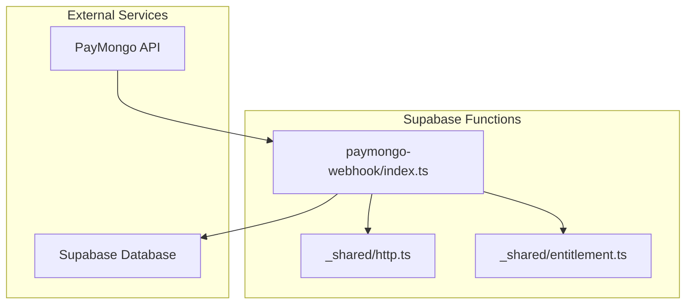
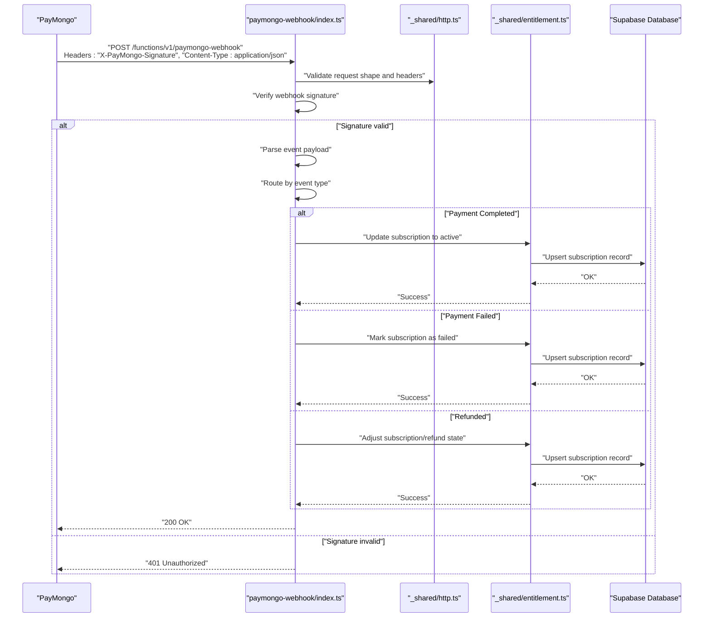
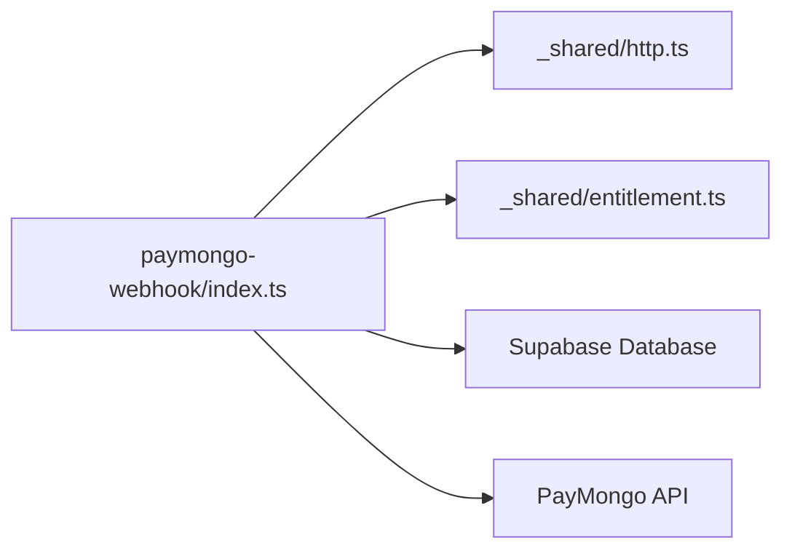

# PayMongo Webhook Handler

<cite>
**Referenced Files in This Document**
- [index.ts](file://supabase/functions/paymongo-webhook/index.ts)
- [http.ts](file://supabase/functions/_shared/http.ts)
- [entitlement.ts](file://supabase/functions/_shared/entitlement.ts)
- [003-subscriptions-paymongo.md](file://docs/superpowers/plans/monetization/03-subscriptions-paymongo.md)
</cite>

## Table of Contents
1. [Introduction](#introduction)
2. [Project Structure](#project-structure)
3. [Core Components](#core-components)
4. [Architecture Overview](#architecture-overview)
5. [Detailed Component Analysis](#detailed-component-analysis)
6. [Dependency Analysis](#dependency-analysis)
7. [Performance Considerations](#performance-considerations)
8. [Troubleshooting Guide](#troubleshooting-guide)
9. [Conclusion](#conclusion)
10. [Appendices](#appendices)

## Introduction
This document provides comprehensive documentation for the PayMongo webhook handler responsible for receiving and processing payment events from PayMongo. It covers the webhook endpoint, supported event types (payment completed, failed, refunded), request validation using webhook signatures, event processing logic, subscription status updates in the database, duplicate handling, retry mechanisms, payload examples, error handling strategies, debugging techniques, and security considerations including IP whitelisting and signature verification.

## Project Structure
The PayMongo webhook handler is implemented as a Supabase Edge Function under supabase/functions/paymongo-webhook/index.ts. Shared utilities for HTTP handling and entitlements are located under supabase/functions/_shared/. The monetization plan documents provide additional context on subscription flows and integration points.

**Diagram sources**
- [index.ts](file://supabase/functions/paymongo-webhook/index.ts)
- [http.ts](file://supabase/functions/_shared/http.ts)
- [entitlement.ts](file://supabase/functions/_shared/entitlement.ts)

**Section sources**
- [index.ts](file://supabase/functions/paymongo-webhook/index.ts)
- [http.ts](file://supabase/functions/_shared/http.ts)
- [entitlement.ts](file://supabase/functions/_shared/entitlement.ts)
- [003-subscriptions-paymongo.md](file://docs/superpowers/plans/monetization/03-subscriptions-paymongo.md)

## Core Components
- Webhook Endpoint: Receives POST requests from PayMongo with signed payloads.
- Signature Verification: Validates the webhook signature to ensure authenticity.
- Event Routing: Dispatches events based on type (e.g., payment completed, failed, refunded).
- Subscription Updates: Persists state changes to the database via shared entitlement utilities.
- Idempotency and Deduplication: Prevents reprocessing of duplicate webhooks.
- Retry Strategy: Implements retries for transient failures during processing.

Key responsibilities:
- Parse and validate incoming requests.
- Verify webhook signature securely.
- Normalize event data into internal representations.
- Update subscription status deterministically.
- Ensure idempotent operations.
- Log actionable diagnostics for troubleshooting.

**Section sources**
- [index.ts](file://supabase/functions/paymongo-webhook/index.ts)
- [http.ts](file://supabase/functions/_shared/http.ts)
- [entitlement.ts](file://supabase/functions/_shared/entitlement.ts)

## Architecture Overview
The webhook handler follows a layered approach:
- Ingress layer validates HTTP method and content type.
- Security layer verifies the PayMongo signature using configured secrets.
- Processing layer routes events by type and applies business rules.
- Persistence layer updates subscription records and related entities.
- Observability layer logs structured events and errors.

**Diagram sources**
- [index.ts](file://supabase/functions/paymongo-webhook/index.ts)
- [http.ts](file://supabase/functions/_shared/http.ts)
- [entitlement.ts](file://supabase/functions/_shared/entitlement.ts)

## Detailed Component Analysis

### Webhook Endpoint and Request Validation
- Accepts only POST requests with JSON payloads.
- Requires specific headers for signature verification.
- Returns appropriate HTTP status codes for malformed or unauthorized requests.

Validation steps:
- Check HTTP method and content type.
- Extract signature header and payload body.
- Compute expected signature using shared HTTP utilities and secret configuration.
- Compare signatures securely.

Security considerations:
- Use environment variables for secrets; never hardcode.
- Reject requests without required headers.
- Return minimal information on failure to avoid leaking internals.

**Section sources**
- [index.ts](file://supabase/functions/paymongo-webhook/index.ts)
- [http.ts](file://supabase/functions/_shared/http.ts)

### Supported Event Types
- Payment Completed: Transition subscription to active and grant entitlements.
- Payment Failed: Mark subscription as failed and optionally notify users.
- Refunded: Adjust subscription state and handle refund-related side effects.

Processing logic:
- Map external event fields to internal models.
- Apply deterministic state transitions.
- Record audit entries for traceability.

Idempotency:
- Use event IDs to detect duplicates.
- Skip processing if already handled.
- Maintain a deduplication store or rely on database constraints.

**Section sources**
- [index.ts](file://supabase/functions/paymongo-webhook/index.ts)
- [entitlement.ts](file://supabase/functions/_shared/entitlement.ts)

### Subscription Status Updates
- Uses shared entitlement utilities to update subscription records.
- Ensures atomic updates with consistent state transitions.
- Handles edge cases such as concurrent updates and partial failures.

Database interactions:
- Upsert subscription rows with new status and timestamps.
- Enforce constraints to prevent inconsistent states.
- Optionally log change history for auditing.

**Section sources**
- [entitlement.ts](file://supabase/functions/_shared/entitlement.ts)
- [index.ts](file://supabase/functions/paymongo-webhook/index.ts)

### Duplicate Handling and Retry Mechanisms
Duplicate handling:
- Track processed event IDs to avoid reprocessing.
- Leverage database unique constraints for robustness.
- Return success immediately for known duplicates.

Retry strategy:
- Implement exponential backoff for transient errors (network timeouts, database locks).
- Limit maximum retries to prevent infinite loops.
- Queue failed events for later processing if necessary.

Operational notes:
- Distinguish between retriable and non-retriable errors.
- Surface actionable errors to observability systems.
- Avoid retrying on invalid signatures or malformed payloads.

**Section sources**
- [index.ts](file://supabase/functions/paymongo-webhook/index.ts)

### Payload Examples
Below are conceptual examples of webhook payloads for each event type. Replace placeholders with actual values when testing.

- Payment Completed
  - Fields: event_id, event_type, payment_id, amount, currency, customer_id, metadata.subscription_id, status
  - Example structure:
    {
      "event_id": "evt_abc123",
      "event_type": "payment.completed",
      "payment_id": "pay_xyz789",
      "amount": 1000,
      "currency": "PHP",
      "customer_id": "cus_def456",
      "metadata": {
        "subscription_id": "sub_ghi012"
      },
      "status": "completed"
    }

- Payment Failed
  - Fields: event_id, event_type, payment_id, amount, currency, customer_id, metadata.subscription_id, status, error_code
  - Example structure:
    {
      "event_id": "evt_jkl345",
      "event_type": "payment.failed",
      "payment_id": "pay_mno678",
      "amount": 1000,
      "currency": "PHP",
      "customer_id": "cus_def456",
      "metadata": {
        "subscription_id": "sub_ghi012"
      },
      "status": "failed",
      "error_code": "insufficient_funds"
    }

- Refunded
  - Fields: event_id, event_type, payment_id, amount, currency, customer_id, metadata.subscription_id, status, refund_id
  - Example structure:
    {
      "event_id": "evt_pqr901",
      "event_type": "payment.refunded",
      "payment_id": "pay_xyz789",
      "amount": 1000,
      "currency": "PHP",
      "customer_id": "cus_def456",
      "metadata": {
        "subscription_id": "sub_ghi012"
      },
      "status": "refunded",
      "refund_id": "rfn_s234t5"
    }

Note: These examples illustrate typical fields used to identify and process events. Adapt to your schema and metadata conventions.

[No sources needed since this section provides conceptual payload examples]

### Error Handling Strategies
- Signature mismatch: Return 401 Unauthorized and log details.
- Malformed payload: Return 400 Bad Request and log parsing errors.
- Unknown event type: Return 200 OK with no-op processing and log warning.
- Transient failures: Retry with backoff and log retry attempts.
- Permanent failures: Record error state and alert operators.

Best practices:
- Include correlation IDs for tracing across services.
- Avoid exposing sensitive details in responses.
- Aggregate metrics for error rates and latency.

**Section sources**
- [index.ts](file://supabase/functions/paymongo-webhook/index.ts)

### Debugging Techniques
- Enable structured logging with event_id, payment_id, and subscription_id.
- Inspect raw payloads in safe environments for reproduction.
- Validate signature computation locally using test keys.
- Monitor database updates and transaction outcomes.
- Use feature flags to toggle verbose logging in staging.

Common pitfalls:
- Time skew causing signature verification issues.
- Incorrect secret configuration.
- Missing headers or wrong content type.
- Race conditions leading to duplicate processing.

**Section sources**
- [index.ts](file://supabase/functions/paymongo-webhook/index.ts)

### Security Considerations
IP Whitelisting:
- If enforced at the platform level, restrict inbound traffic to PayMongo IPs.
- Combine with signature verification for defense-in-depth.

Signature Verification:
- Always verify the X-PayMongo-Signature header against the payload using the configured secret.
- Use constant-time comparison to prevent timing attacks.
- Reject requests lacking required headers.

Secret Management:
- Store secrets in environment variables managed by the hosting platform.
- Rotate secrets periodically and invalidate old ones safely.

Data Minimization:
- Log only necessary fields; redact sensitive data.
- Avoid storing full payloads beyond what is required for auditing.

**Section sources**
- [index.ts](file://supabase/functions/paymongo-webhook/index.ts)
- [http.ts](file://supabase/functions/_shared/http.ts)

## Dependency Analysis
The webhook handler depends on shared utilities for HTTP handling and entitlement management. External dependencies include PayMongo’s API and the Supabase database.

**Diagram sources**
- [index.ts](file://supabase/functions/paymongo-webhook/index.ts)
- [http.ts](file://supabase/functions/_shared/http.ts)
- [entitlement.ts](file://supabase/functions/_shared/entitlement.ts)

**Section sources**
- [index.ts](file://supabase/functions/paymongo-webhook/index.ts)
- [http.ts](file://supabase/functions/_shared/http.ts)
- [entitlement.ts](file://supabase/functions/_shared/entitlement.ts)

## Performance Considerations
- Keep processing lightweight; offload heavy tasks to background jobs if needed.
- Use database indexes on frequently queried fields (e.g., subscription_id, event_id).
- Batch updates where possible to reduce round trips.
- Cache static configuration to minimize overhead.
- Monitor latency and throughput; set alerts for anomalies.

[No sources needed since this section provides general guidance]

## Troubleshooting Guide
Symptoms and resolutions:
- 401 Unauthorized on webhook calls:
  - Verify signature header presence and correctness.
  - Confirm secret configuration matches PayMongo settings.
- 400 Bad Request:
  - Check content type and payload structure.
  - Validate required fields and formats.
- No subscription updates:
  - Inspect event routing and mapping logic.
  - Review database constraints and transaction outcomes.
- Duplicate processing:
  - Ensure event_id deduplication is enforced.
  - Check for race conditions and implement locking if necessary.
- Retries not working:
  - Validate backoff configuration and retry limits.
  - Differentiate between retriable and non-retriable errors.

Operational tips:
- Correlate logs using event_id and payment_id.
- Reproduce issues with test payloads in staging.
- Alert on elevated error rates and slow response times.

**Section sources**
- [index.ts](file://supabase/functions/paymongo-webhook/index.ts)

## Conclusion
The PayMongo webhook handler provides a secure, reliable, and extensible mechanism for processing payment events. By enforcing strict request validation, verifying signatures, implementing idempotent processing, and updating subscription statuses deterministically, it ensures consistency and resilience. Adhering to the recommended security practices, performance optimizations, and troubleshooting strategies will help maintain a robust integration.

[No sources needed since this section summarizes without analyzing specific files]

## Appendices

### Configuration Checklist
- Environment variables for secrets and endpoints.
- Feature flags for logging verbosity.
- Retry parameters (max attempts, backoff multiplier).
- Monitoring and alerting thresholds.

### References
- Monetization plan for subscriptions and PayMongo integration.

**Section sources**
- [003-subscriptions-paymongo.md](file://docs/superpowers/plans/monetization/03-subscriptions-paymongo.md)