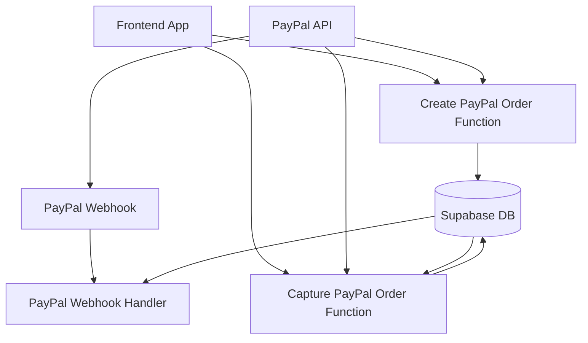
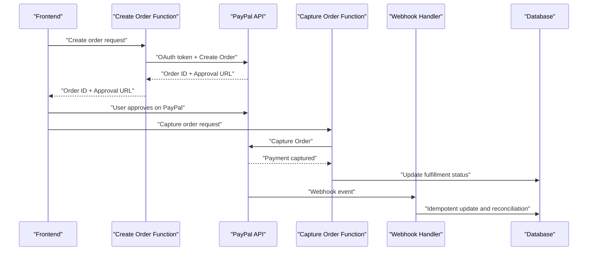
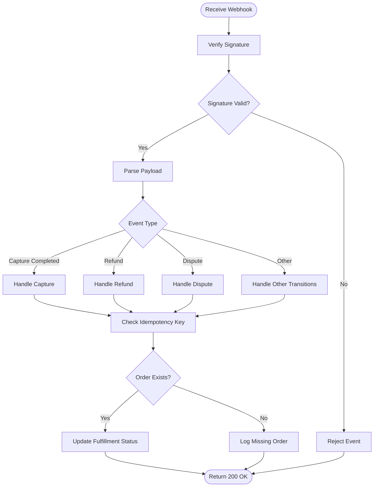
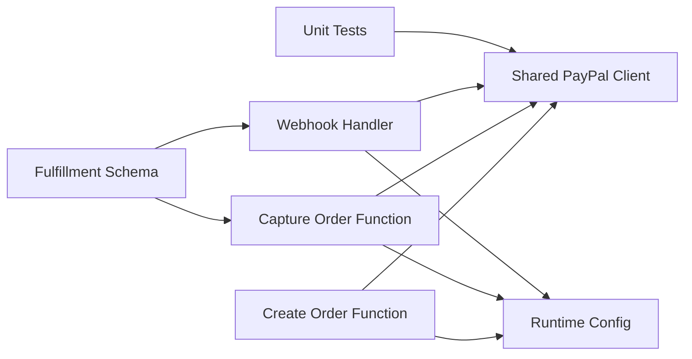

# PayPal Integration Functions

<cite>
**Referenced Files in This Document**
- [create-paypal-order/index.ts](file://supabase/functions/create-paypal-order/index.ts)
- [capture-paypal-order/index.ts](file://supabase/functions/capture-paypal-order/index.ts)
- [paypal-webhook/index.ts](file://supabase/functions/paypal-webhook/index.ts)
- [paypal.ts](file://supabase/functions/_shared/paypal.ts)
- [paypal-runtime.ts](file://supabase/functions/_shared/paypal-runtime.ts)
- [paypal.test.ts](file://supabase/functions/_shared/paypal.test.ts)
- [002_paypal_fulfillment.sql](file://supabase/migrations/002_paypal_fulfillment.sql)
</cite>

## Table of Contents
1. [Introduction](#introduction)
2. [Project Structure](#project-structure)
3. [Core Components](#core-components)
4. [Architecture Overview](#architecture-overview)
5. [Detailed Component Analysis](#detailed-component-analysis)
6. [Dependency Analysis](#dependency-analysis)
7. [Performance Considerations](#performance-considerations)
8. [Troubleshooting Guide](#troubleshooting-guide)
9. [Conclusion](#conclusion)

## Introduction
This document explains the PayPal-specific integration functions used to initiate transactions, complete payments, and process events from PayPal. It covers:
- Creating a PayPal order from the frontend via a serverless function
- Capturing an approved order to finalize payment
- Handling PayPal webhooks for post-payment events (e.g., completed payments, refunds, disputes)
- OAuth authentication flow with PayPal
- Order management lifecycle and state reconciliation
- Webhook event types and payload validation
- Security measures including signature verification and idempotency

## Project Structure
The PayPal integration is implemented as Supabase Edge Functions and shared utilities:
- create-paypal-order: Creates a PayPal order on behalf of the client
- capture-paypal-order: Captures an approved PayPal order
- paypal-webhook: Processes incoming PayPal webhook events
- _shared/paypal.ts and _shared/paypal-runtime.ts: Shared PayPal client logic and runtime configuration
- supabase/migrations/002_paypal_fulfillment.sql: Database schema for tracking fulfillment and order state

**Diagram sources**
- [create-paypal-order/index.ts](file://supabase/functions/create-paypal-order/index.ts)
- [capture-paypal-order/index.ts](file://supabase/functions/capture-paypal-order/index.ts)
- [paypal-webhook/index.ts](file://supabase/functions/paypal-webhook/index.ts)
- [002_paypal_fulfillment.sql](file://supabase/migrations/002_paypal_fulfillment.sql)

**Section sources**
- [create-paypal-order/index.ts](file://supabase/functions/create-paypal-order/index.ts)
- [capture-paypal-order/index.ts](file://supabase/functions/capture-paypal-order/index.ts)
- [paypal-webhook/index.ts](file://supabase/functions/paypal-webhook/index.ts)
- [paypal.ts](file://supabase/functions/_shared/paypal.ts)
- [paypal-runtime.ts](file://supabase/functions/_shared/paypal-runtime.ts)
- [002_paypal_fulfillment.sql](file://supabase/migrations/002_paypal_fulfillment.sql)

## Core Components
- Create PayPal Order Function: Accepts client request, authenticates with PayPal using OAuth, creates an order, persists order metadata, and returns the order ID and approval URL to the frontend.
- Capture PayPal Order Function: Validates that the order exists and is approved, calls PayPal to capture the order, updates fulfillment status, and returns confirmation.
- PayPal Webhook Handler: Receives PayPal events, validates signatures, normalizes payloads, performs idempotent processing, and reconciles order state in the database.
- Shared PayPal Client: Encapsulates OAuth token retrieval, HTTP calls to PayPal, error mapping, and retry/backoff strategies.
- Runtime Configuration: Loads environment variables such as client ID, secret, and webhook secrets; configures base URLs for sandbox vs production.

Key responsibilities and interactions are detailed in the following sections.

**Section sources**
- [create-paypal-order/index.ts](file://supabase/functions/create-paypal-order/index.ts)
- [capture-paypal-order/index.ts](file://supabase/functions/capture-paypal-order/index.ts)
- [paypal-webhook/index.ts](file://supabase/functions/paypal-webhook/index.ts)
- [paypal.ts](file://supabase/functions/_shared/paypal.ts)
- [paypal-runtime.ts](file://supabase/functions/_shared/paypal-runtime.ts)

## Architecture Overview
The system follows a standard e-commerce payment flow:
- Frontend initiates checkout by calling the create order function.
- Frontend redirects the user to PayPal for approval.
- After approval, the frontend calls the capture order function.
- PayPal sends asynchronous webhook events for post-capture lifecycle changes.
- The webhook handler updates internal records and triggers fulfillment.

**Diagram sources**
- [create-paypal-order/index.ts](file://supabase/functions/create-paypal-order/index.ts)
- [capture-paypal-order/index.ts](file://supabase/functions/capture-paypal-order/index.ts)
- [paypal-webhook/index.ts](file://supabase/functions/paypal-webhook/index.ts)
- [002_paypal_fulfillment.sql](file://supabase/migrations/002_paypal_fulfillment.sql)

## Detailed Component Analysis

### Create PayPal Order Function
Purpose:
- Authenticate with PayPal using OAuth client credentials.
- Create a PayPal order with intent and purchase units.
- Persist order metadata (order ID, amount, currency, status).
- Return the order ID and approval URL to the frontend.

Key behaviors:
- Uses shared PayPal client for OAuth and HTTP requests.
- Validates input parameters (amount, currency, items).
- Stores order state to enable later capture and reconciliation.
- Returns structured response suitable for frontend redirect.

Frontend example usage:
- Call the create order endpoint with cart details.
- Use the returned approval URL to redirect the buyer to PayPal.
- On return, call the capture order endpoint with the order ID.

Security considerations:
- Server-side only creation of orders; never expose secrets to the client.
- Validate amounts and currencies server-side.

**Section sources**
- [create-paypal-order/index.ts](file://supabase/functions/create-paypal-order/index.ts)
- [paypal.ts](file://supabase/functions/_shared/paypal.ts)
- [paypal-runtime.ts](file://supabase/functions/_shared/paypal-runtime.ts)

### Capture PayPal Order Function
Purpose:
- Verify that the order exists and is approved.
- Request PayPal to capture the order.
- Update fulfillment status in the database.
- Return success or error to the frontend.

Key behaviors:
- Checks order state before capture to prevent double-capture.
- Calls PayPal capture API using shared client.
- Persists capture result and timestamps.
- Handles partial captures or errors gracefully.

Frontend example usage:
- After successful PayPal approval, call the capture endpoint with the order ID.
- Display confirmation and proceed with fulfillment.

Security considerations:
- Ensure the caller is authorized to capture the specific order.
- Idempotently handle retries from the client.

**Section sources**
- [capture-paypal-order/index.ts](file://supabase/functions/capture-paypal-order/index.ts)
- [paypal.ts](file://supabase/functions/_shared/paypal.ts)
- [002_paypal_fulfillment.sql](file://supabase/migrations/002_paypal_fulfillment.sql)

### PayPal Webhook Handler
Purpose:
- Receive and validate PayPal webhook events.
- Normalize payloads and route to handlers based on event type.
- Perform idempotent processing using event IDs.
- Reconcile order state and trigger fulfillment actions.

Supported event types:
- Payment completion (e.g., capture completed)
- Refund events (partial/full)
- Dispute events (opened, resolved, lost/won)
- Order state transitions (approved, voided, expired)

Payload validation:
- Verify webhook signature using provided headers and secret.
- Parse and validate JSON payload structure.
- Reject malformed or unverified events.

Processing logic:
- Lookup order by PayPal order ID.
- Apply idempotency key (event ID) to avoid duplicate processing.
- Update fulfillment status and audit logs.
- Trigger downstream actions (e.g., grant entitlements, send notifications).

**Diagram sources**
- [paypal-webhook/index.ts](file://supabase/functions/paypal-webhook/index.ts)
- [paypal.ts](file://supabase/functions/_shared/paypal.ts)

**Section sources**
- [paypal-webhook/index.ts](file://supabase/functions/paypal-webhook/index.ts)
- [paypal.ts](file://supabase/functions/_shared/paypal.ts)
- [002_paypal_fulfillment.sql](file://supabase/migrations/002_paypal_fulfillment.sql)

### Shared PayPal Client and Runtime
Responsibilities:
- OAuth client credentials flow to obtain access tokens.
- HTTP wrappers for PayPal APIs with error handling and retries.
- Environment-based configuration for sandbox vs production endpoints.
- Utility functions for signing, timestamping, and header construction.

Runtime configuration:
- Loads client ID, secret, and webhook secrets from environment.
- Selects appropriate base URLs for sandbox or live environments.
- Provides centralized logging and metrics hooks.

Testing:
- Unit tests cover token retrieval, request formatting, and error paths.
- Mocks simulate PayPal responses for predictable test outcomes.

**Section sources**
- [paypal.ts](file://supabase/functions/_shared/paypal.ts)
- [paypal-runtime.ts](file://supabase/functions/_shared/paypal-runtime.ts)
- [paypal.test.ts](file://supabase/functions/_shared/paypal.test.ts)

### Database Schema for Fulfillment
The migration defines tables and columns to track:
- PayPal order identifiers and amounts
- Internal order references and user associations
- Fulfillment status and timestamps
- Audit fields for reconciliation and debugging

Key concepts:
- Unique constraints on PayPal order IDs to support idempotency.
- Status enums for clear state transitions.
- Indexes for efficient lookup during capture and webhook processing.

**Section sources**
- [002_paypal_fulfillment.sql](file://supabase/migrations/002_paypal_fulfillment.sql)

## Dependency Analysis
High-level dependencies:
- create-paypal-order depends on shared PayPal client and runtime configuration.
- capture-paypal-order depends on shared PayPal client, runtime configuration, and database schema.
- paypal-webhook depends on shared PayPal client, runtime configuration, and database schema.
- Tests depend on shared PayPal client for mocking and assertions.

**Diagram sources**
- [create-paypal-order/index.ts](file://supabase/functions/create-paypal-order/index.ts)
- [capture-paypal-order/index.ts](file://supabase/functions/capture-paypal-order/index.ts)
- [paypal-webhook/index.ts](file://supabase/functions/paypal-webhook/index.ts)
- [paypal.ts](file://supabase/functions/_shared/paypal.ts)
- [paypal-runtime.ts](file://supabase/functions/_shared/paypal-runtime.ts)
- [002_paypal_fulfillment.sql](file://supabase/migrations/002_paypal_fulfillment.sql)

**Section sources**
- [create-paypal-order/index.ts](file://supabase/functions/create-paypal-order/index.ts)
- [capture-paypal-order/index.ts](file://supabase/functions/capture-paypal-order/index.ts)
- [paypal-webhook/index.ts](file://supabase/functions/paypal-webhook/index.ts)
- [paypal.ts](file://supabase/functions/_shared/paypal.ts)
- [paypal-runtime.ts](file://supabase/functions/_shared/paypal-runtime.ts)
- [002_paypal_fulfillment.sql](file://supabase/migrations/002_paypal_fulfillment.sql)

## Performance Considerations
- Minimize network calls by caching PayPal access tokens where safe and supported.
- Use connection pooling and timeouts when calling PayPal APIs.
- Keep webhook handlers fast and idempotent; perform heavy work asynchronously if needed.
- Avoid redundant database writes; batch updates when possible.
- Monitor latency and error rates for PayPal API calls and adjust backoff/retry policies accordingly.

[No sources needed since this section provides general guidance]

## Troubleshooting Guide
Common issues and resolutions:
- Invalid signature on webhook:
  - Ensure webhook secret is correctly configured and matches PayPal settings.
  - Verify headers and payload integrity before verification.
- Double-capture or duplicate fulfillment:
  - Confirm idempotency keys are enforced using event IDs and order states.
  - Check database constraints and unique indexes.
- Order not found during capture:
  - Validate that the order was created and persisted successfully.
  - Inspect logs for missing or mismatched order IDs.
- Partial captures or refunds:
  - Ensure handlers account for partial amounts and update balances accordingly.
  - Reconcile totals against PayPal capture/refund records.
- Sandbox vs production misconfiguration:
  - Confirm base URLs and credentials match the intended environment.
  - Test end-to-end flows in sandbox before enabling live traffic.

**Section sources**
- [paypal-webhook/index.ts](file://supabase/functions/paypal-webhook/index.ts)
- [paypal.ts](file://supabase/functions/_shared/paypal.ts)
- [paypal.test.ts](file://supabase/functions/_shared/paypal.test.ts)
- [002_paypal_fulfillment.sql](file://supabase/migrations/002_paypal_fulfillment.sql)

## Conclusion
The PayPal integration implements a robust, secure, and idempotent flow for creating orders, capturing payments, and processing post-payment events. By centralizing OAuth and HTTP logic in a shared client, enforcing signature verification and idempotency in the webhook handler, and maintaining clear order state in the database, the system ensures reliable transaction processing and easy reconciliation. Follow the security best practices outlined here to protect sensitive operations and maintain consistency across all payment lifecycles.

[No sources needed since this section summarizes without analyzing specific files]