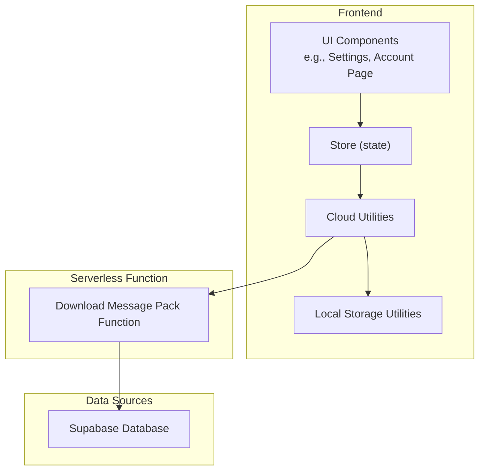
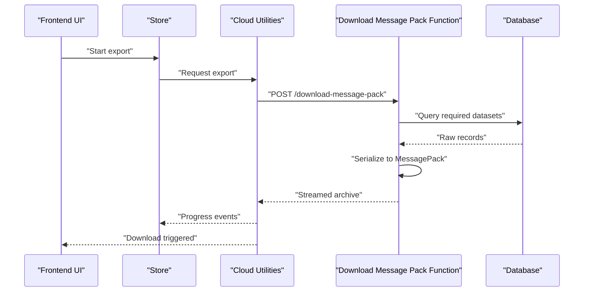
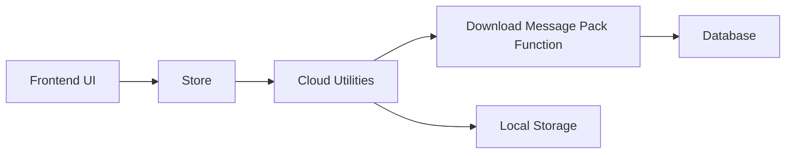

# Utility Functions

<cite>
**Referenced Files in This Document**
- [download-message-pack/index.ts](file://supabase/functions/download-message-pack/index.ts)
- [generate_message_pack.py](file://scripts/generate_message_pack.py)
- [store.jsx](file://src/store.jsx)
- [cloud.js](file://src/lib/cloud.js)
- [storage.js](file://src/lib/storage.js)
- [csv.js](file://src/lib/csv.js)
- [share.js](file://src/lib/share.js)
</cite>

## Table of Contents
1. [Introduction](#introduction)
2. [Project Structure](#project-structure)
3. [Core Components](#core-components)
4. [Architecture Overview](#architecture-overview)
5. [Detailed Component Analysis](#detailed-component-analysis)
6. [Dependency Analysis](#dependency-analysis)
7. [Performance Considerations](#performance-considerations)
8. [Troubleshooting Guide](#troubleshooting-guide)
9. [Conclusion](#conclusion)

## Introduction
This document explains the utility functions that support exporting application data as a MessagePack archive. It focuses on the server-side download endpoint, the client-side orchestration, and the frontend patterns for triggering downloads, handling large exports, and tracking progress. It also covers file format specifications, data structure, compression options, security measures, and best practices.

## Project Structure
The export feature spans three layers:
- Serverless function to assemble and stream the MessagePack archive
- Client utilities to request and handle the download
- Frontend components to trigger exports and show progress

**Diagram sources**
- [download-message-pack/index.ts](file://supabase/functions/download-message-pack/index.ts)
- [cloud.js](file://src/lib/cloud.js)
- [storage.js](file://src/lib/storage.js)
- [store.jsx](file://src/store.jsx)

**Section sources**
- [download-message-pack/index.ts](file://supabase/functions/download-message-pack/index.ts)
- [cloud.js](file://src/lib/cloud.js)
- [storage.js](file://src/lib/storage.js)
- [store.jsx](file://src/store.jsx)

## Core Components
- Download Message Pack Function: Assembles exported data into a MessagePack archive and streams it back to the client with appropriate headers.
- Client Cloud Utilities: Call the serverless function, handle streaming responses, and manage local storage state for progress and status.
- Local Storage Utilities: Persist export state (progress, status, error messages) across sessions.
- CSV Utilities: Provide optional CSV-based exports as an alternative or complementary format.
- Share Utilities: Offer sharing mechanisms that may integrate with export flows.

Key responsibilities:
- Data gathering and serialization into MessagePack
- Streaming response generation
- Progress reporting and error propagation
- File naming, MIME type, and content disposition

**Section sources**
- [download-message-pack/index.ts](file://supabase/functions/download-message-pack/index.ts)
- [cloud.js](file://src/lib/cloud.js)
- [storage.js](file://src/lib/storage.js)
- [csv.js](file://src/lib/csv.js)
- [share.js](file://src/lib/share.js)

## Architecture Overview
The export flow is designed for reliability and scalability:
- The frontend requests an export via the serverless function.
- The function authenticates the user, gathers data from the database, serializes it into MessagePack, and streams the result.
- The client receives a streaming response, updates progress, and triggers the browser download when complete.

**Diagram sources**
- [download-message-pack/index.ts](file://supabase/functions/download-message-pack/index.ts)
- [cloud.js](file://src/lib/cloud.js)
- [store.jsx](file://src/store.jsx)

## Detailed Component Analysis

### Download Message Pack Function
Responsibilities:
- Authenticate and authorize the request using session context.
- Collect all relevant application data for the current user.
- Serialize data into a MessagePack archive.
- Stream the archive to the client with correct headers.
- Handle errors and return meaningful status codes.

File format specification:
- Archive format: MessagePack (.msgpack)
- Content-Type: application/octet-stream
- Content-Disposition: attachment; filename="export.msgpack"

Data structure:
- Top-level object containing named sections for each domain area (for example, users, interviews, offers, scans).
- Each section contains arrays of records with consistent field names and types.
- Timestamps are ISO strings; numeric fields use numbers; boolean fields use booleans.

Compression options:
- Optional gzip compression can be applied before streaming if enabled by configuration.
- If compressed, set Content-Encoding: gzip and adjust filename accordingly.

Security measures:
- Enforce user authentication and row-level access control.
- Validate and sanitize inputs.
- Rate-limit export requests per user.
- Avoid including sensitive fields unless explicitly permitted.

Error handling:
- Return HTTP 401/403 for unauthorized access.
- Return HTTP 429 for rate limiting.
- Return HTTP 500 with structured error details for server failures.

**Section sources**
- [download-message-pack/index.ts](file://supabase/functions/download-message-pack/index.ts)

### Client Cloud Utilities
Responsibilities:
- Build authenticated requests to the serverless function.
- Handle streaming responses and parse progress events.
- Trigger browser download upon completion.
- Manage local storage state for progress and errors.

Streaming behavior:
- Use ReadableStream to process chunks.
- Update progress based on total size and bytes received.
- Abort on network errors or cancellation.

Progress tracking:
- Emit incremental progress updates to the store.
- Persist progress to local storage for resilience.

Large file handling:
- Chunked processing to avoid memory spikes.
- Graceful retry on transient network issues.

**Section sources**
- [cloud.js](file://src/lib/cloud.js)
- [storage.js](file://src/lib/storage.js)

### Local Storage Utilities
Responsibilities:
- Persist export state (status, progress, error message, timestamp).
- Provide getters/setters for export-related keys.
- Clean up stale entries after successful downloads.

State schema:
- status: "idle" | "in_progress" | "completed" | "error"
- progress: number (0–100)
- error: string | null
- lastUpdated: timestamp

**Section sources**
- [storage.js](file://src/lib/storage.js)

### CSV Utilities
Responsibilities:
- Convert tabular data to CSV strings.
- Provide helpers for escaping and encoding.
- Support optional zipped CSV archives.

Use cases:
- Alternative export format for compatibility.
- Preprocessing step before MessagePack assembly.

**Section sources**
- [csv.js](file://src/lib/csv.js)

### Share Utilities
Responsibilities:
- Generate shareable links or payloads.
- Integrate with export flows for quick sharing.

Integration points:
- May reference exported artifacts or temporary URLs.

**Section sources**
- [share.js](file://src/lib/share.js)

### MessagePack Generation Script
Purpose:
- Provide a deterministic generator for sample MessagePack archives used in tests or demos.
- Ensure consistency between server serialization and client expectations.

Usage:
- Run script to produce a .msgpack fixture.
- Compare fixtures against generated output during validation.

**Section sources**
- [generate_message_pack.py](file://scripts/generate_message_pack.py)

## Dependency Analysis
The export feature depends on:
- Authentication and authorization middleware within the serverless function runtime.
- Database queries scoped to the authenticated user.
- Client-side streaming libraries and local storage APIs.

**Diagram sources**
- [download-message-pack/index.ts](file://supabase/functions/download-message-pack/index.ts)
- [cloud.js](file://src/lib/cloud.js)
- [storage.js](file://src/lib/storage.js)
- [store.jsx](file://src/store.jsx)

**Section sources**
- [download-message-pack/index.ts](file://supabase/functions/download-message-pack/index.ts)
- [cloud.js](file://src/lib/cloud.js)
- [storage.js](file://src/lib/storage.js)
- [store.jsx](file://src/store.jsx)

## Performance Considerations
- Streaming: Prefer streaming over buffering entire archives in memory.
- Compression: Enable gzip for large exports to reduce bandwidth.
- Pagination: For very large datasets, consider paginated exports or segmented archives.
- Caching: Cache frequently accessed reference data to speed up serialization.
- Backpressure: Respect backpressure in streaming to prevent memory growth.
- Timeouts: Set reasonable timeouts and implement retries for long-running exports.

[No sources needed since this section provides general guidance]

## Troubleshooting Guide
Common issues and resolutions:
- Unauthorized access: Verify session validity and permissions.
- Rate limiting: Implement exponential backoff and queueing.
- Large file timeouts: Switch to chunked downloads or segmented archives.
- Corrupted archives: Validate checksums and re-export if necessary.
- Progress not updating: Check streaming event parsing and local storage persistence.

Operational checks:
- Confirm Content-Type and Content-Disposition headers.
- Validate MessagePack schema against expected structure.
- Inspect server logs for query performance bottlenecks.

**Section sources**
- [download-message-pack/index.ts](file://supabase/functions/download-message-pack/index.ts)
- [cloud.js](file://src/lib/cloud.js)
- [storage.js](file://src/lib/storage.js)

## Conclusion
The export utility provides a robust, secure, and scalable way to deliver application data as a MessagePack archive. By leveraging streaming, compression, and clear error handling, it supports both small and large exports while maintaining a responsive user experience. Follow the guidelines here to implement reliable downloads, track progress, and protect user data.