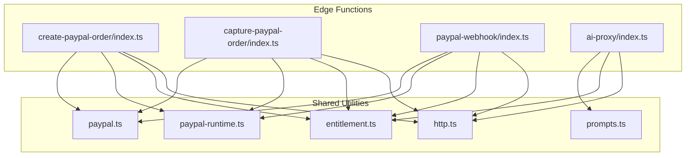
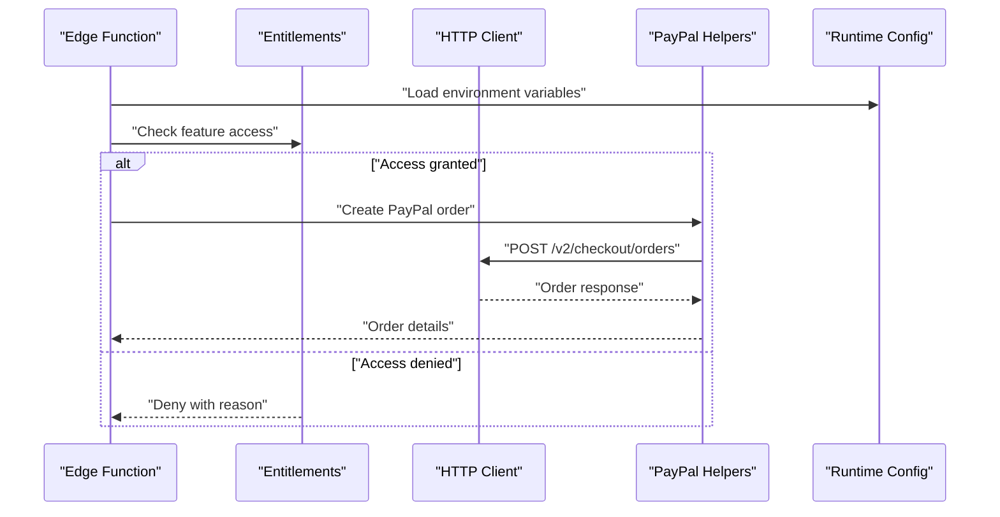
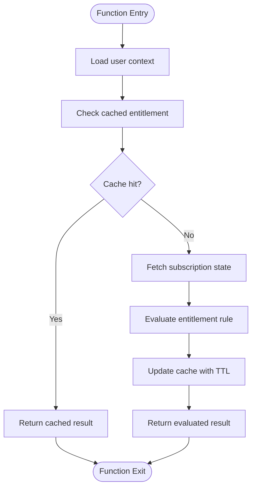
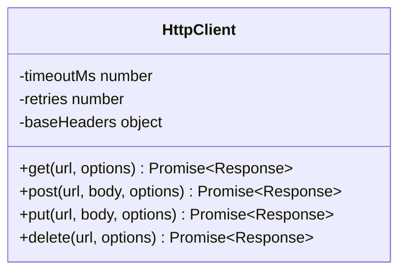
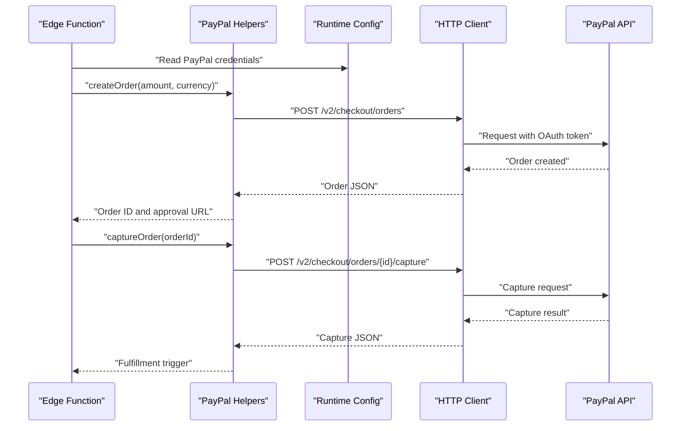
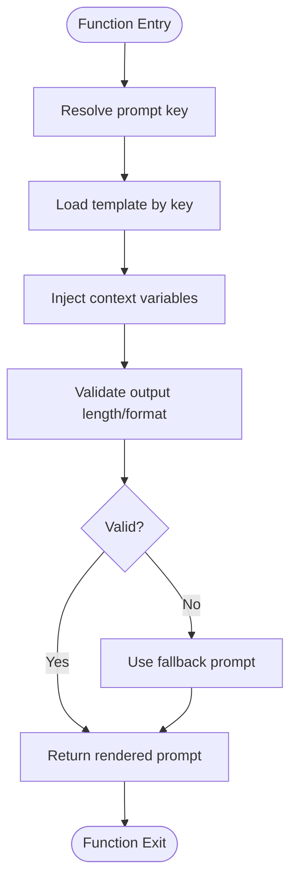
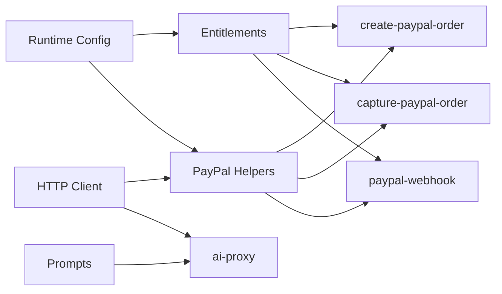

# Shared Utilities Library

<cite>
**Referenced Files in This Document**
- [entitlement.ts](file://supabase/functions/_shared/entitlement.ts)
- [http.ts](file://supabase/functions/_shared/http.ts)
- [paypal.ts](file://supabase/functions/_shared/paypal.ts)
- [paypal-runtime.ts](file://supabase/functions/_shared/paypal-runtime.ts)
- [prompts.ts](file://supabase/functions/_shared/prompts.ts)
- [create-paypal-order/index.ts](file://supabase/functions/create-paypal-order/index.ts)
- [capture-paypal-order/index.ts](file://supabase/functions/capture-paypal-order/index.ts)
- [paypal-webhook/index.ts](file://supabase/functions/paypal-webhook/index.ts)
- [ai-proxy/index.ts](file://supabase/functions/ai-proxy/index.ts)
</cite>

## Table of Contents
1. [Introduction](#introduction)
2. [Project Structure](#project-structure)
3. [Core Components](#core-components)
4. [Architecture Overview](#architecture-overview)
5. [Detailed Component Analysis](#detailed-component-analysis)
6. [Dependency Analysis](#dependency-analysis)
7. [Performance Considerations](#performance-considerations)
8. [Troubleshooting Guide](#troubleshooting-guide)
9. [Conclusion](#conclusion)
10. [Appendices](#appendices)

## Introduction
This document describes the shared utilities library used across Supabase Edge Functions for ApplyGuard PH. It focuses on:
- Entitlement system for feature access control
- HTTP client utilities for external API calls
- PayPal integration helpers and runtime configuration
- Prompt management for AI features
- Runtime configuration utilities

It also explains common patterns, error handling strategies, logging approaches, testing methodologies, usage examples, best practices, and guidelines for extending the library.

## Project Structure
The shared utilities live under supabase/functions/_shared and are consumed by multiple edge functions. The key modules are:
- entitlement.ts: Feature entitlement checks and caching
- http.ts: Typed HTTP client with retries and timeouts
- paypal.ts and paypal-runtime.ts: PayPal client and runtime configuration
- prompts.ts: Centralized prompt templates and resolution logic

Edge functions that consume these utilities include:
- create-paypal-order/index.ts
- capture-paypal-order/index.ts
- paypal-webhook/index.ts
- ai-proxy/index.ts

**Diagram sources**
- [entitlement.ts](file://supabase/functions/_shared/entitlement.ts)
- [http.ts](file://supabase/functions/_shared/http.ts)
- [paypal.ts](file://supabase/functions/_shared/paypal.ts)
- [paypal-runtime.ts](file://supabase/functions/_shared/paypal-runtime.ts)
- [prompts.ts](file://supabase/functions/_shared/prompts.ts)
- [create-paypal-order/index.ts](file://supabase/functions/create-paypal-order/index.ts)
- [capture-paypal-order/index.ts](file://supabase/functions/capture-paypal-order/index.ts)
- [paypal-webhook/index.ts](file://supabase/functions/paypal-webhook/index.ts)
- [ai-proxy/index.ts](file://supabase/functions/ai-proxy/index.ts)

**Section sources**
- [entitlement.ts](file://supabase/functions/_shared/entitlement.ts)
- [http.ts](file://supabase/functions/_shared/http.ts)
- [paypal.ts](file://supabase/functions/_shared/paypal.ts)
- [paypal-runtime.ts](file://supabase/functions/_shared/paypal-runtime.ts)
- [prompts.ts](file://supabase/functions/_shared/prompts.ts)
- [create-paypal-order/index.ts](file://supabase/functions/create-paypal-order/index.ts)
- [capture-paypal-order/index.ts](file://supabase/functions/capture-paypal-order/index.ts)
- [paypal-webhook/index.ts](file://supabase/functions/paypal-webhook/index.ts)
- [ai-proxy/index.ts](file://supabase/functions/ai-proxy/index.ts)

## Core Components
- Entitlements: Provides a consistent way to check whether a user has access to a feature, including caching and fallback behavior.
- HTTP Client: A typed wrapper around fetch with configurable timeouts, retries, and structured error responses.
- PayPal Helpers: Encapsulates PayPal order creation, capture, and webhook processing with environment-driven configuration.
- Prompts: Centralizes prompt templates and provides helpers to resolve and render prompts for AI features.
- Runtime Configuration: Supplies safe access to environment variables and defaults for edge functions.

Common patterns:
- All public APIs return structured results with explicit success/failure states.
- Errors are normalized and logged consistently.
- External calls are wrapped with timeouts and retries where appropriate.
- Environment variables are validated at startup or first use.

**Section sources**
- [entitlement.ts](file://supabase/functions/_shared/entitlement.ts)
- [http.ts](file://supabase/functions/_shared/http.ts)
- [paypal.ts](file://supabase/functions/_shared/paypal.ts)
- [paypal-runtime.ts](file://supabase/functions/_shared/paypal-runtime.ts)
- [prompts.ts](file://supabase/functions/_shared/prompts.ts)

## Architecture Overview
The shared utilities form a cohesive layer between edge functions and external services (PayPal, AI providers). They standardize:
- Authentication context propagation
- Feature gating via entitlements
- Reliable outbound networking
- Consistent prompt rendering for AI flows

**Diagram sources**
- [entitlement.ts](file://supabase/functions/_shared/entitlement.ts)
- [http.ts](file://supabase/functions/_shared/http.ts)
- [paypal.ts](file://supabase/functions/_shared/paypal.ts)
- [paypal-runtime.ts](file://supabase/functions/_shared/paypal-runtime.ts)
- [create-paypal-order/index.ts](file://supabase/functions/create-paypal-order/index.ts)

## Detailed Component Analysis

### Entitlement System
Purpose:
- Gate access to premium features based on subscription status or other criteria.
- Provide caching to reduce repeated checks.
- Return deterministic, testable results.

Key responsibilities:
- Resolve user identity and subscription state.
- Evaluate entitlement rules per feature.
- Cache results with TTL and invalidation hooks.
- Normalize errors and log outcomes.

Typical usage pattern:
- Import the entitlement checker from the shared module.
- Call the checker with the current user context and target feature.
- Handle both allowed and denied branches explicitly.

**Diagram sources**
- [entitlement.ts](file://supabase/functions/_shared/entitlement.ts)

**Section sources**
- [entitlement.ts](file://supabase/functions/_shared/entitlement.ts)

### HTTP Client Utilities
Purpose:
- Provide a consistent, typed HTTP client for outbound requests.
- Enforce timeouts, retries, and structured error handling.

Key responsibilities:
- Configure base URL, headers, and auth tokens.
- Wrap fetch with timeout and retry policies.
- Normalize network and server errors into a uniform shape.
- Emit logs with request metadata for observability.

Typical usage pattern:
- Initialize the client with environment-specific settings.
- Use typed methods for GET/POST/PUT/DELETE.
- Handle structured error responses and propagate them to callers.

**Diagram sources**
- [http.ts](file://supabase/functions/_shared/http.ts)

**Section sources**
- [http.ts](file://supabase/functions/_shared/http.ts)

### PayPal Integration Helpers
Purpose:
- Simplify interactions with PayPal’s REST APIs for order lifecycle.
- Centralize configuration and secrets management.
- Provide helpers for creating orders, capturing payments, and validating webhooks.

Key responsibilities:
- Build authenticated requests using OAuth credentials.
- Create and capture PayPal orders with idempotency support.
- Validate webhook signatures and payloads.
- Map PayPal statuses to internal states.

Typical usage pattern:
- Import PayPal helpers and runtime config.
- Use createOrder() and captureOrder() in checkout flows.
- Process webhooks with validateWebhook() before fulfillment.

**Diagram sources**
- [paypal.ts](file://supabase/functions/_shared/paypal.ts)
- [paypal-runtime.ts](file://supabase/functions/_shared/paypal-runtime.ts)
- [http.ts](file://supabase/functions/_shared/http.ts)
- [create-paypal-order/index.ts](file://supabase/functions/create-paypal-order/index.ts)
- [capture-paypal-order/index.ts](file://supabase/functions/capture-paypal-order/index.ts)

**Section sources**
- [paypal.ts](file://supabase/functions/_shared/paypal.ts)
- [paypal-runtime.ts](file://supabase/functions/_shared/paypal-runtime.ts)
- [create-paypal-order/index.ts](file://supabase/functions/create-paypal-order/index.ts)
- [capture-paypal-order/index.ts](file://supabase/functions/capture-paypal-order/index.ts)
- [paypal-webhook/index.ts](file://supabase/functions/paypal-webhook/index.ts)

### Prompt Management for AI Features
Purpose:
- Centralize prompt templates and dynamic content injection.
- Ensure consistency across AI-powered features.
- Provide helpers to resolve and render prompts safely.

Key responsibilities:
- Store prompt templates keyed by feature or scenario.
- Inject contextual variables (user data, conversation history).
- Validate rendered prompts against constraints.
- Log prompt versions for auditability.

Typical usage pattern:
- Import prompt resolver from the shared module.
- Request a prompt by key with context variables.
- Pass the resolved prompt to the AI provider.

**Diagram sources**
- [prompts.ts](file://supabase/functions/_shared/prompts.ts)
- [ai-proxy/index.ts](file://supabase/functions/ai-proxy/index.ts)

**Section sources**
- [prompts.ts](file://supabase/functions/_shared/prompts.ts)
- [ai-proxy/index.ts](file://supabase/functions/ai-proxy/index.ts)

### Runtime Configuration Utilities
Purpose:
- Provide safe access to environment variables with validation and defaults.
- Centralize configuration loading for edge functions.

Key responsibilities:
- Read required variables and fail fast if missing.
- Expose typed getters for URLs, keys, and flags.
- Support different environments (dev/staging/prod).

Typical usage pattern:
- Import the runtime config module.
- Access values via typed getters.
- Guard critical paths with explicit checks.

**Section sources**
- [paypal-runtime.ts](file://supabase/functions/_shared/paypal-runtime.ts)

## Dependency Analysis
The shared utilities have clear separation of concerns and minimal coupling:
- Entitlements depend on runtime configuration and may use the HTTP client for remote checks.
- PayPal helpers depend on the HTTP client and runtime configuration.
- Prompts are self-contained and only depend on runtime configuration for versioning or feature flags.
- Edge functions compose these utilities to implement business workflows.

**Diagram sources**
- [entitlement.ts](file://supabase/functions/_shared/entitlement.ts)
- [http.ts](file://supabase/functions/_shared/http.ts)
- [paypal.ts](file://supabase/functions/_shared/paypal.ts)
- [paypal-runtime.ts](file://supabase/functions/_shared/paypal-runtime.ts)
- [prompts.ts](file://supabase/functions/_shared/prompts.ts)
- [create-paypal-order/index.ts](file://supabase/functions/create-paypal-order/index.ts)
- [capture-paypal-order/index.ts](file://supabase/functions/capture-paypal-order/index.ts)
- [paypal-webhook/index.ts](file://supabase/functions/paypal-webhook/index.ts)
- [ai-proxy/index.ts](file://supabase/functions/ai-proxy/index.ts)

**Section sources**
- [entitlement.ts](file://supabase/functions/_shared/entitlement.ts)
- [http.ts](file://supabase/functions/_shared/http.ts)
- [paypal.ts](file://supabase/functions/_shared/paypal.ts)
- [paypal-runtime.ts](file://supabase/functions/_shared/paypal-runtime.ts)
- [prompts.ts](file://supabase/functions/_shared/prompts.ts)
- [create-paypal-order/index.ts](file://supabase/functions/create-paypal-order/index.ts)
- [capture-paypal-order/index.ts](file://supabase/functions/capture-paypal-order/index.ts)
- [paypal-webhook/index.ts](file://supabase/functions/paypal-webhook/index.ts)
- [ai-proxy/index.ts](file://supabase/functions/ai-proxy/index.ts)

## Performance Considerations
- Entitlement caching: Use short TTLs and invalidate on relevant events to balance freshness and latency.
- HTTP retries: Limit retries and backoff to avoid cascading failures; prefer idempotent operations.
- Timeouts: Set conservative timeouts for external calls to prevent long-running edge functions.
- Prompt size: Keep prompts concise and within provider limits; pre-validate lengths.
- Environment reads: Cache environment values at function startup to avoid repeated lookups.

[No sources needed since this section provides general guidance]

## Troubleshooting Guide
Common issues and resolutions:
- Missing environment variables: Fail fast during initialization and surface clear messages.
- PayPal signature verification failures: Verify payload hashing and timestamp handling; ensure correct secret is configured.
- HTTP timeouts or rate limits: Increase timeouts cautiously, add exponential backoff, and monitor upstream health.
- Entitlement cache staleness: Adjust TTL and implement invalidation triggers when subscription state changes.
- Prompt rendering errors: Validate variable presence and sanitize inputs; provide fallback prompts.

Logging approach:
- Include correlation IDs in all logs.
- Log request/response summaries without sensitive data.
- Separate debug-level logs from production warnings/errors.

Testing methodology:
- Unit tests for entitlement rules and prompt rendering.
- Mock HTTP client for PayPal endpoints and AI providers.
- Snapshot tests for prompt outputs to detect unintended changes.
- Contract tests for webhook payloads and signatures.

**Section sources**
- [paypal.ts](file://supabase/functions/_shared/paypal.ts)
- [paypal-runtime.ts](file://supabase/functions/_shared/paypal-runtime.ts)
- [http.ts](file://supabase/functions/_shared/http.ts)
- [entitlement.ts](file://supabase/functions/_shared/entitlement.ts)
- [prompts.ts](file://supabase/functions/_shared/prompts.ts)

## Conclusion
The shared utilities library standardizes feature gating, networking, payment integrations, and AI prompt management across ApplyGuard PH’s edge functions. By adopting consistent patterns for error handling, logging, and configuration, teams can build reliable, maintainable features with confidence. Extending the library should follow the same structure: small, focused modules with clear contracts, robust error handling, and comprehensive tests.

[No sources needed since this section summarizes without analyzing specific files]

## Appendices

### Usage Examples
- Importing entitlements:
  - Import the entitlement checker and call it with user context and feature key.
  - Branch on allowed/denied results and proceed accordingly.
- Using the HTTP client:
  - Initialize with base URL and headers.
  - Use typed methods for GET/POST and handle structured errors.
- PayPal helpers:
  - Create an order via createOrder(), then capture via captureOrder().
  - Validate webhooks before fulfilling payments.
- Prompt management:
  - Resolve a prompt by key with context variables and pass to AI provider.
- Runtime configuration:
  - Access environment variables via typed getters and guard critical paths.

[No sources needed since this section provides general guidance]

### Best Practices
- Prefer small, single-responsibility modules.
- Always validate environment variables at startup.
- Normalize errors and include actionable messages.
- Add correlation IDs to logs and traces.
- Keep external calls idempotent and time-bounded.
- Write unit and contract tests for all public APIs.

[No sources needed since this section provides general guidance]

### Guidelines for Extending the Library
- Define clear interfaces and types for new utilities.
- Follow existing error and logging conventions.
- Provide default configurations and allow overrides.
- Add tests alongside implementation.
- Document usage patterns and example imports.

[No sources needed since this section provides general guidance]